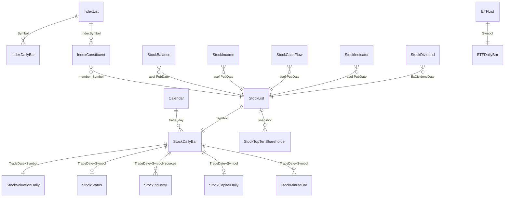

# COS A股数据字典（lqtp_data）— AI 完整版

```yaml
doc_role: machine_readable_ashare_data_dictionary
audience: AI_agents_without_COS_or_local_data_access
purpose: 不看任何实际数据文件，也能正确理解全部 A 股 COS 清洗表的布局、时间语义、字段含义、单位与拼接方式
bucket: qs-cold
cos_root: cos://qs-cold/clean_data/ashare/lqtp_data/
vendor_pipeline: LQTP / 聚源类清洗落盘（PascalCase 字段）
format: Parquet (Arrow)
tables: 20
approx_fields: 409
supplement_sections: [4.7-4.22, 11, 12]
detail_level: deep_enums_units_grain_er
generated: 2026-08-02T14:44:51Z
schema_verified: parquet_pyarrow_live_sample_2024-06-03_and_2024-04-30
coverage_verified: clean-cos-ro_ls_2026-08-02
currency: CNY
instrument_id: Symbol  # 例 000001.SZ / 600000.SH；当前 COS 实测仅 .SH/.SZ
timezone_quotes: QuoteTime 存 UTC；A股交易时段按 Asia/Shanghai (UTC+8)
updated: 2026-08-08T02:00:00+0800
gaps_filled: C23_C26_full_2026-08-08
second_audit: C26_div_enums_shares_grain_aux_samples
factor_semantics_corrected: 2026-08-08_backward_Close_times_Factor
schema_rechecked: 2026-08-08_unit_matrix_C16_C18
p1_p2_closed: C24_2026-08-08
us_companion: /home/shw/COS_us_massive_data_dictionary.md
cross_market_section: CROSS_MARKET_BRIDGE
sole_deliverables: [COS_ashare_lqtp_data_dictionary.md, COS_us_massive_data_dictionary.md]
merged_from: [COS_clean_data_catalog.md, COS_field_registry.json]
machine_registry_section: MACHINE_FIELD_REGISTRY
readme_for_ai: |
  除 §5 全字段字典外，务必读 §4.7–4.22（粒度/单位/板块/枚举/缺失/指数清单）
  与 §11–12（字段族与自检题）。这些补充决定会不会写错 join 与单位。
not_included:
  - A股中文新闻 / 公告全文（COS 无）
  - Tick / Level2
  - 北交所 .BJ（当前 COS 面板未见）
  - 因子湖 / 派生 universe（见文末「非 COS 表」）
  - 美股细节正文见配对文档（不是「没有美股」）
```

## 0. AI 阅读协议（必读）

```text
STEP 1  读 §1 HARD_RULES（单位、PIT、禁止事项）
STEP 2  用 §2 TABLE_INDEX 找到表 → 记下 model（D1/S1/E1/MINUTE/STATIC）
STEP 3  按 model 选 join：D1/S1 → equi；E1 财报 → asof(PubDate)；分红 → ExDividendDate 且 effective_time_only
STEP 4  读 §4.7–4.22 补充细则（粒度/单位/枚举/缺失）——比字段表更易写错
STEP 5  打开 §5 FIELD_DICTS 查每个字段的 type / zh / unit / caution
STEP 6  写代码前跑 §6 CHECKLIST；可用 §12 十题自检
STEP 7  需要 data_access 数据集名时查 §7
STEP 8  若涉及美股/跨市场：读文末 CROSS_MARKET_BRIDGE，并打开 us_companion
STEP 9  美股/英文新闻：只在 us_companion 的 NEWS_RAWDATA 节（A股 clean 无新闻表）
STEP 10 机器字段表：文末 MACHINE_FIELD_REGISTRY 节
STEP 9  写任何收益率/换手/ROE/股息因子前：强制读 §4.8 与 Bridge **§C16 单位归一**
```

---

## 1. HARD_RULES

### 1.1 市场口径（A股）

| 项目 | 规则 |
|------|------|
| 标的键 | `Symbol`，**必须**带交易所后缀。当前 COS 实测仅 **`.SH` / `.SZ`**（北交所 `.BJ` 未见入库） |
| 指数代码 | 常见 `.SH`/`.SZ`；`IndexList` 另有大量 `.CSI`（中证/上证系列别名），与 `.SH` 可能并存同号不同后缀 |
| 日期类型 | Arrow `date32`；文件名 `YYYY-MM-DD.parquet` |
| 货币 | 人民币 CNY；价单位一般为「元/股」；金额「元」；股本「股」 |
| 日收益 `Return` | **基点 bp**：`Return = (Close/PreClose − 1) × 10000`。用前必须 `/10000` 才是小数收益。2024-06-03 全日验证误差 = 0 |
| 复权 `Factor` | **累积后复权因子**：`后复权价 = Close × Factor`（2026-08-08 除权日验证）。前复权需 `Close×Factor/Factor_asof`。与美股 `AdjFactor` 同为乘法，仍禁止混用 |
| 估值比率 | `TurnoverRatio`、`DividendRatio` 为**百分数 %**；`PeRatio`/`PbRatio`/`PsRatio`/`PcfRatio*` 为**倍数** |
| 财务比率 | `StockIndicator` 中 ROE/ROA/利润率/同比增速均为**百分数 %**（非小数） |
| 持股比例 | `ShareRatio` 为**百分数 %** |
| 指数权重 | `Weight` 为**百分数**，同指数求和 ≈ 100 |
| 财报可知时点 | **`PubDate`（公告日）**；文件名日期 = PubDate；**不是** `ReportPeriodEndDate` |
| 分红可知时点 | **无可靠公告时间**；文件按 `ExDividendDate` 切；契约标记 `effective_time_only`，默认禁止当严格 PIT |
| 缺失值 | 未披露/不适用为 **NaN**；**禁止把财务 NaN 填 0** |
| 新闻 | **无** A 股中文新闻表 |
| 跨市场 | 与美股字段/表对照见文末 **CROSS_MARKET_BRIDGE**；配对文档 `COS_us_massive_data_dictionary.md` |
| 单位归一 | 挖因子前读 **§4.8** 与 Bridge **§C16**：A股 `%/bp` → 小数；美股收益/收益率字段多已是小数，**禁止再 /100** |


> **复权口径更正（2026-08-08 实盘）**：A股 `Factor` **不是**「前复权价=Close/Factor」。  
> 在 2024-06-03 共 15 个除权/送转样本上：`Close×Factor` 的日变动与 `Close/PreClose−1` 中位绝对误差 ≈ **0**；`Close/Factor` 在除权日出现巨大跳跃。  
> 因此契约为：**后复权价 = Close × Factor**（累积因子随送转/分红增大）。若需要前复权价，用同一套因子做  
> `前复权价 = Close × Factor / Factor_asof`（`Factor_asof` 为研究截止日该股 Factor）。  
> 美股 `AdjFactor` 同样是乘法后复权；**公式同类，仍禁止当同一列混用**（基期/公司行为覆盖不同）。

### 1.2 MUST / MUST_NOT

```text
MUST:
  - decimal_return = Return / 10000
  - adj_close_backward = Close * Factor；前复权再用 / Factor_asof
  - 财报表（Balance/Income/CashFlow/Indicator）用 merge_asof(..., right_on=PubDate, direction="backward")
  - 行业表先 filter 单一 IndustrySource（推荐 sw_l1）再 join，否则行数×6
  - 停牌过滤：IsSuspend == False；风险股可结合 PublicStatus 排除 ST/*ST/终止上市
  - 分红仅在允许 effective_time 时按 ExDividendDate 使用
  - 同一 PubDate 可能有多份报告期（年报+一季报等）→ 先定 period_selection 策略

MUST_NOT:
  - 把财报文件的日期当成「全市场交易日截面」做 equi-join 到日线
  - 用 ReportPeriodEndDate 当 PIT 可知时间
  - 把 Return / TurnoverRatio / Roe / ShareRatio / Weight 当小数直接用（除 Weight 求和校验外）
  - 混用美股字段名（Ticker、Ret、AdjFactor、VWAP 全大写）
  - 把美股 Ret 的单位语义套到 A股 Return（或反之）
  - 用 Close/Factor 当 A股连续复权价（错误；应为 Close*Factor）
  - 假设美股也有可用的 StockIndustry/StockStatus/涨跌停
  - 假设两边的 StockValuationDaily 都是全历史 D1
  - 假设 StockCapitalDaily 是拆股事件表（那是美股语义；A股是 S1 股本快照）
  - 在 clean_data/ashare 下找新闻
```

### 1.3 时间模型

| model | 文件日期含义 | 行内容 | 可直接做日面板？ | join |
|-------|-------------|--------|------------------|------|
| `D1` | 交易日 | 近似全市场截面 | 是 | equi(TradeDate, Symbol) |
| `S1` | 快照日 | 每标的最新状态（已前填） | 是（状态面板） | equi |
| `E1` | 公告日 PubDate | **仅当日有公告的公司** | **否** | asof(PubDate) |
| `E1/effective` | 除权日等 | 事件行 | 否 | 显式事件对齐 |
| `MINUTE` | 交易日 | 分钟 bar | 否（分钟轴） | QuoteTime |
| `STATIC` | 全量单文件 | 维表 | n/a | 全读 |

### 1.4 访问方式

```bash
# 只读 clean_data
clean-cos-ro ls cos://qs-cold/clean_data/ashare/lqtp_data/
clean-cos-ro cp cos://qs-cold/clean_data/ashare/lqtp_data/StockDailyBar/2024-06-03.parquet ./

# 批量镜像
bash ~/quant_projects/scripts/sync_ashare_lqtp_cos.sh                 # 全部 20 表
bash ~/quant_projects/scripts/sync_ashare_lqtp_cos.sh StockDailyBar    # 单表

# Python
from data_access import get_store
df = get_store().read_frame(
    "ashare_stock_daily",
    columns=["TradeDate","Symbol","Close","Return"],
    time_range=("2024-01-01","2024-01-31"),
)
# 因子语义入口会自动把 Return /10000；原始 read_frame 保留供应商单位
```

本地镜像根：`~/quant_projects/data/a_share/lqtp_data/`（可能不完整，缺表时由 data_access 按需 pull）。

---

## 2. TABLE_INDEX（覆盖已用 clean-cos-ro 于 2026-08-02 核实）

| 表 | model | 字段数 | COS 文件数 | 文件日期跨度 | join 策略 |
|----|-------|------:|----------:|--------------|-----------|
| `Calendar` | `STATIC` | 3 | 1 | full → full | read_full |
| `StockDailyBar` | `D1` | 16 | 2569 | 2016-01-04 → 2026-07-31 | equi(TradeDate,Symbol) |
| `StockMinuteBar` | `MINUTE` | 11 | 2568 | 2016-01-04 → 2026-07-31 | minute(QuoteTime,Symbol) |
| `StockList` | `D1` | 6 | 3867 | 2016-01-01 → 2026-08-02 | equi |
| `StockStatus` | `S1` | 12 | 3867 | 2016-01-01 → 2026-08-02 | equi state_ready |
| `StockIndustry` | `D1` | 6 | 3867 | 2016-01-01 → 2026-08-02 | equi + filter IndustrySource |
| `StockValuationDaily` | `D1` | 19 | 2569 | 2016-01-04 → 2026-07-31 | equi |
| `StockCapitalDaily` | `S1` | 7 | 3818 | 2016-01-01 → 2026-06-14 | equi state_ready |
| `StockBalance` | `E1` | 111 | 4490 | 2003-04-22 → 2026-08-01 | asof(PubDate) |
| `StockIncome` | `E1` | 53 | 4104 | 2003-04-22 → 2026-08-01 | asof(PubDate) |
| `StockCashFlow` | `E1` | 59 | 3216 | 2003-04-22 → 2026-08-01 | asof(PubDate) |
| `StockIndicator` | `E1` | 36 | 3208 | 2003-04-22 → 2026-08-01 | asof(PubDate) |
| `StockDividend` | `E1/effective` | 8 | 1874 | 2016-01-14 → 2026-07-31 | event on ExDividendDate (effective_time_only) |
| `StockTopTenShareholder` | `S1` | 18 | 3867 | 2016-01-01 → 2026-08-02 | equi state_ready |
| `StockTopTenFloatShareholder` | `S1` | 16 | 3867 | 2016-01-01 → 2026-08-02 | equi state_ready |
| `ETFDailyBar` | `D1` | 16 | 2568 | 2016-01-04 → 2026-07-31 | equi |
| `ETFList` | `D1` | 6 | 3867 | 2016-01-01 → 2026-08-02 | equi |
| `IndexDailyBar` | `D1` | 11 | 2569 | 2016-01-04 → 2026-07-31 | equi |
| `IndexList` | `D1` | 6 | 3867 | 2016-01-01 → 2026-08-02 | equi |
| `IndexConstituent` | `D1` | 5 | 3867 | 2016-01-01 → 2026-08-02 | equi (IndexSymbol,Symbol) |

**说明**
- `StockList/Status/Industry/TopTen*/ETFList/IndexList/IndexConstituent` 含**自然日**文件（含周末），不只交易日。
- 行情/估值 `StockDailyBar` 等大致对齐交易日（2016-01-04 起）。
- 财报自 **2003-04-22** 起按公告日落文件；早期日线没有对应行情。
- `StockCapitalDaily` 当前最末日约 **2026-06-14**，滞后于行情（2026-07-31）。
- `Calendar` 为单文件 `full.parquet`，覆盖更新。

---

## 3. 目录树与命名

```text
cos://qs-cold/clean_data/ashare/lqtp_data/
├── Calendar/full.parquet                          # STATIC
├── StockDailyBar/{YYYY-MM-DD}.parquet             # D1 交易日
├── StockMinuteBar/{YYYY-MM-DD}.parquet            # MINUTE
├── StockList|StockStatus|StockIndustry/...          # 按自然日
├── StockValuationDaily|ETFDailyBar|IndexDailyBar/ # D1 交易日
├── StockCapitalDaily/                             # S1
├── StockBalance|Income|CashFlow|Indicator/        # E1，文件名=PubDate
├── StockDividend/                                 # 文件名=ExDividendDate（已核实 100% 对齐）
├── StockTopTenShareholder|StockTopTenFloatShareholder/
├── ETFList|IndexList|IndexConstituent/
```

`raw_data/ashare/`：**空**。无未清洗 A 股原始落盘前缀。

---

## 4. JOIN 菜谱与实测算例

### 4.1 标准日频研究面板

```text
StockDailyBar[D1]
  ⋈ StockValuationDaily[D1]     on (TradeDate, Symbol)     # 市值/PE/换手
  ⋈ StockStatus[S1]             on (TradeDate, Symbol)     # PublicStatus
  ⋈ StockIndustry[D1]           on (TradeDate, Symbol)
       WHERE IndustrySource = 'sw_l1'                      # 必须单源
  ⋈ StockCapitalDaily[S1]       on (TradeDate, Symbol)     # 可选；注意更新滞后
  ∥ asof StockIncome|Balance|CashFlow|Indicator on PubDate # 可选财务
```

### 4.2 财务 asof（正确写法）

```python
# WRONG — 财报不是每日全市场截面
daily.merge(balance, on=["TradeDate", "Symbol"], how="left")

# RIGHT
bal = concat_all_partitions("StockBalance")  # 文件名日期 = PubDate
bal = bal.sort_values(["Symbol", "PubDate", "ReportPeriodEndDate"])
# 同一 PubDate 多报告期：按研究选择 latest_period / 只要年报等
latest = bal.sort_values("ReportPeriodEndDate").groupby(
    ["Symbol", "PubDate"], as_index=False
).tail(1)
import pandas as pd
pd.merge_asof(
    daily.sort_values("TradeDate"),
    latest.sort_values("PubDate"),
    left_on="TradeDate",
    right_on="PubDate",
    by="Symbol",
    direction="backward",  # PubDate <= TradeDate
)
```

严格 PIT 推荐：`PubDate <= decision_timestamp`，并按 `period_selection="latest_period"`（取可知范围内最大报告期的最新版本），避免「最近一次公告」在旧报告期修订时回滚状态。

### 4.3 分钟线

- 单日约 **240** 根/股（连续竞价分钟）。
- `QuoteTime` 为 **UTC**；北京时间 = UTC+8。
- 实测 CST 时段：**09:31–11:30** 与 **13:01–15:00**（共 240 个分钟标签；午休无 bar）。
- 不要把分钟表当 D1 截面 equi-join。

### 4.4 指数成分

```text
IndexConstituent: 键 = (TradeDate, IndexSymbol, Symbol)，字段 Weight(%)
例：IndexSymbol='000300.SH' 时 Σ Weight ≈ 100.003
注意 IndexList 中可能同时存在 000001.SH（上证指数）与 000001.CSI（上证综合指数）
```

### 4.5 2024-06-03 截面量级（便于估资源）

| 表 | 行数 | 标的数 |
|----|-----:|-------:|
| StockDailyBar | 5115 | 5115 |
| StockValuationDaily | 5115 | — |
| StockList | 5115 | — |
| StockStatus | 5488 | — |
| StockIndustry | 30687 | 5115（约×6 源） |
| StockMinuteBar | 1227600 | 5115 |
| ETFDailyBar | 1351 | 1351 |
| IndexDailyBar | 1316 | 1316 |
| IndexConstituent | 12298 | 指数数=11 |
| StockTopTenShareholder | 105643 | 约每标的中位 10.0 行 |
| StockBalance (2024-04-30 公告日) | 1821 | 1333 |

StockDailyBar 后缀分布（2024-06-03）：`{".SZ": 2847, ".SH": 2268}`

### 4.6 枚举实测（2024-06-03）

**PublicStatus**（StockStatus）：
```json
{
  "正常上市": 4986,
  "终止上市": 254,
  "*ST": 90,
  "ST": 85,
  "已发行未上市": 34,
  "预披露": 18,
  "暂缓发行": 10,
  "未过会": 9,
  "发行失败": 1,
  "进入退市整理期": 1
}
```

**IndustrySource**（每股通常 6 行）：
```json
{
  "sw_l2": 5115,
  "sw_l1": 5115,
  "sw_l3": 5115,
  "zjw": 5115,
  "jq_l1": 5114,
  "jq_l2": 5113
}
```

允许过滤集合（契约）：`sw_l1, sw_l2, sw_l3, zjw, jq_l1, jq_l2`。

**送转口径例**（StockDividend 2024-06-07）：`300109.SZ` CashDividend=1.0, StockDividend=0.2, StockTransfer=0.3 → 每股派现 1 元，送 0.2、转 0.3；股本乘数 ≈ 1.5。该日文件名 = ExDividendDate。

---


### 4.7 表关系（逻辑 ER）



**主键 / 粒度（grain）**

| 表 | 一行代表 | 建议唯一键 |
|----|----------|------------|
| Calendar | 一个自然日 | `TradeDate` |
| StockDailyBar / Valuation / Capital | 一股票×一交易日 | `(TradeDate, Symbol)` |
| StockMinuteBar | 一股票×一分钟 | `(QuoteTime, Symbol)` 或 `(TradeDate, QuoteTime, Symbol)` |
| StockList / ETFList / IndexList | 一证券×一自然日快照 | `(TradeDate, Symbol)` |
| StockStatus | 一股票×一自然日状态 | `(TradeDate, Symbol)` |
| StockIndustry | 一股票×一自然日×一行业源 | `(TradeDate, Symbol, IndustrySource)` |
| StockBalance/Income/CashFlow/Indicator | 一公告事件（公司×公告日×报告期） | `(Symbol, PubDate, ReportPeriodEndDate)` |
| StockDividend | 一次除权除息事件 | `(Symbol, ExDividendDate)`（同日多方案罕见，用前自查） |
| StockTopTen* | 一股票×一快照日×一名股东 | `(TradeDate, Symbol, ShareholderRank)`（辅以 ShareholderId） |
| IndexConstituent | 一指数×一成分股×一日 | `(TradeDate, IndexSymbol, Symbol)` |
| IndexDailyBar / ETFDailyBar | 一指数或ETF×一交易日 | `(TradeDate, Symbol)` |

### 4.8 单位总表（已交叉验证 · 挖因子必读）

> 跨市场对照与归一伪代码见文末 **CROSS_MARKET_BRIDGE §C16**。下表「转小数」列是 A 股侧进入通用算子前的标准动作。

| 字段族 | 存盘单位 | 转成小数/通用 | 证据 / 用法 |
|--------|----------|---------------|-------------|
| `Open/High/Low/Close/PreClose/Vwap/HighLimit/LowLimit` | CNY/股（未复权） | 原样 | `Amount≈Vwap×Volume` 相对误差中位~2e-5 |
| `Volume` | 股（`uint64`） | 原样 | 整数股数 |
| `Amount` / 市值 / 财务金额 | CNY（元） | 原样 | `MarketCap≈Capitalization×Close` |
| `Capitalization`/`*Cap`/`TotalCapital`/`ShareNumber` | 股 | 原样 | |
| `Return`（股/ETF/**指数**） | **bp** | **`/10000`** | `(Close/PreClose-1)×10000`，误差=0 |
| `PreClose` | CNY/股 | 原样 | **除权日已是调整前收**（≠昨收盘）；故 Return 已剔公司行为跳跃 |
| `Factor` | **后复权累积因子** | `后复权价=Close×Factor`；前复权=`Close×Factor/Factor_asof` | 已验证；**禁止**再用 Close/Factor 当后复权 |
| `TurnoverRatio` | **%** | **`/100`** | ≈`Volume/CirculatingCap×100` |
| `DividendRatio` | **%** | **`/100`** | 中位约 0.5–1.2（即约 0.5%–1.2%） |
| `PeRatio/PeRatioLyr/Pb/Ps/Pcf*` | **倍** | 原样（已是倍数） | 亏损 PE 可为负/NaN |
| `Roe/Roa/*Margin/OcfTo*/ExpenseTo*/Inc*` | **%** | **`/100`** | `NetProfitMargin≈NetProfit/OperatingRevenue×100`；季度 ROE 常未年化故数值可很小 |
| `ShareRatio` | **%** | **`/100`** | Top10 合计中位~87%，**可>100**，勿假设加总=100 |
| `Weight` | **%** | 需要和为1时 **`/100`** | 同指数 Σ≈100 |
| `CashDividend` | CNY/股 | 原样 | |
| `StockDividend`/`StockTransfer` | 每股比例 | 股本乘数=`1+送+转` | 0.3 转增=每10股转3 |
| `IsSuspend` | bool | — | **在 StockDailyBar**，不在 StockStatus |
| `IsTradeDay` | bool | — | Calendar |
| `QuoteTime` | timestamp **UTC** | 上海时间 = UTC+8 | 分钟无 `Return` 列；全日 240 根（09:31–15:00 对应 01:31Z–07:00Z） |
| `UpdateTime` | timestamp UTC | **禁止**当 PIT | 仅 freshness |

### 4.9 Symbol 编码与板块（涨跌停幅度）

格式：`{6位数字}.{交易所}`。当前 COS 股票面板后缀 ∈ `{.SH, .SZ}`（2024-06-03 与 2026-07-31 List/Daily/Status 均**无 `.BJ`**）。

由代码前缀推断板块（2024-06-03 DailyBar 实测涨跌停幅度中位数 = `(HighLimit/PreClose-1)`）：

| 板块 | 识别规则（实用） | 样本数 | 涨跌停幅度中位 |
|------|------------------|------:|---------------:|
| 沪市主板 | `.SH` 且 `60xxxx` | 1696 | **10%** |
| 深市主板 | `.SZ` 且 `000/001` | 523 | **10%** |
| 中小板（历史口径） | `.SZ` 且 `002/003` | 980 | **10%** |
| 创业板 | `.SZ` 且 `300/301` | 1344 | **20%** |
| 科创板 | `.SH` 且 `688` | 571 | **20%** |
| 其他 | 如 `689xxx.SH`（样本1） | 1 | ~20% |
| 北交所 | `.BJ` | **本 COS 库未见** | — |

**注意**：ST/*ST 实测（2024-06-03）`HighLimit/PreClose` 中位≈**1.05**、`LowLimit/PreClose`≈**0.95**（约±5%）。仍以当日 `HighLimit`/`LowLimit` 为准，不要只按板块硬编码。

当日涨跌停触及（收盘价贴限价、非停牌）：涨停 24，跌停 116；停牌 24。

### 4.10 表间覆盖差（同日）

2024-06-03：

| 对比 | 结果 |
|------|------|
| StockList vs StockDailyBar | 集合**完全一致**（5115） |
| StockDailyBar vs StockValuationDaily | 集合**完全一致** |
| StockStatus 行数 | **5488** > List 5115（多出预披露/未上市/终止上市等状态行） |
| StockIndustry | 5115 股 × 约 6 源 ≈ 30687 行 |

含义：做交易面板以 DailyBar/List 为准；Status 是**更宽的状态宇宙**，join 时用 left/inner 需明确。

`StockCapitalDaily` vs `StockValuationDaily`：`TotalCapital==Capitalization` 约 **99.0%**；流通股本一致率约 **88.7%**（口径/更新时点可能差）。`ChangeDate` 相对 `TradeDate` 滞后中位约 **155 天**（S1 快照里变更日可很旧）。

### 4.11 交易日历细项

- 覆盖：2005-01-04 → 2028-08-01（含未来占位交易日规划）
- 总自然日 8611，其中交易日 5728
- 近年每年交易日约 242–244：

| 年 | 2016 | 2017 | 2018 | 2019 | 2020 | 2021 | 2022 | 2023 | 2024 | 2025 | 2026 |
|----|---:|---:|---:|---:|---:|---:|---:|---:|---:|---:|---:|
| 交易日 | 244 | 244 | 243 | 244 | 243 | 243 | 242 | 242 | 242 | 243 | 242 |

（2027+ 为日历前瞻数据，回测请截断到真实已发生区间。）

### 4.12 分钟线时钟（CST）

| 项目 | 值 |
|------|-----|
| 每日 bar 数（众数） | **240** |
| 有 `09:30` / `13:00`？ | **否** |
| 上午 | 09:31 … 11:30 |
| 下午 | 13:01 … 15:00 |
| 存储 | `QuoteTime` UTC（例 CST 09:31 → UTC 01:31） |
| 集合竞价 | 无独立 09:15–09:25 bar；开盘价体现在首根分钟 |

### 4.13 行业分类体系细项

| IndustrySource | 行业数 | 覆盖股票 | 最大行业（样本） |
|----------------|------:|--------:|------------------|
| `jq_l1` | 11 | 5114 | 工业(1579)；信息技术(730)；原材料(678) |
| `jq_l2` | 248 | 5113 | 其他专用机械(111)；电动机与工控自动化(98)；药品制剂(97) |
| `sw_l1` | 31 | 5115 | 机械设备I(517)；医药生物I(473)；电子I(468) |
| `sw_l2` | 131 | 5115 | 汽车零部件II(214)；通用机械II(214)；专用设备II(167) |
| `sw_l3` | 337 | 5115 | IT服务III(119)；化学制剂III(109)；垂直应用软件III(97) |
| `zjw` | 85 | 5115 | 计算机、通信和其他电子设备制造业(622)；化学原料和化学制品制造业(347)；专用设备制造业(340) |

研究常用：`sw_l1`（31 个一级，适合行业中性）；更细用 `sw_l2/sw_l3`；监管口径用 `zjw`。

### 4.14 指数成分库存（IndexConstituent 当日有权重的指数）

| IndexSymbol | 成分数 | ΣWeight(%) |
|-------------|------:|----------:|
| `000985.SH` | 4801 | 99.864 |
| `000001.SH` | 2197 | 100.009 |
| `932000.CSI` | 2000 | 100.018 |
| `000852.SH` | 1000 | 99.989 |
| `000906.SH` | 800 | 99.988 |
| `399001.SZ` | 500 | 100.0 |
| `000905.SH` | 500 | 100.005 |
| `000300.SH` | 300 | 100.003 |
| `399006.SZ` | 100 | 100.0 |
| `000016.SH` | 50 | 99.999 |
| `000688.SH` | 50 | 100.0 |

`IndexList` 总数约 1316，后缀：{".CSI": 772, ".SZ": 352, ".SH": 192}。  
`IndexDailyBar` 约 1316 条，**远少于** List——许多指数有名单无日线，或日线用不同后缀。  
**双后缀**：`000001.SH`（上证指数）与 `000001.CSI`（上证综合指数）可并存于 List，选指数时必须钉死 Symbol。

常用指数（日线样本有）：000001.SH 上证、000300.SH 沪深300、000905.SH 中证500、000016.SH 上证50、000852.SH 中证1000、000688.SH 科创50、399001.SZ 深成指、399006.SZ 创业板指。

### 4.15 上市状态枚举（含 Code）

| PublicStatusCode | PublicStatus | 样本行数 |
|------------------|--------------|--------:|
| `38857` | 正常上市 | 4986 |
| `38862` | 终止上市 | 254 |
| `38859` | *ST | 90 |
| `38858` | ST | 85 |
| `38863` | 已发行未上市 | 34 |
| `38864` | 预披露 | 18 |
| `38867` | 暂缓发行 | 10 |
| `38865` | 未过会 | 9 |
| `38866` | 发行失败 | 1 |
| `38861` | 进入退市整理期 | 1 |

**ChangeType**（状态如何变成当前，Top）：

| ChangeType | 样本行数 |
|------------|--------:|
| 新股上市 | 4419 |
| 摘星摘帽 | 323 |
| 终止上市 | 254 |
| 摘帽 | 238 |
| 戴帽 | 62 |
| 戴帽披星 | 60 |
| 拟上市 | 34 |
| 披星 | 30 |
| 摘星 | 23 |
| 预披露 | 18 |
| 暂缓发行 | 10 |
| 未过会 | 9 |
| 转板上市 | 3 |
| 恢复上市 | 2 |
| 重新上市 | 1 |

`ChangeReason`/`Comments` 大量为空（空串率分别约 92.77% / 99.85%）。

可交易股票过滤建议：
```text
PublicStatus == "正常上市"
AND IsSuspend == False
AND （可选）Close 未贴涨跌停
AND （可选）IndustrySource 已单选
```

### 4.16 股东字段枚举

**ChangeReason**（TopTen 样本频次）：

| 原因 | 约略量级 |
|------|----------|
| 定期报告 | 最多（约 7.7 万行） |
| 预披露公告 | 次多（约 2.7 万行） |
| 其他 / 招股说明书 / 增持 / 增发新股上市 / 股权转让 | 长尾 |

**SharePledge / ShareFreeze**：单位=**股**；非零率约质押 5.4%、冻结 1.6%；绝大多数为 0。勿把质押股数当质押率（质押率需 / ShareNumber）。  
**ShareholderClass**（Top20）：

| 类别 | 行数 |
|------|-----:|
| 自然人 | 43604 |
| 其他机构 | 38923 |
| 证券投资基金 | 8898 |
| 风险投资 | 3763 |
| 社保基金 | 1345 |
| 资产管理公司资产管理计划 | 1203 |
| QFII | 1193 |
| 基金资产管理计划 | 1140 |
| 券商和上市公司 | 1060 |
| 上市公司 | 1038 |
| 私募基金 | 785 |
| 保险投资组合 | 543 |
| 券商 | 370 |
| 信托资产管理计划 | 225 |
| 国有资产经营公司 | 198 |
| 银行 | 197 |
| 券商资产管理计划 | 174 |
| 保险公司 | 164 |
| 基金管理公司 | 121 |
| 上市公司和券商 | 102 |

**SharesNature**（Top）：

| 性质 | 行数 |
|------|-----:|
| 流通A股 | 61940 |
| 境内法人股 | 14524 |
| 自然人持股 | 10698 |
| 流通受限股份 | 9386 |
| 流通A股和流通受限股份 | 5794 |
| 国有法人股 | 1652 |
| 境外法人股 | 736 |
| 流通B股 | 528 |
| 境外可流通股 | 244 |
| 流通A股和境外可流通股 | 38 |
| 国家股 | 17 |
| 流通A股和流通B股 | 7 |

- 前十大股东表含 `SharePledge`/`ShareFreeze`；流通股东表**无**这两列。  
- 每股票中位约 10 名；`ShareRatio` 加总中位约 87.3%（非 100%，因只披露前十大）。  
- 质押/冻结非零率：质押 5.39%，冻结 1.56%。

### 4.17 分红事件细则

- 文件名日期 **= ExDividendDate**（样本日 100%）。  
- `ExDividendDate - RightRegDate = 1` 天（样本日 154/154）。  
- 2024-06-07：共 154 事件；纯现金 136；含送股 2；含转增 17。  
- **无公告日字段** → 契约 `effective_time_only`：严格 PIT 默认拒绝；回测除权冲击用 ExDividendDate 需显式声明。

**推荐默认策略（factor_engine）**：
1. 严格 PIT / 正式回测：**拒绝**把分红当公告可知信息（`reject_as_strict_pit`）。
2. 仅研究除权冲击且接受有效日对齐：按 `ExDividendDate` 对齐，并标记 `effective_time_only`。
3. **禁止**用 `UpdateTime` 冒充公告日。

### 4.18 财务报表：报告期、缺失模式、会计恒等

**报告期**（2024-04-30 公告日 StockIndicator）：
{"2024-03-31": 1333, "2023-12-31": 487}  
→ 年报密集披露季常见「同日发 2023-12-31 + 2024-03-31」。`rows_per_sym`：{"1": 846, "2": 487}。

**中国财报累计口径**：利润表/现金流的季度披露多为**年初至报告期累计**（一季报=Q1，中报=H1，三季报=前三季，年报=全年），不是单季。

**累计→单季推荐算法**：
```text
按 (Symbol, 会计年) 分组，按 ReportPeriodEndDate 排序：
  Q1_single = Q1_cum
  Q2_single = H1_cum - Q1_cum
  Q3_single = 9M_cum - H1_cum
  Q4_single = FY_cum - 9M_cum
同一 ReportPeriodEndDate 多 PubDate：取 PubDate≤信号日的最新修订；
差分异常（符号/量级炸裂）→ 该 Symbol-期置 NaN 并记录。
```

**会计恒等**：`TotalAssets` 与 `TotalSheetOwnerEquities` 在样本公告日 **100%** 绝对差 < 1 元（恒等成立）。

**Balance 几乎必有（null≈0）**：`TotalAssets, TotalLiability, TotalOwnerEquities, PaidinCapital, RetainedProfit, EquitiesParentCompanyOwners, FixedAssets, TaxsPayable, ...`

**Balance 高缺失（多为金融/旧准则/罕见科目，null>95%）示例**：
`ConstructionMaterials, FixedAssetsLiquidation, SpecificAccountPayable, HoldToMaturityInvestments, Insurance*, Reinsurance*, BorrowingFromCentralbank, PreferredShares*, PepertualLiability*, OilGasAssets, ...`

**Income 高缺失**：保险/银行科目（`PremiumsEarned, InterestIncome, CommissionIncome, ...`）及 `DisposalLossNonCurrentLiability`（样本全 NaN）。

规则：**NaN = 未披露或不适用，禁止填 0**；银行/保险用金融科目，一般企业用 `OperatingRevenue/OperatingCost`。

### 4.19 ETF 代码前缀（样本）

日线 1351 只；List 1351 只。前缀分布（Top）：{"159": 387, "501": 106, "160": 87, "161": 84, "516": 74, "513": 68, "515": 67, "512": 59, "510": 52, "560": 41, "561": 41, "562": 39, "588": 38, "517": 31, "163": 26}  
常见：`159xxxx.SZ` 深市 ETF；`51xxxx.SH`/`56xxxx.SH`/`58xxxx.SH` 沪市 ETF；`15/16xxxx` 亦见（含分级/LOF 历史品种，List 的 `EndDate` 非 2100 表示已终止）。

### 4.20 推荐研究宇宙伪代码

```python
panel = daily.merge(val, on=["TradeDate","Symbol"])
panel = panel.merge(status[["TradeDate","Symbol","PublicStatus"]], on=["TradeDate","Symbol"], how="left")
panel = panel.merge(
    industry[industry.IndustrySource=="sw_l1"][["TradeDate","Symbol","IndustryCode","IndustryName"]],
    on=["TradeDate","Symbol"], how="left",
)
univ = panel[
    (panel.PublicStatus=="正常上市") &
    (panel.IsSuspend==False) &
    (panel.Volume>0)
].copy()
univ["ret"] = univ["Return"] / 10000.0
univ["turnover"] = univ["TurnoverRatio"] / 100.0   # 若需要小数
univ["w_float"] = univ["CirculatingMarketCap"]
```

### 4.21 UpdateTime 语义

所有表的 `UpdateTime` = 供应商/同步管线写入 COS 的 UTC 时间，只表示 **数据 freshness**。  
**不要**用它做：因子时点、公告 PIT、交易决策时钟。

### 4.22 与美股同名表差异（防串味）

> 摘要表。完整字段级对照（可共享 / 严禁混用 / 仅单边 / adapter / 算子能力）见文末 **CROSS_MARKET_BRIDGE**，与 `/home/shw/COS_us_massive_data_dictionary.md` 同步维护。

| 点 | A股 lqtp | 美股 massive |
|----|----------|--------------|
| 标的列 | `Symbol`+后缀 | `Ticker` 无后缀 |
| 收益 | `Return` bp | `Ret` 小数 |
| 复权 | `Factor`：**Close×Factor** 后复权 | `AdjFactor`：**Close×AdjFactor** 后复权（公式同类，勿混列） |
| VWAP 列名 | `Vwap` | `VWAP` |
| 财报文件名 | **PubDate** | **period_end** |
| 财报 PIT | `PubDate` | `filing_date` |
| Capital 表 | S1 股本快照 | E2 事件/PIT + SharesSnapshot |
| Industry | 多源有数据 | EMPTY → `industry_neutralize` 美股不可直接用 |
| Status / 涨跌停 | StockStatus + HighLimit/LowLimit | EMPTY / 无涨跌停字段 |
| Valuation | 全日频 D1（市值中性可用） | 常稀疏 X0（美股市值用 shares×price） |
| 指数权重 | IndexConstituent.Weight % | Components 常无 Weight |
| 新闻 | 无 | FactNews + raw 英文新闻 |
| 股息率单位 | `DividendRatio` **%** | `dividend_yield` **小数倾向** |
| ROE/ROA 单位 | Indicator 内 **%** | Valuation X0 内 **小数倾向** |
| Capital 目录 | 单一 S1 schema | **split 事件 + shares_ 两 schema** |

---

## 5. FIELD_DICTS（全字段）

Format: `| # | name | type | zh | unit | desc | caution |`

单位已经过 2024 样本交叉验证处会标 **百分数 %** / **基点 bp** / **倍数** 等。

### [A股] `Calendar`
- **vs_us**: 美股日历字段为蛇形 `trade_date`/`is_trading_day`，无 `UpdateTime`。

- **model**: `STATIC`
- **purpose**: A股交易日历
- **cos**: `cos://qs-cold/clean_data/ashare/lqtp_data/Calendar/full.parquet`
- **n_fields / sample_rows**: 3 / 8593
- **note**: 单文件覆盖更新；含非交易日。模型：日历维表。

| # | name | type | zh | unit | desc | caution |
|--:|------|------|----|------|------|---------|
| 1 | `TradeDate` | `date32[day]` | 日历日期 | date32 | 自然日序列，含周末节假日。 |  |
| 2 | `IsTradeDay` | `bool` | 是否A股交易日 | bool | True=沪深北交易所开市交易日。 | 美股对应 is_trading_day，表不同。 |
| 3 | `UpdateTime` | `timestamp[ms, tz=UTC]` | 数据写入/同步时间 | timestamp[ms,UTC] | 供应商或同步管线写入 COS 的时间，UTC。只表示数据 freshness，不是行情时间或公告时间。 | 不要用于因子时点对齐。 |

<details><summary>sample_row</summary>

```json
[
  {
    "TradeDate": "2005-01-04",
    "IsTradeDay": "True",
    "UpdateTime": "2026-07-16 08:00:27.165000+00:00"
  }
]
```
</details>

### [A股] `StockDailyBar`
- **vs_us**: 美股映射：`Ticker←Symbol`，`Ret←Return/10000`，`AdjFactor≠Factor`，`VWAP←Vwap`；美股无 HighLimit/LowLimit。详见 CROSS_MARKET_BRIDGE。

- **model**: `D1`
- **purpose**: A股股票日线
- **cos**: `cos://qs-cold/clean_data/ashare/lqtp_data/StockDailyBar/{YYYY-MM-DD}.parquet`
- **n_fields / sample_rows**: 16 / ~5100（近年交易日）
- **grain**: `(TradeDate, Symbol)` 唯一
- **note**: 约2016起；与 List/Valuation 同日集合一致。Return 为 bp（已验证恒等式）。价格未复权；涨跌停见 HighLimit/LowLimit（主板10%/创业科创20%）。`Amount≈Vwap*Volume`。

| # | name | type | zh | unit | desc | caution |
|--:|------|------|----|------|------|---------|
| 1 | `TradeDate` | `date32[day]` | 分区/快照/公告对齐日期 | date32[day] | 文件名常为 {YYYY-MM-DD}.parquet，该字段通常等于文件名日期。在日行情/估值/清单表中 = 真实交易日；在财报事件表中 = 公告日 PubDate（不是报告期）。 | 禁止把财报表的 TradeDate 当成报告期或当成「全市场每日截面日」。 |
| 2 | `Symbol` | `string` | A股证券代码 | string | 必须带交易所后缀：.SH 上交所、.SZ 深交所、.BJ 北交所。例：000001.SZ、600000.SH。 | 与美股 Ticker（无后缀）完全不同，禁止跨市场直接对齐。 |
| 3 | `Open` | `double` | 开盘价 | CNY/股 | 当日开盘价，厂商原始未复权口径。 未披露/不适用为 NaN，勿填 0。 | 复权需结合 Factor，勿与美股 AdjFactor 混用。 |
| 4 | `High` | `double` | 最高价 | CNY/股 | 当日最高成交价，未复权。 未披露/不适用为 NaN，勿填 0。 |  |
| 5 | `Low` | `double` | 最低价 | CNY/股 | 当日最低成交价，未复权。 未披露/不适用为 NaN，勿填 0。 |  |
| 6 | `Close` | `double` | 收盘价 | CNY/股 | 当日收盘价，未复权。计算涨跌幅时与 PreClose 配对。 未披露/不适用为 NaN，勿填 0。 |  |
| 7 | `PreClose` | `double` | 前收盘价 | CNY/股 | 上一交易日收盘价（未复权），用于涨跌停与 Return 计算。 未披露/不适用为 NaN，勿填 0。 |  |
| 8 | `Volume` | `uint64` | 成交量 | 股 (uint64) | 当日成交股数。停牌时常为 0。 | 类型为整数；美股 Volume 为 double。 |
| 9 | `Amount` | `double` | 成交金额 | CNY | 当日成交额（人民币元）。 未披露/不适用为 NaN，勿填 0。 |  |
| 10 | `HighLimit` | `double` | 涨停价 | CNY/股 | 当日涨跌幅限制下的涨停价格（主板/创业板/科创板规则不同，以厂商为准）。 未披露/不适用为 NaN，勿填 0。 |  |
| 11 | `LowLimit` | `double` | 跌停价 | CNY/股 | 当日跌停价格。 未披露/不适用为 NaN，勿填 0。 |  |
| 12 | `Return` | `double` | 日涨跌幅（基点编码） | 基点 bp | 厂商编码：Return ≈ (Close/PreClose − 1) × 10000。例 −550.46 ≈ −5.5046%。不是小数收益率。 | 禁止当小数；美股对应字段是 Ret（小数）。使用时先 /10000。 |
| 13 | `Factor` | `double` | 累积复权因子（后复权乘数） | 无量纲 double | **后复权价 = Close × Factor**。除权/送转后 Factor 增大（例送转 0.3+现金时可由 1.0→1.32）。前复权价 = Close×Factor/Factor_asof。 | **禁止** Close/Factor 当连续复权价。美股 AdjFactor 同为乘法后复权，仍禁止直接混用。 |
| 14 | `Vwap` | `double` | 成交量加权均价 | CNY/股 | 当日 VWAP。 未披露/不适用为 NaN，勿填 0。 | 美股字段名为 VWAP（全大写）。 |
| 15 | `IsSuspend` | `bool` | 是否停牌 | bool | True=当日停牌；常伴随 Volume/Amount=0。 | 过滤时建议 IsSuspend==False。 |
| 16 | `UpdateTime` | `timestamp[ms, tz=UTC]` | 数据写入/同步时间 | timestamp[ms,UTC] | 供应商或同步管线写入 COS 的时间，UTC。只表示数据 freshness，不是行情时间或公告时间。 | 不要用于因子时点对齐。 |

<details><summary>sample_row</summary>

```json
[
  {
    "TradeDate": "2016-01-04",
    "Symbol": "000001.SZ",
    "Open": "12.0",
    "High": "12.03",
    "Low": "11.23",
    "Close": "11.33",
    "PreClose": "11.99",
    "Volume": "56349788",
    "Amount": "660376128.0",
    "HighLimit": "13.19",
    "LowLimit": "10.79",
    "Return": "-550.4587155963303",
    "Factor": "93.659",
    "Vwap": "11.72",
    "IsSuspend": "False",
    "UpdateTime": "2026-05-16 09:54:38.022000+00:00"
  }
]
```
</details>

### [A股] `StockMinuteBar`
- **vs_us**: 美股无对等全量分钟线（仅有 halt 分钟标记辅助表）。
- **note**: 字段仅 OHLCV+`Vwap`，**无 `Return`/`Factor`/`IsSuspend`**。`QuoteTime` 存 UTC：01:31Z=09:31 上海 … 07:00Z=15:00；每标的约 240 根/日（无 09:30 集合竞价分钟）。

- **model**: `MINUTE`
- **purpose**: A股分钟线
- **cos**: `cos://qs-cold/clean_data/ashare/lqtp_data/StockMinuteBar/{YYYY-MM-DD}.parquet`
- **n_fields / sample_rows**: 11 / ~1.2M（~5115×240）
- **grain**: `(QuoteTime, Symbol)`
- **note**: QuoteTime=UTC；CST 09:31–11:30 & 13:01–15:00 共240根；无 09:30/13:00 标签；无集合竞价独立 bar。单日文件大，查询务必列裁剪+日期谓词。

| # | name | type | zh | unit | desc | caution |
|--:|------|------|----|------|------|---------|
| 1 | `TradeDate` | `date32[day]` | 分区/快照/公告对齐日期 | date32[day] | 文件名常为 {YYYY-MM-DD}.parquet，该字段通常等于文件名日期。在日行情/估值/清单表中 = 真实交易日；在财报事件表中 = 公告日 PubDate（不是报告期）。 | 禁止把财报表的 TradeDate 当成报告期或当成「全市场每日截面日」。 |
| 2 | `QuoteTime` | `timestamp[ms, tz=UTC]` | 分钟K线时间戳 | timestamp[ms,UTC] | 分钟 bar 时间。存 UTC：北京时间 = UTC+8。例 01:31 UTC ≈ 09:31 CST。 | 不要当本地已是北京时间。 |
| 3 | `Symbol` | `string` | A股证券代码 | string | 必须带交易所后缀：.SH 上交所、.SZ 深交所、.BJ 北交所。例：000001.SZ、600000.SH。 | 与美股 Ticker（无后缀）完全不同，禁止跨市场直接对齐。 |
| 4 | `Open` | `double` | 开盘价 | CNY/股 | 当日开盘价，厂商原始未复权口径。 未披露/不适用为 NaN，勿填 0。 | 复权需结合 Factor，勿与美股 AdjFactor 混用。 |
| 5 | `High` | `double` | 最高价 | CNY/股 | 当日最高成交价，未复权。 未披露/不适用为 NaN，勿填 0。 |  |
| 6 | `Low` | `double` | 最低价 | CNY/股 | 当日最低成交价，未复权。 未披露/不适用为 NaN，勿填 0。 |  |
| 7 | `Close` | `double` | 收盘价 | CNY/股 | 当日收盘价，未复权。计算涨跌幅时与 PreClose 配对。 未披露/不适用为 NaN，勿填 0。 |  |
| 8 | `Volume` | `uint64` | 成交量 | 股 (uint64) | 当日成交股数。停牌时常为 0。 | 类型为整数；美股 Volume 为 double。 |
| 9 | `Amount` | `double` | 成交金额 | CNY | 当日成交额（人民币元）。 未披露/不适用为 NaN，勿填 0。 |  |
| 10 | `Vwap` | `double` | 成交量加权均价 | CNY/股 | 当日 VWAP。 未披露/不适用为 NaN，勿填 0。 | 美股字段名为 VWAP（全大写）。 |
| 11 | `UpdateTime` | `timestamp[ms, tz=UTC]` | 数据写入/同步时间 | timestamp[ms,UTC] | 供应商或同步管线写入 COS 的时间，UTC。只表示数据 freshness，不是行情时间或公告时间。 | 不要用于因子时点对齐。 |

<details><summary>sample_row</summary>

```json
[
  {
    "TradeDate": "2016-01-04",
    "QuoteTime": "2016-01-04 01:31:00+00:00",
    "Symbol": "000001.SZ",
    "Open": "12.0",
    "High": "12.03",
    "Low": "11.99",
    "Close": "11.99",
    "Volume": "690256",
    "Amount": "8284705.0",
    "Vwap": "12.0",
    "UpdateTime": "2026-05-24 03:50:42.841000+00:00"
  }
]
```
</details>

### [A股] `StockList`
- **vs_us**: 美股 StockList 的 `Symbol` 实为 Ticker 语义，另有 `type/locale/market`；过滤规则不同。

- **model**: `D1`
- **purpose**: A股每日股票清单
- **cos**: `cos://qs-cold/clean_data/ashare/lqtp_data/StockList/{YYYY-MM-DD}.parquet`
- **n_fields / sample_rows**: 6 / 2811
- **note**: 当日在册股票。

| # | name | type | zh | unit | desc | caution |
|--:|------|------|----|------|------|---------|
| 1 | `TradeDate` | `date32[day]` | 分区/快照/公告对齐日期 | date32[day] | 文件名常为 {YYYY-MM-DD}.parquet，该字段通常等于文件名日期。在日行情/估值/清单表中 = 真实交易日；在财报事件表中 = 公告日 PubDate（不是报告期）。 | 禁止把财报表的 TradeDate 当成报告期或当成「全市场每日截面日」。 |
| 2 | `Symbol` | `string` | A股证券代码 | string | 必须带交易所后缀：.SH 上交所、.SZ 深交所、.BJ 北交所。例：000001.SZ、600000.SH。 | 与美股 Ticker（无后缀）完全不同，禁止跨市场直接对齐。 |
| 3 | `Name` | `string` | 证券简称 | string | 中文名称，如「平安银行」「上证综指」。 |  |
| 4 | `StartDate` | `date32[day]` | 上市/起始日期 | date32 | 证券上市首日或指数起始日。 | 未退市判断不要只看 EndDate。 |
| 5 | `EndDate` | `date32[day]` | 退市/失效日期 | date32 | 退市日；未退市常见占位 2100-01-01。 | 判断在市：看当日 StockList 是否仍有该 Symbol，或 EndDate>TradeDate 且非占位需结合业务规则。 |
| 6 | `UpdateTime` | `timestamp[ms, tz=UTC]` | 数据写入/同步时间 | timestamp[ms,UTC] | 供应商或同步管线写入 COS 的时间，UTC。只表示数据 freshness，不是行情时间或公告时间。 | 不要用于因子时点对齐。 |

<details><summary>sample_row</summary>

```json
[
  {
    "TradeDate": "2016-01-01",
    "Symbol": "000001.SZ",
    "Name": "平安银行",
    "StartDate": "1991-04-03",
    "EndDate": "2100-01-01",
    "UpdateTime": "2026-05-16 00:17:53.669000+00:00"
  }
]
```
</details>

### [A股] `StockStatus`
- **vs_us**: 美股 `StockStatus` 为 **EMPTY**；停牌/风险过滤勿套用到美股，美股看 halt / universe / SecurityMaster。
- **note_suspend**: **`IsSuspend` 不在本表**，在 `StockDailyBar.IsSuspend`。本表是上市状态/ST 等（`PublicStatus`）。

- **model**: `S1`
- **purpose**: A股上市状态快照
- **cos**: `cos://qs-cold/clean_data/ashare/lqtp_data/StockStatus/{YYYY-MM-DD}.parquet`
- **n_fields / sample_rows**: 12 / ~5500（宽于 List）
- **grain**: `(TradeDate, Symbol)`
- **note**: 已是最新状态，无需 asof。宇宙宽于 DailyBar（含预披露/终止上市等）。PublicStatusCode 与文本一一对应见 §4.15。可交易过滤：`PublicStatus=='正常上市'`。

| # | name | type | zh | unit | desc | caution |
|--:|------|------|----|------|------|---------|
| 1 | `TradeDate` | `date32[day]` | 分区/快照/公告对齐日期 | date32[day] | 文件名常为 {YYYY-MM-DD}.parquet，该字段通常等于文件名日期。在日行情/估值/清单表中 = 真实交易日；在财报事件表中 = 公告日 PubDate（不是报告期）。 | 禁止把财报表的 TradeDate 当成报告期或当成「全市场每日截面日」。 |
| 2 | `Symbol` | `string` | A股证券代码 | string | 必须带交易所后缀：.SH 上交所、.SZ 深交所、.BJ 北交所。例：000001.SZ、600000.SH。 | 与美股 Ticker（无后缀）完全不同，禁止跨市场直接对齐。 |
| 3 | `CompanyId` | `uint32` | 公司内部ID | uint32 | 供应商公司主键，跨 Symbol 变更时可能仍稳定。 |  |
| 4 | `PubDate` | `date32[day]` | 公告/披露日 | date32[day] | 公司对外披露该财报或事件的日期（交易所/证监会披露日）。A股财报事件表中与 TradeDate/文件名一致。 | PIT 回测必须用 PubDate≤信号日；不要用 ReportPeriodEndDate。 |
| 5 | `ChangeDate` | `date32[day]` | 状态变更生效日 | date32 | 当前这条状态记录生效的日期；日终快照表中可远早于 TradeDate。 |  |
| 6 | `PublicStatusCode` | `uint16` | 上市状态码 | uint16 | 数值枚举，需与 PublicStatus 对照。 |  |
| 7 | `PublicStatus` | `string` | 上市状态文本 | string | 实测常见：正常上市、ST、*ST、终止上市、已发行未上市、预披露、暂缓发行、未过会、发行失败等。 | 过滤风险股：排除含 ST / *ST / 终止上市。 |
| 8 | `ChangeReason` | `string` | 状态变更原因 | string | 文字说明为何变为当前状态（如实施 ST、恢复正常等）。 |  |
| 9 | `ChangeTypeCode` | `uint16` | 变更类型码 | uint16 | 供应商变更类型数值编码。 |  |
| 10 | `ChangeType` | `string` | 变更类型文本 | string | 与 ChangeTypeCode 对应的文字。 |  |
| 11 | `Comments` | `string` | 备注 | string | 补充说明/备注文本（非结构化；勿当枚举键） |  |
| 12 | `UpdateTime` | `timestamp[ms, tz=UTC]` | 数据写入/同步时间 | timestamp[ms,UTC] | 供应商或同步管线写入 COS 的时间，UTC。只表示数据 freshness，不是行情时间或公告时间。 | 不要用于因子时点对齐。 |

<details><summary>sample_row</summary>

```json
[
  {
    "TradeDate": "2016-01-01",
    "Symbol": "000001.SZ",
    "CompanyId": "430000001",
    "PubDate": "1991-04-03",
    "ChangeDate": "1991-04-03",
    "PublicStatusCode": "38857",
    "PublicStatus": "正常上市",
    "ChangeReason": "",
    "ChangeTypeCode": "40865",
    "ChangeType": "新股上市",
    "Comments": "",
    "UpdateTime": "2026-05-16 00:17:54.309000+00:00"
  }
]
```
</details>

### [A股] `StockIndustry`
- **vs_us**: 美股 `StockIndustry` 为 **EMPTY**；`industry_neutralize` / `industry_size_neutralize` 默认 **ashare-only**。跨市场见 CROSS_MARKET_BRIDGE §C4/C8。

- **model**: `D1`
- **purpose**: A股行业分类
- **cos**: `cos://qs-cold/clean_data/ashare/lqtp_data/StockIndustry/{YYYY-MM-DD}.parquet`
- **n_fields / sample_rows**: 6 / ~30000（×6 源）
- **grain**: `(TradeDate, Symbol, IndustrySource)`
- **note**: **必须先 filter 单一 IndustrySource**。体系规模见 §4.13。推荐中性化用 `sw_l1`（31 业）。

| # | name | type | zh | unit | desc | caution |
|--:|------|------|----|------|------|---------|
| 1 | `TradeDate` | `date32[day]` | 分区/快照/公告对齐日期 | date32[day] | 文件名常为 {YYYY-MM-DD}.parquet，该字段通常等于文件名日期。在日行情/估值/清单表中 = 真实交易日；在财报事件表中 = 公告日 PubDate（不是报告期）。 | 禁止把财报表的 TradeDate 当成报告期或当成「全市场每日截面日」。 |
| 2 | `Symbol` | `string` | A股证券代码 | string | 必须带交易所后缀：.SH 上交所、.SZ 深交所、.BJ 北交所。例：000001.SZ、600000.SH。 | 与美股 Ticker（无后缀）完全不同，禁止跨市场直接对齐。 |
| 3 | `IndustrySource` | `string` | 行业分类体系 | string | 实测同日可有：sw_l1/sw_l2/sw_l3（申万一/二/三级）、zjw（证监会）、jq_l1/jq_l2（聚源等）。每股通常 6 行。 | join 前必须先 filter 单一 IndustrySource，否则行数膨胀 6 倍。 |
| 4 | `IndustryCode` | `string` | 行业代码 | string | 该体系下的行业编码，如申万 801780。 |  |
| 5 | `IndustryName` | `string` | 行业名称 | string | 中文行业名，如「银行I」。 |  |
| 6 | `UpdateTime` | `timestamp[ms, tz=UTC]` | 数据写入/同步时间 | timestamp[ms,UTC] | 供应商或同步管线写入 COS 的时间，UTC。只表示数据 freshness，不是行情时间或公告时间。 | 不要用于因子时点对齐。 |

<details><summary>sample_row</summary>

```json
[
  {
    "TradeDate": "2016-01-01",
    "Symbol": "000001.SZ",
    "IndustrySource": "sw_l1",
    "IndustryCode": "801780",
    "IndustryName": "银行I",
    "UpdateTime": "2026-06-01 10:12:40.348000+00:00"
  }
]
```
</details>

### [A股] `StockBalance`
- **vs_us**: 美股为 E2：文件名=`period_end`，PIT=`filing_date`；A股文件名/PIT=`PubDate`。科目名不完全一一对应，禁止静默 rename 对齐后 concat。

- **model**: `E1`
- **purpose**: A股资产负债表
- **cos**: `cos://qs-cold/clean_data/ashare/lqtp_data/StockBalance/{YYYY-MM-DD}.parquet`
- **n_fields / sample_rows**: 111 / 事件日可变（公告季可上千）
- **grain**: `(Symbol, PubDate, ReportPeriodEndDate)`
- **note**: 文件名=PubDate；禁止 equi 到日线。金额 CNY。`TotalAssets==TotalSheetOwnerEquities`（样本恒等）。金融/保险/旧准则科目大面积 NaN 属正常，见 §4.18。拼写异形字段见 §9。

| # | name | type | zh | unit | desc | caution |
|--:|------|------|----|------|------|---------|
| 1 | `TradeDate` | `date32[day]` | 分区/快照/公告对齐日期 | date32[day] | 文件名常为 {YYYY-MM-DD}.parquet，该字段通常等于文件名日期。在日行情/估值/清单表中 = 真实交易日；在财报事件表中 = 公告日 PubDate（不是报告期）。 | 禁止把财报表的 TradeDate 当成报告期或当成「全市场每日截面日」。 |
| 2 | `Symbol` | `string` | A股证券代码 | string | 必须带交易所后缀：.SH 上交所、.SZ 深交所、.BJ 北交所。例：000001.SZ、600000.SH。 | 与美股 Ticker（无后缀）完全不同，禁止跨市场直接对齐。 |
| 3 | `PubDate` | `date32[day]` | 公告/披露日 | date32[day] | 公司对外披露该财报或事件的日期（交易所/证监会披露日）。A股财报事件表中与 TradeDate/文件名一致。 | PIT 回测必须用 PubDate≤信号日；不要用 ReportPeriodEndDate。 |
| 4 | `ReportPeriodEndDate` | `date32[day]` | 报告期截止日 | date32[day] | 会计期间最后一天。常见：03-31 一季报、06-30 中报、09-30 三季报、12-31 年报。同一公告日可同时披露多个报告期。 | 这是「财报说的是哪一季」，不是「哪天可知」。 |
| 5 | `CashEquivalents` | `double` | 货币资金 | CNY | 库存现金、银行存款、其他货币资金等。非金融企业核心流动性科目。 未披露/不适用为 NaN，勿填 0。 |  |
| 6 | `SettlementProvi` | `double` | 结算备付金 | CNY | 证券/期货结算备付金，主要金融/券商。 未披露/不适用为 NaN，勿填 0。 |  |
| 7 | `LendCapital` | `double` | 拆出资金 | CNY | 银行间市场拆出资金，银行/金融。 未披露/不适用为 NaN，勿填 0。 |  |
| 8 | `TradingAssets` | `double` | 交易性金融资产 | CNY | 以公允价值计量且变动计入损益的金融资产（旧称）。 未披露/不适用为 NaN，勿填 0。 |  |
| 9 | `BillReceivable` | `double` | 应收票据 | CNY | 商业汇票等。 未披露/不适用为 NaN，勿填 0。 |  |
| 10 | `AccountReceivable` | `double` | 应收账款 | CNY | 赊销形成的债权。 未披露/不适用为 NaN，勿填 0。 |  |
| 11 | `AdvancePayment` | `double` | 预付款项 | CNY | 预付货款等。 未披露/不适用为 NaN，勿填 0。 |  |
| 12 | `InsuranceReceivables` | `double` | 应收保费 | CNY | 保险公司应收保费。 未披露/不适用为 NaN，勿填 0。 |  |
| 13 | `ReinsuranceReceivables` | `double` | 应收分保账款 | CNY | 再保险往来应收。 未披露/不适用为 NaN，勿填 0。 |  |
| 14 | `ReinsuranceContractReservesReceivable` | `double` | 应收分保合同准备金 | CNY | 保险合同准备金相关应收。 未披露/不适用为 NaN，勿填 0。 |  |
| 15 | `InterestReceivable` | `double` | 应收利息 | CNY | 应收利息。 未披露/不适用为 NaN，勿填 0。 |  |
| 16 | `DividendReceivable` | `double` | 应收股利 | CNY | 应收股利。 未披露/不适用为 NaN，勿填 0。 |  |
| 17 | `OtherReceivable` | `double` | 其他应收款 | CNY | 其他应收款。 未披露/不适用为 NaN，勿填 0。 |  |
| 18 | `BoughtSellbackAssets` | `double` | 买入返售金融资产 | CNY | 逆回购金融资产，金融企业常见。 未披露/不适用为 NaN，勿填 0。 |  |
| 19 | `Inventories` | `double` | 存货 | CNY | 原材料、在产品、库存商品等。 未披露/不适用为 NaN，勿填 0。 |  |
| 20 | `NonCurrentAssetInOneYear` | `double` | 一年内到期的非流动资产 | CNY | 将在一年内到期/变现的非流动资产重分类。 未披露/不适用为 NaN，勿填 0。 |  |
| 21 | `OtherCurrentAssets` | `double` | 其他流动资产 | CNY | 其他流动资产。 未披露/不适用为 NaN，勿填 0。 |  |
| 22 | `TotalCurrentAssets` | `double` | 流动资产合计 | CNY | 流动资产各分项合计。 未披露/不适用为 NaN，勿填 0。 |  |
| 23 | `LoanAndAdvance` | `double` | 发放贷款及垫款 | CNY | 银行发放贷款及垫款（旧列示口径）。 未披露/不适用为 NaN，勿填 0。 |  |
| 24 | `HoldForSaleAssets` | `double` | 可供出售金融资产 | CNY | 旧准则科目；新准则公司可能改列其他。 未披露/不适用为 NaN，勿填 0。 |  |
| 25 | `HoldToMaturityInvestments` | `double` | 持有至到期投资 | CNY | 旧准则。 未披露/不适用为 NaN，勿填 0。 |  |
| 26 | `LongtermReceivableAccount` | `double` | 长期应收款 | CNY | 长期应收款。 未披露/不适用为 NaN，勿填 0。 |  |
| 27 | `LongtermEquityInvest` | `double` | 长期股权投资 | CNY | 对子公司/联营/合营的股权投资。 未披露/不适用为 NaN，勿填 0。 |  |
| 28 | `InvestmentProperty` | `double` | 投资性房地产 | CNY | 投资性房地产。 未披露/不适用为 NaN，勿填 0。 |  |
| 29 | `FixedAssets` | `double` | 固定资产 | CNY | 固定资产原值减累计折旧等后的账面价值（以厂商口径为准）。 未披露/不适用为 NaN，勿填 0。 |  |
| 30 | `ConstruInProcess` | `double` | 在建工程 | CNY | 在建工程。 未披露/不适用为 NaN，勿填 0。 |  |
| 31 | `ConstructionMaterials` | `double` | 工程物资 | CNY | 工程物资。 未披露/不适用为 NaN，勿填 0。 |  |
| 32 | `FixedAssetsLiquidation` | `double` | 固定资产清理 | CNY | 固定资产清理。 未披露/不适用为 NaN，勿填 0。 |  |
| 33 | `BiologicalAssets` | `double` | 生产性生物资产 | CNY | 农林类。 未披露/不适用为 NaN，勿填 0。 |  |
| 34 | `OilGasAssets` | `double` | 油气资产 | CNY | 采掘类。 未披露/不适用为 NaN，勿填 0。 |  |
| 35 | `IntangibleAssets` | `double` | 无形资产 | CNY | 土地使用权、专利等。 未披露/不适用为 NaN，勿填 0。 |  |
| 36 | `DevelopmentExpenditure` | `double` | 开发支出 | CNY | 资本化研发支出。 未披露/不适用为 NaN，勿填 0。 |  |
| 37 | `GoodWill` | `double` | 商誉 | CNY | 并购形成的商誉。 未披露/不适用为 NaN，勿填 0。 |  |
| 38 | `LongDeferredExpense` | `double` | 长期待摊费用 | CNY | 长期待摊费用。 未披露/不适用为 NaN，勿填 0。 |  |
| 39 | `DeferredTaxAssets` | `double` | 递延所得税资产 | CNY | 递延所得税资产。 未披露/不适用为 NaN，勿填 0。 |  |
| 40 | `OtherNonCurrentAssets` | `double` | 其他非流动资产 | CNY | 其他非流动资产。 未披露/不适用为 NaN，勿填 0。 |  |
| 41 | `TotalNonCurrentAssets` | `double` | 非流动资产合计 | CNY | 非流动资产合计。 未披露/不适用为 NaN，勿填 0。 |  |
| 42 | `TotalAssets` | `double` | 资产总计 | CNY | 资产负债表左侧合计，应≈负债+权益。 未披露/不适用为 NaN，勿填 0。 |  |
| 43 | `ShorttermLoan` | `double` | 短期借款 | CNY | 短期借款。 未披露/不适用为 NaN，勿填 0。 |  |
| 44 | `BorrowingFromCentralbank` | `double` | 向中央银行借款 | CNY | 银行类。 未披露/不适用为 NaN，勿填 0。 |  |
| 45 | `DepositInInterbank` | `double` | 吸收存款及同业存放 | CNY | 银行负债端核心。 未披露/不适用为 NaN，勿填 0。 |  |
| 46 | `BorrowingCapital` | `double` | 拆入资金 | CNY | 金融同业拆入。 未披露/不适用为 NaN，勿填 0。 |  |
| 47 | `TradingLiability` | `double` | 交易性金融负债 | CNY | 交易性金融负债。 未披露/不适用为 NaN，勿填 0。 |  |
| 48 | `NotesPayable` | `double` | 应付票据 | CNY | 应付票据。 未披露/不适用为 NaN，勿填 0。 |  |
| 49 | `AccountsPayable` | `double` | 应付账款 | CNY | 应付账款。 未披露/不适用为 NaN，勿填 0。 |  |
| 50 | `AdvancePeceipts` | `double` | 预收款项 | CNY | 字段名 Peceipts 为供应商拼写（Receipts）。新准则下部分转入合同负债。 未披露/不适用为 NaN，勿填 0。 |  |
| 51 | `SoldBuybackSecuProceeds` | `double` | 卖出回购金融资产款 | CNY | 正回购，金融企业。 未披露/不适用为 NaN，勿填 0。 |  |
| 52 | `CommissionPayable` | `double` | 应付手续费及佣金 | CNY | 应付手续费及佣金。 未披露/不适用为 NaN，勿填 0。 |  |
| 53 | `SalariesPayable` | `double` | 应付职工薪酬 | CNY | 应付职工薪酬。 未披露/不适用为 NaN，勿填 0。 |  |
| 54 | `TaxsPayable` | `double` | 应交税费 | CNY | 字段名 Taxs 为供应商拼写。 未披露/不适用为 NaN，勿填 0。 |  |
| 55 | `InterestPayable` | `double` | 应付利息 | CNY | 应付利息。 未披露/不适用为 NaN，勿填 0。 |  |
| 56 | `DividendPayable` | `double` | 应付股利 | CNY | 应付股利。 未披露/不适用为 NaN，勿填 0。 |  |
| 57 | `OtherPayable` | `double` | 其他应付款 | CNY | 其他应付款。 未披露/不适用为 NaN，勿填 0。 |  |
| 58 | `ReinsurancePayables` | `double` | 应付分保账款 | CNY | 保险。 未披露/不适用为 NaN，勿填 0。 |  |
| 59 | `InsuranceContractReserves` | `double` | 保险合同准备金 | CNY | 保险。 未披露/不适用为 NaN，勿填 0。 |  |
| 60 | `ProxySecuProceeds` | `double` | 代理买卖证券款 | CNY | 券商代客买卖证券资金。 未披露/不适用为 NaN，勿填 0。 |  |
| 61 | `ReceivingsFromVicariouslySoldSecurities` | `double` | 代理承销证券款 | CNY | 券商承销相关。 未披露/不适用为 NaN，勿填 0。 |  |
| 62 | `NonCurrentLiabilityInOneYear` | `double` | 一年内到期的非流动负债 | CNY | 一年内到期的非流动负债。 未披露/不适用为 NaN，勿填 0。 |  |
| 63 | `OtherCurrentLiability` | `double` | 其他流动负债 | CNY | 其他流动负债。 未披露/不适用为 NaN，勿填 0。 |  |
| 64 | `TotalCurrentLiability` | `double` | 流动负债合计 | CNY | 流动负债合计。 未披露/不适用为 NaN，勿填 0。 |  |
| 65 | `LongtermLoan` | `double` | 长期借款 | CNY | 长期借款。 未披露/不适用为 NaN，勿填 0。 |  |
| 66 | `BondsPayable` | `double` | 应付债券 | CNY | 应付债券。 未披露/不适用为 NaN，勿填 0。 |  |
| 67 | `LongtermAccountPayable` | `double` | 长期应付款 | CNY | 长期应付款。 未披露/不适用为 NaN，勿填 0。 |  |
| 68 | `SpecificAccountPayable` | `double` | 专项应付款 | CNY | 专项应付款。 未披露/不适用为 NaN，勿填 0。 |  |
| 69 | `EstimateLiability` | `double` | 预计负债 | CNY | 或有事项确认的负债。 未披露/不适用为 NaN，勿填 0。 |  |
| 70 | `DeferredTaxLiability` | `double` | 递延所得税负债 | CNY | 递延所得税负债。 未披露/不适用为 NaN，勿填 0。 |  |
| 71 | `OtherNonCurrentLiability` | `double` | 其他非流动负债 | CNY | 其他非流动负债。 未披露/不适用为 NaN，勿填 0。 |  |
| 72 | `TotalNonCurrentLiability` | `double` | 非流动负债合计 | CNY | 非流动负债合计。 未披露/不适用为 NaN，勿填 0。 |  |
| 73 | `TotalLiability` | `double` | 负债合计 | CNY | 负债合计。 未披露/不适用为 NaN，勿填 0。 |  |
| 74 | `PaidinCapital` | `double` | 实收资本(或股本) | CNY | 股东投入的注册资本/股本。 未披露/不适用为 NaN，勿填 0。 |  |
| 75 | `CapitalReserveFund` | `double` | 资本公积 | CNY | 资本公积。 未披露/不适用为 NaN，勿填 0。 |  |
| 76 | `TreasuryStock` | `double` | 库存股 | CNY | 回购股份，通常为备抵（负向）。 未披露/不适用为 NaN，勿填 0。 |  |
| 77 | `SpecificReserves` | `double` | 专项储备 | CNY | 安全生产费等。 未披露/不适用为 NaN，勿填 0。 |  |
| 78 | `SurplusReserveFund` | `double` | 盈余公积 | CNY | 盈余公积。 未披露/不适用为 NaN，勿填 0。 |  |
| 79 | `OrdinaryRiskReserveFund` | `double` | 一般风险准备 | CNY | 金融企业从净利润计提。 未披露/不适用为 NaN，勿填 0。 |  |
| 80 | `RetainedProfit` | `double` | 未分配利润 | CNY | 未分配利润。 未披露/不适用为 NaN，勿填 0。 |  |
| 81 | `ForeignCurrencyReportConvDiff` | `double` | 外币报表折算差额 | CNY | 外币报表折算差额。 未披露/不适用为 NaN，勿填 0。 |  |
| 82 | `EquitiesParentCompanyOwners` | `double` | 归属于母公司所有者权益合计 | CNY | 归属于母公司所有者权益合计。 未披露/不适用为 NaN，勿填 0。 |  |
| 83 | `MinorityInterests` | `double` | 少数股东权益 | CNY | 少数股东权益。 未披露/不适用为 NaN，勿填 0。 |  |
| 84 | `TotalOwnerEquities` | `double` | 所有者权益合计 | CNY | 所有者权益合计。 未披露/不适用为 NaN，勿填 0。 |  |
| 85 | `TotalSheetOwnerEquities` | `double` | 负债和所有者权益总计 | CNY | 应约等于 TotalAssets。 未披露/不适用为 NaN，勿填 0。 |  |
| 86 | `OtherComprehensiveIncome` | `double` | 其他综合收益 | CNY | 直接计入权益的利得损失累计。 未披露/不适用为 NaN，勿填 0。 |  |
| 87 | `DeferredEarning` | `double` | 递延收益 | CNY | 政府补助等递延。 未披露/不适用为 NaN，勿填 0。 |  |
| 88 | `LoanAndAdvanceCurrentAssets` | `double` | 发放贷款及垫款(流动) | CNY | 新准则下贷款拆分到流动。 未披露/不适用为 NaN，勿填 0。 |  |
| 89 | `DerivativeFinancialAsset` | `double` | 衍生金融资产 | CNY | 衍生金融资产。 未披露/不适用为 NaN，勿填 0。 |  |
| 90 | `HoldSaleAsset` | `double` | 持有待售资产 | CNY | 持有待售资产。 未披露/不适用为 NaN，勿填 0。 |  |
| 91 | `LoanAndAdvanceNoncurrentAssets` | `double` | 发放贷款及垫款(非流动) | CNY | 新准则拆分。 未披露/不适用为 NaN，勿填 0。 |  |
| 92 | `DerivativeFinancialLiability` | `double` | 衍生金融负债 | CNY | 衍生金融负债。 未披露/不适用为 NaN，勿填 0。 |  |
| 93 | `HoldSaleLiability` | `double` | 持有待售负债 | CNY | 持有待售负债。 未披露/不适用为 NaN，勿填 0。 |  |
| 94 | `EstimateLiabilityCurrent` | `double` | 预计负债(流动) | CNY | 预计负债(流动)。 未披露/不适用为 NaN，勿填 0。 |  |
| 95 | `DeferredEarningCurrent` | `double` | 递延收益(流动) | CNY | 递延收益(流动)。 未披露/不适用为 NaN，勿填 0。 |  |
| 96 | `PreferredSharesNoncurrent` | `double` | 优先股(负债部分) | CNY | 列示在非流动负债的优先股。 未披露/不适用为 NaN，勿填 0。 |  |
| 97 | `PepertualLiabilityNoncurrent` | `double` | 永续债(负债部分) | CNY | 字段名 Pepertual=Perpetual 拼写。 未披露/不适用为 NaN，勿填 0。 |  |
| 98 | `LongtermSalariesPayable` | `double` | 长期应付职工薪酬 | CNY | 长期应付职工薪酬。 未披露/不适用为 NaN，勿填 0。 |  |
| 99 | `OtherEquityTools` | `double` | 其他权益工具 | CNY | 永续债/优先股计入权益的部分等。 未披露/不适用为 NaN，勿填 0。 |  |
| 100 | `PreferredSharesEquity` | `double` | 优先股(权益部分) | CNY | 优先股(权益部分)。 未披露/不适用为 NaN，勿填 0。 |  |
| 101 | `PepertualLiabilityEquity` | `double` | 永续债(权益部分) | CNY | 永续债(权益部分)。 未披露/不适用为 NaN，勿填 0。 |  |
| 102 | `ReceivableFin` | `double` | 应收款项融资 | CNY | 新金融工具准则下以公允价值计量的应收票据等。 未披露/不适用为 NaN，勿填 0。 |  |
| 103 | `UsufructAssets` | `double` | 使用权资产 | CNY | 租赁准则下承租人确认。 未披露/不适用为 NaN，勿填 0。 |  |
| 104 | `ContractAssets` | `double` | 合同资产 | CNY | 收入准则：已履约未无条件收款权。 未披露/不适用为 NaN，勿填 0。 |  |
| 105 | `BondInvest` | `double` | 债权投资 | CNY | 新准则摊余成本类债券投资。 未披露/不适用为 NaN，勿填 0。 |  |
| 106 | `OtherBondInvest` | `double` | 其他债权投资 | CNY | FVOCI 债权。 未披露/不适用为 NaN，勿填 0。 |  |
| 107 | `OtherEquityToolsInvest` | `double` | 其他权益工具投资 | CNY | 指定 FVOCI 的股权投资。 未披露/不适用为 NaN，勿填 0。 |  |
| 108 | `OtherNonCurrentFinancialAssets` | `double` | 其他非流动金融资产 | CNY | 其他非流动金融资产。 未披露/不适用为 NaN，勿填 0。 |  |
| 109 | `ContractLiability` | `double` | 合同负债 | CNY | 预收+合同相关负债（收入准则）。 未披露/不适用为 NaN，勿填 0。 |  |
| 110 | `LeaseLiability` | `double` | 租赁负债 | CNY | 租赁准则。 未披露/不适用为 NaN，勿填 0。 |  |
| 111 | `UpdateTime` | `timestamp[ms, tz=UTC]` | 数据写入/同步时间 | timestamp[ms,UTC] | 供应商或同步管线写入 COS 的时间，UTC。只表示数据 freshness，不是行情时间或公告时间。 | 不要用于因子时点对齐。 |

<details><summary>sample_row</summary>

```json
[
  {
    "TradeDate": "2003-04-22",
    "Symbol": "600714.SH",
    "PubDate": "2003-04-22",
    "ReportPeriodEndDate": "2003-03-31",
    "CashEquivalents": "44891728.16",
    "SettlementProvi": "nan",
    "LendCapital": "nan",
    "TradingAssets": "0.0",
    "BillReceivable": "1850000.0",
    "AccountReceivable": "36032497.43",
    "AdvancePayment": "6061674.85",
    "InsuranceReceivables": "nan",
    "ReinsuranceReceivables": "nan",
    "ReinsuranceContractReservesReceivable": "nan",
    "InterestReceivable": "0.0",
    "DividendReceivable": "0.0",
    "OtherReceivable": "11423101.23",
    "BoughtSellbackAssets": "nan",
    "Inventories": "88319282.4",
    "NonCurrentAssetInOneYear": "0.0",
    "OtherCurrentAssets": "0.0",
    "TotalCurrentAssets": "188578284.07",
    "LoanAndAdvance": "nan",
    "HoldForSaleAssets": "0.0",
    "HoldToMaturityInvestments": "912000.0",
    "LongtermReceivableAccount": "nan",
    "LongtermEquityInvest": "81968114.68",
    "InvestmentProperty": "nan",
    "FixedAssets": "89878640.67",
    "ConstruInProcess": "0.0",
    "ConstructionMaterials": "0.0",
    "FixedAssetsLiquidation": "0.0",
    "BiologicalAssets": "nan",
    "OilGasAssets": "nan",
    "IntangibleAssets": "12995866.71",
    "DevelopmentExpenditure": "nan",
    "GoodWill": "nan",
    "LongDeferredExpense": "0.0",
    "DeferredTaxAssets": "0.0",
    "OtherNonCurrentAssets": "0.0",
    "TotalNonCurrentAssets": "185754622.06",
    "TotalAssets": "374332906.13",
    "ShorttermLoan": "69000000.0",
    "BorrowingFromCentralbank": "nan",
    "DepositInInterbank": "nan",
    "BorrowingCapital": "nan",
    "TradingLiability": "nan",
    "NotesPayable": "17000000.0",
    "AccountsPayable": "12575470.5",
    "AdvancePeceipts": "14115857.02",
    "SoldBuybackSecuProceeds": "nan",
    "CommissionPayable": "nan",
    "SalariesPayable": "5590197.41",
    "TaxsPayable": "9994678.67",
    "InterestPayable": "nan",
    "DividendPayable": "0.0",
    "OtherPayable": "14894536.89",
    "ReinsurancePayables": "nan",
    "InsuranceContractReserves": "nan",
    "ProxySecuProceeds": "nan",
    "ReceivingsFromVicariouslySoldSecurities": "nan",
    "NonCurrentLiabilityInOneYear": "0.0",
    "OtherCurrentLiability": "0.0",
    "TotalCurrentLiability": "143170740.49",
    "LongtermLoan": "0.0",
    "BondsPayable": "0.0",
    "LongtermAccountPayable": "0.0",
    "SpecificAccountPayable": "0.0",
    "EstimateLiability": "nan",
    "DeferredTaxLiability": "0.0",
    "OtherNonCurrentLiability": "0.0",
    "TotalNonCurrentLiability": "0.0",
    "TotalLiability": "143170740.49",
    "PaidinCapital": "107812500.0",
    "CapitalReserveFund": "72921652.48",
    "TreasuryStock": "nan",
    "SpecificReserves": "nan",
    "SurplusReserveFund": "20957965.43",
    "OrdinaryRiskReserveFund": "nan",
    "RetainedProfit": "29470047.73",
    "ForeignCurrencyReportConvDiff": "0.0",
    "EquitiesParentCompanyOwners": "231162165.64",
    "MinorityInterests": "0.0",
    "TotalOwnerEquities": "231162165.64",
    "TotalSheetOwnerEquities": "374332906.13",
    "OtherComprehensiveIncome": "nan",
    "DeferredEarning": "nan",
    "LoanAndAdvanceCurrentAssets": "nan",
    "DerivativeFinancialAsset": "nan",
    "HoldSaleAsset": "nan",
    "LoanAndAdvanceNoncurrentAssets": "nan",
    "DerivativeFinancialLiability": "nan",
    "HoldSaleLiability": "nan",
    "EstimateLiabilityCurrent": "nan",
    "DeferredEarningCurrent": "nan",
    "PreferredSharesNoncurrent": "nan",
    "PepertualLiabilityNoncurrent": "nan",
    "LongtermSalariesPayable": "nan",
    "OtherEquityTools": "nan",
    "PreferredSharesEquity": "nan",
    "PepertualLiabilityEquity": "nan",
    "ReceivableFin": "nan",
    "UsufructAssets": "nan",
    "ContractAssets": "nan",
    "BondInvest": "nan",
    "OtherBondInvest": "nan",
    "OtherEquityToolsInvest": "nan",
    "OtherNonCurrentFinancialAssets": "nan",
    "ContractLiability": "nan",
    "LeaseLiability": "nan",
    "UpdateTime": "2026-06-14 05:31:10.505000+00:00"
  }
]
```
</details>

### [A股] `StockIncome`
- **vs_us**: 同 Balance：美股 asof 键是 `filing_date`，不是文件名 period_end，也不是 A股 `PubDate`。

- **model**: `E1`
- **purpose**: A股利润表
- **cos**: `cos://qs-cold/clean_data/ashare/lqtp_data/StockIncome/{YYYY-MM-DD}.parquet`
- **n_fields / sample_rows**: 53 / 2
- **note**: 同 Balance：事件表，PIT=PubDate。

| # | name | type | zh | unit | desc | caution |
|--:|------|------|----|------|------|---------|
| 1 | `TradeDate` | `date32[day]` | 分区/快照/公告对齐日期 | date32[day] | 文件名常为 {YYYY-MM-DD}.parquet，该字段通常等于文件名日期。在日行情/估值/清单表中 = 真实交易日；在财报事件表中 = 公告日 PubDate（不是报告期）。 | 禁止把财报表的 TradeDate 当成报告期或当成「全市场每日截面日」。 |
| 2 | `Symbol` | `string` | A股证券代码 | string | 必须带交易所后缀：.SH 上交所、.SZ 深交所、.BJ 北交所。例：000001.SZ、600000.SH。 | 与美股 Ticker（无后缀）完全不同，禁止跨市场直接对齐。 |
| 3 | `PubDate` | `date32[day]` | 公告/披露日 | date32[day] | 公司对外披露该财报或事件的日期（交易所/证监会披露日）。A股财报事件表中与 TradeDate/文件名一致。 | PIT 回测必须用 PubDate≤信号日；不要用 ReportPeriodEndDate。 |
| 4 | `ReportPeriodEndDate` | `date32[day]` | 报告期截止日 | date32[day] | 会计期间最后一天。常见：03-31 一季报、06-30 中报、09-30 三季报、12-31 年报。同一公告日可同时披露多个报告期。 | 这是「财报说的是哪一季」，不是「哪天可知」。 |
| 5 | `TotalOperatingRevenue` | `double` | 营业总收入 | CNY | 含营业收入及其他经营性收入合计。 未披露/不适用为 NaN，勿填 0。 |  |
| 6 | `OperatingRevenue` | `double` | 营业收入 | CNY | 一般企业主营业务收入。金融企业可能主要用利息/手续费科目。 未披露/不适用为 NaN，勿填 0。 |  |
| 7 | `InterestIncome` | `double` | 利息收入 | CNY | 银行/金融主营。 未披露/不适用为 NaN，勿填 0。 |  |
| 8 | `PremiumsEarned` | `double` | 已赚保费 | CNY | 保险主营。 未披露/不适用为 NaN，勿填 0。 |  |
| 9 | `CommissionIncome` | `double` | 手续费及佣金收入 | CNY | 金融。 未披露/不适用为 NaN，勿填 0。 |  |
| 10 | `TotalOperatingCost` | `double` | 营业总成本 | CNY | 营业总成本。 未披露/不适用为 NaN，勿填 0。 |  |
| 11 | `OperatingCost` | `double` | 营业成本 | CNY | 与营业收入匹配的成本。 未披露/不适用为 NaN，勿填 0。 |  |
| 12 | `InterestExpense` | `double` | 利息支出 | CNY | 金融负债利息；一般企业利息多在财务费用。 未披露/不适用为 NaN，勿填 0。 |  |
| 13 | `CommissionExpense` | `double` | 手续费及佣金支出 | CNY | 手续费及佣金支出。 未披露/不适用为 NaN，勿填 0。 |  |
| 14 | `RefundedPremiums` | `double` | 退保金 | CNY | 保险。 未披露/不适用为 NaN，勿填 0。 |  |
| 15 | `NetPayInsuranceClaims` | `double` | 赔付支出净额 | CNY | 保险。 未披露/不适用为 NaN，勿填 0。 |  |
| 16 | `WithdrawInsuranceContractReserve` | `double` | 提取保险责任准备金净额 | CNY | 保险。 未披露/不适用为 NaN，勿填 0。 |  |
| 17 | `PolicyDividendPayout` | `double` | 保单红利支出 | CNY | 保险。 未披露/不适用为 NaN，勿填 0。 |  |
| 18 | `ReinsuranceCost` | `double` | 分保费用 | CNY | 保险。 未披露/不适用为 NaN，勿填 0。 |  |
| 19 | `OperatingTaxSurcharges` | `double` | 税金及附加 | CNY | 营业税金及附加。 未披露/不适用为 NaN，勿填 0。 |  |
| 20 | `SaleExpense` | `double` | 销售费用 | CNY | 销售费用。 未披露/不适用为 NaN，勿填 0。 |  |
| 21 | `AdministrationExpense` | `double` | 管理费用 | CNY | 管理费用。 未披露/不适用为 NaN，勿填 0。 |  |
| 22 | `FinancialExpense` | `double` | 财务费用 | CNY | 利息、汇兑等；可能与利息拆分项并存。 未披露/不适用为 NaN，勿填 0。 |  |
| 23 | `AssetImpairmentLoss` | `double` | 资产减值损失 | CNY | 旧列示；新准则部分进信用减值。 未披露/不适用为 NaN，勿填 0。 |  |
| 24 | `FairValueVariableIncome` | `double` | 公允价值变动收益 | CNY | 公允价值变动收益。 未披露/不适用为 NaN，勿填 0。 |  |
| 25 | `InvestmentIncome` | `double` | 投资收益 | CNY | 投资收益。 未披露/不适用为 NaN，勿填 0。 |  |
| 26 | `InvestIncomeAssociates` | `double` | 对联营/合营企业投资收益 | CNY | 对联营/合营企业投资收益。 未披露/不适用为 NaN，勿填 0。 |  |
| 27 | `ExchangeIncome` | `double` | 汇兑收益 | CNY | 汇兑收益。 未披露/不适用为 NaN，勿填 0。 |  |
| 28 | `OperatingProfit` | `double` | 营业利润 | CNY | 营业利润。 未披露/不适用为 NaN，勿填 0。 |  |
| 29 | `NonOperatingRevenue` | `double` | 营业外收入 | CNY | 营业外收入。 未披露/不适用为 NaN，勿填 0。 |  |
| 30 | `NonOperatingExpense` | `double` | 营业外支出 | CNY | 营业外支出。 未披露/不适用为 NaN，勿填 0。 |  |
| 31 | `DisposalLossNonCurrentLiability` | `double` | 非流动资产处置损失 | CNY | 字段名含 Liability 为供应商命名习惯。 未披露/不适用为 NaN，勿填 0。 |  |
| 32 | `TotalProfit` | `double` | 利润总额 | CNY | 税前利润。 未披露/不适用为 NaN，勿填 0。 |  |
| 33 | `IncomeTaxExpense` | `double` | 所得税费用 | CNY | 所得税费用。 未披露/不适用为 NaN，勿填 0。 |  |
| 34 | `NetProfit` | `double` | 净利润 | CNY | 含少数股东损益的净利润。 未披露/不适用为 NaN，勿填 0。 | 归母请用 NpParentCompanyOwners。 |
| 35 | `NpParentCompanyOwners` | `double` | 归母净利润 | CNY | 归属于母公司股东的净利润，最常用盈利指标。 未披露/不适用为 NaN，勿填 0。 |  |
| 36 | `MinorityProfit` | `double` | 少数股东损益 | CNY | 少数股东损益。 未披露/不适用为 NaN，勿填 0。 |  |
| 37 | `BasicEps` | `double` | 基本每股收益 | CNY/股 | 基本每股收益。 未披露/不适用为 NaN，勿填 0。 |  |
| 38 | `DilutedEps` | `double` | 稀释每股收益 | CNY/股 | 稀释每股收益。 未披露/不适用为 NaN，勿填 0。 |  |
| 39 | `OtherCompositeIncome` | `double` | 其他综合收益 | CNY | 其他综合收益。 未披露/不适用为 NaN，勿填 0。 |  |
| 40 | `TotalCompositeIncome` | `double` | 综合收益总额 | CNY | 综合收益总额。 未披露/不适用为 NaN，勿填 0。 |  |
| 41 | `CiParentCompanyOwners` | `double` | 归母综合收益总额 | CNY | 归母综合收益总额。 未披露/不适用为 NaN，勿填 0。 |  |
| 42 | `CiMinorityOwners` | `double` | 少数股东综合收益总额 | CNY | 少数股东综合收益总额。 未披露/不适用为 NaN，勿填 0。 |  |
| 43 | `RdExpenses` | `double` | 研发费用 | CNY | 费用化研发；可能已从管理费用单列。 未披露/不适用为 NaN，勿填 0。 |  |
| 44 | `AssetDealIncome` | `double` | 资产处置收益 | CNY | 资产处置收益。 未披露/不适用为 NaN，勿填 0。 |  |
| 45 | `SustOperateNetProfit` | `double` | 持续经营净利润 | CNY | 持续经营净利润。 未披露/不适用为 NaN，勿填 0。 |  |
| 46 | `DisconOperateNetProfit` | `double` | 终止经营净利润 | CNY | 终止经营净利润。 未披露/不适用为 NaN，勿填 0。 |  |
| 47 | `CreditImpairmentLoss` | `double` | 信用减值损失 | CNY | 新金融工具准则下预期信用损失。 未披露/不适用为 NaN，勿填 0。 |  |
| 48 | `NetOpenHedgeIncome` | `double` | 净敞口套期收益 | CNY | 净敞口套期收益。 未披露/不适用为 NaN，勿填 0。 |  |
| 49 | `InterestCostFin` | `double` | 其中:利息费用 | CNY | 财务费用明细拆分。 未披露/不适用为 NaN，勿填 0。 |  |
| 50 | `InterestIncomeFin` | `double` | 其中:利息收入 | CNY | 财务费用明细拆分（冲减项）。 未披露/不适用为 NaN，勿填 0。 |  |
| 51 | `OtherEarnings` | `double` | 其他收益 | CNY | 常含与日常活动相关的政府补助。 未披露/不适用为 NaN，勿填 0。 |  |
| 52 | `OtherCompositeIncomeMinoAt` | `double` | 少数股东其他综合收益 | CNY | 字段名为缩写。 未披露/不适用为 NaN，勿填 0。 |  |
| 53 | `UpdateTime` | `timestamp[ms, tz=UTC]` | 数据写入/同步时间 | timestamp[ms,UTC] | 供应商或同步管线写入 COS 的时间，UTC。只表示数据 freshness，不是行情时间或公告时间。 | 不要用于因子时点对齐。 |

<details><summary>sample_row</summary>

```json
[
  {
    "TradeDate": "2003-04-22",
    "Symbol": "600714.SH",
    "PubDate": "2003-04-22",
    "ReportPeriodEndDate": "2003-03-31",
    "TotalOperatingRevenue": "nan",
    "OperatingRevenue": "52776651.79",
    "InterestIncome": "nan",
    "PremiumsEarned": "nan",
    "CommissionIncome": "nan",
    "TotalOperatingCost": "nan",
    "OperatingCost": "44827001.68",
    "InterestExpense": "nan",
    "CommissionExpense": "nan",
    "RefundedPremiums": "nan",
    "NetPayInsuranceClaims": "nan",
    "WithdrawInsuranceContractReserve": "nan",
    "PolicyDividendPayout": "nan",
    "ReinsuranceCost": "nan",
    "OperatingTaxSurcharges": "45028.28",
    "SaleExpense": "6604568.63",
    "AdministrationExpense": "2663879.48",
    "FinancialExpense": "643922.75",
    "AssetImpairmentLoss": "0.0",
    "FairValueVariableIncome": "nan",
    "InvestmentIncome": "0.0",
    "InvestIncomeAssociates": "nan",
    "ExchangeIncome": "nan",
    "OperatingProfit": "-2007749.03",
    "NonOperatingRevenue": "27350.43",
    "NonOperatingExpense": "45858.48",
    "DisposalLossNonCurrentLiability": "nan",
    "TotalProfit": "-2026257.08",
    "IncomeTaxExpense": "nan",
    "NetProfit": "-2026257.08",
    "NpParentCompanyOwners": "-2026257.08",
    "MinorityProfit": "nan",
    "BasicEps": "-0.02",
    "DilutedEps": "nan",
    "OtherCompositeIncome": "nan",
    "TotalCompositeIncome": "nan",
    "CiParentCompanyOwners": "nan",
    "CiMinorityOwners": "nan",
    "RdExpenses": "nan",
    "AssetDealIncome": "nan",
    "SustOperateNetProfit": "nan",
    "DisconOperateNetProfit": "nan",
    "CreditImpairmentLoss": "nan",
    "NetOpenHedgeIncome": "nan",
    "InterestCostFin": "nan",
    "InterestIncomeFin": "nan",
    "OtherEarnings": "nan",
    "OtherCompositeIncomeMinoAt": "nan",
    "UpdateTime": "2026-06-14 05:29:25.979000+00:00"
  }
]
```
</details>

### [A股] `StockCashFlow`
- **vs_us**: 同 Balance/Income：跨市场财务 join 键分市场实现。

- **model**: `E1`
- **purpose**: A股现金流量表
- **cos**: `cos://qs-cold/clean_data/ashare/lqtp_data/StockCashFlow/{YYYY-MM-DD}.parquet`
- **n_fields / sample_rows**: 59 / 2
- **note**: 同 Balance。

| # | name | type | zh | unit | desc | caution |
|--:|------|------|----|------|------|---------|
| 1 | `TradeDate` | `date32[day]` | 分区/快照/公告对齐日期 | date32[day] | 文件名常为 {YYYY-MM-DD}.parquet，该字段通常等于文件名日期。在日行情/估值/清单表中 = 真实交易日；在财报事件表中 = 公告日 PubDate（不是报告期）。 | 禁止把财报表的 TradeDate 当成报告期或当成「全市场每日截面日」。 |
| 2 | `Symbol` | `string` | A股证券代码 | string | 必须带交易所后缀：.SH 上交所、.SZ 深交所、.BJ 北交所。例：000001.SZ、600000.SH。 | 与美股 Ticker（无后缀）完全不同，禁止跨市场直接对齐。 |
| 3 | `PubDate` | `date32[day]` | 公告/披露日 | date32[day] | 公司对外披露该财报或事件的日期（交易所/证监会披露日）。A股财报事件表中与 TradeDate/文件名一致。 | PIT 回测必须用 PubDate≤信号日；不要用 ReportPeriodEndDate。 |
| 4 | `ReportPeriodEndDate` | `date32[day]` | 报告期截止日 | date32[day] | 会计期间最后一天。常见：03-31 一季报、06-30 中报、09-30 三季报、12-31 年报。同一公告日可同时披露多个报告期。 | 这是「财报说的是哪一季」，不是「哪天可知」。 |
| 5 | `GoodsSaleAndServiceRenderCash` | `double` | 销售商品、提供劳务收到的现金 | CNY | 经营活动现金流入核心项（一般企业）。 未披露/不适用为 NaN，勿填 0。 |  |
| 6 | `NetDepositIncrease` | `double` | 客户存款和同业存放款项净增加额 | CNY | 银行经营流入。 未披露/不适用为 NaN，勿填 0。 |  |
| 7 | `NetBorrowingFromCentralBank` | `double` | 向中央银行借款净增加额 | CNY | 银行。 未披露/不适用为 NaN，勿填 0。 |  |
| 8 | `NetBorrowingFromFinanceCo` | `double` | 向其他金融机构拆入资金净增加额 | CNY | 金融。 未披露/不适用为 NaN，勿填 0。 |  |
| 9 | `NetOriginalInsuranceCash` | `double` | 收到原保险合同保费取得的现金 | CNY | 保险。 未披露/不适用为 NaN，勿填 0。 |  |
| 10 | `NetCashReceivedFromReinsuranceBusiness` | `double` | 收到再保业务现金净额 | CNY | 保险。 未披露/不适用为 NaN，勿填 0。 |  |
| 11 | `NetInsurerDepositInvestment` | `double` | 保户储金及投资款净增加额 | CNY | 保险。 未披露/不适用为 NaN，勿填 0。 |  |
| 12 | `NetDealTradingAssets` | `double` | 处置交易性金融资产净增加额 | CNY | 处置交易性金融资产净增加额。 未披露/不适用为 NaN，勿填 0。 |  |
| 13 | `InterestAndCommissionCashin` | `double` | 收取利息、手续费及佣金的现金 | CNY | 金融。 未披露/不适用为 NaN，勿填 0。 |  |
| 14 | `NetIncreaseInPlacements` | `double` | 拆入资金净增加额 | CNY | 金融。 未披露/不适用为 NaN，勿填 0。 |  |
| 15 | `NetBuyback` | `double` | 回购业务资金净增加额 | CNY | 金融。 未披露/不适用为 NaN，勿填 0。 |  |
| 16 | `TaxLevyRefund` | `double` | 收到的税费返还 | CNY | 收到的税费返还。 未披露/不适用为 NaN，勿填 0。 |  |
| 17 | `OtherCashinRelatedOperate` | `double` | 收到其他与经营活动有关的现金 | CNY | 收到其他与经营活动有关的现金。 未披露/不适用为 NaN，勿填 0。 |  |
| 18 | `SubtotalOperateCashInflow` | `double` | 经营活动现金流入小计 | CNY | 经营活动现金流入小计。 未披露/不适用为 NaN，勿填 0。 |  |
| 19 | `GoodsAndServicesCashPaid` | `double` | 购买商品、接受劳务支付的现金 | CNY | 购买商品、接受劳务支付的现金。 未披露/不适用为 NaN，勿填 0。 |  |
| 20 | `NetLoanAndAdvanceIncrease` | `double` | 客户贷款及垫款净增加额 | CNY | 银行经营流出。 未披露/不适用为 NaN，勿填 0。 |  |
| 21 | `NetDepositInCbAndIb` | `double` | 存放央行和同业款项净增加额 | CNY | 银行。 未披露/不适用为 NaN，勿填 0。 |  |
| 22 | `OriginalCompensationPaid` | `double` | 支付原保险合同赔付款项的现金 | CNY | 保险。 未披露/不适用为 NaN，勿填 0。 |  |
| 23 | `HandlingChargesAndCommission` | `double` | 支付手续费及佣金的现金 | CNY | 支付手续费及佣金的现金。 未披露/不适用为 NaN，勿填 0。 |  |
| 24 | `PolicyDividendCashPaid` | `double` | 支付保单红利的现金 | CNY | 保险。 未披露/不适用为 NaN，勿填 0。 |  |
| 25 | `StaffBehalfPaid` | `double` | 支付给职工以及为职工支付的现金 | CNY | 支付给职工以及为职工支付的现金。 未披露/不适用为 NaN，勿填 0。 |  |
| 26 | `TaxPayments` | `double` | 支付的各项税费 | CNY | 支付的各项税费。 未披露/不适用为 NaN，勿填 0。 |  |
| 27 | `OtherOperateCashPaid` | `double` | 支付其他与经营活动有关的现金 | CNY | 支付其他与经营活动有关的现金。 未披露/不适用为 NaN，勿填 0。 |  |
| 28 | `SubtotalOperateCashOutflow` | `double` | 经营活动现金流出小计 | CNY | 经营活动现金流出小计。 未披露/不适用为 NaN，勿填 0。 |  |
| 29 | `NetOperateCashFlow` | `double` | 经营活动产生的现金流量净额 | CNY | 最常用经营现金流指标 OCF。 未披露/不适用为 NaN，勿填 0。 |  |
| 30 | `InvestWithdrawalCash` | `double` | 收回投资收到的现金 | CNY | 收回投资收到的现金。 未披露/不适用为 NaN，勿填 0。 |  |
| 31 | `InvestProceeds` | `double` | 取得投资收益收到的现金 | CNY | 取得投资收益收到的现金。 未披露/不适用为 NaN，勿填 0。 |  |
| 32 | `FixIntanOtherAssetDispoCash` | `double` | 处置固定资产无形资产和其他长期资产收回的现金净额 | CNY | 处置固定资产无形资产和其他长期资产收回的现金净额。 未披露/不适用为 NaN，勿填 0。 |  |
| 33 | `NetCashDealSubcompany` | `double` | 处置子公司及其他营业单位收到的现金净额 | CNY | 处置子公司及其他营业单位收到的现金净额。 未披露/不适用为 NaN，勿填 0。 |  |
| 34 | `OtherCashFromInvestAct` | `double` | 收到其他与投资活动有关的现金 | CNY | 收到其他与投资活动有关的现金。 未披露/不适用为 NaN，勿填 0。 |  |
| 35 | `SubtotalInvestCashInflow` | `double` | 投资活动现金流入小计 | CNY | 投资活动现金流入小计。 未披露/不适用为 NaN，勿填 0。 |  |
| 36 | `FixIntanOtherAssetAcquiCash` | `double` | 购建固定资产无形资产和其他长期资产支付的现金 | CNY | 近似 CAPEX。 未披露/不适用为 NaN，勿填 0。 |  |
| 37 | `InvestCashPaid` | `double` | 投资支付的现金 | CNY | 投资支付的现金。 未披露/不适用为 NaN，勿填 0。 |  |
| 38 | `ImpawnedLoanNetIncrease` | `double` | 质押贷款净增加额 | CNY | 质押贷款净增加额。 未披露/不适用为 NaN，勿填 0。 |  |
| 39 | `NetCashFromSubCompany` | `double` | 取得子公司及其他营业单位支付的现金净额 | CNY | 取得子公司及其他营业单位支付的现金净额。 未披露/不适用为 NaN，勿填 0。 |  |
| 40 | `OtherCashToInvestAct` | `double` | 支付其他与投资活动有关的现金 | CNY | 支付其他与投资活动有关的现金。 未披露/不适用为 NaN，勿填 0。 |  |
| 41 | `SubtotalInvestCashOutflow` | `double` | 投资活动现金流出小计 | CNY | 投资活动现金流出小计。 未披露/不适用为 NaN，勿填 0。 |  |
| 42 | `NetInvestCashFlow` | `double` | 投资活动产生的现金流量净额 | CNY | 投资活动产生的现金流量净额。 未披露/不适用为 NaN，勿填 0。 |  |
| 43 | `CashFromInvest` | `double` | 吸收投资收到的现金 | CNY | 股权融资流入。 未披露/不适用为 NaN，勿填 0。 |  |
| 44 | `CashFromMinoSInvestSub` | `double` | 子公司吸收少数股东投资收到的现金 | CNY | 子公司吸收少数股东投资收到的现金。 未披露/不适用为 NaN，勿填 0。 |  |
| 45 | `CashFromBorrowing` | `double` | 取得借款收到的现金 | CNY | 取得借款收到的现金。 未披露/不适用为 NaN，勿填 0。 |  |
| 46 | `CashFromBondsIssue` | `double` | 发行债券收到的现金 | CNY | 发行债券收到的现金。 未披露/不适用为 NaN，勿填 0。 |  |
| 47 | `OtherFinanceActCash` | `double` | 收到其他与筹资活动有关的现金 | CNY | 收到其他与筹资活动有关的现金。 未披露/不适用为 NaN，勿填 0。 |  |
| 48 | `SubtotalFinanceCashInflow` | `double` | 筹资活动现金流入小计 | CNY | 筹资活动现金流入小计。 未披露/不适用为 NaN，勿填 0。 |  |
| 49 | `BorrowingRepayment` | `double` | 偿还债务支付的现金 | CNY | 偿还债务支付的现金。 未披露/不适用为 NaN，勿填 0。 |  |
| 50 | `DividendInterestPayment` | `double` | 分配股利利润或偿付利息支付的现金 | CNY | 分配股利利润或偿付利息支付的现金。 未披露/不适用为 NaN，勿填 0。 |  |
| 51 | `ProceedsFromSubToMinoS` | `double` | 子公司支付给少数股东的股利利润 | CNY | 子公司支付给少数股东的股利利润。 未披露/不适用为 NaN，勿填 0。 |  |
| 52 | `OtherFinanceActPayment` | `double` | 支付其他与筹资活动有关的现金 | CNY | 支付其他与筹资活动有关的现金。 未披露/不适用为 NaN，勿填 0。 |  |
| 53 | `SubtotalFinanceCashOutflow` | `double` | 筹资活动现金流出小计 | CNY | 筹资活动现金流出小计。 未披露/不适用为 NaN，勿填 0。 |  |
| 54 | `NetFinanceCashFlow` | `double` | 筹资活动产生的现金流量净额 | CNY | 筹资活动产生的现金流量净额。 未披露/不适用为 NaN，勿填 0。 |  |
| 55 | `ExchangeRateChangeEffect` | `double` | 汇率变动对现金及现金等价物的影响 | CNY | 汇率变动对现金及现金等价物的影响。 未披露/不适用为 NaN，勿填 0。 |  |
| 56 | `CashEquivalentIncrease` | `double` | 现金及现金等价物净增加额 | CNY | 现金及现金等价物净增加额。 未披露/不适用为 NaN，勿填 0。 |  |
| 57 | `CashEquivalentsAtBeginning` | `double` | 期初现金及现金等价物余额 | CNY | 期初现金及现金等价物余额。 未披露/不适用为 NaN，勿填 0。 |  |
| 58 | `CashAndEquivalentsAtEnd` | `double` | 期末现金及现金等价物余额 | CNY | 期末现金及现金等价物余额。 未披露/不适用为 NaN，勿填 0。 |  |
| 59 | `UpdateTime` | `timestamp[ms, tz=UTC]` | 数据写入/同步时间 | timestamp[ms,UTC] | 供应商或同步管线写入 COS 的时间，UTC。只表示数据 freshness，不是行情时间或公告时间。 | 不要用于因子时点对齐。 |

<details><summary>sample_row</summary>

```json
[
  {
    "TradeDate": "2003-04-22",
    "Symbol": "000650.SZ",
    "PubDate": "2003-04-22",
    "ReportPeriodEndDate": "2003-03-31",
    "GoodsSaleAndServiceRenderCash": "86511888.86",
    "NetDepositIncrease": "nan",
    "NetBorrowingFromCentralBank": "nan",
    "NetBorrowingFromFinanceCo": "nan",
    "NetOriginalInsuranceCash": "nan",
    "NetCashReceivedFromReinsuranceBusiness": "nan",
    "NetInsurerDepositInvestment": "nan",
    "NetDealTradingAssets": "nan",
    "InterestAndCommissionCashin": "nan",
    "NetIncreaseInPlacements": "nan",
    "NetBuyback": "nan",
    "TaxLevyRefund": "588631.68",
    "OtherCashinRelatedOperate": "0.0",
    "SubtotalOperateCashInflow": "87100520.54",
    "GoodsAndServicesCashPaid": "71945975.89",
    "NetLoanAndAdvanceIncrease": "nan",
    "NetDepositInCbAndIb": "nan",
    "OriginalCompensationPaid": "nan",
    "HandlingChargesAndCommission": "nan",
    "PolicyDividendCashPaid": "nan",
    "StaffBehalfPaid": "11566885.82",
    "TaxPayments": "6810935.55",
    "OtherOperateCashPaid": "588099.66",
    "SubtotalOperateCashOutflow": "90911896.92",
    "NetOperateCashFlow": "-3811376.38",
    "InvestWithdrawalCash": "0.0",
    "InvestProceeds": "0.0",
    "FixIntanOtherAssetDispoCash": "0.0",
    "NetCashDealSubcompany": "nan",
    "OtherCashFromInvestAct": "222516.06",
    "SubtotalInvestCashInflow": "222516.06",
    "FixIntanOtherAssetAcquiCash": "3407085.67",
    "InvestCashPaid": "0.0",
    "ImpawnedLoanNetIncrease": "nan",
    "NetCashFromSubCompany": "nan",
    "OtherCashToInvestAct": "0.0",
    "SubtotalInvestCashOutflow": "3407085.67",
    "NetInvestCashFlow": "-3184569.61",
    "CashFromInvest": "0.0",
    "CashFromMinoSInvestSub": "nan",
    "CashFromBorrowing": "8000000.0",
    "CashFromBondsIssue": "nan",
    "OtherFinanceActCash": "0.0",
    "SubtotalFinanceCashInflow": "8000000.0",
    "BorrowingRepayment": "8000000.0",
    "DividendInterestPayment": "4612714.0",
    "ProceedsFromSubToMinoS": "nan",
    "OtherFinanceActPayment": "202496.65",
    "SubtotalFinanceCashOutflow": "12815210.65",
    "NetFinanceCashFlow": "-4815210.65",
    "ExchangeRateChangeEffect": "0.0",
    "CashEquivalentIncrease": "-11811156.64",
    "CashEquivalentsAtBeginning": "151854967.77",
    "CashAndEquivalentsAtEnd": "140043811.13",
    "UpdateTime": "2026-06-14 05:28:23.807000+00:00"
  }
]
```
</details>

### [A股] `StockIndicator`
- **vs_us**: 美股同名表为 **X0 稀疏**，不是 A股这种按 PubDate 的 E1 财务指标事件表。

- **model**: `E1`
- **purpose**: A股财务分析指标
- **cos**: `cos://qs-cold/clean_data/ashare/lqtp_data/StockIndicator/{YYYY-MM-DD}.parquet`
- **n_fields / sample_rows**: 36 / 事件日可变
- **grain**: `(Symbol, PubDate, ReportPeriodEndDate)`
- **note**: 随公告更新，非每日重算。ROE/利润率/同比均为**百分数**。同日可多报告期。极端 ROE 可巨大：样本 p05≈−21%、p95≈4.7%，推荐 `winsorize(Roe,0.05,0.95)`（见 Bridge C23.8）。

| # | name | type | zh | unit | desc | caution |
|--:|------|------|----|------|------|---------|
| 1 | `TradeDate` | `date32[day]` | 分区/快照/公告对齐日期 | date32[day] | 文件名常为 {YYYY-MM-DD}.parquet，该字段通常等于文件名日期。在日行情/估值/清单表中 = 真实交易日；在财报事件表中 = 公告日 PubDate（不是报告期）。 | 禁止把财报表的 TradeDate 当成报告期或当成「全市场每日截面日」。 |
| 2 | `Symbol` | `string` | A股证券代码 | string | 必须带交易所后缀：.SH 上交所、.SZ 深交所、.BJ 北交所。例：000001.SZ、600000.SH。 | 与美股 Ticker（无后缀）完全不同，禁止跨市场直接对齐。 |
| 3 | `PubDate` | `date32[day]` | 公告/披露日 | date32[day] | 公司对外披露该财报或事件的日期（交易所/证监会披露日）。A股财报事件表中与 TradeDate/文件名一致。 | PIT 回测必须用 PubDate≤信号日；不要用 ReportPeriodEndDate。 |
| 4 | `ReportPeriodEndDate` | `date32[day]` | 报告期截止日 | date32[day] | 会计期间最后一天。常见：03-31 一季报、06-30 中报、09-30 三季报、12-31 年报。同一公告日可同时披露多个报告期。 | 这是「财报说的是哪一季」，不是「哪天可知」。 |
| 5 | `Eps` | `double` | 每股收益 | CNY/股 | 报告期 EPS。 未披露/不适用为 NaN，勿填 0。 |  |
| 6 | `AdjustedProfit` | `double` | 扣除非经常性损益后净利润 | CNY | 扣非净利润。 未披露/不适用为 NaN，勿填 0。 |  |
| 7 | `OperatingProfit` | `double` | 营业利润 | CNY | 与利润表口径一致的指标摘录。 未披露/不适用为 NaN，勿填 0。 |  |
| 8 | `ValueChangeProfit` | `double` | 价值变动净收益 | CNY | 厂商合成：公允价值变动等。 未披露/不适用为 NaN，勿填 0。 |  |
| 9 | `Roe` | `double` | 净资产收益率 | **百分数 %** | ROE，百分数（例 0.6=0.6%）。近似≈归母净利/归母权益×100（中位误差很小；极端值可把均值/相关拉爆）。 | 禁止当小数；用前 winsorize。 |
| 10 | `IncReturn` | `double` | 净资产收益率变动 | **百分数 %** | ROE 变动类指标（厂商定义）。 |  |
| 11 | `Roa` | `double` | 总资产报酬率/ROA | **百分数 %** | 百分数；近似≈`NetProfit/TotalAssets×100`（中位误差≈0.01，相关≈0.98）。 | 禁止当小数。 |
| 12 | `NetProfitMargin` | `double` | 销售净利率 | **百分数 %** | 实测 ≈ NetProfit/OperatingRevenue×100（误差≈0）。例 1.41=1.41%。单位为**百分数**（例 12.3=12.3%）；当小数权重用时先 /100。 |  |
| 13 | `GrossProfitMargin` | `double` | 销售毛利率 | **百分数 %** | 销售毛利率（百分数）。 |  |
| 14 | `ExpenseToTotalRevenue` | `double` | 期间费用/营业总收入 | **百分数 %** | 期间费用/营业总收入。单位为**百分数**（例 12.3=12.3%）；当小数权重用时先 /100。 |  |
| 15 | `OperationProfitToTotalRevenue` | `double` | 营业利润/营业总收入 | **百分数 %** | 营业利润/营业总收入。单位为**百分数**（例 12.3=12.3%）；当小数权重用时先 /100。 |  |
| 16 | `NetProfitToTotalRevenue` | `double` | 净利润/营业总收入 | **百分数 %** | 净利润/营业总收入。单位为**百分数**（例 12.3=12.3%）；当小数权重用时先 /100。 |  |
| 17 | `OperatingExpenseToTotalRevenue` | `double` | 销售费用/营业总收入 | **百分数 %** | 销售费用/营业总收入。单位为**百分数**（例 12.3=12.3%）；当小数权重用时先 /100。 |  |
| 18 | `GaExpenseToTotalRevenue` | `double` | 管理费用/营业总收入 | **百分数 %** | 管理费用/营业总收入。单位为**百分数**（例 12.3=12.3%）；当小数权重用时先 /100。 |  |
| 19 | `FinancingExpenseToTotalRevenue` | `double` | 财务费用/营业总收入 | **百分数 %** | 财务费用/营业总收入。单位为**百分数**（例 12.3=12.3%）；当小数权重用时先 /100。 |  |
| 20 | `OperatingProfitToProfit` | `double` | 营业利润/利润总额 | **百分数 %** | 营业利润/利润总额。单位为**百分数**（例 12.3=12.3%）；当小数权重用时先 /100。 |  |
| 21 | `InvesmentProfitToProfit` | `double` | 投资收益/利润总额 | **百分数 %** | 字段名 Invesment 拼写。 |  |
| 22 | `AdjustedProfitToProfit` | `double` | 扣非净利润/净利润 | **百分数 %** | 扣非净利润/净利润。单位为**百分数**（例 12.3=12.3%）；当小数权重用时先 /100。 |  |
| 23 | `GoodsSaleAndServiceToRevenue` | `double` | 销售收现/营业收入 | **百分数 %** | 销售收现/营业收入。单位为**百分数**（例 12.3=12.3%）；当小数权重用时先 /100。 |  |
| 24 | `OcfToRevenue` | `double` | 经营现金流/营业收入 | **百分数 %** | 经营现金流/营业收入。单位为**百分数**（例 12.3=12.3%）；当小数权重用时先 /100。 |  |
| 25 | `OcfToOperatingProfit` | `double` | 经营现金流/营业利润 | **百分数 %** | 经营现金流/营业利润。单位为**百分数**（例 12.3=12.3%）；当小数权重用时先 /100。 |  |
| 26 | `IncTotalRevenueYearOnYear` | `double` | 营业总收入同比增速 | **百分数 %** | YoY 增速，百分数（例 34.14=34.14%）。 |  |
| 27 | `IncTotalRevenueAnnual` | `double` | 营业总收入环比增速 | **百分数 %** | 厂商「Annual」此处多为环比/相对上期。 |  |
| 28 | `IncRevenueYearOnYear` | `double` | 营业收入同比增速 | **百分数 %** | 营业收入同比增速。单位为**百分数**（例 12.3=12.3%）；当小数权重用时先 /100。 |  |
| 29 | `IncRevenueAnnual` | `double` | 营业收入环比增速 | **百分数 %** | 营业收入环比增速。单位为**百分数**（例 12.3=12.3%）；当小数权重用时先 /100。 |  |
| 30 | `IncOperationProfitYearOnYear` | `double` | 营业利润同比增速 | **百分数 %** | 营业利润同比增速。单位为**百分数**（例 12.3=12.3%）；当小数权重用时先 /100。 |  |
| 31 | `IncOperationProfitAnnual` | `double` | 营业利润环比增速 | **百分数 %** | 营业利润环比增速。单位为**百分数**（例 12.3=12.3%）；当小数权重用时先 /100。 |  |
| 32 | `IncNetProfitYearOnYear` | `double` | 净利润同比增速 | **百分数 %** | 净利润同比增速。单位为**百分数**（例 12.3=12.3%）；当小数权重用时先 /100。 |  |
| 33 | `IncNetProfitAnnual` | `double` | 净利润环比增速 | **百分数 %** | 净利润环比增速。单位为**百分数**（例 12.3=12.3%）；当小数权重用时先 /100。 |  |
| 34 | `IncNetProfitToShareholdersYearOnYear` | `double` | 归母净利润同比增速 | **百分数 %** | 归母净利润同比增速。单位为**百分数**（例 12.3=12.3%）；当小数权重用时先 /100。 |  |
| 35 | `IncNetProfitToShareholdersAnnual` | `double` | 归母净利润环比增速 | **百分数 %** | 归母净利润环比增速。单位为**百分数**（例 12.3=12.3%）；当小数权重用时先 /100。 |  |
| 36 | `UpdateTime` | `timestamp[ms, tz=UTC]` | 数据写入/同步时间 | timestamp[ms,UTC] | 供应商或同步管线写入 COS 的时间，UTC。只表示数据 freshness，不是行情时间或公告时间。 | 不要用于因子时点对齐。 |

<details><summary>sample_row</summary>

```json
[
  {
    "TradeDate": "2003-04-22",
    "Symbol": "000650.SZ",
    "PubDate": "2003-04-22",
    "ReportPeriodEndDate": "2003-03-31",
    "Eps": "nan",
    "AdjustedProfit": "nan",
    "OperatingProfit": "nan",
    "ValueChangeProfit": "0.0",
    "Roe": "0.85",
    "IncReturn": "nan",
    "Roa": "0.38",
    "NetProfitMargin": "4.31",
    "GrossProfitMargin": "nan",
    "ExpenseToTotalRevenue": "nan",
    "OperationProfitToTotalRevenue": "nan",
    "NetProfitToTotalRevenue": "nan",
    "OperatingExpenseToTotalRevenue": "nan",
    "GaExpenseToTotalRevenue": "nan",
    "FinancingExpenseToTotalRevenue": "nan",
    "OperatingProfitToProfit": "nan",
    "InvesmentProfitToProfit": "0.0",
    "AdjustedProfitToProfit": "nan",
    "GoodsSaleAndServiceToRevenue": "nan",
    "OcfToRevenue": "nan",
    "OcfToOperatingProfit": "nan",
    "IncTotalRevenueYearOnYear": "nan",
    "IncTotalRevenueAnnual": "nan",
    "IncRevenueYearOnYear": "34.14",
    "IncRevenueAnnual": "-5.91",
    "IncOperationProfitYearOnYear": "nan",
    "IncOperationProfitAnnual": "-49.55",
    "IncNetProfitYearOnYear": "3859.68",
    "IncNetProfitAnnual": "-49.63",
    "IncNetProfitToShareholdersYearOnYear": "3859.68",
    "IncNetProfitToShareholdersAnnual": "-49.63",
    "UpdateTime": "2026-06-14 05:27:24.486000+00:00"
  }
]
```
</details>

### [A股] `StockValuationDaily`

- **model**: `D1`
- **purpose**: A股日频估值
- **cos**: `cos://qs-cold/clean_data/ashare/lqtp_data/StockValuationDaily/{YYYY-MM-DD}.parquet`
- **n_fields / sample_rows**: 19 / ~5100
- **grain**: `(TradeDate, Symbol)`
- **note**: 全日 D1，可 equi join 日线。换手/股息为 %；PE/PB/PS/PCF 为倍。`FreeCap≤CirculatingCap` 几乎总成立；`ACap` 多数等于 `Capitalization`（~95.6%）。
- **vs_us**: 美股同名表是 **X0 稀疏（~49 日）**，不是全历史面板；`size_neutralize` 在 A 股可用 `MarketCap`，美股应改用 `Close×TickerSharesSnapshot`。详见 CROSS_MARKET_BRIDGE §C1/C3。
- **identities**: `MarketCap≈Close×Capitalization`；`CirculatingMarketCap≈Close×CirculatingCap`；`FreeMarketCap≈Close×FreeCap`；`AMarketCap≈Close×ACap`（相对误差中位~0）。

| # | name | type | zh | unit | desc | caution |
|--:|------|------|----|------|------|---------|
| 1 | `TradeDate` | `date32[day]` | 分区/快照/公告对齐日期 | date32[day] | 文件名常为 {YYYY-MM-DD}.parquet，该字段通常等于文件名日期。在日行情/估值/清单表中 = 真实交易日；在财报事件表中 = 公告日 PubDate（不是报告期）。 | 禁止把财报表的 TradeDate 当成报告期或当成「全市场每日截面日」。 |
| 2 | `Symbol` | `string` | A股证券代码 | string | 必须带交易所后缀：.SH 上交所、.SZ 深交所、.BJ 北交所。例：000001.SZ、600000.SH。 | 与美股 Ticker（无后缀）完全不同，禁止跨市场直接对齐。 |
| 3 | `Capitalization` | `double` | 总股本 | 股 | 公司总股本股数（日频估值表口径）。 |  |
| 4 | `CirculatingCap` | `double` | 流通股本 | 股 | 流通 A 股股本。 |  |
| 5 | `MarketCap` | `double` | 总市值 | CNY | 通常≈总股本×收盘价。 未披露/不适用为 NaN，勿填 0。 |  |
| 6 | `CirculatingMarketCap` | `double` | 流通市值 | CNY | 流通股本对应市值。 未披露/不适用为 NaN，勿填 0。 |  |
| 7 | `TurnoverRatio` | `double` | 换手率 | **百分数 %** | 当日换手率。实测 ≈ Volume/CirculatingCap×100。例 1.6647 表示 1.6647%。单位为**百分数**（例 12.3=12.3%）；当小数权重用时先 /100。 | 禁止当小数直接乘金额。 |
| 8 | `PeRatio` | `double` | 市盈率 TTM | 倍 | 滚动市盈率。亏损时可能 NaN 或负值。 | 勿与 PeRatioLyr 混淆。 |
| 9 | `PeRatioLyr` | `double` | 市盈率 LYR | 倍 | 基于最近年报 EPS 的 PE。 |  |
| 10 | `PbRatio` | `double` | 市净率 | 倍 | 市净率 = 总市值/净资产（倍）；极端负净资产可异常 |  |
| 11 | `PsRatio` | `double` | 市销率 | 倍 | 市值/销售收入。 |  |
| 12 | `PcfRatio` | `double` | 市现率 | 倍 | 经营现金流口径市现率。 |  |
| 13 | `PcfRatio2` | `double` | 市现率(口径2) | 倍 | 厂商第二套 PCF 定义。 |  |
| 14 | `DividendRatio` | `double` | 股息率 | **百分数 %** | 股息率。实测中位约 0.5–1.2，表示百分之几，不是小数。 | 禁止当小数。 |
| 15 | `FreeCap` | `double` | 自由流通股本 | 股 | 可自由交易股本估计。 |  |
| 16 | `FreeMarketCap` | `double` | 自由流通市值 | CNY | 自由流通股本×价格。 未披露/不适用为 NaN，勿填 0。 |  |
| 17 | `ACap` | `double` | A股股本 | 股 | A 股部分股本（相对总股本）。 |  |
| 18 | `AMarketCap` | `double` | A股市值 | CNY | A 股股本对应市值。 未披露/不适用为 NaN，勿填 0。 |  |
| 19 | `UpdateTime` | `timestamp[ms, tz=UTC]` | 数据写入/同步时间 | timestamp[ms,UTC] | 供应商或同步管线写入 COS 的时间，UTC。只表示数据 freshness，不是行情时间或公告时间。 | 不要用于因子时点对齐。 |

<details><summary>sample_row</summary>

```json
[
  {
    "TradeDate": "2016-01-04",
    "Symbol": "000001.SZ",
    "Capitalization": "14308676139.0",
    "CirculatingCap": "11804054579.0",
    "MarketCap": "162117300000.0",
    "CirculatingMarketCap": "133739940000.0",
    "TurnoverRatio": "0.4774",
    "PeRatio": "7.4202",
    "PeRatioLyr": "8.1869",
    "PbRatio": "1.0317",
    "PsRatio": "1.8031",
    "PcfRatio": "0.7471",
    "PcfRatio2": "1.3243",
    "DividendRatio": "1.2262",
    "FreeCap": "5953305743.0",
    "FreeMarketCap": "67450950000.0",
    "ACap": "14308676139.0",
    "AMarketCap": "162117300000.0",
    "UpdateTime": "2026-06-12 06:44:31.996000+00:00"
  }
]
```
</details>

### [A股] `StockCapitalDaily`
- **vs_us**: 美股同名表是 **E2 事件/PIT**，不是日频股本快照；勿共用读写函数。美股日频股本用 `TickerSharesSnapshot`。

- **model**: `S1`
- **purpose**: A股股本日终快照
- **cos**: `cos://qs-cold/clean_data/ashare/lqtp_data/StockCapitalDaily/{YYYY-MM-DD}.parquet`
- **n_fields / sample_rows**: 7 / 2913
- **note**: 已是最新股本；≠美股拆股事件表。

| # | name | type | zh | unit | desc | caution |
|--:|------|------|----|------|------|---------|
| 1 | `TradeDate` | `date32[day]` | 分区/快照/公告对齐日期 | date32[day] | 文件名常为 {YYYY-MM-DD}.parquet，该字段通常等于文件名日期。在日行情/估值/清单表中 = 真实交易日；在财报事件表中 = 公告日 PubDate（不是报告期）。 | 禁止把财报表的 TradeDate 当成报告期或当成「全市场每日截面日」。 |
| 2 | `Symbol` | `string` | A股证券代码 | string | 必须带交易所后缀：.SH 上交所、.SZ 深交所、.BJ 北交所。例：000001.SZ、600000.SH。 | 与美股 Ticker（无后缀）完全不同，禁止跨市场直接对齐。 |
| 3 | `ChangeDate` | `date32[day]` | 股本变动生效日 | date32 | 总/流通股本最近一次变动的生效日；S1 快照中可早于 TradeDate（实测中位落后约数月）。 |  |
| 4 | `PubDate` | `date32[day]` | 公告/披露日 | date32[day] | 公司对外披露该财报或事件的日期（交易所/证监会披露日）。A股财报事件表中与 TradeDate/文件名一致。 | PIT 回测必须用 PubDate≤信号日；不要用 ReportPeriodEndDate。 |
| 5 | `TotalCapital` | `double` | 总股本(最新) | 股 | 截至 TradeDate 有效的总股本（已是最新状态，无需再 asof）。 |  |
| 6 | `CirculatingCapital` | `double` | 流通股本(最新) | 股 | 截至 TradeDate 有效的流通股本。 |  |
| 7 | `UpdateTime` | `timestamp[ms, tz=UTC]` | 数据写入/同步时间 | timestamp[ms,UTC] | 供应商或同步管线写入 COS 的时间，UTC。只表示数据 freshness，不是行情时间或公告时间。 | 不要用于因子时点对齐。 |

<details><summary>sample_row</summary>

```json
[
  {
    "TradeDate": "2016-01-01",
    "Symbol": "000001.SZ",
    "ChangeDate": "2015-06-30",
    "PubDate": "2015-08-14",
    "TotalCapital": "14308676139.0",
    "CirculatingCapital": "11804054579.0",
    "UpdateTime": "2026-06-01 16:02:33.704000+00:00"
  }
]
```
</details>

### [A股] `StockDividend`
- **vs_us**: 美股字段蛇形且含 `frequency`/`distribution_type`/拆分调整现金；送转结构不同。见 CROSS_MARKET_BRIDGE §C12。

- **model**: `E1` / `effective_time_only`
- **purpose**: A股分红送转事件
- **cos**: `cos://qs-cold/clean_data/ashare/lqtp_data/StockDividend/{YYYY-MM-DD}.parquet`
- **n_fields / sample_rows**: 8 / 事件日可变
- **grain**: `(Symbol, ExDividendDate)`
- **note**: 文件名=ExDividendDate；RightRegDate 通常为前一自然日/交易日规则下差 1 天。无公告 PIT。送转=每股比例。详见 §4.17。

| # | name | type | zh | unit | desc | caution |
|--:|------|------|----|------|------|---------|
| 1 | `TradeDate` | `date32[day]` | 分区/快照/公告对齐日期 | date32[day] | 文件名常为 {YYYY-MM-DD}.parquet，该字段通常等于文件名日期。在日行情/估值/清单表中 = 真实交易日；在财报事件表中 = 公告日 PubDate（不是报告期）。 | 禁止把财报表的 TradeDate 当成报告期或当成「全市场每日截面日」。 |
| 2 | `Symbol` | `string` | A股证券代码 | string | 必须带交易所后缀：.SH 上交所、.SZ 深交所、.BJ 北交所。例：000001.SZ、600000.SH。 | 与美股 Ticker（无后缀）完全不同，禁止跨市场直接对齐。 |
| 3 | `RightRegDate` | `date32[day]` | 股权登记日 | date32 | 有权获分红的股东登记日。 |  |
| 4 | `ExDividendDate` | `date32[day]` | 除权除息日 | date32 | 股价除权除息生效日。 | 事件对齐常用此日。 |
| 5 | `CashDividend` | `double` | 每股现金红利 | CNY/股 | 税前每股派现。 未披露/不适用为 NaN，勿填 0。 |  |
| 6 | `StockDividend` | `double` | 送股比例 | **每股送股数** | 每股送股比例。例 0.2 = 每股送 0.2 股 = 每 10 股送 2 股。 | 不是「每10股」为单位的整数。 |
| 7 | `StockTransfer` | `double` | 转增比例 | **每股转增数** | 每股转增比例。例 0.4 = 每股转增 0.4 股 = 每 10 股转 4 股。除权后股本乘数 ≈ 1+StockDividend+StockTransfer。 |  |
| 8 | `UpdateTime` | `timestamp[ms, tz=UTC]` | 数据写入/同步时间 | timestamp[ms,UTC] | 供应商或同步管线写入 COS 的时间，UTC。只表示数据 freshness，不是行情时间或公告时间。 | 不要用于因子时点对齐。 |

<details><summary>sample_row</summary>

```json
[
  {
    "TradeDate": "2016-01-14",
    "Symbol": "600705.SH",
    "RightRegDate": "2016-01-13",
    "ExDividendDate": "2016-01-14",
    "CashDividend": "0.086",
    "StockDividend": "0.0",
    "StockTransfer": "0.0",
    "UpdateTime": "2026-05-16 00:18:59.831000+00:00"
  }
]
```
</details>

### [A股] `StockTopTenShareholder`
- **note_pledge**: `SharePledge`/`ShareFreeze` 为**股数**（非%）；`ShareRatio` 才是持股**百分数 %**。`SharesNature`/`ShareholderClass`/`ChangeReason` 为中文枚举（流通A股/自然人/定期报告等）。
- **vs_us**: 美股 clean 无十大股东表。

- **model**: `S1`
- **purpose**: A股前十大股东
- **cos**: `cos://qs-cold/clean_data/ashare/lqtp_data/StockTopTenShareholder/{YYYY-MM-DD}.parquet`
- **n_fields / sample_rows**: 18 / 30135
- **note**: 含质押冻结字段。

| # | name | type | zh | unit | desc | caution |
|--:|------|------|----|------|------|---------|
| 1 | `TradeDate` | `date32[day]` | 分区/快照/公告对齐日期 | date32[day] | 文件名常为 {YYYY-MM-DD}.parquet，该字段通常等于文件名日期。在日行情/估值/清单表中 = 真实交易日；在财报事件表中 = 公告日 PubDate（不是报告期）。 | 禁止把财报表的 TradeDate 当成报告期或当成「全市场每日截面日」。 |
| 2 | `Symbol` | `string` | A股证券代码 | string | 必须带交易所后缀：.SH 上交所、.SZ 深交所、.BJ 北交所。例：000001.SZ、600000.SH。 | 与美股 Ticker（无后缀）完全不同，禁止跨市场直接对齐。 |
| 3 | `ReportPeriodEndDate` | `date32[day]` | 报告期截止日 | date32[day] | 会计期间最后一天。常见：03-31 一季报、06-30 中报、09-30 三季报、12-31 年报。同一公告日可同时披露多个报告期。 | 这是「财报说的是哪一季」，不是「哪天可知」。 |
| 4 | `PubDate` | `date32[day]` | 公告/披露日 | date32[day] | 公司对外披露该财报或事件的日期（交易所/证监会披露日）。A股财报事件表中与 TradeDate/文件名一致。 | PIT 回测必须用 PubDate≤信号日；不要用 ReportPeriodEndDate。 |
| 5 | `ChangeReasonId` | `uint32` | 变动原因ID | uint32 | 供应商枚举 ID。 |  |
| 6 | `ChangeReason` | `string` | 变动原因 | string | 以「定期报告」「预披露公告」为主；见 §4.16。 |  |
| 7 | `ShareholderRank` | `uint8` | 股东名次 | uint8 | 1–10 表示前十大中的名次。 |  |
| 8 | `ShareholderName` | `string` | 股东名称 | string | 机构或自然人名称。 |  |
| 9 | `ShareholderId` | `uint32` | 股东ID | uint32 | 供应商股东实体 ID。 |  |
| 10 | `ShareholderClassId` | `uint32` | 股东类别ID | uint32 | 股东类别编码 ID（与 ShareholderClass 中文枚举对应） |  |
| 11 | `ShareholderClass` | `string` | 股东类别 | string | 如一般法人、国有法人、境内自然人等。 |  |
| 12 | `ShareNumber` | `double` | 持股数量 | 股 | 持股数量（股）；与 ShareRatio(%) 不同量纲 |  |
| 13 | `ShareRatio` | `double` | 持股比例 | **百分数 %** | 占总股本比例。实测中位≈2.19，最大可达≈99.9，为百分数。 |  |
| 14 | `SharesNatureId` | `uint32` | 股份性质ID | uint32 | 股份性质编码 ID（与 SharesNature 中文枚举对应） |  |
| 15 | `SharesNature` | `string` | 股份性质 | string | 流通A股、境内法人股、自然人持股、流通受限股份等。完整频次见 §4.16。 |  |
| 16 | `SharePledge` | `double` | 质押股数 | 股 | 该股东持股中已质押股数；样本大量为 0。 | 单位是**股**不是%；勿当质押比例。 |
| 17 | `ShareFreeze` | `double` | 冻结股数 | 股 | 该股东持股中冻结股数；样本大量为 0。 | 单位是**股**不是%。 |
| 18 | `UpdateTime` | `timestamp[ms, tz=UTC]` | 数据写入/同步时间 | timestamp[ms,UTC] | 供应商或同步管线写入 COS 的时间，UTC。只表示数据 freshness，不是行情时间或公告时间。 | 不要用于因子时点对齐。 |

<details><summary>sample_row</summary>

```json
[
  {
    "TradeDate": "2016-01-01",
    "Symbol": "000001.SZ",
    "ReportPeriodEndDate": "2015-09-30",
    "PubDate": "2015-10-23",
    "ChangeReasonId": "306019",
    "ChangeReason": "定期报告",
    "ShareholderRank": "1",
    "ShareholderName": "中国平安保险(集团)股份有限公司-集团本级-自有资金",
    "ShareholderId": "300002221",
    "ShareholderClassId": "307023",
    "ShareholderClass": "保险公司和上市公司",
    "ShareNumber": "7092077555.0",
    "ShareRatio": "49.56",
    "SharesNatureId": "308025",
    "SharesNature": "流通A股和流通受限股份",
    "SharePledge": "0.0",
    "ShareFreeze": "0.0",
    "UpdateTime": "2026-06-13 10:19:45.563000+00:00"
  }
]
```
</details>

### [A股] `StockTopTenFloatShareholder`
- **note_pledge**: `SharePledge`/`ShareFreeze` 为**股数**（非%）；`ShareRatio` 才是持股**百分数 %**。`SharesNature`/`ShareholderClass`/`ChangeReason` 为中文枚举（流通A股/自然人/定期报告等）。
- **vs_us**: 美股 clean 无十大流通股东表。

- **model**: `S1`
- **purpose**: A股前十大流通股东
- **cos**: `cos://qs-cold/clean_data/ashare/lqtp_data/StockTopTenFloatShareholder/{YYYY-MM-DD}.parquet`
- **n_fields / sample_rows**: 16 / 29740
- **note**: 与 TopTen **同构但无** `SharePledge`/`ShareFreeze` 两列；其余字段对齐。

| # | name | type | zh | unit | desc | caution |
|--:|------|------|----|------|------|---------|
| 1 | `TradeDate` | `date32[day]` | 分区/快照/公告对齐日期 | date32[day] | 文件名常为 {YYYY-MM-DD}.parquet，该字段通常等于文件名日期。在日行情/估值/清单表中 = 真实交易日；在财报事件表中 = 公告日 PubDate（不是报告期）。 | 禁止把财报表的 TradeDate 当成报告期或当成「全市场每日截面日」。 |
| 2 | `Symbol` | `string` | A股证券代码 | string | 必须带交易所后缀：.SH 上交所、.SZ 深交所、.BJ 北交所。例：000001.SZ、600000.SH。 | 与美股 Ticker（无后缀）完全不同，禁止跨市场直接对齐。 |
| 3 | `ReportPeriodEndDate` | `date32[day]` | 报告期截止日 | date32[day] | 会计期间最后一天。常见：03-31 一季报、06-30 中报、09-30 三季报、12-31 年报。同一公告日可同时披露多个报告期。 | 这是「财报说的是哪一季」，不是「哪天可知」。 |
| 4 | `PubDate` | `date32[day]` | 公告/披露日 | date32[day] | 公司对外披露该财报或事件的日期（交易所/证监会披露日）。A股财报事件表中与 TradeDate/文件名一致。 | PIT 回测必须用 PubDate≤信号日；不要用 ReportPeriodEndDate。 |
| 5 | `ChangeReasonId` | `uint32` | 变动原因ID | uint32 | 供应商枚举 ID。 |  |
| 6 | `ChangeReason` | `string` | 变动原因 | string | 以「定期报告」「预披露公告」为主；见 §4.16。 |  |
| 7 | `ShareholderRank` | `uint8` | 股东名次 | uint8 | 1–10 表示前十大中的名次。 |  |
| 8 | `ShareholderName` | `string` | 股东名称 | string | 机构或自然人名称。 |  |
| 9 | `ShareholderId` | `uint32` | 股东ID | uint32 | 供应商股东实体 ID。 |  |
| 10 | `ShareholderClassId` | `uint32` | 股东类别ID | uint32 | 股东类别编码 ID（与 ShareholderClass 中文枚举对应） |  |
| 11 | `ShareholderClass` | `string` | 股东类别 | string | 如一般法人、国有法人、境内自然人等。 |  |
| 12 | `ShareNumber` | `double` | 持股数量 | 股 | 持股数量（股）；与 ShareRatio(%) 不同量纲 |  |
| 13 | `ShareRatio` | `double` | 持股比例 | **百分数 %** | 占总股本比例。实测中位≈2.19，最大可达≈99.9，为百分数。 |  |
| 14 | `SharesNatureId` | `uint32` | 股份性质ID | uint32 | 股份性质编码 ID（与 SharesNature 中文枚举对应） |  |
| 15 | `SharesNature` | `string` | 股份性质 | string | 流通A股、境内法人股、自然人持股、流通受限股份等。完整频次见 §4.16。 |  |
| 16 | `UpdateTime` | `timestamp[ms, tz=UTC]` | 数据写入/同步时间 | timestamp[ms,UTC] | 供应商或同步管线写入 COS 的时间，UTC。只表示数据 freshness，不是行情时间或公告时间。 | 不要用于因子时点对齐。 |

<details><summary>sample_row</summary>

```json
[
  {
    "TradeDate": "2016-01-01",
    "Symbol": "000001.SZ",
    "ReportPeriodEndDate": "2015-09-30",
    "PubDate": "2015-10-23",
    "ChangeReasonId": "306019",
    "ChangeReason": "定期报告",
    "ShareholderRank": "1",
    "ShareholderName": "中国平安保险(集团)股份有限公司-集团本级-自有资金",
    "ShareholderId": "300002221",
    "ShareholderClassId": "307023",
    "ShareholderClass": "保险公司和上市公司",
    "ShareNumber": "4976196516.0",
    "ShareRatio": "34.777",
    "SharesNatureId": "308007",
    "SharesNature": "流通A股",
    "UpdateTime": "2026-06-13 10:25:05.339000+00:00"
  }
]
```
</details>

### [A股] `ETFDailyBar`
- **vs_us**: 价量映射同 StockDailyBar；美股 ETF 另有 STATIC `ETFList` 元数据。
- **note**: 字段语义同股票日线：`Return`=**bp**，`Factor`=后复权乘数（Close×Factor），`Vwap` 小写；亦有涨跌停字段。与 `StockDailyBar` **列集合完全一致**。

- **model**: `D1`
- **purpose**: A股ETF日线
- **cos**: `cos://qs-cold/clean_data/ashare/lqtp_data/ETFDailyBar/{YYYY-MM-DD}.parquet`
- **n_fields / sample_rows**: 16 / 304
- **note**: 字段同股票日线。

| # | name | type | zh | unit | desc | caution |
|--:|------|------|----|------|------|---------|
| 1 | `TradeDate` | `date32[day]` | 分区/快照/公告对齐日期 | date32[day] | 文件名常为 {YYYY-MM-DD}.parquet，该字段通常等于文件名日期。在日行情/估值/清单表中 = 真实交易日；在财报事件表中 = 公告日 PubDate（不是报告期）。 | 禁止把财报表的 TradeDate 当成报告期或当成「全市场每日截面日」。 |
| 2 | `Symbol` | `string` | A股证券代码 | string | 必须带交易所后缀：.SH 上交所、.SZ 深交所、.BJ 北交所。例：000001.SZ、600000.SH。 | 与美股 Ticker（无后缀）完全不同，禁止跨市场直接对齐。 |
| 3 | `Open` | `double` | 开盘价 | CNY/股 | 当日开盘价，厂商原始未复权口径。 未披露/不适用为 NaN，勿填 0。 | 复权需结合 Factor，勿与美股 AdjFactor 混用。 |
| 4 | `High` | `double` | 最高价 | CNY/股 | 当日最高成交价，未复权。 未披露/不适用为 NaN，勿填 0。 |  |
| 5 | `Low` | `double` | 最低价 | CNY/股 | 当日最低成交价，未复权。 未披露/不适用为 NaN，勿填 0。 |  |
| 6 | `Close` | `double` | 收盘价 | CNY/股 | 当日收盘价，未复权。计算涨跌幅时与 PreClose 配对。 未披露/不适用为 NaN，勿填 0。 |  |
| 7 | `PreClose` | `double` | 前收盘价 | CNY/股 | 上一交易日收盘价（未复权），用于涨跌停与 Return 计算。 未披露/不适用为 NaN，勿填 0。 |  |
| 8 | `Volume` | `uint64` | 成交量 | 股 (uint64) | 当日成交股数。停牌时常为 0。 | 类型为整数；美股 Volume 为 double。 |
| 9 | `Amount` | `double` | 成交金额 | CNY | 当日成交额（人民币元）。 未披露/不适用为 NaN，勿填 0。 |  |
| 10 | `HighLimit` | `double` | 涨停价 | CNY/股 | 当日涨跌幅限制下的涨停价格（主板/创业板/科创板规则不同，以厂商为准）。 未披露/不适用为 NaN，勿填 0。 |  |
| 11 | `LowLimit` | `double` | 跌停价 | CNY/股 | 当日跌停价格。 未披露/不适用为 NaN，勿填 0。 |  |
| 12 | `Return` | `double` | 日涨跌幅（基点编码） | 基点 bp | 厂商编码：Return ≈ (Close/PreClose − 1) × 10000。例 −550.46 ≈ −5.5046%。不是小数收益率。 | 禁止当小数；美股对应字段是 Ret（小数）。使用时先 /10000。 |
| 13 | `Factor` | `double` | 累积复权因子（后复权乘数） | 无量纲 double | **后复权价 = Close × Factor**。除权/送转后 Factor 增大（例送转 0.3+现金时可由 1.0→1.32）。前复权价 = Close×Factor/Factor_asof。 | **禁止** Close/Factor 当连续复权价。美股 AdjFactor 同为乘法后复权，仍禁止直接混用。 |
| 14 | `Vwap` | `double` | 成交量加权均价 | CNY/股 | 当日 VWAP。 未披露/不适用为 NaN，勿填 0。 | 美股字段名为 VWAP（全大写）。 |
| 15 | `IsSuspend` | `bool` | 是否停牌 | bool | True=当日停牌；常伴随 Volume/Amount=0。 | 过滤时建议 IsSuspend==False。 |
| 16 | `UpdateTime` | `timestamp[ms, tz=UTC]` | 数据写入/同步时间 | timestamp[ms,UTC] | 供应商或同步管线写入 COS 的时间，UTC。只表示数据 freshness，不是行情时间或公告时间。 | 不要用于因子时点对齐。 |

<details><summary>sample_row</summary>

```json
[
  {
    "TradeDate": "2016-01-04",
    "Symbol": "150020.SZ",
    "Open": "0.99",
    "High": "0.992",
    "Low": "0.987",
    "Close": "0.992",
    "PreClose": "0.993",
    "Volume": "197082",
    "Amount": "194781.02",
    "HighLimit": "1.092",
    "LowLimit": "0.894",
    "Return": "-10.070493454179541",
    "Factor": "1.217622",
    "Vwap": "0.988",
    "IsSuspend": "False",
    "UpdateTime": "2026-05-15 17:48:51.510000+00:00"
  }
]
```
</details>

### [A股] `ETFList`
- **vs_us**: 美股 ETFList 为 STATIC full，字段更丰富；A股为按日 D1。

- **model**: `D1`
- **purpose**: A股ETF清单
- **cos**: `cos://qs-cold/clean_data/ashare/lqtp_data/ETFList/{YYYY-MM-DD}.parquet`
- **n_fields / sample_rows**: 6 / 303

| # | name | type | zh | unit | desc | caution |
|--:|------|------|----|------|------|---------|
| 1 | `TradeDate` | `date32[day]` | 分区/快照/公告对齐日期 | date32[day] | 文件名常为 {YYYY-MM-DD}.parquet，该字段通常等于文件名日期。在日行情/估值/清单表中 = 真实交易日；在财报事件表中 = 公告日 PubDate（不是报告期）。 | 禁止把财报表的 TradeDate 当成报告期或当成「全市场每日截面日」。 |
| 2 | `Symbol` | `string` | A股证券代码 | string | 必须带交易所后缀：.SH 上交所、.SZ 深交所、.BJ 北交所。例：000001.SZ、600000.SH。 | 与美股 Ticker（无后缀）完全不同，禁止跨市场直接对齐。 |
| 3 | `Name` | `string` | 证券简称 | string | 中文名称，如「平安银行」「上证综指」。 |  |
| 4 | `StartDate` | `date32[day]` | 上市/起始日期 | date32 | 证券上市首日或指数起始日。 | 未退市判断不要只看 EndDate。 |
| 5 | `EndDate` | `date32[day]` | 退市/失效日期 | date32 | 退市日；未退市常见占位 2100-01-01。 | 判断在市：看当日 StockList 是否仍有该 Symbol，或 EndDate>TradeDate 且非占位需结合业务规则。 |
| 6 | `UpdateTime` | `timestamp[ms, tz=UTC]` | 数据写入/同步时间 | timestamp[ms,UTC] | 供应商或同步管线写入 COS 的时间，UTC。只表示数据 freshness，不是行情时间或公告时间。 | 不要用于因子时点对齐。 |

<details><summary>sample_row</summary>

```json
[
  {
    "TradeDate": "2016-01-01",
    "Symbol": "150020.SZ",
    "Name": "汇利A",
    "StartDate": "2010-10-08",
    "EndDate": "2017-12-08",
    "UpdateTime": "2026-05-15 17:48:42.355000+00:00"
  }
]
```
</details>

### [A股] `IndexDailyBar`
- **vs_us**: 美股 massive_data 无对等指数日线表。
- **note**: `Return` 与股票日线一样是 **bp**（`/10000`）；无 `Factor`/`Vwap`/`HighLimit`。

- **model**: `D1`
- **purpose**: A股指数日线
- **cos**: `cos://qs-cold/clean_data/ashare/lqtp_data/IndexDailyBar/{YYYY-MM-DD}.parquet`
- **n_fields / sample_rows**: 11 / 657

| # | name | type | zh | unit | desc | caution |
|--:|------|------|----|------|------|---------|
| 1 | `TradeDate` | `date32[day]` | 分区/快照/公告对齐日期 | date32[day] | 文件名常为 {YYYY-MM-DD}.parquet，该字段通常等于文件名日期。在日行情/估值/清单表中 = 真实交易日；在财报事件表中 = 公告日 PubDate（不是报告期）。 | 禁止把财报表的 TradeDate 当成报告期或当成「全市场每日截面日」。 |
| 2 | `Symbol` | `string` | A股证券代码 | string | 必须带交易所后缀：.SH 上交所、.SZ 深交所、.BJ 北交所。例：000001.SZ、600000.SH。 | 与美股 Ticker（无后缀）完全不同，禁止跨市场直接对齐。 |
| 3 | `Open` | `double` | 开盘价 | CNY/股 | 当日开盘价，厂商原始未复权口径。 未披露/不适用为 NaN，勿填 0。 | 复权需结合 Factor，勿与美股 AdjFactor 混用。 |
| 4 | `High` | `double` | 最高价 | CNY/股 | 当日最高成交价，未复权。 未披露/不适用为 NaN，勿填 0。 |  |
| 5 | `Low` | `double` | 最低价 | CNY/股 | 当日最低成交价，未复权。 未披露/不适用为 NaN，勿填 0。 |  |
| 6 | `Close` | `double` | 收盘价 | CNY/股 | 当日收盘价，未复权。计算涨跌幅时与 PreClose 配对。 未披露/不适用为 NaN，勿填 0。 |  |
| 7 | `PreClose` | `double` | 前收盘价 | CNY/股 | 上一交易日收盘价（未复权），用于涨跌停与 Return 计算。 未披露/不适用为 NaN，勿填 0。 |  |
| 8 | `Volume` | `uint64` | 成交量 | 股 (uint64) | 当日成交股数。停牌时常为 0。 | 类型为整数；美股 Volume 为 double。 |
| 9 | `Amount` | `double` | 成交金额 | CNY | 当日成交额（人民币元）。 未披露/不适用为 NaN，勿填 0。 |  |
| 10 | `Return` | `double` | 指数涨跌幅 | 基点 bp | 与股票 Return 相同 bp 编码。 | 先/10000。 |
| 11 | `UpdateTime` | `timestamp[ms, tz=UTC]` | 数据写入/同步时间 | timestamp[ms,UTC] | 供应商或同步管线写入 COS 的时间，UTC。只表示数据 freshness，不是行情时间或公告时间。 | 不要用于因子时点对齐。 |

<details><summary>sample_row</summary>

```json
[
  {
    "TradeDate": "2016-01-04",
    "Symbol": "000001.SH",
    "Open": "3536.59",
    "High": "3538.69",
    "Low": "3295.74",
    "Close": "3296.26",
    "PreClose": "3539.18",
    "Volume": "18441842300",
    "Amount": "240929155215.0",
    "Return": "-686.3736797789311",
    "UpdateTime": "2026-05-18 18:01:57.880000+00:00"
  }
]
```
</details>

### [A股] `IndexList`
- **vs_us**: 美股无对等 IndexList；成分用 `StockIndicesComponents.IndexName`。
- **note_suffix**: 同日可并存 `.CSI` / `.SH` / `.SZ`。同一 6 位代码的 `.CSI` 与 `.SH` 名称略异，但样本日行情可完全一致（如 000001/000300）。成分表 `IndexSymbol` 以交易所后缀为主。对齐时**固定一种后缀**，禁止混当作两个指数。

- **model**: `D1`
- **purpose**: A股指数清单
- **cos**: `cos://qs-cold/clean_data/ashare/lqtp_data/IndexList/{YYYY-MM-DD}.parquet`
- **n_fields / sample_rows**: 6 / 1179

| # | name | type | zh | unit | desc | caution |
|--:|------|------|----|------|------|---------|
| 1 | `TradeDate` | `date32[day]` | 分区/快照/公告对齐日期 | date32[day] | 文件名常为 {YYYY-MM-DD}.parquet，该字段通常等于文件名日期。在日行情/估值/清单表中 = 真实交易日；在财报事件表中 = 公告日 PubDate（不是报告期）。 | 禁止把财报表的 TradeDate 当成报告期或当成「全市场每日截面日」。 |
| 2 | `Symbol` | `string` | A股证券代码 | string | 必须带交易所后缀：.SH 上交所、.SZ 深交所、.BJ 北交所。例：000001.SZ、600000.SH。 | 与美股 Ticker（无后缀）完全不同，禁止跨市场直接对齐。 |
| 3 | `Name` | `string` | 证券简称 | string | 中文名称，如「平安银行」「上证综指」。 |  |
| 4 | `StartDate` | `date32[day]` | 上市/起始日期 | date32 | 证券上市首日或指数起始日。 | 未退市判断不要只看 EndDate。 |
| 5 | `EndDate` | `date32[day]` | 退市/失效日期 | date32 | 退市日；未退市常见占位 2100-01-01。 | 判断在市：看当日 StockList 是否仍有该 Symbol，或 EndDate>TradeDate 且非占位需结合业务规则。 |
| 6 | `UpdateTime` | `timestamp[ms, tz=UTC]` | 数据写入/同步时间 | timestamp[ms,UTC] | 供应商或同步管线写入 COS 的时间，UTC。只表示数据 freshness，不是行情时间或公告时间。 | 不要用于因子时点对齐。 |

<details><summary>sample_row</summary>

```json
[
  {
    "TradeDate": "2016-01-01",
    "Symbol": "000001.CSI",
    "Name": "上证综合指数",
    "StartDate": "1991-07-15",
    "EndDate": "2100-01-01",
    "UpdateTime": "2026-05-18 18:01:47.151000+00:00"
  }
]
```
</details>

### [A股] `IndexConstituent`
- **vs_us**: 美股 `StockIndicesComponents` 常 **无 Weight**；指数加权中性默认 ashare-capable。

- **model**: `D1`
- **purpose**: A股指数成分及权重
- **cos**: `cos://qs-cold/clean_data/ashare/lqtp_data/IndexConstituent/{YYYY-MM-DD}.parquet`
- **n_fields / sample_rows**: 5 / ~1.2万（取决于当日指数集合）
- **grain**: `(TradeDate, IndexSymbol, Symbol)`
- **note**: Weight 为 %，同指数求和≈100。当日有权重的指数清单见 §4.14（含全 A/中证2000 等）。键列是 `IndexSymbol` 不是列表的 `Symbol` 单键。

| # | name | type | zh | unit | desc | caution |
|--:|------|------|----|------|------|---------|
| 1 | `TradeDate` | `date32[day]` | 分区/快照/公告对齐日期 | date32[day] | 文件名常为 {YYYY-MM-DD}.parquet，该字段通常等于文件名日期。在日行情/估值/清单表中 = 真实交易日；在财报事件表中 = 公告日 PubDate（不是报告期）。 | 禁止把财报表的 TradeDate 当成报告期或当成「全市场每日截面日」。 |
| 2 | `IndexSymbol` | `string` | 指数代码 | string | 如 000001.SH、000300.SH、399006.SZ。 |  |
| 3 | `Symbol` | `string` | A股证券代码 | string | 必须带交易所后缀：.SH 上交所、.SZ 深交所、.BJ 北交所。例：000001.SZ、600000.SH。 | 与美股 Ticker（无后缀）完全不同，禁止跨市场直接对齐。 |
| 4 | `Weight` | `double` | 成分股权重 | **百分数 %** | 成分股权重。实测同指数内 Weight 之和 ≈ 100（如沪深300≈100.003）。 | 使用时通常 /100 得小数权重。 |
| 5 | `UpdateTime` | `timestamp[ms, tz=UTC]` | 数据写入/同步时间 | timestamp[ms,UTC] | 供应商或同步管线写入 COS 的时间，UTC。只表示数据 freshness，不是行情时间或公告时间。 | 不要用于因子时点对齐。 |

<details><summary>sample_row</summary>

```json
[
  {
    "TradeDate": "2016-01-01",
    "IndexSymbol": "000001.SH",
    "Symbol": "600000.SH",
    "Weight": "1.156",
    "UpdateTime": "2026-06-02 03:45:57.909000+00:00"
  }
]
```
</details>

---

## 6. CHECKLIST（写代码前）

```text
[ ] 确认表 model：D1/S1 才能 equi；E1 必须 asof(PubDate)
[ ] Return 已 /10000；换手/ROE/持股比/权重若当权重用已 /100
[ ] 行业已 filter 单一 IndustrySource（推荐 sw_l1）
[ ] 财务 NaN 未填 0；金融科目对非金融为 NaN 属正常
[ ] 中国季报为累计口径，单季已差分或明确用累计
[ ] 同一公告日多报告期已选定 latest_period / 年报策略
[ ] 分红未假装有公告 PIT（除非 allow_effective_time）
[ ] Symbol 带 .SH/.SZ（本库无 .BJ）；未与美股 Ticker 混 join
[ ] 分钟 QuoteTime 按 UTC→Asia/Shanghai；勿假设有 09:30/13:00 bar
[ ] IndexList/Constituent 注意 .SH vs .CSI；Weight 求和≈100
[ ] Status 宇宙宽于 DailyBar；可交易过滤用 正常上市 + 非停牌
[ ] 涨跌停以 HighLimit/LowLimit 为准，ST 可能是 5%
[ ] StockCapitalDaily 覆盖可能短于行情，join 后检查空值
[ ] 未把 UpdateTime 当 PIT
[ ] 主键/grain 与 §4.7 一致，避免笛卡尔膨胀
[ ] 单位：Return/10000；Turnover/Dividend/Roe/Margin/Weight/ShareRatio 需小数时 /100（见 §4.8 / Bridge C16）
[ ] 跨市场：未对美股再 /100；未混 Factor/AdjFactor
```

---

## 7. data_access 数据集名映射

| dataset 名 | COS 目录 | time_column | instrument_column |
|------------|----------|-------------|-------------------|
| `ashare_calendar` | Calendar | TradeDate | TradeDate |
| `ashare_stock_daily` | StockDailyBar | TradeDate | Symbol |
| `ashare_stock_minute` | StockMinuteBar | QuoteTime | Symbol |
| `ashare_stock_list` | StockList | TradeDate | Symbol |
| `ashare_stock_status` | StockStatus | TradeDate | Symbol |
| `ashare_stock_industry` | StockIndustry | TradeDate | Symbol |
| `ashare_stock_valuation_daily` | StockValuationDaily | TradeDate | Symbol |
| `ashare_stock_capital_daily` | StockCapitalDaily | TradeDate | Symbol |
| `ashare_stock_balance` | StockBalance | TradeDate(=PubDate) | Symbol |
| `ashare_stock_income` | StockIncome | TradeDate | Symbol |
| `ashare_stock_cashflow` | StockCashFlow | TradeDate | Symbol |
| `ashare_stock_indicator` | StockIndicator | TradeDate | Symbol |
| `ashare_stock_dividend` | StockDividend | TradeDate(=ExDividendDate) | Symbol |
| `ashare_stock_topten_shareholder` | StockTopTenShareholder | TradeDate | Symbol |
| `ashare_stock_topten_float_shareholder` | StockTopTenFloatShareholder | TradeDate | Symbol |
| `ashare_etf_daily` | ETFDailyBar | TradeDate | Symbol |
| `ashare_etf_list` | ETFList | TradeDate | Symbol |
| `ashare_index_daily` | IndexDailyBar | TradeDate | Symbol |
| `ashare_index_list` | IndexList | TradeDate | Symbol |
| `ashare_index_constituent` | IndexConstituent | TradeDate | Symbol |
| `ashare_universe_daily` | **不在 COS lqtp_data** | TradeDate | Symbol |

契约代码：`quant_projects/dataaccess/cos_contract_ashare.py`  
语义说明：`quant_projects/dataaccess/docs/COS语义与PIT契约.md`

---

## 8. 非 COS / 不在本字典范围

| 内容 | 位置 | 说明 |
|------|------|------|
| 研究 universe 日表 | 本地 `clean_data/universe_daily/` | parametric；非 lqtp 镜像 |
| 因子湖 | `data/factors/` 等 | 计算产物，非行情源 |
| A股新闻 | **无** | — |
| 美股 / 美股新闻 | `us_stock/massive_data` + `raw_data/reference/news` | 见总目录 |

---

## 9. 供应商拼写异形（字段名保持原样，禁止「纠正」重命名）

| 字段名（原样） | 正确含义 |
|----------------|----------|
| `AdvancePeceipts` | 预收款项（Receipts） |
| `TaxsPayable` | 应交税费 |
| `PepertualLiability*` | 永续债 Perpetual |
| `InvesmentProfitToProfit` | Investment |
| `DisposalLossNonCurrentLiability` | 非流动资产处置损失（命名含 Liability） |
| `OtherCompositeIncomeMinoAt` | 少数股东其他综合收益 |

---

## 10. 常见误解

| 误解 | 正解 |
|------|------|
| Return=−550 是 −550% | 是 −5.50%（bp） |
| 换手 1.66 是 166% | 是 1.66% |
| 财务按 TradeDate 左连接日线 | 必须 asof PubDate |
| StockIndicator 是每日重算 | 否，随公告更新的 E1 |
| Capital 表像美股那样是拆股事件 | A股是股本快照 S1 |
| 每个自然日都有 DailyBar | 否，主要是交易日 |
| Index 只有 .SH/.SZ | IndexList 大量 .CSI |
| 分钟从 09:30 到 15:00 连续 | 午休无 bar；标签常见 09:31–11:30、13:01–15:00 |
| 送转 0.2 表示每 10 股送 0.2 | 表示每股送 0.2（=每 10 股送 2） |
| 有 A 股新闻 | 无 |
| 有北交所 `.BJ` | **当前 COS 面板未见**（股票仅 .SH/.SZ） |
| IndexDailyBar 覆盖全部 IndexList | 否；List≫Daily，且有 .CSI 双后缀 |

---

## 11. 字段族速查（财务宽表）

### 11.1 StockBalance 结构块

| 块 | 代表字段 | 备注 |
|----|----------|------|
| 键 | TradeDate, Symbol, PubDate, ReportPeriodEndDate | TradeDate=PubDate=文件名 |
| 流动资产 | CashEquivalents … TotalCurrentAssets | 一般企业核心 |
| 非流动资产 | FixedAssets, IntangibleAssets, GoodWill, … TotalNonCurrentAssets | |
| 资产合计 | TotalAssets | 恒等左侧 |
| 金融专用资产 | SettlementProvi, LendCapital, LoanAndAdvance*, Insurance*, BoughtSellbackAssets | 非金融常 NaN |
| 流动负债 | ShorttermLoan, NotesPayable, AccountsPayable, AdvancePeceipts, ContractLiability, … | 注意拼写 AdvancePeceipts |
| 非流动负债 | LongtermLoan, BondsPayable, LeaseLiability, … | |
| 负债合计 | TotalLiability | |
| 权益 | PaidinCapital, CapitalReserveFund, SurplusReserveFund, RetainedProfit, MinorityInterests, TotalOwnerEquities | |
| 平衡 | TotalSheetOwnerEquities | 应 = TotalAssets |
| 新准则 | ReceivableFin, UsufructAssets, ContractAssets, BondInvest, OtherBondInvest, OtherEquityToolsInvest, OtherNonCurrentFinancialAssets | 近年逐步非空 |
| 元数据 | UpdateTime | 非 PIT |

### 11.2 StockIncome 结构块

| 块 | 代表字段 |
|----|----------|
| 收入 | TotalOperatingRevenue, OperatingRevenue, InterestIncome, PremiumsEarned, CommissionIncome |
| 成本费用 | TotalOperatingCost, OperatingCost, SaleExpense, AdministrationExpense, RdExpenses, FinancialExpense, … |
| 利润 | OperatingProfit, TotalProfit, NetProfit, NpParentCompanyOwners, MinorityProfit |
| EPS | BasicEps, DilutedEps |
| 综合收益 | OtherCompositeIncome, TotalCompositeIncome, CiParentCompanyOwners |
| 新列示 | CreditImpairmentLoss, AssetDealIncome, OtherEarnings, SustOperateNetProfit |

常用盈利：优先 `NpParentCompanyOwners`（归母），不要误用含少数股东的 `NetProfit` 当「归母」。

### 11.3 StockCashFlow 结构块

| 块 | 代表字段 |
|----|----------|
| 经营流入/流出 | GoodsSaleAndServiceRenderCash … SubtotalOperateCashInflow/Outflow |
| 经营净额 | **NetOperateCashFlow**（OCF） |
| 投资 | FixIntanOtherAssetAcquiCash（≈CAPEX）, NetInvestCashFlow |
| 筹资 | CashFromBorrowing, DividendInterestPayment, NetFinanceCashFlow |
| 现金滚存 | CashEquivalentIncrease, CashEquivalentsAtBeginning, CashAndEquivalentsAtEnd |

### 11.4 StockDailyBar 可算衍生（非落库字段）

| 衍生 | 公式 | 注意 |
|------|------|------|
| 小数收益 | `Return/10000` | 与 Close/PreClose 一致 |
| 是否涨停 | `Close>=HighLimit`（容差） | ST/板块不同 |
| 是否跌停 | `Close<=LowLimit` | |
| 振幅 | `(High-Low)/PreClose` | |
| 估算成交均价 | `Amount/Volume` | 应≈Vwap |
| 后复权价 | `Close * Factor` | 2026-08-08 除权日连续验证 |
| 前复权价（派生） | `Close * Factor / Factor_asof` | `Factor_asof`=研究截止日该股 Factor；**不是** Close/Factor |

---

## 12. 质量锚点（便于 AI 自检「是否理解了数据」）

若另一 AI 读完本文，应能正确回答：

1. `Return=-550.46` 对应多少小数收益？ → **-0.055046**
2. 财务能否 `merge` 在 TradeDate 上？ → **不能**，应 `merge_asof` 到 PubDate
3. 行业不筛源会怎样？ → 行数约 **×6**
4. `TurnoverRatio=1.66` 是多少？ → **1.66%**
5. 分钟有没有 09:30？ → **没有**，从 09:31 起
6. 沪深300权重和？ → **≈100**（百分数）
7. 送转 0.2+0.3 股本怎么变？ → **×1.5**
8. StockStatus 是否等于 StockList？ → **否**，更宽
9. A股有没有 COS 新闻？ → **没有**
10. `UpdateTime` 能否当公告时间？ → **不能**
11. `Return` 与美股 `Ret` 能否直接相加？ → **不能**（先统一成小数收益且分市场）
12. 美股能否直接 industry_neutralize？ → **不能**（Industry EMPTY）
13. `TurnoverRatio=1.66`？ → **1.66%**，小数换手=`/100`
14. 美股 `dividend_yield=0.023`？ → **已是 2.3% 的小数形式**，不要再 /100
15. `IsSuspend` 在哪张表？ → **StockDailyBar**，不在 StockStatus
16. 美股财报不筛 `timeframe` 会怎样？ → TTM/季度/年度混在同一截面
17. A股后复权价？ → **Close × Factor**（不是 Close/Factor）


## UNIT_ZERO_BIAS_CHECKLIST（提交因子代码前）

```text
[ ] A股 Return 已 /10000；美股 Ret 未再除
[ ] A股 TurnoverRatio/DividendRatio/Roe/Roa/*Margin/Inc*/ShareRatio/Weight 需要小数时已 /100
[ ] 美股 dividend_yield / return_on_equity / return_on_assets 未 /100
[ ] A股复权用 Close*Factor（后复权）；前复权再 /Factor_asof；禁止 Close/Factor
[ ] 未把 A股 Factor 与美股 AdjFactor 当同一列 concat（虽同为乘法后复权）
[ ] 美股 High_Low_Ratio 用 /Low（已验证）；不要写成 /Close 或照抄 A 股自算 /PreClose
[ ] 美股财报已 filter timeframe；asof 键是 filing_date
[ ] 未把 US Valuation/Indicator 当全历史；市值用 SharesSnapshot×Close
[ ] 未混读 StockCapitalDaily 的 split 与 shares_ 文件
[ ] 停牌用 DailyBar.IsSuspend；ST 用 Status.PublicStatus
[ ] 分钟 QuoteTime 按 UTC+8 理解；分钟无 Return 列
[ ] 指数权重：A股 Weight% ；美股无 Weight
[ ] 货币：A=CNY，US=USD（分红看 currency）
```

## CROSS_MARKET_BRIDGE（A股 ↔ 美股，双向必读）

> 配对文档：
> - A股：`/home/shw/COS_ashare_lqtp_data_dictionary.md`
> - 美股：`/home/shw/COS_us_massive_data_dictionary.md`
>
> 本节回答：哪些字段完全一样、哪些同名不同义、哪些只有一边有、factor_engine 怎么分市场接线。

### C0. 一句话总则

```text
1) 同名不一定同义（最危险）
2) 概念相同通常列名不同（Symbol/Ticker, Return/Ret, Factor/AdjFactor, Vwap/VWAP）
3) 表同名也不一定同 model（StockValuationDaily: A股D1全历史 vs 美股X0稀疏）
4) 算子能否跨市场，先看「字段是否存在 + 单位/复权/PIT 是否兼容」
```

### C1. 表级对照

| 概念/表 | A股表 | A股 model | 美股表 | 美股 model | 关系 |
|---------|------|-----------|--------|------------|------|
| 交易日历 | Calendar | STATIC | Calendar | STATIC | 概念同；字段名不同（IsTradeDay vs is_trading_day） |
| 股票日线 | StockDailyBar | D1 | StockDailyBar | D1 | 概念同；收益/复权/日期类型不同 |
| 股票清单 | StockList | D1 | StockList | D1 | 概念同；美股多 type/locale，A股多交易所后缀语义 |
| ETF日线 | ETFDailyBar | D1 | ETFDailyBar | D1 | 同构于各自 StockDailyBar |
| ETF清单 | ETFList | D1(按日) | ETFList | STATIC(full) | 布局不同 |
| 状态 | StockStatus | S1 | StockStatus | **EMPTY** | 仅 A股可用 |
| 行业 | StockIndustry | D1 多源 | StockIndustry | **EMPTY** | 仅 A股可用 → industry_neutralize |
| 估值日面板 | StockValuationDaily | **D1 全历史** | StockValuationDaily | **X0 ~49日** | **禁止当同一能力** |
| 财务指标 | StockIndicator | E1(按PubDate) | StockIndicator | **X0 稀疏** | 能力不对称 |
| 资产负债表 | StockBalance | E1 文件名=PubDate | StockBalance | E2 文件名=period_end | PIT键不同 |
| 利润表 | StockIncome | E1 | StockIncome | E2 | 同上 |
| 现金流 | StockCashFlow | E1 | StockCashFlow | E2 | 同上 |
| 分红 | StockDividend | E1/effective | StockDividend | E2 | 都可事件对齐；美股含未来日 |
| 股本 | StockCapitalDaily | **S1 日快照** | StockCapitalDaily | **E2 事件/PIT股** | 语义不同 |
| 指数日线 | IndexDailyBar | D1 | （无对等表） | — | A股 only |
| 指数清单 | IndexList | D1 | （无对等） | — | A股 only |
| 指数成分 | IndexConstituent | D1 + Weight% | StockIndicesComponents | D1 **无Weight** | 权重能力不对称 |
| 分钟线 | StockMinuteBar | MINUTE | （本字典无全量分钟） | — | A股强；美股仅 halt 分钟标记 |
| 十大股东 | StockTopTen* | S1 | （无） | — | A股 only |
| 复权辅助 | （在日线 Factor） | — | adj_factor / is_adj_factor_clamped | D1 | 美股独立辅助表 |
| 新闻 | （clean 无） | — | FactNews + raw news | RAW_EVENT | 美股 only（clean层） |
| 证券主数据 | （散落 List/Status） | — | SecurityMaster(+DailySnap) | STATIC/D1 | 美股更完整 |
| 股本日快照 | Capital/Valuation | — | TickerSharesSnapshot | D1 | 美股市值中性推荐源 |
| 研究宇宙 | （平台侧） | — | universe_daily | D1 | 美股辅助 |

### C2. 字段：可安全共享语义（同概念，可写适配层后复用算子）

这些字段在两边都存在或可直接映射后，用于 **价量时序/截面** 算子（`ts_*`、OHLC 技术指标、`rank/zscore` 等）。仍需经 **market adapter** 统一列名。

| 逻辑字段 | A股列名 | 美股列名 | 说明 |
|----------|---------|----------|------|
| instrument | Symbol | Ticker（少数表 Symbol/ticker） | 必须 adapter，不可直接 concat |
| trade_date | TradeDate (date32) | TradeDate (timestamp[ns])→date | 必须归一 |
| open/high/low/close | Open/High/Low/Close | 同名 | 未复权价；货币不同但算子可共享 |
| volume | Volume (uint64) | Volume (double) | 类型宽容即可 |
| amount | Amount (CNY) | Amount (USD) | 货币不同；比率类算子通常无感 |
| vwap | Vwap | VWAP | **仅大小写**；映射后可共享 |

### C3. 字段：同概念但严禁混用（最重要）

| 逻辑概念 | A股 | 美股 | 差异 | 错误后果 |
|----------|-----|------|------|----------|
| 日收益 | `Return` **bp**，用前 `/10000` | `Ret` **小数**，不要 `/10000` | 单位差 10000 倍 | IC/回测数量级全错 |
| 复权因子 | `Factor`：**后复权价=Close×Factor** | `AdjFactor`：**Close×AdjFactor** | 同为乘法后复权；基期/事件覆盖不同 | 仍禁止当同一列；旧文档「前复权/Close÷Factor」已更正 |
| 复权价公式 | `Close×Factor`；前复权再 `/Factor_asof` | `Close×AdjFactor` | 公式同类 | 仍分市场实现，禁止静默混用 |
| 财务可知时点 | `PubDate`；**文件名=PubDate** | `filing_date`；**文件名=period_end** | PIT 键与文件切分不同 | 前视偏差 / join 空 |
| 报告期末 | `ReportPeriodEndDate` | `period_end` | 两边都不是默认 PIT | 用错成 equi-join |
| 标的 ID | `Symbol` 带 `.SH/.SZ` | `Ticker` 无交易所后缀 | 编码空间不同 | 静默错配 |
| 市值 | `MarketCap` 在 Valuation **D1 全历史** | `market_cap` 主要在 **X0 稀疏表** | 可用性不同 | 美股 size_neutralize 空窗 |
| 换手/比率单位 | TurnoverRatio 等常为 **%** | US 比率字段需逐项确认 | 百分数 vs 小数 | 阈值错一个数量级 |
| VWAP 列名 | `Vwap` | `VWAP` | 大小写 | select 丢列 |
| 指数权重 | `Weight` 百分数，和≈100 | Components **常无 Weight** | 能力缺失 | 加权中性失败 |
| Capital 语义 | 每日股本**快照** S1 | 事件/PIT 股本 E2 + SharesSnapshot | 表同名语义不同 | 股本时间轴错 |

### C4. 仅 A股有（美股无对等或 EMPTY）

| A股字段/表能力 | 用途 | 对 factor_engine |
|----------------|------|------------------|
| `StockIndustry` + `IndustrySource`（sw_l1 等） | 行业中性 | `industry_neutralize` / 双中性默认 **ashare-only** |
| `StockStatus`（PublicStatus/IsSuspend/ST） | 停牌与风险股过滤 | 美股改用 halt/宇宙规则 |
| `HighLimit` / `LowLimit` | 涨跌停 | `limit_up/down` **ashare-only** |
| `IndexDailyBar` / `IndexList` | 指数行情与清单 | 基准对接分市场 |
| `IndexConstituent.Weight` | 指数加权 | 美股权重需另源 |
| `StockTopTenShareholder*` | 持股集中度 | ashare-only 因子 |
| `StockMinuteBar` 全量 | 分钟因子 | 美股分钟能力不对等 |
| `TurnoverRatio` 全日频估值面板 | 换手 | 美股无同构 D1 换手面板 |
| `Factor`（后复权乘数） | 复权 | 公式类似 AdjFactor，仍不可当同一列 |

### C5. 仅美股有（A股无对等）

| 美股字段/表能力 | 用途 | 对 factor_engine |
|-----------------|------|------------------|
| `AdjFactor` + `adj_factor` + `is_adj_factor_clamped` | 后复权与截断标记 | us 复权链路 |
| `Ret` / `Ret_Intra` / `Ret_Overnight` | 已算好的小数收益分解 | ashare 需自算或从 Return 转换 |
| `SecurityMaster` / `SecurityMasterDailySnap` | 主数据/PIT 属性 | 类型、交易所、FIGI/CIK |
| `TickerSharesSnapshot` | 日频股本 | **推荐** `size_neutralize` 暴露：`Close×shares` |
| `FactNews` + raw news | 新闻事件 | ashare clean 无新闻 |
| `is_early_close` | 半日市 | 会话长度处理 |
| `is_ticker_halt`（分钟） | halt | 替代 A股 IsSuspend 的部分场景 |
| `universe_daily` | 研究宇宙 | 与 StockList 交叉 |
| `TickerMap` / FIGI / CIK | 跨源对齐 | |
| ETFList STATIC 丰富属性 | ETP 元数据 | |

### C6. 「同名字段」清单（最危险，默认 fail-closed）

下列名字在两边都可能出现，但**不能当同一列 concat / 共用常量**：

| 同名 | A股含义 | 美股含义 | 建议 |
|------|---------|----------|------|
| `Symbol` | `000001.SZ` | 有时=Ticker=`AAPL` | 永远带 market 前缀或改名 `instrument` |
| `TradeDate` | date32 交易日 | timestamp[ns] | 先 `.astype('date')` |
| `Open/High/Low/Close/Volume/Amount` | CNY 口径 | USD 口径 | 算子可共享，货币敏感统计要分市场 |
| `StockValuationDaily`（表名） | 全历史 D1 | 稀疏 X0 | 代码里分 `ashare_valuation` / `us_valuation_sparse` |
| `StockIndicator`（表名） | 财报事件 E1 | 稀疏 X0 | 同上 |
| `StockCapitalDaily`（表名） | S1 股本快照 | **双文件**：split 事件 + shares_ PIT（见 §C13） | 分函数；日频股本用 SharesSnapshot |
| `StockIndustry`/`StockStatus`（表名） | 可用 | EMPTY | 美股调用直接报错 |

### C7. 推荐字段映射（factor_engine adapter）

```text
# 统一逻辑层（示例）
instrument:
  ashare: Symbol
  us:     Ticker   # StockList 的 Symbol 先 rename→Ticker

trade_date:
  ashare: TradeDate                 # date32
  us:     TradeDate.dt.date         # from timestamp[ns]

raw_close/open/high/low/volume/amount:
  both: same physical names after instrument/date normalize

vwap:
  ashare: Vwap
  us:     VWAP

decimal_return:
  ashare: Return / 10000
  us:     Ret

adjust_factor:
  ashare: Factor       # backward: adj = Close * Factor; forward = that / Factor_asof
  us:     AdjFactor    # backward: adj = Close * AdjFactor
  NOTE: both multiply; still DO NOT concat columns or assume identical base dates

market_cap_exposure:
  ashare: StockValuationDaily.MarketCap
  us:     Close * TickerSharesSnapshot.weighted_shares_outstanding
          # fallback sparse: StockValuationDaily.market_cap (X0 only)

industry_group:
  ashare: StockIndustry.IndustryCode where IndustrySource='sw_l1'
  us:     UNSUPPORTED unless IndustryProvider plugged in

filing_pit_time:
  ashare: PubDate
  us:     filing_date
```

### C8. 算子市场能力（执行层）

| 算子族 | ashare | us | both | 条件 |
|--------|:------:|:--:|:----:|------|
| `ts_*` / OHLC 技术指标 | ✓ | ✓ | ✓ | 先走 adapter；复权宏分市场 |
| `rank`/`zscore`/`cs_*`/`winsorize` | ✓ | ✓ | ✓ | 宇宙过滤分市场 |
| `group_neutralize`（显式 group） | ✓ | ✓ | ✓ | 美股需自备 group 列 |
| `industry_neutralize` | ✓ | ✗ | | US Industry EMPTY |
| `size_neutralize` | ✓ | △ | | US 用 shares×price |
| `industry_size_neutralize` | ✓ | ✗ | | 依赖行业 |
| `limit_up`/`limit_down`/`tradable_state` | ✓ | ✗ | | |
| `fin_*` / fiscal | ✓ | ✓ | ✓ | asof 键分市场 |
| 新闻事件算子 | ✗ | ✓ | | |
| 分钟算子 | ✓ | △ | | US 分钟不全 |

### C9. 自检十题（跨市场）

1. `Return=-550` 和 `Ret=-0.055` 是否同一收益？ → **是（约）**；单位处理不同  
2. 能否把 A股与美股 `Close` 直接 concat 做统一截面？ → **不能**（货币/标的空间）  
3. 美股能否直接调用 `industry_neutralize(x)`？ → **不能**（无行业表）  
4. 美股 `size_neutralize` 默认读 Valuation.MarketCap？ → **危险**；应用 SharesSnapshot  
5. 财务文件日期能否 equi-join 交易日？ → **两边都不能**  
6. `Factor` 能否当 `AdjFactor` 用？ → **不能直接当同一列**（虽同为 Close×因子 后复权）  
7. `StockValuationDaily` 两边是否同等？ → **否**（D1 vs X0）  
8. `Symbol` 在美股 StockList 是什么？ → **Ticker 语义**，不是 `000001.SZ`  
9. 指数成分加权中性两边都能做吗？ → **A股可以；美股默认缺 Weight**  
10. 新闻因子？ → **仅美股 clean/raw 有**
11. 美股 `dividend_yield=0.02` 与 A股 `DividendRatio=2.0`？ → **可能同是 2%**；单位不同勿直接比  
12. 美股 `StockIndicator.Roe`？ → **没有**；该表是估值克隆，不是 A股财务比率表  
13. 读 `StockCapitalDaily/2024-01-02.parquet` 能当股本面板吗？ → **不能**；那是 split 事件文件  
14. `TickerSharesSnapshot` 是否覆盖全部 DailyBar？ → **否**（样本日约四成）
### C10. 估值/比率字段对照（单位陷阱 · 2026-08-08 复核）

> 同概念映射后仍可能因 **%/小数** 差一个数量级。阈值、winsor、中性化前必须分市场归一。

| 逻辑概念 | A股字段（表） | A股单位（契约） | 美股字段（表） | 美股单位（实测倾向） | 能否直接混用 |
|----------|---------------|-----------------|----------------|----------------------|--------------|
| 总市值 | `MarketCap`（Valuation **D1**） | CNY | `market_cap`（Valuation **X0**）或 `Close×weighted_shares_outstanding` | USD | **否**（货币+可用性） |
| 流通市值 | `CirculatingMarketCap` | CNY | （无同构） | — | A only |
| 换手率 | `TurnoverRatio` | **百分数 %** | （无同构；仅有 `average_volume`） | — | A only |
| PE | `PeRatio` / `PeRatioLyr` | 倍数 | `price_to_earnings` | 倍数 | 概念可映射；面板可用性不同 |
| PB | `PbRatio` | 倍数 | `price_to_book` | 倍数 | 同上 |
| PS | `PsRatio` | 倍数 | `price_to_sales` | 倍数 | 同上 |
| PCF | `PcfRatio`/`PcfRatio2` | 倍数 | `price_to_cash_flow` / `price_to_free_cash_flow` | 倍数 | 口径可能不同 |
| 股息率 | `DividendRatio` | **百分数 %**（例 0.54≈0.54%） | `dividend_yield` | **小数倾向**（>0 中位≈0.023≈2.3%） | **否**，先统一成小数 |
| ROE | `Roe`（Indicator **E1**） | **百分数 %** | `return_on_equity`（Valuation/Indicator **X0**） | **小数倾向**（中位≈0.054） | **否** |
| ROA | `Roa`（Indicator E1） | **百分数 %** | `return_on_assets`（X0） | **小数倾向** | **否** |
| EV / EV倍数 | （无完整同构） | — | `enterprise_value`, `ev_to_*` | USD / 倍数 | US only |
| 波动 | （可自算） | — | `Volatility_20d`（仅 Valuation，样本常空） | 视定义 | 勿假设有值 |

**X0 澄清**：美股 Valuation/Indicator 是「**日历文件极少（~49 天）**」，不是「单文件内 80% 行空」。2026-07-27 单日文件可有 ~4800 ticker；仍**禁止**当全历史日面板。

### C11. 财务报表概念映射（列名几乎全不同）

> 不要用字符串相似度自动 rename。下面是**概念级**映射，会计口径/合并范围仍可能不同。

#### Balance

| 概念 | A股 | 美股 |
|------|-----|------|
| 现金及等价物 | `CashEquivalents` | `cash_and_equivalents` |
| 应收 | `AccountReceivable` 等 | `receivables`（汇总） |
| 存货 | `Inventories` | `inventories` |
| 流动资产合计 | `TotalCurrentAssets` | `total_current_assets` |
| 商誉 | `GoodWill` | `goodwill` |
| 资产合计 | `TotalAssets` | `total_assets` |
| 应付账款 | `AccountsPayable` | `accounts_payable` |
| 流动负债合计 | `TotalCurrentLiability` | `total_current_liabilities` |
| 长期借款/租赁债 | `LongtermLoan` / `LeaseLiability` 等 | `long_term_debt_and_capital_lease_obligations`（汇总） |
| 负债合计 | `TotalLiability` | `total_liabilities` |
| 股本/实收资本 | `PaidinCapital` | `common_stock`（+ preferred 等） |
| 留存收益 | `RetainedProfit` | `retained_earnings_deficit` |
| 归母权益 | `EquitiesParentCompanyOwners` | `total_equity_attributable_to_parent` |
| 少数股东权益 | `MinorityInterests` | `noncontrolling_interest` |
| 权益合计 | `TotalOwnerEquities` | `total_equity` |
| PIT 键 | `PubDate` | `filing_date` |
| 报告期 | `ReportPeriodEndDate` | `period_end` |
| 文件名 | =PubDate | =period_end |

#### Income

| 概念 | A股 | 美股 |
|------|-----|------|
| 营收 | `OperatingRevenue` / `TotalOperatingRevenue` | `revenue` |
| 营业成本 | `OperatingCost` | `cost_of_revenue` |
| 毛利 | （可自算） | `gross_profit` |
| 销售/管理费用 | `SaleExpense` / `AdministrationExpense` | `selling_general_administrative`（常合并） |
| 研发 | `RdExpenses` | `research_development` |
| 营业利润 | `OperatingProfit` | `operating_income` |
| 利润总额 | `TotalProfit` | `income_before_income_taxes` |
| 净利润（含少数） | `NetProfit` | `consolidated_net_income_loss` |
| 归母净利 | `NpParentCompanyOwners` | `net_income_loss_attributable_common_shareholders` |
| 基本/稀释 EPS | `BasicEps` / `DilutedEps` | `basic_earnings_per_share` / `diluted_earnings_per_share` |
| EBITDA | （常需自算） | `ebitda` |

#### CashFlow

| 概念 | A股 | 美股 |
|------|-----|------|
| 经营现金流净额 | `NetOperateCashFlow` | `net_cash_from_operating_activities` |
| 购建固定资产等（≈CAPEX） | `FixIntanOtherAssetAcquiCash` | `purchase_of_property_plant_and_equipment` |
| 投资现金流净额 | `NetInvestCashFlow` | `net_cash_from_investing_activities` |
| 筹资现金流净额 | `NetFinanceCashFlow` | `net_cash_from_financing_activities` |
| 现金净增加 | `CashEquivalentIncrease` | `change_in_cash_and_equivalents` |
| 分红付现 | `DividendInterestPayment`（含息） | `dividends` |

### C12. 分红 / 日历 / 指数成分

| 概念 | A股 | 美股 | 注意 |
|------|-----|------|------|
| 除权日 | `ExDividendDate` | `ex_dividend_date` | 美股文件可含**未来**除权日 |
| 股权登记日 | `RightRegDate` | `record_date` | |
| 现金红利 | `CashDividend`（CNY/股） | `cash_amount`（**随 currency**，另有 `split_adjusted_cash_amount`） | 美股非 USD≈12%；禁止默认当美元 |
| 送股/转增 | `StockDividend` / `StockTransfer` | 拆分多在 Capital **split 事件**；分红 `distribution_type` | 结构不同 |
| 日历字段 | `TradeDate`,`IsTradeDay` | `trade_date`,`is_trading_day` | **蛇形命名** |
| 指数成分 | `IndexConstituent` + `Weight`% | `StockIndicesComponents`（`IndexName`,`Symbol`）**无 Weight** | 加权能力不对称 |
| 指数名 | `IndexSymbol`=`000300.SH` | `IndexName`=`S&P 500` 等 | 编码空间不同 |

### C13. 美股 `StockCapitalDaily` 双文件类型（易踩坑）

同一目录混放两种 Parquet，**schema 完全不同**：

| 文件名模式 | 角色 | 主键/要点 | 是否等于 A股 Capital |
|------------|------|-----------|----------------------|
| `{YYYY-MM-DD}.parquet` | **拆分/调整事件** | `ticker,execution_date,split_from,split_to,adjustment_type,historical_adjustment_factor` | **否** |
| `shares_{YYYY-MM-DD}.parquet` | **稀疏 PIT 股本** | `Ticker,pit_basic/diluted`；单日行数极少；**同日同 Ticker 可多行**需去重 | **否**（A股是全市场 S1 快照） |

日频市值/股本暴露：**优先** `TickerSharesSnapshot`（样本日 2024-06-03：与 StockDailyBar ticker 交集覆盖约 **42%**，仍远好于 Capital shares 文件）。

### C14. `StockIndicator`：同名不同物种

| | A股 StockIndicator | 美股 StockIndicator |
|--|--------------------|---------------------|
| model | **E1** 财报公告事件 | **X0** 稀疏日文件 |
| 内容 | ROE/ROA/利润率/同比增速等财务比率 | 几乎是 Valuation 克隆（缺 `Volatility_20d`） |
| PIT | `PubDate` | 无财报 PIT 语义；且日历覆盖极窄 |
| 映射 | 对应美股应去 **StockIncome/Balance asof** 或自算，**不要**去美股 Indicator 找 `Roe` | |

### C15. 2026-08-08 实盘复核摘要

```text
OK: 抽查 A/US 关键表 live schema 与 FIELD_DICTS 列名一致（DailyBar/三表财务/Valuation/Dividend/Calendar/Components/Shares 等）
OK: Ret ≡ Close/PreClose-1；Return/10000 ≡ Close/PreClose-1（误差中位 0）
NEW: 文档补强 — 比率 % vs 小数；财务概念映射；Capital 双 schema；Indicator 物种差异；Shares 覆盖率
KEEP: Industry/Status US EMPTY；Valuation/Indicator X0（49 files）；Components 无 Weight
```
### C16. 单位归一化总表（挖因子前必做 · 防偏差最重要）

> 目标：所有跨市场/共享算子输入，统一成 **小数收益 / 小数比率 / 原始价格金额（分市场货币）**。  
> **禁止**对美股再 `/100` 或 `/10000`；**禁止**对 A 股 `Return` 不转换就当收益。

#### C16.1 收益 / 复权 / 价量

| 逻辑量 | A股字段 | A股存盘 | → 小数/可用公式 | 美股字段 | 美股存盘 | → 小数/可用公式 | 混用？ |
|--------|---------|---------|-----------------|----------|----------|-----------------|--------|
| 日收益 | `Return` | **bp** | `Return/10000` | `Ret` | **小数** | `Ret`（不要再除） | 转换后可比概念 |
| 日内收益 | （自算 `(C-O)/O`） | — | 小数 | `Ret_Intra` | 小数 | 已是 `(C-O)/O` | |
| 隔夜收益 | （自算） | — | 小数 | `Ret_Overnight` | 小数 | 已算好 | |
| 振幅 | （自算，常 `(H-L)/PreClose`） | — | 小数 | `High_Low_Ratio` | 小数 | **=`(H-L)/Low`**（已验证） | 分母不同：A自算常用 PreClose，美股字段用 Low |
| 复权因子 | `Factor` | **后复权乘数** | `Close×Factor`（已验证） | `AdjFactor` / `adj_factor` | 后复权乘数 | `Close×AdjFactor` | 公式同类，勿混列 |
| VWAP | `Vwap` | CNY | 原样 | `VWAP` | USD | 原样 | 列名+货币 |
| 成交额 | `Amount` | CNY | 原样 | `Amount` | USD | 非空时 `Amount=VWAP*Volume` 精确；约 3.35% 行 Amount 与 VWAP 同为 null | |
| 涨跌停 | `HighLimit`/`LowLimit` | CNY价 | 主板约±10%，创业/科创±20%，ST 常±5% | **无** | — | — | ashare-only |

#### C16.2 百分数 %（A股常见） vs 小数（美股常见）

| 逻辑量 | A股 | A股单位 | 转小数 | 美股 | 美股单位 | 转小数 | 2026-08-08 证据 |
|--------|-----|---------|--------|------|----------|--------|-----------------|
| 换手率 | `TurnoverRatio` | **%** | `/100` | （无同构；`average_volume` 不是换手） | — | — | A: ≈Volume/CirculatingCap×100，误差~0 |
| 股息率 | `DividendRatio` | **%** | `/100` | `dividend_yield` | **小数** | 不除 | A p50≈0.54(=0.54%)；US>0 p50≈0.023(=2.3%) |
| ROE | `Roe` | **%** | `/100` | `return_on_equity` | **小数** | 不除 | A p50≈0.6(=0.6%，常为报告期未年化)；US p50≈0.054 |
| ROA | `Roa` | **%** | `/100` | `return_on_assets` | **小数** | 不除 | 同上 |
| 净利率/毛利率等 | `*Margin` 等 Indicator | **%** | `/100` | （无同构 E1 表） | — | 用财报自算则为小数 | A GrossProfitMargin p50≈22 |
| 同比/环比增速 | `Inc*YearOnYear`/`Inc*Annual` | **%** | `/100` | （无） | — | — | 例 34.14=34.14% |
| 费用/收入比 | `ExpenseToTotalRevenue` 等 | **%** | `/100` | （无） | — | — | p50 可接近 100 |
| 持股比例 | `ShareRatio` | **%** | `/100` | （无十大股东表） | — | — | Top10 合计中位≈87%，可>100（勿假设=100） |
| 指数权重 | `Weight` | **%** | `/100`（若要权重和=1） | **无 Weight** | — | — | 沪深300 ΣWeight≈100.00 |

#### C16.3 倍数类（两边多为「倍」，仍勿 concat）

| 逻辑量 | A股 | 美股 | 备注 |
|--------|-----|------|------|
| PE | `PeRatio` / `PeRatioLyr` | `price_to_earnings` | 倍数；美股仅 X0 日历 |
| PB | `PbRatio` | `price_to_book` | 倍数 |
| PS | `PsRatio` | `price_to_sales` | 倍数 |
| PCF | `PcfRatio*` | `price_to_cash_flow` / `price_to_free_cash_flow` | 口径可能不同 |
| D/E、流动/速动 | （可自算） | `debt_to_equity` / `current` / `quick` / `cash` | 美股 X0；`cash` 语义偏比率 |

#### C16.4 factor_engine 推荐归一伪代码

```python
def to_decimal_return(df, market):
    if market == "ashare":
        return df["Return"] / 10000.0
    if market == "us":
        return df["Ret"]  # already decimal

def to_decimal_ratio(series, market, kind):
    """kind: turnover|div_yield|roe|roa|margin|yoy|weight|share_ratio"""
    if market == "ashare":
        return series / 100.0   # ALL listed kinds are percent-encoded
    if market == "us":
        # div_yield / roe / roa already decimal on Valuation X0
        return series

def adjusted_close(df, market, *, mode="backward", factor_asof=None):
    if market == "ashare":
        px = df["Close"] * df["Factor"]          # verified backward
        if mode == "forward":
            return px / factor_asof               # Factor on asof date per symbol
        return px
    if market == "us":
        return df["Close"] * df["AdjFactor"]     # backward

# NEVER:
#   us_ret = us["Ret"] / 10000
#   ashare_roe_decimal = ashare["Roe"]          # missing /100
#   mixed = concat(ashare_roe, us_roe)          # without unit normalize + market tag
```

### C17. 更多结构差异（单位以外同样会写错因子）

| 主题 | A股 | 美股 | 因子风险 |
|------|-----|------|----------|
| 停牌 | `StockDailyBar.IsSuspend`（**不在** StockStatus） | 无同构；看 `is_ticker_halt` / 宇宙 | 过滤条件抄错表 |
| 上市状态 | `StockStatus.PublicStatus`（正常上市/ST/*ST/终止上市…） | `StockList.type` 等；Status EMPTY | |
| 财务 timeframe | 无此列；靠报告期日期区分 | **`timeframe`∈{quarterly, annual, trailing_twelve_months}** 同文件混存 | **必须先 filter**，否则 TTM 与季度混截面 |
| 财务金额 | CNY 绝对额 | USD 绝对额（`revenue` 等） | 货币 |
| EPS | `BasicEps` CNY/股 | `basic_earnings_per_share` USD/股 | |
| 分红频率 | 事件制，无 frequency | `frequency`：12≈月、4≈季、2≈半年、1≈年 | |
| 分红货币 | CNY | `currency` 以 USD 为主，可有 HKD/EUR/… | 别当全是美元 |
| 分钟线 | 240 根/日；`QuoteTime` **存 UTC**（01:31Z=09:31 上海）；**无 Return 列** | 无全量分钟 | 勿用 UpdateTime；勿找分钟 Return |
| 指数日线 | `IndexDailyBar`，`Return` 仍为 **bp** | 无对等表 | |
| 辅助复权 | 无独立表 | `adj_factor/date=YYYY-MM-DD/data.parquet` 与日线 `AdjFactor` **一致**；`is_adj_factor_clamped` | hive 分区 |
| StockList | 股票名单 | 样本日仅 `type=CS`；ETF 在 ETF* 表 | 勿在 StockList 找 ETF |
| Capital | 单一 S1 schema | 双 schema（§C13） | |
| Indicator | E1 财务比率 % | X0 估值克隆，ROE 已是小数 | 同名最坑 |

### C18. 已验证恒等式（可当单测）

```text
A 2024-06-03:
  Return/10000 == Close/PreClose - 1                 # err med=0
  TurnoverRatio ≈ Volume/CirculatingCap*100          # err med≈0
  MarketCap ≈ Capitalization*Close                   # err≈0
  Amount ≈ Vwap*Volume                               # rel err ~1e-5
  Index 000300.SH Σ Weight ≈ 100.003
  HighLimit/PreClose 中位：主板 1.10，创业/科创 1.20
  IndexDailyBar.Return 同样是 bp

US 2024-06-03 / Valuation 2026-07-27:
  Ret == Close/PreClose - 1                          # err med=0
  Ret_Intra == (Close-Open)/Open
  Ret_Overnight == (Open-PreClose)/PreClose
  High_Low_Ratio == (High-Low)/Low                   # NOT /Close （旧文档曾写错）
  Upper_Shadow_Ratio == (High-max(Open,Close))/(High-Low)  # H=L → 0
  Vwap_Close_Dist == (VWAP-Close)/Close
  Amount == VWAP*Volume                              # 两者非空时精确；约3.35%同为null
  DailyBar.AdjFactor == adj_factor.adj_factor        # 当日全相等
  ETFDailyBar.Ret 同样是小数
```

### C19. 复权口径更正（推翻旧「A股前复权」说法）

```text
旧错误（已废止）:
  - 「A股 Factor = 前复权」
  - 「前复权价 ≈ Close / Factor」
  - 「与美股 AdjFactor 方向相反」

新实证（2026-08-08，15 个除权/送转事件）:
  - |Δ(Close×Factor) − (Close/PreClose−1)| 中位 ≈ 0
  - |Δ(Close/Factor) − day_ret| 中位 ≈ 6%（除权日 Close/Factor 断裂）
  - 结论: 后复权价 = Close × Factor
  - 前复权价（派生）= Close × Factor / Factor_asof
  - 美股: Close × AdjFactor（同为后复权乘法）
  - 跨市场: 公式同类 ≠ 可以混列
```
### C20. 2026-08-08 二次审计：已确认 / 已更正

```text
已再验证为正确:
  A Return bp; TurnoverRatio%; DividendRatio% 量级; Weight% Σ≈100
  A Factor 后复权 Close×Factor; MarketCap≈Close×Capitalization
  A NPM≈NetProfit/OpRev×100; Roa≈NetProfit/TotalAssets×100（中位误差很小）
  A Roe 为 % 口径（≈NpParent/归母权益×100，中位接近；存在极端值拉低相关）
  A IsSuspend∈DailyBar; Minute 无 Return; QuoteTime UTC; 240 根
  US Ret/Ret_Intra/Ret_Overnight/Vwap_Close_Dist 恒等式
  US dividend_yield & ROE/ROA 小数; Industry/Status EMPTY; Components 无 Weight
  US Amount==VWAP×Volume（两者皆非空时 100%）
  US Upper_Shadow_Ratio == (High-max(Open,Close))/(High-Low)（H=L 时为 0）
  US Capital 双 schema; Income/CF timeframe 混存; Valuation 49 files

本次更正（旧文档写错/写满）:
  1) High_Low_Ratio = (High-Low)/Low   ← 不是 (High-Low)/Low
  2) Amount=VWAP×Volume 仅在非空时精确；约 3.35% 行两者同为 null
  3) （此前）Factor 后复权 Close×Factor ← 已在 C19 更正
```
### C21. 三次全量审计清单落地（2026-08-08）

#### 仍成立的关键恒等式（再确认）
```text
A: Return/10000; TurnoverRatio=Vol/CircCap*100; MarketCap=Close*Capitalization
   CirculatingMarketCap=Close*CirculatingCap; FreeMarketCap=Close*FreeCap
   AMarketCap=Close*ACap; Factor后复权 Close*Factor; Weight_000300 Σ≈100
   NPM≈NetProfit/OpRev*100; Roa≈NetProfit/TotalAssets*100
   现金流: NetOperate+NetInvest+NetFinance(+FX) ≈ CashEquivalentIncrease（样本中位误差~0）
   TotalAssets == TotalSheetOwnerEquities
   涨跌停: 主板 High/Pre≈1.10 Low/Pre≈0.90; 创业/科创 1.20/0.80
   ST/*ST: High/Pre≈1.05 Low/Pre≈0.95（约±5%）
US: Ret/Ret_Intra/Ret_Overnight/High_Low=(H-L)/Low/UpperShadow/Amount(非空)/AdjFactor≡aux
```

#### 本轮新补事实
| 项 | 结论 |
|----|------|
| US `Volatility_20d` | 抽查 2026-05-12 / 06-22 / 07-27 **全日 100% null** → **当前不可用** |
| US `StockList.type` | 2016-06-03 / 2020-06-03 / 2024-06-03 / 2024-12-31 **均为仅 CS**；ETF 在 ETF* 表 |
| US `PreClose`/`Ret` 缺失 | 样本日约 1.92%；缺失 ticker 多为权证/单元后缀（`W`/`U`/`WS`/`R` 等），不全在 StockList |
| US `StockBalance` 单文件仅数行 | **正常**（E2 按 period_end 的事件文件，不是全市场截面） |
| US `cash`（Valuation） | 量级像比率（p50≈0.43），与 current/quick 相关≈0.50；**勿当现金余额 USD** |
| A `see` ST 涨跌停 | 实测 ST/*ST 中位约 ±5%（以 HighLimit/LowLimit 为准） |
### C22. 细节补全（see_desc / 质押 / 新闻）

```text
US:
  - FIELD_DICTS 原 ~97 处 see_desc → 已改为 USD / 股 / USD/股 / 日期 / 枚举（剩余 0 处单位占位）
  - 新增 §1.1c 财务宽表缺省单位规则
  - FactNews: PIT=published_utc；TradeDate 仅分区；insights 常空
  - StockList/SecurityMaster 抽查以 CS 为主；ETF 走 ETF* 表
A:
  - TopTen: SharePledge/Freeze=股；ShareRatio=%；§4.16 枚举已含性质/股东类别/变动原因/质押非零率
```
### C23. 全量缺口补齐（2026-08-08）

#### C23.1 美股辅助表（路径已核实）

| 表 | 真实路径 | schema | 要点 |
|----|----------|--------|------|
| `is_early_close` | `cos://qs-cold/clean_data/is_early_close/data.parquet`（**单文件**，非按日 hive） | `date:string`, `is_early_close:bool` | ~5937 行；True≈51 日（感恩节次日/七月三日/平安夜等）。半日市勿当全日成交量/波动基准 |
| `is_adj_factor_clamped` | `.../is_adj_factor_clamped/date=YYYY-MM-DD/data.parquet` | `ticker`, `is_adj_factor_clamped` | 阈值 **adj_factor>1e6**；任一日期超限则该 ticker **全历史** True（例 TOT）。True 率约 0~0.013%。True→用收益/log-return，勿用绝对复权价 |
| `universe_daily` | `.../universe_daily/year=YYYY/data.parquet` | `trade_date`, `ticker` | 2024 年文件：~2.66M 行，252 日 × 最多~12.6k ticker。研究宇宙；与 StockList(CS) 交叉 |
| `is_ticker_halt` | `.../is_ticker_halt/minute/date=YYYY-MM-DD/data.parquet` | `ticker`, `timestamp`(**America/New_York**), `is_ticker_halt` | **覆盖极稀**（listing 所见几乎只有个别日期如 2026-06-11）。全日约 391 分钟网格。AAPL/MSFT 样本日 True=0；全市场 True 率可很高（大量非活跃代码）。**不可**当 A股 IsSuspend 的稳定替代 |

`adj_factor` 累积（structure.md）：上市日=1；拆股 `split_to/split_from`；分红 `close_prev/(close_prev-cash_amount)`；调整价=原价×adj_factor。

#### C23.2 美股市本 / Capital 决策树

```text
日频市值/股本暴露（推荐）:
  1) TickerSharesSnapshot.weighted_shares_outstanding × Close
  2) 若缺失 → share_class_shares_outstanding
  3) 勿把 StockCapitalDaily/shares_* 当全市场面板（单日行数极少）
  4) StockCapitalDaily/{date}.parquet = 拆分事件 only（adjustment_type∈{forward_split, reverse_split, stock_dividend}）
  5) Valuation.market_cap 仅 X0 稀疏日可用，不作默认
```

`adjustment_type` 实盘枚举（多文件汇总）：`reverse_split`、`forward_split`、`stock_dividend`（未见其它取值）。

#### C23.3 SecurityMaster vs DailySnap

| | SecurityMaster (STATIC full) | SecurityMasterDailySnap (D1) |
|--|------------------------------|------------------------------|
| 独有 | `start_date`, `end_date` | `approx_mode`, `ticker_cur`, `snap_date` |
| 共有 | ticker/name/type/market/locale/is_adr/exch/cik/figi/ids… | 同左（无起止日） |
| type | 样本全 CS | 样本全 CS |
| approx_mode | — | 样本恒为 `stable_id_presence_v1` |

#### C23.4 FactNews vs raw news

- clean `FactNews` 字段 = catalog raw 新闻字段 **+ `TradeDate` 分区列**。
- raw-only 差集：**无**（clean 已覆盖 raw 15 列）。
- PIT 仍用 `published_utc`；`insights` 常全空；`keywords` 缺失可过半。

#### C23.5 A股 IndexList `.CSI` / `.SH`

- IndexList 后缀分布例：CSI≈772，SZ≈352，SH≈192。
- **同一 6 位代码可并存 `.CSI` 与 `.SH`**（如 `000001.CSI` 与 `000001.SH`），名称略异但样本日 Close/Return **可完全相同**。
- IndexConstituent 的 `IndexSymbol` 以 `.SH/.SZ` 为主，也有 `.CSI`（如 `932000.CSI`）。
- **规则**：成分/权重对齐用 Constituent 里的 `IndexSymbol`；行情用同一后缀；禁止把 `.CSI` 与 `.SH` 当两个指数加权。

#### C23.6 A股分红 PIT 推荐默认

```text
default_policy = reject_as_strict_pit   # 无 PubDate
if research.allow_ex_date_impact:
    align on ExDividendDate, label=effective_time_only, document lookahead risk
never invent PubDate from UpdateTime
```

#### C23.7 财报累计 → 单季（A股）伪代码

```python
# 中国季报多为「年初至报告期累计」
# period_end: Q1=03-31, H1=06-30, Q3=09-30, FY=12-31
# 单季值 = 本期累计 - 上期累计（同 Symbol, 同 fiscal year）
# 同一 ReportPeriodEndDate 多 PubDate：取 PubDate<=信号日的最新修订后再差分

def to_single_quarter(cum_df, value_col, asof_pubdate=None):
    df = cum_df.copy()
    if asof_pubdate is not None:
        df = df[df["PubDate"] <= asof_pubdate]
    df = df.sort_values(["Symbol", "ReportPeriodEndDate", "PubDate"])
    # 每 (Symbol, period_end) 取最新修订
    df = df.groupby(["Symbol", "ReportPeriodEndDate"], as_index=False).tail(1)
    df["fy"] = df["ReportPeriodEndDate"].dt.year
    df["mmdd"] = df["ReportPeriodEndDate"].dt.strftime("%m-%d")
    order = {"03-31": 1, "06-30": 2, "09-30": 3, "12-31": 4}
    df["qord"] = df["mmdd"].map(order)
    df = df.dropna(subset=["qord"]).sort_values(["Symbol", "fy", "qord"])
    df["prev"] = df.groupby(["Symbol", "fy"])[value_col].shift(1)
    df["single"] = df[value_col].where(df["qord"] == 1, df[value_col] - df["prev"])
    # 差分炸裂（符号反常且 |single| > 5*|cum|）→ NaN
    bad = (df["qord"] > 1) & df["single"].notna() & (df["single"].abs() > 5 * df[value_col].abs().clip(lower=1))
    df.loc[bad, "single"] = float("nan")
    return df
```

#### C23.8 A股 Roe winsorize 建议

样本公告日分位（%）：p01≈−114，p05≈−21，p50≈0.6，p95≈4.7，p99≈17。  
推荐截面：`winsorize(Roe, 0.05, 0.95)` 或 MAD；勿用未截断 Roe 做中性化。

#### C23.9 跨市场日历 / FX / 半日市

```text
- COS 无 FX 表 → 禁止把 CNY 与 USD 金额/市值直接 concat 做统一截面
- 交易日历分市场：A=Calendar.IsTradeDay；US=Calendar.is_trading_day
- 对齐多市场日期：inner join 双方交易日，或按研究日历 asof；不要假设同一自然日两边都开市
- 美国半日市：is_early_close=True 时，成交量/振幅/分钟因子需降权或剔除
- 美股分钟时间戳：halt 表为 America/New_York；A股分钟 QuoteTime 为 UTC（+8=上海）
- 夏令时：美东时间钟点会变；用 tz-aware timestamp，勿写死 UTC 偏移
```

#### C23.10 其它字段差集

| 对比 | 结论 |
|------|------|
| A ETFDailyBar vs StockDailyBar | **列集合完全一致**（同 Return bp / Factor / 涨跌停） |
| A TopTen vs FloatTopTen | Top 多 `SharePledge`/`ShareFreeze`；其余同构 |
| US Valuation vs Indicator | Valuation 多 `Volatility_20d`（当前全空不可用） |

#### C23.11 美股分红 currency（实盘抽查）

2024 五个样本除息日合计 1595 行：`USD`≈87.8%，其余约 **12.2%** 非美元（CAD/GBP/HKD/EUR/ZAR/THB/IDR/DKK/…）。  
**规则**：拼入美元因子截面前，非 `USD` 行要么乘 FX（**COS 无 FX 表**），要么 **剔除 / 标 unavailable**；禁止把 `cash_amount` 当美元。

#### C24. P1/P2 缺口关闭清单（2026-08-08）

| # | 原缺口 | 状态 | 落点 |
|--:|--------|------|------|
| 1 | 辅助表路径/字段 | DONE | US 表节 + C23.1 |
| 2 | clamp 长历史率 | DONE | C23.1 / is_adj_factor_clamped.note_rate |
| 3 | SM vs DailySnap 差集 | DONE | C23.3 |
| 4 | adjustment_type 枚举 | DONE | C23.2 / Capital |
| 5 | FactNews vs raw | DONE | C23.4 |
| 6 | A 分红 PIT 默认 | DONE | C23.6 / §4.17 |
| 7 | 累计→单季伪代码 | DONE | C23.7 / §4.18 |
| 8 | IndexList CSI/SH | DONE | C23.5 |
| 9 | FX/日历菜谱 | DONE | C23.9 |
| 10 | 半日市/夏令时 | DONE | C23.9 / is_early_close |
| 11 | 机器可读 registry | DONE | 各核心字典文末 MACHINE_FIELD_REGISTRY |
| 12 | 短中文说明加厚 | DONE | 本轮字段中文扩写 |
| 13 | 股本决策树 | DONE | C23.2 |
| 14 | Val vs Indicator | DONE | C23.10 |
| 15 | 分红非 USD | DONE | C23.11 |
| 16 | Roe winsor 分位 | DONE | C23.8 |
| 17 | ETF/TopTen 差集 | DONE | C23.10 |
| 18 | catalog 并入核心字典 | DONE | catalog/JSON 已合并进 A+US 两文件后删除 |

#### C25. 第二轮审计补齐（2026-08-08）

| 项 | 结论 |
|----|------|
| `adj_factor` 公式 | 拆股 `to/from`；分红 `close_prev/(close_prev-cash)`；调整价=原价×因子（structure.md） |
| `is_adj_factor_clamped` | 阈值 1e6；ticker 级全历史打标；例 TOT；True→禁绝对复权价长窗口 |
| US 表 `vs_ashare` | Calendar/ETF*/Ticker*/Income/CashFlow/Indicator/FactNews/adj_factor/halt 等已补交叉指针 |
| 分红 `cash_amount` | 单位随 `currency`；2024 抽查非 USD≈12.2% |
| 假阳性 | 「前复权=Close×Factor」实为 `Close×Factor/Factor_asof` 正确公式，非错误 |

#### C26. 第三轮审计补齐（2026-08-08）

| 项 | 结论 |
|----|------|
| 分红 `distribution_type` | 实盘 `recurring`/`irregular`/`special` |
| 分红 `cash_amount`/`split_adjusted` | 随 currency；Bridge C12 已改正「恒 USD」表述 |
| Capital `shares_` | 同日同 Ticker 可多行；优先 SharesSnapshot |
| 辅助表 sample | early_close / universe_daily / clamp(TOT) 已补样本 |

#### C27. 交付收敛（2026-08-08）

最终只维护两份核心 MD：
- `/home/shw/COS_ashare_lqtp_data_dictionary.md`
- `/home/shw/COS_us_massive_data_dictionary.md`

原 `COS_clean_data_catalog.md`（新闻专章等）与 `COS_field_registry.json` 已分别并入：美股 `NEWS_RAWDATA` + 双方文末 `MACHINE_FIELD_REGISTRY`。本 Bridge 节在两文件中保持一致。

## MACHINE_FIELD_REGISTRY（机器可读；本市场）

```json
{
  "doc": "COS_ashare_lqtp_data_dictionary",
  "market": "ashare",
  "version": "2026-08-08",
  "hard_rules": {
    "return": "bp /10000",
    "factor": "Close*Factor",
    "id": "Symbol",
    "asof": "PubDate"
  },
  "tables": [
    {
      "table": "Calendar",
      "model": "STATIC",
      "cos": "cos://qs-cold/clean_data/ashare/lqtp_data/Calendar/full.parquet",
      "n_fields": 3,
      "fields": [
        {
          "ord": 1,
          "name": "TradeDate",
          "type": "date32[day]",
          "zh": "日历日期",
          "unit": "date32",
          "desc": "自然日序列，含周末节假日。"
        },
        {
          "ord": 2,
          "name": "IsTradeDay",
          "type": "bool",
          "zh": "是否A股交易日",
          "unit": "bool",
          "desc": "True=沪深北交易所开市交易日。",
          "caution": "美股对应 is_trading_day，表不同。"
        },
        {
          "ord": 3,
          "name": "UpdateTime",
          "type": "timestamp[ms, tz=UTC]",
          "zh": "数据写入/同步时间",
          "unit": "timestamp[ms,UTC]",
          "desc": "供应商或同步管线写入 COS 的时间，UTC。只表示数据 freshness，不是行情时间或公告时间。",
          "caution": "不要用于因子时点对齐。"
        }
      ]
    },
    {
      "table": "StockDailyBar",
      "model": "D1",
      "cos": "cos://qs-cold/clean_data/ashare/lqtp_data/StockDailyBar/{YYYY-MM-DD}.parquet",
      "n_fields": 16,
      "fields": [
        {
          "ord": 1,
          "name": "TradeDate",
          "type": "date32[day]",
          "zh": "分区/快照/公告对齐日期",
          "unit": "date32[day]",
          "desc": "文件名常为 {YYYY-MM-DD}.parquet，该字段通常等于文件名日期。在日行情/估值/清单表中 = 真实交易日；在财报事件表中 = 公告日 PubDate（不是报告期）。",
          "caution": "禁止把财报表的 TradeDate 当成报告期或当成「全市场每日截面日」。"
        },
        {
          "ord": 2,
          "name": "Symbol",
          "type": "string",
          "zh": "A股证券代码",
          "unit": "string",
          "desc": "必须带交易所后缀：.SH 上交所、.SZ 深交所、.BJ 北交所。例：000001.SZ、600000.SH。",
          "caution": "与美股 Ticker（无后缀）完全不同，禁止跨市场直接对齐。"
        },
        {
          "ord": 3,
          "name": "Open",
          "type": "double",
          "zh": "开盘价",
          "unit": "CNY/股",
          "desc": "当日开盘价，厂商原始未复权口径。 未披露/不适用为 NaN，勿填 0。",
          "caution": "复权需结合 Factor，勿与美股 AdjFactor 混用。"
        },
        {
          "ord": 4,
          "name": "High",
          "type": "double",
          "zh": "最高价",
          "unit": "CNY/股",
          "desc": "当日最高成交价，未复权。 未披露/不适用为 NaN，勿填 0。"
        },
        {
          "ord": 5,
          "name": "Low",
          "type": "double",
          "zh": "最低价",
          "unit": "CNY/股",
          "desc": "当日最低成交价，未复权。 未披露/不适用为 NaN，勿填 0。"
        },
        {
          "ord": 6,
          "name": "Close",
          "type": "double",
          "zh": "收盘价",
          "unit": "CNY/股",
          "desc": "当日收盘价，未复权。计算涨跌幅时与 PreClose 配对。 未披露/不适用为 NaN，勿填 0。"
        },
        {
          "ord": 7,
          "name": "PreClose",
          "type": "double",
          "zh": "前收盘价",
          "unit": "CNY/股",
          "desc": "上一交易日收盘价（未复权），用于涨跌停与 Return 计算。 未披露/不适用为 NaN，勿填 0。"
        },
        {
          "ord": 8,
          "name": "Volume",
          "type": "uint64",
          "zh": "成交量",
          "unit": "股 (uint64)",
          "desc": "当日成交股数。停牌时常为 0。",
          "caution": "类型为整数；美股 Volume 为 double。"
        },
        {
          "ord": 9,
          "name": "Amount",
          "type": "double",
          "zh": "成交金额",
          "unit": "CNY",
          "desc": "当日成交额（人民币元）。 未披露/不适用为 NaN，勿填 0。"
        },
        {
          "ord": 10,
          "name": "HighLimit",
          "type": "double",
          "zh": "涨停价",
          "unit": "CNY/股",
          "desc": "当日涨跌幅限制下的涨停价格（主板/创业板/科创板规则不同，以厂商为准）。 未披露/不适用为 NaN，勿填 0。"
        },
        {
          "ord": 11,
          "name": "LowLimit",
          "type": "double",
          "zh": "跌停价",
          "unit": "CNY/股",
          "desc": "当日跌停价格。 未披露/不适用为 NaN，勿填 0。"
        },
        {
          "ord": 12,
          "name": "Return",
          "type": "double",
          "zh": "日涨跌幅（基点编码）",
          "unit": "基点 bp",
          "desc": "厂商编码：Return ≈ (Close/PreClose − 1) × 10000。例 −550.46 ≈ −5.5046%。不是小数收益率。",
          "caution": "禁止当小数；美股对应字段是 Ret（小数）。使用时先 /10000。"
        },
        {
          "ord": 13,
          "name": "Factor",
          "type": "double",
          "zh": "累积复权因子（后复权乘数）",
          "unit": "无量纲 double",
          "desc": "**后复权价 = Close × Factor**。除权/送转后 Factor 增大（例送转 0.3+现金时可由 1.0→1.32）。前复权价 = Close×Factor/Factor_asof。",
          "caution": "**禁止** Close/Factor 当连续复权价。美股 AdjFactor 同为乘法后复权，仍禁止直接混用。"
        },
        {
          "ord": 14,
          "name": "Vwap",
          "type": "double",
          "zh": "成交量加权均价",
          "unit": "CNY/股",
          "desc": "当日 VWAP。 未披露/不适用为 NaN，勿填 0。",
          "caution": "美股字段名为 VWAP（全大写）。"
        },
        {
          "ord": 15,
          "name": "IsSuspend",
          "type": "bool",
          "zh": "是否停牌",
          "unit": "bool",
          "desc": "True=当日停牌；常伴随 Volume/Amount=0。",
          "caution": "过滤时建议 IsSuspend==False。"
        },
        {
          "ord": 16,
          "name": "UpdateTime",
          "type": "timestamp[ms, tz=UTC]",
          "zh": "数据写入/同步时间",
          "unit": "timestamp[ms,UTC]",
          "desc": "供应商或同步管线写入 COS 的时间，UTC。只表示数据 freshness，不是行情时间或公告时间。",
          "caution": "不要用于因子时点对齐。"
        }
      ]
    },
    {
      "table": "StockMinuteBar",
      "model": "MINUTE",
      "cos": "cos://qs-cold/clean_data/ashare/lqtp_data/StockMinuteBar/{YYYY-MM-DD}.parquet",
      "n_fields": 11,
      "fields": [
        {
          "ord": 1,
          "name": "TradeDate",
          "type": "date32[day]",
          "zh": "分区/快照/公告对齐日期",
          "unit": "date32[day]",
          "desc": "文件名常为 {YYYY-MM-DD}.parquet，该字段通常等于文件名日期。在日行情/估值/清单表中 = 真实交易日；在财报事件表中 = 公告日 PubDate（不是报告期）。",
          "caution": "禁止把财报表的 TradeDate 当成报告期或当成「全市场每日截面日」。"
        },
        {
          "ord": 2,
          "name": "QuoteTime",
          "type": "timestamp[ms, tz=UTC]",
          "zh": "分钟K线时间戳",
          "unit": "timestamp[ms,UTC]",
          "desc": "分钟 bar 时间。存 UTC：北京时间 = UTC+8。例 01:31 UTC ≈ 09:31 CST。",
          "caution": "不要当本地已是北京时间。"
        },
        {
          "ord": 3,
          "name": "Symbol",
          "type": "string",
          "zh": "A股证券代码",
          "unit": "string",
          "desc": "必须带交易所后缀：.SH 上交所、.SZ 深交所、.BJ 北交所。例：000001.SZ、600000.SH。",
          "caution": "与美股 Ticker（无后缀）完全不同，禁止跨市场直接对齐。"
        },
        {
          "ord": 4,
          "name": "Open",
          "type": "double",
          "zh": "开盘价",
          "unit": "CNY/股",
          "desc": "当日开盘价，厂商原始未复权口径。 未披露/不适用为 NaN，勿填 0。",
          "caution": "复权需结合 Factor，勿与美股 AdjFactor 混用。"
        },
        {
          "ord": 5,
          "name": "High",
          "type": "double",
          "zh": "最高价",
          "unit": "CNY/股",
          "desc": "当日最高成交价，未复权。 未披露/不适用为 NaN，勿填 0。"
        },
        {
          "ord": 6,
          "name": "Low",
          "type": "double",
          "zh": "最低价",
          "unit": "CNY/股",
          "desc": "当日最低成交价，未复权。 未披露/不适用为 NaN，勿填 0。"
        },
        {
          "ord": 7,
          "name": "Close",
          "type": "double",
          "zh": "收盘价",
          "unit": "CNY/股",
          "desc": "当日收盘价，未复权。计算涨跌幅时与 PreClose 配对。 未披露/不适用为 NaN，勿填 0。"
        },
        {
          "ord": 8,
          "name": "Volume",
          "type": "uint64",
          "zh": "成交量",
          "unit": "股 (uint64)",
          "desc": "当日成交股数。停牌时常为 0。",
          "caution": "类型为整数；美股 Volume 为 double。"
        },
        {
          "ord": 9,
          "name": "Amount",
          "type": "double",
          "zh": "成交金额",
          "unit": "CNY",
          "desc": "当日成交额（人民币元）。 未披露/不适用为 NaN，勿填 0。"
        },
        {
          "ord": 10,
          "name": "Vwap",
          "type": "double",
          "zh": "成交量加权均价",
          "unit": "CNY/股",
          "desc": "当日 VWAP。 未披露/不适用为 NaN，勿填 0。",
          "caution": "美股字段名为 VWAP（全大写）。"
        },
        {
          "ord": 11,
          "name": "UpdateTime",
          "type": "timestamp[ms, tz=UTC]",
          "zh": "数据写入/同步时间",
          "unit": "timestamp[ms,UTC]",
          "desc": "供应商或同步管线写入 COS 的时间，UTC。只表示数据 freshness，不是行情时间或公告时间。",
          "caution": "不要用于因子时点对齐。"
        }
      ]
    },
    {
      "table": "StockList",
      "model": "D1",
      "cos": "cos://qs-cold/clean_data/ashare/lqtp_data/StockList/{YYYY-MM-DD}.parquet",
      "n_fields": 6,
      "fields": [
        {
          "ord": 1,
          "name": "TradeDate",
          "type": "date32[day]",
          "zh": "分区/快照/公告对齐日期",
          "unit": "date32[day]",
          "desc": "文件名常为 {YYYY-MM-DD}.parquet，该字段通常等于文件名日期。在日行情/估值/清单表中 = 真实交易日；在财报事件表中 = 公告日 PubDate（不是报告期）。",
          "caution": "禁止把财报表的 TradeDate 当成报告期或当成「全市场每日截面日」。"
        },
        {
          "ord": 2,
          "name": "Symbol",
          "type": "string",
          "zh": "A股证券代码",
          "unit": "string",
          "desc": "必须带交易所后缀：.SH 上交所、.SZ 深交所、.BJ 北交所。例：000001.SZ、600000.SH。",
          "caution": "与美股 Ticker（无后缀）完全不同，禁止跨市场直接对齐。"
        },
        {
          "ord": 3,
          "name": "Name",
          "type": "string",
          "zh": "证券简称",
          "unit": "string",
          "desc": "中文名称，如「平安银行」「上证综指」。"
        },
        {
          "ord": 4,
          "name": "StartDate",
          "type": "date32[day]",
          "zh": "上市/起始日期",
          "unit": "date32",
          "desc": "证券上市首日或指数起始日。",
          "caution": "未退市判断不要只看 EndDate。"
        },
        {
          "ord": 5,
          "name": "EndDate",
          "type": "date32[day]",
          "zh": "退市/失效日期",
          "unit": "date32",
          "desc": "退市日；未退市常见占位 2100-01-01。",
          "caution": "判断在市：看当日 StockList 是否仍有该 Symbol，或 EndDate>TradeDate 且非占位需结合业务规则。"
        },
        {
          "ord": 6,
          "name": "UpdateTime",
          "type": "timestamp[ms, tz=UTC]",
          "zh": "数据写入/同步时间",
          "unit": "timestamp[ms,UTC]",
          "desc": "供应商或同步管线写入 COS 的时间，UTC。只表示数据 freshness，不是行情时间或公告时间。",
          "caution": "不要用于因子时点对齐。"
        }
      ]
    },
    {
      "table": "StockStatus",
      "model": "S1",
      "cos": "cos://qs-cold/clean_data/ashare/lqtp_data/StockStatus/{YYYY-MM-DD}.parquet",
      "n_fields": 12,
      "fields": [
        {
          "ord": 1,
          "name": "TradeDate",
          "type": "date32[day]",
          "zh": "分区/快照/公告对齐日期",
          "unit": "date32[day]",
          "desc": "文件名常为 {YYYY-MM-DD}.parquet，该字段通常等于文件名日期。在日行情/估值/清单表中 = 真实交易日；在财报事件表中 = 公告日 PubDate（不是报告期）。",
          "caution": "禁止把财报表的 TradeDate 当成报告期或当成「全市场每日截面日」。"
        },
        {
          "ord": 2,
          "name": "Symbol",
          "type": "string",
          "zh": "A股证券代码",
          "unit": "string",
          "desc": "必须带交易所后缀：.SH 上交所、.SZ 深交所、.BJ 北交所。例：000001.SZ、600000.SH。",
          "caution": "与美股 Ticker（无后缀）完全不同，禁止跨市场直接对齐。"
        },
        {
          "ord": 3,
          "name": "CompanyId",
          "type": "uint32",
          "zh": "公司内部ID",
          "unit": "uint32",
          "desc": "供应商公司主键，跨 Symbol 变更时可能仍稳定。"
        },
        {
          "ord": 4,
          "name": "PubDate",
          "type": "date32[day]",
          "zh": "公告/披露日",
          "unit": "date32[day]",
          "desc": "公司对外披露该财报或事件的日期（交易所/证监会披露日）。A股财报事件表中与 TradeDate/文件名一致。",
          "caution": "PIT 回测必须用 PubDate≤信号日；不要用 ReportPeriodEndDate。"
        },
        {
          "ord": 5,
          "name": "ChangeDate",
          "type": "date32[day]",
          "zh": "状态变更生效日",
          "unit": "date32",
          "desc": "当前这条状态记录生效的日期；日终快照表中可远早于 TradeDate。"
        },
        {
          "ord": 6,
          "name": "PublicStatusCode",
          "type": "uint16",
          "zh": "上市状态码",
          "unit": "uint16",
          "desc": "数值枚举，需与 PublicStatus 对照。"
        },
        {
          "ord": 7,
          "name": "PublicStatus",
          "type": "string",
          "zh": "上市状态文本",
          "unit": "string",
          "desc": "实测常见：正常上市、ST、*ST、终止上市、已发行未上市、预披露、暂缓发行、未过会、发行失败等。",
          "caution": "过滤风险股：排除含 ST / *ST / 终止上市。"
        },
        {
          "ord": 8,
          "name": "ChangeReason",
          "type": "string",
          "zh": "状态变更原因",
          "unit": "string",
          "desc": "文字说明为何变为当前状态（如实施 ST、恢复正常等）。"
        },
        {
          "ord": 9,
          "name": "ChangeTypeCode",
          "type": "uint16",
          "zh": "变更类型码",
          "unit": "uint16",
          "desc": "供应商变更类型数值编码。"
        },
        {
          "ord": 10,
          "name": "ChangeType",
          "type": "string",
          "zh": "变更类型文本",
          "unit": "string",
          "desc": "与 ChangeTypeCode 对应的文字。"
        },
        {
          "ord": 11,
          "name": "Comments",
          "type": "string",
          "zh": "备注",
          "unit": "string",
          "desc": "补充说明/备注文本（非结构化；勿当枚举键）"
        },
        {
          "ord": 12,
          "name": "UpdateTime",
          "type": "timestamp[ms, tz=UTC]",
          "zh": "数据写入/同步时间",
          "unit": "timestamp[ms,UTC]",
          "desc": "供应商或同步管线写入 COS 的时间，UTC。只表示数据 freshness，不是行情时间或公告时间。",
          "caution": "不要用于因子时点对齐。"
        }
      ]
    },
    {
      "table": "StockIndustry",
      "model": "D1",
      "cos": "cos://qs-cold/clean_data/ashare/lqtp_data/StockIndustry/{YYYY-MM-DD}.parquet",
      "n_fields": 6,
      "fields": [
        {
          "ord": 1,
          "name": "TradeDate",
          "type": "date32[day]",
          "zh": "分区/快照/公告对齐日期",
          "unit": "date32[day]",
          "desc": "文件名常为 {YYYY-MM-DD}.parquet，该字段通常等于文件名日期。在日行情/估值/清单表中 = 真实交易日；在财报事件表中 = 公告日 PubDate（不是报告期）。",
          "caution": "禁止把财报表的 TradeDate 当成报告期或当成「全市场每日截面日」。"
        },
        {
          "ord": 2,
          "name": "Symbol",
          "type": "string",
          "zh": "A股证券代码",
          "unit": "string",
          "desc": "必须带交易所后缀：.SH 上交所、.SZ 深交所、.BJ 北交所。例：000001.SZ、600000.SH。",
          "caution": "与美股 Ticker（无后缀）完全不同，禁止跨市场直接对齐。"
        },
        {
          "ord": 3,
          "name": "IndustrySource",
          "type": "string",
          "zh": "行业分类体系",
          "unit": "string",
          "desc": "实测同日可有：sw_l1/sw_l2/sw_l3（申万一/二/三级）、zjw（证监会）、jq_l1/jq_l2（聚源等）。每股通常 6 行。",
          "caution": "join 前必须先 filter 单一 IndustrySource，否则行数膨胀 6 倍。"
        },
        {
          "ord": 4,
          "name": "IndustryCode",
          "type": "string",
          "zh": "行业代码",
          "unit": "string",
          "desc": "该体系下的行业编码，如申万 801780。"
        },
        {
          "ord": 5,
          "name": "IndustryName",
          "type": "string",
          "zh": "行业名称",
          "unit": "string",
          "desc": "中文行业名，如「银行I」。"
        },
        {
          "ord": 6,
          "name": "UpdateTime",
          "type": "timestamp[ms, tz=UTC]",
          "zh": "数据写入/同步时间",
          "unit": "timestamp[ms,UTC]",
          "desc": "供应商或同步管线写入 COS 的时间，UTC。只表示数据 freshness，不是行情时间或公告时间。",
          "caution": "不要用于因子时点对齐。"
        }
      ]
    },
    {
      "table": "StockBalance",
      "model": "E1",
      "cos": "cos://qs-cold/clean_data/ashare/lqtp_data/StockBalance/{YYYY-MM-DD}.parquet",
      "n_fields": 111,
      "fields": [
        {
          "ord": 1,
          "name": "TradeDate",
          "type": "date32[day]",
          "zh": "分区/快照/公告对齐日期",
          "unit": "date32[day]",
          "desc": "文件名常为 {YYYY-MM-DD}.parquet，该字段通常等于文件名日期。在日行情/估值/清单表中 = 真实交易日；在财报事件表中 = 公告日 PubDate（不是报告期）。",
          "caution": "禁止把财报表的 TradeDate 当成报告期或当成「全市场每日截面日」。"
        },
        {
          "ord": 2,
          "name": "Symbol",
          "type": "string",
          "zh": "A股证券代码",
          "unit": "string",
          "desc": "必须带交易所后缀：.SH 上交所、.SZ 深交所、.BJ 北交所。例：000001.SZ、600000.SH。",
          "caution": "与美股 Ticker（无后缀）完全不同，禁止跨市场直接对齐。"
        },
        {
          "ord": 3,
          "name": "PubDate",
          "type": "date32[day]",
          "zh": "公告/披露日",
          "unit": "date32[day]",
          "desc": "公司对外披露该财报或事件的日期（交易所/证监会披露日）。A股财报事件表中与 TradeDate/文件名一致。",
          "caution": "PIT 回测必须用 PubDate≤信号日；不要用 ReportPeriodEndDate。"
        },
        {
          "ord": 4,
          "name": "ReportPeriodEndDate",
          "type": "date32[day]",
          "zh": "报告期截止日",
          "unit": "date32[day]",
          "desc": "会计期间最后一天。常见：03-31 一季报、06-30 中报、09-30 三季报、12-31 年报。同一公告日可同时披露多个报告期。",
          "caution": "这是「财报说的是哪一季」，不是「哪天可知」。"
        },
        {
          "ord": 5,
          "name": "CashEquivalents",
          "type": "double",
          "zh": "货币资金",
          "unit": "CNY",
          "desc": "库存现金、银行存款、其他货币资金等。非金融企业核心流动性科目。 未披露/不适用为 NaN，勿填 0。"
        },
        {
          "ord": 6,
          "name": "SettlementProvi",
          "type": "double",
          "zh": "结算备付金",
          "unit": "CNY",
          "desc": "证券/期货结算备付金，主要金融/券商。 未披露/不适用为 NaN，勿填 0。"
        },
        {
          "ord": 7,
          "name": "LendCapital",
          "type": "double",
          "zh": "拆出资金",
          "unit": "CNY",
          "desc": "银行间市场拆出资金，银行/金融。 未披露/不适用为 NaN，勿填 0。"
        },
        {
          "ord": 8,
          "name": "TradingAssets",
          "type": "double",
          "zh": "交易性金融资产",
          "unit": "CNY",
          "desc": "以公允价值计量且变动计入损益的金融资产（旧称）。 未披露/不适用为 NaN，勿填 0。"
        },
        {
          "ord": 9,
          "name": "BillReceivable",
          "type": "double",
          "zh": "应收票据",
          "unit": "CNY",
          "desc": "商业汇票等。 未披露/不适用为 NaN，勿填 0。"
        },
        {
          "ord": 10,
          "name": "AccountReceivable",
          "type": "double",
          "zh": "应收账款",
          "unit": "CNY",
          "desc": "赊销形成的债权。 未披露/不适用为 NaN，勿填 0。"
        },
        {
          "ord": 11,
          "name": "AdvancePayment",
          "type": "double",
          "zh": "预付款项",
          "unit": "CNY",
          "desc": "预付货款等。 未披露/不适用为 NaN，勿填 0。"
        },
        {
          "ord": 12,
          "name": "InsuranceReceivables",
          "type": "double",
          "zh": "应收保费",
          "unit": "CNY",
          "desc": "保险公司应收保费。 未披露/不适用为 NaN，勿填 0。"
        },
        {
          "ord": 13,
          "name": "ReinsuranceReceivables",
          "type": "double",
          "zh": "应收分保账款",
          "unit": "CNY",
          "desc": "再保险往来应收。 未披露/不适用为 NaN，勿填 0。"
        },
        {
          "ord": 14,
          "name": "ReinsuranceContractReservesReceivable",
          "type": "double",
          "zh": "应收分保合同准备金",
          "unit": "CNY",
          "desc": "保险合同准备金相关应收。 未披露/不适用为 NaN，勿填 0。"
        },
        {
          "ord": 15,
          "name": "InterestReceivable",
          "type": "double",
          "zh": "应收利息",
          "unit": "CNY",
          "desc": "应收利息。 未披露/不适用为 NaN，勿填 0。"
        },
        {
          "ord": 16,
          "name": "DividendReceivable",
          "type": "double",
          "zh": "应收股利",
          "unit": "CNY",
          "desc": "应收股利。 未披露/不适用为 NaN，勿填 0。"
        },
        {
          "ord": 17,
          "name": "OtherReceivable",
          "type": "double",
          "zh": "其他应收款",
          "unit": "CNY",
          "desc": "其他应收款。 未披露/不适用为 NaN，勿填 0。"
        },
        {
          "ord": 18,
          "name": "BoughtSellbackAssets",
          "type": "double",
          "zh": "买入返售金融资产",
          "unit": "CNY",
          "desc": "逆回购金融资产，金融企业常见。 未披露/不适用为 NaN，勿填 0。"
        },
        {
          "ord": 19,
          "name": "Inventories",
          "type": "double",
          "zh": "存货",
          "unit": "CNY",
          "desc": "原材料、在产品、库存商品等。 未披露/不适用为 NaN，勿填 0。"
        },
        {
          "ord": 20,
          "name": "NonCurrentAssetInOneYear",
          "type": "double",
          "zh": "一年内到期的非流动资产",
          "unit": "CNY",
          "desc": "将在一年内到期/变现的非流动资产重分类。 未披露/不适用为 NaN，勿填 0。"
        },
        {
          "ord": 21,
          "name": "OtherCurrentAssets",
          "type": "double",
          "zh": "其他流动资产",
          "unit": "CNY",
          "desc": "其他流动资产。 未披露/不适用为 NaN，勿填 0。"
        },
        {
          "ord": 22,
          "name": "TotalCurrentAssets",
          "type": "double",
          "zh": "流动资产合计",
          "unit": "CNY",
          "desc": "流动资产各分项合计。 未披露/不适用为 NaN，勿填 0。"
        },
        {
          "ord": 23,
          "name": "LoanAndAdvance",
          "type": "double",
          "zh": "发放贷款及垫款",
          "unit": "CNY",
          "desc": "银行发放贷款及垫款（旧列示口径）。 未披露/不适用为 NaN，勿填 0。"
        },
        {
          "ord": 24,
          "name": "HoldForSaleAssets",
          "type": "double",
          "zh": "可供出售金融资产",
          "unit": "CNY",
          "desc": "旧准则科目；新准则公司可能改列其他。 未披露/不适用为 NaN，勿填 0。"
        },
        {
          "ord": 25,
          "name": "HoldToMaturityInvestments",
          "type": "double",
          "zh": "持有至到期投资",
          "unit": "CNY",
          "desc": "旧准则。 未披露/不适用为 NaN，勿填 0。"
        },
        {
          "ord": 26,
          "name": "LongtermReceivableAccount",
          "type": "double",
          "zh": "长期应收款",
          "unit": "CNY",
          "desc": "长期应收款。 未披露/不适用为 NaN，勿填 0。"
        },
        {
          "ord": 27,
          "name": "LongtermEquityInvest",
          "type": "double",
          "zh": "长期股权投资",
          "unit": "CNY",
          "desc": "对子公司/联营/合营的股权投资。 未披露/不适用为 NaN，勿填 0。"
        },
        {
          "ord": 28,
          "name": "InvestmentProperty",
          "type": "double",
          "zh": "投资性房地产",
          "unit": "CNY",
          "desc": "投资性房地产。 未披露/不适用为 NaN，勿填 0。"
        },
        {
          "ord": 29,
          "name": "FixedAssets",
          "type": "double",
          "zh": "固定资产",
          "unit": "CNY",
          "desc": "固定资产原值减累计折旧等后的账面价值（以厂商口径为准）。 未披露/不适用为 NaN，勿填 0。"
        },
        {
          "ord": 30,
          "name": "ConstruInProcess",
          "type": "double",
          "zh": "在建工程",
          "unit": "CNY",
          "desc": "在建工程。 未披露/不适用为 NaN，勿填 0。"
        },
        {
          "ord": 31,
          "name": "ConstructionMaterials",
          "type": "double",
          "zh": "工程物资",
          "unit": "CNY",
          "desc": "工程物资。 未披露/不适用为 NaN，勿填 0。"
        },
        {
          "ord": 32,
          "name": "FixedAssetsLiquidation",
          "type": "double",
          "zh": "固定资产清理",
          "unit": "CNY",
          "desc": "固定资产清理。 未披露/不适用为 NaN，勿填 0。"
        },
        {
          "ord": 33,
          "name": "BiologicalAssets",
          "type": "double",
          "zh": "生产性生物资产",
          "unit": "CNY",
          "desc": "农林类。 未披露/不适用为 NaN，勿填 0。"
        },
        {
          "ord": 34,
          "name": "OilGasAssets",
          "type": "double",
          "zh": "油气资产",
          "unit": "CNY",
          "desc": "采掘类。 未披露/不适用为 NaN，勿填 0。"
        },
        {
          "ord": 35,
          "name": "IntangibleAssets",
          "type": "double",
          "zh": "无形资产",
          "unit": "CNY",
          "desc": "土地使用权、专利等。 未披露/不适用为 NaN，勿填 0。"
        },
        {
          "ord": 36,
          "name": "DevelopmentExpenditure",
          "type": "double",
          "zh": "开发支出",
          "unit": "CNY",
          "desc": "资本化研发支出。 未披露/不适用为 NaN，勿填 0。"
        },
        {
          "ord": 37,
          "name": "GoodWill",
          "type": "double",
          "zh": "商誉",
          "unit": "CNY",
          "desc": "并购形成的商誉。 未披露/不适用为 NaN，勿填 0。"
        },
        {
          "ord": 38,
          "name": "LongDeferredExpense",
          "type": "double",
          "zh": "长期待摊费用",
          "unit": "CNY",
          "desc": "长期待摊费用。 未披露/不适用为 NaN，勿填 0。"
        },
        {
          "ord": 39,
          "name": "DeferredTaxAssets",
          "type": "double",
          "zh": "递延所得税资产",
          "unit": "CNY",
          "desc": "递延所得税资产。 未披露/不适用为 NaN，勿填 0。"
        },
        {
          "ord": 40,
          "name": "OtherNonCurrentAssets",
          "type": "double",
          "zh": "其他非流动资产",
          "unit": "CNY",
          "desc": "其他非流动资产。 未披露/不适用为 NaN，勿填 0。"
        },
        {
          "ord": 41,
          "name": "TotalNonCurrentAssets",
          "type": "double",
          "zh": "非流动资产合计",
          "unit": "CNY",
          "desc": "非流动资产合计。 未披露/不适用为 NaN，勿填 0。"
        },
        {
          "ord": 42,
          "name": "TotalAssets",
          "type": "double",
          "zh": "资产总计",
          "unit": "CNY",
          "desc": "资产负债表左侧合计，应≈负债+权益。 未披露/不适用为 NaN，勿填 0。"
        },
        {
          "ord": 43,
          "name": "ShorttermLoan",
          "type": "double",
          "zh": "短期借款",
          "unit": "CNY",
          "desc": "短期借款。 未披露/不适用为 NaN，勿填 0。"
        },
        {
          "ord": 44,
          "name": "BorrowingFromCentralbank",
          "type": "double",
          "zh": "向中央银行借款",
          "unit": "CNY",
          "desc": "银行类。 未披露/不适用为 NaN，勿填 0。"
        },
        {
          "ord": 45,
          "name": "DepositInInterbank",
          "type": "double",
          "zh": "吸收存款及同业存放",
          "unit": "CNY",
          "desc": "银行负债端核心。 未披露/不适用为 NaN，勿填 0。"
        },
        {
          "ord": 46,
          "name": "BorrowingCapital",
          "type": "double",
          "zh": "拆入资金",
          "unit": "CNY",
          "desc": "金融同业拆入。 未披露/不适用为 NaN，勿填 0。"
        },
        {
          "ord": 47,
          "name": "TradingLiability",
          "type": "double",
          "zh": "交易性金融负债",
          "unit": "CNY",
          "desc": "交易性金融负债。 未披露/不适用为 NaN，勿填 0。"
        },
        {
          "ord": 48,
          "name": "NotesPayable",
          "type": "double",
          "zh": "应付票据",
          "unit": "CNY",
          "desc": "应付票据。 未披露/不适用为 NaN，勿填 0。"
        },
        {
          "ord": 49,
          "name": "AccountsPayable",
          "type": "double",
          "zh": "应付账款",
          "unit": "CNY",
          "desc": "应付账款。 未披露/不适用为 NaN，勿填 0。"
        },
        {
          "ord": 50,
          "name": "AdvancePeceipts",
          "type": "double",
          "zh": "预收款项",
          "unit": "CNY",
          "desc": "字段名 Peceipts 为供应商拼写（Receipts）。新准则下部分转入合同负债。 未披露/不适用为 NaN，勿填 0。"
        },
        {
          "ord": 51,
          "name": "SoldBuybackSecuProceeds",
          "type": "double",
          "zh": "卖出回购金融资产款",
          "unit": "CNY",
          "desc": "正回购，金融企业。 未披露/不适用为 NaN，勿填 0。"
        },
        {
          "ord": 52,
          "name": "CommissionPayable",
          "type": "double",
          "zh": "应付手续费及佣金",
          "unit": "CNY",
          "desc": "应付手续费及佣金。 未披露/不适用为 NaN，勿填 0。"
        },
        {
          "ord": 53,
          "name": "SalariesPayable",
          "type": "double",
          "zh": "应付职工薪酬",
          "unit": "CNY",
          "desc": "应付职工薪酬。 未披露/不适用为 NaN，勿填 0。"
        },
        {
          "ord": 54,
          "name": "TaxsPayable",
          "type": "double",
          "zh": "应交税费",
          "unit": "CNY",
          "desc": "字段名 Taxs 为供应商拼写。 未披露/不适用为 NaN，勿填 0。"
        },
        {
          "ord": 55,
          "name": "InterestPayable",
          "type": "double",
          "zh": "应付利息",
          "unit": "CNY",
          "desc": "应付利息。 未披露/不适用为 NaN，勿填 0。"
        },
        {
          "ord": 56,
          "name": "DividendPayable",
          "type": "double",
          "zh": "应付股利",
          "unit": "CNY",
          "desc": "应付股利。 未披露/不适用为 NaN，勿填 0。"
        },
        {
          "ord": 57,
          "name": "OtherPayable",
          "type": "double",
          "zh": "其他应付款",
          "unit": "CNY",
          "desc": "其他应付款。 未披露/不适用为 NaN，勿填 0。"
        },
        {
          "ord": 58,
          "name": "ReinsurancePayables",
          "type": "double",
          "zh": "应付分保账款",
          "unit": "CNY",
          "desc": "保险。 未披露/不适用为 NaN，勿填 0。"
        },
        {
          "ord": 59,
          "name": "InsuranceContractReserves",
          "type": "double",
          "zh": "保险合同准备金",
          "unit": "CNY",
          "desc": "保险。 未披露/不适用为 NaN，勿填 0。"
        },
        {
          "ord": 60,
          "name": "ProxySecuProceeds",
          "type": "double",
          "zh": "代理买卖证券款",
          "unit": "CNY",
          "desc": "券商代客买卖证券资金。 未披露/不适用为 NaN，勿填 0。"
        },
        {
          "ord": 61,
          "name": "ReceivingsFromVicariouslySoldSecurities",
          "type": "double",
          "zh": "代理承销证券款",
          "unit": "CNY",
          "desc": "券商承销相关。 未披露/不适用为 NaN，勿填 0。"
        },
        {
          "ord": 62,
          "name": "NonCurrentLiabilityInOneYear",
          "type": "double",
          "zh": "一年内到期的非流动负债",
          "unit": "CNY",
          "desc": "一年内到期的非流动负债。 未披露/不适用为 NaN，勿填 0。"
        },
        {
          "ord": 63,
          "name": "OtherCurrentLiability",
          "type": "double",
          "zh": "其他流动负债",
          "unit": "CNY",
          "desc": "其他流动负债。 未披露/不适用为 NaN，勿填 0。"
        },
        {
          "ord": 64,
          "name": "TotalCurrentLiability",
          "type": "double",
          "zh": "流动负债合计",
          "unit": "CNY",
          "desc": "流动负债合计。 未披露/不适用为 NaN，勿填 0。"
        },
        {
          "ord": 65,
          "name": "LongtermLoan",
          "type": "double",
          "zh": "长期借款",
          "unit": "CNY",
          "desc": "长期借款。 未披露/不适用为 NaN，勿填 0。"
        },
        {
          "ord": 66,
          "name": "BondsPayable",
          "type": "double",
          "zh": "应付债券",
          "unit": "CNY",
          "desc": "应付债券。 未披露/不适用为 NaN，勿填 0。"
        },
        {
          "ord": 67,
          "name": "LongtermAccountPayable",
          "type": "double",
          "zh": "长期应付款",
          "unit": "CNY",
          "desc": "长期应付款。 未披露/不适用为 NaN，勿填 0。"
        },
        {
          "ord": 68,
          "name": "SpecificAccountPayable",
          "type": "double",
          "zh": "专项应付款",
          "unit": "CNY",
          "desc": "专项应付款。 未披露/不适用为 NaN，勿填 0。"
        },
        {
          "ord": 69,
          "name": "EstimateLiability",
          "type": "double",
          "zh": "预计负债",
          "unit": "CNY",
          "desc": "或有事项确认的负债。 未披露/不适用为 NaN，勿填 0。"
        },
        {
          "ord": 70,
          "name": "DeferredTaxLiability",
          "type": "double",
          "zh": "递延所得税负债",
          "unit": "CNY",
          "desc": "递延所得税负债。 未披露/不适用为 NaN，勿填 0。"
        },
        {
          "ord": 71,
          "name": "OtherNonCurrentLiability",
          "type": "double",
          "zh": "其他非流动负债",
          "unit": "CNY",
          "desc": "其他非流动负债。 未披露/不适用为 NaN，勿填 0。"
        },
        {
          "ord": 72,
          "name": "TotalNonCurrentLiability",
          "type": "double",
          "zh": "非流动负债合计",
          "unit": "CNY",
          "desc": "非流动负债合计。 未披露/不适用为 NaN，勿填 0。"
        },
        {
          "ord": 73,
          "name": "TotalLiability",
          "type": "double",
          "zh": "负债合计",
          "unit": "CNY",
          "desc": "负债合计。 未披露/不适用为 NaN，勿填 0。"
        },
        {
          "ord": 74,
          "name": "PaidinCapital",
          "type": "double",
          "zh": "实收资本(或股本)",
          "unit": "CNY",
          "desc": "股东投入的注册资本/股本。 未披露/不适用为 NaN，勿填 0。"
        },
        {
          "ord": 75,
          "name": "CapitalReserveFund",
          "type": "double",
          "zh": "资本公积",
          "unit": "CNY",
          "desc": "资本公积。 未披露/不适用为 NaN，勿填 0。"
        },
        {
          "ord": 76,
          "name": "TreasuryStock",
          "type": "double",
          "zh": "库存股",
          "unit": "CNY",
          "desc": "回购股份，通常为备抵（负向）。 未披露/不适用为 NaN，勿填 0。"
        },
        {
          "ord": 77,
          "name": "SpecificReserves",
          "type": "double",
          "zh": "专项储备",
          "unit": "CNY",
          "desc": "安全生产费等。 未披露/不适用为 NaN，勿填 0。"
        },
        {
          "ord": 78,
          "name": "SurplusReserveFund",
          "type": "double",
          "zh": "盈余公积",
          "unit": "CNY",
          "desc": "盈余公积。 未披露/不适用为 NaN，勿填 0。"
        },
        {
          "ord": 79,
          "name": "OrdinaryRiskReserveFund",
          "type": "double",
          "zh": "一般风险准备",
          "unit": "CNY",
          "desc": "金融企业从净利润计提。 未披露/不适用为 NaN，勿填 0。"
        },
        {
          "ord": 80,
          "name": "RetainedProfit",
          "type": "double",
          "zh": "未分配利润",
          "unit": "CNY",
          "desc": "未分配利润。 未披露/不适用为 NaN，勿填 0。"
        },
        {
          "ord": 81,
          "name": "ForeignCurrencyReportConvDiff",
          "type": "double",
          "zh": "外币报表折算差额",
          "unit": "CNY",
          "desc": "外币报表折算差额。 未披露/不适用为 NaN，勿填 0。"
        },
        {
          "ord": 82,
          "name": "EquitiesParentCompanyOwners",
          "type": "double",
          "zh": "归属于母公司所有者权益合计",
          "unit": "CNY",
          "desc": "归属于母公司所有者权益合计。 未披露/不适用为 NaN，勿填 0。"
        },
        {
          "ord": 83,
          "name": "MinorityInterests",
          "type": "double",
          "zh": "少数股东权益",
          "unit": "CNY",
          "desc": "少数股东权益。 未披露/不适用为 NaN，勿填 0。"
        },
        {
          "ord": 84,
          "name": "TotalOwnerEquities",
          "type": "double",
          "zh": "所有者权益合计",
          "unit": "CNY",
          "desc": "所有者权益合计。 未披露/不适用为 NaN，勿填 0。"
        },
        {
          "ord": 85,
          "name": "TotalSheetOwnerEquities",
          "type": "double",
          "zh": "负债和所有者权益总计",
          "unit": "CNY",
          "desc": "应约等于 TotalAssets。 未披露/不适用为 NaN，勿填 0。"
        },
        {
          "ord": 86,
          "name": "OtherComprehensiveIncome",
          "type": "double",
          "zh": "其他综合收益",
          "unit": "CNY",
          "desc": "直接计入权益的利得损失累计。 未披露/不适用为 NaN，勿填 0。"
        },
        {
          "ord": 87,
          "name": "DeferredEarning",
          "type": "double",
          "zh": "递延收益",
          "unit": "CNY",
          "desc": "政府补助等递延。 未披露/不适用为 NaN，勿填 0。"
        },
        {
          "ord": 88,
          "name": "LoanAndAdvanceCurrentAssets",
          "type": "double",
          "zh": "发放贷款及垫款(流动)",
          "unit": "CNY",
          "desc": "新准则下贷款拆分到流动。 未披露/不适用为 NaN，勿填 0。"
        },
        {
          "ord": 89,
          "name": "DerivativeFinancialAsset",
          "type": "double",
          "zh": "衍生金融资产",
          "unit": "CNY",
          "desc": "衍生金融资产。 未披露/不适用为 NaN，勿填 0。"
        },
        {
          "ord": 90,
          "name": "HoldSaleAsset",
          "type": "double",
          "zh": "持有待售资产",
          "unit": "CNY",
          "desc": "持有待售资产。 未披露/不适用为 NaN，勿填 0。"
        },
        {
          "ord": 91,
          "name": "LoanAndAdvanceNoncurrentAssets",
          "type": "double",
          "zh": "发放贷款及垫款(非流动)",
          "unit": "CNY",
          "desc": "新准则拆分。 未披露/不适用为 NaN，勿填 0。"
        },
        {
          "ord": 92,
          "name": "DerivativeFinancialLiability",
          "type": "double",
          "zh": "衍生金融负债",
          "unit": "CNY",
          "desc": "衍生金融负债。 未披露/不适用为 NaN，勿填 0。"
        },
        {
          "ord": 93,
          "name": "HoldSaleLiability",
          "type": "double",
          "zh": "持有待售负债",
          "unit": "CNY",
          "desc": "持有待售负债。 未披露/不适用为 NaN，勿填 0。"
        },
        {
          "ord": 94,
          "name": "EstimateLiabilityCurrent",
          "type": "double",
          "zh": "预计负债(流动)",
          "unit": "CNY",
          "desc": "预计负债(流动)。 未披露/不适用为 NaN，勿填 0。"
        },
        {
          "ord": 95,
          "name": "DeferredEarningCurrent",
          "type": "double",
          "zh": "递延收益(流动)",
          "unit": "CNY",
          "desc": "递延收益(流动)。 未披露/不适用为 NaN，勿填 0。"
        },
        {
          "ord": 96,
          "name": "PreferredSharesNoncurrent",
          "type": "double",
          "zh": "优先股(负债部分)",
          "unit": "CNY",
          "desc": "列示在非流动负债的优先股。 未披露/不适用为 NaN，勿填 0。"
        },
        {
          "ord": 97,
          "name": "PepertualLiabilityNoncurrent",
          "type": "double",
          "zh": "永续债(负债部分)",
          "unit": "CNY",
          "desc": "字段名 Pepertual=Perpetual 拼写。 未披露/不适用为 NaN，勿填 0。"
        },
        {
          "ord": 98,
          "name": "LongtermSalariesPayable",
          "type": "double",
          "zh": "长期应付职工薪酬",
          "unit": "CNY",
          "desc": "长期应付职工薪酬。 未披露/不适用为 NaN，勿填 0。"
        },
        {
          "ord": 99,
          "name": "OtherEquityTools",
          "type": "double",
          "zh": "其他权益工具",
          "unit": "CNY",
          "desc": "永续债/优先股计入权益的部分等。 未披露/不适用为 NaN，勿填 0。"
        },
        {
          "ord": 100,
          "name": "PreferredSharesEquity",
          "type": "double",
          "zh": "优先股(权益部分)",
          "unit": "CNY",
          "desc": "优先股(权益部分)。 未披露/不适用为 NaN，勿填 0。"
        },
        {
          "ord": 101,
          "name": "PepertualLiabilityEquity",
          "type": "double",
          "zh": "永续债(权益部分)",
          "unit": "CNY",
          "desc": "永续债(权益部分)。 未披露/不适用为 NaN，勿填 0。"
        },
        {
          "ord": 102,
          "name": "ReceivableFin",
          "type": "double",
          "zh": "应收款项融资",
          "unit": "CNY",
          "desc": "新金融工具准则下以公允价值计量的应收票据等。 未披露/不适用为 NaN，勿填 0。"
        },
        {
          "ord": 103,
          "name": "UsufructAssets",
          "type": "double",
          "zh": "使用权资产",
          "unit": "CNY",
          "desc": "租赁准则下承租人确认。 未披露/不适用为 NaN，勿填 0。"
        },
        {
          "ord": 104,
          "name": "ContractAssets",
          "type": "double",
          "zh": "合同资产",
          "unit": "CNY",
          "desc": "收入准则：已履约未无条件收款权。 未披露/不适用为 NaN，勿填 0。"
        },
        {
          "ord": 105,
          "name": "BondInvest",
          "type": "double",
          "zh": "债权投资",
          "unit": "CNY",
          "desc": "新准则摊余成本类债券投资。 未披露/不适用为 NaN，勿填 0。"
        },
        {
          "ord": 106,
          "name": "OtherBondInvest",
          "type": "double",
          "zh": "其他债权投资",
          "unit": "CNY",
          "desc": "FVOCI 债权。 未披露/不适用为 NaN，勿填 0。"
        },
        {
          "ord": 107,
          "name": "OtherEquityToolsInvest",
          "type": "double",
          "zh": "其他权益工具投资",
          "unit": "CNY",
          "desc": "指定 FVOCI 的股权投资。 未披露/不适用为 NaN，勿填 0。"
        },
        {
          "ord": 108,
          "name": "OtherNonCurrentFinancialAssets",
          "type": "double",
          "zh": "其他非流动金融资产",
          "unit": "CNY",
          "desc": "其他非流动金融资产。 未披露/不适用为 NaN，勿填 0。"
        },
        {
          "ord": 109,
          "name": "ContractLiability",
          "type": "double",
          "zh": "合同负债",
          "unit": "CNY",
          "desc": "预收+合同相关负债（收入准则）。 未披露/不适用为 NaN，勿填 0。"
        },
        {
          "ord": 110,
          "name": "LeaseLiability",
          "type": "double",
          "zh": "租赁负债",
          "unit": "CNY",
          "desc": "租赁准则。 未披露/不适用为 NaN，勿填 0。"
        },
        {
          "ord": 111,
          "name": "UpdateTime",
          "type": "timestamp[ms, tz=UTC]",
          "zh": "数据写入/同步时间",
          "unit": "timestamp[ms,UTC]",
          "desc": "供应商或同步管线写入 COS 的时间，UTC。只表示数据 freshness，不是行情时间或公告时间。",
          "caution": "不要用于因子时点对齐。"
        }
      ]
    },
    {
      "table": "StockIncome",
      "model": "E1",
      "cos": "cos://qs-cold/clean_data/ashare/lqtp_data/StockIncome/{YYYY-MM-DD}.parquet",
      "n_fields": 53,
      "fields": [
        {
          "ord": 1,
          "name": "TradeDate",
          "type": "date32[day]",
          "zh": "分区/快照/公告对齐日期",
          "unit": "date32[day]",
          "desc": "文件名常为 {YYYY-MM-DD}.parquet，该字段通常等于文件名日期。在日行情/估值/清单表中 = 真实交易日；在财报事件表中 = 公告日 PubDate（不是报告期）。",
          "caution": "禁止把财报表的 TradeDate 当成报告期或当成「全市场每日截面日」。"
        },
        {
          "ord": 2,
          "name": "Symbol",
          "type": "string",
          "zh": "A股证券代码",
          "unit": "string",
          "desc": "必须带交易所后缀：.SH 上交所、.SZ 深交所、.BJ 北交所。例：000001.SZ、600000.SH。",
          "caution": "与美股 Ticker（无后缀）完全不同，禁止跨市场直接对齐。"
        },
        {
          "ord": 3,
          "name": "PubDate",
          "type": "date32[day]",
          "zh": "公告/披露日",
          "unit": "date32[day]",
          "desc": "公司对外披露该财报或事件的日期（交易所/证监会披露日）。A股财报事件表中与 TradeDate/文件名一致。",
          "caution": "PIT 回测必须用 PubDate≤信号日；不要用 ReportPeriodEndDate。"
        },
        {
          "ord": 4,
          "name": "ReportPeriodEndDate",
          "type": "date32[day]",
          "zh": "报告期截止日",
          "unit": "date32[day]",
          "desc": "会计期间最后一天。常见：03-31 一季报、06-30 中报、09-30 三季报、12-31 年报。同一公告日可同时披露多个报告期。",
          "caution": "这是「财报说的是哪一季」，不是「哪天可知」。"
        },
        {
          "ord": 5,
          "name": "TotalOperatingRevenue",
          "type": "double",
          "zh": "营业总收入",
          "unit": "CNY",
          "desc": "含营业收入及其他经营性收入合计。 未披露/不适用为 NaN，勿填 0。"
        },
        {
          "ord": 6,
          "name": "OperatingRevenue",
          "type": "double",
          "zh": "营业收入",
          "unit": "CNY",
          "desc": "一般企业主营业务收入。金融企业可能主要用利息/手续费科目。 未披露/不适用为 NaN，勿填 0。"
        },
        {
          "ord": 7,
          "name": "InterestIncome",
          "type": "double",
          "zh": "利息收入",
          "unit": "CNY",
          "desc": "银行/金融主营。 未披露/不适用为 NaN，勿填 0。"
        },
        {
          "ord": 8,
          "name": "PremiumsEarned",
          "type": "double",
          "zh": "已赚保费",
          "unit": "CNY",
          "desc": "保险主营。 未披露/不适用为 NaN，勿填 0。"
        },
        {
          "ord": 9,
          "name": "CommissionIncome",
          "type": "double",
          "zh": "手续费及佣金收入",
          "unit": "CNY",
          "desc": "金融。 未披露/不适用为 NaN，勿填 0。"
        },
        {
          "ord": 10,
          "name": "TotalOperatingCost",
          "type": "double",
          "zh": "营业总成本",
          "unit": "CNY",
          "desc": "营业总成本。 未披露/不适用为 NaN，勿填 0。"
        },
        {
          "ord": 11,
          "name": "OperatingCost",
          "type": "double",
          "zh": "营业成本",
          "unit": "CNY",
          "desc": "与营业收入匹配的成本。 未披露/不适用为 NaN，勿填 0。"
        },
        {
          "ord": 12,
          "name": "InterestExpense",
          "type": "double",
          "zh": "利息支出",
          "unit": "CNY",
          "desc": "金融负债利息；一般企业利息多在财务费用。 未披露/不适用为 NaN，勿填 0。"
        },
        {
          "ord": 13,
          "name": "CommissionExpense",
          "type": "double",
          "zh": "手续费及佣金支出",
          "unit": "CNY",
          "desc": "手续费及佣金支出。 未披露/不适用为 NaN，勿填 0。"
        },
        {
          "ord": 14,
          "name": "RefundedPremiums",
          "type": "double",
          "zh": "退保金",
          "unit": "CNY",
          "desc": "保险。 未披露/不适用为 NaN，勿填 0。"
        },
        {
          "ord": 15,
          "name": "NetPayInsuranceClaims",
          "type": "double",
          "zh": "赔付支出净额",
          "unit": "CNY",
          "desc": "保险。 未披露/不适用为 NaN，勿填 0。"
        },
        {
          "ord": 16,
          "name": "WithdrawInsuranceContractReserve",
          "type": "double",
          "zh": "提取保险责任准备金净额",
          "unit": "CNY",
          "desc": "保险。 未披露/不适用为 NaN，勿填 0。"
        },
        {
          "ord": 17,
          "name": "PolicyDividendPayout",
          "type": "double",
          "zh": "保单红利支出",
          "unit": "CNY",
          "desc": "保险。 未披露/不适用为 NaN，勿填 0。"
        },
        {
          "ord": 18,
          "name": "ReinsuranceCost",
          "type": "double",
          "zh": "分保费用",
          "unit": "CNY",
          "desc": "保险。 未披露/不适用为 NaN，勿填 0。"
        },
        {
          "ord": 19,
          "name": "OperatingTaxSurcharges",
          "type": "double",
          "zh": "税金及附加",
          "unit": "CNY",
          "desc": "营业税金及附加。 未披露/不适用为 NaN，勿填 0。"
        },
        {
          "ord": 20,
          "name": "SaleExpense",
          "type": "double",
          "zh": "销售费用",
          "unit": "CNY",
          "desc": "销售费用。 未披露/不适用为 NaN，勿填 0。"
        },
        {
          "ord": 21,
          "name": "AdministrationExpense",
          "type": "double",
          "zh": "管理费用",
          "unit": "CNY",
          "desc": "管理费用。 未披露/不适用为 NaN，勿填 0。"
        },
        {
          "ord": 22,
          "name": "FinancialExpense",
          "type": "double",
          "zh": "财务费用",
          "unit": "CNY",
          "desc": "利息、汇兑等；可能与利息拆分项并存。 未披露/不适用为 NaN，勿填 0。"
        },
        {
          "ord": 23,
          "name": "AssetImpairmentLoss",
          "type": "double",
          "zh": "资产减值损失",
          "unit": "CNY",
          "desc": "旧列示；新准则部分进信用减值。 未披露/不适用为 NaN，勿填 0。"
        },
        {
          "ord": 24,
          "name": "FairValueVariableIncome",
          "type": "double",
          "zh": "公允价值变动收益",
          "unit": "CNY",
          "desc": "公允价值变动收益。 未披露/不适用为 NaN，勿填 0。"
        },
        {
          "ord": 25,
          "name": "InvestmentIncome",
          "type": "double",
          "zh": "投资收益",
          "unit": "CNY",
          "desc": "投资收益。 未披露/不适用为 NaN，勿填 0。"
        },
        {
          "ord": 26,
          "name": "InvestIncomeAssociates",
          "type": "double",
          "zh": "对联营/合营企业投资收益",
          "unit": "CNY",
          "desc": "对联营/合营企业投资收益。 未披露/不适用为 NaN，勿填 0。"
        },
        {
          "ord": 27,
          "name": "ExchangeIncome",
          "type": "double",
          "zh": "汇兑收益",
          "unit": "CNY",
          "desc": "汇兑收益。 未披露/不适用为 NaN，勿填 0。"
        },
        {
          "ord": 28,
          "name": "OperatingProfit",
          "type": "double",
          "zh": "营业利润",
          "unit": "CNY",
          "desc": "营业利润。 未披露/不适用为 NaN，勿填 0。"
        },
        {
          "ord": 29,
          "name": "NonOperatingRevenue",
          "type": "double",
          "zh": "营业外收入",
          "unit": "CNY",
          "desc": "营业外收入。 未披露/不适用为 NaN，勿填 0。"
        },
        {
          "ord": 30,
          "name": "NonOperatingExpense",
          "type": "double",
          "zh": "营业外支出",
          "unit": "CNY",
          "desc": "营业外支出。 未披露/不适用为 NaN，勿填 0。"
        },
        {
          "ord": 31,
          "name": "DisposalLossNonCurrentLiability",
          "type": "double",
          "zh": "非流动资产处置损失",
          "unit": "CNY",
          "desc": "字段名含 Liability 为供应商命名习惯。 未披露/不适用为 NaN，勿填 0。"
        },
        {
          "ord": 32,
          "name": "TotalProfit",
          "type": "double",
          "zh": "利润总额",
          "unit": "CNY",
          "desc": "税前利润。 未披露/不适用为 NaN，勿填 0。"
        },
        {
          "ord": 33,
          "name": "IncomeTaxExpense",
          "type": "double",
          "zh": "所得税费用",
          "unit": "CNY",
          "desc": "所得税费用。 未披露/不适用为 NaN，勿填 0。"
        },
        {
          "ord": 34,
          "name": "NetProfit",
          "type": "double",
          "zh": "净利润",
          "unit": "CNY",
          "desc": "含少数股东损益的净利润。 未披露/不适用为 NaN，勿填 0。",
          "caution": "归母请用 NpParentCompanyOwners。"
        },
        {
          "ord": 35,
          "name": "NpParentCompanyOwners",
          "type": "double",
          "zh": "归母净利润",
          "unit": "CNY",
          "desc": "归属于母公司股东的净利润，最常用盈利指标。 未披露/不适用为 NaN，勿填 0。"
        },
        {
          "ord": 36,
          "name": "MinorityProfit",
          "type": "double",
          "zh": "少数股东损益",
          "unit": "CNY",
          "desc": "少数股东损益。 未披露/不适用为 NaN，勿填 0。"
        },
        {
          "ord": 37,
          "name": "BasicEps",
          "type": "double",
          "zh": "基本每股收益",
          "unit": "CNY/股",
          "desc": "基本每股收益。 未披露/不适用为 NaN，勿填 0。"
        },
        {
          "ord": 38,
          "name": "DilutedEps",
          "type": "double",
          "zh": "稀释每股收益",
          "unit": "CNY/股",
          "desc": "稀释每股收益。 未披露/不适用为 NaN，勿填 0。"
        },
        {
          "ord": 39,
          "name": "OtherCompositeIncome",
          "type": "double",
          "zh": "其他综合收益",
          "unit": "CNY",
          "desc": "其他综合收益。 未披露/不适用为 NaN，勿填 0。"
        },
        {
          "ord": 40,
          "name": "TotalCompositeIncome",
          "type": "double",
          "zh": "综合收益总额",
          "unit": "CNY",
          "desc": "综合收益总额。 未披露/不适用为 NaN，勿填 0。"
        },
        {
          "ord": 41,
          "name": "CiParentCompanyOwners",
          "type": "double",
          "zh": "归母综合收益总额",
          "unit": "CNY",
          "desc": "归母综合收益总额。 未披露/不适用为 NaN，勿填 0。"
        },
        {
          "ord": 42,
          "name": "CiMinorityOwners",
          "type": "double",
          "zh": "少数股东综合收益总额",
          "unit": "CNY",
          "desc": "少数股东综合收益总额。 未披露/不适用为 NaN，勿填 0。"
        },
        {
          "ord": 43,
          "name": "RdExpenses",
          "type": "double",
          "zh": "研发费用",
          "unit": "CNY",
          "desc": "费用化研发；可能已从管理费用单列。 未披露/不适用为 NaN，勿填 0。"
        },
        {
          "ord": 44,
          "name": "AssetDealIncome",
          "type": "double",
          "zh": "资产处置收益",
          "unit": "CNY",
          "desc": "资产处置收益。 未披露/不适用为 NaN，勿填 0。"
        },
        {
          "ord": 45,
          "name": "SustOperateNetProfit",
          "type": "double",
          "zh": "持续经营净利润",
          "unit": "CNY",
          "desc": "持续经营净利润。 未披露/不适用为 NaN，勿填 0。"
        },
        {
          "ord": 46,
          "name": "DisconOperateNetProfit",
          "type": "double",
          "zh": "终止经营净利润",
          "unit": "CNY",
          "desc": "终止经营净利润。 未披露/不适用为 NaN，勿填 0。"
        },
        {
          "ord": 47,
          "name": "CreditImpairmentLoss",
          "type": "double",
          "zh": "信用减值损失",
          "unit": "CNY",
          "desc": "新金融工具准则下预期信用损失。 未披露/不适用为 NaN，勿填 0。"
        },
        {
          "ord": 48,
          "name": "NetOpenHedgeIncome",
          "type": "double",
          "zh": "净敞口套期收益",
          "unit": "CNY",
          "desc": "净敞口套期收益。 未披露/不适用为 NaN，勿填 0。"
        },
        {
          "ord": 49,
          "name": "InterestCostFin",
          "type": "double",
          "zh": "其中:利息费用",
          "unit": "CNY",
          "desc": "财务费用明细拆分。 未披露/不适用为 NaN，勿填 0。"
        },
        {
          "ord": 50,
          "name": "InterestIncomeFin",
          "type": "double",
          "zh": "其中:利息收入",
          "unit": "CNY",
          "desc": "财务费用明细拆分（冲减项）。 未披露/不适用为 NaN，勿填 0。"
        },
        {
          "ord": 51,
          "name": "OtherEarnings",
          "type": "double",
          "zh": "其他收益",
          "unit": "CNY",
          "desc": "常含与日常活动相关的政府补助。 未披露/不适用为 NaN，勿填 0。"
        },
        {
          "ord": 52,
          "name": "OtherCompositeIncomeMinoAt",
          "type": "double",
          "zh": "少数股东其他综合收益",
          "unit": "CNY",
          "desc": "字段名为缩写。 未披露/不适用为 NaN，勿填 0。"
        },
        {
          "ord": 53,
          "name": "UpdateTime",
          "type": "timestamp[ms, tz=UTC]",
          "zh": "数据写入/同步时间",
          "unit": "timestamp[ms,UTC]",
          "desc": "供应商或同步管线写入 COS 的时间，UTC。只表示数据 freshness，不是行情时间或公告时间。",
          "caution": "不要用于因子时点对齐。"
        }
      ]
    },
    {
      "table": "StockCashFlow",
      "model": "E1",
      "cos": "cos://qs-cold/clean_data/ashare/lqtp_data/StockCashFlow/{YYYY-MM-DD}.parquet",
      "n_fields": 59,
      "fields": [
        {
          "ord": 1,
          "name": "TradeDate",
          "type": "date32[day]",
          "zh": "分区/快照/公告对齐日期",
          "unit": "date32[day]",
          "desc": "文件名常为 {YYYY-MM-DD}.parquet，该字段通常等于文件名日期。在日行情/估值/清单表中 = 真实交易日；在财报事件表中 = 公告日 PubDate（不是报告期）。",
          "caution": "禁止把财报表的 TradeDate 当成报告期或当成「全市场每日截面日」。"
        },
        {
          "ord": 2,
          "name": "Symbol",
          "type": "string",
          "zh": "A股证券代码",
          "unit": "string",
          "desc": "必须带交易所后缀：.SH 上交所、.SZ 深交所、.BJ 北交所。例：000001.SZ、600000.SH。",
          "caution": "与美股 Ticker（无后缀）完全不同，禁止跨市场直接对齐。"
        },
        {
          "ord": 3,
          "name": "PubDate",
          "type": "date32[day]",
          "zh": "公告/披露日",
          "unit": "date32[day]",
          "desc": "公司对外披露该财报或事件的日期（交易所/证监会披露日）。A股财报事件表中与 TradeDate/文件名一致。",
          "caution": "PIT 回测必须用 PubDate≤信号日；不要用 ReportPeriodEndDate。"
        },
        {
          "ord": 4,
          "name": "ReportPeriodEndDate",
          "type": "date32[day]",
          "zh": "报告期截止日",
          "unit": "date32[day]",
          "desc": "会计期间最后一天。常见：03-31 一季报、06-30 中报、09-30 三季报、12-31 年报。同一公告日可同时披露多个报告期。",
          "caution": "这是「财报说的是哪一季」，不是「哪天可知」。"
        },
        {
          "ord": 5,
          "name": "GoodsSaleAndServiceRenderCash",
          "type": "double",
          "zh": "销售商品、提供劳务收到的现金",
          "unit": "CNY",
          "desc": "经营活动现金流入核心项（一般企业）。 未披露/不适用为 NaN，勿填 0。"
        },
        {
          "ord": 6,
          "name": "NetDepositIncrease",
          "type": "double",
          "zh": "客户存款和同业存放款项净增加额",
          "unit": "CNY",
          "desc": "银行经营流入。 未披露/不适用为 NaN，勿填 0。"
        },
        {
          "ord": 7,
          "name": "NetBorrowingFromCentralBank",
          "type": "double",
          "zh": "向中央银行借款净增加额",
          "unit": "CNY",
          "desc": "银行。 未披露/不适用为 NaN，勿填 0。"
        },
        {
          "ord": 8,
          "name": "NetBorrowingFromFinanceCo",
          "type": "double",
          "zh": "向其他金融机构拆入资金净增加额",
          "unit": "CNY",
          "desc": "金融。 未披露/不适用为 NaN，勿填 0。"
        },
        {
          "ord": 9,
          "name": "NetOriginalInsuranceCash",
          "type": "double",
          "zh": "收到原保险合同保费取得的现金",
          "unit": "CNY",
          "desc": "保险。 未披露/不适用为 NaN，勿填 0。"
        },
        {
          "ord": 10,
          "name": "NetCashReceivedFromReinsuranceBusiness",
          "type": "double",
          "zh": "收到再保业务现金净额",
          "unit": "CNY",
          "desc": "保险。 未披露/不适用为 NaN，勿填 0。"
        },
        {
          "ord": 11,
          "name": "NetInsurerDepositInvestment",
          "type": "double",
          "zh": "保户储金及投资款净增加额",
          "unit": "CNY",
          "desc": "保险。 未披露/不适用为 NaN，勿填 0。"
        },
        {
          "ord": 12,
          "name": "NetDealTradingAssets",
          "type": "double",
          "zh": "处置交易性金融资产净增加额",
          "unit": "CNY",
          "desc": "处置交易性金融资产净增加额。 未披露/不适用为 NaN，勿填 0。"
        },
        {
          "ord": 13,
          "name": "InterestAndCommissionCashin",
          "type": "double",
          "zh": "收取利息、手续费及佣金的现金",
          "unit": "CNY",
          "desc": "金融。 未披露/不适用为 NaN，勿填 0。"
        },
        {
          "ord": 14,
          "name": "NetIncreaseInPlacements",
          "type": "double",
          "zh": "拆入资金净增加额",
          "unit": "CNY",
          "desc": "金融。 未披露/不适用为 NaN，勿填 0。"
        },
        {
          "ord": 15,
          "name": "NetBuyback",
          "type": "double",
          "zh": "回购业务资金净增加额",
          "unit": "CNY",
          "desc": "金融。 未披露/不适用为 NaN，勿填 0。"
        },
        {
          "ord": 16,
          "name": "TaxLevyRefund",
          "type": "double",
          "zh": "收到的税费返还",
          "unit": "CNY",
          "desc": "收到的税费返还。 未披露/不适用为 NaN，勿填 0。"
        },
        {
          "ord": 17,
          "name": "OtherCashinRelatedOperate",
          "type": "double",
          "zh": "收到其他与经营活动有关的现金",
          "unit": "CNY",
          "desc": "收到其他与经营活动有关的现金。 未披露/不适用为 NaN，勿填 0。"
        },
        {
          "ord": 18,
          "name": "SubtotalOperateCashInflow",
          "type": "double",
          "zh": "经营活动现金流入小计",
          "unit": "CNY",
          "desc": "经营活动现金流入小计。 未披露/不适用为 NaN，勿填 0。"
        },
        {
          "ord": 19,
          "name": "GoodsAndServicesCashPaid",
          "type": "double",
          "zh": "购买商品、接受劳务支付的现金",
          "unit": "CNY",
          "desc": "购买商品、接受劳务支付的现金。 未披露/不适用为 NaN，勿填 0。"
        },
        {
          "ord": 20,
          "name": "NetLoanAndAdvanceIncrease",
          "type": "double",
          "zh": "客户贷款及垫款净增加额",
          "unit": "CNY",
          "desc": "银行经营流出。 未披露/不适用为 NaN，勿填 0。"
        },
        {
          "ord": 21,
          "name": "NetDepositInCbAndIb",
          "type": "double",
          "zh": "存放央行和同业款项净增加额",
          "unit": "CNY",
          "desc": "银行。 未披露/不适用为 NaN，勿填 0。"
        },
        {
          "ord": 22,
          "name": "OriginalCompensationPaid",
          "type": "double",
          "zh": "支付原保险合同赔付款项的现金",
          "unit": "CNY",
          "desc": "保险。 未披露/不适用为 NaN，勿填 0。"
        },
        {
          "ord": 23,
          "name": "HandlingChargesAndCommission",
          "type": "double",
          "zh": "支付手续费及佣金的现金",
          "unit": "CNY",
          "desc": "支付手续费及佣金的现金。 未披露/不适用为 NaN，勿填 0。"
        },
        {
          "ord": 24,
          "name": "PolicyDividendCashPaid",
          "type": "double",
          "zh": "支付保单红利的现金",
          "unit": "CNY",
          "desc": "保险。 未披露/不适用为 NaN，勿填 0。"
        },
        {
          "ord": 25,
          "name": "StaffBehalfPaid",
          "type": "double",
          "zh": "支付给职工以及为职工支付的现金",
          "unit": "CNY",
          "desc": "支付给职工以及为职工支付的现金。 未披露/不适用为 NaN，勿填 0。"
        },
        {
          "ord": 26,
          "name": "TaxPayments",
          "type": "double",
          "zh": "支付的各项税费",
          "unit": "CNY",
          "desc": "支付的各项税费。 未披露/不适用为 NaN，勿填 0。"
        },
        {
          "ord": 27,
          "name": "OtherOperateCashPaid",
          "type": "double",
          "zh": "支付其他与经营活动有关的现金",
          "unit": "CNY",
          "desc": "支付其他与经营活动有关的现金。 未披露/不适用为 NaN，勿填 0。"
        },
        {
          "ord": 28,
          "name": "SubtotalOperateCashOutflow",
          "type": "double",
          "zh": "经营活动现金流出小计",
          "unit": "CNY",
          "desc": "经营活动现金流出小计。 未披露/不适用为 NaN，勿填 0。"
        },
        {
          "ord": 29,
          "name": "NetOperateCashFlow",
          "type": "double",
          "zh": "经营活动产生的现金流量净额",
          "unit": "CNY",
          "desc": "最常用经营现金流指标 OCF。 未披露/不适用为 NaN，勿填 0。"
        },
        {
          "ord": 30,
          "name": "InvestWithdrawalCash",
          "type": "double",
          "zh": "收回投资收到的现金",
          "unit": "CNY",
          "desc": "收回投资收到的现金。 未披露/不适用为 NaN，勿填 0。"
        },
        {
          "ord": 31,
          "name": "InvestProceeds",
          "type": "double",
          "zh": "取得投资收益收到的现金",
          "unit": "CNY",
          "desc": "取得投资收益收到的现金。 未披露/不适用为 NaN，勿填 0。"
        },
        {
          "ord": 32,
          "name": "FixIntanOtherAssetDispoCash",
          "type": "double",
          "zh": "处置固定资产无形资产和其他长期资产收回的现金净额",
          "unit": "CNY",
          "desc": "处置固定资产无形资产和其他长期资产收回的现金净额。 未披露/不适用为 NaN，勿填 0。"
        },
        {
          "ord": 33,
          "name": "NetCashDealSubcompany",
          "type": "double",
          "zh": "处置子公司及其他营业单位收到的现金净额",
          "unit": "CNY",
          "desc": "处置子公司及其他营业单位收到的现金净额。 未披露/不适用为 NaN，勿填 0。"
        },
        {
          "ord": 34,
          "name": "OtherCashFromInvestAct",
          "type": "double",
          "zh": "收到其他与投资活动有关的现金",
          "unit": "CNY",
          "desc": "收到其他与投资活动有关的现金。 未披露/不适用为 NaN，勿填 0。"
        },
        {
          "ord": 35,
          "name": "SubtotalInvestCashInflow",
          "type": "double",
          "zh": "投资活动现金流入小计",
          "unit": "CNY",
          "desc": "投资活动现金流入小计。 未披露/不适用为 NaN，勿填 0。"
        },
        {
          "ord": 36,
          "name": "FixIntanOtherAssetAcquiCash",
          "type": "double",
          "zh": "购建固定资产无形资产和其他长期资产支付的现金",
          "unit": "CNY",
          "desc": "近似 CAPEX。 未披露/不适用为 NaN，勿填 0。"
        },
        {
          "ord": 37,
          "name": "InvestCashPaid",
          "type": "double",
          "zh": "投资支付的现金",
          "unit": "CNY",
          "desc": "投资支付的现金。 未披露/不适用为 NaN，勿填 0。"
        },
        {
          "ord": 38,
          "name": "ImpawnedLoanNetIncrease",
          "type": "double",
          "zh": "质押贷款净增加额",
          "unit": "CNY",
          "desc": "质押贷款净增加额。 未披露/不适用为 NaN，勿填 0。"
        },
        {
          "ord": 39,
          "name": "NetCashFromSubCompany",
          "type": "double",
          "zh": "取得子公司及其他营业单位支付的现金净额",
          "unit": "CNY",
          "desc": "取得子公司及其他营业单位支付的现金净额。 未披露/不适用为 NaN，勿填 0。"
        },
        {
          "ord": 40,
          "name": "OtherCashToInvestAct",
          "type": "double",
          "zh": "支付其他与投资活动有关的现金",
          "unit": "CNY",
          "desc": "支付其他与投资活动有关的现金。 未披露/不适用为 NaN，勿填 0。"
        },
        {
          "ord": 41,
          "name": "SubtotalInvestCashOutflow",
          "type": "double",
          "zh": "投资活动现金流出小计",
          "unit": "CNY",
          "desc": "投资活动现金流出小计。 未披露/不适用为 NaN，勿填 0。"
        },
        {
          "ord": 42,
          "name": "NetInvestCashFlow",
          "type": "double",
          "zh": "投资活动产生的现金流量净额",
          "unit": "CNY",
          "desc": "投资活动产生的现金流量净额。 未披露/不适用为 NaN，勿填 0。"
        },
        {
          "ord": 43,
          "name": "CashFromInvest",
          "type": "double",
          "zh": "吸收投资收到的现金",
          "unit": "CNY",
          "desc": "股权融资流入。 未披露/不适用为 NaN，勿填 0。"
        },
        {
          "ord": 44,
          "name": "CashFromMinoSInvestSub",
          "type": "double",
          "zh": "子公司吸收少数股东投资收到的现金",
          "unit": "CNY",
          "desc": "子公司吸收少数股东投资收到的现金。 未披露/不适用为 NaN，勿填 0。"
        },
        {
          "ord": 45,
          "name": "CashFromBorrowing",
          "type": "double",
          "zh": "取得借款收到的现金",
          "unit": "CNY",
          "desc": "取得借款收到的现金。 未披露/不适用为 NaN，勿填 0。"
        },
        {
          "ord": 46,
          "name": "CashFromBondsIssue",
          "type": "double",
          "zh": "发行债券收到的现金",
          "unit": "CNY",
          "desc": "发行债券收到的现金。 未披露/不适用为 NaN，勿填 0。"
        },
        {
          "ord": 47,
          "name": "OtherFinanceActCash",
          "type": "double",
          "zh": "收到其他与筹资活动有关的现金",
          "unit": "CNY",
          "desc": "收到其他与筹资活动有关的现金。 未披露/不适用为 NaN，勿填 0。"
        },
        {
          "ord": 48,
          "name": "SubtotalFinanceCashInflow",
          "type": "double",
          "zh": "筹资活动现金流入小计",
          "unit": "CNY",
          "desc": "筹资活动现金流入小计。 未披露/不适用为 NaN，勿填 0。"
        },
        {
          "ord": 49,
          "name": "BorrowingRepayment",
          "type": "double",
          "zh": "偿还债务支付的现金",
          "unit": "CNY",
          "desc": "偿还债务支付的现金。 未披露/不适用为 NaN，勿填 0。"
        },
        {
          "ord": 50,
          "name": "DividendInterestPayment",
          "type": "double",
          "zh": "分配股利利润或偿付利息支付的现金",
          "unit": "CNY",
          "desc": "分配股利利润或偿付利息支付的现金。 未披露/不适用为 NaN，勿填 0。"
        },
        {
          "ord": 51,
          "name": "ProceedsFromSubToMinoS",
          "type": "double",
          "zh": "子公司支付给少数股东的股利利润",
          "unit": "CNY",
          "desc": "子公司支付给少数股东的股利利润。 未披露/不适用为 NaN，勿填 0。"
        },
        {
          "ord": 52,
          "name": "OtherFinanceActPayment",
          "type": "double",
          "zh": "支付其他与筹资活动有关的现金",
          "unit": "CNY",
          "desc": "支付其他与筹资活动有关的现金。 未披露/不适用为 NaN，勿填 0。"
        },
        {
          "ord": 53,
          "name": "SubtotalFinanceCashOutflow",
          "type": "double",
          "zh": "筹资活动现金流出小计",
          "unit": "CNY",
          "desc": "筹资活动现金流出小计。 未披露/不适用为 NaN，勿填 0。"
        },
        {
          "ord": 54,
          "name": "NetFinanceCashFlow",
          "type": "double",
          "zh": "筹资活动产生的现金流量净额",
          "unit": "CNY",
          "desc": "筹资活动产生的现金流量净额。 未披露/不适用为 NaN，勿填 0。"
        },
        {
          "ord": 55,
          "name": "ExchangeRateChangeEffect",
          "type": "double",
          "zh": "汇率变动对现金及现金等价物的影响",
          "unit": "CNY",
          "desc": "汇率变动对现金及现金等价物的影响。 未披露/不适用为 NaN，勿填 0。"
        },
        {
          "ord": 56,
          "name": "CashEquivalentIncrease",
          "type": "double",
          "zh": "现金及现金等价物净增加额",
          "unit": "CNY",
          "desc": "现金及现金等价物净增加额。 未披露/不适用为 NaN，勿填 0。"
        },
        {
          "ord": 57,
          "name": "CashEquivalentsAtBeginning",
          "type": "double",
          "zh": "期初现金及现金等价物余额",
          "unit": "CNY",
          "desc": "期初现金及现金等价物余额。 未披露/不适用为 NaN，勿填 0。"
        },
        {
          "ord": 58,
          "name": "CashAndEquivalentsAtEnd",
          "type": "double",
          "zh": "期末现金及现金等价物余额",
          "unit": "CNY",
          "desc": "期末现金及现金等价物余额。 未披露/不适用为 NaN，勿填 0。"
        },
        {
          "ord": 59,
          "name": "UpdateTime",
          "type": "timestamp[ms, tz=UTC]",
          "zh": "数据写入/同步时间",
          "unit": "timestamp[ms,UTC]",
          "desc": "供应商或同步管线写入 COS 的时间，UTC。只表示数据 freshness，不是行情时间或公告时间。",
          "caution": "不要用于因子时点对齐。"
        }
      ]
    },
    {
      "table": "StockIndicator",
      "model": "E1",
      "cos": "cos://qs-cold/clean_data/ashare/lqtp_data/StockIndicator/{YYYY-MM-DD}.parquet",
      "n_fields": 36,
      "fields": [
        {
          "ord": 1,
          "name": "TradeDate",
          "type": "date32[day]",
          "zh": "分区/快照/公告对齐日期",
          "unit": "date32[day]",
          "desc": "文件名常为 {YYYY-MM-DD}.parquet，该字段通常等于文件名日期。在日行情/估值/清单表中 = 真实交易日；在财报事件表中 = 公告日 PubDate（不是报告期）。",
          "caution": "禁止把财报表的 TradeDate 当成报告期或当成「全市场每日截面日」。"
        },
        {
          "ord": 2,
          "name": "Symbol",
          "type": "string",
          "zh": "A股证券代码",
          "unit": "string",
          "desc": "必须带交易所后缀：.SH 上交所、.SZ 深交所、.BJ 北交所。例：000001.SZ、600000.SH。",
          "caution": "与美股 Ticker（无后缀）完全不同，禁止跨市场直接对齐。"
        },
        {
          "ord": 3,
          "name": "PubDate",
          "type": "date32[day]",
          "zh": "公告/披露日",
          "unit": "date32[day]",
          "desc": "公司对外披露该财报或事件的日期（交易所/证监会披露日）。A股财报事件表中与 TradeDate/文件名一致。",
          "caution": "PIT 回测必须用 PubDate≤信号日；不要用 ReportPeriodEndDate。"
        },
        {
          "ord": 4,
          "name": "ReportPeriodEndDate",
          "type": "date32[day]",
          "zh": "报告期截止日",
          "unit": "date32[day]",
          "desc": "会计期间最后一天。常见：03-31 一季报、06-30 中报、09-30 三季报、12-31 年报。同一公告日可同时披露多个报告期。",
          "caution": "这是「财报说的是哪一季」，不是「哪天可知」。"
        },
        {
          "ord": 5,
          "name": "Eps",
          "type": "double",
          "zh": "每股收益",
          "unit": "CNY/股",
          "desc": "报告期 EPS。 未披露/不适用为 NaN，勿填 0。"
        },
        {
          "ord": 6,
          "name": "AdjustedProfit",
          "type": "double",
          "zh": "扣除非经常性损益后净利润",
          "unit": "CNY",
          "desc": "扣非净利润。 未披露/不适用为 NaN，勿填 0。"
        },
        {
          "ord": 7,
          "name": "OperatingProfit",
          "type": "double",
          "zh": "营业利润",
          "unit": "CNY",
          "desc": "与利润表口径一致的指标摘录。 未披露/不适用为 NaN，勿填 0。"
        },
        {
          "ord": 8,
          "name": "ValueChangeProfit",
          "type": "double",
          "zh": "价值变动净收益",
          "unit": "CNY",
          "desc": "厂商合成：公允价值变动等。 未披露/不适用为 NaN，勿填 0。"
        },
        {
          "ord": 9,
          "name": "Roe",
          "type": "double",
          "zh": "净资产收益率",
          "unit": "**百分数 %**",
          "desc": "ROE，百分数（例 0.6=0.6%）。近似≈归母净利/归母权益×100（中位误差很小；极端值可把均值/相关拉爆）。",
          "caution": "禁止当小数；用前 winsorize。"
        },
        {
          "ord": 10,
          "name": "IncReturn",
          "type": "double",
          "zh": "净资产收益率变动",
          "unit": "**百分数 %**",
          "desc": "ROE 变动类指标（厂商定义）。"
        },
        {
          "ord": 11,
          "name": "Roa",
          "type": "double",
          "zh": "总资产报酬率/ROA",
          "unit": "**百分数 %**",
          "desc": "百分数；近似≈`NetProfit/TotalAssets×100`（中位误差≈0.01，相关≈0.98）。",
          "caution": "禁止当小数。"
        },
        {
          "ord": 12,
          "name": "NetProfitMargin",
          "type": "double",
          "zh": "销售净利率",
          "unit": "**百分数 %**",
          "desc": "实测 ≈ NetProfit/OperatingRevenue×100（误差≈0）。例 1.41=1.41%。单位为**百分数**（例 12.3=12.3%）；当小数权重用时先 /100。"
        },
        {
          "ord": 13,
          "name": "GrossProfitMargin",
          "type": "double",
          "zh": "销售毛利率",
          "unit": "**百分数 %**",
          "desc": "销售毛利率（百分数）。"
        },
        {
          "ord": 14,
          "name": "ExpenseToTotalRevenue",
          "type": "double",
          "zh": "期间费用/营业总收入",
          "unit": "**百分数 %**",
          "desc": "期间费用/营业总收入。单位为**百分数**（例 12.3=12.3%）；当小数权重用时先 /100。"
        },
        {
          "ord": 15,
          "name": "OperationProfitToTotalRevenue",
          "type": "double",
          "zh": "营业利润/营业总收入",
          "unit": "**百分数 %**",
          "desc": "营业利润/营业总收入。单位为**百分数**（例 12.3=12.3%）；当小数权重用时先 /100。"
        },
        {
          "ord": 16,
          "name": "NetProfitToTotalRevenue",
          "type": "double",
          "zh": "净利润/营业总收入",
          "unit": "**百分数 %**",
          "desc": "净利润/营业总收入。单位为**百分数**（例 12.3=12.3%）；当小数权重用时先 /100。"
        },
        {
          "ord": 17,
          "name": "OperatingExpenseToTotalRevenue",
          "type": "double",
          "zh": "销售费用/营业总收入",
          "unit": "**百分数 %**",
          "desc": "销售费用/营业总收入。单位为**百分数**（例 12.3=12.3%）；当小数权重用时先 /100。"
        },
        {
          "ord": 18,
          "name": "GaExpenseToTotalRevenue",
          "type": "double",
          "zh": "管理费用/营业总收入",
          "unit": "**百分数 %**",
          "desc": "管理费用/营业总收入。单位为**百分数**（例 12.3=12.3%）；当小数权重用时先 /100。"
        },
        {
          "ord": 19,
          "name": "FinancingExpenseToTotalRevenue",
          "type": "double",
          "zh": "财务费用/营业总收入",
          "unit": "**百分数 %**",
          "desc": "财务费用/营业总收入。单位为**百分数**（例 12.3=12.3%）；当小数权重用时先 /100。"
        },
        {
          "ord": 20,
          "name": "OperatingProfitToProfit",
          "type": "double",
          "zh": "营业利润/利润总额",
          "unit": "**百分数 %**",
          "desc": "营业利润/利润总额。单位为**百分数**（例 12.3=12.3%）；当小数权重用时先 /100。"
        },
        {
          "ord": 21,
          "name": "InvesmentProfitToProfit",
          "type": "double",
          "zh": "投资收益/利润总额",
          "unit": "**百分数 %**",
          "desc": "字段名 Invesment 拼写。"
        },
        {
          "ord": 22,
          "name": "AdjustedProfitToProfit",
          "type": "double",
          "zh": "扣非净利润/净利润",
          "unit": "**百分数 %**",
          "desc": "扣非净利润/净利润。单位为**百分数**（例 12.3=12.3%）；当小数权重用时先 /100。"
        },
        {
          "ord": 23,
          "name": "GoodsSaleAndServiceToRevenue",
          "type": "double",
          "zh": "销售收现/营业收入",
          "unit": "**百分数 %**",
          "desc": "销售收现/营业收入。单位为**百分数**（例 12.3=12.3%）；当小数权重用时先 /100。"
        },
        {
          "ord": 24,
          "name": "OcfToRevenue",
          "type": "double",
          "zh": "经营现金流/营业收入",
          "unit": "**百分数 %**",
          "desc": "经营现金流/营业收入。单位为**百分数**（例 12.3=12.3%）；当小数权重用时先 /100。"
        },
        {
          "ord": 25,
          "name": "OcfToOperatingProfit",
          "type": "double",
          "zh": "经营现金流/营业利润",
          "unit": "**百分数 %**",
          "desc": "经营现金流/营业利润。单位为**百分数**（例 12.3=12.3%）；当小数权重用时先 /100。"
        },
        {
          "ord": 26,
          "name": "IncTotalRevenueYearOnYear",
          "type": "double",
          "zh": "营业总收入同比增速",
          "unit": "**百分数 %**",
          "desc": "YoY 增速，百分数（例 34.14=34.14%）。"
        },
        {
          "ord": 27,
          "name": "IncTotalRevenueAnnual",
          "type": "double",
          "zh": "营业总收入环比增速",
          "unit": "**百分数 %**",
          "desc": "厂商「Annual」此处多为环比/相对上期。"
        },
        {
          "ord": 28,
          "name": "IncRevenueYearOnYear",
          "type": "double",
          "zh": "营业收入同比增速",
          "unit": "**百分数 %**",
          "desc": "营业收入同比增速。单位为**百分数**（例 12.3=12.3%）；当小数权重用时先 /100。"
        },
        {
          "ord": 29,
          "name": "IncRevenueAnnual",
          "type": "double",
          "zh": "营业收入环比增速",
          "unit": "**百分数 %**",
          "desc": "营业收入环比增速。单位为**百分数**（例 12.3=12.3%）；当小数权重用时先 /100。"
        },
        {
          "ord": 30,
          "name": "IncOperationProfitYearOnYear",
          "type": "double",
          "zh": "营业利润同比增速",
          "unit": "**百分数 %**",
          "desc": "营业利润同比增速。单位为**百分数**（例 12.3=12.3%）；当小数权重用时先 /100。"
        },
        {
          "ord": 31,
          "name": "IncOperationProfitAnnual",
          "type": "double",
          "zh": "营业利润环比增速",
          "unit": "**百分数 %**",
          "desc": "营业利润环比增速。单位为**百分数**（例 12.3=12.3%）；当小数权重用时先 /100。"
        },
        {
          "ord": 32,
          "name": "IncNetProfitYearOnYear",
          "type": "double",
          "zh": "净利润同比增速",
          "unit": "**百分数 %**",
          "desc": "净利润同比增速。单位为**百分数**（例 12.3=12.3%）；当小数权重用时先 /100。"
        },
        {
          "ord": 33,
          "name": "IncNetProfitAnnual",
          "type": "double",
          "zh": "净利润环比增速",
          "unit": "**百分数 %**",
          "desc": "净利润环比增速。单位为**百分数**（例 12.3=12.3%）；当小数权重用时先 /100。"
        },
        {
          "ord": 34,
          "name": "IncNetProfitToShareholdersYearOnYear",
          "type": "double",
          "zh": "归母净利润同比增速",
          "unit": "**百分数 %**",
          "desc": "归母净利润同比增速。单位为**百分数**（例 12.3=12.3%）；当小数权重用时先 /100。"
        },
        {
          "ord": 35,
          "name": "IncNetProfitToShareholdersAnnual",
          "type": "double",
          "zh": "归母净利润环比增速",
          "unit": "**百分数 %**",
          "desc": "归母净利润环比增速。单位为**百分数**（例 12.3=12.3%）；当小数权重用时先 /100。"
        },
        {
          "ord": 36,
          "name": "UpdateTime",
          "type": "timestamp[ms, tz=UTC]",
          "zh": "数据写入/同步时间",
          "unit": "timestamp[ms,UTC]",
          "desc": "供应商或同步管线写入 COS 的时间，UTC。只表示数据 freshness，不是行情时间或公告时间。",
          "caution": "不要用于因子时点对齐。"
        }
      ]
    },
    {
      "table": "StockValuationDaily",
      "model": "D1",
      "cos": "cos://qs-cold/clean_data/ashare/lqtp_data/StockValuationDaily/{YYYY-MM-DD}.parquet",
      "n_fields": 19,
      "fields": [
        {
          "ord": 1,
          "name": "TradeDate",
          "type": "date32[day]",
          "zh": "分区/快照/公告对齐日期",
          "unit": "date32[day]",
          "desc": "文件名常为 {YYYY-MM-DD}.parquet，该字段通常等于文件名日期。在日行情/估值/清单表中 = 真实交易日；在财报事件表中 = 公告日 PubDate（不是报告期）。",
          "caution": "禁止把财报表的 TradeDate 当成报告期或当成「全市场每日截面日」。"
        },
        {
          "ord": 2,
          "name": "Symbol",
          "type": "string",
          "zh": "A股证券代码",
          "unit": "string",
          "desc": "必须带交易所后缀：.SH 上交所、.SZ 深交所、.BJ 北交所。例：000001.SZ、600000.SH。",
          "caution": "与美股 Ticker（无后缀）完全不同，禁止跨市场直接对齐。"
        },
        {
          "ord": 3,
          "name": "Capitalization",
          "type": "double",
          "zh": "总股本",
          "unit": "股",
          "desc": "公司总股本股数（日频估值表口径）。"
        },
        {
          "ord": 4,
          "name": "CirculatingCap",
          "type": "double",
          "zh": "流通股本",
          "unit": "股",
          "desc": "流通 A 股股本。"
        },
        {
          "ord": 5,
          "name": "MarketCap",
          "type": "double",
          "zh": "总市值",
          "unit": "CNY",
          "desc": "通常≈总股本×收盘价。 未披露/不适用为 NaN，勿填 0。"
        },
        {
          "ord": 6,
          "name": "CirculatingMarketCap",
          "type": "double",
          "zh": "流通市值",
          "unit": "CNY",
          "desc": "流通股本对应市值。 未披露/不适用为 NaN，勿填 0。"
        },
        {
          "ord": 7,
          "name": "TurnoverRatio",
          "type": "double",
          "zh": "换手率",
          "unit": "**百分数 %**",
          "desc": "当日换手率。实测 ≈ Volume/CirculatingCap×100。例 1.6647 表示 1.6647%。单位为**百分数**（例 12.3=12.3%）；当小数权重用时先 /100。",
          "caution": "禁止当小数直接乘金额。"
        },
        {
          "ord": 8,
          "name": "PeRatio",
          "type": "double",
          "zh": "市盈率 TTM",
          "unit": "倍",
          "desc": "滚动市盈率。亏损时可能 NaN 或负值。",
          "caution": "勿与 PeRatioLyr 混淆。"
        },
        {
          "ord": 9,
          "name": "PeRatioLyr",
          "type": "double",
          "zh": "市盈率 LYR",
          "unit": "倍",
          "desc": "基于最近年报 EPS 的 PE。"
        },
        {
          "ord": 10,
          "name": "PbRatio",
          "type": "double",
          "zh": "市净率",
          "unit": "倍",
          "desc": "市净率 = 总市值/净资产（倍）；极端负净资产可异常"
        },
        {
          "ord": 11,
          "name": "PsRatio",
          "type": "double",
          "zh": "市销率",
          "unit": "倍",
          "desc": "市值/销售收入。"
        },
        {
          "ord": 12,
          "name": "PcfRatio",
          "type": "double",
          "zh": "市现率",
          "unit": "倍",
          "desc": "经营现金流口径市现率。"
        },
        {
          "ord": 13,
          "name": "PcfRatio2",
          "type": "double",
          "zh": "市现率(口径2)",
          "unit": "倍",
          "desc": "厂商第二套 PCF 定义。"
        },
        {
          "ord": 14,
          "name": "DividendRatio",
          "type": "double",
          "zh": "股息率",
          "unit": "**百分数 %**",
          "desc": "股息率。实测中位约 0.5–1.2，表示百分之几，不是小数。",
          "caution": "禁止当小数。"
        },
        {
          "ord": 15,
          "name": "FreeCap",
          "type": "double",
          "zh": "自由流通股本",
          "unit": "股",
          "desc": "可自由交易股本估计。"
        },
        {
          "ord": 16,
          "name": "FreeMarketCap",
          "type": "double",
          "zh": "自由流通市值",
          "unit": "CNY",
          "desc": "自由流通股本×价格。 未披露/不适用为 NaN，勿填 0。"
        },
        {
          "ord": 17,
          "name": "ACap",
          "type": "double",
          "zh": "A股股本",
          "unit": "股",
          "desc": "A 股部分股本（相对总股本）。"
        },
        {
          "ord": 18,
          "name": "AMarketCap",
          "type": "double",
          "zh": "A股市值",
          "unit": "CNY",
          "desc": "A 股股本对应市值。 未披露/不适用为 NaN，勿填 0。"
        },
        {
          "ord": 19,
          "name": "UpdateTime",
          "type": "timestamp[ms, tz=UTC]",
          "zh": "数据写入/同步时间",
          "unit": "timestamp[ms,UTC]",
          "desc": "供应商或同步管线写入 COS 的时间，UTC。只表示数据 freshness，不是行情时间或公告时间。",
          "caution": "不要用于因子时点对齐。"
        }
      ]
    },
    {
      "table": "StockCapitalDaily",
      "model": "S1",
      "cos": "cos://qs-cold/clean_data/ashare/lqtp_data/StockCapitalDaily/{YYYY-MM-DD}.parquet",
      "n_fields": 7,
      "fields": [
        {
          "ord": 1,
          "name": "TradeDate",
          "type": "date32[day]",
          "zh": "分区/快照/公告对齐日期",
          "unit": "date32[day]",
          "desc": "文件名常为 {YYYY-MM-DD}.parquet，该字段通常等于文件名日期。在日行情/估值/清单表中 = 真实交易日；在财报事件表中 = 公告日 PubDate（不是报告期）。",
          "caution": "禁止把财报表的 TradeDate 当成报告期或当成「全市场每日截面日」。"
        },
        {
          "ord": 2,
          "name": "Symbol",
          "type": "string",
          "zh": "A股证券代码",
          "unit": "string",
          "desc": "必须带交易所后缀：.SH 上交所、.SZ 深交所、.BJ 北交所。例：000001.SZ、600000.SH。",
          "caution": "与美股 Ticker（无后缀）完全不同，禁止跨市场直接对齐。"
        },
        {
          "ord": 3,
          "name": "ChangeDate",
          "type": "date32[day]",
          "zh": "股本变动生效日",
          "unit": "date32",
          "desc": "总/流通股本最近一次变动的生效日；S1 快照中可早于 TradeDate（实测中位落后约数月）。"
        },
        {
          "ord": 4,
          "name": "PubDate",
          "type": "date32[day]",
          "zh": "公告/披露日",
          "unit": "date32[day]",
          "desc": "公司对外披露该财报或事件的日期（交易所/证监会披露日）。A股财报事件表中与 TradeDate/文件名一致。",
          "caution": "PIT 回测必须用 PubDate≤信号日；不要用 ReportPeriodEndDate。"
        },
        {
          "ord": 5,
          "name": "TotalCapital",
          "type": "double",
          "zh": "总股本(最新)",
          "unit": "股",
          "desc": "截至 TradeDate 有效的总股本（已是最新状态，无需再 asof）。"
        },
        {
          "ord": 6,
          "name": "CirculatingCapital",
          "type": "double",
          "zh": "流通股本(最新)",
          "unit": "股",
          "desc": "截至 TradeDate 有效的流通股本。"
        },
        {
          "ord": 7,
          "name": "UpdateTime",
          "type": "timestamp[ms, tz=UTC]",
          "zh": "数据写入/同步时间",
          "unit": "timestamp[ms,UTC]",
          "desc": "供应商或同步管线写入 COS 的时间，UTC。只表示数据 freshness，不是行情时间或公告时间。",
          "caution": "不要用于因子时点对齐。"
        }
      ]
    },
    {
      "table": "StockDividend",
      "model": "E1",
      "cos": "cos://qs-cold/clean_data/ashare/lqtp_data/StockDividend/{YYYY-MM-DD}.parquet",
      "n_fields": 8,
      "fields": [
        {
          "ord": 1,
          "name": "TradeDate",
          "type": "date32[day]",
          "zh": "分区/快照/公告对齐日期",
          "unit": "date32[day]",
          "desc": "文件名常为 {YYYY-MM-DD}.parquet，该字段通常等于文件名日期。在日行情/估值/清单表中 = 真实交易日；在财报事件表中 = 公告日 PubDate（不是报告期）。",
          "caution": "禁止把财报表的 TradeDate 当成报告期或当成「全市场每日截面日」。"
        },
        {
          "ord": 2,
          "name": "Symbol",
          "type": "string",
          "zh": "A股证券代码",
          "unit": "string",
          "desc": "必须带交易所后缀：.SH 上交所、.SZ 深交所、.BJ 北交所。例：000001.SZ、600000.SH。",
          "caution": "与美股 Ticker（无后缀）完全不同，禁止跨市场直接对齐。"
        },
        {
          "ord": 3,
          "name": "RightRegDate",
          "type": "date32[day]",
          "zh": "股权登记日",
          "unit": "date32",
          "desc": "有权获分红的股东登记日。"
        },
        {
          "ord": 4,
          "name": "ExDividendDate",
          "type": "date32[day]",
          "zh": "除权除息日",
          "unit": "date32",
          "desc": "股价除权除息生效日。",
          "caution": "事件对齐常用此日。"
        },
        {
          "ord": 5,
          "name": "CashDividend",
          "type": "double",
          "zh": "每股现金红利",
          "unit": "CNY/股",
          "desc": "税前每股派现。 未披露/不适用为 NaN，勿填 0。"
        },
        {
          "ord": 6,
          "name": "StockDividend",
          "type": "double",
          "zh": "送股比例",
          "unit": "**每股送股数**",
          "desc": "每股送股比例。例 0.2 = 每股送 0.2 股 = 每 10 股送 2 股。",
          "caution": "不是「每10股」为单位的整数。"
        },
        {
          "ord": 7,
          "name": "StockTransfer",
          "type": "double",
          "zh": "转增比例",
          "unit": "**每股转增数**",
          "desc": "每股转增比例。例 0.4 = 每股转增 0.4 股 = 每 10 股转 4 股。除权后股本乘数 ≈ 1+StockDividend+StockTransfer。"
        },
        {
          "ord": 8,
          "name": "UpdateTime",
          "type": "timestamp[ms, tz=UTC]",
          "zh": "数据写入/同步时间",
          "unit": "timestamp[ms,UTC]",
          "desc": "供应商或同步管线写入 COS 的时间，UTC。只表示数据 freshness，不是行情时间或公告时间。",
          "caution": "不要用于因子时点对齐。"
        }
      ]
    },
    {
      "table": "StockTopTenShareholder",
      "model": "S1",
      "cos": "cos://qs-cold/clean_data/ashare/lqtp_data/StockTopTenShareholder/{YYYY-MM-DD}.parquet",
      "n_fields": 18,
      "fields": [
        {
          "ord": 1,
          "name": "TradeDate",
          "type": "date32[day]",
          "zh": "分区/快照/公告对齐日期",
          "unit": "date32[day]",
          "desc": "文件名常为 {YYYY-MM-DD}.parquet，该字段通常等于文件名日期。在日行情/估值/清单表中 = 真实交易日；在财报事件表中 = 公告日 PubDate（不是报告期）。",
          "caution": "禁止把财报表的 TradeDate 当成报告期或当成「全市场每日截面日」。"
        },
        {
          "ord": 2,
          "name": "Symbol",
          "type": "string",
          "zh": "A股证券代码",
          "unit": "string",
          "desc": "必须带交易所后缀：.SH 上交所、.SZ 深交所、.BJ 北交所。例：000001.SZ、600000.SH。",
          "caution": "与美股 Ticker（无后缀）完全不同，禁止跨市场直接对齐。"
        },
        {
          "ord": 3,
          "name": "ReportPeriodEndDate",
          "type": "date32[day]",
          "zh": "报告期截止日",
          "unit": "date32[day]",
          "desc": "会计期间最后一天。常见：03-31 一季报、06-30 中报、09-30 三季报、12-31 年报。同一公告日可同时披露多个报告期。",
          "caution": "这是「财报说的是哪一季」，不是「哪天可知」。"
        },
        {
          "ord": 4,
          "name": "PubDate",
          "type": "date32[day]",
          "zh": "公告/披露日",
          "unit": "date32[day]",
          "desc": "公司对外披露该财报或事件的日期（交易所/证监会披露日）。A股财报事件表中与 TradeDate/文件名一致。",
          "caution": "PIT 回测必须用 PubDate≤信号日；不要用 ReportPeriodEndDate。"
        },
        {
          "ord": 5,
          "name": "ChangeReasonId",
          "type": "uint32",
          "zh": "变动原因ID",
          "unit": "uint32",
          "desc": "供应商枚举 ID。"
        },
        {
          "ord": 6,
          "name": "ChangeReason",
          "type": "string",
          "zh": "变动原因",
          "unit": "string",
          "desc": "以「定期报告」「预披露公告」为主；见 §4.16。"
        },
        {
          "ord": 7,
          "name": "ShareholderRank",
          "type": "uint8",
          "zh": "股东名次",
          "unit": "uint8",
          "desc": "1–10 表示前十大中的名次。"
        },
        {
          "ord": 8,
          "name": "ShareholderName",
          "type": "string",
          "zh": "股东名称",
          "unit": "string",
          "desc": "机构或自然人名称。"
        },
        {
          "ord": 9,
          "name": "ShareholderId",
          "type": "uint32",
          "zh": "股东ID",
          "unit": "uint32",
          "desc": "供应商股东实体 ID。"
        },
        {
          "ord": 10,
          "name": "ShareholderClassId",
          "type": "uint32",
          "zh": "股东类别ID",
          "unit": "uint32",
          "desc": "股东类别编码 ID（与 ShareholderClass 中文枚举对应）"
        },
        {
          "ord": 11,
          "name": "ShareholderClass",
          "type": "string",
          "zh": "股东类别",
          "unit": "string",
          "desc": "如一般法人、国有法人、境内自然人等。"
        },
        {
          "ord": 12,
          "name": "ShareNumber",
          "type": "double",
          "zh": "持股数量",
          "unit": "股",
          "desc": "持股数量（股）；与 ShareRatio(%) 不同量纲"
        },
        {
          "ord": 13,
          "name": "ShareRatio",
          "type": "double",
          "zh": "持股比例",
          "unit": "**百分数 %**",
          "desc": "占总股本比例。实测中位≈2.19，最大可达≈99.9，为百分数。"
        },
        {
          "ord": 14,
          "name": "SharesNatureId",
          "type": "uint32",
          "zh": "股份性质ID",
          "unit": "uint32",
          "desc": "股份性质编码 ID（与 SharesNature 中文枚举对应）"
        },
        {
          "ord": 15,
          "name": "SharesNature",
          "type": "string",
          "zh": "股份性质",
          "unit": "string",
          "desc": "流通A股、境内法人股、自然人持股、流通受限股份等。完整频次见 §4.16。"
        },
        {
          "ord": 16,
          "name": "SharePledge",
          "type": "double",
          "zh": "质押股数",
          "unit": "股",
          "desc": "该股东持股中已质押股数；样本大量为 0。",
          "caution": "单位是**股**不是%；勿当质押比例。"
        },
        {
          "ord": 17,
          "name": "ShareFreeze",
          "type": "double",
          "zh": "冻结股数",
          "unit": "股",
          "desc": "该股东持股中冻结股数；样本大量为 0。",
          "caution": "单位是**股**不是%。"
        },
        {
          "ord": 18,
          "name": "UpdateTime",
          "type": "timestamp[ms, tz=UTC]",
          "zh": "数据写入/同步时间",
          "unit": "timestamp[ms,UTC]",
          "desc": "供应商或同步管线写入 COS 的时间，UTC。只表示数据 freshness，不是行情时间或公告时间。",
          "caution": "不要用于因子时点对齐。"
        }
      ]
    },
    {
      "table": "StockTopTenFloatShareholder",
      "model": "S1",
      "cos": "cos://qs-cold/clean_data/ashare/lqtp_data/StockTopTenFloatShareholder/{YYYY-MM-DD}.parquet",
      "n_fields": 16,
      "fields": [
        {
          "ord": 1,
          "name": "TradeDate",
          "type": "date32[day]",
          "zh": "分区/快照/公告对齐日期",
          "unit": "date32[day]",
          "desc": "文件名常为 {YYYY-MM-DD}.parquet，该字段通常等于文件名日期。在日行情/估值/清单表中 = 真实交易日；在财报事件表中 = 公告日 PubDate（不是报告期）。",
          "caution": "禁止把财报表的 TradeDate 当成报告期或当成「全市场每日截面日」。"
        },
        {
          "ord": 2,
          "name": "Symbol",
          "type": "string",
          "zh": "A股证券代码",
          "unit": "string",
          "desc": "必须带交易所后缀：.SH 上交所、.SZ 深交所、.BJ 北交所。例：000001.SZ、600000.SH。",
          "caution": "与美股 Ticker（无后缀）完全不同，禁止跨市场直接对齐。"
        },
        {
          "ord": 3,
          "name": "ReportPeriodEndDate",
          "type": "date32[day]",
          "zh": "报告期截止日",
          "unit": "date32[day]",
          "desc": "会计期间最后一天。常见：03-31 一季报、06-30 中报、09-30 三季报、12-31 年报。同一公告日可同时披露多个报告期。",
          "caution": "这是「财报说的是哪一季」，不是「哪天可知」。"
        },
        {
          "ord": 4,
          "name": "PubDate",
          "type": "date32[day]",
          "zh": "公告/披露日",
          "unit": "date32[day]",
          "desc": "公司对外披露该财报或事件的日期（交易所/证监会披露日）。A股财报事件表中与 TradeDate/文件名一致。",
          "caution": "PIT 回测必须用 PubDate≤信号日；不要用 ReportPeriodEndDate。"
        },
        {
          "ord": 5,
          "name": "ChangeReasonId",
          "type": "uint32",
          "zh": "变动原因ID",
          "unit": "uint32",
          "desc": "供应商枚举 ID。"
        },
        {
          "ord": 6,
          "name": "ChangeReason",
          "type": "string",
          "zh": "变动原因",
          "unit": "string",
          "desc": "以「定期报告」「预披露公告」为主；见 §4.16。"
        },
        {
          "ord": 7,
          "name": "ShareholderRank",
          "type": "uint8",
          "zh": "股东名次",
          "unit": "uint8",
          "desc": "1–10 表示前十大中的名次。"
        },
        {
          "ord": 8,
          "name": "ShareholderName",
          "type": "string",
          "zh": "股东名称",
          "unit": "string",
          "desc": "机构或自然人名称。"
        },
        {
          "ord": 9,
          "name": "ShareholderId",
          "type": "uint32",
          "zh": "股东ID",
          "unit": "uint32",
          "desc": "供应商股东实体 ID。"
        },
        {
          "ord": 10,
          "name": "ShareholderClassId",
          "type": "uint32",
          "zh": "股东类别ID",
          "unit": "uint32",
          "desc": "股东类别编码 ID（与 ShareholderClass 中文枚举对应）"
        },
        {
          "ord": 11,
          "name": "ShareholderClass",
          "type": "string",
          "zh": "股东类别",
          "unit": "string",
          "desc": "如一般法人、国有法人、境内自然人等。"
        },
        {
          "ord": 12,
          "name": "ShareNumber",
          "type": "double",
          "zh": "持股数量",
          "unit": "股",
          "desc": "持股数量（股）；与 ShareRatio(%) 不同量纲"
        },
        {
          "ord": 13,
          "name": "ShareRatio",
          "type": "double",
          "zh": "持股比例",
          "unit": "**百分数 %**",
          "desc": "占总股本比例。实测中位≈2.19，最大可达≈99.9，为百分数。"
        },
        {
          "ord": 14,
          "name": "SharesNatureId",
          "type": "uint32",
          "zh": "股份性质ID",
          "unit": "uint32",
          "desc": "股份性质编码 ID（与 SharesNature 中文枚举对应）"
        },
        {
          "ord": 15,
          "name": "SharesNature",
          "type": "string",
          "zh": "股份性质",
          "unit": "string",
          "desc": "流通A股、境内法人股、自然人持股、流通受限股份等。完整频次见 §4.16。"
        },
        {
          "ord": 16,
          "name": "UpdateTime",
          "type": "timestamp[ms, tz=UTC]",
          "zh": "数据写入/同步时间",
          "unit": "timestamp[ms,UTC]",
          "desc": "供应商或同步管线写入 COS 的时间，UTC。只表示数据 freshness，不是行情时间或公告时间。",
          "caution": "不要用于因子时点对齐。"
        }
      ]
    },
    {
      "table": "ETFDailyBar",
      "model": "D1",
      "cos": "cos://qs-cold/clean_data/ashare/lqtp_data/ETFDailyBar/{YYYY-MM-DD}.parquet",
      "n_fields": 16,
      "fields": [
        {
          "ord": 1,
          "name": "TradeDate",
          "type": "date32[day]",
          "zh": "分区/快照/公告对齐日期",
          "unit": "date32[day]",
          "desc": "文件名常为 {YYYY-MM-DD}.parquet，该字段通常等于文件名日期。在日行情/估值/清单表中 = 真实交易日；在财报事件表中 = 公告日 PubDate（不是报告期）。",
          "caution": "禁止把财报表的 TradeDate 当成报告期或当成「全市场每日截面日」。"
        },
        {
          "ord": 2,
          "name": "Symbol",
          "type": "string",
          "zh": "A股证券代码",
          "unit": "string",
          "desc": "必须带交易所后缀：.SH 上交所、.SZ 深交所、.BJ 北交所。例：000001.SZ、600000.SH。",
          "caution": "与美股 Ticker（无后缀）完全不同，禁止跨市场直接对齐。"
        },
        {
          "ord": 3,
          "name": "Open",
          "type": "double",
          "zh": "开盘价",
          "unit": "CNY/股",
          "desc": "当日开盘价，厂商原始未复权口径。 未披露/不适用为 NaN，勿填 0。",
          "caution": "复权需结合 Factor，勿与美股 AdjFactor 混用。"
        },
        {
          "ord": 4,
          "name": "High",
          "type": "double",
          "zh": "最高价",
          "unit": "CNY/股",
          "desc": "当日最高成交价，未复权。 未披露/不适用为 NaN，勿填 0。"
        },
        {
          "ord": 5,
          "name": "Low",
          "type": "double",
          "zh": "最低价",
          "unit": "CNY/股",
          "desc": "当日最低成交价，未复权。 未披露/不适用为 NaN，勿填 0。"
        },
        {
          "ord": 6,
          "name": "Close",
          "type": "double",
          "zh": "收盘价",
          "unit": "CNY/股",
          "desc": "当日收盘价，未复权。计算涨跌幅时与 PreClose 配对。 未披露/不适用为 NaN，勿填 0。"
        },
        {
          "ord": 7,
          "name": "PreClose",
          "type": "double",
          "zh": "前收盘价",
          "unit": "CNY/股",
          "desc": "上一交易日收盘价（未复权），用于涨跌停与 Return 计算。 未披露/不适用为 NaN，勿填 0。"
        },
        {
          "ord": 8,
          "name": "Volume",
          "type": "uint64",
          "zh": "成交量",
          "unit": "股 (uint64)",
          "desc": "当日成交股数。停牌时常为 0。",
          "caution": "类型为整数；美股 Volume 为 double。"
        },
        {
          "ord": 9,
          "name": "Amount",
          "type": "double",
          "zh": "成交金额",
          "unit": "CNY",
          "desc": "当日成交额（人民币元）。 未披露/不适用为 NaN，勿填 0。"
        },
        {
          "ord": 10,
          "name": "HighLimit",
          "type": "double",
          "zh": "涨停价",
          "unit": "CNY/股",
          "desc": "当日涨跌幅限制下的涨停价格（主板/创业板/科创板规则不同，以厂商为准）。 未披露/不适用为 NaN，勿填 0。"
        },
        {
          "ord": 11,
          "name": "LowLimit",
          "type": "double",
          "zh": "跌停价",
          "unit": "CNY/股",
          "desc": "当日跌停价格。 未披露/不适用为 NaN，勿填 0。"
        },
        {
          "ord": 12,
          "name": "Return",
          "type": "double",
          "zh": "日涨跌幅（基点编码）",
          "unit": "基点 bp",
          "desc": "厂商编码：Return ≈ (Close/PreClose − 1) × 10000。例 −550.46 ≈ −5.5046%。不是小数收益率。",
          "caution": "禁止当小数；美股对应字段是 Ret（小数）。使用时先 /10000。"
        },
        {
          "ord": 13,
          "name": "Factor",
          "type": "double",
          "zh": "累积复权因子（后复权乘数）",
          "unit": "无量纲 double",
          "desc": "**后复权价 = Close × Factor**。除权/送转后 Factor 增大（例送转 0.3+现金时可由 1.0→1.32）。前复权价 = Close×Factor/Factor_asof。",
          "caution": "**禁止** Close/Factor 当连续复权价。美股 AdjFactor 同为乘法后复权，仍禁止直接混用。"
        },
        {
          "ord": 14,
          "name": "Vwap",
          "type": "double",
          "zh": "成交量加权均价",
          "unit": "CNY/股",
          "desc": "当日 VWAP。 未披露/不适用为 NaN，勿填 0。",
          "caution": "美股字段名为 VWAP（全大写）。"
        },
        {
          "ord": 15,
          "name": "IsSuspend",
          "type": "bool",
          "zh": "是否停牌",
          "unit": "bool",
          "desc": "True=当日停牌；常伴随 Volume/Amount=0。",
          "caution": "过滤时建议 IsSuspend==False。"
        },
        {
          "ord": 16,
          "name": "UpdateTime",
          "type": "timestamp[ms, tz=UTC]",
          "zh": "数据写入/同步时间",
          "unit": "timestamp[ms,UTC]",
          "desc": "供应商或同步管线写入 COS 的时间，UTC。只表示数据 freshness，不是行情时间或公告时间。",
          "caution": "不要用于因子时点对齐。"
        }
      ]
    },
    {
      "table": "ETFList",
      "model": "D1",
      "cos": "cos://qs-cold/clean_data/ashare/lqtp_data/ETFList/{YYYY-MM-DD}.parquet",
      "n_fields": 6,
      "fields": [
        {
          "ord": 1,
          "name": "TradeDate",
          "type": "date32[day]",
          "zh": "分区/快照/公告对齐日期",
          "unit": "date32[day]",
          "desc": "文件名常为 {YYYY-MM-DD}.parquet，该字段通常等于文件名日期。在日行情/估值/清单表中 = 真实交易日；在财报事件表中 = 公告日 PubDate（不是报告期）。",
          "caution": "禁止把财报表的 TradeDate 当成报告期或当成「全市场每日截面日」。"
        },
        {
          "ord": 2,
          "name": "Symbol",
          "type": "string",
          "zh": "A股证券代码",
          "unit": "string",
          "desc": "必须带交易所后缀：.SH 上交所、.SZ 深交所、.BJ 北交所。例：000001.SZ、600000.SH。",
          "caution": "与美股 Ticker（无后缀）完全不同，禁止跨市场直接对齐。"
        },
        {
          "ord": 3,
          "name": "Name",
          "type": "string",
          "zh": "证券简称",
          "unit": "string",
          "desc": "中文名称，如「平安银行」「上证综指」。"
        },
        {
          "ord": 4,
          "name": "StartDate",
          "type": "date32[day]",
          "zh": "上市/起始日期",
          "unit": "date32",
          "desc": "证券上市首日或指数起始日。",
          "caution": "未退市判断不要只看 EndDate。"
        },
        {
          "ord": 5,
          "name": "EndDate",
          "type": "date32[day]",
          "zh": "退市/失效日期",
          "unit": "date32",
          "desc": "退市日；未退市常见占位 2100-01-01。",
          "caution": "判断在市：看当日 StockList 是否仍有该 Symbol，或 EndDate>TradeDate 且非占位需结合业务规则。"
        },
        {
          "ord": 6,
          "name": "UpdateTime",
          "type": "timestamp[ms, tz=UTC]",
          "zh": "数据写入/同步时间",
          "unit": "timestamp[ms,UTC]",
          "desc": "供应商或同步管线写入 COS 的时间，UTC。只表示数据 freshness，不是行情时间或公告时间。",
          "caution": "不要用于因子时点对齐。"
        }
      ]
    },
    {
      "table": "IndexDailyBar",
      "model": "D1",
      "cos": "cos://qs-cold/clean_data/ashare/lqtp_data/IndexDailyBar/{YYYY-MM-DD}.parquet",
      "n_fields": 11,
      "fields": [
        {
          "ord": 1,
          "name": "TradeDate",
          "type": "date32[day]",
          "zh": "分区/快照/公告对齐日期",
          "unit": "date32[day]",
          "desc": "文件名常为 {YYYY-MM-DD}.parquet，该字段通常等于文件名日期。在日行情/估值/清单表中 = 真实交易日；在财报事件表中 = 公告日 PubDate（不是报告期）。",
          "caution": "禁止把财报表的 TradeDate 当成报告期或当成「全市场每日截面日」。"
        },
        {
          "ord": 2,
          "name": "Symbol",
          "type": "string",
          "zh": "A股证券代码",
          "unit": "string",
          "desc": "必须带交易所后缀：.SH 上交所、.SZ 深交所、.BJ 北交所。例：000001.SZ、600000.SH。",
          "caution": "与美股 Ticker（无后缀）完全不同，禁止跨市场直接对齐。"
        },
        {
          "ord": 3,
          "name": "Open",
          "type": "double",
          "zh": "开盘价",
          "unit": "CNY/股",
          "desc": "当日开盘价，厂商原始未复权口径。 未披露/不适用为 NaN，勿填 0。",
          "caution": "复权需结合 Factor，勿与美股 AdjFactor 混用。"
        },
        {
          "ord": 4,
          "name": "High",
          "type": "double",
          "zh": "最高价",
          "unit": "CNY/股",
          "desc": "当日最高成交价，未复权。 未披露/不适用为 NaN，勿填 0。"
        },
        {
          "ord": 5,
          "name": "Low",
          "type": "double",
          "zh": "最低价",
          "unit": "CNY/股",
          "desc": "当日最低成交价，未复权。 未披露/不适用为 NaN，勿填 0。"
        },
        {
          "ord": 6,
          "name": "Close",
          "type": "double",
          "zh": "收盘价",
          "unit": "CNY/股",
          "desc": "当日收盘价，未复权。计算涨跌幅时与 PreClose 配对。 未披露/不适用为 NaN，勿填 0。"
        },
        {
          "ord": 7,
          "name": "PreClose",
          "type": "double",
          "zh": "前收盘价",
          "unit": "CNY/股",
          "desc": "上一交易日收盘价（未复权），用于涨跌停与 Return 计算。 未披露/不适用为 NaN，勿填 0。"
        },
        {
          "ord": 8,
          "name": "Volume",
          "type": "uint64",
          "zh": "成交量",
          "unit": "股 (uint64)",
          "desc": "当日成交股数。停牌时常为 0。",
          "caution": "类型为整数；美股 Volume 为 double。"
        },
        {
          "ord": 9,
          "name": "Amount",
          "type": "double",
          "zh": "成交金额",
          "unit": "CNY",
          "desc": "当日成交额（人民币元）。 未披露/不适用为 NaN，勿填 0。"
        },
        {
          "ord": 10,
          "name": "Return",
          "type": "double",
          "zh": "指数涨跌幅",
          "unit": "基点 bp",
          "desc": "与股票 Return 相同 bp 编码。",
          "caution": "先/10000。"
        },
        {
          "ord": 11,
          "name": "UpdateTime",
          "type": "timestamp[ms, tz=UTC]",
          "zh": "数据写入/同步时间",
          "unit": "timestamp[ms,UTC]",
          "desc": "供应商或同步管线写入 COS 的时间，UTC。只表示数据 freshness，不是行情时间或公告时间。",
          "caution": "不要用于因子时点对齐。"
        }
      ]
    },
    {
      "table": "IndexList",
      "model": "D1",
      "cos": "cos://qs-cold/clean_data/ashare/lqtp_data/IndexList/{YYYY-MM-DD}.parquet",
      "n_fields": 6,
      "fields": [
        {
          "ord": 1,
          "name": "TradeDate",
          "type": "date32[day]",
          "zh": "分区/快照/公告对齐日期",
          "unit": "date32[day]",
          "desc": "文件名常为 {YYYY-MM-DD}.parquet，该字段通常等于文件名日期。在日行情/估值/清单表中 = 真实交易日；在财报事件表中 = 公告日 PubDate（不是报告期）。",
          "caution": "禁止把财报表的 TradeDate 当成报告期或当成「全市场每日截面日」。"
        },
        {
          "ord": 2,
          "name": "Symbol",
          "type": "string",
          "zh": "A股证券代码",
          "unit": "string",
          "desc": "必须带交易所后缀：.SH 上交所、.SZ 深交所、.BJ 北交所。例：000001.SZ、600000.SH。",
          "caution": "与美股 Ticker（无后缀）完全不同，禁止跨市场直接对齐。"
        },
        {
          "ord": 3,
          "name": "Name",
          "type": "string",
          "zh": "证券简称",
          "unit": "string",
          "desc": "中文名称，如「平安银行」「上证综指」。"
        },
        {
          "ord": 4,
          "name": "StartDate",
          "type": "date32[day]",
          "zh": "上市/起始日期",
          "unit": "date32",
          "desc": "证券上市首日或指数起始日。",
          "caution": "未退市判断不要只看 EndDate。"
        },
        {
          "ord": 5,
          "name": "EndDate",
          "type": "date32[day]",
          "zh": "退市/失效日期",
          "unit": "date32",
          "desc": "退市日；未退市常见占位 2100-01-01。",
          "caution": "判断在市：看当日 StockList 是否仍有该 Symbol，或 EndDate>TradeDate 且非占位需结合业务规则。"
        },
        {
          "ord": 6,
          "name": "UpdateTime",
          "type": "timestamp[ms, tz=UTC]",
          "zh": "数据写入/同步时间",
          "unit": "timestamp[ms,UTC]",
          "desc": "供应商或同步管线写入 COS 的时间，UTC。只表示数据 freshness，不是行情时间或公告时间。",
          "caution": "不要用于因子时点对齐。"
        }
      ]
    },
    {
      "table": "IndexConstituent",
      "model": "D1",
      "cos": "cos://qs-cold/clean_data/ashare/lqtp_data/IndexConstituent/{YYYY-MM-DD}.parquet",
      "n_fields": 5,
      "fields": [
        {
          "ord": 1,
          "name": "TradeDate",
          "type": "date32[day]",
          "zh": "分区/快照/公告对齐日期",
          "unit": "date32[day]",
          "desc": "文件名常为 {YYYY-MM-DD}.parquet，该字段通常等于文件名日期。在日行情/估值/清单表中 = 真实交易日；在财报事件表中 = 公告日 PubDate（不是报告期）。",
          "caution": "禁止把财报表的 TradeDate 当成报告期或当成「全市场每日截面日」。"
        },
        {
          "ord": 2,
          "name": "IndexSymbol",
          "type": "string",
          "zh": "指数代码",
          "unit": "string",
          "desc": "如 000001.SH、000300.SH、399006.SZ。"
        },
        {
          "ord": 3,
          "name": "Symbol",
          "type": "string",
          "zh": "A股证券代码",
          "unit": "string",
          "desc": "必须带交易所后缀：.SH 上交所、.SZ 深交所、.BJ 北交所。例：000001.SZ、600000.SH。",
          "caution": "与美股 Ticker（无后缀）完全不同，禁止跨市场直接对齐。"
        },
        {
          "ord": 4,
          "name": "Weight",
          "type": "double",
          "zh": "成分股权重",
          "unit": "**百分数 %**",
          "desc": "成分股权重。实测同指数内 Weight 之和 ≈ 100（如沪深300≈100.003）。",
          "caution": "使用时通常 /100 得小数权重。"
        },
        {
          "ord": 5,
          "name": "UpdateTime",
          "type": "timestamp[ms, tz=UTC]",
          "zh": "数据写入/同步时间",
          "unit": "timestamp[ms,UTC]",
          "desc": "供应商或同步管线写入 COS 的时间，UTC。只表示数据 freshness，不是行情时间或公告时间。",
          "caution": "不要用于因子时点对齐。"
        }
      ]
    }
  ]
}
```

---

*本文档为 A股核心数据字典（已并入原 catalog 相关说明）；与 `COS_us_massive_data_dictionary.md` 文末 CROSS_MARKET_BRIDGE 同步维护。*
