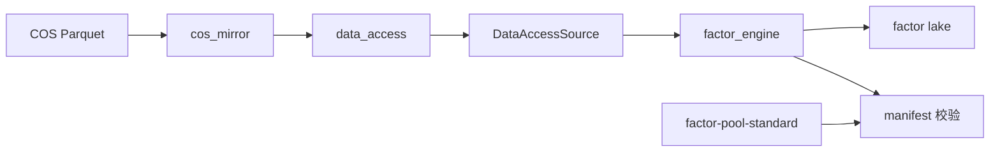

# quant_projects 目录结构

> 打包分发给他人的标准布局。解压后运行 `bash scripts/setup_quant_projects.sh`。

```text
quant_projects/
├── env.sh                          # 环境变量（source 后生效）
├── requirements-dev.txt            # Python 依赖
├── pytest.ini                      # pytest 标记说明
├── .pre-commit-config.yaml         # 可选：pre-commit 钩子
├── .data_access_allowlist.yaml     # data_access 直读 API 豁免清单
│
├── data_access/                    # 统一数据读写（DuckDB + Parquet + COS 镜像）
│   ├── config/datasets.yaml        # 数据集登记表（A 股 20 + 美股 23 + 因子湖）
│   ├── cos_mirror.py               # COS 按需本地镜像
│   ├── store.py                    # 对外主 API
│   └── tests/                      # 单元 / 契约测试
│
├── factor_engine/                  # 因子计算引擎（DSL → 执行 → 落盘）
│   ├── api/                        # DSL 解析、mining_integration
│   ├── storage/                    # 数据源（含 DataAccessSource）
│   ├── runtime/                    # FactorEngine
│   ├── scripts/                    # validate_delivery_formula 等
│   └── tests/
│
├── factor-pool-standard/           # 投递契约（canonical 字段 + manifest 校验）
│   ├── enums/
│   │   ├── canonical_data_fields.json
│   │   └── domain_roots.yaml
│   └── scripts/check_manifest_fields.py
│
├── factor_layer/                   # 因子评估 / 准入 / Agent（可选）
│   ├── factor_evaluation/
│   ├── factor_admission/
│   └── factor_agent/
│
├── raw_data_layer/                 # 原始数据下载与清洗（可选）
│
├── gtja191/                        # GTJA191 因子包（勿改公式源）
├── week2_pv_factors/               # Week2 因子包
│
├── scripts/                        # 运维与落盘脚本
│   ├── setup_quant_projects.sh     # 一键初始化
│   ├── sync_ashare_lqtp_cos.sh     # A 股 COS 同步
│   ├── sync_us_stock_cos.sh        # 美股 COS 同步
│   ├── sync_quantsociety_backend.sh
│   ├── materialize_gtja191_factors.py
│   └── check_data_access_allowlist.py
│
├── configs/                        # YAML 配置（按市场）
│   ├── ashare/
│   └── us_stock/
│
├── data/                           # 本地数据根（默认 workspace）
│   ├── a_share/lqtp_data/          # A 股 COS 镜像
│   ├── us_stock/massive_data/      # 美股 COS 镜像
│   ├── us_stock/clean_data/        # adj_factor / universe 等
│   └── factors/lake/               # 因子落盘湖
│
├── docs/
│   └── data_access/                # data_access 团队文档
│
└── logs/  output/  notebooks/      # 运行时产出
```

## 模块依赖关系



## 数据集命名（data_access）

| 前缀 | 市场 | 示例 |
|------|------|------|
| `ashare_*` | A 股 lqtp | `ashare_stock_daily` |
| `us_*` | 美股 massive / clean | `us_stock_daily`, `us_adj_factor` |
| `factor_lake` | 因子落盘 | 参数化 `factor_id` |

## 受保护目录（同步脚本不覆盖）

`data_access/`、`factor_engine/`、`gtja191/`、`week2_pv_factors/`、`data/`
