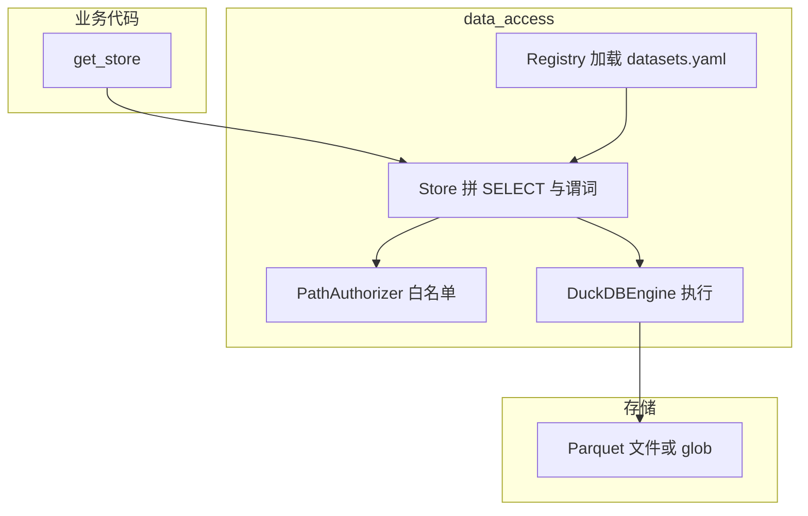
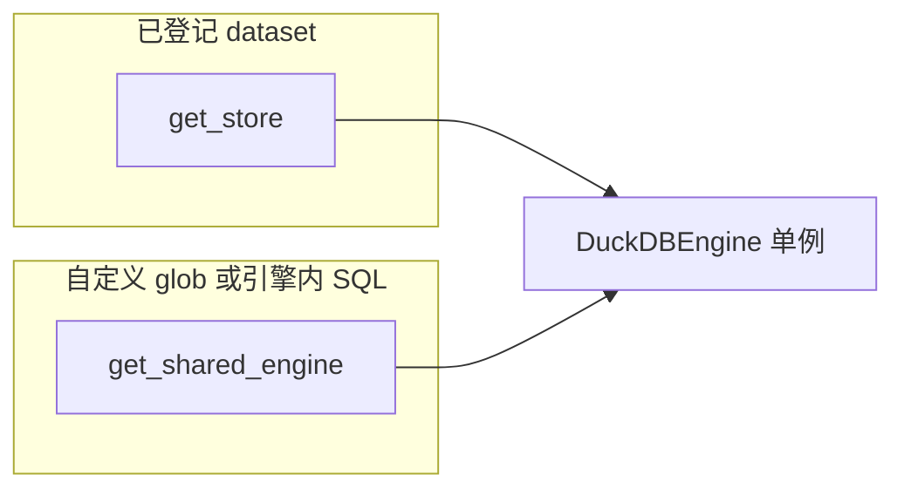

# data_access 与 DuckDB：全量改造与**使用手册**

> **本文件是什么**：给日常开发用的**可查阅手册**（不是论文体设计说明）。**先看下面「本手册怎么读」**，再按任务跳到对应章节；需要抠实现细节时以仓库源码为准。  
> **版本说明**：与仓库主分支 `data_access` 实现一致；API 以 `data_access/store.py` 与 `data_access/__init__.py` 为准。升级版本时以提交记录为准。

---

## 本手册怎么读

### 按你想做的事，直接跳读

| 我想…… | 建议从这里开始 |
|--------|----------------|
| 搞懂 `data_access`、DuckDB 在本仓库的**作用**和**最短代码** | **§0**（尤其 **§0.2** [`#duckdb-compute`](#duckdb-compute)） |
| **查本仓库除 `data_access` 外各层怎么接、责任在哪** | **§4.1.1～§4.1.5**；按 PR/版本对照见 **§4.2** |
| 从旧代码/随便读 Parquet 迁到统一写法 | **§4 改造前 vs 后**、**§10** 里抄一段 |
| **登记**新数据或新路径 | **§8** + 本机 [`datasets.yaml`](../data_access/config/datasets.yaml) |
| 大表/流式/SQL/多表 | **§10.1～10.6**、**§7** 选 API；拿不准再看 [`data_access/README.md`](../../data_access/README.md) |
| 写入实验结果、**发布**到全员可读区 | **§9**、**§10.7～10.8**（权限以岗位为准） |
| Code Review 或**别在删路径上翻车** | **§13** 禁止项、**§14** 测试网、**§15** 事故教训 |
| 实习生/无内网、只能本地样例 | **§2、§3、§11、§16** |
| 查 **某 PR 对应能力/涉及路径** | **§4.2**（主分支提交索引） |
| 工程/模型类规范（ipynb、测试、训练验证） | [02](02_量化团队企业级研发规范.md)、[03](03_量化团队_模型与实验规范.md)（本手册不展开） |

### 全手册速览（每章管什么）

| 章节 | 管什么（一句话） |
|------|------------------|
| **§0** | 数据侧做什么、**DuckDB 做哪些计算/不做哪些**、附**最短代码**；**§0.2** 必读 |
| **§1** | 读者分工、与仓库其他文档的边界 |
| **§2～§3** | 内部 vs 实习生读法、导师交接包（可选） |
| **§4** | 改造前后对照；**§4.1.x** 各目录职责；**§4.2** 按 **PR1～PR8** 与主提交对照 |
| **§5** | 名词：data_access 与 DuckDB 各是什么 |
| **§6～§7** | 数据流、能力速查（细节脉络见 **§4.2**） |
| **§8～§9** | 怎么登记数据集、staging / 发布 是什么 |
| **§10** | **日常最常用：复制即用的代码片段**（读/写/发） |
| **§11** | 回测只经 `get_store` 的骨架、本地无正式数据的登记 |
| **§12** | 与因子引擎读 Parquet 的对接（摘要，细节见 **§4.1.2**） |
| **§13** | 禁止项与 allowlist 索引（合入还见 [02 附录 D](02_量化团队企业级研发规范.md#appendix-d)） |
| **§14** | 测试与安全网（设计意图与用例） |
| **§15** | 事故教训（`publish` 与 CWD） |
| **§16** | 没内网时 FAQ |
| **§17～§19** | 和 02/03/Skill 的衔接、自测清单、深入阅读索引 |

### 速查：几个词在手册里啥意思

| 词 | 在本文里多指 |
|----|----------------|
| **dataset** | 在 `datasets.yaml` 里登记的一个**名字** + 配置；代码里**只传这个名字**和参数，不手写整段磁盘路径。 |
| **`get_store()`** | 返回进程内**单例** `DataAccessStore`；典型为 `get_store().read_frame(...)`、`read_arrow(...)` 等（见 **§0.2 示例**）。 |
| **published / staging / namespaced** | 三种**访问/写入形态**；全员只读的产线数据多在 **published**，写要经 **staging** 再发布。 |
| **DuckDB（在本仓库里）** | 内嵌 **OLAP 查询引擎**（`duckdb.connect(":memory:")`），扫 Parquet 并做过滤/投影/（可选）SQL 聚合；业务层勿自建 `duckdb.connect`（[§13](01_data_access_duckdb_全量变更与迁移指南.md#s13-allowlist) 与 **§0.2**）。 |

---

## 0. 快速导读 {#一分钟读懂}

> **本节能做什么**：用少量代码与表格说清**数据怎么进、DuckDB 管到哪一步**；细参数与更多示例见 **§10**。

### 0.1 本仓库在数据侧做了哪几件事

1. **数据路径可治理**：各业务不再在代码里散落 `Path(".../xxx.parquet")`，而是在 [`datasets.yaml`](../data_access/config/datasets.yaml) 用 **dataset 名**登记根路径、时间列/标的列等；读时只传**名字和参数**（如 `factor_id`）。  
2. **读与写经统一 API**：`get_store()` 提供 `read_*`、`write_arrow`、`upsert`、`publish_from_staging`、受控的 `sql()` 等，并配合审计与路径授权。  
3. **底层用 DuckDB 扫 Parquet**：Parquet 通常**不**先导入成持久化数仓表文件；DuckDB 在内存连接里用 `read_parquet` 等读磁盘上的列存文件。  
4. **策略/因子/训练逻辑仍在业务层**：`read_frame` / `read_arrow` 得到 **pandas / Arrow 表** 之后，**收益、回测、特征、训练** 在你选的库（pandas、Polars、PyTorch 等）里写；`data_access` 不提供策略或模型实现。

<a id="duckdb-compute"></a>

### 0.2 DuckDB 在本仓库里：是不是「只读盘、完全不做任何计算」？

**不是「零计算」**：只要是 **SQL 查询引擎**，就会做**谓词求值、列裁剪、算子级聚合**等，这些都属于**在引擎里完成的计算**。本仓库中典型包括：

- **`read_frame` / `read_arrow` 等**：内部会生成/执行对 Parquet 的查询，做**时间范围、标的、列**等下推，减少读入内存的数据量。结果仍是「拉一张表/一批列」给业务用。  
- **`store.sql(...)`**（**只读**、须声明 `read_datasets`）：你写的 `SELECT` 里可以有 **`GROUP BY`、`AVG`、`SUM`** 等，**这部分聚合在 DuckDB 里算完**，再返回表（见下 **示例 2**）。

**和「业务里的大计算」要分开说**：

- **DuckDB 不承担的**：**组合收益、回测主循环、防未来函数检查、多因子流水线、向量化研究里的大部分变换、模型训练/推理**。这些在 **Python / NumPy / Polars / 深度学习框架**里写；DuckDB **不是**要替代那部分。  
- **一句话**：DuckDB 负责**数据从 Parquet 里按登记规则取出来**（并可在 **`sql()`** 中做**声明式**的过滤与聚合）；**不**把「整个量化策略」或「整网训练」写进 SQL。

**示例 1：只取表，后续在 pandas 里自己算（常见）**

```python
from data_access import get_store

store = get_store()
df = store.read_frame(
    "YOUR_DATASET_NAME",  # 在 datasets.yaml 里已登记
    columns=["align_time", "ticker", "close"],
    time_range=("2024-01-01", "2024-12-31"),
    instrument_filter=["AAPL", "MSFT"],
)
# 下面在 pandas 里做信号/收益/回测，与 DuckDB 无必然绑定
# signal = df.groupby("ticker", ...)...
```

**示例 2：在 `sql()` 里做「按资产聚合」（引擎内做 AVG 等，仍是只读分析）**

```python
import pyarrow as pa

# 仍须对涉及的 dataset 在 read_datasets / read_params 中声明
tbl: pa.Table = store.sql(
    'SELECT "asset", AVG("value") AS m FROM factor_lake GROUP BY "asset"',
    read_datasets=["factor_lake"],
    read_params={"factor_lake": {"factor_id": "mom_3d"}},
)
```

**示例 3：训练/回测** — 通常先 `read_frame` / `read_arrow` 得张量/表，再在框架里前向与优化；**不在 DuckDB 里写 `torch`/`sklearn` 拟合**。

```python
# 伪代码：仅说明分层
# features = get_store().read_frame("some_features", ...)
# model.fit(features)   # 在 Python 里，而不是 duckdb 里
```

### 0.3 速查表里的常见问法

| 说法 | 正解（与 0.2 一致） |
|------|---------------------|
| 「是不是只能读、完全不能算？」 | **会算**：**查询语义**上的过滤、投影、**`sql()` 里的聚合**等都在引擎内完成。 |
| 「回测/因子是不是都写在 DuckDB 里？」 | **不**。**策略/因子/回测主逻辑**在业务代码；DuckDB 不替代。 |
| 「`data_access` 会训练模型吗？」 | **不会**。只提供**与登记数据**对接的读/写/发布等；**训练**在业务代码。 |

### 0.4 职责边界（谁管什么）

| 职责 | 谁负责 | 说明 |
|------|--------|------|
| 数据集**登记**、路径**白名单**、审计 | `data_access` + `datasets.yaml` | 新数据先登记，业务**只传 dataset 名和参数** |
| 扫 Parquet、单例 `DuckDBEngine`、可选 SQL | **DuckDB**（见 `data_access/engine.py`） | in-memory 连接，**不**当长期持久化数仓文件用 |
| **读/写/发布** 对外 API | `get_store()` → `DataAccessStore` | `read_*`、`write_arrow`、`publish_from_staging`、`sql` 等 |
| 因子/回测/训练 **业务逻辑** | 各子系统 Python 代码 | 见 [02](02_量化团队企业级研发规范.md)、[03](03_量化团队_模型与实验规范.md) |

**和「本手册怎么读」表一致**：需要概念即可看 **§0.2～0.3**；要抄接口看 **§10**；合规章看 **§13～§15**；登记/发布看 **§8～§9**。

### 0.5 与文档二、文档三

- **工程与合规章**（ipynb 交付、测试、删路径、输出命名、allowlist 等）：[02_量化团队企业级研发规范.md](02_量化团队企业级研发规范.md)。  
- **模型、实验、验证、消融**：[03_量化团队_模型与实验规范.md](03_量化团队_模型与实验规范.md)。

---

## 1. 本手册范围与读者

**§0** 已概括了概念与**代码小例**；从本节起把流程与条款写全。本手册还覆盖：

- 业务数据（Parquet）如何经 **`datasets.yaml`** 登记后，被统一读取、写入与（可选）发布；
- 各层应怎么调用、**不要**用哪些旧写法；
- **内部同事**与**无内网**读者如何按手册操作；
- **pytest / 目录清理** 方面的事故与预防。

（**DuckDB 与「计算」的边界**以 **§0.2** 为准。）  

**不写在本文里的**：合入、测试、ipynb 交付、模型训练与验证——见 [02](02_量化团队企业级研发规范.md)、[03](03_量化团队_模型与实验规范.md)，上面「本手册怎么读」表有入口。

**读者对象**

| 角色 | 如何使用本文 |
|------|----------------|
| 内部开发 | 通读；结合 `data_access/README.md` 做深入修改 |
| 实习生 / 外部协作 | 先读 **§0**；再重点 **§2、§3、§4、§10、§11**；其余作参考；**不依赖**未提供的内部业务代码仓库 |
| Code Review | 对照 **§13**、**§14**（测试与边界）、**§15 事故**（及 **§0** 职责边界） |

---

## 2. 阅读路径与权限：内部同事 vs 实习生

### 2.1 内部同事（有仓库克隆权 + 通常有数据机或内网路径）

阅读顺序建议：

1. 本文 §3～§9（概念与流程）  
2. `data_access/config/datasets.yaml`（本环境真实数据集名与路径）  
3. `data_access/用户使用手册.md` 与 `data_access/README.md`（细节）  
4. 本层代码：在 `backtest_layer` / `strategy_layer` / `factor_layer` 中搜索 `get_store`、`read_arrow` 等引用

### 2.2 实习生 / 无内网权限读者

**可以只依赖**：本文 + 自己 `git clone` 的**本仓库** + 导师提供的**最小交接包**（见 §3）+ 本机或共享盘上**脱敏/样例 Parquet**。

**不要假设**：能登录内部系统、能看到组内私有 notebook、能使用文档未写明的绝对路径。

**写作与回测**：在掌握 `get_store()` 与 `read_*` 后，即可编写**逻辑正确**的回测脚本；真实全量数据与 `publish` 权限由导师/负责人另行开通。

---

## 3. 导师给实习生的「最小交接包」（建议项，不强制进 git）

由导师在组外渠道（如表格或私信）提供，避免在公开文档中写死内网路径。

| 项目 | 说明 | 没有时怎么办 |
|------|------|----------------|
| 允许的 `dataset` 名 | 在 `datasets.yaml` 中已存在、且该实习生有权读的条目名 | 使用占位名 `YOUR_DATASET_NAME`，在本地用 **§11.1** 登记自己的样例数据 |
| 环境变量 | 如 `QUANT_RUN_NAMESPACE`、`QUANTSOCIETY_WORKSPACE_DATA_ROOT` 等含义与是否必须设置 | 只读 `published` 时 often 可省略 namespace；**写** namespaced/staging 时必须理解 `namespace`（见 `data_access/README.md` §3） |
| 样例数据 | 小批量 Parquet 目录或样例库路径 | 用 `pytest` 的 `tmp_path` 自造最小表，或只跑单元测试式脚本 |
| 数据接口 | 统一使用 `from data_access import get_store` | **禁止**在业务中 `import duckdb` / `pd.read_parquet`（见 allowlist） |
| 权限边界 | 是否允许 `write_arrow` / `publish_from_staging` | 一般实习生默认**只读**；生产 **published** 直写**禁止**（代码层也会拦） |

---

## 4. 改造前 vs 改造后（概览）

| 维度 | 改造前 | 改造后 |
|------|--------|--------|
| 读 Parquet | 各层 `pandas.read_parquet`、自拼路径 | **统一** `get_store().read_arrow` / `read_frame` / `load_columns` 等 |
| 查询引擎 | 多处各自连接或重复扫 footer | 进程内 **DuckDB in-memory 单例** + 共享 `DuckDBEngine`（`engine.py`） |
| 路径 | 硬编码分散 | **datasets.yaml** 单一事实来源 + `PathAuthorizer` 白名单 |
| 写数据 | 随意写盘 | **PR2+**：`write_arrow` 仅对 **namespaced / staging**；**published 禁止直写** |
| 发布 | 无统一原子流程 | **PR3**：`publish_from_staging`（staging → published + 归档） |

> Parquet **没有**被「导入成 DuckDB 里的数据库文件」；DuckDB 作为**查询引擎**直接扫 Parquet 文件（`read_parquet` SQL）。

### 4.1 全栈落点总览

`data_access` 是**库与配置**；下列目录与之配合，构成本仓库**读数与发布**的完整面。下表是索引，分节在 **§4.1.1～§4.1.5**；按版本/PR 的**能力对照**在 **§4.2**。

| 位置 | 角色（一句话） |
|------|------------------|
| **`data_access/`** + `data_access/config/datasets.yaml` | **核心库**：`DuckDBEngine` / `get_store()`、读写、发布、审计、测试。 |
| **`.data_access_allowlist.yaml`** + `scripts/check_data_access_allowlist.py` | 仍须**直读 Parquet/duckdb** 的**显式豁免**与静态检查（合规章见 [02 §2.3](02_量化团队企业级研发规范.md#23-allowlist-与-data_access-静态检查强制--建议)）。 |
| **`data_access/`**、**`data_access/README.md`**、**`docs/team_docs/`** 下 01/02/03 | 与实现配套的设计/上手/团队总览。 |
| **`factor_layer/.../storage/**`、**`strategy_layer/data/**`、**`streaming/**`、**`raw_data_layer/.../cleaning/**` | 业务与数据管线的**接法**与边界（分节下详）。 |

#### 4.1.1 `data_access` 包与 `datasets.yaml`

- **管什么**：`get_store()`、`DuckDBEngine`、路径授权、`publish_from_staging`、审计、SQL 逃生口、流式/ Polars 适配、首访 schema 等（与 **§4.2、§7** 一致）。  
- **读者要做的事**：新数据**先登记**再调用；不手写未授权绝对路径。  

<a id="412-factor"></a>
#### 4.1.2 因子层：`factor_layer/factor_engine/storage/`

- **管什么**：`parquet_source.py` / `kline_parquet_source.py` 等经 **`get_shared_engine()`** 发 `read_parquet` SQL，与**进程内单例**共享 buffer/footer cache。业务侧往往仍走因子引擎 API，不直接 new 引擎。  
- **和 `get_store()` 的分工**：**读「已登记 team dataset」** 用 `get_store().read_*`；因子引擎在**自有 root/布局** 上扫 Parquet 时，用**同一 DuckDB 进程单例**避免重复建连。  
- **示例（概念）**：伪代码上，旧思路是 `pd.read_parquet(某年某文件)` 拼表；现思路是**一条 SQL** 盖 glob/分区，由引擎下推时间、标的、列裁剪。

<a id="413-strategy"></a>
#### 4.1.3 策略层：`strategy_layer/data/`

- **管什么**：[factor_panel.py](file:///home/yluel/share/projects/quantsociety_backend_project/strategy_layer/data/factor_panel.py)、[market_data.py](file:///home/yluel/share/projects/quantsociety_backend_project/strategy_layer/data/market_data.py) 的**读实现**用 **`from data_access import get_shared_engine`** 执行 DuckDB SQL；**对外的** `load_factor_long`、`aggregate_bars_daily_summary` 等**函数名**尽量保持，调用方少改。  
- **为何换实现**：多文件 `pandas` 循环读 → 难以共享缓存与下推；单引擎 + 单条 SQL 有利于 **I/O 与谓词**（见文件头说明）。  
- **参数 `lake_root`**：测试或实验分支可指向 `tmp_path`，不必绑死生产根。

**旧写法 vs 推荐思路（示意，非可运行全文）**：

| 方面 | 旧式（应减少） | 现式（推荐） |
|------|----------------|-------------|
| 读多文件 | 循环 `pd.read_parquet` 再 `concat` | `get_shared_engine().conn.execute(SELECT ... FROM read_parquet('.../*/*.parquet', hive_partitioning=...))` 一次取出 |
| 时间/标的过滤 | 在 Python 里大范围筛 | 尽量 **WHERE** 下推到 SQL，减小进内存的列与行 |

<a id="414-streaming"></a>
#### 4.1.4 流式：`streaming/`

- **管什么**：如 `factor_stream_manager` 等**落盘**仍可能用团队允许的直写/合并语义（见 allowlist **B 节**）；**输出根**与 `datasets.yaml` 中登记的 ** factor_values_stream** 等条目对齐，便于下游 `store.read_arrow(...)` 消费。  
- **读者要点**：**写**路径常按流式协议**单独**维护；**读**新数据**优先**用已登记名 + `get_store()`。

#### 4.1.5 原始层清洗：`raw_data_layer/.../massive_cleaning_framework.py` 等

- **管什么**：**逐文件**清洗/校验（per-file 语义）与 `data_access` 的 **glob 聚合** 不同，清洗管道留在 allowlist **C 节** 明列的路径；**读侧**消费已登记 **raw / day_aggs** 等 dataset。  
- **读者要点**：不要强行把**整条清洗**塞进 `get_store`；在登记与文档里**分清「洗」和「查表」**。

**小结**：`data_access` 提供**登记、授权、单例引擎与合规格式**；**策略 / 因子 / 流 / 洗** 各层在**自己模块**里对接，**读团队宽表/已发布数据**时**优先** `get_store()` 与**已登记名**。

---

<a id="pr-index"></a>

### 4.2 按 PR 与主分支提交对照（索引用）

下列 **PR1～PR8** 与**主分支历史提交**对应，**能力以当前 `store.py` / `engine.py` 为准**；提交 hash 仅便追溯。

| PR | 主分支代表提交 | 主要解决什么 | 涉及路径/能力 | 是否含业务层 |
|----|----------------|-------------|--------------|-------------|
| **PR1～PR3** | `afa949a` 等 + `bde5269` / `83eb63c` 测试 | 读路径**单例**与 Arrow 主路径；**写** + 审计；**`upsert` / `store.sql` / `publish_from_staging`** 及 contract 测 | `data_access/**`、`publish.py`、`sql_escape.py`、合同测试 | 否（仅库+测） |
| **PR4** | `acc3133` | 扩充 **`datasets.yaml`**；streaming/ raw 与**登记**对齐；文档与 **allowlist 骨架** | `data_access/config/datasets.yaml`、**streaming**、**raw** 注释、`.data_access_allowlist.yaml` | 是（配置+文档+少量流式） |
| **PR5** | `e6cfce7` | 策略**读端**用 **`get_shared_engine()`** 单条 SQL；登记 **daily_market_summary**、**stocks_floats**；allowlist 分节 | `strategy_layer/data/factor_panel.py`、`market_data.py`、**allowlist**、**`data_access/__init__.py` 出口** | 是 |
| **PR6** | `741c64a` | **静态检查** `check_data_access_allowlist.py`；**per-operator 遥测**（慢查/配额） | `data_access/telemetry.py`、**脚本**、**allowlist**、PR 相关测试 | 否（工程化） |
| **PR7** | `9fd599c` | **`read_arrow_stream`**、**`scan_polars`** 与 DuckDB/Arrow 列投影衔接 | `data_access/store.py`、adapters/contract 测 | 否 |
| **PR8** | `ea4b29a` | 首访 **schema** 与 `datasets.yaml` 的 `schema:` 配置 | `data_access/schema_validation.py`、contract 测 | 否 |

**详述（阅读时可跳过）**

- **PR1～PR3**：`get_store().read_*` 走登记路径；`write_arrow` 仅 **namespaced/staging**；`publish_from_staging` 原子切 published + 归档；`sql()` 为**只读**受限 SQL，须 `read_datasets`；`upsert` 为合并写。  
- **PR4**：在 `datasets.yaml` 增加如 streaming/raw 消费条目的根路径；`massive_cleaning_framework` 等**头部说明**与下游读**登记名**的契约；allowlist 开始承载 **PR6** 的扫描豁免。  
- **PR5**：`factor_panel` / `market_data` 内部改为 **DuckDB SQL**；`from data_access import get_shared_engine` 成为策略侧推荐；见 **§4.1.3** 示意表。  
- **PR6**：`python scripts/check_data_access_allowlist.py` 全仓 AST 扫禁用 API；未列入 allowlist 的直读会失败；`telemetry` 记录算子/慢查询**辅助排障**（与 [02](02_量化团队企业级研发规范.md) 合入要求配合）。  
- **PR7**：大表用 `read_arrow_stream` 迭代；复杂变换用 `scan_polars`（见 **§10.4～10.5**）。  
- **PR8**：首次访问带 `schema:` 的 dataset 时可做**列类型/存在性**自检，防静默列漂移。

---

## 5. `data_access` 与 DuckDB 分别指什么

- **`data_access`（包）**  
  - **含义**：本仓库**唯一推荐**的、与团队数据路径**对接**的库：登记、授权读、可审计的写/发布。  
  - **入口**：`from data_access import get_store` → `store = get_store()`，类型为 `DataAccessStore`（`store.py`）。  
  - **小例**（与 **§0.2 示例 1** 同思路）：

```python
from data_access import get_store
store = get_store()
df = store.read_frame("YOUR_DATASET_NAME", columns=["a", "b"], time_range=(None, None))
```

- **DuckDB（在本包中的角色）**  
  - **含义**：内嵌的 **OLAP 引擎**（`data_access/engine.py` 中 `DuckDBEngine`），`duckdb.connect(":memory:")`。  
  - **作用**：对 **Parquet** 执行**扫描**和（通过 `Store` 拼好的或 `sql()` 里写的）**查询**；**不是**本仓库的「回测/训练运行时」。**是否算「有计算」** 见 **§0.2**。  
  - **小例**：下例在**应用代码里不出现** `import duckdb`，但读路径在内部会用到引擎：

```python
# 业务只调 get_store；DuckDB 在 DataAccessStore 与 DuckDBEngine 内部使用
from data_access import get_store
t = get_store().read_arrow("YOUR_DATASET_NAME", columns=["c1", "c2"])
```

**为何进程内常共用一个 `DuckDB` 连接**：多路读同一批 Parquet 时，共享 **object cache / buffer pool** 等，减少重复 IO（详见 [`data_access/README.md`](../../data_access/README.md) §1.1–1.2）。

---

## 6. 核心数据流（概念）

> **与 §4.2 的关系**：下图是**抽象**；各 PR 增减的能力见 **§4.2** 表，勿把「只有一条路径」写死为「业务只能 import 一个符号」。



### 6.1 `get_store` 与 `get_shared_engine` 的典型分工会 {#get_store-vs-get_shared_engine}

| 入口 | 适用场景 | 说明 |
|------|----------|------|
| **`get_store()`** | 读/写 **已在 `datasets.yaml` 登记** 的 `dataset` 名；`write_arrow`、**`publish_from_staging`**、受限 **`sql()`** 等 | 带路径授权、审计、注册表参数（`factor_id` 等） |
| **`get_shared_engine()`** | **因子/策略** 在**自定义 root 或历史布局** 上组 SQL（仍用**同一 in-memory 单例**） | 不替代登记：团队宽表请仍用 `get_store`；与 **§4.1.2、§4.1.3** 一致 |



---

## 7. 能力速查（与 PR 的对应见 §4.2）

下列能力在**当前主分支**的 `get_store` / 引擎上已体现（**以 `store.py`、`engine.py` 为准**）。**来龙去脉、涉及提交**见 **[§4.2](#pr-index)**，勿在此处与 §4.2 重复长文。

| 能力 | 说明 | 主要对应 |
|------|------|----------|
| 读 | `read_arrow`、`read_frame`、`load_columns`、`read_arrow_stream`、`scan_polars` | PR1、PR7 |
| 写 | `write_arrow`（namespaced / staging） | PR2 |
| 合并与发布 | `upsert`、`publish_from_staging` | PR2、PR3 |
| 受限 SQL | `sql`（只读、须 `read_datasets`） | PR3 |
| 静态检查 + 遥测 | allowlist 扫描；`telemetry` 中算子/慢查（若启用） | PR6 |
| Schema 自检 | 首访可选校验 + `schema:` | PR8 |

---

## 8. 登记数据集（`datasets.yaml`）与 `access_mode`

- 文件：[`data_access/config/datasets.yaml`](../data_access/config/datasets.yaml)  
- 说明：[`data_access/config/README.md`](../data_access/config/README.md)

**access_mode 要点**（与 `data_access/用户使用手册.md` 一致）：

- **published**：全员可读；**禁止** `write_arrow` 直写；更新须 **staging → `publish_from_staging`**。  
- **namespaced**：个人/实验隔离，路径含 `RUN_NAMESPACE` 等。  
- **staging**：发布前暂存区，同样经 namespace 组织。

**新增数据集**（业务侧流程）：

1. 在 `datasets.yaml` 增加条目（`kind`、`layout`、`time_column`、`instrument_column`、根路径或 `root_template` 等）。  
2. 若需严格类型对齐，可填 `schema:`。  
3. 业务代码只写 **dataset 名 + 参数**（如 `factor_id`），不手写绝对路径。  
4. 跑通 `data_access` 相关测试或最小脚本验证。

**环境变量展开**：支持 `${VAR}` 与 `${VAR:-default}`（见 `paths.py` / 配置注释）。

---

## 9. 数据生命周期：staging、upsert 与 publish（概念）

- **研究/实验** 写入：通常写到 **namespaced** 或 **staging** 数据集（`write_arrow` / `upsert`）。  
- **发布到生产只读区**：`publish_from_staging(staging_name, target_name, **params)`，将 staging 校验后**原子**晋升到 `published` 目标，并处理归档（见 `publish.py`）。

**实习生常见边界**：多安排**只读**与本地样例；**publish** 与写 **published** 需显式授权。

---

## 10. 对外 API 示例（可对照 `store.py`）

> **用法**：下面按**常见操作**分节；把 `YOUR_*`、列名、时间范围换成你环境里 [`datasets.yaml`](../data_access/config/datasets.yaml) 的**已登记** dataset 与列。**§0.2** 是「读 / `sql` 聚合 / 与业务层分界」的**最短示例**；这里补充**全参数**写法。

所有示例均假设：

```python
from data_access import get_store

store = get_store()
```

### 10.1 读为 Arrow（推荐大表）

```python
import pyarrow as pa

table: pa.Table = store.read_arrow(
    "YOUR_DATASET_NAME",  # 或如 us_stocks_sip_day_aggs，以本环境 yaml 为准
    columns=["align_time", "ticker", "close"],
    time_range=("2024-01-01", "2024-12-31"),
    instrument_filter=["AAPL", "MSFT"],
)
```

参数化数据集需传 registry 中声明的参数，例如：

```python
table = store.read_arrow(
    "factor_lake",
    columns=["datetime", "asset", "value"],
    time_range=("2024-01-01", None),
    factor_id="mom_3d",
)
```

### 10.2 读为 pandas

```python
df = store.read_frame(
    "YOUR_DATASET_NAME",
    columns=["align_time", "ticker", "close"],
    time_range=("2023-01-01", "2023-12-31"),
)
```

### 10.3 批量多列 → MultiIndex Series 字典

```python
out = store.load_columns(
    "YOUR_DATASET_NAME",
    columns=["factor_a", "factor_b"],
    time_range=("2024-01-01", "2024-12-31"),
    # 参数化示例：factor_id="mom_3d",
)
# out: dict[str, Series]
```

### 10.4 流式：按 RecordBatch

```python
for batch in store.read_arrow_stream(
    "YOUR_DATASET_NAME",
    columns=["datetime", "asset", "value"],
    batch_size=100_000,
    factor_id="mom_3d",
):
    ...  # 处理 batch
```

### 10.5 Polars Lazy（复杂变换）

```python
lf = store.scan_polars(
    "factor_lake",
    factor_id="mom_3d",
    time_range=("2024-01-01", None),
    columns=["datetime", "asset", "value"],
)
# 下游 .filter / .with_columns ... 再 .collect()
```

### 10.6 受限 SQL

```python
tbl = store.sql(
    'SELECT "asset", AVG("value") AS m FROM factor_lake GROUP BY "asset"',
    read_datasets=["factor_lake"],
    read_params={"factor_lake": {"factor_id": "mom_3d"}},
)
```

### 10.7 写（需 namespaced 或 staging 数据集 + 合法参数）

```python
import pyarrow as pa

# 示例：namespaced 回测落盘，具体 dataset 名以 yaml 为准
store.write_arrow(
    "single_asset_backtest_runs",
    pa.Table.from_pandas(df),
    strategy_id="mom_3d",
    version="v1",
    mode="overwrite",
    partition_by=["year"],  # 可选
)
```

### 10.8 发布（需权限与配对 staging/target）

```python
out = store.publish_from_staging(
    "factor_lake_staging",
    "factor_lake",
    factor_id="mom_3d",
)
# out 含 target_path, archive_path, rows 等
```

---

## 11. 回测侧：仅通过 data_access 取数的骨架

以下**不引用** `factor_engine` 内部类，只演示「先取表 → 再在 pandas/numpy 中算」的结构，便于实习生本地替换 dataset 名。

```python
from __future__ import annotations

import numpy as np
import pandas as pd
from data_access import get_store


def run_backtest_stub(
    dataset: str,
    time_range: tuple,
    price_col: str = "close",
) -> pd.Series:
    store = get_store()
    bar = store.read_frame(
        dataset,
        columns=["align_time", "ticker", price_col],  # 列名以该数据集与 yaml 为准
        time_range=time_range,
        instrument_filter=["AAPL"],
    )
    # 示例：最简单「信号」= 日收益，非真实策略
    bar = bar.sort_values(["ticker", "align_time"])
    g = bar.groupby("ticker", group_keys=False)
    ret = g[price_col].pct_change()
    return ret  # 后续应接持仓、费、对齐等，须防未来函数（见文档二）


if __name__ == "__main__":
    s = run_backtest_stub(
        "YOUR_DATASET_NAME",
        time_range=("2020-01-01", "2020-12-31"),
    )
    print(s.dropna().head())
```

**要点**：回测**读数**只走 `get_store`；时间对齐、防未来函数、成本模型在**策略层**另述（见 [02](02_量化团队企业级研发规范.md)）；训练/验证切分、消融等见 [03](03_量化团队_模型与实验规范.md)。

### 11.1 本地无正式 dataset 时：在 yaml 中登记自己的样例

1. 在可写目录放置少量 Parquet（列含 `time_column` / `instrument_column` 约定列）。  
2. 在 `datasets.yaml` 增加 `kind: static` 的测试用条目（或复用 `data_access/tests` 中的约定，以团队政策为准）。  
3. 代码中 `read_frame("你起的名字", ...)` 调试。

**不要在业务代码**中写 `Path("/...")` 直读，否则绕过白名单与审计。

---

## 12. 因子引擎侧对接（与 §4.1.2 一致）

- **实现**：[parquet_source.py](../../factor_layer/factor_engine/storage/parquet_source.py)、[kline_parquet_source.py](../../factor_layer/factor_engine/storage/kline_parquet_source.py) 在组 Parquet 时走 **`get_shared_engine()`** 的 `read_parquet` SQL，与**进程内 DuckDB 单例**共享缓存。  
- **对外**：业务多仍用因子引擎提供的接口与 **root 参数**；**新增团队级、可复用的数据面** 优先在 [`datasets.yaml`](../data_access/config/datasets.yaml) **登记** 后通过 **`get_store().read_*`** 消费。  
- **排障与边界**：与 **§4.1.2、§4.1.3** 同一套分工——「登记表读」用 store，「引擎内自管布局」可继续用 `get_shared_engine` SQL。

---

<a id="s13-allowlist"></a>

## 13. 规范禁止项与 allowlist

- 业务代码禁止直接 `import duckdb`、`pd.read_parquet`、`pq.read_table`（除维护列表）。  
- 见 [`.data_access_allowlist.yaml`](../../.data_access_allowlist.yaml) 与 `scripts/check_data_access_allowlist.py`（**合入、豁免原则、如何运行脚本**见 [02 第 2.3 节](02_量化团队企业级研发规范.md#s23-allowlist)）。  
- pre-commit 会扫描，PR 前自检。

---

<a id="14-测试与安全网"></a>

## 14. 测试与安全网

> **本章目的**：说明本仓库**为何**需要这批测试与约束——改 `publish` / 路径清理时能对照**防什么**，便于 Code Review 与自测（与 [02 第 5.1 节](02_量化团队企业级研发规范.md#51-强制) 一致）。

- **`data_access/tests/`** 下含 **unit**、**contract**、**concurrency** 等，覆盖读、写、**`upsert` / `sql` / `publish_from_staging`** 的成功/失败与并发场景。  
- **目录安全（通用原则）**：任何删除、清目录的测试**必须**落在 **`tmp_path`** 或**明确子目录**上，**不要**在「当前工作区根」上试删。  
- **发布实现（`publish.py`）**：成功完成且无临时 staging 目录需清理时，「无目录」**必须**用 **`None`** 表示；**禁止**用无参 `Path()` 作哨兵（`Path()` 即 `Path('.')`），否则清理逻辑**可能指向当前工作目录**（**§15** 有事故说明与行号级注释在源码中）。  
- **合入前**：改动发布/SQL/upsert/读路径时，应跑**与改动相关的** `pytest` 子集（如 `data_access/tests/contract/` 或全包 `data_access/tests/`），直至绿。

---

<a id="s15-cwd"></a>

## 15. 事故教训：pytest 下目录被清空与 `publish` 中 `Path()` 误用

**根因**（已修复）：成功路径曾错误使用 `candidate_dir = Path()`。在 Python 中 `Path()` 等价于 `Path('.')`（当前工作目录）。`finally` 中若对「仍存在」的目录执行 `shutil.rmtree`，则会尝试删除**当前工作目录**下内容；在仓库根跑 pytest 时 CWD 即**仓库根**，导致近乎整仓被删。修复为 **`candidate_dir = None`**，使清理逻辑不再误触发。

**防再发**：

- 任何 `rmtree` / 清空目录：目标必须是**显式、窄**的 `Path`，禁止用无参 `Path()` 作哨兵。  
- 测试中使用 **`tmp_path`** 或专用临时目录，避免对项目根无界删除。  
- 详见 `data_access/publish.py` 内注释、**文档一 [§14](#14-测试与安全网)** 与 [02 第 5.1 节](02_量化团队企业级研发规范.md#51-强制)。

---

## 16. 看不到内部代码时怎么写回测：FAQ

**问：没有内网数据，能写吗？**  
能。用 §11.1 登记本地小表，或只跑**逻辑**与**单元测试**；指标需全量数据时再上数据机跑。

**问：能用 `pd.read_parquet` 快读一下吗？**  
正式代码中**不要**；会绕过白名单。探索可在**个人**分支临时验证，**不得合入**主干。

**问：`publish` 必须会吗？**  
默认不要求实习生掌握；只读 + 只写 namespaced 实验盘即可，由导师定。

**问：DuckDB 要我自己 `connect` 吗？**  
**不要**（业务层）。用 `get_store()` / `get_shared_engine()`（仅允许路径内见 allowlist）。

---

## 17. 与文档二、文档三、Claude Code Skill 的衔接

- **工程与团队强制项**（测试、ipynb、输出命名、未来函数、删路径审查等）：见 [02_量化团队企业级研发规范.md](02_量化团队企业级研发规范.md)。  
- **模型、实验、验证与消融**（**不**在本手册与 03 中重复 `data_access` 读法；分工见 01/02 与 [03 读前](03_量化团队_模型与实验规范.md#section-readme)）：见 [03_量化团队_模型与实验规范.md](03_量化团队_模型与实验规范.md)。  
- **在 Claude Code 中改数据路径相关代码时**：请启用本仓库 **`.claude/skills/duckdb-data-access`**，并阅读其中「生成前检查表」与 `examples.md`。

---

## 18. 新成员与迁移检查清单

- [ ] 已读 `data_access/用户使用手册.md`  
- [ ] 能解释 `get_store().read_frame` 与 `datasets.yaml` 的关系  
- [ ] 能说明为何不能 `pd.read_parquet` 直读生产路径  
- [ ] 知道 `published` 不可直写、发布须 `publish_from_staging`（若岗位涉及）  
- [ ] 已设置或理解 `QUANT_RUN_NAMESPACE`（写 namespaced 数据时）  
- [ ] 已跑通至少 `pytest data_access/tests/unit/test_paths.py` 或团队指定冒烟测试（按环境）  

（实习生可跳过与写 production 相关项。）

---

## 19. 参考与索引

- [00_主材料阅读指引.md](00_主材料阅读指引.md)  
- `data_access/README.md`  
- `data_access/用户使用手册.md`  
- `data_access/用户使用手册.md`  
- `data_access/README.md`  
- `data_access/store.py` `data_access/engine.py` `data_access/publish.py`
