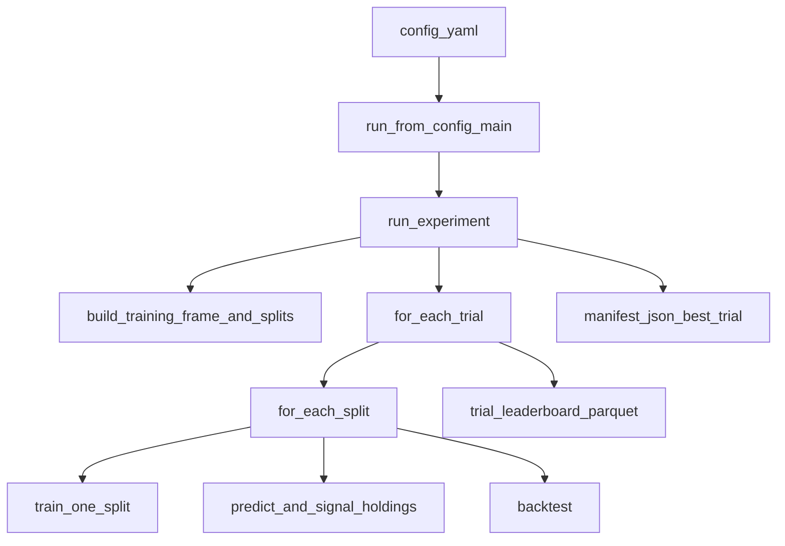

# 量化团队：模型与实验规范（模型组白皮书）

**文档版本**：2.5（2.4 + **篇十四 §14.3–14.6** **MLflow/等价工具/可复现/数据版本**；**§0.4** 模型组**工作面** 速查表）  
适用读者：模型组负责人（主读者，发布与验收；以本文深读+案例 备培训）、干事（执行 [篇 1.5 SOP](#P03-part1-sop) 与检查表）、创始人/对外材料引用（对外用精简 deck，见 [0.1.1](#P03-part0-03-vs-ppt) 与 [0.1.2](#P03-part0-bridges)）  
**与 [01](01_data_access_duckdb_全量变更与迁移指南.md) / [02](02_量化团队企业级研发规范.md)**：**数据读法、合入、删路径、回测原则** 以 01/02 为准；本文**不** 展开 DuckDB、读数 API、allowlist、CI 细节。

---

## 目录（按「篇」导航，可配合汇报 PPT）

| 篇 | 主题 | 锚点 | 汇报段（约） |
|----|------|------|----------------|
| 篇〇 | 术语、阅读地图、版本 | [P03-part0](#P03-part0) | 封面、分工 |
| 篇一 | 战略与问题陈述 | [P03-part1](#P03-part1) | 背景 2–3 屏 |
| 篇1.5 | 单模型生命周期 SOP（**组内** 参考实现，见下） | [P03-part1-sop](#P03-part1-sop) | 落地 1 屏+新人首周 |
| 篇二 | 与 01/02 的职责契约 | [P03-part2](#P03-part2) | 边界 1 屏 |
| 篇三 | 研究对象分类（截面/时序/混合） | [P03-part3](#P03-part3) | 主干 4–6 屏 |
| 篇四 | 六大方法论谱系；业界面谱↔六格 [§4.3](#P03-part4-spectrum-map) | [P03-part4](#P03-part4) | 桥梁 3–4 屏 |
| 篇五 | 预处理与标签红线 | [P03-part5](#P03-part5) | 红线 2–3 屏 |
| 篇六 | 目标、损失与输出契约 | [P03-part6](#P03-part6) | 目标 2 屏 |
| 篇七 | 泛化、体制与过拟合 | [P03-part7](#P03-part7) | 风险 1–2 屏 |
| 篇八 | 验证、WFO、gap | [P03-part8](#P03-part8) | **核心** 3–4 屏 |
| 八续 | 多 trial 选优、多重比较、manifest 底线 | [P03-part-hpo](#P03-part-hpo) | 培训+验收 1 屏 |
| 篇九 | 实验记录与消融 | [P03-part9](#P03-part9) | 可复核 1–2 屏 |
| 篇十 | 动态因子池与更新 | [P03-part10](#P03-part10) | 工程化 2–3 屏 |
| 篇十一 | 生产交付与 MLOps（模型侧） | [P03-part11](#P03-part11) | 上线 2 屏 |
| 篇十二 | 对内/外材料与叙事 | [P03-part12](#P03-part12) | 专业感 1–2 屏 |
| 篇十三 | 阶段、周历、论文矩阵 | [P03-part13](#P03-part13) | 规划 2–3 屏 |
| 篇十四 | 实验追踪；**MLflow** 与 **manifest** 对位（§14.2–14.6） | [P03-part14](#P03-part14) | 工具 1–2 屏 |
| 篇十五 | 总检查表 | [P03-part15](#P03-part15) | 收尾 |
| 附录 A | 模板包 | [P03-appA](#P03-appA) | 附件 |
| 附录 B | 文献索引 | [P03-appB](#P03-appB) | 备问 |

> **兼容旧链**：以下锚点与本篇对应保留——`#section-readme`（文首边界）、`#exec-summary`（执行摘要）、`#paradigm-cross-time`（篇三）、`#loss-tradability`（篇六）、`#generalization-tuning`（篇七）、`#validation-experiments` / `#wfo-gap`（篇八）、`#experiment-tracking`（篇十四）、`#model-checklist`（篇十五）。

---

<a id="section-readme"></a>

> **读前边界（必须保留在一切对外转述中）**  
> **[02](02_量化团队企业级研发规范.md)**：工程与数据合入、**主代码库** 内可审计流程。  
> **[01](01_data_access_duckdb_全量变更与迁移指南.md)**：数据登记、读数、受控存取与发布。  
> [04](04_量化团队_算法驱动因子挖掘与资产化管理.md)：算法驱动因子挖掘、五安检/假发现/正交/进池与代谢 的组织原则（与本文「动态因子/消费方式」分工；WFO/MLflow 仍以本文为准）。  
> **本文**：研究范式、统计口径、验证与 WFO、损失与输出契约、动态因子更新策略、交付物、组织节奏与检查表。

---

<a id="exec-summary"></a>

## 执行摘要（汇报可整段使用）

**双读者**：负责人用本文**定规则、验收、对外口径**；干事用本文**做实验、填表、交可复核材料**。  
三条结论：（1）**先**在 [篇三](#P03-part3) 钉死任务属于**截面/时序/混合**中的哪一类，**再**选**损失**与 [篇八](#P03-part8) 验证**协议**；（2）金融时序上**默认**不以**混洗 K 折**替代**时间泛化**的**主主张**，**时间向前 + WFO**（**可**含 **gap**）**须**能**辩护**；（3）模型组**默认**交付**可排序信号**或**（均值,方差）**；**固定**多空头寸比例、**最终仓位**由**策略/组合**与**02 约束**主责，见 [篇六 §6.3](#P03-part6-contract)。

你（负责人）深读、组员落地：以 [篇 1.5 SOP](#P03-part1-sop) 的**组内参考**端到端实验管线为**主对照**（**配置** → **单次**可复现**入口** → **manifest/排行榜** 为**事实**）；`transformer_demo` 是**本主仓**的**命名示例**——**可**换技术栈、**不**换**验收**（**拒绝**外站套壳的 `BaseModel`、虚构的 `export_to_production()` 那类叙事）。[篇七 排障树](#P03-part7-troubleshoot) 与 [八续 选优与多重比较](#P03-part-hpo) 作**培训/验收**口径；[篇十四](#P03-part-mlflow-manifest) 规定 **MLflow 未**上时 以**落盘** `manifest` 为**事实源**。与 [0.1.1](#P03-part0-03-vs-ppt)、[0.1.2](#P03-part0-bridges) 的**「口径 vs 路径、PPT 台词」**配套使用。  
不重复：DuckDB、allowlist、合入/PR 流程**一句**指 **01/02**；换手/滑点/容量以**团队主文档**与（若适用）[04](04_量化团队_算法驱动因子挖掘与资产化管理.md) 为**准**，**本文**不维护第二套**交易**表。

---

<a id="P03-part0"></a>

# 篇〇 元信息、术语与阅读地图

### 0.1 版本与维护

- **重大变更** 时递增**次版本号**，在文首与 git 提交说明**各写一句**「变更要点」。  
- **负责人** 对**对外引用** 段落（执行摘要、篇二、篇十二、篇十三 表）**负主责**。

<a id="P03-part0-03-vs-ppt"></a>

### 0.1.1 本文（Markdown）与 PPT 的分工

- **你读 03 的目的**：能讲清**每句话背后的罚则、例子、反例**；培训新人时用 [篇 1.5 SOP](#P03-part1-sop)、[篇七 排障树](#P03-part7-troubleshoot)、[八续 选优](#P03-part-hpo) 的**口头展开**，不要求听众当场读完 800+ 行。  
- **对外 PPT 的目的**：[篇十二](#P03-part12)（`§12.1` 页序）的标题级内容 + 一张**流程图/一张表/一页** checklist；**不要** 把长解释搬进投影。  
- 给组员、给对外：PPT/投影是索与壳；可裁判、可合入的 细节在 03 正文 + 01/02/04 + 你组书面登记 的配置/种子/合入 记录。  
- 与「本主仓/路径」的纪律：汇报与对外 以方法名、责任边界、验证协议、交付 为语言；具体 模块、命令、目录 只出现在篇 1.5 及九、十、篇十四 的「实现侧」段落，不 当作战略叙事唯一 素材。

<a id="P03-part0-bridges"></a>

### 0.1.2 汇报口播的**篇章衔接**（可作讲者备注 / 母台词）

> 下述句子**不必**逐字上屏，建议放在 **slide 的讲者备注** 或腹稿里；**承上**指上一屏刚停下的题，**启下**指下一屏的**收束句**。

- **进入篇一（封面与分工之后）**  
  在讲任何**结构、损失、IC** 之前，先钉住一件事：我们处于「**数据/特征—模型/学习—组合/执行**」中的哪一段、**不替**谁做决策。后面**所有**方法论与 WFO，**都不得**越过这条**责任链**；否则再炫也是**越权**。

- **进入篇 1.5（原则读完、要落地时）**  
  上文是**可辩护、可复现**的规则；下面这一节是**组内参考**的一条**可跑通**管线——**配置**驱动、**一次**入口、**manifest+排行榜** 为**事实源**。对外只念**四件事**：**可复现、可审计、WFO+八续**管住 honest trial、**不念**子模块名。工程同学可**对照**本篇**核对实现**。

- **进入篇三（从战略到任务定类）**  
  同一套网络+损失，**换任务类型**却不改叙事——是**文不对题**的**第一来源**。所以**先**把 **A/B/C** 钉在实验说明**第一行**，**再**选**损失**与[篇八](#P03-part8)验证；否则后面的 K 折、WFO 都是**无的放矢**。

- **进入篇四（方法版图 / 六格）**  
  在**下钻**统计细节前，用**管理语言**过一遍**六种**讲法：我们**主投**哪几格、**暂不主投**哪几格、理由**是否**可**检验**。**不要**用「有深度」偷换成「有质量」。

- **进入篇五（第一条红线：预处理与标签）**  
  篇三定**你在比什么**；篇五定**这口数据在数学上干不干净**。这里**破一寸**，后面**再漂亮**的 WFO 也只是在证明**一次精密的泄漏**。

- **进入篇六（损失与交付边界）**  
  损失**不是**论文章节目录，而是**与组合构建、可交易性**的**接口**；默认我们**不**在模型里把**最终仓位**也写死——那是**组合**与**工程/策略**（02 等）的**主责**（见 [篇六 契约](#P03-part6-contract)）。

- **进入篇八（脊骨：WFO 与时间向前）**  
  对**带时序**的量化任务，本文**默认**主张是：**时间向前、多段 OOS、可辩护的 WFO+gap**。混洗 K 折可以作**补充实验**，**不能**被偷换成「我们已经**证明了**时序泛化」的**那一句**主叙事。

- **八续 之前（与篇八 §8.3.2 成对记）**  
  **公开**的**多 trial** 赛马，与在**同一段**验窗上**试**很多次、**只**报**最好**，是**两回事、两种错**；**[八续](#P03-part-hpo)** 管**前者**的**多重比较**与**落盘**底线，**8.3.2** 管**后者**那种 p-hack。

*（若嫌长，**至少**背熟**进入篇一、篇三、篇五、篇八** 四句。）*

<a id="P03-sec0-2-terms"></a>
### 0.2 术语表（汇报与组内对齐用）

> **自读**：若正文里**英文/缩写** 易愣住，先看**紧接的 [§0.2.1](#P03-abbr-brick)** 括注；与 [04 篇〇 §0.3.1](04_量化团队_算法驱动因子挖掘与资产化管理.md#P04-terms-abbr) **对读** 可覆盖两边分工（**本文** 主「训验/验证/交付」，**04** 主「假发现/正交/进池/代谢」）。

| 术语 | 本文含义 |
|------|----------|
| **截面/横截面** | 固定时刻（如某日）多标的上的相对关系与排序任务。 |
| **时序/序列** | 沿时间轴为主的预测或表示，输入含显式历史窗。 |
| **IC / RankIC** | 因子/预测与**未来收益** 的秩相关类指标；**定义窗** 须在实验说明写清。 |
| **WFO** | Walk-forward：沿时间**多次**「训过去→验未来」的**有序** 验证，非单次随机切分。 |
| **gap** | 训练窗结束与验证窗开始之间的**空白时段**，用于缓冲自相关、模拟延迟等（可设 0，须**辩护**）。 |
| **概念漂移** | 数据生成过程随时间变，导致**旧模型** 分布外失效。 |
| **信号契约** | 模型**输出** 的数学对象与**量纲**（分数、概率、分布参数）及**与下游** 的约定。 |
| **Artifact** | 可脱离训练机**复现推理** 的包：权重图、特征序、预处理参数、对拍用例等。 |
| 中性化 | 对因子或收益做相对 行业/风格等的残差 或投影（口径 由组内定）。 |
| **体制/Regime** | 如高/低波动、牛/熊等**市场状态** 的**分段** 描述（可为隐式、可为标签）。 |
| **OOS** | 样本外，指**在训练/选参中未用于调参** 的时段或折。 |
| **消融** | 有控制地**删除或替换** 一个因素以观察**主指标** 变化。 |
| **基线** | 有意**选弱** 但**可解释** 的对照（线性、浅树、历史均值等），**非** 调参后唯一竞品。 |
| **灾难性遗忘** | 为适配新数据**破坏** 旧知识；增量学习**典型** 风险。 |
| **元学习/适配器** | 学「**如何** 快速改」 或学**小头** 以吸收新域，**非** 唯一指一篇论文。 |
| 门控/宏观分支 | 用市场/宏观 子网络产生条件，再缩放或路由因子支路（流派 III）。 |
| **无套利/矩约束** | 在损失或对抗结构里**嵌入** 经济恒等式（**流派 II**），**非** 本组起步默认。 |
| **影子/灰度** | 新模型**接实盘行情** 但**不实单** 或**小流量** 的验证阶段。 |

<a id="P03-abbr-brick"></a>
### 0.2.1 缩写与英文**括注**（**一眼** 能懂，**不** 当定义）

> 作用：正文里 英文/简写 若**没** 跟中文括号，就**以本表** 先念人话；**正式定义** 仍以上表 + 各篇 为准。与 04 的表 **不逐字相同**（两边分工不同）。

| 文里常见 | **建议读法 / 括注** |
|----------|-------------------|
| **WFO** | *walk-forward*，**多段、按时间向前** 的「训—验/测」折叠（[篇八](#P03-part8) 主文）。 |
| **gap** | **训练窗尾** 与 **验证窗头** 之间的**空档** 天数（为缓冲自相关/延迟 等，可设 0 须**辩护**）。 |
| **OOS** | *out-of-sample*，**样本外**（**未** 在调参/选优 中反复「试到最好」 的那段 报告口径）。 |
| **IC / RankIC** | 与**未来收益/排序** 的 秩相关 类 指标；**不是** 分类**准确率**（见 [§0.2 大表](#P03-sec0-2-terms) 已一行定义）。 |
| **HPO** | *hyperparameter optimization*，**超参/结构 搜索**；在本文 **常** 和 **多 trial/试次**、**八续 纪律** 同屏出现。 |
| **A / B / C** | 篇三 **任务 类型**：**A** 横截面/日 多票，**B** 时序 为主，**C** 两阶/混合 须**写清结构图**。 |
| **manifest** | 实验/模型 **落盘清单**（配置、种子、数据切片、试次 指纹 等；[篇十四](#P03-part-mlflow-manifest) 的**事实源** 语言）。 |
| **MLflow** | 一种 **实验跟踪** 工具/服务名；含 **Tracking**（Run/实验记录）与 **Model Registry**（**阶段/审批** 流，**不** 替代 `manifest` 的**试次** 事实）；**未** 上 时 以 落盘 `manifest` 为**主事实源**（**不** 把工具名 当 方法论）。 |
| **MLflow Run** | 一次**可对比** 的训练/试次**记录**；**须** 与 `trial_*` 或**整次** 实验**映射** 关系**成文**（见 [篇十四 §14.3](#P03-mlflow-objects)）。 |
| **W&B 等** | **Weights & Biases、Neptune、ClearML** 等**同类** 实验** SaaS/本地** 工具 = **MLflow 的** **等价**物；**同一** 纪律：**单** 一**可审计** 数字源。 |
| **Registry** | **模型注册表** 的**组织** 流程名（**Staging/Production** 等）；**上线** 与 [篇十一](#P03-part11) **对表**，**不** 自动等于「**科学** 上**最优**」。 |
| **trial / 试次** | 一次可编号 的**训练/调参/搜索** 运行记录（**和** 口头「试一试」 不是 同一 严谨度）。 |
| **p-hack / 多重比较** | 同一验窗/同一假设 **反复** 试到「显著」 再只报 最好；[八续](#P03-part-hpo) 管 **诚实 赛马/折扣** 叙述。 |
| **in-sample / IS** | **样本内/参与过 拟合或选参** 的时段或折；**不可** 偷换为 唯一 对外 质量 证据。 |
| **Artifact** | **可带走的推理包/产物**（权重、预处理、特征序 等；非日常口语「艺术品」）。 |
| **Regime / 体制** | 市场 **状态/分段**（高/低波、牛/熊 等）；**非** 政治含义。 |

**常见误用**（反例）：把 IC 与 日收益 混称「准确率」、把 K 折 叫「样本外」、把 in-sample 最优点 当唯一报告数字。

### 0.3 阅读地图

- **负责人 30 分钟速览**：执行摘要 → 篇一、二 → 篇 1.5 SOP 骨架 → 篇三 目录与小节题 → 篇八 8.1–8.3、八续 → 篇十五 清单。  
- **干事 首周路线**：文首边界 → 篇 1.5（照跑一遍） → 篇三 → 篇五 → 篇六 → 篇八、八续 → 篇九 模板 → 篇十五 对应勾项。  
- **自读/把表读懂**（**非** 首周**硬** 路径，**但** 防「**一句带过** 看不懂」）：`transformer_demo` 看 [§1.5.2a](#P03-part1-model-table) 表 + [§1.5.2b 长扩写](#P03-part152b)；**业界面谱通称** 见 [§1.5.2c](#P03-part1-model-spectrum)；**族系/任务** 看 [§3.2.5](#P03-part3-model-zoo) 横表 + [§3.2.5b](#P03-part3-model-zoo-b) 收纳 + [§3.2.5a 长扩写](#P03-part3-model-zoo-extended)。  
- **实验追踪 / MLflow / manifest 对位**（细读）：[篇十四](#P03-part14) **§14.1–14.6**（三档路径；[§14.2 起落盘/MLflow 对照](#P03-part-mlflow-manifest)；[§14.3](#P03-mlflow-objects) 对象与双套数字；[§14.4](#P03-mlflow-equiv) 等价工具；[§14.5](#P03-mlflow-repro) 可复现；[§14.6](#P03-mlflow-data-version) 数据/因子 与 [01](01_data_access_duckdb_全量变更与迁移指南.md) 对表）。  
- 写 PPT：按目录表 的「汇报段」顺序 与篇号 对齐；每屏在本文有可抄 的原句+表；**投影** 仍按 [0.1.1](#P03-part0-03-vs-ppt)，**长** 段**别** 贴满屏，留在扩写**小节** 里。

<a id="P03-part0-work-surface"></a>
### 0.4 模型组**工作面** 速查（**是否** 讲全了 → **先** 扫本表）

> **用途**：新人/负责人**按主题** 找**主责** 篇节，**不** 替代各篇**正文**。**因子** 侧「五安检、假发现、进池」在 [04](04_量化团队_算法驱动因子挖掘与资产化管理.md)；**数据** 登记在 [01](01_data_access_duckdb_全量变更与迁移指南.md)；**合入/CI** 在 [02](02_量化团队企业级研发规范.md)。

| 工作面 | **主** 读哪 | **一句** |
|--------|-------------|----------|
| 任务 **A/B/C**、张量行定义 | [篇三](#P03-part3)、**§3.6** | 定错类=后面**全** 错 |
| **WFO / OOS / gap** | [篇八](#P03-part8) | 时序**主** 叙述 |
| **试次 / HPO / 多重比较** | [八续](#P03-part-hpo) | 与 **p-hack** **划界** |
| **损失 vs 可交易** | [篇六](#P03-part6) | 接口**契约** |
| **预处理、泄漏、PiT** | [篇五](#P03-part5) | **GIGO** 首道闸 |
| **过拟、体制** | [篇七](#P03-part7) | 排障树 |
| **工程跑通、manifest** | [篇 1.5](#P03-part1-sop) | **事实源** |
| **MLflow / Tracking / Registry** | [篇十四 §14.2–14.6](#P03-part-mlflow-manifest) | **不** 双套数字 |
| **网络族系、业界面谱** | [§1.5.2c](#P03-part1-model-spectrum)、[§3.2.5](#P03-part3-model-zoo) | **消费** 因子**训** 模型 |
| **方法论六格** | [篇四](#P03-part4)、[§4.3](#P03-part4-spectrum-map) | 对外**口径** |
| **交付、ONNX、影子** | [篇十一](#P03-part11) | **上线** |
| **动态因子池** | [篇十](#P03-part10) | 与因子 [04](04_量化团队_算法驱动因子挖掘与资产化管理.md) **对读** |
| **实验记录、消融** | [篇九](#P03-part9) | **可复核** |
| **总检查** | [篇十五](#P03-part15) | **PR/周会** |
| **算力/输出根** | [§1.5.7](#P03-part1-sop) | **命名空间** |

---

<a id="P03-part1"></a>

# 篇一 战略与问题陈述

## 1.1 本组在流水线中的位置

因子池/特征工程 产出可解释、可登记 的表（01/因子组 主责）→ 模型组 产出信号/分布 与可审实验（本文）→ 策略/组合 把信号变成可执行权重 并扣成本/约束（02 与策略文档 主责）→ 执行 与 回测 对时间轴与未来函数 负责（02 §8 原则）。  

反例：在模型里写死「永远多前 5% 空后 5%」且不 与统一 回测/成本同源 —— 属于越权混合职责，见 [篇六](#P03-part6) 边界。

口播（承上 责任链、启下 篇三）：先认清我们站哪 一段；然后 要回答的不是 网络有 多深 ，而是篇三的 A/B/C。任务 分错 了，后面再认真的损失与 WFO 也只是在错 题上 刷分 。

## 1.2 市场与数据的结构性矛盾（为何「能跑」不够）

- **信噪比极低**：有效信号淹没在噪声里，**in-sample 漂亮** 可能全是噪声拟合。  
- **非平稳/漂移**：体制切换、**规则与参与者结构** 变，**历史** 的 **i.i.d. 想象** 常不成立。  
- **Alpha 衰减**：挖掘越拥挤，**存量因子** 边际下降；**要** 持续**新因子+新结构+严验证**。  
- **预测≠可交易收益**：有**成本、冲击、约束、时延**，见 [篇六](#P03-part6) 与 02/策略主文档的**互链**。

## 1.3 价值主张（对外一句话模板）

> 本组以可辩护的验证与可复现的 数据口径与模型版本，在明确定义 的任务类型下输出可排序/带不确定性 的信号；不 将单次 in-sample 最优作为唯一 质量证据。

## 1.4 从数据到执行的逻辑链（Mermaid，汇报可用）


> 和篇一 §1.4 图的分工：§1.4 是全链路战略 叙事；[篇 1.5](#P03-part1-sop) 的 Mermaid 对应「配置 → 可复现入口 → 落盘 manifest/排行榜 可审计」的工程 链。对外只讲流程 与验收；不念子目录/类名；落地以本节+合入说明 为准。

口播（进入篇 1.5 前）：前文在讲原则；这一节在讲工程 如何把可审计 交付物交出来。非工程同事可略过；PPT 上四个词 就够：配置、一次入口、落盘、WFO+试次纪律。

---

<a id="P03-part1-sop"></a>

# 篇 1.5 单模型生命周期 SOP（**组内参考**；`transformer_demo` 为**实现侧** 命名示例）

> 对外四词 就够：配置驱动、一次可复现入口、manifest/排行榜 为事实、WFO+八续 管住试次。下文的子模块、一行命令、仅为本主仓 实施对照；更换实现时更新合入说明，验收 不变。

> 本节仍回答「第一天改哪、跑什么、产什么」。不引用外站套壳的 `BaseModel` 叙事、不引用虚构的「一键上线」。

## 1.5.1 数据与「读数」要分**两层**说，避免教错

- (A) 合规章 + 进湖/登记：[01](01_data_access_duckdb_全量变更与迁移指南.md) 与组内发布/版本 约定负责「因子/数据能否 用于正式实验」；在本主仓 内一般经统一读数+合入 接入。API 以 01/02 为准，本文不列具体函数名。
- **(B) 本主仓** 当前示例管线（常见后缀为 `*_demo*`）：在 `dataset` 中 `build_feature_panel` 用 `FactorLakeReader` 在 `source.factor_lake_root` 上按 `factors` 或 `factor_pool_file` 拉因子面；`multiple_factor_composite.preprocess_panel` 做截面维度的 winsorize/标准化等（与 [篇五](#P03-part5) 原则一致的落点）；K 线经 `kline` 读入，在 `build_training_frame` 里用 `horizon_days` 生成前向 `future_return` 作标签。
- 人话：（A）是「数据能不能 上桌」；（B）是「这一锅 实验里，因子列与标签怎么 在一张 `dataset` 里对齐」。SOP 里不要 把 (B) 说成「只要接上了读数就结束」。

**反例**：对外说「我们训练数据一行搞定」，却不提**因子表是否已登记/有版本**、K 线是否与标签**同日同可交易宇宙** 对齐；出事时无法对表。

## 1.5.2 实现侧：「一条命令」与配置入口（**本主仓** 当前）

- **入口脚本**：仓库根、适当 `PYTHONPATH` 下执行 `python -m strategy_layer.portfolio_alpha.transformer_demo.run_from_config <path/to/config.yaml>`；内部是 `load_config` → `run_experiment`（见 `workflow.py`）。成功时打印 `output_root`、`manifest_path`、`leaderboard_path`、`best_trial` 的 JSON 摘要。
- 必配 YAML 块（在 `TransformerDemoConfig` 有对应字段）：`meta`（`experiment_id`、`version`、seed）、`source`（`factor_lake_root`、起止 日、`factors` 或 `factor_pool_file`）、`kline`（必填：标签前向收益与回测 都依赖）、`walkforward`（`train_days`/`val_days`/`test_days`/`step_days`）、`output`（强烈建议 显式 `root`，避免只落隐式 默认工作区目录导致难找、难审计）、以及 `preprocess`/`label`/`model`/`training`/`holdings`/`backtest`/`selection` 等。
- 与篇八 的「gap」 叙事：当前实现里，滑窗是 train | val | test 日历紧接，`WalkForwardConfig` 无 独立 `gap` 天数字段。方法论上的 gap 与代码差异见 [篇八 8.4.2](#P03-part8-code-truth)：不要 在 config 里假装 已有一个尚未在代码中实现 的 `gap` 超参。若业务需要「验末与测首」之间物理缓冲，用起止 日、`test_days` 选择或后续 改代码显式 加 buffer，并 在实验说明写字。

<a id="P03-part1-model-table"></a>

### 1.5.2a 本主仓参考 `transformer_demo`：网络与可训面一览（培训/备问）

> **口播**可只念下表**第三列**；对外 **PPT** 只投影**第一列**表头 + **任一行**示例即可，**不必**连念路径与类名（与 [0.1.1](#P03-part0-03-vs-ppt) 一致）。

| 对象 | 实现落点 | 口播**一句**（可作台词） |
|------|----------|--------------------------|
| **CrossSectionalTransformer** | `transformer_demo/model.py` | 当日 **N×F** 因子经 `Linear` 映到 `d_model`，**加** `symbol` 嵌入，用 `TransformerEncoder`（多层 `TransformerEncoderLayer`）在**标的**维做自注意力，**Linear** 头输出截面**可排序**分数。 |
| **ModelConfig 超参** | `config.ModelConfig` / YAML `model` | `d_model`、`nhead`、`num_layers`、`dropout`、`ff_multiplier` 管**容量/过拟/显存**；HPO 的 `param_grid` **仅**能键入这些**已有**字段名（见 [§1.5.4 多 trial](#P03-part154)）。 |
| **训练目标** | `trainer`（`regression_loss_weight` + `ic_loss_weight` 等） | 点预测与 **IC** 型目标可**加权**同训；须与 [篇三](#P03-part3) 任务定类、[篇六 契约](#P03-part6-contract) **自洽**。 |
| **WFO 与多 trial** | `workflow` / [八续](#P03-part-hpo) | 每 **trial** 跑满全部 WFO **split**；`trial_leaderboard` + `manifest` 的 **best_trial** 是验收**事实源**。 |

**换栈说明**：上表只描述**本主仓**当前示例。更换 **PyTorch** / **JAX** / **GBDT** 时**不变**的是任务定类（[篇三](#P03-part3)）与 **WFO** + 试次纪律（[篇八](#P03-part8) + [八续](#P03-part-hpo)）。

<a id="P03-part1-model-spectrum"></a>
### 1.5.2c 业界面谱/文献**模型通称**（**备问**；**不** 增加工程验收项）

> **读法**：下表是**行业与顶会文献** 里常见的**预测/组合** 侧**网络名**，用于培训「听过但不知道归哪」的**口头对齐**；**不** 表示本主仓**已** 有对应**类/模块**。**在离散符号空间里挖公式** 的**遗传/RL/LLM** 名谱见 [04 篇二 §2.0.1a](04_量化团队_算法驱动因子挖掘与资产化管理.md#P04-engines-methods-grid)；**本文** 只锁「**已给定因子/行情 → 有监督/强化学习/组合头**」 的消费侧。未核实**回报数字** 的论文名**禁止** 写进执行摘要（文首 0.1/篇十三 精神）。

| 通称/关键词 | 与本文**一条** 关系（**可照念**） |
|-------------|----------------------------------|
| **LGBM / XGB / CatBoost** | 在「日×票」面板上**强基线**；协同因子/池化后常作**组合头**；试次 仍走 [八续](#P03-part-hpo)。 |
| **Qlib** 生态、**TRA**（Temporal Routing Adaptor） | 多**交易模式** 路由+辅助损失；任务定类多落 **B/C**，WFO 须**单写**。 |
| **FactorVAE** 等 潜因子+VAE | 输出**分布/不确定度** 叙事，与 [篇六](#P03-part6) **IV** 格 接口 优先对表。 |
| **FinRL** | **组合/交易** RL **环境** 通称；**VI** 格；须**有** 成本/摩擦的**可辩** 仿真。 |
| **AlphaStock** / **AlphaPortfolio** 类 | **跨资产** 注意力 + 组合/夏普 **DRL**；**VI** 强；**别** 与**因子挖掘** RL **混** 了口径。 |
| **LSTM / GRU / TCN** | **B** 主叙事；[§3.2.5a](#P03-part3-model-zoo-extended) 长文。 |
| **Encoder-only Transformer**（L×F 序列） | 多为 **B**；**截面** 标的当 token 的变体= [§1.5.2a](#P03-part1-model-table)。 |
| **Mamba / S4 / SSM、MambaStock 等** | **B** 长记忆**候选**；小样本**慎** 直接替代 树基线。 |
| **Stockformer**、**DWT+Transformer** 等 | 频域分解+序列；**B**；须写清**标签** 与 **WFO** 窗。 |
| **MASTER** 等 市场**引导** | 大盘/状态 **门** 进网络；**III** 格 + **B** 任务；**门** 的信息集见 [篇五 5.5](#P03-part5) 与 02 **宇宙**。 |
| **GNN / GCN / GAT、CAAN、RGCN** | 横截面/关系**图** 上消息传递；**A/C** 常见；**边** 定义须与 [01](01_data_access_duckdb_全量变更与迁移指南.md) 数据域 一致。 |
| **DeepLOB / CNN-LOB、孪生** | **高频/订单簿** 表征；数据域、延迟在 **01**；任务多为 **B**；与**日频因子** 管线**分报**。 |
| **FinBERT、时间序列 LLM（Time-LLM 等通称）** | 文本/多模态→**数值** 特征；**另类数据** 走 **01** 登记，**不** 偷换 PiT。 |

<a id="P03-part152b"></a>
### 1.5.2b 自读扩写：从张量到 `manifest`（**不要求** 背类名，但**要** 懂语义）

> 本节是**自读/培训**用长文，把上表**每一行在「一个交易日、一次前向、一次 WFO 折」里代表什么**写具体；**不** 增加新的工程验收项。若你更关心「该选哪类网络」而不是 `transformer_demo` 细节，可先看 [§3.2.5a 族系扩写](#P03-part3-model-zoo-extended) 再回来对照本节。

1. **输入张量：一行数据到底指什么**  
   在**类型 A** 的默认理解下，**固定一个交易日 `t`**，在**可交易/研究宇宙**里取 **\(N\)** 只标的、每只 **\(F\)** 维来自因子湖的数值，得到面 \(X_t \in \mathbb{R}^{N\times F}\)。`CrossSectionalTransformer` 前向时，**batch 里常见一维是「日」、一维是「标的」、一维是「特征」**（实现上可能是 `[B, N, F]`）。**`symbol` 嵌入** 给每个**标的** 一个可学习向量，与**线性**层把 `F` 投到 `d_model` 后的向量**加在一起**，让模型能区分「同一组因子数值、不同股票」的残差。  
2. **「截面自注意力」与时间序列模型的差**  
   本参考实现中，`TransformerEncoder` 的**自注意力的作用轴在标的维**（**同一天里哪几只股票** 互相为上下文），**不是** 把 256 个交易日拉成 `L=256` 再沿时间作主注意力。时间结构主要通过：**(i)** `kline` 上构造的**前向收益标签** 与 [篇三](#P03-part3) 的任务定义，**(ii)** `walkforward` 的**日历时序切分** 与 [篇八](#P03-part8) 的 OOS 叙述进入。若你真正想建模的是**沿时间的长时间记忆** 且**主评价** 在**路径/状态** 上，应**改写任务定类**为 **B** 或 **C**，并同步调整**损失、评价与 WFO 表述**——这属于 [§3.2.5a](#P03-part3-model-zoo-extended) 的决策，而**不是** 仅把本实现的 `d_model` 调大。  
3. **「两项训练损失」同时开时**  
   配置中常见的 `regression_loss_weight` 与 `ic_loss_weight`（名称以**当前合入的** `config`/trainer 为准）分别对应**点预测/回归** 与 **(近似) 截面秩相关/IC 友好** 的可微项。二者**在量纲上不必可比**，也**不必** 人为凑成和为 1。必须在**实验说明** 写清：**(a)** 主**验收指标** 是 OOS 回测、时间向前 IC、还是多目标里偏哪一个；**(b)** 若报告**同时** 报 IC 与组合收益，二者在**同一标签/同一宇宙/同一调仓频率** 上是否[篇六 契约](#P03-part6-contract) 可兼容。只调两权重而不检查任务标签与 WFO 叙述，是实践里**最常见的自洽性错误**之一。  
4. **WFO `split` 与 HPO `trial` 的「两层循环」**  
   - 对每个 `split`：在 **train 窗** 上拟合，在 **val 窗** 上早停/看该折内的可训练状态，在 **test 窗** 上产出分数与**该段** 回测；**test 的日历与特征不得来自 train 的信息集**。  
   - 对每个 `trial`：一组**固定**结构/训练超参（`param_grid` 的一格或手填）；**必须** 跑完**所有** `split` 后，在 `trial_leaderboard` 上**一行** 汇总；`manifest` 中 **`best_trial`** 由 `selection` 在**全表** 上选，**不是**「在某一折 test 挑最好就报」的局部最优。后者与 [八续](#P03-part-hpo) 的**试次/诚实** 要求冲突。  
5. **可复述的数值样例**（**仅**组内口径对齐，**不** 作为业绩或夏普承诺）  
   设某日 \(N=3000\)、\(F=200\)、`d_model=128`、`num_layers=2`、`nhead=4`：表示模型**有容量** 学复杂截面交互。若在**同标签、同 WFO、同基线** 下，LGBM 与网络 OOS 指标**在折间大幅抖动** 或**差距方向不稳定**，在继续加深网络之前，应**先** 查 [篇五](#P03-part5) 预处理、因子 PiT/可得性与 01/02 的**数据定义** 是否**跨折一致**，以及是否某一折的 train 恰覆盖**单一行业或单一市场制度** 的极长子区间（导致折内过拟、折外不迁移的**假象**）。


## 1.5.3 在**代码里**，一次实验里每个 split 实际发生了什么

对每一个 `WalkForwardSplit`：train 子集上 `train_one_split`（验证集上早停、记 `val_ic`） → 在 test 日期上 `predict_scores` → 由分生成 `signal`、再 `build_holdings_from_signal` → `run_backtest_for_holdings` 得该 split 的夏普等。每个 trial（见下节） 跑全部 split 后，把各 split 的指标聚成 一行写进 `trial_leaderboard`（如 `oos_mean_sharpe` 等），最后 `_pick_best_trial` 按 `selection` 在 trial 间 选最优。

讲给组员听：「验」= 同一段时间 里调早停/看 val；「测」= 更后 的一截日历上的分与回测；不是 把 K 折 的混洗当 测。

<a id="P03-part154"></a>

## 1.5.4 多 trial、超参网格与**选** 优（和篇八 的 p-hacking **区分** 开）

- 配置 `search.enabled: true` 且给 `search.param_grid` 时，会 `build_hyperparam_variants`：每个 有效组合命名 为独立 `meta.experiment_id` 的变体、整段 WFO 重跑。`param_grid` 的 key 必须落在 `model`/`training`/`holdings` 的已有 属性上，否则在构建变体时 即报错。  
- trial 间 用 `selection.primary_metric`、`max_drawdown_threshold`、`prefer_higher` 选 `best_trial` —— 这是策略性 的多 结构比较，不是 同一 验段里试 50 次只 报最好 的那次（后者见 [篇八 §8.3.2](#P03-part8-332)）。但 trial 数量大仍有多重比较 风险，须预登记试次 上限/主指标，并考虑留 一段未 进入任何 trial 搜索的最终 报告 OOS，详见[八续](#P03-part-hpo)。  

## 1.5.5 会落**哪些** 盘、拿来**就能** 审计什么

- `output.root` 下（典型）：`dataset/`（可含 `splits.json`、parquet 快照；视 `output.write_dataset_snapshot`）、`trials/trial_*/` 下各 `split_*/` 的 `checkpoints`、**artifacts**（如 `alpha_scores`/`signal`/`holdings` parquets）、`backtest/`；根目录 `trial_leaderboard.parquet`、**`manifest.json`**（含 `best_trial`、**resolved** 因子表、可复现设置摘要等）。  
- 本管线当前 以 ONNX/一键导出 为可选项 或后接 基建；对基建 的实际 交付在 [篇十一](#P03-part11) 约定「在 无 ONNX 时，以同一 YAML+git commit+manifest 可 重跑+特征列序+预处理可 重放+parity」为主 验收，不 空头承诺 函数名。

## 1.5.6 分**阶段** 操作（0→6，含 smoke）

| 阶段 | 你带组里该做到什么 | 参考**实现** 对照（本**主** 仓** 当** 前** ） |
|------|-------------------|----------|
| **0 立项** | 定 `experiment_id`、因子池文件或内联 `factors`、数据起止、**与** 01/登记 对齐的版本说明 | `meta` + `source` |
| **1 写全 YAML** | 填**齐** kline、walkforward、output、selection；关 `search` 或先**关** 网格 | 完整 `config.yaml` |
| **2 Smoke** | 缩短 `source.start`/`end` 使**只** 有 **1** 个 WFO **split**；或减 `training.epochs`；确认出现 `trials/.../split_001/.../artifacts` 与 `manifest.json` | 同一 `run_from_config` 入口 |
| **3 全量 WFO** | 多 split、全 trial；保留 `splits.json` 备**争** 议时**复盘** 日期 | `build_walkforward_splits` + 快照 |
| **4 开 search** | 开 `param_grid`+`max_trials`+`selection`；**书面** 写**试** 次预算 | `build_hyperparam_variants`、`_pick_best_trial` |
| **5 结题/交** | 以 `manifest`+leaderboard **组** 内**结题**；交基建=篇十一+**本** 目录 | `run_experiment` 返回 |
| **6（加层）** | 指标进 MLflow/Registry；**不** 替代 5 的**落** 盘 | 见 [篇十四 14.2](#P03-part-mlflow-manifest) |

## 1.5.7 算力、命名空间与**输出** 纪律（与集群策略**占位**）

- 与 数据路径/审计 相关的 环境变量 见 [用户使用手册](../../dataaccess/docs/用户使用手册.md)（如 `QUANT_RUN_NAMESPACE` 等，以你们 实际部署为准），不 在本文写死队列 名。  
- **下表** 由**负责人** 填**真** 规矩后，贴 wiki 或本页替换占位。

| 项 | 团队约定（负责人填写） | 没做到**会怎样** |
|----|------------------------|------------------|
| 是否允许在登录/交互 节点跑长 训练 | 例：否，仅提交 到计算节点 | 占资源、拖慢共享 环境、易被清 作业 |
| 单任务显存/内存 上限、超额时 流程 | 例：&gt;20GB 走大 作业队列或 拆批 | 被杀 进程/影响他 人 |
| 废弃实验/失败作业卡 占 GPU 多久 须释放 | 例：24h 内清 或迁 出 | 成本 与排队 恶化 |
| 与 `QUANT_RUN_NAMESPACE` 等输出 根路径关系 | 见 01/快速上手 | 审计对 不上 人、难 删 |

反例：算力规定 只存在 负责人口头、不 进表 —— 新人默认 无限 网格搜，全 组被 拖慢**。

## 1.5.8 机械步骤 Mermaid（新人照图对文件）



讲给组员听：你手里有 的是「YAML + 一次命令 + 两个硬 文件 `manifest`/`leaderboard`」，不是「某台机器上的一个 神秘 `.pth` 截图」。

---

<a id="P03-part2"></a>

# 篇二 与 01/02 的职责契约（RACI 简表）

口播（承上篇一、启下后文）：RACI 是评审时快速定位 责任方的表；不是 装饰。篇三～十五 的争议，须 能映射 回本表某一格。

> **R=负责执行 A=当责拍板 C=须协商 I=知会**

| 事项 | 数据/01 | 工程/02 | 模型/本文 | 策略/组合 |
|------|---------|---------|------------|-----------|
| 读数、登记、dataset 名 | R/A | C | I | I |
| PR、测试、allowlist、删路径 | I | R/A | C | I |
| 回测**原则**（防未来、对齐） | I | 条文 | 验证**落实** 到 ML | R |
| 因子表**物理** 正确、版本 | R | C | C 消费 | I |
| **任务类型、损失、WFO 方案** | I | I | R/A | C |
| **组合构建、最终换手约束** | I | 部分 | I | R/A |
| 对外**讲清局限与数据口径** | C | C | R | C |

**不重复 02 条文**：本表**只** 帮模型组**找** 讨论对象；有冲突以 **02 强制** 为准。

**反例**：模型 PR **独自** 改 `data_access` 登记**而不** 走 01 流程 —— **禁止**（见 02/01）。

---

<a id="P03-part3"></a>
<a id="paradigm-cross-time"></a>

# 篇三 研究对象分类：截面、时序与显式混合（核心）

> **篇三、篇五、篇八** 为全文**加长段**；**合占** 全文建议 **35–45%** 阅读与写作精力。

## 3.1 为什么必须先分类

同一套**网络+损失+验证** 换任务不改，是**文不对题** 的主要来源。分类写进**实验说明第一屏**，是**对干事时间** 的尊重。

常见错（反例）：日频全市场排序 任务，直接 套「单票 256 日 Transformer」 论文设默认超参；结果 往往是标签与评价 仍截面，算力 与故事 都不匹配。

## 3.2 类型 A：横截面 / 日频「同日多票」

### 3.2.1 数据形态

- 典型输入：**日 \(t\)** 的矩阵 \(X_t \in \mathbb{R}^{N_t \times F}\)，\(N_t\) 为**当日可交易** 或**宇宙内** 股票数。  
- 常配合：过去若干日 的滞后特征 仍按日组织 成 \(T \times N \times F\) 但训练单元 是「日」 或 日批。

### 3.2.2 目标与评价

- 目标常是 **次日/次 \(k\) 日** 的收益、**超额**、**分位、排序**。  
- 评价常看 IC、RankIC、分组多头、 与 回测 在 02 框架 下一致 的组合 指标。  
- **与 MSE 的错配**：**全点** MSE 低**未必** 多头好，见 [篇六](#P03-part6)。

### 3.2.3 过拟的**常见面貌**

- **时间维**：某**连续** 牛/熊段 **IC 高**，换段**崩**。  
- **截面维**：**全历史** 压出来的**行业/风格** 假信号（与 [篇五 中性化](#P03-part5) 相关）。

### 3.2.4 张量级**实例（简）**

- 输入 `float32 [B, N, F]`，**B** 为日批；**mask** 处理停牌/未上市。  
- 目标 `y` 与 **B 同日** 对齐的 **forward return** 或 **超额**。

反例：不做 日界对齐，把多日的 标签并到 错误 timestamp —— 未来/滞后 混乱（归 02 与实现 查）。

<a id="P03-part3-model-zoo"></a>

### 3.2.5 常见**网络/学习器** 族与 A/B 任务倾向（口播/备问；**PPT** 可整表投）

> **PPT** 可整表投影；**不** 要求背类名，但须说清自己落在**哪一格**、与**线性/GBDT** 基线的关系。

| 族系 | 代表通称/关键词 | 与**类型 A**（截面/日批为主） | 与**类型 B**（序列/沿时间为主） |
|------|-----------------|------------------------------|----------------------------------|
| 浅层 + 树模型 | 线性/岭/弹性网；**LGBM**、**XGB**、**CatBoost** 等 **GBDT** | **强基线**、可解释、算力省；日频**排序**任务**须**先报这一档 | 历史可压成**长特征**仍按 A 训；**长记忆**主叙事**弱**时须**书面**说明 |
| 前馈 **MLP** | 全连接、**LayerNorm** 等 | 常见在 (日,票) 或池化后的向量上 | 单独作**长程**主叙事时**慎用** |
| 卷积 / **TCN** | 1D 卷积栈、dilated 感受野 | lookback 可拼入 **F** 维仍属 A 叙事 | B 的**常见**选项之一 |
| 循环 | **LSTM** / **GRU** | 多出现在特征已**序列化展开**的设定 | B 的**主**选项之一 |
| 自注意力 | Encoder-only **Transformer** 等 | **本主仓**示例 `CrossSectionalTransformer`：标的当 token 做**截面**集合建模 | 亦有 (L×F) 序列 Transformer 变体；须单独论证 + [篇八](#P03-part8) **WFO** |
| 状态空间 | **S4**、**Mamba** 等 | 少作默认可比的截面**唯一**主模型 | B 的**长记忆**替代之一；须书面论证与验窗 |
| 图/关系 | **GNN**、**GCN**、**GAT**、**RGCN**、**CAAN** 等 | 行业/供应链/图上的**截面** 或**时空** 消息传递；**A/C** 常见 | **B** 若含图须写清**时间对齐** 与 WFO |
| 潜变量/生成式 | **FactorVAE** 等、潜因子+**VAE/贝叶斯** 头 | 与「点预测+方差头」**同屏** 时常落 **A/B** 的强容量选项 | 与 [篇四 IV](#P03-part4) **概率输出** 叙事对表；**OOS 校准** 必审 |
| 市场**引导/路由** | **MASTER**、**TRA**、多专家+**OT** 路由 等 | 大盘状态做**门** 或**软路由**；偏 **A/B** 混合时标 [篇三 3.4](#P03-part3) | **非稳** 市场；与 [八续](#P03-part-hpo) **试次** 分清「路由**超参**」 |
| 频域+序列 | **Stockformer**、**DWT**+**Attn**、**多任务** 头 等 | **B** 上高低频**显式** 分离 | 多一路损失=多一路**登记** 与比较 |
| 组合/交易 **RL** | **FinRL**、**AlphaStock**/**AlphaPortfolio** 等 **DRL+组合** | **VI** 端到端**权重/排序** 叙事；**不** 与 **04** 的「**因子式** 生成 **RL**」 混名 | 须**执行模型**+**成本**；见 [篇四 VI](#P03-part4)、[篇八](#P03-part8) |
| 高频/微观 | **DeepLOB**、**CNN+LOB**、**孪生** 等 | **B** 上 **LOB/tick** 主叙事；**与** 日频因子**异频** | **数据域/延迟** 在 [01](01_data_access_duckdb_全量变更与迁移指南.md)；**单** 独实验说明 |
| 文本/大模型 特征 | **FinBERT**、**Time-LLM** 等通称 | 另类→**数值** 再进 **A/B** 头 | **只** 能使用 [01] **已登记** 源；**防** 训练期 **cut-off** 泄漏进回测（见 [§1.5.2c](#P03-part1-model-spectrum)） |

**与 [篇 1.5.2a](#P03-part1-model-table)** 分工：上表是教材级地图；**具体类名**只在参考实现节列举。更全的**通称一句** 见 [§1.5.2c](#P03-part1-model-spectrum)；**挖因子** 侧名谱 见 [04 §2.0.1a](04_量化团队_算法驱动因子挖掘与资产化管理.md#P04-engines-methods-grid)。

<a id="P03-part3-model-zoo-b"></a>
### 3.2.5b 上表**未** 穷尽的**业界面谱**（**与** §3.2.5 横表**同用**；备问 PPT 可**折页** 印）

> **作用**：在 [§1.5.2c](#P03-part1-model-spectrum) 的**人话一列** 与 [§3.2.5a](#P03-part3-model-zoo-extended) 的**能/不能** 之间，补一层「**我听过这个名字**」 的**收纳格**。**不** 增加验收项，**不** 背书任一文**数值**。

| 收纳格 | 通称/关键词（**可** 多选并存） | **优先** 勾 **A/B/C** 与**篇四** 格 |
|--------|------------------------------|----------------------------------|
| 基线与集成 | 线性/岭/弹性网、**LGBM/XGB/Cat**、**Stacking**、**OOF** 预测 | I；任务 **A** 最优先**对照** |
| 深度序列**骨干** | **LSTM/GRU、TCN、Sequencer** 类 | **B**；I |
| 注意力/Transformer | 标的维 **CSE**、时间维 **(L×F) encoder**、**Informer** 类长序列 | A 或 B，**二选一** 主叙事 写**死** |
| 状态空间 | **S4/S5、Mamba、SAMBA、CrossMamba** 等 | **B**；I |
| 图 | **GAT/GIN、异质图、动态图、CAAN** | **A/C**；先验关系 见 I/II |
| 潜因子与**不确定度** | **DFM、FactorVAE、** 多任务 **KL** | **IV** + [篇六](#P03-part6) |
| 体制/路由 | **HMM+预测头、TRA、** 多专家+**gating** | **III** + **B** 常见 |
| 组合 **RL** 与**仿真** | **FinRL、PPO+环境、** 夏普/回撤 **reward** | **VI** + 篇八 |
| 微结构/高频 | **DeepLOB、双塔/孪生、Hawkes** 特征 进网 | **B** + 01 域；与**日频** **分** 报 |
| 文本/多模态 编码 | **FinBERT、Time-LLM、** 新闻 **embedding** | I→特征；**另类** **01** |

**与 [04](04_量化团队_算法驱动因子挖掘与资产化管理.md)** 分工再**一句**：上列凡落在「**出因子公式/代码**、**不** 以 **WFO 消费池** 为主责」 的，归 **04 四引擎**；凡「**在已登记因子上训权重/头**」 的，归**本文**。

<a id="P03-part3-model-zoo-extended"></a>

#### 3.2.5a 自读扩写：上表**每一行** 在「实验设计时」**意味着什么**

> 目的：你读完表仍不知道「该选谁」时，用下面**长说明** 钉死：**数据张量**、**主损失**、**OOS 叙述** 三者是否**一致**；不引入新口号。

- **浅层 + 树（线性/岭/弹性网、LGBM、XGB、CatBoost 等）**  
  - **能默认承担的角色**：在**同一张日×票的面板** 上、对**已对齐** 的标签做**强可复核** 基线；L2/树复杂度约束与**可交叉验证** 套路成熟，是**同 CPU/GPU 预算** 下**最优先** 的时间向前对照。  
  - **不能默认的事**：**树深度堆高** 并不自动提供「制度切换」的**可辩护**；在**多折 WFO** 中若仅**in-sample 或单折** 显著，与 [篇八 §8.3.2](#P03-part8-332) 的**伪 OOS** 风险**同一类**。  
  - **你写进实验说明** 至少要有：**(a)** 特征是否**全为 `t` 日收盘可得** 或明确延迟表；**(b)** 分箱/分桶是在**哪一维** 做的（[篇五](#P03-part5)）。  

- **前馈 MLP**  
  - **能默认承担的角色**：在**已池化/压平** 的向量上拟合**非单调** 交互，作为 **I 类数据驱动** 的次基线。  
  - **不能默认的事**：在**时序** 上若 `L×F` 展平成长向量，**维数** 与**泄漏**（展平顺序、全局标准化）一错，MLP 只会更快过拟合；**必须** 在 [§3.6「谁是一行」](#P03-part3) 写死行定义。  

- **1D 卷积 / TCN**  
  - **能默认承担的角色**：`L` 步历史因子作为**等间隔通道** 时的**平移不变** 归纳偏置，适合**噪声大、** **局部形态** 重复出现的**标签**。  
  - **不能默认的事**：`L` 与**交易日历** 不同步、或把**非等间隔** 信息硬塞进固定 `L`；须检查 [篇三 B](#P03-part3) 与 [篇五 5.4](#P03-part5) 的**对齐** 再谈感受野。  

- **LSTM / GRU**  
  - **能默认承担的角色**：单票/批次上的**有状态** 递推，显式**隐状态** 适合「**上一步** 对**下一步** 标签」的**逐步** 训练叙述。  
  - **不能默认的事**：在**跨票** 的 batch 中混排时间相邻样本当 **i.i.d.**（[篇三 B 反例](#P03-part3)）；RNN 的**长依赖** 若未用**多段 OOS** 验，**单窗好** 仍可能是**制度偶然**。  

- **Encoder-only Transformer（多种形状）**  
  - **本主仓** 变体是 [§1.5.2a](#P03-part1-model-table) 的**截面** 注意力；另有一大类实现把 **`L` 日 × `F` 维** 展成**序列 token**，此时**任务** 是 **B**，评估与 WFO 必须按 **B** 写。  
  - **共通的审查点**：`nhead` 能整除 `d_model`、**有效 mask** 是否覆盖**停牌/缺失**、**OOS 折** 上**注意力** 是否对**未出现在 train 的标的** 结构产生**不诚实** 利用（[篇五 5.5](#P03-part5) 与 02 的**宇宙** 定义）。  

- **S4 / Mamba 等状态空间**  
  - **能默认承担的角色**：以**常数/近常数** 步长递推的**长记忆** 可训练实现，是 **B** 的**高容量** 选项。  
  - **不能默认的事**：在**小样本/短历史** 上作为**第一套** 主模型**替代** 树基线，通常**不具可辩护**；**须** 有**多段 OOS** 与**试次** 上界 的书面理由（[篇八](#P03-part8) + [八续](#P03-part-hpo)）。  

- **GNN / GCN / GAT、CAAN、RGCN 等图网络**  
  - **能默认承担的角色**：在**已构图** 的标的上做**关系** 消息传递，显式**横截面/供应链/行业** 非独立结构；在 **C** 型「先时序后截面」 里常做**二阶** 的截面块。  
  - **不能默认的事**：**边** 若含**未来** 才可见 的关系 = [篇五](#P03-part5) 泄漏；**图** 结构**跨折** 变（如并购） 未写进**实验说明** 的，OOS 不可比。  

- **FactorVAE、潜因子头、多路 KL** 等  
  - **能默认承担的角色**：在 [篇四 IV](#P03-part4) 叙事下 输出**分布/区间**，与风控、仓位 接口；对**信噪比极低** 面板有时比**点估** 更**可辩护** 的**报告** 方式。  
  - **不能默认的事**：**方差/区间** 若**不校准** 仍写「可控」= **IV 反例**；**编码器** 若「见未来收益」 训练= [篇五](#P03-part5) 与**FactorVAE 类** 论文常强调的**先验-后验** 分权须**在代码/配置** 可**审计**。  

- **Qlib TRA、MASTER、多专家+最优传输路由 等**  
  - **能默认承担角色**：在**多制度/多微结构** 下**软路由** 到不同**头** 或**预测器**，与 [篇四 III](#P03-part4) 状态门控 叙事**接近**，利于讲清「**非稳**」 而不**偷换** 为单一静态图。  
  - **不能默认的事**：**专家数/路由** 作 **HPO** 的维度时，试次 仍记 [八续](#P03-part-hpo)；**门** 若用到**全样本** 估的 宏观**未来**= 泄漏。  

- **Stockformer、DWT+Transformer、多任务头**  
  - **能默认承担角色**：在 **B** 上**分频** 再融合，**先验** 上匹配「**趋势 vs 事件**」 的可解释 切口。  
  - **不能默认的事**：**多** 个损失**等权** 汇报**不** 写主辅= [篇三 3.6](#P03-part3) 反例；**DWT 窗** 与 **标签** 的 `horizon` **不对齐**= 自洽 失败。  

- **FinRL、AlphaStock/AlphaPortfolio 类组合 DRL**  
  - **能默认承担角色**：在 [篇四 VI](#P03-part4) 下 把**组合权重/排序** 与**成本/约束** 绑进**目标**；**机构叙事** 里**常见** 于「**预测≠可交易**」 的**收口** 实验。  
  - **不能默认的事**：**无** 可复核 **执行/冲击** 模型 时**不** 报「**夏普=策略终局**」；**与** [04 篇二](04_量化团队_算法驱动因子挖掘与资产化管理.md#P04-part2) **因子生成 RL**（**PPO+式子**）**名字** 可能 相近——**组内** 须**在 PR** 上**分标题** 防混。  

- **DeepLOB、CNN+LOB、孪生** 等**微观** 网络  
  - **能默认承担角色**：在 **B** 上吃 **LOB/tick** 的**格点** 输入；**与** 日频**因子** **分开** 报指标，**不** 与 **A** 任务**混折**。  
  - **不能默认的事**：**数据域、撮合规则、时延** 以 [01](01_data_access_duckdb_全量变更与迁移指南.md) 为准；**反** 在**无** 延迟模型 下 报**可** 上 **实** 盘微结构 **α**。  

- **FinBERT、Time-LLM 等 文本/时序 大模型 特征**  
  - **能默认承担角色**：将**另类** 文本/长上下文 **压缩** 为**当日** 或 **L** 步 **向量**，再进 **A/B** 头；**与** 01 **登记** 的字段 **一一** 对表。  
  - **不能默认的事**：**预训练** 语料 截止日 **与** 回测 区间 重叠= **隐式** 前视 风险，须在**试次/报告** 中**当数据问题** 讨论（[§1.5.2c](#P03-part1-model-spectrum) 与 [八续](#P03-part-hpo) 的**诚实** 对读）。

**小结（可贴实验说明**第一屏**）**  
- **先** 在 [篇三 A/B/C](#P03-part3) 定**行定义** 与**主评价**；**再** 在本表选族系；**最后** 在 [1.5.2a](#P03-part1-model-table) 对**本仓库** 的**可执行** 类名/配置 对齐——顺序反了=常见返工源。

## 3.3 类型 B：时序 / 因子序列「沿时间为主」

### 3.3.1 数据形态

- 单票或多票，每票**序列** `L × F` 或 `B × L × F`；**L** 为 lookback。  
- 模型：**RNN/TCN/Transformer/状态空间** 等，**步进** 损失常见。

### 3.3.2 目标与评价

- 下一步 收益、波、状态 分类等；整体 可再汇总到组合，但训练 常逐步。  
- 分体制：某 Regime 上好、切换 后差，须在报告 写分段 指标。

### 3.3.3 过拟的**常见面貌**

- 某长 子区间 过拟 到 噪声；验证 若无 多段 OOS，易 看不见。

**反例**：**跨票** 混洗**时间** 上相邻样本做 K 折 —— 泄漏**相关结构**，见 [篇八](#P03-part8)。

## 3.4 类型 C：显式混合

- 例：先 时序编码 每票，再在日 \(t\) 做截面 比较。  
- 要求：书面 写两阶 各自的 标签、损失、验证 如何配合；禁止 口头「混合」 而无结构图 或伪代码 级说明。

## 3.5 选择决策表（可放 PPT）

| 若**主要** 关心… | 更偏 A | 更偏 B | 更偏 C |
|------------------|--------|--------|--------|
| 同日**相对序** 与**组合分组** | ✓ | | 常见 |
| 单票/因子**长记忆** 与**路径** | | ✓ | 常见 |
| **两阶段** 都有硬需求 | | | ✓ 须**最严** 文档 |

## 3.6 任务标签、评价对象与「一张表」的字段

- 谁是一行：A 常是「日 × 票」行；B 常是「票 × 时间步」行；C 在实现里往往两表 或嵌套 `batch`。实验说明 里写清 张量/表的行定义，否则读者无法判断 IC 的分母 与对齐 层级。  
- 主损失作用在哪一层：是对当日全体票 的排序、对每票 的下一步点预测，还是对两阶 的加权和？禁止 口头「混合」 而不 写主辅 权重来源。  
- 与组合层的接口：A 的 Top-K 多来自横截面 分位；B 的「信号」可能先 在单票累计 再合并 到组合。至少 用一屏 讲清数据→张量→损失 的落点。

反例：`RankIC` 的行 是「日」级聚合还是「(日,票)」 级？若不 写，组内两人 各算一种——指标无法 对齐、评审无意义。

## 3.7 与篇八的接口（定任务类型**后** 再开验）

| 已定项 | 进入篇八**前** 须满足 |
|--------|------------------------|
| A | 能说出OOS 段 是在日历上 的不重叠 多段、且每段 的可交易 子集规则 与 02 一致 |
| B | 能画出单票/批 的时间 线，禁止 在同折 内把 相邻窗 打成i.i.d. |
| C | 有一图 或伪代码 说明两阶 各用什么 损失与什么 窗做 WFO，不 可「一起训 就行」 |

## 3.8 三类型「过拟合」 面孔速查

| 类型 | 时间维**典型** 症状 | 截面维**典型** 症状 | 与哪篇**联动** |
|------|--------------------|--------------------|----------------|
| A | 某牛熊**长段** 极靓，换段**塌** | 全样本**强** 行业/风格、OOS 无**α** | 五/七/八 |
| B | 单长窗 训到低 训练损失，多段 OOS 不稳 | 小票/微盘段 好、大票段 差 | 五/七/八 |
| C | 某一阶 过强掩盖 另一阶的坏 | 报告只 报合 指标、无 分阶 表 | 六/八 |

---

<a id="P03-part4"></a>

# 篇四 六大方法论谱系（管理语言，非按「树/深度」分）

> 每类 须能回答：「本组当前阶段 要不要主力投入？不投入 的理由 是什么？」

**口播**（承上篇三、启下篇五）：先过一遍六格方法地图，再下钻篇五与篇八；主投/不投要落进周会纪要。

## 4.1 总表（汇报可用）

| 流派 | 主要痛点 | 核心机制 | **本组建议阶段** | **滥用反例** |
|------|----------|----------|------------------|-------------|
| I 纯数据驱动交互 | 线性抓不住条件交叉 | 树/深网在表格或序列上学交互 | Phase1 基线必须 | 无验证 堆深度 |
| II 先验/无套利/矩 | 纯拟合过拟、对外难辩护 | 约束/对抗进目标 | 基线稳后 再上 | 为论文名上 但不 懂经济 含义 |
| III 状态/门控 | 因子随体制 失效 | 宏观/市场条件 路由或缩放因子 | Phase2 常高性价比 | 门 与标签 同信息泄漏（见 02） |
| IV 概率/不确定性 | 点估无置信 | 分布头、潜变量 输出方差/区间 | 与风控/仓位 接口时优先对齐 叙事 | 方差不可校准 仍写「风险可控」 |
| V 元学习/持续适应 | 漂移、全量 重训贵 | 适配头、残差、堆叠 等 | 动态因子 与上线 后必讨论 [篇十](#P03-part10) | 不 记版本乱 更新 |
| VI 目标对齐/端到端 | 预测≠多期 收益 | RL/排序/组合代理 进目标 | 有 明确仿真与成本 再上 | 无 实仿真 上 RL「炫技」 |

## 4.2 与篇三、六、八的挂钩（执行层）

- I 决定树/MLP/简单网 的基线 形态；III 常改变网络前段 与特征 的相乘 关系；V 决定是否 全量重训 的组织策略。  
- 验证（篇八）不 因流派而 用混洗 K 折默认；II 可能增加正则可辩护 的额外 验证（如子样本 上恒等式 误差）。

**管理句（每流派一句，PPT 可照抄）**  
- I：先 有强基线 再谈非线性。II：不 懂约束别 上约束。三：门 的信息集 必须≤ 当日允许 信息。四：方差 要和 下游用不用 对齐。五：小步 更新强过 盲全量。六：没有 成本模型别 谈端到端夏普。

<a id="P03-part4-spectrum-map"></a>

## 4.3 业界面谱**名** 与**六格** 速对（**备问**；**不** 加验收）

> 当同事把某篇**论文/开源** 名 甩到 会上时，**先** 用下表 把它**落格**，**再** 接 [篇三](#P03-part3) 任务 与 [篇八](#P03-part8)——**不** 先落格=容易 **A/B** 与 **I–VI** 同时**讲混**。

| 业界面谱**通称/关键词** | **主** 落格（I–VI） | **与** 篇三 任务 一句 |
|------------------------|--------------------|------------------------|
| LGBM/XGB+面板、**Stacking** | I | 多为 **A** 主对照 |
| **GNN/CAAN** 关系消息传递 | I（+ 结构先验 近 II 时须**说清**） | **A/C** |
| **FactorVAE**、**潜因子**+分布头 | IV | **A/B** 均可；须 [篇六](#P03-part6) 契约 |
| **TRA**、**MASTER**、HMM+门、多专家+路由 | III（+ I 的容量） | **B/C** 多 |
| **FinRL**、**AlphaStock/AlphaPortfolio**、组合 **DRL** | VI | **VI**=组合目标；**仿真** 必**写** |
| **FinBERT/Time-LLM**→向量 | I（特征**入口**） | 另类 进 **A/B** 前**过** 01 |
| **DeepLOB、** CNN+微观 | I | **B**（**异频/异** 域） |
| 经典 **LSTM/TCN/Transformer (L×F)** | I | **B** |
| **Mamba/SSM** | I | **B**；长记忆 对照 |

**与 [04](04_量化团队_算法驱动因子挖掘与资产化管理.md) 的** 再**一句**：**挖** 因子（**式子/RL 生成**、**GFlow** 等）的通称 归 [04 篇二](04_量化团队_算法驱动因子挖掘与资产化管理.md#P04-part2)；上表**只** 收「**在池上训预测/组合**」 的**消费侧** 名。

---

<a id="P03-part5"></a>

# 篇五 数据与统计口径（模型侧红线）

> 不写 数据管道代码规范（见 01）；写 统计口径 与泄漏 相关禁忌 及进实验说明 的字段。

## 5.1 去极值（[建议] 默认倾向）

- 对截面连续量，优先 稳健 的以中位 为锚的 MAD 类 截断，避免 用被极端 点拉歪 的全域 均值方差唯一 定界。  
- 实验说明须含：截 的参照（截尾比例 或倍数）、在 哪一维做（截面/时间 维分工）。

反例：训练集全历史 估一个 上下界，再用 到验证/测试 段的 极端行情 —— 信息 上不清洁（须 按时 重估或仅用 训段统计）。

## 5.2 横截面标准化与秩变换

- **日频截面上** 的 **z-score、rank** 到 \([-0.5,0.5]\) 等是**常见** 实践。  
- [禁止/须说明]：无 声明的全样本、跨 全历史的时间 维 global z-score 作默认（易与切分、泄漏 混）；若研究 特殊必须 用，写 清辩护 与对照 实验。

**反例**：**验证集** 算 z-score 时**混入** 了**未来** 月份 —— 典型泄漏。

## 5.3 行业与风格中性化

- 目的：当策略追求特质 而非押注 行业/大小盘时，减少 模型只学 β。  
- 实验说明须含：对 哪些哑变量/风格 回归或投影、残差 作特征 还是标签 也中性化、参数 在哪一窗 估。

**反例**：**未来** 才知的**行业归属** 修进**历史** 行 —— 泄漏。

## 5.4 标签：极端与对齐

- 可 在训练剔除/降权 日收益头尾 极值，防 噪声主导 梯度。  
- **须写**：比例、**与** 特征时间对齐的**bar** 定义。

反例：标签 是多期 累加、特征 却日末 可得 —— 与 02 对齐原则 冲突，须工程 改。

## 5.5 与泄漏相关的检查（与篇八 联用）

- 训练 的任何 统计量不能 以未 在该时点 可知的 未来 数据估（除非 明确是有意的 全局并 在验证 中被 禁止 —— 一般不建议）。  
- **表：预处理进实验说明的最低字段**

| 字段 | 例 |
|------|-----|
| 极值方法 | MAD×k 截断，k=5 |
| 标准化 | 日截面 z-score 按因子分 |
| 中性化 | 对 GICS+ln(cap) 残差，β 在 rolling 3y 月末估 |
| 标签 | 次一日 open-to-open 超额，**对齐** 规则引用 issue |

## 5.6 章末反例速查

- **G** 为全历史估的**全局** 量**直接** 用于**多段** 回测。  
- **R** 为**用未来** 行业/指数**在** 过去行**修数**。  
- S 为验证 上与 训练不 同的 预处理脚本 路径。

## 5.7 可打印的「预处理进 PR」 小检查表

| # | 检查项 | 没做到**会怎样** |
|---|--------|------------------|
| 1 | 极值截断的k 或分位 写进配置 或文档 | 复现时多版本 指标对不上 |
| 2 | 截面标准化 的分母（如当日截面 std）是在 哪一时点 用了 哪些行 算清 | 与可交易 子集不一致 → 错 比 |
| 3 | 无 全历史全局 标准化作 默认，或有 专门负向 对照实验 | 典型过亮 的泄漏 或乐观 偏差 |
| 4 | 行业/风格 β 估计窗 的起止 与再 估频率有 文字 | 体制切换 后假中性、残差脏 |
| 5 | 标签的 bar 定义 与特征 的可 得时 刻有 一句时序 关系 | 与 02/执行对 不上 |
| 6 | 与前 一版 实验的预 处理差 异有 一行变更 说明 | 无法 做因 果归 因 |

反例：口头 说「和上次 一样截」但不 指到 提交与 配置—— 等于 没 写。

---

<a id="P03-part6"></a>
<a id="loss-tradability"></a>

# 篇六 目标、损失、组合对齐与输出契约

## 6.1 损失与「可交易」的 gap

- MSE/MAE：点准；组合 常要序 或分位。  
- **排序类**：**pairwise/listwise/IC 代理** —— 更贴**多头/多空** 的**结构**。  
- 多任务：主辅 权重在 配置/文中有数，不 可仅口头。

文字案例 1：MSE 最小但Top 组 换仓无 边 —— 查损失 与组合 是否一致。  
文字案例 2：分对 极准但RankIC 平 —— 报告不 只吹 分类准确率。

## 6.2 损失与流派（简对照）

| 若主矛盾是… | 可考虑的损失方向 | 与篇四 |
|-------------|------------------|--------|
| 序错 | 排序、**pairwise** | I |
| 经济恒等 | 带约束的**矩** 或**对抗** | II |
| 体制**切换** | **门控+分体制** 损失或**多任务** | III |
| 要**方差** | 异方差头、NLL 等 | IV |
| 线上**更** | **蒸馏** 或**残差** 头 | V |

## 6.3 模型组输出与策略边界

<a id="P03-part6-contract"></a>

- 默认可交付：实值分数 或（\(\mu,\sigma\)）类 输出；须 与下游 写清同向/归一 约定。  
- 默认不在模型内 硬编码「多前 x% 空后 x%」作为 唯一 出口；若全策略 在同一 可审仓库且 经同 PR 流程 —— 可例外，须 在文档 显式。  
- 换手/冲击/风格暴露：主表 在 02/策略；模型报告在结论处 互链 一句，不 在 03 维护 第二套参数表。

反例：模型 里内嵌 与主回测 不同 的持有期 假设计算收益 —— 无法 与团队 回测对齐。

---

<a id="P03-part7"></a>
<a id="generalization-tuning"></a>

# 篇七 泛化、体制与过拟合

## 7.1 时间维、截面维、标签噪

- **时间**：几段**极好** 几段**崩** —— 画**分段** IC。  
- **截面**：**train 排名** 好、**OOS 段** 崩 —— 疑**过拟/集合** 变。  
- **标签噪**：**极端日** 主导梯度 —— 与 [篇五 5.4](#P03-part5) 联。

## 7.2 调参/结构节奏 [建议]

- 每次尽量只动**一类** 主因素（结构、数据管道、损失、学习率中的一项为主），并保留**对照** 以便归因。  
- 每次能写出**一条可证伪** 的假设再试下一步。

## 7.3 train 好、val 差时书面模板（可贴 issue）

> 现象：（写清指标 + 时间窗/体制）。假设：（容量过大 / 验窗与训窗分布不同 / 标签噪 / 等）。已排除：（已核对对齐与泄漏、预处理脚本一致）。下一步：（减宽/加正则/改验证/换基线中的具体一条）。

**反例**：只写「过拟了」而无**可执行** 的下一步与**对照** —— 研究闭环不闭合。

<a id="P03-part7-troubleshoot"></a>

## 7.4 异常排查**决策** 树（**参考** 实现**下** 第一步** 看** 什么**）

> 现象指训练/看板上的表面 症状；在 组内 参考 示例 管线（`transformer_demo`）里 先 看 `dataset`/`workflow` 与 YAML。 先 排数据 与合规** ，再动网络容量。

| 现象 | 优先检查（**参考** 实现** 示** 例** ） | 与篇五/六/八的链 | 讲给组员听（一句） |
|------|------------------|-----------------|--------------------|
| Train loss 不降或震荡无改善 | `build_training_frame` 后是否全 NaN；`factor_lake_root` 与因子名是否指到空 表；`learning_rate` 是否离谱；小数据上先关 `search` 只留一个 trial。 | 篇五 预处理与标签 | 先证明不是 在训一张空表，再谈加深 网络。 |
| Train loss 降而训内 RankIC/IC 近零 | 看损失里 `regression_loss_weight` 与 `ic_loss_weight`；MSE 降**未必** 带来排序。 | 篇六 损失与目标 | 你在用**平方** 训**排名** 任务。 |
| 训内 IC 很高、OOS 或各 split 回测崩 | 查 `preprocess` 是否用了不 该用的全局统计；读 `splits.json` 看 train/test 日期是否重叠；WFO 窗是否过短 。 | 篇五 泄漏、篇八 OOS | 第一反应别 加层 Transformer，先查时间 与标准化 是否偷看未来。 |

**反例**：上来就在全样本上 grid 搜十个学习率、同时改五列因子 —— **无法** 归因哪一步**有效**。  

---

<a id="P03-part8"></a>
<a id="validation-experiments"></a>

# 篇八 验证、WFO、gap 与防泄漏

> 与 [02 第 8 节](02_量化团队企业级研发规范.md#8-回测与因子开发-强制--建议)：02 写**回测与对齐的底线**；本篇写**训练/选参/组内报告** 时如何把「时间顺序与样本外」落到**可执行** 的协议上。

## 8.1 与任务类型匹配

- A 类（篇三）：除单日截面内的随机性外，在年/季 维度上仍 有结构，须用多段、时间向前 的验证券证明「换一段还能活」。不要把 混洗 K 折的单次数值 当唯一泛化 证据，除非团队书面论证「该子任务无 时序结构」并说明局限。
- **B 类**：**严格** 保持样本在时间轴上的先后；禁止在无说明下把**同窗相关** 的序列样本打散做「伪独立」K 折。

**反例**：对日频全市场数据做「10 折」并把年份打散——通常**系统性低估** 换牛熊**后的失效风险**。

## 8.2 WFO 与移动块/累积（[建议] 报告默认主叙事）

### 8.2.1 思想

- 多轮「用过去训 → 在随后**纯未来** 窗验证」，**验** 永远在**训** 之后。  
- 比**单次** hold-out 更能暴露**体制不稳** 与**过拟**。

### 8.2.2 移动块（rolling）

- 训窗、验窗**长度** 固定，每一轮**整体** 向未来平移**一步**（或按周/月调仓频率平移）。  
- **适合**：希望**多段** 近似独立 OOS、关心**近端** 市场微观结构**是否** 仍适用模型的场景。

### 8.2.3 累积（expanding）

- 训练集**从起点随时间** 只增不减，验窗逐步向前。  
- **适合**：想利用**越来越长** 的历史，且相信**远历史** 仍**有信息** 的任务。  
- 风险：早期 训样本少、远古 体制与当前 混吃；须在文档说明是否截断 起点、衰减 权重或分段 训。

|  | 移动块 | 累积 |
|--|--------|------|
| 训窗长 | 通常固定 | 变长 |
| 解释性 | 每段**可比** 强 | 末段**像** 真「**几乎用** 全史」 |
| 典型陷阱 | 单段窗**过短** | 远古噪声**拉偏** 表示 |

<a id="wfo-gap"></a>

### 8.2.4 gap（训练窗末与验窗首之间的空白）

- 可在最后一根 可训练 bar 与验窗第一根 bar 间留不用于训也不用于 当次验分数调参 的空白 长度，用于缓冲自相关、标签 与可交易 上的T+0/T+1 差异、或管道延迟 的保守近似。  
- **gap 长度是超参**：不为「刷分」而乱设 0 或**过大**；全组对**主设定** 应有共识并在实验说明**披露**。

反例：验窗紧贴 训窗、标签为可收盘执行 的收益，而实盘必须 次日开盘成交——名义 gap=0 实则 与交易链不一致。

## 8.3 为什么 K 折不默认「替代」时序泛化

- 标准 K 折隐含可交换；金融时序 常不可交换，会错估 方差、乐观 得离谱。  
- 若**子问题** 真有 i.i.d. 论证，可**补充** 使用并**显式** 写局限。

### 8.3.1 何时**可以** 在报告中**出现** K 折（[建议] 严格定义）

- 仅 当子任务在明确定义 上可视为 近似独立抽样（例如 某模拟 环境的 独立episode、或 经组内 书面批准 的特定 交叉截面 子问题），且 主 故事仍 以时间 向多段 OOS 为主 时。  
- 反例：日频全市场 横截面、不 加时序 多段，只报「10 折平均 验证集」 作为唯一 质量证据 —— 计划与对外材料不 接受单独 支撑的 泛化结论。

<a id="P03-part8-332"></a>

## 8.3.2 段内调参与「伪 OOS」[红线意识]

每一**验** 段在**理想** 上应近似一次真实可部署的上线。若在同一段内反复调超参、改结构，直到该段内指标「好看」为止，该段对泛化外推的参考价值会明显下降。

在训练窗内做有限次内层验证是可接受 的。例如用早停且只看训练窗末尾子窗，锁定一套 超参，随后在验窗上只 读分一次 ，或只按固定 规则前向 更新。对外须 写明是否 有段内 选参； 若 有， 应 另设更 严的、在选 结构/ 超 参 时 未 经 手 的 纯前 向 终 测 或 一次性 锁箱 作 对照。

**反例**：在某一验段上试了许多结构、却在同一段的验证/报告上只挑最好的一条当主要成果发表，属于典型的 p-hacking；外包一层 WFO 流程也不能从性质上洗白。若业务上必须多试方案，对外最终结论应以**更后一段** 的、在选结构/超参时**未** 经手过 optim 的 OOS 窗为准。

## 8.4 WFO/验证配置模板（占位，由负责人填）

| 参数 | 占位 | 注 |
|------|------|-----|
| 训窗长 | 如 3y/750d | 与**可得** 历史一致 |
| 验窗长 | 如 1m/20d | 与**调仓/复盘** 频率可比 |
| 步长 | 如 1m | 滑窗频率 |
| gap | 如 0/1/5d | 与标签、可交易对齐 |
| 段数 | 如 ≥8 | 段太少则难称「多 OOS」 |

### 8.4.1 填表示例 [建议]（不视为唯一**正确** 组合）

- **大票+日频+组合向 A 类**（示例，须按**数据** 可得性**重填**）  
  - 训 750 交易日 / 验 20 交易日 / 步 20 交易日 / gap 1～5d（与成交 链和 标签 对齐）/ 段数 ≥8。  
- **中频单票** **B 类**（**示例**）  
  - 训 2～3y / 验 1～3m / 步 1m / gap 与**自** 相关** 和** 执行** 延迟** 一致** / 段数 ≥6。  
- **C 类**（**两阶**）  
  - 先分别 为一阶 与二阶 各填 一张 上表，对 外 不 可 只 报 一个 混在 一起 的 R² 或 单一** IC。

**反例**：若 WFO 参数只存在**负责人** 脑子里，其他人表上仍是空白占位，会议**无法** 复盘、也**无法** 交接。

<a id="P03-part8-code-truth"></a>

### 8.4.2 组内参考**实现**（`transformer_demo`）里 WFO 与篇八「gap」的**代码** 实情

- `build_walkforward_splits` 在**交易日** 序列上切 **连续** 的 `train_dates`、`val_dates`、`test_dates`；`WalkForwardConfig` 只有 `train_days`、`val_days`、`test_days`、`step_days`。**没有** 名为 `gap` 的字段。  
- 人话：「验 / 测」 在日历 上是紧挨 的两段；`test` 上打的信号与回测，已经是在 train+val 之后 的未来 子区间上做的 —— 这是时间 上前向 的 OOS 叙事。若你要在文档 里把「gap」 讲成执行 上的 T+1 保守量，要么 在实验说明 里承认 当前实现 = 0 物理 gap 天 并说明可接受/风险，要么 通过更短 的 `test` 窗、整体 后移 区间、或 改代码显式 加 buffer。  
- 可培训 的小工具：跑完一次 实验后打开 `output.root/dataset/splits.json`（若写了快照），念 每折 `val_end` 与 `test_start` 是否同 日或 隔日，新人会直 观 理解 滑窗。  

## 8.5 多段 OOS 的**汇总** 姿势 [建议]

- 不要只 报「所有段平均」：须同时 报分段的 方差/最差段，防止被 一段特好 平均掉。  
- 若删 掉表现最好 的一段后结论反转，须在文 中说 明敏感性。

### 8.5.1 教学：K 折「打乱」在时间上错在哪（口头版）

- **K 折**把多年样本当作**可交换**的「一袋球」：某一折的验证里，2015 与 2020 的截面**可以**同时出现；训练折里又**搅进**了其他年份的行情。模型**间接**学到的是「某年某风格更**常见**」的**经验相关**，**并不等价**于在某一信息截止日之前**真的**只能**看到**过去。  
- **WFO**按日历**自左向右**：在**每一折**里，**只**用截止日**之前**的**可得**信息，去解释后面一小段**可交易/可复核**的**结果**。  
- **口播/画 PPT**：可画**上下两行**时间条——**上行**是十年样本**打乱**后分十折（K 折的**直觉**）；**下行**是一串**向前滑**的 `train→val→test`。**下行**才是对时序金融任务**默认可站得住**的**验证**叙事。

**讲给组员听**：K 折错在，把「**时间不能乱换**」在**直觉**上**关掉**了；不是算术算错。

## 8.6 篇八小结（汇报可照念）

- 对**带时序**的量化学习任务，本组**主**叙事是**时间向前、多段 OOS、可辩护的 WFO+gap**；若**主要**靠**混洗交叉验证**来**替代**时序泛化，须有**独立书面**理由，并在评审中写清**适用边界**与**局限**。

---

<a id="P03-part-hpo"></a>

# 八续 多 trial 选优、多重比较与 `manifest` 底线（与 `transformer_demo` 参考示例衔接）

> 与 [篇八 §8.3.2](#P03-part8-332) 的区别：8.3.2 管的是同一段 验窗/报告窗上反复 改结构 只报最好 一次（p-hacking）；本节管的是代码里 打开 `search` 后的合法 多 trial 与仍须防范的多重 比较。

## h.1 `search` / `param_grid` / `_pick_best_trial` 在验收时怎么讲

- 打开 `search.enabled` 时，`build_hyperparam_variants` 会枚举若干组超参；`param_grid` 的 key 只能 是 model、training 或 holdings 的 dataclass 上已有 属性名，否则构建 变体时即 报错。每个变体有新 的 `meta.experiment_id`，并对 全部 WFO split 从头 训到 尾。  
- 各 trial 跑完后，`trial_leaderboard.parquet` **一行一 trial** 聚**合** 指标，再由 `_pick_best_trial` 按 `selection.primary_metric`、可**选** 的 `max_drawdown_threshold`、`prefer_higher` 写入 `manifest` 的 **best_trial**。  
- 人话：这是在 不同结构/超 参 之间 的公 开 赛马；不是 在 同 一 段 验 上 偷 试 五 十 次 只 说 一 次。  

**反例**：对外只说「我们做了 WFO」，却不说同一实验里在 `trial_leaderboard` 上比较了**很多** 行再挑**最好** 的，听众无法评价多重比较风险。

## h.2 仍须管住的多重比较与 OOS 预留

- 试次一多，即使每个 trial 的流程都单独 合规，也会出现偶然 显得很好的配置。组内须 约定：试次上限、动手前书面 锁定主指标、必要时在时间轴末尾 留一段从未 参与任何 trial 搜索的最终报告 OOS 窗。  

**讲给组员听**：有权搜参不等于有权**无限** 搜到好看为止。

## h.3 `manifest.json` 与 MLflow 的对位

- 无 MLflow 时，`transformer_demo` 示 例 已 落 盘 `manifest.json`（含 `best_trial`、解析后的因子表、可复现设置等）、`trial_leaderboard.parquet` 与各 `trial`/`split` 路径。这是[篇十四 §14.2](#P03-part-mlflow-manifest) 的底线 追踪事实。  
- **有 MLflow 时**，建议让 run 的指标与**同一** `config` 与 `leaderboard` 主指标**对齐**；**不要** 在 UI 里另起一套与 `manifest` 对不上的口头数字。

---

<a id="P03-part9"></a>

# 篇九 实验记录、消融与负向结果

<a id="P03-part9-code-layout"></a>

## 9.0 代码应落在哪、与 Notebook 的边界

- 正式交付的纪律见 [02 第 3.1 节 强制](02_量化团队企业级研发规范.md#31-强制)：以可 `import` 的 **`.py` + 测试** 为主；**`.ipynb`** 仅用于**探索**与 **EDA**，**不得**作为全量回测/上线的**唯一**依据。  
- **本主仓（实现侧，汇报**勿念路径**）**：与模型/因子实验相关的**可复用**代码，**当前**习惯放在 `strategy_layer/portfolio_alpha/` 一带；**Walk-forward** 的**组内**参考流程见 `transformer_demo/`；因子复合与面板预处理在 `multiple_factor_composite/`。新代码**应**沿**相同**包结构、保持可合入。对外/上 PPT **只**念「**有配置、有主入口、可重放、可审计**」。  
- **对外一句（口播）**：可复现入口 = **一份**受控的 `config` + **一条**可写进合入检查的主入口（与 `run_from_config` **同级/等价**）；**不是**只在 notebook 单元格里**跑**出来的**那**一张**好**图。  

**反例**：在 notebook 里**全**样本**网格**搜**三天**，只把**最**好的一张夏普图**发**群，既**无**法合入、也**无**法审计。

## 9.1 一次实验的最低元数据

每条正式实验在组内可检索，至少含：实验 id、时间、作者、任务类型（篇三 A/B/C）、dataset/版本（引用 01/02 或 issue）、随机种子、config 或脚本路径、主/辅损失、WFO 窗+步+gap+段数（篇八）、基线 名称、主指标 1～2 个、一句话结论（允许负向）。

**反例**：只贴「本版本 IC=0.05」、无 **config 路径**——无法复现，评审应打回补全。

## 9.2 消融与「一次一动」

- 优先**单因素** 变动：或改结构、或改数据/因子子集、或改损失。  
- 下表为**扩写** 的示例行（E1 可为**负向** 结果，同样值得记录）：

| ID | 相对主支唯一变动 | 主指标1 | 主指标2 | 结论（可含不显著/变差） |
|----|------------------|---------|---------|-------------------------|
| E0 | 无 | 例：段均 RankIC | 例：多头超额 | 基线 |
| E1 | 去掉行业中性 | | | 若升：说明**β 主导** 风险 |
| E2 | 验窗 20d→5d | | | 若**虚高**：验窗**过短** |
| E3 | 换损失 MSE→pairwise | | | 序指标改善但点误差不降 |

## 9.3 WHY 与假设记录 [建议]

- 为何 选当前网络族与深度；试过 哪些失败 结构；学习率/宽度 的搜索范围为何 如此设；与篇四的哪一格自洽。

---

<a id="P03-part10"></a>

# 篇十 动态因子池与模型更新

> 全量重训**不是** 唯一解；**策略** 须写进实验计划与**责任** 说明，并评估**算力、遗忘、审计** 成本。

## 10.1 策略对照

| 策略 | 内容摘要 | 算力 | 遗忘/审计 | 不宜选用的情况 |
|------|----------|------|-----------|----------------|
| 全量重训 | 新因子拼入全 量特征后从头 训主模型 | 高 | 中 | 新因子在长历史 上大量缺失、训练季 无法闭合 |
| 冻旧+残差 | 旧模型固定，新训小 头拟合残差 或新因子子块 | 低 | 低—中 | 旧新因子强共线 且无法 解释合成式 |
| 堆叠/元 | 多路弱模型输出再**元** 层**融合** | 中 | 中 | 无人力维护**多源** 与**过拟合** 元层 |
| 定维编码 | 变长/多变因子压到 固定潜 维再接 头 | 中—高 | 中 | 数据量 不足以学 好潜空间 |
| 集合/注意 | 因子为集合、注意压到 定长向量；N 可变 | 中—高 | 中 | N 极大、注意O(N²) 或成本 超预算 |

数据 的时间点正确、因子版本 与回填 由 01/基建 负责；本组在实验材料 写清用哪一版 因子集、与训练时列名序 是否一致。

反例：每次加因子都全量 重训，但不 更新实验注册表 与基线 对照——不可审计、无法判断新因子 的边际。

## 10.2 与篇四流派 V 的链接

- 元学习/适配/残差 等叙事 落在此篇选型 表；不要 只贴论文名不 写本组 准备用哪一行 策略上线 或回滚 条件。

---

<a id="P03-part11"></a>

# 篇十一 生产交付与 MLOps（模型侧）

## 11.1 交付物（Artifact）最低件 [管理目标，随组织收紧]

1. **可执行** 图：`ONNX`、树 `JSON` 或团队约定的**编译** 形态。  
2. 特征契约：`factor_id` 顺序 与训练完全一致；可选 对顺序 做 MD5/SHA 供网关对表。  
3. **预处理物化**（与篇五**一致**）：`yaml/json` 能**在** 无训练机**上** 重放。  
4. Parity 包：小批 输入 + 参考 输出 + 容差（如 fp32 下 `1e-5`～`1e-4` 依算子声明）。  
5. 影子/回滚：与基建/执行 对齐到 一句话（不 在此写撮合 代码**）。

**反例**：只交 `.pth` 与**口头** 列名——**生产** 无法**安全** 加载。  
**合入** 时仍须满足 **[02 第 10 节](02_量化团队企业级研发规范.md#10-上线前与-code-review-检查-建议工程与数据向)** 工程向清单。

## 11.2 不重复 02 的**性能/删路径/allowlist** 详文；**模型侧** 与**工程侧** 清单**并打**。

---

<a id="P03-part12"></a>

# 篇十二 对内/对外材料与专业叙事

## 12.1 建议对外 deck 页序（与 PPT 1:1）

1. 问题 + **A/B/C** 类型（篇三）  
2. 数据**口径**（不展开 API，指 01/02 与**篇五** 红线）  
3. 方法 + **六流派** 中**激活** 哪几格（篇四，**每格一句**）  
4. 验证 + **WFO 表**（篇八，**一屏** 表）  
5. 相对**基线** 与**多段** OOS（**最** 差段**也** 写）  
6. **风险、局限、下一步**（**不** 只报 in-sample 夏普）

反例：满屏 网络结构图 无验证 与基线——容易被视为课设 而非投研。

## 12.2 对外话术

- 不说 `get_store` 等函数 名；说「在 01/02 框架 下 数据 与合入 可追溯、本实验的 因子集版本 为 …」。

---

<a id="P03-part13"></a>

# 篇十三 技术阶段、周历与论文/任务矩阵

## 13.1 三阶段路线（日期由负责人**填**，本文**不** 锁死）

| Phase | 重点 | 可验收方向（**非** 收益承诺） | 篇四对应 |
|-------|------|------------------------------|----------|
| 1 基线 | 树+强预处理+排序/IC 向损失 | 稳定、可复现、**有** 基线、**有** 负向记录 | I |
| 2 门控/时空 | 市况+截面分流、或 篇三 C 的显式两阶 | 体制切换 下不 押单风格 裸跑 | III |
| 3 不确定+持续更新 | 分布头、**更新** 策略与**追踪** 基建 | 与**风控/基建** 接口**有** 文档 | IV、V |

## 13.2 周历模板

| 周区间 | 本周目标 | 可交付/完成标准 | 风险与依赖 | 实际完成（周末填） |
|--------|----------|-----------------|------------|---------------------|
| 例 T1 | 如：WFO+gap 定稿+跑 E0 | 一版**段** 指标+组内 10 分钟 | 算力/数据 | |
| | | | | |

## 13.3 论文/主题索引（与篇四**格** 对照，**不** 写长综述）

| 可检索题名 | 年/出处 | 篇四格 |
|------------|---------|--------|
| Empirical Asset Pricing via Machine Learning | RFS 2020 | I |
| Deep Learning in Asset Pricing | JFE 2023 | II |
| Market-guided stock transformer 类（如 MASTER） | 会议/年**以核实为准** | III |
| DoubleAdapt 类 | 2023* 等 | V |
| AlphaMix 类 | 2023* 等 | V |
| FactorVAE 类 | 2022* 等 | IV |

*卷期、页码以 组内核对 为准；不 在本文作 收益**承诺*。精读 owner/月 在内部 wiki 填。

---

<a id="P03-part14"></a>
<a id="experiment-tracking"></a>

# 篇十四 实验追踪 [管理目标]

## 14.1 三档能力路径

1. **无平台**：`git` 提交 + `config` 文件 + 表格式记录，至少含**种子、数据版本、指标输出路径**。
2. **轻量 MLflow**（或**等价**）的**本地/共享**实验**空间**。
3. **Registry** + **注册模型** 与**审批**流。

未上全量不成为「禁止写代码」的理由；向**第 3 档**迁移时**应**有**表格式**时间表**或**书面**豁免/宽限**（见 [篇十五](#P03-part15) 勾选项）。

<a id="P03-part-mlflow-manifest"></a>

## 14.2 `transformer_demo` 落盘与 MLflow 的对照（无全量平台时以左表为准）

> 有 **MLflow** 时，右列是**加在现有工具上的一层**；**没有**时，左表就是组内认可的实验事实。

| 本主仓在 `run_from_config` 后已落盘 | 建议同步到 **MLflow** 的内容 |
|----------------------------------|-------------------------------------|
| `manifest_path` 指向的 `manifest.json`（含 `best_trial`、解析后的因子、可复现设置等） | **Run** 的 param/tags：与 `config` 一致的**路径**、**git 短** **SHA**、与 `meta.experiment_id` 一致的**实验名称** |
| `trial_leaderboard.parquet` 的行级指标 | 同名标量写入 run 的 `metrics`（**勿**在口头另报**一套**与落盘**不一致**的数字） |
| 各 `trial`/`split` 下 `checkpoint`、artifacts、回测路径（`manifest` 中索引） | **Artifact** 或 **URI**；小团队可只记 `output_root` 加相对路径 |
| 复现相关（`manifest` 中如 `test_reproducibility` 等） | 同名 **tag** 或环境**摘要** |

讲给组员听：没有 **MLflow** 不等于没有**实验记录**；**至少**要有与 `manifest` **一致**的路径、可复现的 **commit**。**上**了 **MLflow** 是**加便利**；**不是**在 **UI** 里另**造**与落盘**矛盾**的数字。

<a id="P03-mlflow-objects"></a>

## 14.3 MLflow 核心对象 与**禁止双套数字**

| 对象 | 组内**用** 法 | 与落盘/事实**的** 关系 |
|------|----------------|------------------------|
| **Experiment** | 一次研究线、课题或**与** `config` 里 `meta.experiment_id` **同名** 的**桶** | 与 `output_root`、PR/文档 里**能** 指回**的** 实验**名** 一致，**不** 随手新建**一坨** 无说明的同名桶 |
| **Run** | **一次** 可**对比** 的训练**执行**（可对应**一个** `trial`、**或** 一次**整次** `run_from_config` 的**父** Run，**二选一** 须在组内**成文**） | 与 [§14.2](#P03-part-mlflow-manifest) 左表**同一行** 的**指标/路径** 来源；**禁止** 口头/UI **另一套** 与 `trial_leaderboard.parquet` / `manifest` **矛盾** 的主数字 |
| **Param / tags** | 与 `config`、环境、**数据切片** 标签 **对齐** 的**键值** | **不是** 再抄一遍全文 YAML；是**可检索、可 diff** 的**摘要**（含 `git` 短 **SHA**、**试验 id**） |
| **Metrics** | **标量** 曲线/最终值，与排行榜**列** **同名** 时**须** 与落盘**一致** | 若**只** 在 **UI** 里调参后**重录**，以**最** 新一次**能** 链回 `manifest` 的 为准，**并** 在说明里 写 清 |
| **Artifacts** | 大文件/目录的 **URI** 或 相对 路径**指针**；小团**队** 可**只** 记 `output_root` + 相对 路径 | **不** 替代 `manifest` 中**对** 试次**事实** 的**索引**；Registry 里 的 模型 包 仍 须 能 指回 **一次** 已**归档** 的 `manifest` **或** 等价**登记**（见 [篇十一](#P03-part11) **交付** 链） |
| **Model Registry** | **Staging / Production** 等**组织** 与**审批** 的**门**；附元数据 | **不** 等于 科学 上 的「**必定** 最优**」；**不** 替代 `manifest` 的**试次** 与**数据** 事实；**阶段** 推进 与 [篇十一](#P03-part11) **上线/影子** 节奏 **对表** **而非** 混为一谈 |

**边界**：`trial_id`、行级 **IC/损失** 等**主** 对比数字，**以** `trial_leaderboard` + 可追溯 **Run id** 为**可审计** 闭包；**MLflow 若** 缺**某** 行，**回退** 到落盘 表，**不** 以 **UI** 截屏 为准**覆盖** 落盘。

<a id="P03-mlflow-equiv"></a>

## 14.4 **等价** 实验工具（W&B / Neptune / ClearML / TensorBoard **等**）

- **可** 用 **W&B、Neptune、ClearML、TensorBoard** 等 替代/并列 **MLflow** 的 **Tracking** 或 **看板** 层，**原则** 与 [§14.2–14.3](#P03-part-mlflow-manifest) **相同**：**单** 一**可审计** 的**主** 数字/路径 源，**与** 落盘 **不** 打架。
- **禁止** 以「**仅** **UI** **截** 图/贴图」作**结题** 依据——**须** 能 用 **commit + config + 表/标签** 在 **1** 分钟内**指到** 与 **PR/仓库** 一致 的 证据。

<a id="P03-mlflow-repro"></a>

## 14.5 **可复现** 在追踪层**要** 写清 什么

| 项 | 最低**披露** | 说明 |
|----|----------------|------|
| **git** | **全** 或 短 **SHA** 与**是否** 脏工作区 | 与 [§1.5.6](#P03-part1-sop) 阶段 5/6 一致；**不** 能「**大概** 上周 某版」 |
| **环境** | **Python、PyTorch/框架** 主版本、**CUDA** 驱动/运行时 若 相关 | 容器**时** 写 **image digest** 或**锁定** 的 tag，**不** 只写 `latest` |
| **种子** | `python/numpy/torch` 等 **seed** 与**是否** 设 `CUBLAS_…`、**确定性** 算子 | 若 **故意** 未**全开** 确定性，**写** 一句**可交易**/吞吐 理由，**不** 假装  bitwise **全** 复现 |
| **非确定** 范围 | **多** GPU、**混** 精、**数据** 加载 **order** 等 已知 漂移 源 | 对外 结论 **不** 把「**同** seed 两次 小数 不同」**说** 成 模型 无效；**在** 追踪里 **有** 一句 |

<a id="P03-mlflow-data-version"></a>

## 14.6 **数据版本** 与 [01](01_data_access_duckdb_全量变更与迁移指南.md)、**因子** 对表

- **DuckDB/登记** 的 **库**、**表**、**日期** 范围 与 **只读/快照** 说明：须在 **param/tag** 或 `manifest` **meta** 中**能** 与 [01](01_data_access_duckdb_全量变更与迁移指南.md) 的**登记** **或** 内部**变更** 记录 **对** 上**号**（**不** 要求 每次 贴 **整** 个 SQL，**要** 求 **可** 复核 **一次** 查询/版本 **键**）。
- **因子** 子集/池 若 参与 训练 或 特征 定义：记 **池** 版本、**hash/ID**、**与** [04](04_量化团队_算法驱动因子挖掘与资产化管理.md) **发布** 或 **内** 部**表** 的**链**；**禁止** 口头「**大** 概 就是 池子 **里** 那套」**而** 追踪里 **无** 键。

---

<a id="P03-part15"></a>
<a id="model-checklist"></a>

# 篇十五 总检查表（与 02 工程清单并用）

> 全表 32+ 项；任一项无法勾选，须在 **PR** 说明或周会记录原因与补全期限。

**SOP/落地（篇 1.5、九、十四）**  
- [ ] 新实验**能** 指到 **YAML** 与 **`python -m strategy_layer.portfolio_alpha.transformer_demo.run_from_config ...`** 或**等价** 可复现入口。  
- [ ] 结果目录中有 `manifest.json` 或已 在实验说明里 写清 为何本 次** 例外。  

**范式（篇三）**  
- [ ] 已标 **A / B / C** 与**一句** 理由。  
- [ ] 无「口头**两套** 默认**结构** 混用」**而无** 文字**记录**。

**预处理（篇五）**  
- [ ] 极值/截断**规则** 在**config** 或**文档** 可**复现**。  
- [ ] 无**未** 说明的**全历史** 全局**标准化** 作为**黑箱** 默认。  
- [ ] 中性化**对象** 与**估计窗** 已写。  
- [ ] 标签与**可交易** 时刻与 **02 对齐** 无**口头** 冲突。

**损失与输出（篇六）**  
- [ ] 损失与**组合/回测** 目标 **gap** 有**半页** 内**能念完** 的一句。  
- [ ] 无隐式 与主 回测冲突 的固定 多空头寸逻辑（除非同 单仓可审 PR）。

**验证（篇八）**  
- [ ] 能**口头** 报出 **训窗/验窗/步长/gap/段数**。  
- [ ] gap=0 时有 与标签、执行 链一致 的辩护 或已知 偏差披露。  
- [ ] 未以无说明 的混洗 K 折唯一 支撑时序 泛化主张。

**泛化/过拟（篇七）**  
- [ ] 有**分段** 或**体制** 相关**非空** 指标**或** 图。  
- [ ] 有**一条**「train/val 差异」的**假设**+**下一步**（可链 issue）。

**实验记录（篇九）**  
- [ ] 实验 **id** + **config** 路径。  
- [ ] **负向** 或**不** 显著**有** 一行（**E*** 可填）。  
- [ ] 消融**一次** 主因**或** 有**对照**。

**动态因子（篇十）**  
- [ ] 更新**策略** 有**名**（全量/残差/…）。  
- [ ] 因子集版本 可链 到登记/发布 说明或 内部表。

**交付（篇十一）**  
- [ ] 推理**格式** + 特征**序**（或**已** 批准**例外** 计划）。  
- [ ] 预处理**可** 离线**重放**。  
- [ ] 对拍**用例+容差**（或**计划**+**日期**）。  
- [ ] 影子/回滚**与** 基建**对齐** **一句**。

**材料（篇十二）**  
- [ ] 对外有**风险+下一步**。  
- [ ] 对外**不** 逐条念 **API**。

**追踪（篇十四）**  
- [ ] 种子+提交+指标**至少** 一处**可查**。  
- [ ] （**已** 上**追踪** 时）**MLflow/等价** **Run** 已**建** 且 与 [§14.3](#P03-mlflow-objects) `trial`/`manifest` **映射** 在 PR 或 实验**说明** 可**见**。  
- [ ] **Registry/阶段** 若 使用：与 [篇十一](#P03-part11) **交付** 节奏**对表**，**不** 把 组织**阶段** 当**科学** 唯一**证据**（见 [§14.3](#P03-mlflow-objects) 末**段**）。  
- [ ] **数据** 与 **因子池** 版本 已在 **param/tag 或** `manifest` **中** 可 链 到 [01](01_data_access_duckdb_全量变更与迁移指南.md) / [04](04_量化团队_算法驱动因子挖掘与资产化管理.md)（见 [§14.6](#P03-mlflow-data-version)）。  
- [ ] （管理目标）**全量** **MLflow** 迁移**计划** 或**书面** **豁免/宽** 限（[§14.1](#P03-part14)）。

**01/02**  
- [ ] 读数与合规章**已** 满足。  
- [ ] 无**手搓** 未登记路径。

*打印版勾选表见* [附录 A.5](#P03-appA-checklist)。

---

<a id="P03-appA"></a>

# 附录 A 模板包

## A.1 实验说明（Markdown 骨架）

```markdown
## 实验 {id}
- 作者：
- 任务类型：A/B/C + 一句
- 数据集与版本：
- WFO：训窗 / 验窗 / 步长 / gap / 段数
- 预处理摘要：见 config #…
- 损失与基线：
- 主指标与结论（含负向）：
```

## A.2 负责人一页汇报口头提纲

- **问题一句** → **相对基线结论一句** → **主风险一句** → **下一步一句**。

## A.3 WFO 参数空表

| 训长 | 验长 | 步长 | gap | 段数 | 备注 |
|------|------|------|-----|------|------|
| | | | | | |

## A.4 对外前评审自问

1. 能否**白板** 三句讲清**时间** 顺序**与** 验在**训后**？  
2. 去掉**最好** 的 OOS 段，结论**是否** 仍**站得住**？  
3. 是否**主动** 写了一条**对己不利** 的事实？

<a id="P03-appA-checklist"></a>

## A.5 篇十五检查表（纯勾选复制块）

将篇十五原样 复制到周会 或 wiki；与 02 第 10 节 并行 使用。

---

<a id="P03-appB"></a>

# 附录 B 文献与实现索引（短）

- Gu, Kelly, Xiu — *Empirical Asset Pricing via Machine Learning*（RFS, 2020）→ 篇四 **I**，高维表格与非线性**基线** 对话。  
- Chen, Pelger, Zhu — *Deep Learning in Asset Pricing*（JFE, 2023）→ **II**，SDF/约束/双流 对话。  
- 市况门控与时序+截面 混合架构（**如**「MASTER」类）→ **III**，**具** 体卷期**自** 查。  
- *DoubleAdapt*、*AlphaMix*（KDD 2023 等）→ **V**，**持续** 与**多专家** 对话。  
- *FactorVAE* 等（约 2022）→ **IV**，**不确定** 性输出对话。  

**不在此** 作摘要体长文；**仅** 为篇四流派提供可检索的题录**路标** 与**组内** 对齐。

---

*全文完。仓库中另含 03 的 pandoc 导出 `docx` 时，以本文 Markdown 为源。*
