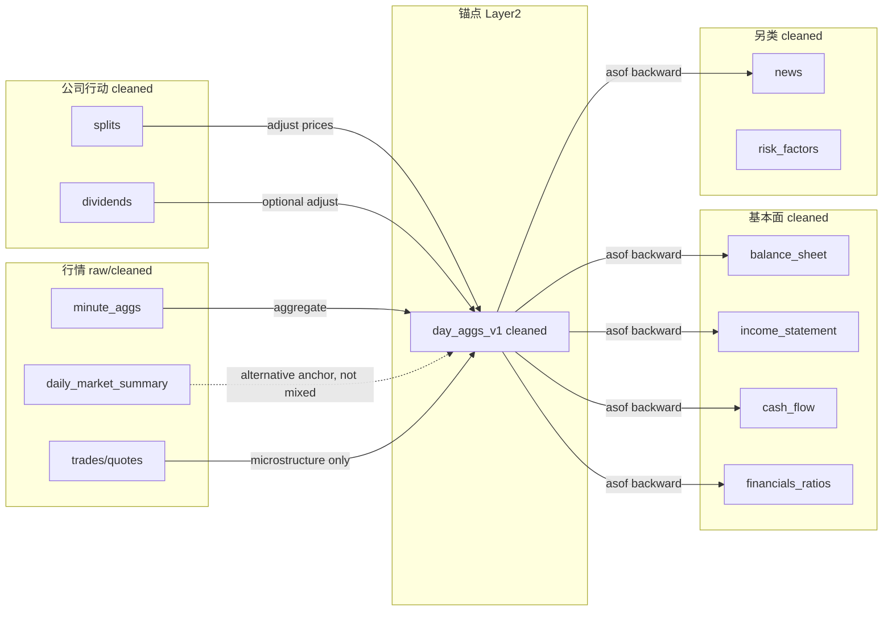

# Massive 原始数据报告（最终版 v1.0）

> **文档版本**：v1.0-final（2026-06-03）  
> **数据扫描截止**：2026-03-05（SIP 日 K 最后交易日）  
> **扫描范围**：`/home/yluel/share/projects/massive_parquet` + `/home/yluel/share/project_data_backup`  
> **维护路径**：`docs/team_docs/Massive原始数据报告.md`

| 读者 | 建议阅读顺序 |
|---|---|
| **决策者 / PM** | §1 执行摘要 → §10.1 严重度 → §10.7 修复路线图 |
| **量化研究员** | §1 → §4.0–4.0.3 → §8 → §10.6 场景矩阵 |
| **数据工程师** | §6 → §10.9–10.10 → 附录 H → §11 脚本索引 |
| **组长 / 分工落地** | [Massive数据治理与改进行动清单.html](./Massive数据治理与改进行动清单.html)（任务表、验收标准） |
| **预处理 / ATR** | [美股原始数据预处理标准方案_因子入模前.md](./美股原始数据预处理标准方案_因子入模前.md)（v2.2：**§2 ATR** A/T/R + Stage 0–10；**不含**因子去极值/中性化） |
| **其他 AI** | §0 → §10 → 附录 A/B/D/H/I |

**姊妹文档**：
- [Massive数据治理与改进行动清单.html](./Massive数据治理与改进行动清单.html) — 分工版：P0 问题、改进步骤、任务总表  
- [美股原始数据预处理标准方案_因子入模前.md](./美股原始数据预处理标准方案_因子入模前.md) — 因子入模前的标准流水线（映射 Massive 字段与 PREPROC 任务）

**文档用途**：

1. 团队成员了解 Massive 本地数据的存放、格式、清洗状态与已知缺陷；
2. **供 AI / 新人** 设计因子预处理流水线（PiT、asof、复权、universe 等）；
3. **指导数据补全**：哪些文件必须重下、用哪条下载链路、哪些 cron 应暂停。

---

## 目录

**正文**

0. [给 AI 的任务上下文](#0-给-ai-的任务上下文)
1. [执行摘要（30 秒读懂）](#1-执行摘要30-秒读懂)
2. [数据存在哪些目录](#2-数据存在哪些目录)
3. [数据分几大类](#3-数据分几大类)
4. [逐数据集详解（含 head(3) 样例）](#4-逐数据集详解含-head3-样例)
5. [raw 与 cleaned 有什么区别](#5-raw-与-cleaned-有什么区别)
6. [数据从哪来、怎么下载](#6-数据从哪来怎么下载)
7. [清洗（预处理）做了什么](#7-清洗预处理做了什么)
8. [对齐与因子投喂：cleaned 之后还要做什么](#8-对齐与因子投喂cleaned-之后还要做什么)
8.1. [延伸阅读：因子入模前预处理标准方案](./美股原始数据预处理标准方案_因子入模前.md)
9. [怎么读这些数据（推荐路径）](#9-怎么读这些数据推荐路径)
10. [数据问题汇总与处理建议](#10-数据问题汇总与处理建议)
11. [相关脚本与文档索引](#11-相关脚本与文档索引)

**附录**

- [附录 A：全数据集技术规格表（26 源）](#附录-a全数据集技术规格表26-源)
- [附录 B：处理状态矩阵（已做 / 未做）](#附录-b处理状态矩阵已做--未做)
- [附录 C：清洗规则完整配置（YAML 映射）](#附录-c清洗规则完整配置yaml-映射)
- [附录 D：下游待处理清单（供 AI 分析）](#附录-d下游待处理清单供-ai-分析)
- [附录 E：跨源 Join 与锚点设计](#附录-e跨源-join-与锚点设计)
- [附录 F：完整字段列表（三大报表等）](#附录-f完整字段列表三大报表等)
- [附录 G：数据质量观察与已知缺陷](#附录-g数据质量观察与已知缺陷)
- [附录 H：REST 分页截断清单（需重下）](#附录-hrest-分页截断清单需重下)
- [附录 I：一页纸速查卡](#附录-i一页纸速查卡)

<details>
<summary>§4 / §10 子节索引（点击展开）</summary>

**§4 子节**

- [4.0 复权说明](#40-量价数据的复权说明重要)
- [4.0.1 缺失值与 panel 稀疏性](#401-缺失值覆盖度与-panel-稀疏性)
- [4.0.2 REST 分页截断](#402-rest-分页截断数据完整性红线)
- [4.0.3 价量跨粒度一致性](#403-价量跨粒度一致性与时间语义)
- [4.1–4.6 各数据集 head(3) 样例](#41-行情类)

**§10 子节**

- [10.1 严重度总览](#101-问题严重度总览) · [10.2 P0 完整性](#102-p0数据完整性问题必须先修) · [10.3 P1 价量误用](#103-p1价量与复权误用数据在但用法不对会错)
- [10.4 P2 缺失覆盖](#104-p2缺失覆盖与清洗边界) · [10.5 P3 工程配置](#105-p3工程配置与登记问题)
- [10.6 场景矩阵](#106-按使用场景的处理建议) · [10.7 修复路线图](#107-优先修复路线图)
- [10.8 自检命令](#108-快速自检命令) · [10.9 全量下载审查](#109-下载代码审查与重下建议) · [10.10 增量/cron 审查](#1010-增量下载链路审查日更-cron)

</details>

---

## 0. 给 AI 的任务上下文

### 0.1 你正在分析的是什么

这是一套 **美股 Massive（原 Polygon.io）数据的本地落盘**，不是实时 API。数据以 **Parquet** 存储，分 **raw**（原始）和 **cleaned**（单源标准化）两层。**没有**统一的 feature store / 因子面板 / 跨源 master table。

**你的任务通常是**：读完本文档后，回答——

- 各类数据分别是什么粒度、什么复权状态、什么时间语义；
- cleaned 层已经做了什么、**还缺什么**才能用于因子计算；
- 设计预处理流水线（PiT、asof join、复权、universe、缺失填充等）。

### 0.2 三层架构（务必理解）

```
Layer 0  raw_massive_data/     供应商原始字段，按源分文件，~10 TB
Layer 1  cleaned_massive_data/  单源清洗 + 标准列（ticker, align_time），~243 GB
Layer 2  （尚未建设）           跨源 panel、PiT 特征视图、因子就绪表
```

**Layer 1 ≠ Layer 2**。cleaned 只解决「单文件内 ticker/时间去重标准化」，**不**解决跨源对齐。

### 0.3 关键约束（设计预处理时必须考虑）

| 约束 | 详情 |
|---|---|
| **两套日线** | REST `daily_market_summary`（拆股复权） vs SIP `day_aggs_v1`（不复权） |
| **基本面时间** | 报表用 `filing_date` 作 align_time，**不是** `period_end`；用 period_end 会前视 |
| **tickers 数组** | raw 三大报表 `tickers` 是数组；cleaned 已 explode 为单行 `ticker` |
| **tick 未清洗** | quotes/trades 共 ~10 TB，cleaned 默认跳过 |
| **REST 分页截断** | 多源文件恰好 **2000/10000** 行 → 分页未拉全 + `.ok` 锁死（§4.0.2、§10.9、附录 H） |
| **2024 财报不可用** | 三大报表 + cash_flow + short_* 2024 年文件均截断 |
| **dividends 2003+ 不可用** | 每年恰好 2000 行 |
| **分钟 ≠ 日 K 加总** | `sum(minute.volume) ≠ day.volume`（~98% ticker 不一致） |
| **日更未接主库** | `production_update_runner.py` 写 workspace，cron 应暂停（§10.10） |
| **无 universe 表** | 需从日 K 活跃 ticker + tickers 主数据自行构建 |
| **无 knowledge_time** | 只有 align_time 近似，无双时态 |
| **缺失 ≠ 填零** | 无 bar = 行不存在；字段 null = 不适用；cleaned 不做 impute |
| **报表修订** | 同 period 多条 filing_date；PiT 勿用全样本 latest |

| 组件 | 路径 | 作用 |
|---|---|---|
| 清洗脚本 | `raw_data_layer/raw_data_cleaning/massive_cleaning_framework.py` | raw → cleaned |
| 清洗配置 | `raw_data_layer/raw_data_cleaning/data_source_cleaning_config.yaml` | 每源 align_time / 主键规则 |
| 数据访问 | `data_access/config/datasets.yaml` | 登记了 day_aggs、ticks、REST 日线等 |
| 因子引擎读 cleaned | `factor_layer/factor_engine/storage/cleaned_parquet_source.py` | 默认 `align_time` + `ticker` |
| 多源对齐 | `factor_layer/factor_engine/storage/composite_source.py` | `merge_asof` backward |
| 因子评估 Database | `factor_layer/factor_evaluation_alphapurify/history_module/Database_original.py` | 价量 exact join，基本面 asof |

### 0.5 期望输出（AI 分析后应给出）

1. **按数据类别的预处理步骤清单**（行情 / 基本面 / 事件 / 文本）
2. **锚点 panel 设计**（建议：`cleaned us_stocks_sip/day_aggs` 的 `(align_time, ticker)`）
3. **PiT 规则**（尤其 fundamentals 的 filing_date vs period_end）
4. **复权策略**（SIP 日 K 是否后复权/前复权，是否用 splits/dividends 表）
5. **Universe 定义**（活跃股票、退市、OTC 过滤）
6. **缺失与异常处理**（停牌日、空 ticker、条件码）
7. **分层存储建议**（raw → cleaned → feature_view → factor_lake）

> **问题与建议速查**：见 **§10 数据问题汇总与处理建议**（含 P0–P3 分级、场景矩阵、修复路线图）。

---

## 1. 执行摘要（30 秒读懂）

### 1.1 这是什么

**Massive**（原 Polygon.io）美股数据的**本地 Parquet 落盘**，根目录：

```
/home/yluel/share/projects/massive_parquet/
├── raw_massive_data/      ~10 TB，22,806 文件（供应商原始字段）
└── cleaned_massive_data/  ~243 GB，11,494 文件（+ ticker / align_time 标准列）
```

- **26 个数据集**：SIP 日/分/tick 行情、REST 日线、7 类基本面、公司行动、申报、新闻、元数据
- **有基本面**：三大报表、比率、做空、流通股（`fundamentals/`）
- **不是因子就绪面板**：cleaned ≠ 跨源 panel；因子前还要 asof / PiT / 复权 / universe（§8）

### 1.2 现在能用什么、不能用什么

| 状态 | 数据 | 说明 |
|:---:|---|---|
| ✅ | SIP `day_aggs` / `minute_aggs` / tick | 5657 日文件，2003-09-10 ~ 2026-03-05 |
| ✅ | REST `daily_market_summary` | 2004–2026，**拆股复权**（不含分红） |
| ✅ | 基本面 **2010–2023、2025–2026** | 三大报表行数正常 |
| ✅ | `splits`、`ipos`、SIP cleaned 日 K | 可用于复权因子与动量 |
| ❌ | **2024 三大报表 + cash_flow** | 各仅 10,000 行（分页截断） |
| ❌ | **short_interest/volume 2024** | 各 10,000 行 |
| ❌ | **dividends 2003–2026** | 每年 2,000 行 |
| ❌ | **risk_factors 2015–2026** | 每年 2,000 行 |
| ❌ | news / all_tickers / sec_edgar | 快照，非全量 |
| ❌ | 10-K / 8-K 全文 | 目录空，未纳入下载脚本 |

### 1.3 三条铁律（用错必翻车）

1. **两套日线不可混用**：SIP `day_aggs`（不复权） vs REST `daily_market_summary`（拆股复权）
2. **基本面用 `filing_date` 对齐**，禁止用 `period_end`（前视）
3. **禁止假设 `sum(minute.volume) == day.volume`**（仅 ~2% 一致）

### 1.4 立即行动项（Top 3）

| # | 行动 | 详见 |
|---|---|---|
| 1 | **重下 REST 截断源**（删 `.ok` + `max_pages=None` + `skip_existing=False`） | §10.9.4、附录 H |
| 2 | **暂停日更 cron**（`daily_update_scheduler.sh`），勿信 workspace 增量数据 | §10.10.5 |
| 3 | 因子开发先用 **cleaned day_aggs + 2023 及以前基本面**；2024 财报等补完再用 | §10.6 |

### 1.5 备份与其他路径

- **灾备 tick**：`/home/yluel/share/project_data_backup/`（~11 TB；minute 仅部分，无 day/基本面）
- **空目录勿用**：`/home/yluel/share/raw_massive_data/`
- 各数据集 **head(3) 样例**见 §4

---

## 2. 数据存在哪些目录

### 2.1 主库（用这个）

```
/home/yluel/share/projects/massive_parquet/
├── raw_massive_data/              ← 原始数据（~10 TB，22,806 个 parquet）
│   ├── aggregate_bars/            ← REST 日行情（全市场、按年一个文件）
│   ├── corporate_actions/         ← 分红、拆股、IPO
│   ├── filing/                    ← SEC 风险因子、申报索引
│   ├── fundamentals/              ← ★ 基本面（三大报表、比率、做空、流通股）
│   ├── market_operations/         ← 交易所、条件码、节假日
│   ├── news/                      ← 新闻
│   ├── tickers/                   ← 证券代码主数据
│   └── us_stocks_sip/             ← SIP 行情（日K/分K/tick，体量最大）
├── cleaned_massive_data/          ← 清洗后（~243 GB，11,494 个 parquet）
│   └── _cleaning_run_summary.json ← 最近一次清洗统计
└── cursors/                       ← 空，预留增量游标
```

### 2.2 备份库（tick 灾备用）

```
/home/yluel/share/project_data_backup/     ← rsync 备份，约 11 TB
├── .tmp/                                   ← 688 GB 下载临时 gz，不是正式数据
└── us_stocks_sip/
    ├── quotes_v1/    ← 7.1 TB，✅ 与主库完整一致
    ├── trades_v1/    ← 2.9 TB，⚠️ 缺 4 个文件
    └── minute_aggs_v1/ ← 3.9 GB，⚠️ 仅部分日期
```

备份脚本：`raw_data_layer/raw_data_fetching/copy_backup.sh`（从 `massive_parquet/` rsync 到 `project_data_backup/`）。

**备份里没有**：日线 `day_aggs_v1`、基本面 `fundamentals/`、清洗层 `cleaned_massive_data/`。

### 2.3 空目录（不要用）

| 路径 | 状态 |
|---|---|
| `/home/yluel/share/raw_massive_data/` | **空**，仅占位；实际 raw 在 `massive_parquet/raw_massive_data/` |

### 2.4 两类文件命名规则

**规则 A：REST 类（基本面、公司行动、新闻等）**

```
raw_massive_data/{大类}/{子类}/{名称}_{年份}.parquet
raw_massive_data/{大类}/{子类}/{名称}_all.parquet     # 无年份，全量快照
```

示例：
- `fundamentals/balance_sheet/balance_sheet_2010.parquet`
- `fundamentals/stocks_floats/stocks_floats_all.parquet`

**规则 B：SIP 行情类（日K / 分K / tick）**

```
raw_massive_data/us_stocks_sip/{类型}/{年}/{月}/{年-月-日}.parquet
```

示例：
- `us_stocks_sip/day_aggs_v1/2024/06/2024-06-03.parquet`
- 每个文件 = **一个交易日 × 全市场所有 ticker**

---

## 3. 数据分几大类

下面这张表是**全局索引**。细节和样例见第 4 节。

| 大类 | 文件夹 | 有什么 | 频率 | raw 体量 | 已清洗？ |
|---|---|---|---|---:|---|
| **行情** | `aggregate_bars/` | 全市场日 OHLCV（REST） | 日 | 1.8 GB | ✅ |
| **行情** | `us_stocks_sip/day_aggs_v1` | 日 K 线 | 日 | 1.4 GB | ✅ |
| **行情** | `us_stocks_sip/minute_aggs_v1` | 1 分钟 K 线 | 1 分钟 | 84 GB | ✅ |
| **行情** | `us_stocks_sip/quotes_v1` | 逐笔报价 | tick | 7.1 TB | ❌ 默认跳过 |
| **行情** | `us_stocks_sip/trades_v1` | 逐笔成交 | tick | 2.9 TB | ❌ 默认跳过 |
| **基本面** | `fundamentals/balance_sheet` | 资产负债表 | 季/年报 | ~382 MB | ✅ |
| **基本面** | `fundamentals/income_statement` | 利润表 | 季/年报/TTM | 同上 | ✅ |
| **基本面** | `fundamentals/cash_flow_statement` | 现金流量表 | 季/年报/TTM | 同上 | ✅ |
| **基本面** | `fundamentals/financials_ratios` | PE/PB/ROE 等比率 | 日截面 | 同上 | ✅ |
| **基本面** | `fundamentals/short_interest` | 做空余额 | 约半月 | 同上 | ✅ |
| **基本面** | `fundamentals/short_volume` | 每日做空成交量 | 日 | 同上 | ✅ |
| **基本面** | `fundamentals/stocks_floats` | 自由流通股本 | 低频 | 同上 | ✅ |
| **公司行动** | `corporate_actions/dividends` | 分红 | 事件 | ~15 MB | ✅ |
| **公司行动** | `corporate_actions/splits` | 拆股 | 事件 | 同上 | ✅ |
| **公司行动** | `corporate_actions/ipos` | IPO | 事件 | 同上 | ✅ |
| **申报** | `filing/risk_factors` | 10-K 风险因子文本 | 按申报 | ~5 MB | ✅ |
| **申报** | `filing/sec_edgar_index` | SEC 申报索引 | 快照 | 同上 | ✅ |
| **申报** | `filing/risk_categories` | 风险分类字典 | 静态 | 同上 | ✅ |
| **申报** | `filing/10k_sections` | 10-K 章节全文 | — | **无数据** | — |
| **申报** | `filing/8k_text` | 8-K 全文 | — | **无数据** | — |
| **新闻** | `news/news` | 新闻 + 情感分析 | 事件 | 1.6 MB | ✅ |
| **元数据** | `tickers/all_tickers` | 证券主数据 | 快照 | 136 KB | ✅ |
| **元数据** | `tickers/ticker_types` | 证券类型字典 | 静态 | 同上 | ✅ |
| **元数据** | `market_operations/*` | 交易所/条件码/节假日 | 静态/年历 | 64 KB | ✅ |

---

## 4. 逐数据集详解（含 head(3) 样例）

> 说明：
> - 样例均来自 **raw** 层真实 parquet，`df.head(3)`
> - 路径前缀省略，完整路径 = `raw_massive_data/` + 下表「文件夹路径」
> - 列很多的表（如资产负债表 38 列），样例展示**全部列**；阅读时可先看加粗的关键列

---

### 4.0 量价数据的复权说明（重要）

> **一句话结论**：本地有两套量价，复权状态**不一样**，不能混用做长周期回测。

| 数据集 | 复权状态 | 说明 |
|---|---|---|
| `aggregate_bars/daily_market_summary` | **拆股复权后** | 下载时 API 参数 `adjusted=true`（仅针对拆股/合股，不含分红） |
| `us_stocks_sip/day_aggs_v1` | **不复权（原始价）** | S3 Flatfiles 原始成交聚合，不做复权 |
| `us_stocks_sip/minute_aggs_v1` | **不复权** | 同上 |
| `us_stocks_sip/quotes_v1` | **不复权** | 原始报价 |
| `us_stocks_sip/trades_v1` | **不复权** | 原始成交价 |
| `cleaned_massive_data` 中上述行情 | **与 raw 相同** | 清洗只加标准列，**不改 OHLCV 数值** |

#### 有没有单独的「复权因子」字段？

**量价 parquet 本身没有** `adj_factor` / `复权因子` 这类列。  
但 **公司行动表**里提供了自行复权所需的因子：

| 数据 | 字段 | 用途 |
|---|---|---|
| `corporate_actions/splits` | `historical_adjustment_factor`, `split_from`, `split_to`, `execution_date` | 按拆股事件把历史价格/成交量回溯调整 |
| `corporate_actions/dividends` | `historical_adjustment_factor`, `ex_dividend_date`, `cash_amount` | 按除息日把历史价格乘以因子（分红复权） |

Massive API 文档对因子的用法（摘自 `rest_api_doc/corporate_actions/splits.md`）：

> 对日期 D 的价格，找到 **execution_date 在 D 之后** 的最近拆股，将**未复权价**乘以该拆股的 `historical_adjustment_factor`。

#### 实证：NVDA 2024-06-10 十拆一

| 日期 | SIP `day_aggs` close（不复权） | REST `daily_market_summary` close（拆股复权） |
|---|---:|---:|
| 2024-06-07（拆股前） | **1208.88** | **120.888**（≈ 1208.88 ÷ 10） |
| 2024-06-10（拆股后） | 121.79 | 121.79 |
| 2024-06-11 | 120.91 | 120.91 |

拆股日两侧：SIP 价格从 ~1200 跳到 ~120（断崖），REST 则连续（~121 附近）。

成交量同样体现差异：2024-06-07 NVDA 成交量 SIP ≈ 4124 万，REST ≈ 4.12 亿（约 10 倍，与拆股复权后成交量回溯一致）。

#### 实证：TSLA 两次拆股（验证 REST 是「累积拆股后复权到当前股本」）

| 日期 | SIP close | REST close | SIP/REST | 说明 |
|---|---:|---:|---:|---|
| 2020-08-28（2020 五拆一前） | 2213.40 | 147.56 | **15.0** | 两次拆股因子累积（5×3） |
| 2020-08-31（2020 拆股后） | 498.32 | 166.11 | **3.0** | 仍受 2022 三拆一影响 |
| 2022-08-24（2022 三拆一前） | 891.29 | 297.10 | **3.0** | 同上 |
| 2022-08-25（2022 拆股后） | 296.07 | 296.07 | **1.0** | 与 SIP 完全一致 |

> TSLA 拆股后 ratio 仍为 3.0 **不是**「REST 未复权」，而是 REST 把**全部历史**回溯到**当前**股本口径；后续再有拆股时，更早的 REST 历史价也会变化。

#### 实证：分红不复权

KO、AAPL 等除息日前后，SIP 与 REST 收盘价 **diff = 0**。REST `adjusted=true` 在本库中表现为 **仅拆股复权，不含分红复权**。

#### 对因子/回测的实际建议

1. **长周期动量、均线、收益率**：优先用 `daily_market_summary`（已拆股复权），或自行用 `splits`/`dividends` 对 SIP 数据做复权。
2. **生产日线 `cleaned day_aggs_v1`**：目前是**不复权**的；跨多年回测前必须自行复权，否则拆股日前后会出假信号。
3. **tick / 分钟线（Layer 1 cleaned）**：供应商数值**不复权**；**因子引擎 `ts_*` 读分钟 OHLC** 须走 `fact_bars_adjusted_minute`（与日线同 `PREPROC-003` 拆股复权，见治理清单 **§3.2**）。tick 微观研究可用 raw，聚合成分钟后复权。
4. **分红复权**：REST `adjusted=true` **通常只含拆股，不含分红**；要做「总复权 / 含分红前复权」需用 `dividends.historical_adjustment_factor` 额外处理。
5. **两套日线不要混用**：`daily_market_summary`（复权）和 `day_aggs_v1`（不复权）数值不可直接对比。

---

### 4.0.1 缺失值、覆盖度与 panel 稀疏性

> **一句话结论**：Massive 本地数据的「缺失」主要是 **行不存在**（sparse panel），不是 parquet 里填了 NaN。cleaned 层只删空 ticker / 空 align_time，**不做**缺失填充、插值或 forward fill。

#### 三种「缺失」要分开理解

| 类型 | 表现 | 典型场景 | 因子层建议 |
|---|---|---|---|
| **行不存在** | 该 `(date, ticker)` 在 parquet 里没有一行 | 非交易日、未上市、已退市、当日无成交 | 建锚点 panel 后 left join；区分「无数据」与「有 bar 但 volume=0」 |
| **字段为 null** | 行存在，某列是 NaN / null | 报表科目不适用（如无 inventory 的 SaaS）、比率分母为 0 | 按业务决定是否填 0、中位数、或保留 NaN |
| **清洗丢弃** | raw 有行，cleaned 没有 | `ticker` 空、`align_time` 解析失败 | 见下文「cleaned 丢弃统计」 |

#### 交易日文件覆盖（SIP day_aggs）

| 项目 | 数值 |
|---|---|
| 文件数 | **5,657** 个日文件 |
| 日期范围 | **2003-09-10** ~ **2026-03-05** |
| 缺失的 weekday | 与 NYSE **休市日**一致（元旦、MLK、Good Friday、独立日等）；如 **2025-01-09**（全国哀悼日休市）无文件 |
| 非休市 weekday 缺口 | 抽样 2020–2025 **未发现**额外缺口（除上述休市） |
| 参考表 | `market_operations/market_holidays` **仅含 2026–2027**，不能用于历史缺口校验 |

> **没有「每个 ticker 每个交易日都有一行」的 dense panel**。某 ticker 某天无成交 → 通常 **整行缺失**，不是 OHLCV 填 NaN。

#### 行情 OHLCV 缺失与零值（抽样 2024-06-07 day_aggs）

| 指标 | 数值 | 说明 |
|---|---:|---|
| 当日 ticker 数 | ~10,539 | 全市场当日有 bar 的标的 |
| `close` 为 null | **0** | OHLC 在 bar 存在时基本完整 |
| `volume = 0` | **~0.8%**（83/10539） | 多为 ETF/极低流动性；**close 仍非零** |
| `ticker` 为 null | **1 行** | cleaned 会丢弃 |
| 6 月 weekday 行数波动 | 10,518 ~ 10,575 | 反映 listing/delisting，不是文件缺失 |

**SIP vs REST 覆盖（同日 2024-06-07）**：交集 **10,538** ticker；SIP 多 1 个 null ticker，REST 多 1 个 `'NA'` 字符串 ticker。

#### tick 级 null 语义

| 字段 | 抽样 | 含义 |
|---|---|---|
| `trades.conditions` | ~**24%** 为 null | 正常成交常无特殊条件码；**不等于**坏数据 |
| `quotes.ask_price/bid_price = 0` | head 样例可见 | 可能为占位/无有效报价；LOB 重建需过滤 |
| `quotes/trades` cleaned | 默认 **disabled** | ~10 TB，仅 1 个测试 cleaned 文件 |

#### 基本面：结构性 null vs 数据质量

**关键科目（balance_sheet_2023，24,150 行）**

| 字段 | null 率 | 备注 |
|---|---:|---|
| `total_assets` / `total_liabilities` / `total_equity` | **~0.1%** | 核心资产负债表字段极完整 |
| `cash_and_equivalents` | **0.7%** | |
| `inventories` | **52%** | 金融/软件公司通常无此科目 → **结构性 null** |
| `goodwill` | **48%** | 同上 |

**利润表（income_statement_2023，42,602 行）**

| 字段 | null 率 | 备注 |
|---|---:|---|
| `operating_income` | **1.8%** | |
| `basic_earnings_per_share` | **2.1%** | |
| `revenue` | **15.1%** | 部分实体/特殊报表类型无 revenue 行 |
| `extraordinary_items` | **99.9%** | 几乎永远为空 → 可忽略 |

**`financials_ratios_all`（5,199 行，快照）**

| 字段 | null 率 | 备注 |
|---|---:|---|
| `return_on_equity` / `debt_to_equity` | **~0.1%** | |
| `price_to_earnings` | **56.3%** | 亏损/无 EPS 则无 PE |
| `price_to_cash_flow` | **47.1%** | |
| `dividend_yield` | **19.9%** | 不分红则为 null |

> **基本面不是日频 dense panel**：按 **事件**（`filing_date`）存盘。asof join 到日 K 后，两披露之间的交易日该因子列自然为 NaN，需 forward fill 或「最近一次已知值」策略，且注意 PiT。

#### 报表修订 / 重复披露（PiT 相关）

cleaned `balance_sheet_2023` 中，同一 `(ticker, period_end, timeframe)` 出现 **多条不同 filing_date** 的行约 **76** 条（如 BCPC 2023-09-30 季报在 2023-10-27 与 2024-10-30 各报一次）。

- cleaned 默认 dedup：`keep_latest_by_align_time` → 同主键保留 **最新 filing_date**
- 做严格 PiT 回测时，应保留 **披露时点之前可见的最新版本**，不能简单用全样本最新 filing

#### 公司行动 / 元数据 null

| 数据集 | 字段 | null 率 | 说明 |
|---|---|---:|---|
| `dividends_2024` | `historical_adjustment_factor` | **19.8%** | 无因子时需自行计算或跳过该事件 |
| `splits_2024` | `historical_adjustment_factor` | **0%** | |
| `dividends` | `cash_amount` / `currency` | **0%** | |
| `ipos_all` | `announced_date` | **80.8%** | 多数 `ipo_status=history` 无公告日 |
| `ipos_all` | `listing_date` | **13.2%** | pending 等状态常见 |
| `sec_edgar_index` | `filing_date` | **~部分历史行** | join 前需 dropna |
| `sec_edgar_index` | `ticker` | **~48% 清洗丢弃** | 原始行 ticker 为空 |
| `news` | `amp_url` | **95.2%** | 可选字段，可忽略 |

#### ⚠️ REST 分页上限导致的「伪完整」（重要）

以下文件行数 **≈ 10,000**，与同源其他年份（数十万行）相比明显异常，**疑为 API 分页未拉全**：

| 文件 | 行数 | 对比 |
|---|---:|---|
| `short_interest_2024.parquet` | **10,000** | 2023 年 **470,159** 行；且 2024 文件内 `settlement_date` 仅 **2024-01-12** 单日 |
| `short_volume_2024.parquet` | **10,000** | 2025 年 **3,459,381** 行 |
| `news_all.parquet` | **2,000** | 快照，非历史全量 |
| `all_tickers_all.parquet` | **2,000** | 快照，非全 ticker 宇宙 |
| `sec_edgar_index_all.parquet` | **10,000** | 索引快照 |

**因子使用前务必确认**：涉及上述源的 2024 做空 interest / short volume 因子，需重新下载或换源，**不可**假设覆盖完整。

#### cleaned 层对缺失的处理（与 raw 对比）

| 操作 | 是否做 | 说明 |
|---|---|---|
| 删 `ticker` 为空 | ✅ | 全库累计丢弃 **87,583** 行；`sec_edgar_index` 占 **4,842** |
| 删 `align_time` 为空 | ✅ | 累计 **5,001** 行 |
| 主键去重 | ✅ | 基本面等同 `(ticker, period_end, …)` 保留最新 filing |
| OHLCV / 财报数值 impute | ❌ | null 原样保留 |
| 缺失交易日补行 | ❌ | 无 bar 的 (date,ticker) 不会生成 |
| 零 volume 过滤 | ❌ | 保留 |

#### 构建因子 panel 时的缺失处理 checklist

1. **锚点**：`cleaned day_aggs` 的 `(align_time, ticker)` × 交易日历（可用 `market_holidays` + weekday 推导，或直接从 day 文件 union）
2. **left join 基本面**：asof backward 后，披露间隔内为 NaN → 按需 `ffill`（注意 PiT：只能用过去披露）
3. **volume=0**：视为「有报价无成交」还是剔除，按策略定
4. **新上市 / 退市**：锚点上会出现大量 NaN 起始/结束，需 universe 掩码
5. **拆股日**：SIP 价格跳变不是缺失，是复权问题（见 §4.0）
6. **重述报表**：PiT 场景勿用 `keep_latest` 后的全历史 filing 做回测
7. **分页可疑文件**：见 §4.0.2 / 附录 H，**2024 财报与分红等不可假设完整**

---

### 4.0.2 REST 分页截断（数据完整性红线）

> **一句话结论**：凡 REST 下载、且文件行数 **恰好为 2000 或 10000** 的，应默认视为 **分页未拉全**，不可直接用于生产因子/回测，需重下或换源。

#### 根因（下载链路）

| 环节 | 问题 |
|---|---|
| `raw_data_layer/raw_data_fetching/download_all_history.py` | 支持 `max_pages`；传参时会截断 `_iter` 游标 |
| `raw_data_layer/data_daily_update/async_universal_fetcher.py` | **默认 `max_pages=10`**，`page_size=1000` → 单次 REST 拉取上限约 **1 万行** |
| 历史 manifest | `download_results.csv` 中部分路径指向旧布局（无 `raw_massive_data/` 前缀），与现网目录不一致 |

重下时建议：`max_pages=None`（或不传）、`limit≥5000`，确认游标走到底。

#### 按严重程度的截断清单

**🔴 致命（整年/整源不可用）**

| 数据集 | 异常模式 | 对比 |
|---|---|---|
| `fundamentals/balance_sheet_2024` | **10,000** 行 | 2023: **24,150**；2025: **18,140** |
| `fundamentals/income_statement_2024` | **10,000** | 2023: **42,602**；2025: **33,015** |
| `fundamentals/cash_flow_statement_2024` | **10,000** | 2023: **42,526**；2025: **32,981** |
| `fundamentals/short_interest_2024` | **10,000**，且 settlement 仅 **2024-01-12** | 2023: **470,159** |
| `fundamentals/short_volume_2024` | **10,000** | 2025: **3,459,381** |

→ **2024 年基本面因子、做空类因子在当前库中不可用。**

**🟠 严重（按年封顶 2000 行，2003 年起持续）**

| 数据集 | 异常模式 | 说明 |
|---|---|---|
| `corporate_actions/dividends_{2003..2026}` | 每年 **恰好 2000** | 2000–2002 正常（1/2/22 行）；2003 起疑似 `limit=2000` 封顶 |
| `filing/risk_factors_{2015..2026}` | 每年 **恰好 2000** | NLP/风险因子样本严重偏少 |

**🟡 中等（快照型，非 panel）**

| 数据集 | 行数 |
|---|---:|
| `news/news_all` | 2,000 |
| `tickers/all_tickers_all` | 2,000 |
| `filing/sec_edgar_index_all` | 10,000 |

完整文件列表见 **附录 H**。

#### 快速自检命令

```python
import pyarrow.parquet as pq
from pathlib import Path
raw = Path("/home/yluel/share/projects/massive_parquet/raw_massive_data")
for f in sorted(raw.rglob("*.parquet")):
    n = pq.read_metadata(f).num_rows
    if n in (2000, 10000):
        print(n, f.relative_to(raw))
```

---

### 4.0.3 价量跨粒度一致性与时间语义

> **一句话结论**：日 K、分钟 K、REST 日线是**不同聚合口径**；**不能**假设 `sum(minute.volume) == day.volume`，也不能用分钟末 bar 的 close 代替日 close。

#### 分钟 vs 日 K 成交量（实证 2024-06-03）

| 指标 | 数值 |
|---|---:|
| ticker 数 | 10,561 |
| `sum(minute.volume) == day.volume` 比例 | **1.9%** |
| 误差在 1% 以内 | **11.7%** |
| `sum(minute)/day` 中位数 | **0.913** |

**AAPL 同日**：day volume **50,080,539**；minute 全时段 sum **43,588,669**（757 根 bar）；即便只取近似 RTH（UTC 13:30–20:00）也仅 **41,857,466**（390 根）——仍低于 day。

**原因（可能叠加）**：
- 分钟 bar 覆盖 **扩展时段**（AAPL UTC **08:00–23:59**），与日 K 的 **全日 SIP 聚合**口径不同
- 成交条件码、TRF、批量成交的归属规则与日聚合不一致
- 部分 venue 成交可能进入 day 但未完整进入 minute 文件

**因子层建议**：
- 日频因子 → 直接用 **day_aggs** 或 **daily_market_summary**
-  intraday 因子 → 用 minute，**不要**与日 K volume 对账校验
- 若需从 minute 聚合成日 → 明确时段（RTH/ETH）并接受与官方 day bar 的偏差

#### `window_start` 时间语义

| 粒度 | `window_start` / `align_time` | 说明 |
|---|---|---|
| **日 K** | 统一为当日 **04:00 UTC** | 美东会话日界锚点；**不是** 09:30 开盘 |
| **分钟 K** | 每 bar 的起始 UTC 时刻 | 含盘前盘后；读 RTH 因子需自行 filter |
| **REST 日 K** | `trade_date`（日期）+ 辅助 `t` | 与 SIP 字段体系不同 |

cleaned 层 `align_time` 由上述列解析为 `datetime64[ns, UTC]`，与 raw 数值一致。

#### `datasets.yaml` schema 与磁盘不符

`data_access/config/datasets.yaml` 中 `us_stocks_sip_day_aggs` 声明 `volume: int`、`window_start: int`，实际 cleaned 文件为 **`double`**。PR8 schema 自检可能误报或静默漂移，使用前宜以磁盘 schema 为准。

#### data_access 登记覆盖不足

24 个 cleaned 源中，yaml **仅登记少数**（day cleaned/raw、REST 日线、floats、ticks 等）。`minute_aggs` cleaned、全部 `fundamentals/*` cleaned、`corporate_actions/*` 等 **未登记**——读这些需直读路径或补 yaml。

---

### 4.1 行情类

---

#### 4.1.1 `aggregate_bars/daily_market_summary` — REST 全市场日行情

| 项目 | 内容 |
|---|---|
| **文件夹** | `raw_massive_data/aggregate_bars/daily_market_summary/` |
| **文件命名** | `daily_market_summary_{YYYY}.parquet`（23 个文件，2004–2026） |
| **频率** | 每个交易日一行 × 每个 ticker |
| **单文件行数** | 约 190 万行/年 |
| **一行代表** | 某 ticker 在某天的 OHLCV |
| **与 day_aggs_v1 区别** | 字段是 Polygon 缩写（`T/o/c/h/l`），按**年**一个文件；day_aggs 是标准字段名、按**日**一个文件 |
| **复权** | **拆股复权后**（下载参数 `adjusted=true`；不含分红复权） |
| **已清洗** | ✅ |

**字段（10 列）**

| 字段 | 类型 | 含义 |
|---|---|---|
| `T` | string | ticker |
| `o/c/h/l` | float | 开/收/高/低 |
| `v` | float | 成交量 |
| `vw` | float | VWAP |
| `t` | int64 | 窗口起始时间（Unix **毫秒**） |
| `n` | float | 成交笔数 |
| `trade_date` | string | 交易日期 `YYYY-MM-DD` |

**样例文件**：`daily_market_summary_2004.parquet`

**head(3)**

```json
[
  {"T":"HRVE","v":175.0,"vw":3.5944,"o":3.56,"c":3.64,"h":3.64,"l":3.56,"t":1073077200000,"n":4.0,"trade_date":"2004-01-02"},
  {"T":"PAS","v":166400.0,"vw":17.1101,"o":17.1,"c":17.12,"h":17.2,"l":17.01,"t":1073077200000,"n":442.0,"trade_date":"2004-01-02"},
  {"T":"SNBC","v":3734.2,"vw":133.2745,"o":131.75,"c":130.75,"h":136.8,"l":130.0,"t":1073077200000,"n":114.0,"trade_date":"2004-01-02"}
]
```

---

#### 4.1.2 `us_stocks_sip/day_aggs_v1` — SIP 日 K 线

| 项目 | 内容 |
|---|---|
| **文件夹** | `raw_massive_data/us_stocks_sip/day_aggs_v1/{YYYY}/{MM}/{YYYY-MM-DD}.parquet` |
| **文件数** | 5,657（2003–2026） |
| **频率** | 日 K |
| **一行代表** | 某 ticker 在某天的 OHLCV |
| **单日行数示例** | 2024-06-03 约 10,561 行 |
| **复权** | **不复权**（Flatfiles 原始价；跨拆股日有价格断崖） |
| **已清洗** | ✅（**生产推荐用这个的 cleaned 版本**，但清洗不改价格） |

**字段（8 列）**

| 字段 | 类型 | 含义 |
|---|---|---|
| `ticker` | string | 证券代码 |
| `open/close/high/low` | float | OHLC |
| `volume` | float | 成交量 |
| `window_start` | float | 窗口起始（Unix **纳秒**）；日 K 统一为当日 **04:00 UTC**（见 §4.0.3） |
| `transactions` | float | 成交笔数 |

> **注意**：日 K 的 `volume`/`window_start` 在 parquet 中为 **float/double**，非整型。

**样例文件**：`2003/09/2003-09-10.parquet`

**head(3)**

```json
[
  {"ticker":"A","volume":2869700.0,"open":25.4,"close":24.49,"high":25.58,"low":24.41,"window_start":1063166400000000000,"transactions":2301.0},
  {"ticker":"AA","volume":3543400.0,"open":28.2,"close":27.92,"high":28.7,"low":27.85,"window_start":1063166400000000000,"transactions":3011.0},
  {"ticker":"AAp","volume":550.0,"open":75.0,"close":73.44,"high":75.5,"low":72.65,"window_start":1063166400000000000,"transactions":6.0}
]
```

**cleaned 层额外增加的列（前 5 列示例）**

```json
[
  {"source":"us_stocks_sip/day_aggs_v1","dataset_type":"market_bar","frequency":"daily","ticker":"A","align_time":"2024-06-03T04:00:00.000Z"},
  {"source":"us_stocks_sip/day_aggs_v1","dataset_type":"market_bar","frequency":"daily","ticker":"AA","align_time":"2024-06-03T04:00:00.000Z"},
  {"source":"us_stocks_sip/day_aggs_v1","dataset_type":"market_bar","frequency":"daily","ticker":"AAA","align_time":"2024-06-03T04:00:00.000Z"}
]
```

---

#### 4.1.3 `us_stocks_sip/minute_aggs_v1` — SIP 1 分钟 K 线

| 项目 | 内容 |
|---|---|
| **文件夹** | `raw_massive_data/us_stocks_sip/minute_aggs_v1/{YYYY}/{MM}/{YYYY-MM-DD}.parquet` |
| **文件数** | 5,657 |
| **频率** | 1 分钟 K |
| **字段** | 与 day_aggs_v1 **完全相同**（8 列） |
| **单日行数示例** | 2024-06-03 约 152 万行 |
| **复权** | **不复权** |
| **已清洗** | ✅ |
| **与日 K 关系** | 字段相同，但 **≠ 日 K 的分钟加总**（见 §4.0.3）；含 **盘前盘后** 扩展时段 |

> ⚠️ 勿用「minute 末 bar close」代替 official day close（例：NVDA 2024-06-10 分钟末 121.60 vs day 121.79）。

**样例文件**：`2003/09/2003-09-10.parquet`（87 万行）

**head(3)**

```json
[
  {"ticker":"A","volume":47000.0,"open":25.4,"close":25.4,"high":25.4,"low":25.4,"window_start":1063200600000000000,"transactions":18.0},
  {"ticker":"A","volume":12000.0,"open":25.39,"close":25.39,"high":25.39,"low":25.39,"window_start":1063200660000000000,"transactions":5.0},
  {"ticker":"A","volume":8000.0,"open":25.38,"close":25.38,"high":25.38,"low":25.38,"window_start":1063200720000000000,"transactions":3.0}
]
```

---

#### 4.1.4 `us_stocks_sip/quotes_v1` — 逐笔报价（tick）

| 项目 | 内容 |
|---|---|
| **文件夹** | `raw_massive_data/us_stocks_sip/quotes_v1/{YYYY}/{MM}/{YYYY-MM-DD}.parquet` |
| **体量** | **7.1 TB**（最大数据集） |
| **频率** | 每条报价更新一行 |
| **单日行数示例** | 2024-06-03 约 1000 万行（不同日期差异极大） |
| **复权** | **不复权**（原始报价） |
| **已清洗** | ❌ 默认禁用（仅 1 个测试文件） |

**head(3)**（样例文件 `2003/09/2003-09-10.parquet`）

```json
[
  {"ticker":"A","ask_exchange":0.0,"ask_price":0.0,"ask_size":0.0,"bid_exchange":0.0,"bid_price":0.0,"bid_size":0.0,"conditions":null,"indicators":0.0,"participant_timestamp":1063166400065700000,"sequence_number":1063166400065700000,"sip_timestamp":1063166400065700000,"tape":0.0,"trf_timestamp":0.0},
  {"ticker":"A","ask_exchange":0.0,"ask_price":0.0,"ask_size":0.0,"bid_exchange":0.0,"bid_price":0.0,"bid_size":0.0,"conditions":null,"indicators":0.0,"participant_timestamp":1063166400065700000,"sequence_number":1063166400065700000,"sip_timestamp":1063166400065700000,"tape":0.0,"trf_timestamp":0.0},
  {"ticker":"A","ask_exchange":0.0,"ask_price":0.0,"ask_size":0.0,"bid_exchange":0.0,"bid_price":0.0,"bid_size":0.0,"conditions":null,"indicators":0.0,"participant_timestamp":1063166400065700000,"sequence_number":1063166400065700000,"sip_timestamp":1063166400065700000,"tape":0.0,"trf_timestamp":0.0}
]
```

---

#### 4.1.5 `us_stocks_sip/trades_v1` — 逐笔成交（tick）

| 项目 | 内容 |
|---|---|
| **文件夹** | `raw_massive_data/us_stocks_sip/trades_v1/{YYYY}/{MM}/{YYYY-MM-DD}.parquet` |
| **体量** | 2.9 TB |
| **频率** | 每笔成交一行 |
| **单日行数示例** | 2024-06-03 约 **8064 万行** |
| **复权** | **不复权**（原始成交价） |
| **已清洗** | ❌ 默认禁用 |

**head(3)**

```json
[
  {"ticker":"A","conditions":null,"correction":0.0,"exchange":10.0,"id":null,"participant_timestamp":1063166400065700000,"price":25.4,"sequence_number":1063166400065700000,"sip_timestamp":1063166400065700000,"size":100.0,"tape":0.0,"trf_id":0.0,"trf_timestamp":0.0},
  {"ticker":"A","conditions":null,"correction":0.0,"exchange":10.0,"id":null,"participant_timestamp":1063166400065700000,"price":25.4,"sequence_number":1063166400065700000,"sip_timestamp":1063166400065700000,"size":100.0,"tape":0.0,"trf_id":0.0,"trf_timestamp":0.0},
  {"ticker":"A","conditions":null,"correction":0.0,"exchange":10.0,"id":null,"participant_timestamp":1063166400065700000,"price":25.39,"sequence_number":1063166400065700000,"sip_timestamp":1063166400065700000,"size":200.0,"tape":0.0,"trf_id":0.0,"trf_timestamp":0.0}
]
```

---

### 4.2 基本面类（重点）

> **结论：有完整的基本面数据**，路径在 `raw_massive_data/fundamentals/`，共 7 个子数据集，**全部已清洗**。
>
> 三大报表的 ticker 存在 **`tickers` 数组列**里（一家公司可能对应多个代码）；清洗后会 **explode** 成一行一个 ticker。

---

#### 4.2.1 `fundamentals/balance_sheet` — 资产负债表

| 项目 | 内容 |
|---|---|
| **文件夹** | `raw_massive_data/fundamentals/balance_sheet/` |
| **文件命名** | `balance_sheet_{YYYY}.parquet`（18 个文件，2010–2031） |
| **频率** | 季报 / 年报（由 `timeframe` 字段区分） |
| **总行数** | 约 26.8 万行 |
| **一行代表** | 某公司某报告期的一份资产负债表 |
| **已清洗** | ✅；清洗后 `tickers[]` 会 explode，`align_time` = `filing_date` |

> **⚠️ 数据完整性**：
> - **`balance_sheet_2024` 仅 10,000 行**（2023 有 24,150）→ REST 分页截断，**2024 财报不可用**（见 §4.0.2）
> - **`balance_sheet_2031`** 仅 2 行，内容为 **2012 年** HBAN 报表（`fiscal_year=2031` 为分区/字段错位，**非未来披露**）
> - raw `tickers` **多元素数组**：2024 截断样本中 **1,763/10,000** 行含多个 ticker（如 `[DDS, DDT]`）；cleaned explode 后同一 CIK 报表会对应多行
> - 同一 `(ticker, period_end, timeframe)` 可有 **多条 filing_date**（修订/amendment）；cleaned 默认保留最新 filing

**关键字段**

| 字段 | 含义 |
|---|---|
| `cik` | SEC 公司标识 |
| `tickers` | **数组**，如 `["WMT"]` |
| `filing_date` | 申报日期（用于时间对齐） |
| `period_end` | 会计期间截止日 |
| `fiscal_year` / `fiscal_quarter` | 财年 / 财季 |
| `timeframe` | `quarterly` 或 `annual` |
| `total_assets` / `total_liabilities` / `total_equity` | 总资产 / 总负债 / 总权益 |
| `cash_and_equivalents` / `receivables` / `inventories` | 现金 / 应收 / 存货 |
| … | 共 **38 列**，见数据字典 |

**样例文件**：`balance_sheet_2010.parquet`

**head(3)**（WMT / TGT / GPS 2010 Q1）

```json
[
  {
    "cik":"0000104169","tickers":["WMT"],"filing_date":"2010-06-04","period_end":"2009-04-30",
    "fiscal_year":2010,"fiscal_quarter":1,"timeframe":"quarterly",
    "total_assets":162090000000.0,"total_liabilities":97899000000.0,"total_equity":63914000000.0,
    "cash_and_equivalents":6578000000.0,"receivables":3356000000.0,"inventories":34391000000.0,
    "accounts_payable":28541000000.0,"long_term_debt_and_capital_lease_obligations":35665000000.0
  },
  {
    "cik":"0000027419","tickers":["TGT"],"filing_date":"2010-05-28","period_end":"2009-05-02",
    "fiscal_year":2010,"fiscal_quarter":1,"timeframe":"quarterly",
    "total_assets":44212000000.0,"total_liabilities":30093000000.0,"total_equity":14119000000.0,
    "cash_and_equivalents":1371000000.0,"receivables":7452000000.0,"inventories":6993000000.0
  },
  {
    "cik":"0000039911","tickers":["GPS"],"filing_date":"2010-06-08","period_end":"2009-05-02",
    "fiscal_year":2010,"fiscal_quarter":1,"timeframe":"quarterly",
    "total_assets":7221000000.0,"total_liabilities":2681000000.0,"total_equity":4540000000.0,
    "cash_and_equivalents":1708000000.0,"treasury_stock":-8627000000.0
  }
]
```

**cleaned 层变化示例**（explode 后 ticker 变成单列）

```json
[
  {"source":"fundamentals/balance_sheet","ticker":"AZO","align_time":"2010-03-18T00:00:00.000Z","filing_date":"2010-03-18","period_end":"2009-02-28","timeframe":"quarterly"},
  {"source":"fundamentals/balance_sheet","ticker":"FDX","align_time":"2010-03-19T00:00:00.000Z","filing_date":"2010-03-19","period_end":"2009-02-28","timeframe":"quarterly"},
  {"source":"fundamentals/balance_sheet","ticker":"PAYX","align_time":"2010-03-24T00:00:00.000Z","filing_date":"2010-03-24","period_end":"2009-02-28","timeframe":"quarterly"}
]
```

---

#### 4.2.2 `fundamentals/income_statement` — 利润表

| 项目 | 内容 |
|---|---|
| **文件夹** | `raw_massive_data/fundamentals/income_statement/` |
| **文件命名** | `income_statement_{YYYY}.parquet`（17 个文件） |
| **总行数** | 约 46.9 万行 |
| **列数** | 34 列 |
| **已清洗** | ✅ |

**关键字段**：`revenue`, `gross_profit`, `operating_income`, `ebitda`, `net_income_loss_attributable_common_shareholders`, `basic/diluted_earnings_per_share`, `research_development`, `cost_of_revenue` 等

**head(3)**（JNJ / NVDA / WMT 2010 Q1）

```json
[
  {
    "cik":"0000200406","tickers":["JNJ"],"filing_date":"2010-05-10","period_end":"2009-03-29",
    "fiscal_year":2010,"fiscal_quarter":1,"timeframe":"quarterly",
    "revenue":15026000000.0,"gross_profit":10775000000.0,"operating_income":4649000000.0,
    "ebitda":5325000000.0,"net_income_loss_attributable_common_shareholders":3507000000.0,
    "basic_earnings_per_share":1.27,"diluted_earnings_per_share":1.26
  },
  {
    "cik":"0001045810","tickers":["NVDA"],"filing_date":"2010-05-21","period_end":"2009-04-26",
    "fiscal_year":2010,"fiscal_quarter":1,"timeframe":"quarterly",
    "revenue":664231000.0,"gross_profit":189696000.0,"operating_income":-230965000.0,
    "ebitda":-180307000.0,"net_income_loss_attributable_common_shareholders":-201338000.0,
    "basic_earnings_per_share":-0.01
  },
  {
    "cik":"0000104169","tickers":["WMT"],"filing_date":"2010-06-04","period_end":"2009-04-30",
    "fiscal_year":2010,"fiscal_quarter":1,"timeframe":"quarterly",
    "revenue":94242000000.0,"gross_profit":23854000000.0,"operating_income":5217000000.0,
    "ebitda":6917000000.0,"net_income_loss_attributable_common_shareholders":3022000000.0,
    "basic_earnings_per_share":0.26
  }
]
```

---

#### 4.2.3 `fundamentals/cash_flow_statement` — 现金流量表

| 项目 | 内容 |
|---|---|
| **文件夹** | `raw_massive_data/fundamentals/cash_flow_statement/` |
| **文件命名** | `cash_flow_statement_{YYYY}.parquet`（17 个文件） |
| **总行数** | 约 46.8 万行 |
| **列数** | 32 列 |
| **已清洗** | ✅ |

**关键字段**：`net_cash_from_operating_activities`, `net_cash_from_investing_activities`, `net_cash_from_financing_activities`, `change_in_cash_and_equivalents`, `dividends`, `purchase_of_property_plant_and_equipment` 等

**head(3)**（JNJ / NVDA / WMT 2010 Q1）

```json
[
  {
    "cik":"0000200406","tickers":["JNJ"],"filing_date":"2010-05-10","period_end":"2009-03-29",
    "timeframe":"quarterly","net_income":3507000000.0,
    "net_cash_from_operating_activities":2827000000.0,
    "net_cash_from_investing_activities":-1076000000.0,
    "net_cash_from_financing_activities":132000000.0,
    "change_in_cash_and_equivalents":1821000000.0,"dividends":-1273000000.0
  },
  {
    "cik":"0001045810","tickers":["NVDA"],"filing_date":"2010-05-21","period_end":"2009-04-26",
    "timeframe":"quarterly","net_income":-201338000.0,
    "net_cash_from_operating_activities":142128000.0,
    "net_cash_from_investing_activities":-8905000.0,
    "net_cash_from_financing_activities":-38637000.0,
    "change_in_cash_and_equivalents":94586000.0
  },
  {
    "cik":"0000104169","tickers":["WMT"],"filing_date":"2010-06-04","period_end":"2009-04-30",
    "timeframe":"quarterly","net_income":3139000000.0,
    "net_cash_from_operating_activities":3571000000.0,
    "net_cash_from_investing_activities":-2683000000.0,
    "net_cash_from_financing_activities":-1503000000.0,
    "change_in_cash_and_equivalents":-697000000.0,"dividends":-1067000000.0
  }
]
```

---

#### 4.2.4 `fundamentals/financials_ratios` — 财务比率（日截面）

| 项目 | 内容 |
|---|---|
| **文件夹** | `raw_massive_data/fundamentals/financials_ratios/` |
| **文件** | `financials_ratios_all.parquet`（单文件，5199 行） |
| **频率** | 每个 ticker 每天一行（截面快照） |
| **已清洗** | ✅；`align_time` = `date` |

**关键字段**：`price_to_earnings`, `price_to_book`, `price_to_sales`, `debt_to_equity`, `dividend_yield`, `market_cap`, `enterprise_value`, `ev_to_ebitda`, `return_on_equity`, `return_on_assets`, `free_cash_flow` 等（23 列）

**head(3)**（2026-03-09 截面）

```json
[
  {"ticker":"A","date":"2026-03-09","price":116.64,"market_cap":32962734255.0,"price_to_earnings":25.55,"price_to_book":4.77,"debt_to_equity":0.49,"dividend_yield":0.0086,"return_on_equity":0.1867,"ev_to_ebitda":20.74},
  {"ticker":"AA","date":"2026-03-09","price":61.16,"market_cap":16136438621.0,"price_to_earnings":13.95,"price_to_book":2.64,"debt_to_equity":0.4,"dividend_yield":0.0065,"return_on_equity":0.1891,"ev_to_ebitda":9.18},
  {"ticker":"AAGR","date":"2026-03-09","price":0.01,"market_cap":578668.0,"price_to_earnings":null,"price_to_book":-0.02,"debt_to_equity":-0.13,"return_on_equity":2.2506}
]
```

---

#### 4.2.5 `fundamentals/short_interest` — 做空余额

| 项目 | 内容 |
|---|---|
| **文件夹** | `raw_massive_data/fundamentals/short_interest/` |
| **文件命名** | `short_interest_{YYYY}.parquet`（10 个文件，2017–2026） |
| **总行数** | 约 312 万行 |
| **频率** | 约每半个月一个 settlement_date |
| **已清洗** | ✅ |

**字段（5 列）**：`ticker`, `settlement_date`, `short_interest`, `avg_daily_volume`, `days_to_cover`

**head(3)**

```json
[
  {"ticker":"A","settlement_date":"2017-12-29","short_interest":4197300,"avg_daily_volume":1234014,"days_to_cover":3.4},
  {"ticker":"AA","settlement_date":"2017-12-29","short_interest":12689077,"avg_daily_volume":4267200,"days_to_cover":2.97},
  {"ticker":"AAALF","settlement_date":"2017-12-29","short_interest":13823,"avg_daily_volume":0,"days_to_cover":999.99}
]
```

---

#### 4.2.6 `fundamentals/short_volume` — 每日做空成交量

| 项目 | 内容 |
|---|---|
| **文件夹** | `raw_massive_data/fundamentals/short_volume/` |
| **文件命名** | `short_volume_{YYYY}.parquet`（3 个文件，2024+） |
| **总行数** | 约 413 万行 |
| **频率** | 日 |
| **已清洗** | ✅ |

**字段（15 列）**：`ticker`, `date`, `short_volume`, `short_volume_ratio`, `total_volume`, 以及 NYSE/NASDAQ/ADF 各交易所分项

**head(3)**（2024-02-06）

```json
[
  {"ticker":"A","date":"2024-02-06","short_volume":476664.0,"short_volume_ratio":70.1,"total_volume":679938.0,"nyse_short_volume":2827,"nasdaq_carteret_short_volume":473707},
  {"ticker":"AA","date":"2024-02-06","short_volume":1129527.0,"short_volume_ratio":30.34,"total_volume":3723314.0,"nyse_short_volume":56867,"nasdaq_carteret_short_volume":1070799},
  {"ticker":"AAA","date":"2024-02-06","short_volume":1049.0,"short_volume_ratio":57.61,"total_volume":1821.0,"nyse_short_volume":0,"nasdaq_carteret_short_volume":1049}
]
```

---

#### 4.2.7 `fundamentals/stocks_floats` — 自由流通股本

| 项目 | 内容 |
|---|---|
| **文件夹** | `raw_massive_data/fundamentals/stocks_floats/` |
| **文件** | `stocks_floats_all.parquet`（单文件，6370 行） |
| **频率** | 低频更新（按 `effective_date`） |
| **已清洗** | ✅ |

**字段（4 列）**：`ticker`, `free_float`, `free_float_percent`, `effective_date`

**head(3)**

```json
[
  {"ticker":"A","free_float":282591673,"free_float_percent":99.7,"effective_date":"2026-01-08"},
  {"ticker":"AA","free_float":258394311,"free_float_percent":99.8,"effective_date":"2026-01-29"},
  {"ticker":"AABVF","free_float":133442193,"free_float_percent":83.04,"effective_date":"2026-01-02"}
]
```

---

### 4.3 公司行动类

---

#### 4.3.1 `corporate_actions/dividends` — 分红

| 项目 | 内容 |
|---|---|
| **文件夹** | `raw_massive_data/corporate_actions/dividends/` |
| **文件命名** | `dividends_{YYYY}.parquet`（28 个文件，2000–2027） |
| **总行数** | 约 4.8 万行 |
| **一行代表** | 一次分红事件 |
| **已清洗** | ✅；`align_time` = `ex_dividend_date` |

> **⚠️ 分页截断**：`dividends_2003` … `dividends_2026` **每年恰好 2,000 行**（2000–2002 正常）；用于分红复权或事件因子前**必须重下**（§4.0.2、附录 H）。

**head(3)**（样例文件 `dividends_2002.parquet`）

```json
[
  {"id":"E69e70b3a...","ticker":"CCU","ex_dividend_date":"2002-12-31","record_date":"2003-01-03","pay_date":"2003-01-17","cash_amount":0.0039,"currency":"USD","frequency":0,"distribution_type":"unknown"},
  {"id":"Ecdd28503...","ticker":"MCPO.Y","ex_dividend_date":"2002-12-30","record_date":"2003-01-02","pay_date":"2003-04-02","cash_amount":0.55555,"currency":"USD","frequency":0,"distribution_type":"unknown"},
  {"id":"Ef047d8d9...","ticker":"CAVB","ex_dividend_date":"2002-12-27","record_date":"2002-12-31","pay_date":"2003-01-10","cash_amount":0.05,"currency":"USD","frequency":0,"distribution_type":"unknown"}
]
```

---

#### 4.3.2 `corporate_actions/splits` — 拆股

| 项目 | 内容 |
|---|---|
| **文件夹** | `raw_massive_data/corporate_actions/splits/` |
| **文件命名** | `splits_{YYYY}.parquet`（39 个文件，1978–2026） |
| **总行数** | 约 2.6 万行 |
| **已清洗** | ✅ |

**head(3)**（样例文件 `splits_1983.parquet`）

```json
[
  {"id":"Pe8be4f2e...","ticker":"AMD","execution_date":"1983-08-22","split_from":1.0,"split_to":2.0,"adjustment_type":"forward_split","historical_adjustment_factor":0.25},
  {"id":"P357a88a3...","ticker":"TER","execution_date":"1983-08-01","split_from":1.0,"split_to":2.0,"adjustment_type":"forward_split","historical_adjustment_factor":0.125},
  {"id":"P8db8b277...","ticker":"INTC","execution_date":"1983-07-01","split_from":1.0,"split_to":2.0,"adjustment_type":"forward_split","historical_adjustment_factor":0.010417}
]
```

---

#### 4.3.3 `corporate_actions/ipos` — IPO

| 项目 | 内容 |
|---|---|
| **文件夹** | `raw_massive_data/corporate_actions/ipos/` |
| **文件** | `ipos_all.parquet`（单文件，6185 行） |
| **已清洗** | ✅ |

**head(3)**

```json
[
  {"ticker":"LHI","issuer_name":"Living Homeopathy International Ltd.","announced_date":"2025-05-23","listing_date":null,"final_issue_price":5.0,"max_shares_offered":3750000.0,"primary_exchange":"XNAS","ipo_status":"pending","security_type":"CS"},
  {"ticker":"ACGCU","issuer_name":"ACP Holdings Acquisition Corp.","announced_date":"2026-03-06","listing_date":null,"final_issue_price":10.0,"max_shares_offered":20000000.0,"primary_exchange":"XNAS","ipo_status":"pending","security_type":"SP"},
  {"ticker":"QREDU","issuer_name":"QuasarEdge Acquisition Corp","announced_date":"2026-03-05","listing_date":null,"final_issue_price":10.0,"max_shares_offered":10000000.0,"primary_exchange":"XNAS","ipo_status":"pending","security_type":"SP"}
]
```

---

### 4.4 SEC 申报类

---

#### 4.4.1 `filing/risk_factors` — 10-K 风险因子文本

| 项目 | 内容 |
|---|---|
| **文件夹** | `raw_massive_data/filing/risk_factors/` |
| **文件命名** | `risk_factors_{YYYY}.parquet`（12 个文件，2015–2026） |
| **总行数** | 约 2.4 万行 |
| **一行代表** | 某公司某次申报中的一个风险因子条目 |
| **已清洗** | ✅ |

**head(3)**（文本字段截断展示）

```json
[
  {"cik":"0000039311","ticker":"IBCP","filing_date":"2026-03-06","primary_category":"technology_and_information","secondary_category":"digital_transformation_and_innovation","tertiary_category":"technology_obsolescence_and_evolution","supporting_text":"Emerging digital assets and technologies may disrupt our business..."},
  {"cik":"0000039311","ticker":"IBCP","filing_date":"2026-03-06","primary_category":"regulatory_and_compliance","secondary_category":"industry_regulation","tertiary_category":"regulatory_compliance_and_changes","supporting_text":"Changes in regulation or oversight may have a material adverse impact..."},
  {"cik":"0000039311","ticker":"IBCP","filing_date":"2026-03-06","primary_category":"technology_and_information","secondary_category":"cybersecurity_and_data_protection","tertiary_category":"third_party_data_security_and_vendors","supporting_text":"We are also susceptible to cybersecurity risks faced by third party vendors..."}
]
```

---

#### 4.4.2 `filing/sec_edgar_index` — SEC 申报索引

| 项目 | 内容 |
|---|---|
| **文件夹** | `raw_massive_data/filing/sec_edgar_index/` |
| **文件** | `sec_edgar_index_all.parquet`（1 万行） |
| **已清洗** | ✅ |

**head(3)**

```json
[
  {"cik":"0000048039","issuer_name":"HOLLY CORP","ticker":"HOC","accession_number":"0001047469-02-001871","form_type":null,"filing_date":null,"filing_url":"https://www.sec.gov/Archives/edgar/data/48039/0001047469-02-001871.txt"},
  {"cik":"0000934860","issuer_name":"SOBIESKI BANCORP INC","ticker":"SOBI","accession_number":"0000927089-02-000022","form_type":null,"filing_date":null,"filing_url":"https://www.sec.gov/Archives/edgar/data/934860/0000927089-02-000022.txt"},
  {"cik":"0000062741","issuer_name":"MARSHALL & ILSLEY CORP/WI/","ticker":null,"accession_number":"0000950131-02-002678","form_type":"S-4","filing_date":null,"filing_url":"https://www.sec.gov/Archives/edgar/data/62741/0000950131-02-002678.txt"}
]
```

---

#### 4.4.3 `filing/risk_categories` — 风险分类字典

| 项目 | 内容 |
|---|---|
| **文件夹** | `raw_massive_data/filing/risk_categories/` |
| **文件** | `risk_categories_all.parquet`（140 行） |
| **无 ticker** | 纯字典表 |
| **已清洗** | ✅ |

**head(3)**

```json
[
  {"primary_category":"governance_and_stakeholder","secondary_category":"organizational_and_management","tertiary_category":"performance_management_and_accountability","description":"Risk from inadequate performance management systems...","taxonomy":1.0},
  {"primary_category":"governance_and_stakeholder","secondary_category":"organizational_and_management","tertiary_category":"communication_and_coordination","description":"Risk from poor internal communication...","taxonomy":1.0},
  {"primary_category":"governance_and_stakeholder","secondary_category":"organizational_and_management","tertiary_category":"organizational_structure_and_reporting","description":"Risk from inadequate organizational structure...","taxonomy":1.0}
]
```

---

#### 4.4.4 `filing/10k_sections` / `filing/8k_text` — 未下载

| 项目 | 内容 |
|---|---|
| **文件夹** | 目录存在，但 **0 个 parquet 文件** |
| **原因** | 下载脚本 `download_all_history.py` 默认排除 8-K/10-K 全文（体量太大） |

---

### 4.5 新闻类

#### 4.5.1 `news/news` — 新闻

| 项目 | 内容 |
|---|---|
| **文件夹** | `raw_massive_data/news/news/` |
| **文件** | `news_all.parquet`（2000 行，可能非全量） |
| **已清洗** | ✅；`tickers[]` 会 explode |

**head(3)**（嵌套字段保留结构）

```json
[
  {
    "id":"b23004da...","title":"Staff elected to AL Sydbank's Board of Directors",
    "published_utc":"2026-03-10T14:00:00Z","tickers":["SYANY"],
    "publisher":{"name":"GlobeNewswire Inc.","homepage_url":"https://www.globenewswire.com"},
    "description":"AL Sydbank A/S announced the election of six staff members to its Board of Directors...",
    "insights":[{"ticker":"SYANY","sentiment":"neutral","sentiment_reasoning":"The announcement is a routine corporate governance matter..."}]
  },
  {
    "id":"6a47028f...","title":"Medarbejdervalg til AL Sydbanks bestyrelse",
    "published_utc":"2026-03-10T14:00:00Z","tickers":["SYANY"],
    "publisher":{"name":"GlobeNewswire Inc."},
    "insights":[{"ticker":"SYANY","sentiment":"neutral"}]
  },
  {
    "id":"3187435f...","title":"FTC Solar Lands 1-Gigawatt Deal Expansion With Strata Clean Energy",
    "published_utc":"2026-03-10T13:40:26Z","tickers":["FTCI"],
    "publisher":{"name":"Benzinga"},
    "insights":[{"ticker":"FTCI","sentiment":"positive","sentiment_reasoning":"The company secured a significant 1-gigawatt contract expansion..."}]
  }
]
```

---

### 4.6 元数据 / 参考表类

#### 4.6.1 `tickers/all_tickers` — 证券主数据

| 项目 | 内容 |
|---|---|
| **文件** | `tickers/all_tickers/all_tickers_all.parquet`（2000 行） |
| **已清洗** | ✅ |

**head(3)**

```json
[
  {"ticker":"A","name":"Agilent Technologies Inc.","market":"stocks","locale":"us","primary_exchange":"XNYS","type":"CS","active":true,"cik":"0001090872","last_updated_utc":"2026-03-10T06:11:22.456718773Z"},
  {"ticker":"AA","name":"Alcoa Corporation","market":"stocks","locale":"us","primary_exchange":"XNYS","type":"CS","active":true,"cik":"0001675149","last_updated_utc":"2026-03-10T06:11:22.456719364Z"},
  {"ticker":"AAA","name":"Alternative Access First Priority CLO Bond ETF","market":"stocks","locale":"us","primary_exchange":"ARCX","type":"ETF","active":true,"cik":"0001776878","last_updated_utc":"2026-03-10T06:11:22.456719565Z"}
]
```

#### 4.6.2 `tickers/ticker_types` — 证券类型字典

**head(3)**

```json
[
  {"code":"CS","description":"Common Stock","asset_class":"stocks","locale":"us"},
  {"code":"PFD","description":"Preferred Stock","asset_class":"stocks","locale":"us"},
  {"code":"WARRANT","description":"Warrant","asset_class":"stocks","locale":"us"}
]
```

#### 4.6.3 `market_operations/exchanges` — 交易所

**head(3)**

```json
[
  {"id":1,"name":"NYSE American, LLC","acronym":"AMEX","mic":"XASE","asset_class":"stocks","locale":"us"},
  {"id":2,"name":"Nasdaq OMX BX, Inc.","mic":"XBOS","asset_class":"stocks","locale":"us"},
  {"id":3,"name":"NYSE National, Inc.","acronym":"NSX","mic":"XCIS","asset_class":"stocks","locale":"us"}
]
```

#### 4.6.4 `market_operations/market_holidays` — 节假日

**head(3)**

```json
[
  {"date":"2026-04-03","exchange":"NYSE","name":"Good Friday","status":"closed"},
  {"date":"2026-04-03","exchange":"NASDAQ","name":"Good Friday","status":"closed"},
  {"date":"2026-05-25","exchange":"NASDAQ","name":"Memorial Day","status":"closed"}
]
```

#### 4.6.5 `market_operations/condition_codes` — 成交/报价条件码

**head(3)**

```json
[
  {"id":0,"type":"regular","name":"Regular Trade","asset_class":"crypto","data_types":["trade"]},
  {"id":1,"type":"buy_or_sell_side","name":"Sell Side","asset_class":"crypto","data_types":["trade"],"description":"The asset was sold at the prevailing best bid price..."},
  {"id":2,"type":"buy_or_sell_side","name":"Buy Side","asset_class":"crypto","data_types":["trade"],"description":"The asset was bought at the prevailing best ask price..."}
]
```

---

## 5. raw 与 cleaned 有什么区别

```
raw_massive_data/          cleaned_massive_data/
─────────────────          ────────────────────
供应商原始字段              原始字段全部保留
无统一 ticker 列            + ticker（大写、去空格）
无统一时间对齐列            + align_time（UTC 时间戳）
无唯一主键                  + primary_key
三大报表 tickers 是数组     tickers[] 已 explode 成单行
```

**cleaned 层追加的 11 个标准列**

| 列名 | 作用 |
|---|---|
| `source` | 数据来源标识，如 `fundamentals/balance_sheet` |
| `dataset_type` | 类型标签，如 `financial_statement`、`market_bar` |
| `frequency` | 频率标签，如 `daily`、`quarterly_annual`、`event` |
| `ticker` | 标准化后的证券代码 |
| `align_time` | **因子/回测用的时间对齐列**（UTC） |
| `primary_key` | 去重用稳定主键 |
| `primary_key_columns_used` | 主键用了哪些原始列 |
| `align_time_source_column` | align_time 来自哪个原始列 |
| `ticker_source_column` | ticker 来自哪个原始列 |
| `timezone` | 时间语义说明 |
| `notes` | 配置备注 |

**哪些数据有 cleaned 版本？** 22/24 个源有；**没有**的是 tick 级 `quotes_v1` 和 `trades_v1`（默认跳过）。

---

## 6. 数据从哪来、怎么下载

| 数据来源 | 脚本 | 覆盖范围 |
|---|---|---|
| **REST API** | `raw_data_layer/raw_data_fetching/download_all_history.py` | 基本面、公司行动、申报、新闻、元数据、REST 日行情 |
| **S3 Flatfiles** | `raw_data_layer/raw_data_fetching/download_history.py` | SIP 日K/分K/tick（CSV→Parquet） |
| **实时流** | `streaming/data/massive_tick_writer.py` | live tick 追加写入 |
| **增量更新** | `raw_data_layer/data_daily_update/` | 日常增量拉取（⚠️ **当前未接入主库**，见 §10.10） |

REST 下载完成后会在文件旁写 `.ok` marker，已存在则 skip。

> **两套下载体系**：**全量历史**用 `download_all_history.py` → 主库 `massive_parquet/raw_massive_data/`；**日更增量**用 `production_update_runner.py` → 个人 workspace，**路径/格式/能力均不一致**。生产因子应只信主库；日更链路需重构后再启用 cron。

### 6.1 下载链路的已知陷阱

> **完整代码审查、重下清单与命令** → **§10.9**。

| 陷阱 | 影响 | 建议 |
|---|---|---|
| **曾用 `--max-pages 2` 跑全量** | SDK 源每分区最多 10k 行；RAW 源最多 2k 行 | 重下时 `max_pages=None`；见 §10.9.2 问题 A |
| **`.ok` marker + `skip_existing`** | 截断文件被锁死，后续全量 run 跳过坏分区 | 重下前**删 .ok** + `--no-skip-existing`；见 §10.9.2 问题 B |
| **`--root-dir` 路径** | 默认写到 `root/category/sub`，不含 `raw_massive_data/` | 必须 `--root-dir .../massive_parquet/raw_massive_data` |
| **`async_universal_fetcher` 默认 `max_pages=10`** | 日更 REST 约 1 万行上限 | 生产改为 `null` |
| **增量输出路径** | 写到 `user_workspace/lfl_workspace/`，非主库 | 改 `incremental_update_config.yaml` |
| **S3 `CAST_INT_TO_FLOAT=True`** | tick 条件码等整型列变 float | 读 tick 时注意类型 |
| **API 密钥硬编码** | 脚本/yaml 含默认 key | 轮换密钥，只用环境变量 |
| **8K/10K 未纳入 DEFAULT_DATASETS** | 目录为空是设计如此 | 需 NLP 时新增 dataset 定义 |

---

## 7. 清洗（预处理）做了什么

**脚本**：`raw_data_layer/raw_data_cleaning/massive_cleaning_framework.py`  
**配置**：`raw_data_layer/raw_data_cleaning/data_source_cleaning_config.yaml`  
**摘要**：`cleaned_massive_data/_cleaning_run_summary.json`

### 7.1 清洗流程（每个文件）

```
读 raw parquet
  → 数组列 explode（tickers[] 等）
  → ticker 标准化（大写、去空格）
  → align_time 解析为 UTC
  → 生成 primary_key
  → 过滤空 ticker / 空 align_time
  → 去重
  → 标准列放前面 + 原始列保留
  → 写到 cleaned（路径镜像 raw）
```

### 7.2 最近一次全量清洗统计

| 指标 | 数值 |
|---|---:|
| 清洗文件数 | 11,492 |
| 输入总行数 | 7,397,299,211 |
| 输出总行数 | 7,396,350,994 |
| 丢弃空 ticker | 87,583 |
| 丢弃空 align_time | 5,001 |

### 7.3 raw 层**没有**做的处理

- 异常值 / 涨跌停过滤
- tick 条件码过滤
- 幸存者偏差
- 缺失日填充
- 跨源精确时间对齐（align_time 是工程近似）

---

## 8. 对齐与因子投喂：cleaned 之后还要做什么？

### 8.1 一句话结论

**有部分对齐，但只是「单源内的字段标准化」，不是「可直接算因子的统一面板」。**  
cleaned 层帮你统一了 `ticker` + `align_time`，**跨数据源合并、PiT 防穿越、复权、universe、缺失填充等仍要在因子/特征层自己做**。

可以把它理解成三层：

```
raw          →  供应商原始 parquet，各说各话
cleaned      →  每个源单独洗干净，贴上统一标签（ticker / align_time）
因子/特征层  →  跨源 join、PiT、复权、universe、截面面板  ← 主要工作量在这里
```

### 8.2 cleaned 层已经做的「对齐」

| 已做 | 说明 |
|---|---|
| **ticker 统一** | 大写、去空格；`tickers[]` 数组已 explode 成单行 |
| **align_time 统一** | 每个源都解析成 UTC 时间戳，列名统一 |
| **主键 / 去重** | 按 YAML 配置的主键去重，去掉空 ticker / 空时间 |
| **目录镜像** | cleaned 与 raw 路径 1:1，方便溯源 |

各源的 `align_time` **含义不同**（不是同一个时钟）：

| 数据源 | align_time 实际含义 |
|---|---|
| 日 K / 分 K | 窗口起始时刻（`window_start`） |
| REST 日汇总 | 交易日期（`trade_date`） |
| 三大报表 | 申报日（`filing_date`），**不是** period_end |
| 财务比率 / 做空 volume | 截面日期（`date`） |
| 分红 | 除息日（`ex_dividend_date`） |
| 新闻 | 发布时间（`published_utc`） |

> `align_time` 是**工程上可用的近似**，不等于「市场首次可见时间」或「可得日（knowledge time）」。

### 8.3 cleaned 层**没有**做的（传给因子前通常还要做）

| 未做 | 为什么因子层需要 |
|---|---|
| **跨源合并成 panel** | 行情、基本面、新闻仍是独立目录树，没有一张总表 |
| **PiT / 防前视** | 财报 `filing_date` 晚于 `period_end`；直接按 period_end 用会穿越 |
| **asof join** | 基本面是低频事件流，必须按交易日 backward asof 贴到行情上 |
| **拆股 / 分红复权** | SIP 日 K 是不复权价；长周期收益率会断层 |
| **Universe / 幸存者** | 无统一「当日可交易股票池」；退市、停牌未处理 |
| **缺失日填充** | 非交易日、停牌日、数据源缺文件未补 |
| **跨源频率对齐** | 日 K + 分钟 K + 季报 + 新闻频率不同，需重采样或 asof |
| **条件码 / 异常成交过滤** | tick 级数据未过滤 |
| **资产类别 / 幸存者偏差** | CS 过滤、动态 universe、退市保留（见 [预处理标准方案](./美股原始数据预处理标准方案_因子入模前.md) §2–3） |

> **因子入模后**（本文档 Layer 2 **不包含**）：因子截面 MAD 去极值、Z-Score、Barra 中性化、IC/IR 检验等 → 企业级因子工厂文档。

### 8.4 代码里谁负责「第二层对齐」？

| 组件 | 做什么 |
|---|---|
| **`CleanedParquetSource`** | 读 cleaned 时默认用 `align_time` + `ticker`，方便单源读取 |
| **`CompositeDataSource`** | 多源组合时，对非锚点源做 **`merge_asof`（默认 backward）** 或 exact join |
| **`factor_evaluation` 的 `Database`** | 连续特征（价量）按 `(datetime, symbol)` 精确 join；离散特征（基本面）用 **`join_asof` backward + forward fill** |
| **`data_access` store** | 按 dataset 读 parquet、时间/标的过滤；**不做**跨源 join |
| **因子引擎基本面算子** | 大量 PiT 算子仍是 **stub**，尚未自动处理披露滞后 |

### 8.5 按场景：还要做多少处理？

| 场景 | cleaned 够用吗？ | 因子前通常还要 |
|---|---|---|
| **单源日 K 技术因子**（只用 OHLCV） | 基本够用 | 复权（若用 SIP 日 K）、universe、缺失日、maybe shift(1) 防当日收盘价泄露 |
| **日 K + 基本面** | 不够 | asof join（按 filing_date backward 贴到每个交易日）、PiT 校验、TTM/滞后季度计算 |
| **REST 日汇总 + 基本面** | 部分够用 | REST 已拆股复权；仍要跨源 asof + universe |
| **分钟 / tick 因子** | 不够 | 时间戳对齐、交易时段过滤、条件码、复权、LOB 重建等 |
| **新闻 / 事件因子** | 不够 | 事件时间 → 下一可交易时点映射、去重、情感字段解析 |
| **多因子评估入库** | 不够 | 截面去极值/中性化、因子湖 hive 分区写入、与暴露矩阵对齐 |

### 8.6 推荐的数据流（给因子）

```
1. 用 data_access / CleanedParquetSource 按 dataset 读出各源
2. 选一个锚点（通常是日 K 的交易日 × ticker）
3. 价量列：exact join 或本身就是锚点
4. 基本面 / 事件列：merge_asof(direction='backward') 按 align_time 贴到锚点
5. （可选）shift(1) 或改用「下一交易日」映射，避免用当日收盘后才可知的信息
6. 复权、universe、缺失填充
7. 送入 factor_engine 表达式或 factor_evaluation panel
```

**示例：基本面 asof 贴到日 K（概念代码）**

```python
import pandas as pd

bars = pd.read_parquet(".../cleaned_massive_data/us_stocks_sip/day_aggs_v1/2024/06/2024-06-03.parquet")
fund = pd.read_parquet(".../cleaned_massive_data/fundamentals/balance_sheet/balance_sheet_2024.parquet")

bars = bars.sort_values(["ticker", "align_time"])
fund = fund.sort_values(["ticker", "align_time"])

panel = pd.merge_asof(
    bars,
    fund[["ticker", "align_time", "total_assets", "total_equity"]],
    on="align_time",
    by="ticker",
    direction="backward",   # 每个交易日只能看到「已申报」的最近一期财报
)
```

### 8.7 和「企业级因子工厂」文档的关系

需求文档里定义的 **阶段 4 预处理**（PiT、双时态、除权）和 **阶段 9 特征装配**，**都假设 raw/cleaned 只是输入**，不是最终因子输入。  
当前 Massive cleaned 层 ≈ 完成了「原始数据标准化」这一小步，**远未替代** Layer 2。

**因子入模前 + ATR（v2.3）** — §2 ATR、**附录 C 基本面/新闻字段形式**、附录 A 勘误：  
→ [美股原始数据预处理标准方案_因子入模前.md](./美股原始数据预处理标准方案_因子入模前.md)

### 8.8 延伸阅读

| 文档 | 内容 |
|---|---|
| [美股原始数据预处理标准方案_因子入模前.md](./美股原始数据预处理标准方案_因子入模前.md) | 9 阶段流水线、Massive 字段映射、PREPROC-001~009 |
| [Massive数据治理与改进行动清单.html](./Massive数据治理与改进行动清单.html) | 工程分工与 P0 补数 |

---

## 9. 怎么读这些数据（推荐路径）

| 你的需求 | 读哪里 |
|---|---|
| 因子/回测用日 K | `cleaned_massive_data/us_stocks_sip/day_aggs_v1/` |
| 1 分钟 K | `cleaned_massive_data/us_stocks_sip/minute_aggs_v1/` |
| 三大财务报表 | `cleaned_massive_data/fundamentals/`（ticker 已 explode） |
| 财务比率 / 做空 / 流通股 | `cleaned_massive_data/fundamentals/` |
| 分红 / 拆股 / IPO | `cleaned_massive_data/corporate_actions/` |
| tick 逐笔成交/报价 | `raw_massive_data/us_stocks_sip/trades_v1/` 或 `quotes_v1/` |
| tick 灾备 | `project_data_backup/us_stocks_sip/` |
| 原始字段溯源 | `raw_massive_data/` 下同路径 |
| 代码里读（推荐） | `data_access` store，见 `data_access/config/datasets.yaml` |

**Python 快速查看任意文件 head(3)**

```python
import pandas as pd

path = "/home/yluel/share/projects/massive_parquet/raw_massive_data/fundamentals/balance_sheet/balance_sheet_2010.parquet"
print(pd.read_parquet(path).head(3).to_string())
```

---

## 10. 数据问题汇总与处理建议

> **本章用途**：把扫描过程中发现的**各类数据问题**与**可操作建议**集中在一处，便于团队快速判断「能不能用、怎么用、先修什么」。  
> 详细实证与字段级说明见 §4.0.x、§8、附录 G/H。

---

### 10.1 问题严重度总览

| 级别 | 含义 | 代表问题 |
|:---:|---|---|
| 🔴 **P0 阻断** | 当前库数据不可用，必须先重下或换源 | 2024 三大报表截断、dividends 每年 2k、short_* 2024 |
| 🟠 **P1 误用风险** | 数据存在但用法不对会产生错误结论 | 两套日线混用、分钟加总≠日 K、PiT 用 period_end |
| 🟡 **P2 工程/覆盖** | 影响部分场景或需额外处理 | sparse panel、tick 未清洗、备份不全、yaml 登记缺失 |
| ⚪ **P3 已知限制** | 供应商/设计层面的正常约束 | 结构性 null、align_time 近似、market_holidays 仅 2027 |

---

### 10.2 🔴 P0：数据完整性问题（必须先修）

#### 问题 1：REST API 分页截断

**现象**：多个 REST 下载的文件行数**恰好为 2,000 或 10,000**，与相邻年份行数严重不符，疑为分页游标未拉全。

| 受影响数据 | 异常表现 | 能否用于因子 |
|---|---|:---:|
| `balance_sheet_2024` / `income_statement_2024` / `cash_flow_statement_2024` | 各 **10,000** 行（2023 年 2.4万~4.2万） | ❌ |
| `short_interest_2024` / `short_volume_2024` | 各 **10,000** 行；SI 仅 **2024-01-12** 单日 | ❌ |
| `dividends_{2003..2026}` | **每年恰好 2,000** 行 | ❌（分红复权/事件） |
| `risk_factors_{2015..2026}` | 每年 **2,000** 行 | ❌（NLP/风险） |
| `news_all` / `all_tickers_all` / `sec_edgar_index_all` | 2k 或 1 万行快照 | ❌（非全量） |

**根因**：`async_universal_fetcher.py` 默认 **`max_pages=10`** × `page_size=1000` ≈ 单次上限 1 万行；历史全量下载可能也未传 `max_pages=None`。

**建议**：

1. 用 `download_all_history.py` **重下**上述源，参数：`max_pages=None`（或不传）、`limit≥5000`，确认游标走到底
2. 重下后核对：2024 财报行数应 **>10,000**（对标 2023）；dividends 单年行数不应恒为 2000
3. 输出统一到 `massive_parquet/raw_massive_data/`，重跑 `massive_cleaning_framework.py` 对应源
4. 完整文件清单与 checklist → **附录 H**

---

#### 问题 2：部分源根本未下载

| 路径 | 状态 |
|---|---|
| `filing/10k_sections/` | **0 文件** |
| `filing/8k_text/` | **0 文件** |

**建议**：若要做 10-K/8-K 全文 NLP，需单独配置 REST/S3 下载任务。

---

### 10.3 🟠 P1：价量与复权误用（数据在，但用法不对会错）

#### 问题 3：两套日线不能混用

| 源 | 复权 | 分区 | 字段 |
|---|---|---|---|
| `us_stocks_sip/day_aggs_v1` | **不复权** | 按日文件 | `ticker/open/close/...` |
| `aggregate_bars/daily_market_summary` | **拆股复权**（不含分红） | 按年文件 | `T/o/c/h/l/...` |

**实证**：NVDA 2024-06-07 拆股前 SIP close=1208.88，REST=120.888（10:1）；拆股后两者一致。TSLA 两次拆股验证 REST 为「累积后复权到当前股本」。

**建议**：

- 长周期动量/均线/收益率：**二选一**——用 REST 日线，或 SIP + `splits`/`dividends` 自行复权
- **禁止**把两套 close/volume 直接 join 或对比
- cleaned `day_aggs` **不改 OHLCV**，仍是不复权价

---

#### 问题 4：分钟 K ≠ 日 K 的加总

**现象**（2024-06-03 实证）：

| 指标 | 数值 |
|---|---:|
| `sum(minute.volume) == day.volume` | **1.9%** ticker |
| 误差 1% 以内 | **11.7%** |
| 中位比值 minute/day | **0.913** |
| AAPL：day vol vs minute sum | 50.1M vs 43.6M |

**原因**：分钟含**盘前盘后**（AAPL UTC 08:00–23:59）；聚合口径、条件码归属与日 bar 不同；分钟末 close 也不等于 official day close。

**建议**：

- 日频因子 → 直接用 **day_aggs** 或 **daily_market_summary**
- 日内因子 → 用 **minute**，不要与日 K volume 对账
- 若从 minute 聚合成日 → 明确 RTH/ETH 时段，接受与官方 day 的偏差

---

#### 问题 5：基本面时间语义（PiT / 前视）

| 错误做法 | 后果 |
|---|---|
| 用 `period_end` 对齐到交易日 | **前视**：财报尚未披露就已可用 |
| 用全样本「最新 filing」做历史回测 | **前视**：忽略了修订/amendment 的时间顺序 |
| 把 `align_time=filing_date` 当作「市场首次可见时刻」 | **近似误差**：实际可能是收盘后/次日 |

**实证**：`balance_sheet_2023` 约 **76 组** `(ticker, period_end, timeframe)` 有多条不同 `filing_date`（修订报表）。

**建议**：

- asof join 统一用 **`filing_date` backward** 贴到交易日锚点
- 严格 PiT：保留**披露时点之前可见的最新版本**，勿用 cleaned 的 `keep_latest` 结果做全历史回测
- 可选 `shift(1)` 或映射到「下一可交易日」，避免当日收盘后信息泄露

---

### 10.4 🟡 P2：缺失、覆盖与清洗边界

#### 问题 6：sparse panel（缺失 = 行不存在）

**现象**：

- 某 `(date, ticker)` 无成交 → 通常**整行缺失**，不是 OHLCV 填 NaN
- 单日 ~10,500 ticker 有 bar，**不是**全市场每只股票每天都有行
- `volume=0` 约 **0.8%**（close 仍有效，多为 ETF/低流动性）

**建议**：

1. 建锚点 panel：`(交易日 × ticker)`，left join 各源
2. 区分「无行（未上市/无成交）」与「有行但 volume=0」
3. cleaned **不做** impute、不补缺失交易日

---

#### 问题 7：字段级 null（结构性 vs 数据质量）

| 类别 | 几乎完整 | 结构性 null（正常） | 需注意 |
|---|---|---|---|
| 日 K OHLC | close 等 ~0% null | — | 过滤 null/`NA` ticker |
| 报表核心科目 | total_assets 等 ~**0.1%** | inventories ~52%、goodwill ~48% | revenue ~15% null |
| 比率快照 | ROE ~0.1% | PE ~56%、P/CF ~47% | 非 panel，不可 join 到历史 |
| dividends | cash_amount 0% null | adj_factor ~**20%** null | 2003+ 文件本身截断更严重 |
| trades | price/size 完整 | conditions ~**24%** null | 正常，非坏数据 |

**建议**：optional 科目 null 按业务决定填 0 / 保留 NaN / 不用该因子；**不要**把 null 当 0 除非有明确理由。

---

#### 问题 8：tick 级数据未进 cleaned

| 源 | 体量 | cleaned |
|---|---|---|
| `quotes_v1` | ~7.1 TB | ❌ 默认跳过（仅 1 测试文件） |
| `trades_v1` | ~3 TB | ❌ 同上 |

**建议**：tick 因子直读 raw；需自行做交易时段过滤、条件码过滤、LOB 重建；读取务必按日期分区剪枝。

---

#### 问题 9：实体映射复杂

| 现象 | 影响 |
|---|---|
| raw 报表 `tickers[]` 为**数组**，cleaned 已 explode | 一条报表可对应多行 ticker |
| 2024 截断样本 **17.6%** 行含多个 ticker（如 `[DDS, DDT]`） | join 时可能重复计数 |
| `balance_sheet_2031` 仅 2 行，内容为 **2012** HBAN | 文件名 fiscal_year **不可信** |
| SIP vs REST 同日各多 1 个脏 ticker（null / `'NA'`） | 需过滤 |

**建议**：join 前 `dropna(ticker)` 并排除 `'NA'`；多 ticker 报表按业务决定 explode 策略；勿用文件名年份代替 `filing_date`/`period_end`。

---

#### 问题 10：备份库不完整

| 路径 | 问题 |
|---|---|
| `project_data_backup/` | **无** day_aggs、**无** fundamentals、**无** cleaned |
| `minute_aggs_v1` | 仅 **150/5657** 文件 |
| `trades_v1` | 缺 **4 日**：2003-11-28、2003-12-24、2003-12-26、2004-11-26 |
| `quotes_v1` | 与主库一致（5657） |

**建议**：备份仅作 tick 灾备参考；生产因子一律用 `massive_parquet/` 主库。

---

### 10.5 ⚪ P3：工程配置与登记问题

#### 问题 11：下载链路陷阱

| 陷阱 | 建议 |
|---|---|
| `async_universal_fetcher` 默认 `max_pages=10` | 生产改为 `null` 或足够大 |
| REST 历史 manifest 路径可能无 `raw_massive_data/` 前缀 | 统一 `--root-dir`，下载后验证路径 |
| 增量输出可能写到个人 `user_workspace/` | 检查 `incremental_update_config.yaml` |
| S3 转换 `CAST_INT_TO_FLOAT=True` | tick 条件码等读时注意类型 |
| 脚本/yaml 中可能有默认 API key | 轮换密钥，勿提交明文 |

---

#### 问题 12：data_access 登记不全 / schema 漂移

| 问题 | 详情 |
|---|---|
| `datasets.yaml` 仅登记少数源 | cleaned 的 minute、fundamentals、corporate_actions 等**大多未登记** |
| schema 声明 `volume: int`、`window_start: int` | 实际磁盘为 **double** |
| `market_holidays` 仅 2026–2027 | 不能用于校验历史缺口；休市日需从 day 文件反推 |

**建议**：补 yaml 登记；修正 schema 类型；历史交易日历自建或 union day 文件日期。

---

#### 问题 13：cleaned 层能力边界（不是 bug，但要知晓）

cleaned **已做**：ticker 标准化、align_time UTC、主键去重、空 ticker/align_time 过滤、tickers[] explode。

cleaned **未做**（累计丢弃：空 ticker **87,583** 行，空 align_time **5,001** 行）：

- 跨源 panel / PiT / 复权 / universe / 缺失填充
- 条件码过滤 / 异常成交过滤
- OHLCV 或财报数值 impute

---

### 10.6 按使用场景的处理建议

| 场景 | 当前库能否直接用 | 必做步骤 | 注意 |
|---|---|---|---|
| **日 K 技术因子**（仅 OHLCV） | ✅ 基本可用 | universe、缺失日掩码；SIP 需复权 | 用 cleaned day_aggs |
| **日 K + 2023 及以前基本面** | ✅ 可用 | asof backward by filing_date、PiT 校验 | 2024 报表 **不可用** |
| **日 K + 2024 基本面** | ❌ | **先重下** 2024 三大报表 + cash_flow | 见 P0 |
| **REST 日线 + 基本面** | ⚠️ 部分 | REST 已拆股复权；仍要 asof + PiT | 两套日线勿混 |
| **做空 interest/volume 2024** | ❌ | **先重下** short_* 2024 | 见 P0 |
| **分红复权 / 分红事件** | ❌ | **先重下** dividends 2003+ | 每年 2k 封顶 |
| **分钟 / 日内因子** | ✅ raw 可用 | 时段过滤、勿与日 K 对账 | cleaned minute 有，但语义见 P1 |
| **tick / LOB 因子** | ⚠️ | 直读 raw、分区剪枝、条件码过滤 | 未 cleaned |
| **新闻 / 风险因子 NLP** | ❌ | 重下 news、risk_factors | 快照/截断 |
| **10-K / 8-K 全文 NLP** | ❌ | 目录为空，需新下载任务 | — |
| **多因子评估入库** | ⚠️ | §8 全流程 + 截面标准化 | CompositeDataSource asof |

---

### 10.7 优先修复路线图

```
Phase 1（数据补全 — 阻断项）
  ├─ 重下 2024 balance_sheet / income_statement / cash_flow_statement
  ├─ 重下 short_interest_2024 / short_volume_2024
  ├─ 重下 dividends_2003..2026（打破 2k 封顶）
  └─ 重下 risk_factors_2015..2026 → 重跑 cleaning

Phase 2（工程修正）
  ├─ async_universal_fetcher: max_pages 默认改为 null
  ├─ 统一 REST 输出到 raw_massive_data/
  ├─ 修正 datasets.yaml schema + 补登记 cleaned 源
  └─ 轮换/移除硬编码 API key

Phase 3（因子层规范 — 不依赖重下）
  ├─ 锚点 panel 设计（cleaned day_aggs × 交易日历）
  ├─ 复权策略文档化（REST vs SIP + splits/dividends）
  ├─ PiT 规则（filing_date asof + 修订版本）
  └─ universe / 缺失掩码 / shift(1) 防泄露

Phase 4（按需扩展）
  ├─ 10k/8k 全文下载
  ├─ tick cleaned（或 streaming 替代）
  └─ Layer 2 feature store / 跨源 master table
```

---

### 10.8 快速自检命令

**检查分页截断文件**：

```python
import pyarrow.parquet as pq
from pathlib import Path
raw = Path("/home/yluel/share/projects/massive_parquet/raw_massive_data")
for f in sorted(raw.rglob("*.parquet")):
    n = pq.read_metadata(f).num_rows
    if n in (2000, 10000):
        print(n, f.relative_to(raw))
```

**检查分钟 vs 日 volume 一致性**：

```python
import pandas as pd
d, y, m = "2024-06-03", "2024", "06"
raw = "/home/yluel/share/projects/massive_parquet/raw_massive_data"
day = pd.read_parquet(f"{raw}/us_stocks_sip/day_aggs_v1/{y}/{m}/{d}.parquet", columns=["ticker","volume"])
minute = pd.read_parquet(f"{raw}/us_stocks_sip/minute_aggs_v1/{y}/{m}/{d}.parquet", columns=["ticker","volume"])
mvol = minute.groupby("ticker")["volume"].sum()
merged = day.set_index("ticker").join(mvol.rename("mvol"))
print("exact match %:", 100 * (merged.volume == merged.mvol).mean())
print("median mvol/day:", (merged.mvol / merged.volume).median())
```

**检查 schema 与 yaml 是否一致**：

```python
import pyarrow.parquet as pq
schema = pq.read_schema("/home/yluel/share/projects/massive_parquet/cleaned_massive_data/us_stocks_sip/day_aggs_v1/2024/06/2024-06-03.parquet")
print({c: str(schema.field(c).type) for c in ["volume", "window_start", "align_time"]})
# 实际: volume=double, window_start=double, align_time=timestamp[ns, tz=UTC]
```

---

### 10.9 下载代码审查与重下建议

> 基于对 `raw_data_layer/raw_data_fetching/` 与 `raw_data_layer/data_daily_update/` 源码及磁盘 `.ok` marker 的对照审查（2026-06-03）。

#### 10.9.1 涉及脚本一览

| 脚本 | 用途 | 数据源 |
|---|---|---|
| `raw_data_fetching/download_all_history.py` | **REST 全量历史**（基本面、公司行动、新闻、REST 日线等） | Massive REST API |
| `raw_data_fetching/run_pipeline.py` | 统一 CLI：`download-all-history` / `download-history` / `validate-parquet` | 同上 + S3 |
| `raw_data_fetching/download_history.py` | **S3 Flatfiles**（日K/分K/tick CSV→Parquet） | Massive S3 |
| `data_daily_update/async_universal_fetcher.py` | **日更增量** REST + S3 | 两者 |
| `data_daily_update/configs/incremental_update_config.yaml` | 增量输出路径、API key 等 | — |

SIP 行情（`day_aggs` / `minute_aggs` / quotes / trades）来自 **S3 链路**，目前 **5657 日文件完整**，与 REST 分页问题无关。

---

#### 10.9.2 代码层面的 6 个问题

**问题 A：`max_pages` 导致静默截断（根因）**

`download_all_history.py` 中：

- **SDK 源**（三大报表、short_*）：`max_rows = max_pages × limit`（L528–537）
- **RAW 源**（dividends、risk_factors、news）：`_iter_raw` 在 `page >= max_pages` 时停止（L303–304）

| 参数组合 | 单分区最大行数 | 本地现象 |
|---|---:|---|
| `max_pages=2`, `limit=5000` | **10,000** | balance_sheet_2024、short_interest_2024 等 |
| `max_pages=2`, `limit=1000` | **2,000** | dividends 每年、risk_factors 每年、news_all |
| `max_pages=10`, `limit=1000`（日更默认） | **10,000** | async_universal_fetcher 默认值（L605） |

全量脚本 CLI 默认 `max_pages=None`（正确），但**曾有人带 `--max-pages 2` 跑过**（见下方 .ok 证据）。

**问题 B：`skip_existing` + `.ok` marker 锁死坏数据**

- 每个分区下载成功后写 `{file}.parquet.ok`（L605–611）
- 默认 `skip_existing=True`：有 `.ok` 就**永不再下**（L570–578）

**磁盘证据（2026-03-10 下载批次）**：

| 文件 | .ok 中 rows | 下载时间 | 说明 |
|---|---:|---|---|
| `balance_sheet_2024` | **10,000** | 11:10 UTC | 截断 run |
| `balance_sheet_2023` | 24,150 | 12:27 UTC | 完整 run，但 **跳过了 2024** |
| `balance_sheet_2025` | 18,140 | 12:27 UTC | 完整 |
| `short_interest_2024` | **10,000** | 11:10 UTC | 截断 |
| `short_interest_2023` | 470,159 | 12:31 UTC | 完整 |
| `dividends_2003` | **2,000** | 14:10 UTC | 全部 year 均 2k |

→ **先跑了带 max_pages 的截断下载 → 写了 .ok → 后续全量 run 跳过坏分区**。这是 2024 报表「半好半坏」的直接原因。

**问题 C：输出路径不含 `raw_massive_data/`**

`MassiveRestDownloader` 写入 `root_dir / category / sub`（L558），**不是** `root_dir / raw_massive_data / ...`。

- 正确用法：`--root-dir /home/yluel/share/projects/massive_parquet/raw_massive_data`
- 错误用法：`--root-dir .../massive_parquet` → 文件落到 `massive_parquet/fundamentals/...`（与 `download_results.csv` 中旧路径一致）
- 现网数据在 `raw_massive_data/` 下，说明曾**人工搬迁**或用过正确 root

**问题 D：日更 fetcher 与主库脱节**

| 配置项 | 当前值 | 问题 |
|---|---|---|
| `incremental_update_config.yaml` → `output.path` | `user_workspace/lfl_workspace/data` | 增量写个人目录，**不进主库** |
| `async_universal_fetcher` → `max_pages` 默认 | **10** | 日更 REST 最多 ~1 万行 |
| API key | yaml / 脚本内**硬编码** | 安全风险 |

**问题 E：8-K / 10-K 未纳入下载清单**

`download_all_history.py` L103 注释：`8K/10K intentionally excluded`。`DEFAULT_DATASETS` 不含 10k_sections / 8k_text → 目录为空是**设计如此**，不是下载失败。

**问题 F：S3 下载脚本默认值不适合生产**

| 项 | 默认值 | 风险 |
|---|---|---|
| `LOCAL_ROOT` | `./massive_parquet` | 需显式改为 `.../raw_massive_data/us_stocks_sip/...` |
| `WORKERS` | **103** | 易触发 S3 限流 |
| `CAST_INT_TO_FLOAT` | True | tick 条件码精度丢失 |
| 密钥 | 脚本内默认值 | 应走环境变量 |

---

#### 10.9.3 哪些数据要重下、哪些不用

**✅ 不必重下（S3 链路，目前完整）**

| 数据 | 依据 |
|---|---|
| `us_stocks_sip/day_aggs_v1` | 5657 日文件，2003–2026，与 minute 一致 |
| `us_stocks_sip/minute_aggs_v1` | 5657 日文件 |
| `us_stocks_sip/quotes_v1` / `trades_v1` | 5657/5653 日文件，~10 TB |
| `aggregate_bars/daily_market_summary` | 23 年文件，~4750 万行，REST 按日拉取不受 max_pages 影响 |
| `corporate_actions/splits` | 按年完整（部分远古年份 legitimately empty） |
| `corporate_actions/ipos` | 6185 行，mode=all 一次拉取 |
| `fundamentals/financials_ratios` | 5199 行快照（本身即快照，非 panel） |
| `fundamentals/stocks_floats` | 6370 行快照 |
| 2010–2023、2025–2026 的 **balance/income/cash_flow** | .ok 行数正常 |

**🔴 必须重下（REST 分页截断 + .ok 锁死）**

| dataset key | 受影响分区 | 期望行数参考 | 优先级 |
|---|---|---|:---:|
| `balance_sheet` | **2024** | 2023: 24,150 | P0 |
| `income_statement` | **2024** | 2023: 42,602 | P0 |
| `cash_flow_statement` | **2024** | 2023: 42,526 | P0 |
| `short_interest` | **2024** | 2023: 470,159 | P0 |
| `short_volume` | **2024** | 2025: 3,459,381 | P0 |
| `corp_dividends` | **2003–2026**（24 个文件） | 不应每年恒 2000 | P0 |
| `filing_risk_factors` | **2015–2026**（12 个文件） | 不应每年恒 2000 | P1 |

**🟡 建议重下（快照型，非全量但影响有限）**

| dataset key | 当前行数 | 说明 |
|---|---:|---|
| `news_all` | 2,000 | 新闻快照，非历史全量 |
| `tickers_all` | 2,000 | ticker 宇宙快照（`max_limit: 1000` × 2 页） |
| `filing_sec_edgar_index` | 10,000 | SEC 索引快照 |
| `corp_ipos` | 6,185 | 可能完整（mode=all），按需验证 |

**⚪ 从未下载（需新开发，非重下）**

| 数据 | 说明 |
|---|---|
| `filing/10k_sections` | 代码未纳入 DEFAULT_DATASETS |
| `filing/8k_text` | 同上 |

---

#### 10.9.4 推荐重下命令

**前置：删除坏分区的 `.ok` marker**（否则 skip_existing 会跳过）

```bash
RAW=/home/yluel/share/projects/massive_parquet/raw_massive_data

# 2024 财报 + 做空（P0）
for ds in balance_sheet income_statement cash_flow_statement; do
  rm -f "$RAW/fundamentals/${ds}/${ds}_2024.parquet"*
done
rm -f "$RAW/fundamentals/short_interest/short_interest_2024.parquet"*
rm -f "$RAW/fundamentals/short_volume/short_volume_2024.parquet"*

# dividends 2003–2026（P0）
rm -f "$RAW/corporate_actions/dividends/dividends_{2003..2026}.parquet"*

# risk_factors 2015–2026（P1）
rm -f "$RAW/filing/risk_factors/risk_factors_{2015..2026}.parquet"*

# 快照型（可选）
rm -f "$RAW/news/news/news_all.parquet"*
rm -f "$RAW/tickers/all_tickers/all_tickers_all.parquet"*
rm -f "$RAW/filing/sec_edgar_index/sec_edgar_index_all.parquet"*
```

**执行全量 REST 下载（注意 root-dir 和 max-pages）**

```bash
cd /home/yluel/share/projects/quantsociety_backend_project

export MASSIVE_API_KEY="你的密钥"

# 方式 1：只重下 P0 数据集（推荐，省时间）
python -m raw_data_layer.raw_data_fetching.run_pipeline download-all-history \
  --root-dir /home/yluel/share/projects/massive_parquet/raw_massive_data \
  --no-skip-existing \
  --limit 5000 \
  --max-pages 999999 \
  --results-csv /home/yluel/share/projects/massive_data_fetch/redownload_p0_results.csv
```

> **注意**：当前 `run_pipeline.py` **没有** `--datasets` 筛选参数；`download_all_history.py` 本体也没有 CLI 的 `--datasets`。要只下部分源，需写 Python 调用 `run_download_all_history(datasets=[...])` 或直接调 `MassiveRestDownloader.download_dataset()`。  
> `--max-pages 999999` 等价于不截断（CLI 的 `type=int` 不接受 `None`）。

**只重下 P0 的 Python 示例**：

```python
import os
from massive import RESTClient
from raw_data_layer.raw_data_fetching.download_all_history import MassiveRestDownloader

ROOT = "/home/yluel/share/projects/massive_parquet/raw_massive_data"
client = RESTClient(os.environ["MASSIVE_API_KEY"])
dl = MassiveRestDownloader(client, ROOT)

P0 = [
    "balance_sheet", "income_statement", "cash_flow_statement",
    "short_interest", "short_volume",
    "corp_dividends", "filing_risk_factors",
]
P0_YEARS = {
    "balance_sheet": [2024],
    "income_statement": [2024],
    "cash_flow_statement": [2024],
    "short_interest": [2024],
    "short_volume": [2024],
    # dividends / risk_factors: years=None → 全分区重下
}

for ds in P0:
    years = P0_YEARS.get(ds)
    dl.download_dataset(
        ds,
        years=years,
        limit=5000,
        max_pages=None,       # 关键：不截断
        skip_existing=False,  # 关键：强制覆盖
        chunk_size=10000,
    )
```

**重下后：清洗 + 校验**

```bash
# 1. 重跑 cleaning（仅受影响源）
python raw_data_layer/raw_data_cleaning/massive_cleaning_framework.py \
  --data-root /home/yluel/share/projects/massive_parquet \
  --overwrite \
  --source fundamentals/balance_sheet \
  --source fundamentals/income_statement \
  --source fundamentals/cash_flow_statement \
  --source fundamentals/short_interest \
  --source fundamentals/short_volume \
  --source corporate_actions/dividends \
  --source filing/risk_factors

# 2. 行数 sanity check
python -c "
import pyarrow.parquet as pq; from pathlib import Path
raw = Path('$RAW')
checks = [
    'fundamentals/balance_sheet/balance_sheet_2024.parquet',
    'corporate_actions/dividends/dividends_2024.parquet',
]
for p in checks:
    n = pq.read_metadata(raw/p).num_rows
    print(f'{p}: {n} rows', 'OK' if n not in (2000,10000) else 'STILL TRUNCATED')
"
```

---

#### 10.9.5 代码改进建议（防止再次发生）

| # | 改什么 | 怎么改 |
|---|---|---|
| 1 | `async_universal_fetcher.py` L605 | `max_pages` 默认改为 `None`，或从 yaml 显式配置 |
| 2 | `download_all_history.py` | 下载完成后做 **sanity check**：若 rows ∈ {2000, 10000} 或 `< 上年的 50%`，**不写 .ok** 并报警 |
| 3 | `run_pipeline.py` | 增加 `--datasets` 参数，支持选择性重下 |
| 4 | 输出路径 | 文档与 CLI help 明确：`--root-dir` 必须指向 `.../raw_massive_data` |
| 5 | 密钥 | 删除脚本/yaml 硬编码，统一 `MASSIVE_API_KEY` / `MASSIVE_AWS_KEY` 环境变量 |
| 6 | 增量配置 | `incremental_update_config.yaml` 的 output 改到 `massive_parquet/raw_massive_data` |
| 7 | 8K/10K | 若需要 NLP，在 `DATASETS` 中新增条目并加入 DEFAULT_DATASETS |
| 8 | `validate_parquet.py` | 增加「行数 = 2000/10000 告警」规则 |

---

### 10.10 增量下载链路审查（日更 / cron）

> 审查对象：`data_daily_update/` 全套（`production_update_runner.py`、`async_incremental_update.py`、`async_universal_fetcher.py`、cron 脚本、yaml 配置）。  
> **结论：增量链路目前不能替代全量下载，也不应写入主库；多处代码 bug / 路径错误 / 文档过期。**

#### 10.10.1 全量 vs 增量：应该用哪条链路

| 链路 | 入口 | 输出位置 | 状态 | 建议 |
|---|---|---|:---:|---|
| **全量 REST** | `run_pipeline.py download-all-history` | `massive_parquet/raw_massive_data/` | ✅ 主库来源 | **补数据用这个** |
| **全量 S3** | `run_pipeline.py download-history` | 需 `--local-root .../raw_massive_data/us_stocks_sip/` | ✅ SIP 行情来源 | 补 tick/日K/分K 用这个 |
| **日更增量** | `production_update_runner.py` + cron | `.../user_workspace/lfl_workspace/data/` | ❌ 未接主库 | **暂停 cron，重构后再开** |
| **实时流** | `streaming/` tick writer | workspace streaming 目录 | 独立 | 与历史库并行 |

---

#### 10.10.2 增量链路的具体问题（按严重度）

**🔴 P0：增量 S3 实际不可用**

`async_universal_fetcher._fetch_s3` 列出 S3 对象后，`_download_and_process_s3_object` **只处理 `.parquet`**（L580–586），而 Massive flatfiles 源文件是 **`.csv.gz`**。

- 配置里的 `s3_trades` / `s3_quotes` **永远拉不到数据**
- 即使拉到，也不会走 `download_history.py` 的 CSV→Parquet 转换 + sha256 校验流程

**建议**：日更 SIP 应直接调用 `download_history.py`（或封装其 `process_one_object`），按日/月 prefix 增量补文件到主库路径。

---

**🔴 P0：增量 REST/SDK 硬编码 limit=1000**

`async_universal_fetcher._fetch_sdk` L743：

```python
params['limit'] = 1000  # 示例限制
```

三大报表等 SDK 源走增量路径时，**天然最多 1000 行**；再叠加 `max_pages=10` 默认，REST 路径最多 ~1 万行。这与全量截断问题同根。

**建议**：删除硬编码 limit；复用 `MassiveRestDownloader.download_dataset()` 而非手写 `_iter_raw`。

---

**🔴 P0：输出目录与主库完全脱节（两个 workspace）**

| 配置/脚本 | 输出根目录 |
|---|---|
| `production_update_runner.py` | `/home/yluel/share/projects/user_workspace/lfl_workspace/data/` |
| `incremental_update_config.yaml` | `quantsociety_backend_project/user_workspace/lfl_workspace/data` |
| 主库 | `/home/yluel/share/projects/massive_parquet/raw_massive_data/` |

**两个不同的 `lfl_workspace` 目录同时存在**，增量数据写进个人 sandbox，**不会**进入 `massive_parquet`，因子代码读不到。

**建议**：统一 `DATA_ROOT = /home/yluel/share/projects/massive_parquet/raw_massive_data`；删或合并重复的 workspace 路径。

---

**🟠 P1：`production_update_runner.py` PROJECT_ROOT 算错**

L33：`PROJECT_ROOT = Path(__file__).parent.parent.parent.parent` → 落到 **`/home/yluel/share/projects`**（少一层 repo），导致 config/data 写到 repo 外。

**建议**：改为 `.parent.parent.parent`（3 层）到 `quantsociety_backend_project`。

---

**🟠 P1：增量 merge 可能污染全量分区文件**

`async_incremental_update._save_data` 对已有分区 parquet 做 `concat + drop_duplicates(keep='last')`，**无业务主键**，仅按全行去重。

- 若增量只拉到 1000 行新数据 merge 进 `balance_sheet_2024.parquet`，可能**丢历史行**或产生重复
- 与全量下载的「整分区覆盖写」语义冲突

**建议**：增量应 **append 新 filing 事件** 或 **按主键 upsert**；不要 blind concat 整个分区文件。

---

**🟠 P1：cron / README 引用不存在的入口**

| 引用 | 实际 |
|---|---|
| `data_daily_update/README.md` → `incremental_update_master.py` | **文件不存在** |
| `scripts/minute_update_scheduler.sh` L67 → `incremental_update_master.py --sources minute_aggs_v1` | **文件不存在** |
| README 中的 `--sources us_stocks_sip/day_aggs_v1` | 生产配置 **无 day_aggs/minute S3 源** |

**建议**：更新 README 指向 `production_update_runner.py`；minute/day 日更改调 `download_history.py`；或删除失效 cron。

---

**🟡 P2：增量逻辑的其他缺陷**

| 问题 | 位置 | 说明 |
|---|---|---|
| `check_massive_update_status` 被禁用 | fetcher L296–299 | 永远返回 True，「等 Massive 更新完再拉」未实现 |
| 基本面源 `delay_hours=24` | incremental L291–298 | 每个 fundamentals 源 batch 内 **sleep 24h**（若 delay 生效） |
| `.ok` 跳过路径不一致 | incremental L230–232 | 找 `data_root/massive_parquet/{dataset}/...`，与 `_save_data` 的 `raw/category/sub` **不一致** |
| S3 配置 `category: market_data` | production runner | 主库路径是 `us_stocks_sip/trades_v1`，**目录对不上** |
| 清洗是占位实现 | `_clean_data` | 未调用 `massive_cleaning_framework`，与全量 cleaned 不一致 |
| `daily_update_scheduler.sh` 硬编码 API key 默认值 | L21 | 安全风险 |
| `validate_parquet.py` | 全文件 | 无 2000/10000 截断检测、无 `.ok` rows 校验、无跨年年份对比 |

---

#### 10.10.3 S3 全量下载（`download_history.py`）额外建议

| 问题 | 建议 |
|---|---|
| 默认 `LOCAL_ROOT=./massive_parquet` | 文档/CLI 示例改为绝对路径 `.../raw_massive_data/us_stocks_sip/` |
| `WORKERS=103` | 生产降到 8–16，防 S3 429 |
| `CAST_INT_TO_FLOAT=True` | tick 条件码列保留 int 或 string；或下载后 schema 固定 |
| 默认密钥硬编码 L38–39 | 只用 `MASSIVE_AWS_KEY` / `MASSIVE_AWS_SECRET` 环境变量 |
| 只下 trades 示例 prefix | 提供 day_aggs / minute_aggs / quotes 的 prefix 模板表 |
| 备份 `copy_backup.sh` | rsync 整个 `massive_parquet/`（含 raw+cleaned）；备份库 minute 仅 150 文件说明**备份未完成或旧版** |

**SIP 行情若需补最新日期**（主库停在 2026-03-05）：

```bash
# 示例：补 2026 年 3 月 day_aggs（按实际停更日期调整）
python -m raw_data_layer.raw_data_fetching.run_pipeline download-history \
  --access-key "$MASSIVE_AWS_KEY" \
  --secret-key "$MASSIVE_AWS_SECRET" \
  --year 2026 --month 3 \
  --prefix-template "us_stocks_sip/day_aggs_v1/{year}/{month:02d}/" \
  --local-root /home/yluel/share/projects/massive_parquet/raw_massive_data/us_stocks_sip/day_aggs_v1 \
  --workers 16
```

---

#### 10.10.4 推荐的生产下载架构（目标态）

```
                    ┌─────────────────────────────────────┐
                    │   massive_parquet/raw_massive_data   │  ← 唯一主库
                    └─────────────────────────────────────┘
                           ▲                    ▲
                           │                    │
              ┌────────────┴────────┐  ┌────────┴──────────────┐
              │ download_all_history │  │   download_history     │
              │  (REST 全量/补分区)   │  │  (S3 flatfiles 按日月)  │
              └────────────┬────────┘  └────────┬──────────────┘
                           │                    │
                    max_pages=None          workers=8–16
                    sanity check            sha256 + skip_existing
                    root=raw_massive_data   local-root=.../us_stocks_sip/...

              ┌────────────────────────────────────────────┐
              │ massive_cleaning_framework → cleaned_...    │
              └────────────────────────────────────────────┘

   ❌ 暂停：production_update_runner / async_incremental_update
      → 重构为「薄 wrapper」调用上述两个 downloader，而非自写 fetch
```

---

#### 10.10.5 增量 / 日更：现在要不要跑 cron？

| 组件 | 建议 |
|---|---|
| `scripts/daily_update_scheduler.sh` | **暂停**，直到输出改到主库且去掉 max_pages/limit 截断 |
| `scripts/minute_update_scheduler.sh` | **暂停**（入口文件不存在） |
| `production_update_runner.py` | 仅作开发参考，**不要**当作生产数据源 |
| 主库日更 SIP | 改用 `download_history.py` cron 拉 **昨日** day/minute（若 Massive flatfile T+1 可用） |
| 主库日更 REST 日线 | 对 `aggs_daily_market_summary` 补当前年文件，或单日 endpoint append |

---

#### 10.10.6 代码改动优先级（下载模块）

| 优先级 | 改动 | 文件 |
|:---:|---|---|
| P0 | 重下截断 REST 数据 + 删 .ok | §10.9.4 已述 |
| P0 | **停用**写 workspace 的 cron | `daily_update_scheduler.sh` |
| P1 | `max_pages` 默认 None、`limit` 去硬编码 | `async_universal_fetcher.py` |
| P1 | 下载后 sanity check，可疑不写 .ok | `download_all_history.py` |
| P1 | `--datasets` 选择性重下 | `run_pipeline.py` |
| P1 | 修正 PROJECT_ROOT（3 层 parent） | `production_update_runner.py` |
| P2 | 增量 S3 改调 `download_history.process_one_object` | `async_universal_fetcher.py` |
| P2 | 统一 output → `raw_massive_data` | yaml + runner |
| P2 | 更新 README，删 `incremental_update_master.py` 引用 | `data_daily_update/README.md` |
| P3 | `validate_parquet` 加截断/行数告警 | `validate_parquet.py` |
| P3 | 新增 10k/8k 到 DATASETS | `download_all_history.py` |

---

## 11. 相关脚本与文档索引

| 资源 | 路径 |
|---|---|
| **全量 REST 下载** | `raw_data_layer/raw_data_fetching/download_all_history.py` |
| **全量 S3 下载** | `raw_data_layer/raw_data_fetching/download_history.py` |
| **统一 CLI** | `raw_data_layer/raw_data_fetching/run_pipeline.py` |
| **Parquet 校验** | `raw_data_layer/raw_data_fetching/validate_parquet.py` |
| **日更入口（⚠️ 未接主库）** | `raw_data_layer/data_daily_update/production_update_runner.py` |
| **日更 cron** | `raw_data_layer/data_daily_update/scripts/daily_update_scheduler.sh` |
| **下载结果 manifest** | `massive_data_fetch/download_results.csv`（路径为旧布局，仅供参考） |
| 完整字段数据字典（236 字段） | `factor_layer/factor_engine/docs/massive_parquet_data_dictionary.md` |
| REST API 字段文档 | `raw_data_layer/raw_data_fetching/rest_api_doc/`（若存在） |
| 清洗框架 README | `raw_data_layer/raw_data_cleaning/README.md` |
| 清洗配置 YAML | `raw_data_layer/raw_data_cleaning/data_source_cleaning_config.yaml` |
| data_access 数据集登记 | `data_access/config/datasets.yaml` |
| 备份脚本 | `raw_data_layer/raw_data_fetching/copy_backup.sh` |

---

## 附录 A：全数据集技术规格表（26 源）

> 路径前缀：`/home/yluel/share/projects/massive_parquet/raw_massive_data/`（raw）  
> cleaned 镜像路径：`.../cleaned_massive_data/{同相对路径}`

### A.1 总览表

| source_id | 大类 | 文件数 | 总行数(约) | 年份/范围 | 分区方式 | 复权 | cleaned | enabled |
|---|---|---:|---:|---|---|---|:---:|:---:|
| `aggregate_bars/daily_market_summary` | 行情 | 23 | 47,542,159 | 2004–2026 | `{name}_{YYYY}.parquet` | **拆股复权** | ✅ | ✅ |
| `us_stocks_sip/day_aggs_v1` | 行情 | 5,657 | ~6,400万(估) | 2003–2026 | `{Y}/{M}/{Y-M-D}.parquet` | **不复权** | ✅ | ✅ |
| `us_stocks_sip/minute_aggs_v1` | 行情 | 5,657 | ~95亿(估) | 2003–2026 | 同上 | **不复权** | ✅ | ✅ |
| `us_stocks_sip/quotes_v1` | 行情 | 5,657 | 万亿级 | 2003–2026 | 同上 | **不复权** | ❌(1文件) | ❌ |
| `us_stocks_sip/trades_v1` | 行情 | 5,657 | 万亿级 | 2003–2026 | 同上 | **不复权** | ❌(1文件) | ❌ |
| `fundamentals/balance_sheet` | 基本面 | 18 | 267,881 | 2010–2031 | `{name}_{YYYY}.parquet` | N/A | ✅ | ✅ |
| `fundamentals/income_statement` | 基本面 | 17 | 468,840 | 2010+ | 同上 | N/A | ✅ | ✅ |
| `fundamentals/cash_flow_statement` | 基本面 | 17 | 468,421 | 2010+ | 同上 | N/A | ✅ | ✅ |
| `fundamentals/financials_ratios` | 基本面 | 1 | 5,199 | 快照 | `{name}_all.parquet` | N/A | ✅ | ✅ |
| `fundamentals/short_interest` | 基本面 | 10 | 3,125,651 | 2017–2026 | 按年 | N/A | ✅ | ✅ |
| `fundamentals/short_volume` | 基本面 | 3 | 4,131,048 | 2024+ | 按年 | N/A | ✅ | ✅ |
| `fundamentals/stocks_floats` | 基本面 | 1 | 6,370 | 快照 | `{name}_all.parquet` | N/A | ✅ | ✅ |
| `corporate_actions/dividends` | 公司行动 | 28 | 48,038 | 2000–2027 | 按年 | 含调整因子列 | ✅ | ✅ |
| `corporate_actions/splits` | 公司行动 | 39 | 26,514 | 1978–2026 | 按年 | 含调整因子列 | ✅ | ✅ |
| `corporate_actions/ipos` | 公司行动 | 1 | 6,185 | 全量 | `{name}_all.parquet` | N/A | ✅ | ✅ |
| `filing/risk_factors` | 申报 | 12 | 24,000 | 2015–2026 | 按年 | N/A | ✅ | ✅ |
| `filing/sec_edgar_index` | 申报 | 1 | 10,000 | 快照 | `{name}_all.parquet` | N/A | ✅ | ✅ |
| `filing/risk_categories` | 申报 | 1 | 140 | 字典 | `{name}_all.parquet` | N/A | ✅ | ✅ |
| `filing/10k_sections` | 申报 | **0** | 0 | — | 目录空 | — | — | — |
| `filing/8k_text` | 申报 | **0** | 0 | — | 目录空 | — | — | — |
| `news/news` | 新闻 | 1 | 2,000 | 快照? | `{name}_all.parquet` | N/A | ✅ | ✅ |
| `tickers/all_tickers` | 元数据 | 1 | 2,000 | 快照? | `{name}_all.parquet` | N/A | ✅ | ✅ |
| `tickers/ticker_types` | 元数据 | 1 | 25 | 字典 | `{name}_all.parquet` | N/A | ✅ | ✅ |
| `market_operations/condition_codes` | 参考 | 1 | 130 | 字典 | `{name}_all.parquet` | N/A | ✅ | ✅ |
| `market_operations/exchanges` | 参考 | 1 | 52 | 字典 | 同上 | N/A | ✅ | ✅ |
| `market_operations/market_holidays` | 参考 | 1 | 24 | 年历 | 同上 | N/A | ✅ | ✅ |

> **数据完整性例外**（详见 §4.0.2、附录 H）：**2024 三大报表 + cash_flow + short_* 均 1 万行**；`dividends` 2003+ 每年 2k；`risk_factors` 2015+ 每年 2k；`news`/`all_tickers`/`sec_edgar_index` 为 REST 快照。

### A.2 SIP 日文件行数演变（全市场 ticker 数 proxy）

| 日期 | day_aggs_v1 行数 | minute_aggs_v1 行数 |
|---|---:|---:|
| 2003-09-10 | 7,722 | 870,880 |
| 2010-06-03 | 7,445 | 1,241,809 |
| 2015-06-03 | 7,840 | 1,269,993 |
| 2020-06-03 | 8,595 | 1,551,563 |
| 2024-06-03 | 10,561 | 1,524,157 |

tick 级（2024-06-03）：quotes ~1000万行/日，trades ~8065万行/日（日期间差异极大）。

### A.3 各源 schema 摘要（raw 层列名）

**行情 — aggregate_bars/daily_market_summary**（10列）  
`T, o, c, h, l, v, vw, t, n, trade_date` — ticker 列名为 `T`，OHLC 为单字母缩写

**行情 — us_stocks_sip/day_aggs_v1 & minute_aggs_v1**（8列，相同）  
`ticker, open, close, high, low, volume, window_start, transactions` — `window_start` 为 Unix **纳秒**

**行情 — us_stocks_sip/quotes_v1**（14列）  
`ticker, bid_price, bid_size, bid_exchange, ask_price, ask_size, ask_exchange, sip_timestamp, participant_timestamp, trf_timestamp, sequence_number, conditions, indicators, tape`

**行情 — us_stocks_sip/trades_v1**（13列）  
`ticker, price, size, exchange, sip_timestamp, participant_timestamp, trf_timestamp, sequence_number, conditions, correction, tape, trf_id, id`

**基本面 — balance_sheet**（38列，见附录 F）

**基本面 — income_statement**（34列，见附录 F）

**基本面 — cash_flow_statement**（32列，见附录 F）

**基本面 — financials_ratios**（23列）  
`ticker, date, cik, price, market_cap, price_to_earnings, price_to_book, debt_to_equity, dividend_yield, return_on_equity, return_on_assets, ev_to_ebitda, ...`

**基本面 — short_interest**（5列）  
`ticker, settlement_date, short_interest, avg_daily_volume, days_to_cover`

**基本面 — short_volume**（15列）  
`ticker, date, short_volume, short_volume_ratio, total_volume, nyse_short_volume, nasdaq_*_short_volume, ...`

**基本面 — stocks_floats**（4列）  
`ticker, free_float, free_float_percent, effective_date`

**公司行动 — dividends**（12列）  
`id, ticker, ex_dividend_date, record_date, pay_date, declaration_date, cash_amount, currency, frequency, distribution_type, historical_adjustment_factor, split_adjusted_cash_amount`

**公司行动 — splits**（7列）  
`id, ticker, execution_date, split_from, split_to, adjustment_type, historical_adjustment_factor`

**公司行动 — ipos**（20列）  
`ticker, issuer_name, announced_date, listing_date, final_issue_price, ipo_status, primary_exchange, ...`

**申报 — risk_factors**（7列）  
`cik, ticker, filing_date, primary_category, secondary_category, tertiary_category, supporting_text`

**申报 — sec_edgar_index**（7列）  
`cik, ticker, accession_number, form_type, filing_date, filing_url, issuer_name`

**新闻 — news**（12列，含嵌套）  
`id, title, published_utc, tickers[], publisher{}, insights[], description, keywords[], article_url, ...`

**元数据 — all_tickers**（12列）  
`ticker, name, market, locale, primary_exchange, type, active, cik, composite_figi, share_class_figi, currency_name, last_updated_utc`

### A.4 cleaned 层额外标准列（所有已清洗源均有）

```
source, dataset_type, frequency, ticker, align_time, primary_key,
primary_key_columns_used, align_time_source_column, ticker_source_column, timezone, notes
```

原始业务列**全部保留**在标准列之后；OHLCV 数值**不被修改**。

---

## 附录 B：处理状态矩阵（已做 / 未做）

> 供 AI 判断：哪些步骤已在 Layer 1 完成，哪些必须在 Layer 2 建设。

| 处理项 | raw | cleaned | 因子层需做 | 优先级 |
|---|---|---|---|---|
| Parquet 格式统一 | ✅ | ✅ | — | — |
| ticker 大写标准化 | ❌ | ✅ | — | — |
| tickers[] explode | ❌ | ✅(报表/新闻) | — | — |
| align_time UTC 统一 | ❌ | ✅ | 验证语义 | 高 |
| 单源主键去重 | ❌ | ✅ | — | — |
| 拆股复权 | 部分(REST only) | 同 raw | **SIP 日 K 必须** | 高 |
| 分红复权 | ❌ | ❌ | 可选，用 dividends 表 | 中 |
| 跨源 merge 成 panel | ❌ | ❌ | **必须** | 高 |
| PiT / 防前视 (fundamentals) | ❌ | ❌ | **必须** (asof on filing_date) | 高 |
| Universe / 股票池 | ❌ | ❌ | **必须** | 高 |
| 缺失交易日填充 | ❌ | ❌ | 建议 | 中 |
| 停牌/退市处理 | ❌ | ❌ | 建议 | 中 |
| OTC 过滤 | ❌ | ❌ | 可选 | 低 |
| tick 条件码过滤 | ❌ | ❌ | tick 因子必须 | 中 |
| 截面去极值/中性化 | ❌ | ❌ | 因子评估阶段 | 中 |
| 双时态 knowledge_ts | ❌ | ❌ | 长期建议 | 低 |
| feature_view 物化 | ❌ | ❌ | 建议新建 | 高 |

---

## 附录 C：清洗规则完整配置（YAML 映射）

| source | dataset_type | frequency | ticker 原列 | align_time 原列 | time_format | dedup | explode | enabled |
|---|---|---|---|---|---|---|---|:---:|
| aggregate_bars/daily_market_summary | market_daily_snapshot | daily | `T` | `trade_date` | iso_date | strict | — | ✅ |
| us_stocks_sip/day_aggs_v1 | market_bar | daily | `ticker` | `window_start` | unix_ns | strict | — | ✅ |
| us_stocks_sip/minute_aggs_v1 | market_bar | minute | `ticker` | `window_start` | unix_ns | strict | — | ✅ |
| us_stocks_sip/quotes_v1 | event_stream | tick | `ticker` | `sip_timestamp` | unix_ns | strict | — | ❌ |
| us_stocks_sip/trades_v1 | event_stream | tick | `ticker` | `sip_timestamp` | unix_ns | strict | — | ❌ |
| fundamentals/balance_sheet | financial_statement | quarterly_annual | `tickers` | `filing_date` | iso_date | keep_latest | tickers | ✅ |
| fundamentals/income_statement | financial_statement | quarterly_annual_ttm | `tickers` | `filing_date` | iso_date | keep_latest | tickers | ✅ |
| fundamentals/cash_flow_statement | financial_statement | quarterly_annual_ttm | `tickers` | `filing_date` | iso_date | keep_latest | tickers | ✅ |
| fundamentals/financials_ratios | daily_snapshot | daily | `ticker` | `date` | iso_date | strict | — | ✅ |
| fundamentals/short_interest | low_frequency_snapshot | semi_monthly | `ticker` | `settlement_date` | iso_date | strict | — | ✅ |
| fundamentals/short_volume | daily_snapshot | daily | `ticker` | `date` | iso_date | strict | — | ✅ |
| fundamentals/stocks_floats | low_frequency_snapshot | event | `ticker` | `effective_date` | iso_date | strict | — | ✅ |
| corporate_actions/dividends | corporate_action_event | event | `ticker` | `ex_dividend_date` | iso_date | strict | — | ✅ |
| corporate_actions/splits | corporate_action_event | event | `ticker` | `execution_date` | iso_date | strict | — | ✅ |
| corporate_actions/ipos | corporate_action_event | event | `ticker` | `announced_date` | iso_date | keep_latest | — | ✅ |
| filing/risk_factors | filing_event | event | `ticker` | `filing_date` | iso_date | strict | — | ✅ |
| filing/sec_edgar_index | filing_index | event | `ticker` | `filing_date` | iso_date | strict | — | ✅ |
| filing/risk_categories | dictionary | static | null | null | null | strict | — | ✅ |
| news/news | event_stream | event | `tickers` | `published_utc` | iso_datetime | strict | tickers | ✅ |
| tickers/all_tickers | security_master | metadata | `ticker` | `last_updated_utc` | iso_datetime | keep_latest | — | ✅ |
| tickers/ticker_types | dictionary | static | null | null | null | strict | — | ✅ |
| market_operations/* | dictionary/calendar | static | null | varies | iso_date | strict | — | ✅ |

配置文件路径：`raw_data_layer/raw_data_cleaning/data_source_cleaning_config.yaml`

---

## 附录 D：下游待处理清单（供 AI 分析）

> **已输出标准方案**：[美股原始数据预处理标准方案_因子入模前.md](./美股原始数据预处理标准方案_因子入模前.md)（9 阶段 + PREPROC 任务）。以下 checklist 仍作字段级备忘。

### D.1 行情（价量）

- [ ] **选定主日线源**：SIP `day_aggs_v1`（标准字段、日文件） vs REST `daily_market_summary`（已拆股复权、年文件）
- [ ] **SIP 复权**：若用 day_aggs，需用 `corporate_actions/splits`（+ 可选 `dividends`）做前复权或后复权
- [ ] **构建交易日历**：用 `market_operations/market_holidays` + 日 K 文件存在性
- [ ] **Universe**：从日 K 每日 ticker 集合 + `tickers/all_tickers.active` 过滤
- [ ] **缺失日处理**：停牌无 bar、文件缺失日的 forward fill 或标记 NaN
- [ ] **分钟线对齐到日**：聚合规则（last close、VWAP、volume sum）
- [ ] **tick 过滤**：`conditions` 条件码、`correction` 更正标记
- [ ] **时区**：`window_start` 为 UTC ns；是否需要转 US/Eastern 交易时段

### D.2 基本面

- [ ] **PiT 对齐**：按 `filing_date` backward asof 到每个交易日，**禁止**用 `period_end`
- [ ] **TTM / YoY / QoQ**：在 panel 上滚动计算，或预物化 feature 列
- [ ] **同一公司多 ticker**：cleaned 已 explode；注意 CIK 级 dedup
- [ ] **财报修正/重述**：当前无 knowledge_time，无法区分修正版
- [ ] **financials_ratios 与报表一致性**：ratios 是日截面，与季报频率不同，join 需 asof
- [ ] **short_interest 滞后**：settlement_date 非公布日，仅作 proxy
- [ ] **stocks_floats 低频**：effective_date asof join

### D.3 公司行动

- [ ] **拆股复权应用**：`historical_adjustment_factor` 乘到历史价格
- [ ] **分红处理**：除息日调整 vs 总收益计算
- [ ] **IPO 过滤**：`ipo_status`、上市日前后 universe 变更

### D.4 另类 / 文本

- [ ] **新闻 published_utc → 下一交易日**映射（避免非交易时段泄露）
- [ ] **risk_factors 文本**：NLP 特征提取、分类标签 join
- [ ] **news/tickers explode** 已在 cleaned 完成

### D.5 基础设施

- [ ] **跨源 panel 物化**：建议 hive 分区 `year=YYYY/month=MM/` 或按 ticker 分文件
- [ ] **data_access 登记**更多 cleaned 数据集（目前仅 day_aggs 等少数）
- [ ] **增量更新**：`raw_data_layer/data_daily_update/` 与清洗 pipeline 衔接
- [ ] **质量监控**：空 ticker、重复主键、行数突变、拆股日价格跳变

### D.6 按用例的最小处理集

| 用例 | 最小必须步骤 |
|---|---|
| 日频技术因子（仅 OHLCV） | 选日线源 → 复权(SIP) → universe → 缺失日 → shift(1)可选 |
| 日频 + 基本面因子 | 上项 + fundamentals asof(PiT) → TTM/比率派生 |
| 分钟频因子 | 分钟 bar → 时段过滤 → 复权 → 聚合或直接用 |
| tick 微观结构 | raw trades/quotes → 条件码过滤 → 会话对齐 → 内存/分布式 |
| 多因子评估入库 | 先完成 panel（Layer 2）→ 因子层再做截面标准化/中性化 → factor_lake 写入 |

---

## 附录 E：跨源 Join 与锚点设计

### E.1 推荐锚点

```
锚点 = cleaned us_stocks_sip/day_aggs_v1
键   = (ticker, align_time)   # align_time = window_start 转 UTC
粒度 = 每个交易日 × 每个活跃 ticker 一行
```

### E.2 Join 规则表

| 源 | join 类型 | 键 | 方向 | 说明 |
|---|---|---|---|---|
| day_aggs (自身) | anchor | ticker + align_time | — | 锚点 |
| minute_aggs | 需先聚合 | ticker + 交易日 | — | 先 roll-up 到日 |
| fundamentals/* | **asof backward** | ticker, align_time | backward | PiT：只用 filing_date ≤ 交易日 的最新财报 |
| financials_ratios | asof backward | ticker, align_time | backward | 日截面贴到 anchor |
| short_interest | asof backward | ticker, align_time | backward | 半月频 |
| short_volume | exact/asof | ticker, align_time | backward | 日频 |
| dividends / splits | event overlay | ticker | — | 用于复权，非直接 join |
| news | asof backward | ticker, align_time | backward | 建议 map 到 next trading day |
| all_tickers | dimension | ticker | — | 慢变维度，asof 或 latest |
| daily_market_summary | **勿与 SIP 混 join** | — | — | 两套日线，选其一 |

### E.3 实体关系（概念）



---

## 附录 F：完整字段列表（三大报表等）

### F.1 balance_sheet（38 列）

```
accounts_payable, accrued_and_other_current_liabilities,
accumulated_other_comprehensive_income, additional_paid_in_capital,
cash_and_equivalents, cik, commitments_and_contingencies, common_stock,
debt_current, deferred_revenue_current, filing_date, fiscal_quarter,
fiscal_year, goodwill, intangible_assets_net, inventories,
long_term_debt_and_capital_lease_obligations, noncontrolling_interest,
other_assets, other_current_assets, other_equity, other_noncurrent_liabilities,
period_end, preferred_stock, property_plant_equipment_net, receivables,
retained_earnings_deficit, short_term_investments, tickers, timeframe,
total_assets, total_current_assets, total_current_liabilities, total_equity,
total_equity_attributable_to_parent, total_liabilities,
total_liabilities_and_equity, treasury_stock
```

**关键时间列**：`filing_date`（申报日，align_time 来源）、`period_end`（会计期末，**不可**用于 PiT）

### F.2 income_statement（34 列）

```
basic_earnings_per_share, basic_shares_outstanding, cik,
consolidated_net_income_loss, cost_of_revenue, depreciation_depletion_amortization,
diluted_earnings_per_share, diluted_shares_outstanding, discontinued_operations,
ebitda, equity_in_affiliates, extraordinary_items, filing_date, fiscal_quarter,
fiscal_year, gross_profit, income_before_income_taxes, income_taxes,
interest_expense, interest_income, net_income_loss_attributable_common_shareholders,
noncontrolling_interest, operating_income, other_income_expense,
other_operating_expenses, period_end, preferred_stock_dividends_declared,
research_development, revenue, selling_general_administrative, tickers,
timeframe, total_operating_expenses, total_other_income_expense
```

### F.3 cash_flow_statement（32 列）

```
cash_from_operating_activities_continuing_operations, change_in_cash_and_equivalents,
change_in_other_operating_assets_and_liabilities_net, cik,
depreciation_depletion_and_amortization, dividends, effect_of_currency_exchange_rate,
filing_date, fiscal_quarter, fiscal_year, income_loss_from_discontinued_operations,
long_term_debt_issuances_repayments, net_cash_from_financing_activities,
net_cash_from_financing_activities_continuing_operations,
net_cash_from_financing_activities_discontinued_operations,
net_cash_from_investing_activities, net_cash_from_investing_activities_continuing_operations,
net_cash_from_investing_activities_discontinued_operations,
net_cash_from_operating_activities, net_cash_from_operating_activities_discontinued_operations,
net_income, noncontrolling_interests, other_cash_adjustments, other_financing_activities,
other_investing_activities, other_operating_activities, period_end,
purchase_of_property_plant_and_equipment, sale_of_property_plant_and_equipment,
short_term_debt_issuances_repayments, tickers, timeframe
```

### F.4 financials_ratios（23 列）

```
average_volume, cash, cik, current, date, debt_to_equity, dividend_yield,
earnings_per_share, enterprise_value, ev_to_ebitda, ev_to_sales, free_cash_flow,
market_cap, price, price_to_book, price_to_cash_flow, price_to_earnings,
price_to_free_cash_flow, price_to_sales, quick, return_on_assets, return_on_equity, ticker
```

---

## 附录 G：数据质量观察与已知缺陷

> **完整问题清单与处理建议**见 **§10**；本章为按观察项索引的补充表。

### G.1 总览

| 观察项 | 详情 | 建议处理 |
|---|---|---|
| **sparse panel** | 日 K 按「有成交日」存行，非 dense (date×ticker) | 建锚点 panel + left join；见 §4.0.1 |
| **cleaning 丢弃** | 87,583 空 ticker；5,001 空 align_time | 可接受；sec_edgar 占 ticker 丢弃大头 |
| dividends 调整因子缺失 | 2024 样本 ~**19.8%** 行 `historical_adjustment_factor` 为 null | 复权时 fallback 或跳过 |
| ipos announced_date 缺失 | ~**81%** 行为 null | 过滤或仅用有效行 |
| sec_edgar_index filing_date | 部分历史行 filing_date 为 null | join 前 dropna |
| **short_interest_2024 分页** | 仅 **10,000** 行、且 settlement 仅 **2024-01-12** | **需重新下载**；不可用于 2024 因子 |
| **short_volume_2024 分页** | 仅 **10,000** 行（2025 年有 345 万行） | **需重新下载** |
| news / all_tickers 行数 | 各仅 ~2000 行 | 疑为 API 分页快照，**非全量** |
| sec_edgar_index | ~10000 行 | 疑为分页上限 |
| 报表修订 | balance_sheet_2023 约 76 行重复 (ticker,period,timeframe) | PiT 用披露时点版本，勿用全样本 latest |
| NVDA/TSLA 拆股 | SIP 断崖、REST 连续 | 证实 SIP 不复权、REST 拆股后复权（§4.0） |
| volume=0 bars | 单日约 **0.8%** ticker | 低流动性/ETF；close 仍有效 |
| quotes 单日行数 | 7M–4.68亿不等 | 读取需分区剪枝 |
| **2024 三大报表截断** | balance/income/cash_flow **各 10,000** 行 | **2024 基本面因子不可用**；重下 REST |
| **dividends 按年 2k 封顶** | 2003–2026 每年 **恰好 2000** | 分红复权/事件因子严重不全 |
| **risk_factors 按年 2k 封顶** | 2015–2026 每年 **2000** | NLP 样本偏少 |
| **minute vs day volume** | 仅 **1.9%** ticker 完全一致 | 勿用 minute 加总校验 day |
| **balance_sheet_2031 错位** | 2 行，实际为 2012 HBAN | 文件名 fiscal_year 不可信 |
| **datasets.yaml 类型** | volume/window_start 声明 int，实际 double | 修正 yaml 或关闭严格校验 |
| backup trades | 缺 **4** 个节假日文件 | 见 §10 #9 |
| 10k/8k 全文 | 目录空 | 需单独下载若要做 NLP |
| market_holidays | 仅 2026–2027 | 历史休市需自建日历 |

### G.2 按数据类别的 null / 缺失速查

| 类别 | 几乎无 null | 常见结构性 null | 行级缺失 |
|---|---|---|---|
| **SIP 日 K OHLC** | close/high/low/open | — | 未上市/无成交日无行 |
| **REST 日 K** | 同左 | — | 同左；另含 `'NA'` ticker 需过滤 |
| **三大报表核心科目** | total_assets, equity, liabilities (~0.1%) | inventories, goodwill (~50%) | 按 filing 事件，非每日 |
| **利润表 revenue** | — | ~15% null | 同上 |
| **financials_ratios** | ROE, D/E | PE (~56%), P/CF (~47%) | 快照，非 panel |
| **三大报表 2024** | — | — | **REST 截断，仅 1 万行** |
| **dividends** | cash_amount | adj_factor (~20%) | **2003+ 每年最多 2k 行** |
| **splits** | adj_factor (0%) | — | 事件型 |
| **short_interest** | 2017–2023 正常 | — | **2024 文件严重不全** |
| **trades** | price, size | conditions (~24% null) | tick 级，未清洗 |

### G.3 cleaned 层不处理的缺失（下游责任）

- 缺失交易日 / 停牌日填充
- 基本面 asof 后的 NaN forward fill（及 PiT 约束）
- 零 volume / 条件码 / 异常报价过滤
- universe 掩码（新上市、退市、OTC）
- 分页不完整源的补下载（**优先：2024 财报、dividends、risk_factors**）

---

## 附录 H：REST 分页截断清单（需重下）

> **背景与修复步骤**见 **§10.2 问题 1**、**§10.7 Phase 1**。

> 扫描条件：`raw_massive_data/**/*.parquet` 行数 **∈ {2000, 10000}**。  
> 生成方式：2026-06-03 元数据扫描 + 行数核对。

### H.1 行数 = 10,000（疑为 max_pages×page_size 上限）

| 相对路径 | 行数 | 备注 |
|---|---:|---|
| `fundamentals/balance_sheet/balance_sheet_2024.parquet` | 10,000 | 2023: 24,150 |
| `fundamentals/income_statement/income_statement_2024.parquet` | 10,000 | 2023: 42,602 |
| `fundamentals/cash_flow_statement/cash_flow_statement_2024.parquet` | 10,000 | 2023: 42,526 |
| `fundamentals/short_interest/short_interest_2024.parquet` | 10,000 | 仅 2024-01-12 |
| `fundamentals/short_volume/short_volume_2024.parquet` | 10,000 | 2025: 3,459,381 |
| `filing/sec_edgar_index/sec_edgar_index_all.parquet` | 10,000 | 快照 |

### H.2 行数 = 2,000（疑为 limit=2000 封顶）

**corporate_actions/dividends/** — `dividends_2003.parquet` … `dividends_2026.parquet`（**24 个文件**，各 2000 行）

**filing/risk_factors/** — `risk_factors_2015.parquet` … `risk_factors_2026.parquet`（**12 个文件**，各 2000 行）

**news/news/news_all.parquet** — 2,000

**tickers/all_tickers/all_tickers_all.parquet** — 2,000

### H.3 重下检查清单

- [ ] `download_all_history.py` 或 pipeline：`max_pages=None`
- [ ] 2024 三大报表 + cash_flow 行数应 > 10,000（对标 2023）
- [ ] dividends 单年行数应随市场扩容（不应恒为 2000）
- [ ] short_interest_2024 settlement_date 应覆盖全年双周报告
- [ ] 输出目录统一到 `massive_parquet/raw_massive_data/`
- [ ] 重下后重跑 `massive_cleaning_framework.py` 对应源

---

## 附录 I：一页纸速查卡

> 打印 / 贴墙用。细节见正文对应章节。

### I.1 路径

| 用途 | 路径 |
|---|---|
| **主库 raw** | `/home/yluel/share/projects/massive_parquet/raw_massive_data/` |
| **主库 cleaned** | `/home/yluel/share/projects/massive_parquet/cleaned_massive_data/` |
| **tick 灾备** | `/home/yluel/share/project_data_backup/us_stocks_sip/` |
| **勿用** | `/home/yluel/share/raw_massive_data/`（空） |

### I.2 下载命令（复制即用）

```bash
# 环境
export MASSIVE_API_KEY="..."
export MASSIVE_AWS_KEY="..."
export MASSIVE_AWS_SECRET="..."
RAW=/home/yluel/share/projects/massive_parquet/raw_massive_data
REPO=/home/yluel/share/projects/quantsociety_backend_project

# ① REST 全量/补分区（务必 root=raw_massive_data，勿设 max-pages）
cd $REPO
python -m raw_data_layer.raw_data_fetching.run_pipeline download-all-history \
  --root-dir $RAW --no-skip-existing --limit 5000

# ② S3 补 SIP 日 K（按年月改参数）
python -m raw_data_layer.raw_data_fetching.run_pipeline download-history \
  --year 2026 --month 3 \
  --prefix-template "us_stocks_sip/day_aggs_v1/{year}/{month:02d}/" \
  --local-root $RAW/us_stocks_sip/day_aggs_v1 --workers 16

# ③ 重跑 cleaning
python raw_data_layer/raw_data_cleaning/massive_cleaning_framework.py \
  --data-root /home/yluel/share/projects/massive_parquet --overwrite

# ④ 截断检测
python -c "
import pyarrow.parquet as pq; from pathlib import Path
for f in Path('$RAW').rglob('*.parquet'):
    n=pq.read_metadata(f).num_rows
    if n in (2000,10000): print(n, f.relative_to('$RAW'))
"
```

### I.3 因子开发最小 checklist

- [ ] 锚点：`cleaned day_aggs` × `(align_time, ticker)`
- [ ] 价量：SIP **或** REST 二选一；SIP 长周期需复权
- [ ] 基本面：`merge_asof` backward on **`filing_date`**
- [ ] PiT：不用 `period_end`；修订报表按披露时点取版本
- [ ] 2024 财报 / dividends / short_* **补完前不用**
- [ ] 不用 minute 加总校验 day volume
- [ ] 不用 workspace 增量数据 / 暂停 cron

### I.4 数据集 × 可用性（一眼表）

| 源 | 复权 | cleaned | 当前可用 | 备注 |
|---|---|:---:|:---:|---|
| SIP day_aggs | 不复权 | ✅ | ✅ | 生产锚点推荐 |
| REST daily_market_summary | 拆股 | ✅ | ✅ | 长周期动量可选 |
| minute / tick | 不复权 | minute✅ tick❌ | ✅ raw | tick 10TB |
| balance/income/cash_flow | — | ✅ | ⚠️ | **2024 不可用** |
| dividends | — | ✅ | ❌ | 2003+ 截断 |
| splits | — | ✅ | ✅ | |
| short_* | — | ✅ | ⚠️ | **2024 不可用** |
| risk_factors / news | — | ✅ | ❌ | 按年/快照截断 |

### I.5 问题 → 章节索引

| 我想… | 去看 |
|---|---|
| 能不能做某类因子 | §10.6、附录 I.4 |
| 怎么重下数据 | §10.9.4、附录 H |
| 复权怎么选 | §4.0 |
| 缺失值怎么处理 | §4.0.1 |
| 为什么 2024 财报不对 | §4.0.2、§10.9.2 |
| 日更/cron 能不能用 | §10.10 |
| 跨源怎么 join | §8、附录 E |
| 字段有哪些 | 附录 F、数据字典 md |

---

## 文档修订记录

| 版本 | 日期 | 变更摘要 |
|---|---|---|
| v0.1 | 2026-06-03 | 初版：目录扫描、26 源规格、head(3) 样例 |
| v0.5 | 2026-06-03 | 复权实证（NVDA/TSLA）、缺失值 §4.0.1 |
| v0.8 | 2026-06-03 | REST 分页截断、分钟≠日K、§10 问题汇总 |
| v0.9 | 2026-06-03 | 下载代码审查 §10.9、增量链路 §10.10 |
| **v1.0-final** | **2026-06-03** | 执行摘要、读者导读、附录 I 速查卡、最终定稿 |

---

*本报告 v1.0-final 基于 2026-06-03 对 `massive_parquet`（22,806 raw + 11,494 cleaned parquet）、下载脚本源码、`download_results.csv`、`.ok` marker 及 `_cleaning_run_summary.json` 的综合审查生成。*

*字段 API 释义见 `factor_layer/factor_engine/docs/massive_parquet_data_dictionary.md`。数据补全完成后请更新 §1.2 可用性表并递增文档版本。*
