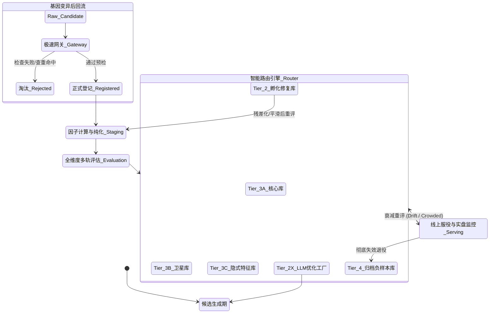

# 企业级量化因子评估与自动化入库系统需求文档

面向因子挖掘组、因子评估组、平台工程组、下游基建组、研究负责人和项目管理方。

## 目录 (Table of Contents)
  - [核心术语表 (Glossary & Terminology)](#核心术语表-glossary--terminology)
  - [系统摘要 (Executive Summary)](#系统摘要-executive-summary)
  - [1. 顶层完整逻辑图](#1-顶层完整逻辑图)
    - [1.1 长链总框架](#11-长链总框架)
    - [1.2 字段解释与一个完整例子](#12-字段解释与一个完整例子)
      - [1.2.1 字段解释](#121-字段解释)
      - [1.2.2 完整案例](#122-完整案例)
      - [1.2.3 为什么这几个字段一定要保留](#123-为什么这几个字段一定要保留)
      - [1.2.4 如何阅读这条主逻辑链](#124-如何阅读这条主逻辑链)
  - [2. 系统定位](#2-系统定位)
    - [2.1 业务定位](#21-业务定位)
    - [2.2 与当前项目的关系](#22-与当前项目的关系)
    - [2.3 本文档采用的设计原则](#23-本文档采用的设计原则)
  - [3. 上游持续挖掘场景定义](#3-上游持续挖掘场景定义)
    - [3.1 多方法来源](#31-多方法来源)
      - [3.1.1 总库一级坐标必须先确定](#311-总库一级坐标必须先确定)
    - [3.2 批次组织方式](#32-批次组织方式)
      - [3.2.1 频率口径先明确到可执行层](#321-频率口径先明确到可执行层)
    - [3.3 一个大轮结束后的对象](#33-一个大轮结束后的对象)
    - [3.4 挖掘方法内部筛选 vs 资产化统一处理的边界](#34-挖掘方法内部筛选-vs-资产化统一处理的边界)
- [第二部分：因子生命周期与核心流水线 (Part 2: Factor Lifecycle & Core Pipeline)](#第二部分因子生命周期与核心流水线-part-2-factor-lifecycle--core-pipeline)
  - [4. 端到端阶段说明](#4-端到端阶段说明)
    - [4.1 阶段 0: 候选生成 (Candidate Generation)](#41-阶段-0-候选生成-candidate-generation)
      - [现有基建全景映射 (Existing Codebase Mapping)](#现有基建全景映射-existing-codebase-mapping)
    - [4.2 阶段 1: 极速网关 (Gateway) 与静态拦截](#42-阶段-1-极速网关-gateway-与静态拦截)
    - [4.3 阶段 1.5: 动态数据质量与异常审计 (Data Quality Pre-flight)](#43-阶段-15-动态数据质量与异常审计-data-quality-pre-flight)
    - [4.4 阶段 2: 正式登记与户籍创建](#44-阶段-2-正式登记与户籍创建)
      - [现有基建全景映射 (Existing Codebase Mapping)](#现有基建全景映射-existing-codebase-mapping)
    - [4.4 阶段 3: 因子特征物化与计算引擎 (Materialization Engine)](#44-阶段-3-因子特征物化与计算引擎-materialization-engine)
      - [当前可直接复用的现有能力 (重点！)](#当前可直接复用的现有能力-重点)
      - [物理输出规范与目标架构](#物理输出规范与目标架构)
    - [4.5 阶段 4: 因子预处理与截面纯化 (Preprocessing & Purification)](#45-阶段-4-因子预处理与截面纯化-preprocessing--purification)
    - [4.5.1 数据边界处理与双时态防穿越机制 (Point-in-Time & Anti-Leakage)](#451-数据边界处理与双时态防穿越机制-point-in-time--anti-leakage)
      - [4.5.2 数学级纯化流水线 (Mathematical Purification Pipeline)](#452-数学级纯化流水线-mathematical-purification-pipeline)
      - [4.5.3 高频与微观结构专属预处理 (High-Frequency & Microstructure Preprocessing)](#453-高频与微观结构专属预处理-high-frequency--microstructure-preprocessing)
      - [4.5.4 另类数据与非结构化预处理流水线 (Alternative Data & Unstructured Pipeline)](#454-另类数据与非结构化预处理流水线-alternative-data--unstructured-pipeline)
    - [4.6 阶段 5: 全维度评估引擎 (Multi-Track Evaluation)](#46-阶段-5-全维度评估引擎-multi-track-evaluation)
      - [现有基建全景映射 (Existing Codebase Mapping)](#现有基建全景映射-existing-codebase-mapping)
    - [4.6.1 通用评估前置层](#461-通用评估前置层)
      - [4.6.1.1 因子自动化分类与轨道路由机制 (Auto-Routing Engine)](#4611-因子自动化分类与轨道路由机制-auto-routing-engine)
      - [4.6.1.2 统一数据检查与异构数据对齐 (Heterogeneous Data Alignment)](#4612-统一数据检查与异构数据对齐-heterogeneous-data-alignment)
    - [4.6.2 A 轨: 横截面评估协议 (Cross-Sectional Protocol)](#462-a-轨-横截面评估协议-cross-sectional-protocol)
      - [4.6.2.1 宽横截面协议 (如 Equity)](#4621-宽横截面协议-如-equity)
      - [4.6.2.2 窄横截面与跨品种协议 (如 Futures / Crypto / Options)](#4622-窄横截面与跨品种协议-如-futures--crypto--options)
      - [4.6.2.3 预测能力指标 (具体计算公式与边界口径见 5.3 节)](#4623-预测能力指标-具体计算公式与边界口径见-53-节)
      - [4.6.2.4 结构与分组指标 (具体公式见 5.4 节)](#4624-结构与分组指标-具体公式见-54-节)
      - [4.6.2.5 收益风险与落地指标 (具体公式见 5.5 与 5.6 节)](#4625-收益风险与落地指标-具体公式见-55-与-56-节)
      - [4.6.2.6 独立性与风格控制指标 (具体公式见 5.7 节)](#4626-独立性与风格控制指标-具体公式见-57-节)
      - [4.6.2.7 横截面协议典型结论](#4627-横截面协议典型结论)
    - [4.6.3 B 轨: 时序常规基座评估协议 (Time-Series Protocol)](#463-b-轨-时序常规基座评估协议-time-series-protocol)
      - [4.6.3.1 预测能力指标 (具体公式见 5.9 节)](#4631-预测能力指标-具体公式见-59-节)
      - [4.6.3.2 衰减、延迟与持有期指标 (具体公式见 5.9 节)](#4632-衰减延迟与持有期指标-具体公式见-59-节)
      - [4.6.3.3 收益风险指标 (具体公式见 5.5 节)](#4633-收益风险指标-具体公式见-55-节)
      - [4.6.3.4 执行与摩擦指标 (含 Sim2Real 闭环，具体公式见 5.6 节)](#4634-执行与摩擦指标-含-sim2real-闭环具体公式见-56-节)
      - [4.6.3.5 条件稳定性指标（切片分析，具体公式见 5.10 节）](#4635-条件稳定性指标切片分析具体公式见-510-节)
      - [4.6.3.6 时序协议必须带执行语义](#4636-时序协议必须带执行语义)
      - [4.6.3.7 时序协议最小产物清单](#4637-时序协议最小产物清单)
      - [4.6.3.8 时序协议的默认读报告顺序](#4638-时序协议的默认读报告顺序)
      - [4.6.3.9 时序协议统一输出字段表](#4639-时序协议统一输出字段表)
      - [4.6.3.10 时序协议默认验证策略与抗过拟合测试](#46310-时序协议默认验证策略与抗过拟合测试)
    - [4.6.4 C 轨: 离散事件与规则协议 (Discrete Event & Rule Protocol)](#464-c-轨-离散事件与规则协议-discrete-event--rule-protocol)
      - [4.6.4.1 C1-A 轨：纯离散状态与逻辑规则轨 (Pure Discrete Regime & Rule)](#4641-c1-a-轨纯离散状态与逻辑规则轨-pure-discrete-regime--rule)
        - [4.6.4.1.1 C1-B 轨：带强度信号的规则轨 (Intensity-Weighted Rule)](#46411-c1-b-轨带强度信号的规则轨-intensity-weighted-rule)
      - [4.6.4.2 C2 轨：截面事件驱动轨 (Cross-Sectional Event)](#4642-c2-轨截面事件驱动轨-cross-sectional-event)
      - [4.6.4.3 C3 轨：微观结构脉冲轨 (Microstructure Pulse)](#4643-c3-轨微观结构脉冲轨-microstructure-pulse)
      - [4.6.4.4 C4 轨：模式识别与形态特征轨 (Pattern Recognition Feature)](#4644-c4-轨模式识别与形态特征轨-pattern-recognition-feature)
      - [4.6.4.5 C 轨（C1/C2/C3/C4）典型结论](#4645-c-轨c1c2c3c4典型结论)
    - [4.6.5 D 轨: 深度隐式特征评估协议 (Deep Latent Embeddings Protocol)](#465-d-轨-深度隐式特征评估协议-deep-latent-embeddings-protocol)
      - [4.6.5.1 核心逻辑与操作约束](#4651-核心逻辑与操作约束)
      - [4.6.5.2 向量空间质量评估 (Embedding Space Quality)](#4652-向量空间质量评估-embedding-space-quality)
      - [4.6.5.3 下游融合与增益评估 (Downstream Lift)](#4653-下游融合与增益评估-downstream-lift)
      - [4.6.5.4 模型可解释性与特征归因 (XAI)](#4654-模型可解释性与特征归因-xai)
      - [4.6.5.5 D 轨典型结论与去向](#4655-d-轨典型结论与去向)
    - [4.6.6 影子模型在环审查 (Model-in-the-Loop Evaluation)](#466-影子模型在环审查-model-in-the-loop-evaluation)
      - [4.6.6.1 影子特征树 (Shadow Model) 评估](#4661-影子特征树-shadow-model-评估)
    - [4.6.7 统一评估结论对象](#467-统一评估结论对象)
      - [4.6.7.1 统一结论对象最小 JSON 示例](#4671-统一结论对象最小-json-示例)
    - [4.6.8 首期必须落地与增强项边界](#468-首期必须落地与增强项边界)
    - [4.6.9 图表产物与因子详情页产物](#469-图表产物与因子详情页产物)
      - [4.6.9.1 横截面详情页模板](#4691-横截面详情页模板)
      - [4.6.9.2 时序详情页模板](#4692-时序详情页模板)
      - [4.6.9.3 时序详情页默认布局规范](#4693-时序详情页默认布局规范)
      - [4.6.9.4 时序详情页后端接口字段规范](#4694-时序详情页后端接口字段规范)
    - [4.6.10 E 轨: NLP 与非结构化数据评估协议 (NLP & Unstructured Protocol)](#4610-e-轨-nlp-与非结构化数据评估协议-nlp--unstructured-protocol)
    - [4.6.11 F 轨: 图谱与供应链网络评估协议 (Graph & Network Protocol)](#4611-f-轨-图谱与供应链网络评估协议-graph--network-protocol)
    - [4.6.12 G 轨: 宏观机制转换与条件状态评估协议 (Macro Regime Protocol)](#4612-g-轨-宏观机制转换与条件状态评估协议-macro-regime-protocol)
    - [4.6.13 B-Fut 轨: 期货连续与期限结构协议 (Futures Continuous Protocol)](#4613-b-fut-轨-期货连续与期限结构协议-futures-continuous-protocol)
    - [4.6.14 B-Cry 轨: 加密资产极度反射性协议 (Crypto Reflexivity Protocol)](#4614-b-cry-轨-加密资产极度反射性协议-crypto-reflexivity-protocol)
    - [4.6.15 B-Opt 轨: 期权高阶矩与曲面协议 (Options Greeks Protocol)](#4615-b-opt-轨-期权高阶矩与曲面协议-options-greeks-protocol)
    - [4.6.12 为什么必须做成多轨评估协议而非一个大而全列表](#4612-为什么必须做成多轨评估协议而非一个大而全列表)
    - [4.7 阶段 6: 自动化贴标引擎 (Semantic Tagging)](#47-阶段-6-自动化贴标引擎-semantic-tagging)
      - [4.7.1 异构微观领域专属标签字典 (Micro-Domain Tag Dictionary)](#471-异构微观领域专属标签字典-micro-domain-tag-dictionary)
    - [4.8 阶段 7: 智能路由与入库决策 (Smart Routing)](#48-阶段-7-智能路由与入库决策-smart-routing)
    - [4.9 阶段 8: 多因子组合与高级凸优化 (Portfolio Construction & Convex Optimization)](#49-阶段-8-多因子组合与高级凸优化-portfolio-construction--convex-optimization)
    - [4.10 阶段 9: 模型端预处理与机器学习特征装配 (ML Feature Assembly)](#410-阶段-9-模型端预处理与机器学习特征装配-ml-feature-assembly)
    - [4.11 阶段 10: 极限压力测试与场景推演 (Stress Testing & Scenario Analysis)](#411-阶段-10-极限压力测试与场景推演-stress-testing--scenario-analysis)
    - [4.12 阶段 11: 智能订单执行与动态路由 (Smart Execution & Order Routing)](#412-阶段-11-智能订单执行与动态路由-smart-execution--order-routing)
    - [4.13 阶段 12: 持续监控与生命周期复评 (Monitoring & Re-evaluation)](#413-阶段-12-持续监控与生命周期复评-monitoring--re-evaluation)
      - [5.2 统一要做的装配动作 (Unified Assembly)](#52-统一要做的装配动作-unified-assembly)
      - [5.3 区分模型的专属特征装配规约 (Model-Specific Assembly Rules)](#53-区分模型的专属特征装配规约-model-specific-assembly-rules)
  - [A. 面向树模型阵营的特征装配 (Tree-based Models)](#a-面向树模型阵营的特征装配-tree-based-models)
  - [B. 面向神经网络阵营的特征装配 (NN-based Models)](#b-面向神经网络阵营的特征装配-nn-based-models)
  - [C. 面向多因子线性优化器的特征装配 (Barra OLS)](#c-面向多因子线性优化器的特征装配-barra-ols)
      - [5.4 因子评估基建组必须提供给模型端的东西](#54-因子评估基建组必须提供给模型端的东西)
    - [因子评估基建组必须知道的最小边界](#因子评估基建组必须知道的最小边界)
    - [主文档里必须保留的模型端输出对象](#主文档里必须保留的模型端输出对象)
    - [模型端特征装配核心链路节点](#模型端特征装配核心链路节点)
    - [详细实现规范](#详细实现规范)
- [第三部分：全域指标公式与计算基座 (Part 3: Global Metrics & Computational Base)](#第三部分全域指标公式与计算基座-part-3-global-metrics--computational-base)
  - [5. 核心指标公式与计算口径表](#5-核心指标公式与计算口径表)
      - [5.1 因子评估方法论与全域指标字典总览 (Global Evaluation Methodology Taxonomy)](#51-因子评估方法论与全域指标字典总览-global-evaluation-methodology-taxonomy)
      - [1. 预测能力族群 (Predictive Power)](#1-预测能力族群-predictive-power)
      - [2. 结构稳定性与形态族群 (Structural Stability)](#2-结构稳定性与形态族群-structural-stability)
      - [3. 收益风险与尾部特征族群 (Return, Risk & Tail Behavior)](#3-收益风险与尾部特征族群-return-risk--tail-behavior)
      - [4. 执行容量与微观摩擦族群 (Execution, Capacity & Microstructure)](#4-执行容量与微观摩擦族群-execution-capacity--microstructure)
      - [6. 独立性与增量价值族群 (Orthogonality & Marginal Contribution)](#6-独立性与增量价值族群-orthogonality--marginal-contribution)
      - [7. 异构微观领域专属族群 (Micro-Domain Specifics)](#7-异构微观领域专属族群-micro-domain-specifics)
      - [5.2 共享字段与协议字段说明](#52-共享字段与协议字段说明)
      - [5.3 公式符号与工程参数映射定义 (Engineering Variable Definitions)](#53-公式符号与工程参数映射定义-engineering-variable-definitions)
      - [5.3 横截面预测能力指标公式](#53-横截面预测能力指标公式)
      - [5.4 横截面结构与单调性指标公式](#54-横截面结构与单调性指标公式)
      - [5.5 共享收益风险指标公式](#55-共享收益风险指标公式)
      - [5.6 时序规则与交易级 (Trade-Level) 高级指标公式](#56-时序规则与交易级-trade-level-高级指标公式)
      - [5.6 共享执行、容量与摩擦指标公式](#56-共享执行容量与摩擦指标公式)
      - [5.7 独立性与增量价值指标公式](#57-独立性与增量价值指标公式)
      - [5.8 防过拟合、因果推断与鲁棒性指标公式](#58-防过拟合因果推断与鲁棒性指标公式)
      - [5.8.1 高阶显著性与多重检验校正 (Advanced Significance & Multiple Testing)](#581-高阶显著性与多重检验校正-advanced-significance--multiple-testing)
      - [5.8.2 非线性冲击与微观摩擦容量模型 (Non-linear Market Impact & Capacity)](#582-非线性冲击与微观摩擦容量模型-non-linear-market-impact--capacity)
      - [5.8.3 尾部风险与极端损失测算 (Tail Risk & Expected Shortfall)](#583-尾部风险与极端损失测算-tail-risk--expected-shortfall)
      - [5.8.4 高频与微观结构摩擦估计 (Advanced Microstructure Frictions)](#584-高频与微观结构摩擦估计-advanced-microstructure-frictions)
      - [5.8.5 机器学习特征工程专属评估 (Machine Learning Feature Evaluation)](#585-机器学习特征工程专属评估-machine-learning-feature-evaluation)
      - [5.8.6 Alpha 衰减与换手率动力学 (Alpha Decay & Turnover Dynamics)](#586-alpha-衰减与换手率动力学-alpha-decay--turnover-dynamics)
      - [5.9 核心架构声明：时序协议的“基座与扩展” (Base vs. Extensions)](#59-核心架构声明时序协议的基座与扩展-base-vs-extensions)
        - [5.9.0 全品种时序协议组装清单 (Asset-Protocol Assembly Matrix)](#590-全品种时序协议组装清单-asset-protocol-assembly-matrix)
        - [5.9.1 时序常规基座协议指标公式 (Universal Time-Series Core)](#591-时序常规基座协议指标公式-universal-time-series-core)
      - [5.9.2 高频微观结构与状态突变协议 (High-Frequency & Regime Shift Extensions)](#592-高频微观结构与状态突变协议-high-frequency--regime-shift-extensions)
      - [5.10 时序稳定性与执行摘要字段口径](#510-时序稳定性与执行摘要字段口径)
      - [5.10 协议化结论字段口径](#510-协议化结论字段口径)
      - [5.11 美股专属微观结构指标口径](#511-美股专属微观结构指标口径)
      - [5.12 C轨与D轨专属评估协议指标口径 (Discrete & Deep Latent)](#512-c轨与d轨专属评估协议指标口径-discrete--deep-latent)
      - [5.13 E/F/G轨与微观细分领域专属评估口径 (NLP / Graph / Micro-Domain)](#513-efg轨与微观细分领域专属评估口径-nlp--graph--micro-domain)
      - [5.13 期权特有时序因子评估与高阶矩协议 (B-Opt轨)](#513-期权特有时序因子评估与高阶矩协议-b-opt轨)
        - [5.13.1 核心收益度量、高阶对冲与曲面降维 (Hedged Returns, Greeks & IVS Dimensionality Reduction)](#5131-核心收益度量高阶对冲与曲面降维-hedged-returns-greeks--ivs-dimensionality-reduction)
        - [5.13.2 风险溢价与特有时序因子 (Risk Premiums & Specific Time-Series Factors)](#5132-风险溢价与特有时序因子-risk-premiums--specific-time-series-factors)
        - [5.13.3 微观结构约束：订单流与做市商引力 (Microstructure & Market Maker Gravity)](#5133-微观结构约束订单流与做市商引力-microstructure--market-maker-gravity)
        - [5.13.4 纯粹计量与实证检验基座 (Econometrics & Empirical Core)](#5134-纯粹计量与实证检验基座-econometrics--empirical-core)
        - [5.13.5 高阶分布预测、因子择时与深度学习介入 (Factor Timing & Machine Learning)](#5135-高阶分布预测因子择时与深度学习介入-factor-timing--machine-learning)
        - [5.13.6 期权特有聚合机制与非正态惩罚 (Aggregation & Non-normal Penalty)](#5136-期权特有聚合机制与非正态惩罚-aggregation--non-normal-penalty)
        - [5.13.7 微观拆解与极限抗压检验 (Micro-Attribution & Extreme Stress)](#5137-微观拆解与极限抗压检验-micro-attribution--extreme-stress)
        - [5.13.8 终极拓扑确权与路径物理学 (Ultimate Topology & Path Physics)](#5138-终极拓扑确权与路径物理学-ultimate-topology--path-physics)
      - [5.14 期货特有时序因子评估协议 (B-Fut轨)](#514-期货特有时序因子评估协议-b-fut轨)
        - [5.14.1 期限结构与展期收益 (Term Structure & Roll Yield)](#5141-期限结构与展期收益-term-structure--roll-yield)
        - [5.14.2 真实杠杆校验与展期纯化 (Leverage Verification & Roll Purification)](#5142-真实杠杆校验与展期纯化-leverage-verification--roll-purification)
        - [5.14.3 宏观机制与连续主力映射 (Macro & Continuous Rollover)](#5143-宏观机制与连续主力映射-macro--continuous-rollover)
        - [5.14.4 物理交割边界与极端流动性约束 (Physical Delivery & Extreme Liquidity)](#5144-物理交割边界与极端流动性约束-physical-delivery--extreme-liquidity)
        - [5.14.5 宏观共振剥离与路径破产压测 (Macro Orthogonalization & Path Ruin)](#5145-宏观共振剥离与路径破产压测-macro-orthogonalization--path-ruin)
        - [5.14.6 物理库存与跨资产产业链 (Inventory & Cross-Asset Supply Chain)](#5146-物理库存与跨资产产业链-inventory--cross-asset-supply-chain)
      - [5.15 Crypto 特有时序因子评估协议 (B-Cry轨)](#515-crypto-特有时序因子评估协议-b-cry轨)
        - [5.15.1 微观结构防欺诈与双层市场 (Microstructure & Wash Trading Defense)](#5151-微观结构防欺诈与双层市场-microstructure--wash-trading-defense)
        - [5.15.2 新闻情绪非对称性与热力学链上因子 (Asymmetric FOMO & Thermodynamic On-Chain)](#5152-新闻情绪非对称性与热力学链上因子-asymmetric-fomo--thermodynamic-on-chain)
        - [5.15.3 极值理论尾部风险与高频变异 (EVT, POT & Jump-Diffusion)](#5153-极值理论尾部风险与高频变异-evt-pot--jump-diffusion)
        - [5.15.4 结构性突变与双重选择无偏推断 (Structural Breaks & Double-Selection)](#5154-结构性突变与双重选择无偏推断-structural-breaks--double-selection)
        - [5.15.5 链上物理结算与延迟鲁棒性 (On-Chain Settlement & Latency Robustness)](#5155-链上物理结算与延迟鲁棒性-on-chain-settlement--latency-robustness)
        - [5.15.6 跨所碎片化深度与尾部相依 (Fragmented Depth & Tail Dependence)](#5156-跨所碎片化深度与尾部相依-fragmented-depth--tail-dependence)
        - [5.15.7 物理状态与分形特征 (Physics Regimes & Fractals)](#5157-物理状态与分形特征-physics-regimes--fractals)
      - [5.16 通用高阶：非正态与非线性的“生存”评估 (Advanced General: Non-linear Survival Protocol)](#516-通用高阶非正态与非线性的生存评估-advanced-general-non-linear-survival-protocol)
      - [5.18 评估结论的“标签化”决策建议 (Routing Tags)](#518-评估结论的标签化决策建议-routing-tags)
      - [5.17 计算科学边界规约 (Computational Edge Cases)](#517-计算科学边界规约-computational-edge-cases)
- [第四部分：资产存储架构与自动化重加工 (Part 4: Asset Architecture & Auto-Rework)](#第四部分资产存储架构与自动化重加工-part-4-asset-architecture--auto-rework)
  - [6. 因子库层级与命名空间](#6-因子库层级与命名空间)
    - [4.6.2 为什么不能只有一个总库](#462-为什么不能只有一个总库)
    - [4.6.3 推荐分层](#463-推荐分层)
    - [Tier 0: 原始降落区 `tier0_raw`](#tier-0-原始降落区-tier0_raw)
    - [Tier 1: 标准评估区 `tier1_eval`](#tier-1-标准评估区-tier1_eval)
    - [Tier 2: 孵化库 / 医院 `tier2_incubator`](#tier-2-孵化库--医院-tier2_incubator)
    - [Tier 2X: LLM 因子优化工厂 `tier2x_optimization_factory`](#tier-2x-llm-因子优化工厂-tier2x_optimization_factory)
    - [Tier 3A: 核心生产库 `tier3a_core`](#tier-3a-核心生产库-tier3a_core)
    - [Tier 3B: 卫星生产库 `tier3b_satellite`](#tier-3b-卫星生产库-tier3b_satellite)
    - [Tier 3C: 特征原料库 `tier3c_feature`](#tier-3c-特征原料库-tier3c_feature)
    - [Tier 3D: 优化储备库 `tier3d_optimized_reserve`](#tier-3d-优化储备库-tier3d_optimized_reserve)
    - [Tier 4: 归档与负样本库 `tier4_archive`](#tier-4-归档与负样本库-tier4_archive)
    - [4.6.4 多维命名空间](#464-多维命名空间)
    - [4.6.5 总库字典表](#465-总库字典表)
      - [4.6.5.1 协议键与模板映射母版](#4651-协议键与模板映射母版)
  - [7. 自动化重加工体系](#7-自动化重加工体系)
    - [7.1 平滑类修复](#71-平滑类修复)
    - [7.2 降频类修复](#72-降频类修复)
    - [7.3 残差化 / 正交化类修复](#73-残差化--正交化类修复)
    - [7.4 再评估原则](#74-再评估原则)
    - [7.5 Tier 2X: 专门的 LLM 因子优化工厂](#75-tier-2x-专门的-llm-因子优化工厂)
      - [7.5.1 输入对象](#751-输入对象)
      - [7.5.2 必须建设的模块](#752-必须建设的模块)
      - [7.5.3 一次优化批次要记录什么](#753-一次优化批次要记录什么)
      - [7.5.4 一次优化工厂内部要做什么](#754-一次优化工厂内部要做什么)
      - [7.5.4A 优化尝试类型必须分层管理](#754a-优化尝试类型必须分层管理)
      - [参数级优化](#参数级优化)
      - [结构近邻改写](#结构近邻改写)
      - [算子替换与受限重写](#算子替换与受限重写)
      - [平滑降噪与交易友好化](#平滑降噪与交易友好化)
      - [去同质化与边际信息提取](#去同质化与边际信息提取)
  - [LLM. 受约束迭代寻优](#llm-受约束迭代寻优)
      - [7.5.5 这个工厂和普通孵化修复的区别](#755-这个工厂和普通孵化修复的区别)
    - [7.6 主库因子的二次 LLM 优化分支](#76-主库因子的二次-llm-优化分支)
      - [7.6.1 为什么要有这条支线](#761-为什么要有这条支线)
      - [7.6.2 二次优化主流程](#762-二次优化主流程)
      - [7.6.2A 总库父因子的优化优先顺序](#762a-总库父因子的优化优先顺序)
      - [7.6.2B 哪些优化版允许回总库](#762b-哪些优化版允许回总库)
      - [7.6.2C 为什么不能让大量近邻版本都入总库](#762c-为什么不能让大量近邻版本都入总库)
      - [7.6.3 必须保留的来源信息](#763-必须保留的来源信息)
      - [7.6.4 为什么要单独保留 Tier 3D](#764-为什么要单独保留-tier-3d)
      - [7.6.5 优化储备库治理规则](#765-优化储备库治理规则)
      - [7.6.6 优化预算与淘汰策略](#766-优化预算与淘汰策略)
  - [8. 闭环反馈与基因迭代](#8-闭环反馈与基因迭代)
    - [8.1 反馈输入](#81-反馈输入)
    - [来自失败因子的反馈](#来自失败因子的反馈)
    - [来自成功因子的反馈](#来自成功因子的反馈)
    - [8.2 反馈输出](#82-反馈输出)
    - [8.3 闭环作用](#83-闭环作用)
  - [9. 对象模型与字段规范 (数据表 Schema 约束)](#9-对象模型与字段规范-数据表-schema-约束)
    - [9.1 CandidateFactor (候选因子登记表)](#91-candidatefactor-候选因子登记表)
    - [9.2 FactorAsset (正式因子资产表)](#92-factorasset-正式因子资产表)
    - [9.3 EvaluationRun (单次评估运行记录表)](#93-evaluationrun-单次评估运行记录表)
    - [9.4 AdmissionDecision (准入决策表)](#94-admissiondecision-准入决策表)
  - [10. 状态机与因子生命周期规范 (Lifecycle State Machine)](#10-状态机与因子生命周期规范-lifecycle-state-machine)
    - [10.1 核心状态定义 (States)](#101-核心状态定义-states)
    - [10.2 状态迁移与退役机制 (Transitions)](#102-状态迁移与退役机制-transitions)
    - [10.3 生产后迁移与拥挤度监测 (Crowdedness & Capacity Warning)](#103-生产后迁移与拥挤度监测-crowdedness--capacity-warning)
  - [11. 数据库、文件、消息和技术栈](#11-数据库文件消息和技术栈)
    - [11.1 最佳目标架构](#111-最佳目标架构)
    - [控制面与图谱血缘追踪 (Graph Database)](#控制面与图谱血缘追踪-graph-database)
    - [数据面与湖仓一体架构 (Lakehouse)](#数据面与湖仓一体架构-lakehouse)
    - [跨语言与接口通信协议 (Cross-Language Interoperability)](#跨语言与接口通信协议-cross-language-interoperability)
    - [产物面](#产物面)
    - [调度与消息](#调度与消息)
    - [计算层](#计算层)
    - [11.2 首期可直接落地的现状对齐方案](#112-首期可直接落地的现状对齐方案)
    - [11.3 推荐目录与文件](#113-推荐目录与文件)
    - [候选阶段](#候选阶段)
    - [因子阶段](#因子阶段)
    - [评估阶段](#评估阶段)
    - [路由阶段](#路由阶段)
    - [模型与前端阶段](#模型与前端阶段)
    - [优化工厂阶段](#优化工厂阶段)
    - [11.4 推荐消息主题](#114-推荐消息主题)
    - [11.5 模块间服务接口契约 (Service Contract)](#115-模块间服务接口契约-service-contract)
      - [11.5.1 公共服务入口 (Public Service Entries)](#1151-公共服务入口-public-service-entries)
      - [11.5.2 核心 Request / Response 契约示例](#1152-核心-request--response-契约示例)
      - [11.5.3 产物与持久化契约 (Artifacts)](#1153-产物与持久化契约-artifacts)
      - [11.5.4 消息队列 (Kafka/MQ) Payload 契约](#1154-消息队列-kafkamq-payload-契约)
    - [11.6 数据防篡改与安全审计强制规约](#116-数据防篡改与安全审计强制规约)
  - [12. 下游消费层说明: SL 与 RL 的双剑合璧](#12-下游消费层说明-sl-与-rl-的双剑合璧)
    - [12.1 上游供给 (Feature Store)](#121-上游供给-feature-store)
    - [12.2 中游预测引擎 (Alpha Aggregator - Super Predictor)](#122-中游预测引擎-alpha-aggregator---super-predictor)
    - [12.3 下游执行与风控 (Portfolio & Execution Manager)](#123-下游执行与风控-portfolio--execution-manager)
    - [12.4 因子详情页与前端因子中心](#124-因子详情页与前端因子中心)
    - [12.5 端到端高频范式变革：从信号到执行的终极统合 (End-to-End HF Paradigm)](#125-端到端高频范式变革从信号到执行的终极统合-end-to-end-hf-paradigm)
  - [13. 四个完整示例](#13-四个完整示例)
    - [13.1 示例 A: GP 大轮形成候选因子库](#131-示例-a-gp-大轮形成候选因子库)
    - [13.2 示例 B: LLM 多轮修正式挖掘](#132-示例-b-llm-多轮修正式挖掘)
    - [13.3 示例 C: 期货 1min 时序因子进入模型端](#133-示例-c-期货-1min-时序因子进入模型端)
    - [13.4 示例 D: 主库父因子进入二次 LLM 优化分支](#134-示例-d-主库父因子进入二次-llm-优化分支)
  - [14. 首期建设规范与长期架构关系](#14-首期建设规范与长期架构关系)
    - [首期先打通](#首期先打通)
    - [中期补强](#中期补强)
    - [长期完善](#长期完善)
  - [15. 工程交付级技术约束 (Engineering Constraints)](#15-工程交付级技术约束-engineering-constraints)
    - [15.1 系统性能与 SLA 约束](#151-系统性能与-sla-约束)
    - [15.2 全局异常分类与错误码矩阵](#152-全局异常分类与错误码矩阵)
    - [15.3 配置与参数管理规范 (Global Configs)](#153-配置与参数管理规范-global-configs)
    - [15.4 数据存储与底层文件分区规约 (Storage & Partitioning Spec)](#154-数据存储与底层文件分区规约-storage--partitioning-spec)
    - [15.5 K8s 算力调度与 T-Shirt 资源模型 (Compute Orchestration)](#155-k8s-算力调度与-t-shirt-资源模型-compute-orchestration)
  - [16. 与现有代码的对齐关系](#16-与现有代码的对齐关系)
    - [16.1 已有能力，直接复用](#161-已有能力直接复用)
      - [因子执行层](#因子执行层)
      - [标准评估层](#标准评估层)
      - [准入层](#准入层)
      - [数据访问层](#数据访问层)
      - [回测协议](#回测协议)
    - [16.2 当前薄弱，需要下游建设](#162-当前薄弱需要下游建设)
    - [16.3 明确禁止重复建设的组件](#163-明确禁止重复建设的组件)
  - [17. 下游基建组交付清单](#17-下游基建组交付清单)
    - [必须交付 (控制面与流水线编排)](#必须交付-控制面与流水线编排)
    - [时序评估专项必须交付 (基于 `backtest_layer` 扩展)](#时序评估专项必须交付-基于-backtest_layer-扩展)
    - [要求同时交付 (展现层与监控)](#要求同时交付-展现层与监控)
  - [18. 总结](#18-总结)
  - [19. 完整生命周期流转案例](#19-完整生命周期流转案例)
    - [19.1 案例 A：美股日频横截面量价因子 (A 轨) - 从挖掘到核心生产库](#191-案例-a美股日频横截面量价因子-a-轨---从挖掘到核心生产库)
    - [19.2 案例 B：期货 1min 时序高频因子 (B-Fut 轨) - 失败修复与回流](#192-案例-b期货-1min-时序高频因子-b-fut-轨---失败修复与回流)
    - [19.3 案例 C：深度隐式向量特征 (D 轨) - 供深度学习消费](#193-案例-c深度隐式向量特征-d-轨---供深度学习消费)
  - [20. 企业级量化因子工厂数据库与 API 规格书 (Database & API Specifications)](#20-企业级量化因子工厂数据库与-api-规格书-database--api-specifications)
    - [20.1 V1 现状落地层](#201-v1-现状落地层)
      - [20.1.1 当前推荐技术栈](#2011-当前推荐技术栈)
      - [20.1.2 当前推荐目录](#2012-当前推荐目录)
      - [20.1.3 当前 catalog 表](#2013-当前-catalog-表)
      - [20.1.4 V1 推荐补充表](#2014-v1-推荐补充表)
      - [20.1.5 V1 文件 Schema](#2015-v1-文件-schema)
      - [20.1.6 V1 API 形态](#2016-v1-api-形态)
    - [20.2 V2 服务化扩展层](#202-v2-服务化扩展层)
      - [20.2.1 PostgreSQL 控制面](#2021-postgresql-控制面)
      - [20.2.2 ClickHouse 数据面](#2022-clickhouse-数据面)
      - [20.2.3 MinIO 产物面](#2023-minio-产物面)
    - [20.3 推荐 API 合约](#203-推荐-api-合约)
      - [20.3.1 Candidate API](#2031-candidate-api)
      - [20.3.2 Evaluation API](#2032-evaluation-api)
      - [20.3.3 Admission API](#2033-admission-api)
      - [20.3.4 Catalog Query API](#2034-catalog-query-api)
    - [20.4 错误码建议](#204-错误码建议)

<div style="page-break-before: always;"></div>

## 核心术语表 (Glossary & Terminology)

| 术语 (Term) | 释义 (Definition) |
|---|---|
| **Factor (因子)** | 从数据中提取的，用于预测资产未来收益、风险或微观结构的信号或特征。 |
| **Materialization (物化)** | 将因子逻辑转换为离线存储的物理表或特征库文件的过程。 |
| **Cross-Sectional (横截面)** | 在同一时间点上，比较不同资产之间特征差异的评估方式（如多空对冲）。 |
| **Time-Series (时序)** | 针对单一资产，随时间演变的特征与收益序列的评估方式（如趋势跟踪）。 |
| **Routing (路由)** | 根据因子类型（如 A轨、B轨等），自动选择对应评估协议的过程。 |
| **Sim2Real (仿真到实盘)** | 将回测环境（Simulation）下的因子表现，映射和校准到实盘执行（Real）的过程，包含摩擦和滑点评估。 |
| **Tier (层级)** | 因子在系统中的生命周期状态（如 Tier0_raw 原始降落区，Tier3a_core 核心生产库）。 |

## 系统摘要 (Executive Summary)

本需求文档详细规定了**企业级量化因子评估与自动化入库系统**的端到端架构。系统旨在连接上游的“因子挖掘”与下游的“模型训练/交易执行”，提供一个高度标准化、自动化、防穿越的因子检验流水线。

**核心目标：**
1. **统一评估口径：** 摒弃混乱的单点测试，强制推行多轨评估协议（A轨横截面、B轨时序、C轨离散事件、D轨深度隐式等）。
2. **自动化资产管理：** 通过 Tier 0 到 Tier 4 的层级体系，实现因子的自动晋升、打回与归档。
3. **闭环重加工优化：** 引入 LLM 因子优化工厂与自动化平滑/正交化手段，将废弃因子变废为宝。

## 1. 顶层完整逻辑图

### 1.1 长链总框架

这部分的完整链路框架、颜色图例、字段解释、完整案例和“大轮结束后的处理边界”已经全部移入独立 HTML 文件，避免在主文档里出现无法稳定渲染的预览结构。

请直接打开下面这个文件查看完整总链路：

- `docs/team_docs/因子评估全链路总图_长图版.html`

这份 HTML 文件中已经包含：

- 颜色图例
- 具体方法名而非粗分类
- 方法内部筛选 vs 大轮结束后统一处理的边界
- 一整轮结束后的候选临时文件池
- 从候选临时池开始进入评估与资产化主线的边界说明
- `DeepSeek` 语义分类标签引擎
- 因子详情页、图表产物层与前端展示要求
- `PIT (Point-in-Time, 防穿越时间) / knowledge_ts / train-valid-test` 防泄露治理
- `Tier 2X` LLM 因子优化工厂
- 主库因子二次优化分支与 `Tier 3D` 优化储备库
- 总库字典表与多总库模板
- 文件产物、数据库、技术栈
- `Tier 2 / Tier 3 / Tier 4` 分层与回流
- 字段解释与完整案例

模型端如果需要查看更细的实现规范，请再看：

- `docs/team_docs/企业级量化因子模型端特征装配与训练前预处理规范.md`

### 1.2 字段解释与一个完整例子

上面逻辑链里保留了一些英文字段，是因为这些字段会直接进入对象模型、库表、消息和运行记录中。为具体说明，以下通过完整案例阐述各字段的流转关系。

#### 1.2.1 字段解释

- `method_code`：方法机制编码。例如 `llm_self_refine_tool_use`、`rl_reward_search`、`gp_mutation_crossover`、`manual_research`。
- `generator_name`：实际运行的方法或模型名。例如 `alphaprobe`、`quantaalpha`、`tooluse_formula_agent_v2`。
- `campaign_id`：一轮大规模挖掘活动的大轮编号。例如一次 GP 大轮、一次 LLM Prompt Sweep。
- `iteration_id`：同一大轮里的第几轮迭代。例如第 3 次变异、第 5 次修正。
- `batch_id`：一次具体运行批次，偏工程调度视角。
- `parent_factor_ids`：这个候选因子是从哪些父因子变异、交叉、平滑、残差化出来的。
- `factor_id`：通过网关 (Gateway)并正式登记后得到的正式因子编号。
- `FactorAsset`：正式因子资产对象。后面的评估、标签、路由、复评，都是围绕它展开。
- `source_factor_id`：优化版因子的直接父因子编号，用于二次优化支线和血缘追踪。
- `optimization_batch_id`：某次 LLM/Agent 优化工厂批次编号。
- `precheck_report`：极速网关 (Gateway)的预检查结果。
- `dedup_result`：查重结果，说明它是否和已有对象重复。
- `metrics package`：评估引擎输出的一组指标结果集合。

#### 1.2.2 完整案例

下面用一个真实感更强的例子，把“一个因子从产生到最终入库”的过程讲透。

```text
method_code   = gp_mutation_crossover
generator_name = alphaprobe
campaign_id   = gp_us_pv_2026q2_round01
iteration_id  = iter_07
batch_id      = 20260502_night_03

解释:
- 这是一个来自 alphaprobe 的候选因子
- 它采用的机制是 GP 变异 + 交叉
- 它属于 2026 年 Q2 的第一轮美股量价 GP 大轮
- 它是这个大轮里的第 7 次迭代结果
- 它是在 2026-05-02 夜间第 3 个运行批次里产生的

流程:
1. alphaprobe 在挖掘期内部持续做生成、变异、交叉和方法内部的局部保优淘劣
2. 一整轮结束后，这一批候选先统一沉淀进 `candidate_pool/{campaign_id}/`
3. 候选提交进入 `factor_candidates_raw`
4. 从这里开始才进入正式评估入库主线，极速网关 (Gateway)检查它是否:
   - 合法
   - 没有未来函数
   - 复杂度不过高
   - 不和已有因子重复
5. 若验证通过，则进入正式登记，生成 factor_id
6. 随后调用现有 factor_engine 计算原始因子暴露
7. 暴露先写入 staging，再发布到正式因子库
8. 随后做截面清洗、标准化、中性化、残差化
9. 再跑全维度评估
10. 假设结果是:
   - Rank IC 优异
   - 但是换手率偏高
   - 和已有某类反转因子相关性也偏高
11. 那么它不会直接进入核心库，而是会被贴上:
   - high_ic
   - high_turnover
   - needs_smoothing
   - needs_residualization
12. 随后该因子将进入 Tier 2 孵化库
13. 在孵化库内执行:
   - 时间平滑
   - 降频
   - 残差化
14. 处理后回到 [4] 截面清洗与纯化层，再重新评估
15. 如果重评后通过，就可能进入:
   - Tier 3A 核心库
   - 或 Tier 3B 卫星库 (Satellite)
   - 或 Tier 3C 特征原料库
16. 如果最终还是不行，就进入 Tier 4 负样本归档库
17. 它失败的原因会回传给上游 GP，指导下一轮变异和搜索
```

#### 1.2.3 为什么这几个字段一定要保留

- 没有 `method_code`，后面就无法比较 `LLM Self-Refine`、`RL Reward Search`、`GP Mutation/Crossover` 这类不同机制谁更有效。
- 没有 `generator_name`，后面就无法比较 `alphaprobe`、`quantaalpha` 这类具体方法谁更稳定。
- 没有 `campaign_id`，一个大轮结束后就无法形成“一个因子库”的管理视图。
- 没有 `iteration_id`，就无法比较同一大轮里第几轮变异最有效。
- 没有 `batch_id`，就很难做运行回放、故障排查和算力审计。
- 没有 `parent_factor_ids`，就无法做血缘追踪，也无法知道一个好因子演化路径。

#### 1.2.4 如何阅读这条主逻辑链

- 第一遍：只看从 `[0]` 到 `[10]` 的竖向主线，先把整体顺序看明白。
- 第二遍：重点看 `[7]` 的分支路由，理解为什么不是简单“通过 / 不通过”。
- 第三遍：结合上面的完整案例，再回看 `method_code / campaign_id / iteration_id / batch_id / factor_id` 这些字段，就会更容易把主链和对象模型对上。

## 2. 系统定位

### 2.1 业务定位

本系统服务于一个 24h 持续运行的企业级因子挖掘与评估工厂。系统的目标不是只给研究员出一份回测截图，而是把因子当成长期经营的资产对象进行全生命周期管理。

在这个定位下，因子不是一段随手命名的公式文本，而是具备以下属性的正式资产：

- 有唯一身份
- 有血缘关系
- 有产生来源
- 有批次归属
- 有评估记录
- 有标签画像
- 有路由去向
- 有生产状态
- 有复评历史
- 有退役记录

### 2.2 与当前项目的关系

当前仓库已经具备以下关键基础：

- 因子表达式执行与物化 (特征提取与落盘)能力
- 标准单因子评估能力
- 准入与 catalog 记录能力
- 因子湖和 staging/publish 数据入口
- 单资产与组合回测标准产物协议

因此本文档不是从零重造系统，而是在现有能力之上定义一套最完整、可扩展、适合下游基建组实施的企业级方案。

### 2.3 本文档采用的设计原则

- 方案按最完整目标架构编写，但会明确标出可复用现有实现的部分。
- 文档优先保证可读性和全局逻辑，不省略关键解释。
- 主文档本身应足够完整，单独发给下游也能阅读和讨论。
- 不在本文重复展开已有算子目录和表达式细节，但会明确它们属于已具备能力。

## 3. 上游持续挖掘场景定义

### 3.1 多方法来源

首期工程要求纳入以下方法来源：

- `llm_self_refine_tool_use`: 基于提示、反馈、自反修正、工具调用生成表达式
- `rl_reward_search`: 基于 reward 优化的生成或选式链路
- `gp_mutation_crossover`: 遗传规划、变异、交叉链路
- `manual_research`: 研究员人工构造
- `aggregator_reflow`: 聚合器或上层模型回流生成的新特征对象

**新一代自动化挖掘框架 (大语言模型与强化学习驱动)**：
为了解决传统 GP 缺乏全局拓扑视野和长期规划机制的陷阱，系统必须在生成端支持以下前沿企业级架构的接入：
- **AlphaPROBE (基于拓扑的因子生态系统)**：引入全局结构视图，将挖掘过程重构为在有向无环图 (DAG) 上的战略导航。其内置的“贝叶斯因子检索器 (Bayesian Factor Retriever)”通过评估因子的先验概率和似然估计，精准定位非冗余的高阶因子种子。
- **QuantaAlpha (轨迹级别的认知演化)**：将 LLM 的推理与遗传算法深度结合，强制执行假设 (Hypothesis)、数学表达式 (Expression) 和可执行代码 (Executable Code) 之间的语义一致性 (Semantic Consistency)，有效遏制因子拥挤。
- **AlphaSAGE (多维奖励图网络)**：采用生成流网络 (GFlowNets) 与关系图卷积网络 (RGCN) 结构感知地解析因子抽象语法树 (AST)。
- **QuantFactor-REINFORCE (换手率惩罚与方差约束)**：针对时序规则因子，在 RL 奖励中实施强力的“换手率惩罚 (Turnover Penalization)”和基于信息比率的奖励塑形，从算法基因源头上锁定低换手与高容量特性。
- **交易成本感知 (TCA) 与奥卡姆剃刀约束**：在适应度函数设计中，强制引入净收益优化 $\text{Net Return}_t = \text{Gross Return}_t - c \times \text{Turnover}_t$ 及多目标惩罚函数 $\text{Fitness} = f(\text{Performance}) - \lambda \times \max(0, \text{Turnover} - \text{Threshold})$。同时对因子语法树施加简约系数惩罚 $\text{Penalized Fitness} = \text{Raw Fitness} - \rho \times \text{Length}(\text{AST})$，主动限制瞬时高频差分算子（如 `diff(close, 1)`），强制包裹 `ts_ewma` 等时序池化算子。

文档里不再用与来源叙事相关的粗来源词作为重点方法定义。此处统一保留方法机制编码和具体 `generator_name`。

#### 3.1.1 总库一级坐标必须先确定

除了方法来源，系统还必须先确定这个因子所属总库。这里不是简单打标签，而是决定它后续进入哪条评估链、哪套预处理模板、哪类模型端输入。

总库一级坐标必须包含以下四个核心维度：

- `signal_structure`：`cross_sectional` 或 `time_series`
- `asset_class`：`equity`、`futures`、`crypto`、`options`
- `frequency_bucket`：`daily`、`1min`
- `domain_root`：`price_volume`、`fundamental`、`alternative`、`aggregator`

例子：

- `cross_sectional / equity / daily / price_volume`
- `cross_sectional / equity / daily / fundamental`
- `time_series / futures / 1min / price_volume`
- `cross_sectional / crypto / daily / alternative`

结论：

- 横截面因子和时序因子必须分总库
- 股票、期货、crypto、期权必须分总库
- 日频和 `1min` 频必须分总库
- 不同总库共享一套资产化骨架，但评估模板、预处理模板、模型端模板可以不同

### 3.2 批次组织方式

为适配多轮迭代挖掘的架构需求，系统必须强制记录三层批次：

- `campaign_id`: 一次大轮活动，例如 `gp_us_pv_2026q2_round01`
- `iteration_id`: 大轮内部第几轮演化、修正或搜索，例如 `iter_07`
- `batch_id`: 某次具体运行，例如 `20260502_night_03`

三者的区别：

- `campaign` 是管理层和方法负责人视角的大轮。
- `iteration` 是方法演化视角的轮次。
- `batch` 是工程调度和运行回放视角的单次批处理单元。

#### 3.2.1 频率口径先明确到可执行层

这里必须明确一个关键边界：频率约束不能仅泛指“分钟频”，而应精确到当前首期的最小执行单位。

当前必须强制支持：

- `daily`
- `1min`

后续可以再扩展：

- `5min`
- `15min`
- `hourly`

但主文档和对象模型里，当前先把 `1min` 作为分钟级代表口径写死，避免工程组落地时写成模糊字段。

### 3.3 一个大轮结束后的对象

一个大轮结束后，系统中应该形成的是“一个有组织的候选因子库”，而非一堆散乱文件。这个大轮库需要支持：

- 按 `campaign_id` 查询全部候选
- 查看每个 `iteration` 的产出质量分布
- 查看通过预检查率、物化 (特征提取与落盘)成功率、评估通过率、最终入库率
- 对比不同方法在同一轮中的表现
- 查看失败因子的主要原因归类

### 3.4 挖掘方法内部筛选 vs 资产化统一处理的边界

本节需明确界定挖掘期内部筛选与正式评估入库的边界，以避免“极速网关 (Gateway)、评估、入库”等阶段的发生时点与语义产生歧义。

挖掘期内部允许发生的操作：

- LLM 在自反修正时丢弃明显无效的表达式
- GP 在种群迭代中执行个体保优、变异、交叉与局部筛选
- RL 在奖励反馈不佳时停止扩展某些策略分支
- 人工研究人员在最终提交前进行主观逻辑筛选

为避免下游认知偏差，特此明确：

- 这些“局部筛选”应直接复用平台现有的公共基础能力来完成
- 包含算子库组件
- 因子评估引擎
- 回测引擎
- 以及统一的数据访问、物化 (特征提取与落盘)与计算基础设施

因此，`rl/gp/llm` 等自动化挖掘方法在搜索过程中，无需重新构建一套算子库或回测引擎，而是直接调用平台现有的基础设施进行中间态的打分与验证。

尽管复用了统一的基础设施，这些动作在业务语义上仍属于“挖掘方法自身的内部搜索机制”，其核心目标是提升单体方法的挖掘效率，而非进入正式的评估入库主线。

精确的边界定义如下：

- 挖掘阶段允许且鼓励复用生产级的基础评估、回测与算子能力
- 但此类内部调用不直接生成正式的 `EvaluationRun` 记录
- 不直接生成正式的 `AdmissionDecision` 决策
- 不直接触发针对 `Tier` 的正式路由动作

否则下游很容易误解成“内部筛选完全不能调用评估库”，或者反过来误解成“内部筛选结果已经等于正式入库评估结果”。

一整轮结束后统一发生的事情：

- 把这一整轮产出的候选统一沉淀到 `candidate_pool/{campaign_id}/`
- 由评估入库系统逐个执行极速网关 (Gateway)、正式登记、物化 (特征提取与落盘)、纯化、评估、贴标和路由
- 根据统一标准决定进入 `Tier 2 / Tier 3 / Tier 4`

结论：

- 方法内部筛选发生在“挖掘因子中”
- 极速网关 (Gateway)及其随后的评估入库动作发生在“挖掘因子后”
- 系统接管的起点，不是单个候选刚生成的瞬间，而是一整个大轮已经形成候选因子库随后

<div style="page-break-before: always;"></div>


<div style="page-break-before: always;"></div>

# 第二部分：因子生命周期与核心流水线 (Part 2: Factor Lifecycle & Core Pipeline)

## 4. 端到端阶段说明

### 4.1 阶段 0: 候选生成 (Candidate Generation)
**【入参 (Input)】**：上游方法（如 AlphaProbe, QuantaAlpha）产生的公式、AST、挖掘 Rationale 及运行批次元数据。
**【处理逻辑 (Process)】**：在挖掘期内部执行多方法持续生成；允许方法内部调用评估函数进行局部筛选；一整轮结束后，将存活候选统一沉淀至 `candidate_pool/{campaign_id}/`。
**【出参/效果 (Output)】**：输出规范化的 `Candidate Submission JSON`，标志着因子从“挖掘期”准备进入“资产化主线”。

#### 现有基建全景映射 (Existing Codebase Mapping)
- **代码层映射**：目前仓库中的 `factor_agent` 模块已经实现了闭环生成能力（包含 `agent_loop`, `sub_agents/extract_agent`, `skills/score_feedback_revise_skill` 等）。支持从研报 PDF 抽取逻辑，生成 AST/YAML，并调用评价脚本打分，不达标则自我修订。
- **下游增量建设点**：需要将当前单点生成的 YAML 统一组织为 `campaign_id / iteration_id / batch_id` 三层批次结构，并统一落入 `candidate_pool`。

**详细说明：**


### 4.2 阶段 1: 极速网关 (Gateway) 与静态拦截
**【入参 (Input)】**：一整轮结束后的候选因子池、公式 AST。
**【处理逻辑 (Process)】**：执行静态 Schema 校验、未来函数拦截与算力预算审查；利用向量数据库执行语义去重，命中缓存则直接返回历史报告。
**【出参/效果 (Output)】**：分流为 `passed` (进入后续计算)、`duplicate` (拦截并引用历史) 或 `rejected` (进入负样本库)。

### 4.3 阶段 1.5: 动态数据质量与异常审计 (Data Quality Pre-flight)
**【入参 (Input)】**：通过静态拦截的因子逻辑、底层数据流。
**【处理逻辑 (Process)】**：在进入重度计算前，强制执行数据质量探针探测。
- **孤立点与分布突变 (Distribution Drift & Outliers)**：基于 Kolmogorov-Smirnov 检验或 Wasserstein 距离检测特征分布的跨期漂移。
- **微观流动性异常 (Liquidity Spikes)**：扫描底层 LOB 的极端缺失或异常的 bid-ask spread 突变。
- **时钟跳动验证 (Clock Jitter Validation)**：检查高频 Tick 数据是否存在乱序或非单调递增的时间戳。
**【出参/效果 (Output)】**：生成 `Data_Quality_Report.json`。若发现严重分布漂移或时钟错误，立即熔断该批次，防止污染下游。

### 4.4 阶段 2: 正式登记与户籍创建
**【入参 (Input)】**：通过 Gateway 审查的合法候选对象。
**【处理逻辑 (Process)】**：分配全局唯一 `factor_id`；在 PostgreSQL 中记录户籍，在 Neo4j 中建立血缘拓扑；固化总库坐标 (Signal/Asset/Freq/Domain)。
**【出参/效果 (Output)】**：生成正式 `FactorAsset` 对象，系统开始对其进行全生命周期追踪。

#### 现有基建全景映射 (Existing Codebase Mapping)
- **代码层映射**：目前仓库中的 `factor_admission` (含 `catalog.py`) 已经具备因子登记雏形。支持将因子运行记录写入 SQLite/Catalog (`factor_registry`)。
- **下游增量建设点**：从单机 SQLite 扩展为企业级图谱（追踪父子血缘），并增加总库坐标的固化字段。

### 4.4 阶段 3: 因子特征物化与计算引擎 (Materialization Engine)
**【入参 (Input)】**：`factor_id`、公式表达式、量价基础数据、Universe 与交易日历。
**【处理逻辑 (Process)】**：通过统一 `data_access` 访问湖仓数据，调度底层 `factor_engine` 解析 DSL 并并行执行计算表达式，保证期间的无状态与无前视干扰。
**【出参/效果 (Output)】**：输出三元组原始因子暴露列 (`datetime / asset / value`)，先行写入 `factor_lake_staging`。并输出质量与审计产物 (`materialization_log.json`, `schema_check.json`, `watermark_record.json`)。

#### 当前可直接复用的现有能力 (重点！)
**注意：系统已有底层算子层，避免重复开发底层算子。**
- **AST 解析与编译优化**：代码库的 `factor_engine` 已支持字符串 DSL 到 AST 的转换、中间表示 (IR) 和逻辑物理计划 (CSE 多因子公共子式消除)。
- **多后端执行**：支持 Pandas、Modin 和 Polars 后端，可自动做并发运算和滑动加速 (Bottleneck/Numba)。
- **核心算子与扩展**：包含横截面 (`rank`, `zscore`, `neutralize`)、时序 (`ts_mean`, `ts_delay` 等)、分组 (`group_*`)、以及大量的技术指标 (`ts_macd`, `ts_rsi`, `ts_bollinger` 等)。
- **特征物化缓存**：已有 `Materializer` 配合 `CacheManager` 支持子树缓存 (`enable_cache: true`)。

#### 物理输出规范与目标架构
- **首期方案**：直接调用已有 `factor_engine` 执行，通过现有的 `factor_lake_staging` (如 Parquet) 进行持久化。
- **未来演进方向**：引入基于 Rust/C++ 的 JIT/SIMD 极速底层、算子流式计算（目前仅是 Python 引擎）。
- **物理输出**：必须携带 `knowledge_ts` 用于时间戳穿透验证。

### 4.5 阶段 4: 因子预处理与截面纯化 (Preprocessing & Purification)
**【入参 (Input)】**：原始因子暴露矩阵、所属总库预处理模板。
**【处理逻辑 (Process)】**：执行 **MAD 去极值**、**Z-Score 标准化**；横截面因子执行**行业/市值中性化**；时序因子执行**滚动缩放**与**平稳化处理**。
**【出参/效果 (Output)】**：产出多阶物化视图（Raw/Winsorized/Neutralized），消除尺度差异与已知风格偏差，为评估提供纯净输入。

### 4.5.1 数据边界处理与双时态防穿越机制 (Point-in-Time & Anti-Leakage)
**【入参 (Input)】**：预处理后的特征流、`knowledge_ts` 时间戳、Universe 变更记录。
**【处理逻辑 (Process)】**：执行严苛的 **PIT (Point-in-Time) 审计**，确保所有状态的判定与数据读取必须满足 `knowledge_ts <= decision_ts`。
- **双时态架构 (Bitemporal Architecture)**：严格区分 `Observation Time (业务发生时间)` 与 `Knowledge Time (系统获知时间)`。处理财报修正、宏观数据重述等场景时，强制使用 `ASOF JOIN` 按照 `knowledge_ts` 进行无前视对齐。
- **边界结算与除权**：处理退市资产结算、前复权/后复权跳空及跨时区交易时钟对齐。
**【出参/效果 (Output)】**：确保回测环境与实盘环境逻辑完全一致，从物理引擎层面彻底断绝未来函数 (Look-ahead Bias)，产出可审计的特征矩阵。

#### 4.5.2 数学级纯化流水线 (Mathematical Purification Pipeline)
为满足严格的风控与容量要求，纯化阶段必须执行以下高阶数学处理：
- **稳健去极值 (Robust Winsorization)**：避免使用受异常值影响较大的均值与标准差 (如 3-Sigma 法)。要求采用 **MAD (Median Absolute Deviation)**。
  - 公式：$M = \text{median}(X)$，$\text{MAD} = \text{median}(|X_i - M|)$。边界设为 $[M - 3.148 \cdot \text{MAD}, M + 3.148 \cdot \text{MAD}]$。
- **高阶中性化与风险正交 (Risk Orthogonalization)**：要求采用针对结构化风险模型 (如 Barra) 的 **加权最小二乘法 (WLS)** 正交化，权重通常采用市值的平方根（或流动性代理）。
  - 公式：$f_{\text{raw}} = \beta \cdot \mathbf{X}_{\text{risk}} + \epsilon$。纯化后的因子即为残差 $f_{\text{neutral}} = \epsilon$。这确保了因子暴露完全独立于市场 Beta 和已知风格。
- **缺失值动态填补 (Dynamic Imputation)**：针对非随机缺失 (MNAR)，避免全局均值填充。截面缺失采用截面行业均值填补，时序缺失采用带衰减的向前填充 (Forward-fill with exponential decay)，确保不超过设定的最大忍受延迟。

#### 4.5.3 高频与微观结构专属预处理 (High-Frequency & Microstructure Preprocessing)
高频量价与订单簿 (LOB) 数据的预处理逻辑与低频基本面截然不同。系统需在此阶段开辟独立的高频数据管道：
- **微观订单簿快照重建 (LOB Snapshot Reconstruction)**：针对不规则的逐笔数据 (Tick-level data)，需采用时间驱动 (Time-driven) 或事件驱动 (Event-driven) 进行重采样。建议引入 **微观状态空间对齐 (Micro-State Alignment)** 技术，确保在同一时间戳下，不同深度档位的量价状态完全一致。
- **高频去噪与滤波 (High-Frequency Denoising)**：避免在高频截面使用简单的移动平均。建议采用 **Savitzky-Golay 滤波** 或 **卡尔曼滤波 (Kalman Filter)** 提取潜在趋势，在平滑白噪音的同时保留关键的局部突变特征 (Local Jumps)。
- **非线性信号挤压 (Non-linear Signal Squashing)**：高频脉冲信号极易出现瞬间暴增。在传入下游前，需通过非线性函数（如 `tanh` 或自定义的 `Softplus` 函数）对强度信号进行软截断 (Soft Clipping)，控制极端波动对后续模型权重的破坏。

#### 4.5.4 另类数据与非结构化预处理流水线 (Alternative Data & Unstructured Pipeline)
为支持 E 轨 (NLP) 与 F 轨 (Graph) 的前沿数据源，系统必须提供非结构化数据的特征工程基座：
- **NLP 语义对齐与实体链接 (Entity Linking & Semantic Alignment)**：对于新闻、研报等文本流，必须强制经过 FinBERT 或专用金融 LLM 提取稠密词向量 (Dense Embeddings)。在提取前，必须执行严格的**实体消歧 (Entity Disambiguation)**，将文本中的公司别名映射至系统唯一的主键 `Asset_ID`。
- **情感极性聚合与半衰期衰减 (Sentiment Aggregation & Exponential Decay)**：文本情感信号往往呈现瞬间爆发与快速衰退的特征。在将离散事件合并为日度或分钟度特征时，避免使用简单的算术平均。建议采用**成交量加权的指数衰减滑动平均 (Volume-weighted EMA)**，赋予最新发布的高热度新闻更高的权重。
- **知识图谱拓扑特征提取 (Graph Topology Extraction)**：对于供应链或股权图谱数据，提取节点特征时需使用 Node2Vec 或 GCN（图卷积网络）。预处理阶段必须拦截图谱中孤立节点 (Isolated Nodes) 产生的 `NaN` 特征，并使用图中心度 (Centrality) 补全。

### 4.6 阶段 5: 全维度评估引擎 (Multi-Track Evaluation)
**【入参 (Input)】**：经过纯化后的特征矩阵、评估路由指令 (Protocol Key)、未来收益标签。
**【处理逻辑 (Process)】**：根据自动路由引擎分发至 A-G 专属轨执行：
- **A 轨 (横截面)**: 计算 Rank IC、分位数多空、单调性分析。
- **B 轨 (时序)**: 模拟 LOB 撮合、计算含滑点的净夏普、周转率调整 IR。
- **C 轨 (离散事件/模式)**: 事件驱动状态机回测，计算胜率、SQN 质量指数、形态匹配度。
- **D 轨 (深度隐式特征)**: 张量聚类分析，测试其对下游 Transformer/NN 模型的边际增益 (Lift)。
- **E/F/G 轨 (另类前沿)**: 知识图谱溢出评估、NLP 情绪因子衰减、宏观状态 (Regime) 转移概率匹配。
**【出参/效果 (Output)】**：产出高度结构化的多维评估报告 (Metrics Package) 与交互式图表数据包。

#### 现有基建全景映射 (Existing Codebase Mapping)
- **代码层映射**：目前仓库的 `backtest_layer` (如 `single_asset_backtest` 与 `portfolio_backtest`) 已经支持多维度收益风险计算（Gross/Net Return、Sharpe、Calmar、Max Drawdown 等），且支持多资产执行引擎 (`runner.py`)。它内置了基于 `target_weights` 滞后执行、交易成本模型 (Bps与滑点冲击) 以及指纹防前视等硬核能力。
- **下游增量建设点**：现有代码为 Track A 和 Track B 提供了坚实的计算底座。下游主要需要开发的是“上层调度中枢”（根据不同资产类型自动分发给对应的回测配置），以及完善特殊轨（如 Track C 离散轨、Track D 深度隐式轨）的专项评估指标，最终封转为统一的 Metrics Package JSON。

这一层建议重写成“统一前置层 + 多轨评估协议 + 统一结论对象”，而非只写一个混合指标清单。真正需要下游实现的，是一套协议化评估系统。

这一层的核心原则是：

- 首期要对齐现有 `factor_evaluation` 能力
- 最终方案要预留完整的企业级指标超集
- 横截面协议、时序协议、事件规则协议共用统一评估外壳，但内部指标、图表和路由字段不同
- 默认准入模板只是协议上的一组策略配置，不等于系统能力边界

### 4.6.1 通用评估前置层

不论对象最终走横截面协议还是时序协议，在正式计算指标前都必须先完成统一检查。这一层的目标是保证后面的所有结论建立在同样可审计的输入之上。

#### 4.6.1.1 因子自动化分类与轨道路由机制 (Auto-Routing Engine)

**核心设计理念**：当上游（如强化学习、遗传算法、LLM Agent）海量挖掘出未知属性的新因子时，系统应尽量不依赖人工配置。路由引擎应作为一个满足 **MECE 原则（Mutually Exclusive, Collectively Exhaustive，完全穷尽且互斥）** 的全集映射函数：$f(Data_Lineage, AST, Output_Shape, Semantic) \rightarrow Track_{Target}$。确保无论挖出什么属性的数据（如仓单、天气、卫星图、期权隐含波动率面、社交媒体Emoji），系统都能自动识别并分发到对应的测试轨道。

为确保下游工程开发“零理解偏差”并直接落地，本逻辑严格定义为以下四层级联判定树（Pseudo-code 伪代码契约）：

```python
def auto_route_factor(factor_obj):
    """
    因子自动化分类与路由引擎 (Auto-Routing Engine)
    严格遵循由硬到软、由具体到抽象的 MECE 判定逻辑
    """
    meta = factor_obj.data_lineage_meta
    ast = factor_obj.abstract_syntax_tree
    
    # ==========================================
    # 第一层：大轨道路由 - 数据血缘物理属性推断 (Macro Track Routing)
    # ==========================================
    track = None
    # 1.1 拓扑与网络数据 (如: 仓单流转, 供应链, 股权穿透)
    if meta.get('is_graph') or meta.get('has_edges'):
        track = "Track_F"
    # 1.2 非结构化文本数据 (如: 新闻, 研报, 社交媒体)
    elif meta.get('is_unstructured_text'):
        track = "Track_E"
    # 1.3 宏观与全局环境数据 (如: CPI, 天气, 宏观流动性)
    elif meta.get('frequency') == 'macro' or meta.get('is_global_environment'):
        track = "Track_G"
    # 1.4 微观机制特有资产池
    elif meta.asset_class == 'Options':
        track = "Track_B_Opt"
    elif meta.asset_class == 'Crypto':
        track = "Track_B_Cry"
    elif meta.asset_class == 'Futures' and meta.get('has_term_structure'):
        track = "Track_B_Fut"
    # 1.5 离散跳跃与状态机算子 (如: 模式识别, 极值触发)
    elif ast.contains_any(['pattern_match', 'cross_over', 'event_trigger']):
        track = "Track_C"
    # 1.6 高维黑盒与空间压缩算子 (如: CNN, 潜层映射)
    elif ast.contains_any(['conv2d', 'lstm_cell', 'autoencoder_latent']):
        track = "Track_D"
    # 1.7 连续数值型量价/基本面因子 (兜底)
    elif factor_obj.signal_structure == 'cross_sectional' and factor_obj.is_continuous():
        track = "Track_A"
    elif factor_obj.signal_structure == 'time_series' and factor_obj.is_continuous():
        track = "Track_Base_B"
        
    # ==========================================
    # 第二层：大模型语义兜底与动态注册 (LLM Fallback & Dynamic Registration)
    # ==========================================
    if not track:
        llm_decision = call_local_llm_semantic_classifier(
            code=factor_obj.code, 
            meta=meta, 
            prompt="分析该量化因子的本质物理意义，映射至A-G轨，若无一匹配则返回NEW_TRACK"
        )
        if llm_decision.track in EXISTING_TRACKS:
            track = llm_decision.track
        else:
            track = register_dynamic_track(name=llm_decision.suggested_name, is_experimental=True)
            send_alert_to_researcher(factor_obj, track)
            
    # ==========================================
    # 第三层：微观领域细分协议分发 (Micro Sub-Protocol Dispatch)
    # 解决同一大轨道内，不同细分因子(如资金流向 vs 财报)不能兼容同种评估方式的痛点
    # ==========================================
    sub_protocol = "default"
    
    # Track A / B 的细分子协议
    if track in ["Track_A", "Track_Base_B"]:
        if meta.get('domain_root') == 'capital_flow' or ast.contains_any(['order_flow', 'large_order', 'tick_imbalance']):
            sub_protocol = "capital_flow_microstructure" # 资金流向/大单专属协议：需测试冲击弹性
        elif meta.get('domain_root') == 'fundamental_event' or meta.get('is_earnings_report'):
            sub_protocol = "earnings_gap_event" # 财报跳空协议：需剔除盈余公告前后的异常波动
        elif meta.get('domain_root') == 'inventory_warehouse' or meta.get('is_warehouse_receipt'):
            sub_protocol = "inventory_seasonality" # 仓单/库存协议：必须包裹季节性 (Seasonality) 调整
        elif meta.get('domain_root') == 'analyst_estimate' or meta.get('is_analyst_coverage'):
            sub_protocol = "analyst_estimate_revision" # 分析师预期轨：处理研报更新的时序非平稳性
        elif meta.get('domain_root') == 'on_chain_data' or meta.get('is_smart_money_address'):
            sub_protocol = "on_chain_smart_money" # 链上聪明钱追踪轨：处理区块延迟与地址聚类
            
    # Track C 的细分子协议
    if track == "Track_C":
        if meta.get('is_regime_switch'):
            sub_protocol = "markov_regime_shift"
        elif ast.contains_any(['candlestick_pattern', 'head_and_shoulders']):
            sub_protocol = "pattern_recognition"
        elif meta.get('domain_root') == 'corporate_action' or meta.get('is_dividend_split'):
            sub_protocol = "corporate_action_arbitrage" # 公司行为套利轨：分红派息、拆股合并
        elif meta.get('domain_root') == 'merger_and_acquisition':
            sub_protocol = "merger_arbitrage_risk" # 并购重组轨：交易破裂概率折现
            
    # Track E/F/G 另类数据的细分子协议
    if track == "Track_E":
        if meta.get('is_social_media') or meta.get('is_retail_sentiment'):
            sub_protocol = "retail_sentiment_decay" # 散户情绪轨：处理极速衰减的社交媒体情绪
        elif meta.get('domain_root') == 'patent_litigation':
            sub_protocol = "patent_litigation_impact" # 专利与诉讼文本轨：LLM预期索赔现值
    if track == "Track_F":
        if meta.get('is_supply_chain'):
            sub_protocol = "supply_chain_spillover" # 供应链溢出轨：处理上下游节点间的提前量传递
    if track == "Track_G":
        if meta.get('is_macro_economic_indicator'):
            sub_protocol = "macro_economic_bitemporal" # 宏观经济数据轨：强制双时态ASOF JOIN防修正穿越
    
    # 另类数据预测轨 (Alternative Data)
    if meta.get('domain_root') == 'credit_card_transaction':
        sub_protocol = "credit_card_market_share" # 零售刷卡数据轨：市场份额偏差修正
    if meta.get('domain_root') == 'esg_rating':
        sub_protocol = "esg_greenwashing_neutrality" # ESG评级轨：强制双重正交剥离漂绿效应
    if meta.get('domain_root') == 'web_traffic' or meta.get('is_app_downloads'):
        sub_protocol = "web_traffic_penetration" # 网站流量与App下载轨：基数渗透缩放
    if meta.get('domain_root') == 'job_postings':
        sub_protocol = "job_postings_expansion" # 职位发布轨：剥离高流失率岗位
    
    # 固收与利率特有协议
    if meta.asset_class == 'Fixed_Income':
        if meta.get('domain_root') == 'credit_spreads':
            sub_protocol = "credit_spread_liquidity" # 信用利差轨：剥离流动性溢价
        elif meta.get('domain_root') == 'mbs_prepayment':
            sub_protocol = "mbs_prepayment_convexity" # MBS提前还款轨：蒙特卡洛利率路径
            
    # 加密货币特有微观协议
    if track == "Track_B_Cry":
        if meta.get('domain_root') == 'mev_sandwich':
            sub_protocol = "mev_front_running" # MEV与三明治攻击轨：Mempool抢跑损失
        elif meta.get('domain_root') == 'dex_liquidity_pool':
            sub_protocol = "dex_impermanent_loss" # DEX AMM池轨：无常损失扣减
            
    # 公司行为与微观结构 (补充)
    if track in ["Track_A", "Track_Base_B", "Track_C"]:
        if meta.get('domain_root') == 'dark_pool' or meta.get('is_block_trade'):
            sub_protocol = "dark_pool_delayed_tape" # 暗池大宗轨：延迟印证调整
        elif meta.get('domain_root') == 'etf_creation_redemption':
            sub_protocol = "etf_basket_impact" # ETF申赎轨：篮子冲击成本
        elif meta.get('domain_root') == 'token_unlocks':
            sub_protocol = "token_vesting_cliff" # 代币解锁轨：归属期抛压测算
        elif meta.get('domain_root') == 'insider_trading':
            sub_protocol = "insider_programmed_trades" # 内部人交易轨：剥离预定计划
            
    # 宏观与另类特有机制 (补充)
    if track == "Track_G":
        if meta.get('domain_root') == 'political_lobbying':
            sub_protocol = "political_bill_passage" # 政治游说轨：法案通过概率折现
        elif meta.get('domain_root') == 'shipping_bdi':
            sub_protocol = "shipping_congestion_mask" # 航运指数轨：港口拥堵掩码
        elif meta.get('domain_root') == 'weather_crop':
            sub_protocol = "weather_growth_stage" # 天气农作物轨：生长周期极性反转
            
    # 期权极微观结构 (补充)
    if track == "Track_B_Opt":
        if meta.get('domain_root') == '0dte_gamma_squeeze':
            sub_protocol = "zero_dte_net_dealer_gamma" # 末日Gamma挤压轨：做市商净敞口
        elif meta.get('domain_root') == 'vix_term_structure':
            sub_protocol = "vix_contango_roll" # VIX期限结构轨：强制展期损耗计入
            
    return EvaluationInstruction(track=track, sub_protocol=sub_protocol)
```

通过上述由硬到软、由具体到抽象的级联代码逻辑，系统 100% 杜绝了“未知因子无法测试报错卡死”的情况，将所有的因子分类与映射工作完全剥离了人工干预，实现了可以直接交付工程组 Copy-Paste 的极高泛化容错率。

#### 4.6.1.2 统一数据检查与异构数据对齐 (Heterogeneous Data Alignment)
面对多来源异构数据（如高频量价、低频财报、宏观数据），在进入任何轨道前必须进行统一的时间轴清洗，否则极易产生兼容性崩溃：
- `knowledge_ts_policy` 检查：低频数据（如财报、宏观 CPI）与高频量价数据融合时，必须执行双时态 (Bitemporal) `ASOF JOIN`。系统自动识别并拒绝使用传统的日历日期 `merge`。
- **频率不兼容阻断**：若因子同时引用了 `1min` 的订单流和 `monthly` 的宏观状态，系统将强制采用“状态保持法 (Forward Fill with Expiration)”将低频特征升频对齐至高频时钟，确保评估过程的颗粒度一致。
- 样本起止时间、交易对象、`universe`、基准对象是否完整。
- 预处理产物、缺失率、覆盖率、异常值统计是否齐全。
- `leakage_audit_report.json` 是否通过。
- 当前对象属于主信号、条件对象、上下文特征还是模型候选，是否已声明。

需统一输出：

- `evaluation_request.json`
- `evaluation_protocol_snapshot.json`
- `data_quality_summary.json`
- `label_spec.json`
- `evaluation_input_manifest.json`

### 4.6.2 A 轨: 横截面评估协议 (Cross-Sectional Protocol)
**【入参 (Input)】**：同一时点多标的（如全市场股票）的纯净因子暴露值与对齐后的未来截面收益。
**【处理逻辑 (Process)】**：计算 **Rank IC (Spearman)**、执行 **分位数多空回测 (Quantile Long-Short)**；执行行业与市值中性化剥离；通过 **Bootstrap** 进行稳健性检验。
**【出参/效果 (Output)】**：输出 ICIR、Calmar、收益单调性得分及风格暴露向量。

**详细逻辑：**

**【入参 (Input)】**：同一时点多标的（如全市场 5000 只股票）的纯净因子暴露值 (Factor Exposure) 与对齐后的未来截面收益 (Forward Returns)。
**【处理逻辑 (Process)】**：计算 **秩信息系数 (Rank IC, Spearman/Kendall)**、执行 **分位数多空回测 (Quantile Long-Short)**，并通过 **Bootstrap / Jackknife** 进行 HAC 稳健标准误检验。
**【出参/效果 (Output)】**：输出横截面定价能力指标（如 ICIR, Calmar, 收益单调性），回答“同一时点不同资产之间能否稳定排序、风格暴露是否可控、组合价值是否成立”的问题。

**工程实现与防前视原则**：横截面指标计算容易在数据对齐和分组时引入泄露。计算 `rank_ic_t` 时，当期因子值 `f_t` 必须基于 `t` 时刻或之前的可见数据（`knowledge_ts <= t`）。计算分组收益 `quantile_curve` 时，分组阈值（Quantile Breakpoints）的划定必须且只能使用 `t` 时刻截面上的数据，避免使用全样本期数据预先划定分位数阈值，否则会导致未来行情的提前泄露。

当 `signal_structure = cross_sectional` 时，应进入横截面评估协议。横截面协议最关心的是同一时点不同资产之间是否可排序、分组收益是否单调、风格暴露是否可控、容量与换手是否可接受。

对于股票（宽横截面）与期货/Crypto（窄横截面/特殊结构），评估逻辑必须有所区分：

#### 4.6.2.1 宽横截面协议 (如 Equity)
- **预处理要求**：严格的行业中性化与市值中性化（或通过风险模型残差化）。
- **排序依据**：直接采用全局 Rank 或分行业内 Rank。
- **评估指标**：`IC` / `Rank IC (Spearman / Kendall)` / `ICIR` / 分组收益单调性 / 多空组合 (Long-Short) 收益。

#### 4.6.2.2 窄横截面与跨品种协议 (如 Futures / Crypto / Options)
除股票外，其他品种同样存在基本面、新闻情绪、链上数据等因子，但其横截面逻辑有本质差异：
- **窄横截面与期限结构问题 (如期货)**：活跃合约仅几十个。不同板块的库存因子完全不具备全局可比性。
  - **评估修正**：避免全局 Rank，采用 **板块内相对排序 (Sector-Relative Ranking)**。此外，评估不仅要看绝对收益，还需要产出 **曲线凸度 (Curve Convexity)** 和 **展期收益捕获率 (Roll Yield Capture)**。因样本较小，统计显著性检验应采用 **Stationary Block Bootstrap**。
- **异步时钟与宏观事件对齐问题 (如全球宏观数据)**：宏观数据发布时钟与各资产交易时钟严重异步。
  - **评估修正**：避免使用传统的日频 `merge`。建议采用双时态 (Bitemporal) **Asof Join** 对齐 `knowledge_ts`，进行 **多时钟漂移预处理 (Asynchronous Clock Alignment)**，防范前视偏差。对于低频爆发事件，可采用 **贝叶斯小样本更新 (Bayesian Small-Sample Updating)** 代替传统的 t-stat 检验。
- **高度共移与流动性碎片化问题 (如 Crypto)**：Crypto 资产的 Beta 极高，链上出块存在延迟。
  - **评估修正**：必须执行严格的 **Beta 剥离 (Beta-Neutralization)**。回测评估时必须内置 **出块延迟惩罚 (Block Finality Penalty)**，剥离尚未被全网确认的“幻觉信号”。
- **三维曲面截面问题 (如期权)**：期权的非量价因子（如隐含偏度突变预期）面对的是包含标的、期限和价值状态的三维曲面。
  - **评估修正**：期权因子不能简单计算全截面 Rank IC。评估必须强制要求 **希腊值中性化 (Greeks-Neutrality)**。必须产出其在 `Delta-Neutral` 和 `Vega-Neutral` 组合下的超额收益，剥离纯方向性敞口。

#### 4.6.2.3 预测能力指标 (具体计算公式与边界口径见 5.3 节)

- `ic_mean`
- `ic_ir`
- `rank_ic_mean` (必须使用基于秩的 Spearman's rho)
- `rank_ic_ir`
- `kendall_tau` (对于厚尾信号，补充 Kendall's Tau 相关系数验证单调性)
- `ic_win_rate`
- `rank_ic_win_rate`
- `delay_1_retention`
- `delay_5_retention`
- `half_life`

#### 4.6.2.4 结构与分组指标 (具体公式见 5.4 节)

- `quantile_monotonicity_score`
- `top_minus_bottom_mean`
- `top_bottom_symmetry`
- `long_short_asymmetry`
- `pt_pvalue`
- `cross_section_dispersion`

#### 4.6.2.5 收益风险与落地指标 (具体公式见 5.5 与 5.6 节)

- `long_short_total_return`
- `long_short_ann_return`
- `long_short_ann_vol`
- `long_short_sharpe`
- `long_short_ir`
- `max_drawdown`
- `burke_ratio`
- `omega_ratio`
- `tail_ratio` (95 分位数极端正收益与 5 分位数极端负收益绝对值的比值，衡量尾部爆发力)
- `turnover`
- `fitness`
- `impact_cost`
- `borrow_fee_penalty`
- `break_even_aum`
- `capacity_score` (基于非线性冲击模型的资金承载力容量诊断)
- `net_return_erosion_ratio` (净收益侵蚀分析：高频调仓换手对超额收益的侵蚀比例)

#### 4.6.2.6 独立性与风格控制指标 (具体公式见 5.7 节)

- `library_corr_max`
- `cluster_id`
- `incremental_ir`
- `residual_alpha`
- `orthogonalized_rank_ic`
- `style_exposure_vector`
- `industry_bias_score`

#### 4.6.2.7 横截面协议典型结论

横截面协议最终更容易产出以下结论：

- 适合直接进入 `tier3a_core / tier3b_satellite`
- 适用于进入 `tier3c_feature`
- 需要做行业 / 风险 / 风格残差化后重评
- 与已有簇高度重合，只保留为边际对象或优化候选

### 4.6.3 B 轨: 时序常规基座评估协议 (Time-Series Protocol)
**【入参 (Input)】**：单一资产的因子时间序列、真实买卖点差 (Bid-Ask Spread) 与订单簿深度。
**【处理逻辑 (Process)】**：引入 **事件驱动回测引擎** 还原 LOB 撮合；应用 **平方根冲击模型** 测算非线性成本；执行 **步进式向前优化 (Walk-Forward Analysis)**。
**【出参/效果 (Output)】**：输出扣费后净夏普 (Net Sharpe)、周转率调整 IR 及延迟衰减曲线。

**详细逻辑：**

**【入参 (Input)】**：单一资产的纯净因子时间序列、真实买卖价差 (Bid-Ask Spread) 与订单簿深度数据 (LOB Depth)。
**【处理逻辑 (Process)】**：引入 **事件驱动回测引擎 (Event-Driven Backtesting)** 还原 LOB，基于平方根法则测算非线性冲击成本；利用 **成本感知的凸优化器 (Cost-Aware Convex Optimizer)** 施加 L1 范数惩罚 (惰性调仓)；执行 **步进式向前优化 (Walk-Forward Analysis, WFA)**。
**【出参/效果 (Output)】**：输出扣费后净夏普 (Net Sharpe)、周转率调整后信息比率 (Turnover-Adjusted IR) 及延迟衰减敏感度。回答“扣除真实滑点和手续费后，信号还能不能活下来”的问题。

**工程实现与防前视原则**：时序评估依赖时间序列的纯洁性。在计算 `ts_ic_t` 或 `holding_period_decay` 时，必须确保使用的价格序列已进行正确的除权除息（前复权），且复权因子的生效时点必须严格锁定在除息日开盘。在测试时序有效性时，避免使用全局 `Z-score` 或全局均值来平滑信号，所有的 `Z-score` 建议基于历史窗口的 `Rolling Z-score`。此外，由于时序信号存在自相关性，进行样本外测试或交叉验证时，建议实施带有 `Purged`（清除）和 `Embargo`（隔离）的时序验证法，避免使用随机的 K-Fold 导致未来信息泄漏到历史切片中。

当 `signal_structure = time_series` 且输出为连续数值（Continuous Numerical Values，如预测下一分钟涨幅为 `0.005`，或波动率指标为 `0.2`）时，必须进入独立的时序评估协议。此处不应将时序对象等同于“横截面指标上再补几列字段”的变体。

时序协议最关心的是：

- 统计有效和可交易是否同时成立
- 信号 horizon 与持有期是否匹配
- 延迟、点差、冲击和成交语义是否吞没优势
- 是否只在某些时段或某些状态下有效

#### 4.6.3.1 预测能力指标 (具体公式见 5.9 节)

- `ts_ic_mean`
- `ts_ic_ir`
- `rank_ts_ic_mean` (必须使用 Spearman's rho)
- `rank_ts_ic_ir`
- `kendall_tau`
- `directional_accuracy`
- `threshold_hit_rate`
- `oos_r2`
- `f1_score` (对于不平衡的极端行情预测，传统准确率失效，必须引入 F1)
- `auc_roc`
- `auc_pr` (精确率-召回率曲线下面积，严格控制高强度信号的假阳性交易磨损)
- **`conditional_ic_mean` (条件信息系数 CIC)**：$CIC(Y, X | Z)$，基于 Geweke 分解剥离宏观变量 Beta 解释部分后的纯粹信号互信息。绝对条件信息系数超过 0.30 且 p-value 显著，方可认定为可靠因果映射。
- **`turnover_adjusted_ir` (周转率调整信息比率)**：将换手率的冲击融入 IC 序列标准差与均值推导，打破“高换手带来高 IC 胜率”陷阱。
- **`conditional_ic_arl` (条件 IC 平均运行长度)**：运用统计过程控制 (SPC) 和 Bootstrap 界定控制上限，若实时 CIC 跌穿 ARL 置信区间，即触发结构性失效熔断警报。

#### 4.6.3.2 衰减、延迟与持有期指标 (具体公式见 5.9 节)

- `holding_period_decay`
- `delay_1_retention`
- `delay_5_retention`
- `latency_degradation`
- `effective_horizon`

#### 4.6.3.3 收益风险指标 (具体公式见 5.5 节)

- `gross_return`
- `net_return`
- `net_sharpe`
- `sortino`
- `calmar`
- `gain_to_pain_ratio`
- `profit_factor`
- `ulcer_index`
- `max_drawdown`
- `ferson_siegel_dynamic_weight` (Ferson-Siegel 时序有效性动态权重：根据局部预测收益与条件残差方差的非单调映射动态分配资金权重，显著提升风险平价复合模型的抗震性)

#### 4.6.3.4 执行与摩擦指标 (含 Sim2Real 闭环，具体公式见 5.6 节)

- `turnover`
- `wqfitness`
- `bid_ask_crossing_cost_share`
- `impact_cost` (由微观市场冲击模拟器动态输出，建议遵循 **平方根法则 (Square-Root Law)** 测算瞬时压迫力：$Impact(q) = \gamma \cdot \sigma \cdot \left( \frac{q}{V} \right)^{0.5}$)
- `net_return_erosion_ratio` (净收益侵蚀，TCA 压测下对高频换手的边际损耗分析)
- `tca_optimal_trading_intensity` (交易成本感知型 TCA-Aware 局部最优调仓强度，结合信号持久性、成本相关性与溢价衰减曲线推演最优入场步伐，避免全额重平衡引发的净夏普崩塌)
- `participation_rate`
- `maker_dependency_ratio`
- `fill_ratio`
- `missed_fill_rate`
- `partial_fill_loss`

*注：高频和大规模交易的评估建议避免使用“固定滑点”。系统应引入**非线性市场冲击成本模型 (Non-linear Market Impact Model)**。如果因子生成的单笔订单超过该 K 线真实成交量的某个阈值（如 5%），滑点可按平方根法则 (Square-root Law) 呈指数级上升。此外，为缩小回测与实盘的鸿沟 (Sim2Real Gap)，时序评估应打通下游强化学习 (RL) 交易执行引擎的真实日志，收集每笔交易真实的滑点与成交率，实现基于实盘反馈的动态成本评估。并且，在极端压力测试中，应利用微观多智能体仿真器 (Agent-based Simulators) 重建“闪崩 (Flash Crash)”场景，测试高频信号存活性。*

**Sim2Real 真实滑点校准与延迟压测机制 (Sim2Real Slippage & Latency Calibration)**
在实盘执行中，由于对手盘的撤单（Ghost Liquidity）和订单簿深度的瞬时变化，回测阶段简单的固定费率往往会极大高估收益。系统应落地以下机制：
1. **订单簿切片回放 (LOB Replay)**：针对高频因子，建议避免使用 OHLCV 数据进行撮合。可采用基于 Level-2 / Level-3 逐笔数据的订单簿切片回放。
2. **延迟容忍度压测 (Latency Stress Test)**：向因子的发单信号注入 $5\text{ms} \sim 500\text{ms}$ 不等的人为延迟 (Artificial Latency)，绘制出 `收益-延迟敏感度曲线 (Return-Latency Profile)`。如果收益在 100ms 延迟下衰减超过 50%，则该因子归类为硬件敏感，建议移交至极速柜台团队评估。
3. **部分成交与挂单衰减 (Partial Fill & Queue Position)**：在限价单 (Maker) 撮合语义下，应模拟队列排队位置 (Queue Position)。当该价格层级的累计成交量小于因子排队前方的订单量时，该订单计为“未成交”。

**事件驱动回测引擎 (Event-Driven Backtesting) 与非对称进出场 (Asymmetric Entry/Exit) 规约**：
- **向量化防范**：在时序实盘映射中建议避免使用向量化回测（Vectorized Backtesting，如 Pandas 批量运算），因为这容易引发未来函数陷阱。系统建议构建为 **事件驱动引擎**，通过心跳死循环 (Event-loop) 处理数据、信号、订单与撮合事件。模型代码与数据处理句柄在物理上应隔离，结合逐笔数据 (Tick Data) 重构历史 LOB，还原排队位置 (Queue Position) 与流动性稀薄时的部分成交 (Partial Fills)。
- **非对称交易系统**：为了适应金融市场“涨缓跌急”的非对称波动率动力学，高级实盘框架强烈主张进出场规则解耦。进场端可能依赖低频宏观与中频动量共振；出场端绝不等待反向死叉，而应交由对极短期下行波动率敏感的风控模块（或期权隐含波动率事件）触发闪电出逃。在 RL 挖掘中，必须植入**非对称动作惩罚**（对逆势开仓或扛单给予重罚），确立截断亏损的风控定力。

**执行微调器 (Execution Overlay) 与成本感知组合优化**：
当单个因子呈现极高 IC 但换手率无法压降时，系统应当支持将其剥夺独立主策略资格，降维为辅助低频策略的“执行微调器”。低频策略决定目标仓位方向，该高频因子（配合 VWAP/TWAP）负责在日内局部极值寻找入场点，彻底消灭高频独立调仓。在多因子组合阶段，必须使用 **成本感知的凸优化器 (Cost-Aware Convex Optimizer)**，在目标函数中加入交易成本惩罚项 $\lambda ||w_t - w_{t-1}||_1$，通过惰性调仓 (Lazy Trading) 实现严苛盈亏比过滤。

#### 4.6.3.5 条件稳定性指标（切片分析，具体公式见 5.10 节）

时序因子极易出现“全局看起来优异，但其实只在某几个时段或市场状态下赚钱”的假象。因此，必须进行多维度的切片分析：

- `session_stability`: 分时段稳定性（如：开盘、午盘、尾盘、夜盘）
- `regime_stability`: 分状态稳定性（如：高波动期、低波动期、趋势市、震荡市）
- `instrument_stability`: 跨品种稳定性
- `maker_taker_gap`: 挂单与吃单的收益落差
- `latency_bucket_profile`: 不同网络延迟下的存活曲线

**实务避坑指南：**不要只挑好看的切片汇报！必须先看全样本，再看切片，最后判断这个切片是否值得为它单独加路由逻辑（如设定为“仅在尾盘生效的条件因子”）。

#### 4.6.3.6 时序协议必须带执行语义

时序协议里，评估报告不能只说“收益如何”，还必须同时声明收益是在什么执行语义下成立。建议至少统一支持：

- `ideal_view`
- `taker_view`
- `maker_optimistic_view`
- `maker_conservative_view`

并要求默认主视图为：

- `net`
- 且优先读 `taker_view` 或保守执行视角

如果一个时序对象只有在极乐观的 `maker` 语义下才能存活，系统应自动把它标为：

- `maker_only_candidate`
- 或 `execution_review_required`

#### 4.6.3.7 时序协议最小产物清单

为确保时序评估机制顺利工程落地，本规范将固化时序协议的最小产物清单。

至少应落盘：

- `metrics_package.json`
- `gross_vs_net.json`
- `delay_decay.json`
- `latency_sensitivity.json`
- `maker_taker_comparison.json`
- `session_slice.json`
- `regime_slice.json`
- `fill_stats.json`
- `impact_curve.json`
- `factor_scorecard.json`
- `route_input_snapshot.json`

缺失上述产物将导致严重工程风险：

- 研究说这个因子不错
- 评估说它有条件
- 路由说不知道为什么给了这个结论
- 前端点进去也看不出具体问题根因

#### 4.6.3.8 时序协议的默认读报告顺序

时序协议的报告默认不应像横截面那样先看相关性或某个漂亮指标，而应按下面的顺序读：

1. 先看 `net` 是否存活
2. 再看 `taker_view` 或保守执行语义下是否仍存活
3. 再看延迟敏感度和持有期衰减
4. 再看 `session / regime` 是否稳定
5. 最后才看相关性、边际价值和最终库位

这一顺序要写进系统和前端，是因为时序对象极易出现的伪强点不是“完全没统计性”，而是：

- 统计上有点东西
- 但执行后不成立
- 或只在极少数条件下成立

如果默认顺序做错，下游很容易把大量“统计漂亮但交易不可落地”的对象推进到错误的 tier。

#### 4.6.3.9 时序协议统一输出字段表

建议时序协议至少把下面这些字段固化在 `metrics_package` 或评估宽表里：

| 字段 | 类型 | 说明 |
| --- | --- | --- |
| `evaluation_protocol_key` | string | 当前评估协议版本 |
| `execution_semantics_key` | string | 默认执行语义键 |
| `survival_view` | enum | `gross_only / net_survive / taker_survive / maker_only / failed` |
| `usage_role` | enum | `core_signal / gate / context_feature / model_feature` 等 |
| `ts_ic_mean` | float | 时序预测能力主指标 |
| `net_sharpe` | float | 净口径夏普 |
| `latency_degradation` | float | 延迟损失 |
| `maker_dependency_ratio` | float | 对乐观挂单语义的依赖度 |
| `session_stability` | float | 分时段稳定性摘要 |
| `regime_stability` | float | 分状态稳定性摘要 |
| `fill_risk_score` | float | 成交风险摘要分数 |
| `primary_failure_reasons` | json/list | 主失败原因 |
| `fragility_tags` | json/list | 脆弱性标签 |
| `route_recommendation` | enum | 默认路由建议 |

如果这些字段没有被标准化，后续做：

- 统一路由
- 统一监控
- 统一前端
- 统一复评

时都会出现协议口径漂移。

#### 4.6.3.10 时序协议默认验证策略与抗过拟合测试

除了指标本身，时序协议还必须把验证策略固化下来。否则即使字段名一样，不同研究员做出来的结果也不可比。系统必须引入以下企业级稳健性检验 (Robustness Testing) 模块：

建议默认验证策略至少包含：

- **步进式向前优化 (Walk-Forward Analysis, WFA)**: 必须取代传统的静态切分法。通过滑动窗口或锚定窗口模拟数据流，并将过去的 IS 数据优化参数直接应用于下一个 OOS 时间块。
- **参数稳定性聚类监测 (Parameter Instability Tracking)**: 在 WFA 过程中，必须监测最优参数在不同时间窗的三维分布。如果参数发生剧烈跳变（即曲线拟合警报），直接否决；必须呈现密集的簇状分布。
- **多维蒙特卡洛模拟 (Monte Carlo Simulations)**: 
  - **交易序列重采样与洗牌 (Trade Resampling)**: 随机打乱重排交易记录，重新描绘最大回撤置信区间。如果重排路径极易崩盘，说明过度依赖好运气簇。
  - **历史数据随机化与噪音注入 (History Randomization)**: 在底层 K 线合理波动率范围内注入高斯白噪声或跳跃扰动。如果信号翻转、收益清零，说明存在极其脆弱的硬编码阈值。
- **市场状态感知 (Regime Filtering) 与危机阿尔法**: 通过 HMM 或无监督聚类将历史划分为多重宏观状态（如高波/低波，通胀/紧缩）。稳健性报告必须标明因子在哪些 Regime 下能够提供“危机阿尔法 (Crisis Alpha)”，并确保在其不适应的 Regime 下自动降低敞口。
- `purged (标签清理) / embargo (防泄露隔离验证)`
- `session slice validation`

统一生成：

- `validation_policy_key`
- `split_snapshot.json`
- `validation_summary.json`

其中：

- `validation_policy_key` 用于明确当前使用的是哪一套验证协议
- `split_snapshot.json` 用于回放当时训练、验证、测试区间怎么切
- `validation_summary.json` 用于把样本外结果、切片结果和脆弱性摘要固化下来

如果时序对象没有把验证策略一并固化，那么后面再看 `TS-IC`、`net_sharpe` 或 `latency_degradation` 时，就很难判断这些数字到底是在什么样的样本外条件下得到的。

### 4.6.4 C 轨: 离散事件与规则协议 (Discrete Event & Rule Protocol)
**【入参 (Input)】**：离散事件触发信号（如盈余跳跃、新闻发布）、布尔逻辑组合条件。
**【处理逻辑 (Process)】**：设定独立开平仓边界构建 **状态机与迟滞环**；对极端值执行 **非线性挤压**；基于 **交易序列级 (Trade-level)** 评估胜率与盈亏比。
**【出参/效果 (Output)】**：输出事件驱动绩效 (Event CAR)、命中率、F1-Score 及状态维持时间。

**详细逻辑：**

**【入参 (Input)】**：离散事件触发信号（如盈余跳跃、新闻发布）、布尔逻辑组合条件、以及触发前后的高频价格快照。
**【处理逻辑 (Process)】**：设定独立开平仓边界构建 **状态机与迟滞环 (Hysteresis Band)**；对极端厚尾执行 **非线性挤压 (Squashing)** 与动态缩放。
**【出参/效果 (Output)】**：输出事件驱动绩效（如 CAR 累计异常收益、命中率、F1-Score），阻断阈值边缘的“乒乓效应”，回答“信号触发频率、精确率和条件收益提升是否达标”的问题。

**工程实现与防前视原则**：事件与规则触发的评估容易出现“标签对齐偏差”。在 C2 事件驱动轨中，若使用“财报发布”作为事件触发点，其时间戳必须是“实际公告日（Publish Date）”而非“财报截止日（Report Date）”。在 C4 模式识别轨中，无论是传统波形匹配还是神经网络输出，模式匹配的窗口建议实行严格的“右边缘对齐（Right-Edge Alignment）”，即触发时点 `t` 只能看到 `[t-N, t]` 的数据形态，避免窗口中心对齐或包含 `t+1` 数据。若因子本身自带止盈止损逻辑，评估引擎建议使用独立的 `Trade-Level` 记录器，避免将其直接混入连续模型特征层。

时序规则型因子本质上属于时序数据（B轨）的一种特殊离散表达，由于其触发的逻辑特性，很多 C 轨信号（如技术形态、波动突破）也可以视为时序因子的分支。但为了实现精确的事件驱动测试与状态机回测，必须将其从连续序列轨中剥离，根据“事件发生的环境”和“持续的生命周期”将 C 轨进一步细分为四个子轨：

#### 4.6.4.1 C1-A 轨：纯离散状态与逻辑规则轨 (Pure Discrete Regime & Rule)
**定位**：本质是 B 轨（时序连续数据）的硬离散化衍生。例如“双均线金叉”、“波动率突破上限”。它们输出的严格是纯离散状态（如：-1 表示空仓，0 表示平仓，1 表示多仓）。此类因子没有强弱之分，只有“是与否”。
**规则构建范式**：
- **逻辑门 (Logic Gates)**：通过 `AND / OR / NOT` 组合多个连续信号（如动量突破 `AND` 波动率收缩），专门用于减少伪信号 (False Positives)。
- **状态机与迟滞效应 (State Machine & Hysteresis)**：引入“持仓记忆”，退出阈值与进入阈值必须不同（形成死区），以大幅降低高频无效换手。
**核心逻辑**：C1-A轨的评估建议**避免**计算 TS-IC 或任何基于相关性的指标。可基于**“交易序列级 (Trade-level)”**，将离散信号转化为一组模拟的开平仓交易序列，以交易状态机（State Machine）的方式进行胜率与盈亏比评估。
**核心指标 (Trade-Level Metrics)**：
- `trade_count`: 周期内触发的交易笔数。
- `win_rate`: 触发后的胜率 (赢利笔数 / 总笔数)。
- `profit_factor` (盈亏比): 汇总毛盈利 / 汇总毛亏损。
- `payoff_ratio`: 平均单笔盈利 / 平均单笔亏损。
- `kelly_criterion`: 凯利公式建议仓位（结合胜率和盈亏比）。
- `max_consecutive_losses`: 最大连续亏损笔数（衡量回撤痛感）。
- `MAE (最大不利偏移)`: 衡量交易建仓后向不利方向的最大偏移。用于诊断入场质量与止损效率，如果盈利交易也普遍经历了巨大 MAE，说明策略抗风险脆弱。
- `MFE (最大有利偏移)`: 衡量交易生命周期内向有利方向的最大偏移。用于诊断出场质量。
- `MFE_Capture_Ratio (MFE 捕获率)`: $\frac{\text{Exit P\&L}}{\text{MFE}}$，评估最终落袋利润占曾经最大浮盈的比例（合理健康区间为 55%-75%）。
- `SQN (系统质量指数)`: $\frac{\mu_R}{\sigma_R} \times \sqrt{N}$，统合单笔期望、分布稳定性与交易频率。**企业级规约**：针对捕捉长尾行情的趋势跟踪策略，必须引入基于下行半方差 (Semi-variance) 调整的改良版 SQN，以剥离正向利润波动对因子的系统性惩罚。
- `time_in_market`: 策略持有头寸的时间占比（市场暴露度）。
- `state_holding_period`: 状态平均维持时间。
- `rule_turnover_penalty`: 规则来回翻转（Whipsaw）导致的换手摩擦损耗。
**典型去向**：`Tier 3C-3` 门控特征 (Gating Feature)。

##### 4.6.4.1.1 C1-B 轨：带强度信号的规则轨 (Intensity-Weighted Rule)
**定位**：介于纯离散规则与连续时序之间的半连续因子。在触发离散状态（开仓/平仓）的同时，伴随一个连续的置信度或强度值。例如：RSI 跌破 20 产生做多信号（离散触发），其附带强度为 20-RSI（连续强度）；或者机器学习分类器输出“做多”，并附带 0.85 的概率值。
**为什么必须单独开轨**：
- 它不能走 B 轨：因为在没触发的时候（如 RSI 在 40~60 之间），强度值是 0 或无意义的。如果强行拿整个时间序列去算全局 Pearson IC，那些未触发时段的大量 0 值会直接把 IC 稀释到毫无统计显著性。
- 它不能走 C1-A 轨：如果只看离散的胜率，就会浪费掉极其宝贵的“强度信息”（往往强度越高，胜率或赔率越高，这是决定下游仓位分配的核心）。

**企业级规则构建范式与深度压测维度**：
除了基础的胜率单调性验证，C1-B 轨在实盘中极易遭遇“分布畸变”、“流动性枯竭”与“参数过拟合”，因此必须引入以下深度压测范式：
- **强度截断与映射 (Intensity Clipping & Mapping)**：必须明确定义非触发区的强度值为 `NaN` 或 `0`，并在评估时将其剔除出相关性计算。
- **非线性激活映射与软截断 (Non-linear Squashing)**：严禁将厚尾分布的分钟频微观强度数值进行线性直接映射。必须强制在信号生成与收益评估之间串联非线性有界函数（如 `tanh` 或 `SERF`），将极值软性截断并钳制在安全区间，防止极端长尾黑天鹅事件导致的杠杆与仓位失控。
- **强度等频分桶 (Quantile Bucketing)**：评估时必须根据信号的强度值将所有触发的交易笔数进行分桶。**工程防呆红线**：必须使用等频分桶（Quantile Bucketing）而非等距分桶，防止因模型输出置信度高度扎堆导致某些桶内无样本。
- **极端强度与微观流动性审查 (Intensity vs. Execution Friction)**：极强信号往往伴随市场恐慌或狂热，盘口深度极差。必须验证“信号强度极高时，真实成交率是否会发生断崖式下跌（No-fill）”。
- **异构时间衰减 (Heterogeneous Time Decay)**：强信号与弱信号的半衰期往往不同（极强信号可能反转极快）。必须分别计算极强组和中等组信号的条件半衰期，以指导下游执行引擎动态调整平仓时限（TTL）。
- **动态波动率缩放 (Dynamic Volatility Scaling)**：强度规则因子极易在极高波动率体制下面临胜率断崖式下跌（崩盘风险 Crash Risk）。最终评价必须将强度的映射权重与该资产近期实现波动率成反比缩放（Risk Parity Blend），压低极高压状态下的杠杆乘数。
- **强度阈值敏感度断崖测试 (Threshold Robustness)**：严防“暴力穷举”找出的神奇阈值。必须在最优阈值附近进行扰动测试，若胜率衰减过于陡峭，则判定为严重过拟合。

**核心逻辑**：评估时，必须全方位验证信号强度的“统计单调性”、“流动性可执行性”以及“阈值鲁棒性”。
**核心指标 (除包含 C1-A 的所有 Trade-Level 指标外，强制增加)**：
- `intensity_monotonicity_score`: 强度单调性得分。
- `intensity_distribution_skew`: 强度分布偏度，检查模型输出是否严重畸变。
- `extreme_intensity_impact_cost`: 极强信号区（Top 10%）的专属平方根冲击滑点评估。
- `intensity_fill_rate_decay`: 强度与成交率的背离惩罚度。
- `intensity_conditional_half_life`: 极强组专属的半衰期。
- `threshold_sensitivity_surface`: 最优阈值附近的胜率衰减梯度。

**典型去向 (依赖深度压测结果的动态路由)**：
- 若强度与收益呈现完美的**线性单调且流动性充足** -> 路由至 `Tier 3A`，直接作为连续权重特征。
- 若只有 **Top 5% 极强信号盈利**，其余亏损 -> 剥离强度值将其二值化（Binarize），路由至 `Tier 3C-3` 作为极端行情门控开关（Gate）。

#### 4.6.4.2 C2 轨：截面事件驱动轨 (Cross-Sectional Event)
**定位**：由外部突发信息或定期公告驱动的截面排序事件。例如“财报超预期 (Surprise)”、“分析师上调评级”、“指数成分股调整”。
**核心指标**：
- `CAR (Cumulative Abnormal Return)`: 事件发生后 [T, T+N] 窗口内的累计异常收益。
- `pre_event_drift`: 事件发生前的价格漂移（检查信息泄露）。
- `event_decay_curve`: 事件后超额收益的衰减曲线（通常为几天到几周）。
- `model_free_implied_prob`: 无模型隐含概率 (基于期权方差互换 Variance Swap Approach 反推事件发生前被市场算法提前计价 Anticipated 的程度，用以精确剥离已失去突发红利的高频失效脉冲)。
**典型去向**：`Tier 3B` 卫星库（作为独立的事件脉冲组合）。

#### 4.6.4.3 C3 轨：微观结构脉冲轨 (Microstructure Pulse)
**定位**：极高频、极短生命周期的订单簿或逐笔事件。例如“大单被动吃货”、“订单簿瞬时严重失衡 (OFI)”。
**核心指标**：
- `tick_level_precision`: 未来 10~50 个 tick 的方向预测准确率。
- `queue_position_sensitivity`: 对排队位置的极度敏感性（如果排在队尾，是否还能成交并盈利）。
- `latency_loss_post_event`: 毫秒级延迟收益滑坡曲线。
**典型去向**：高频执行算法 (Execution Algo) 的微观特征，或 `Tier 3C-1` 高频预测特征。

#### 4.6.4.4 C4 轨：模式识别与形态特征轨 (Pattern Recognition Feature)
**定位**：针对人工定义的形态（如双底、头肩顶）、**动态时间规整 (DTW, Dynamic Time Warping)** 弹性时间轴波形匹配，或者**通过神经网络（如 CNN/LSTM 分类器）输出的形态触发概率（如 0~1 的离散分类结果）**。由于模式触发是一种低频的“时序点位爆发”，它逻辑上高度贴合 C 轨的事件触发属性。
**形态因子 (Morphological Factors) 的转化机制**：
- **概率得分 (Probability Score)**：CNN 等网络输出的连续预测概率（如 0.85 的看多置信度），可直接转化为单一连续数值特征向量。
- **离散标签 (Categorical Label)**：程序化逻辑扫描出的硬状态，转化为 {-1, 0, 1} 的离散整数标量，极利于下游树模型分裂。
**核心逻辑与解耦约束（极为重要）**：
1. **前视偏差防范 (Look-ahead Bias)**：这是模式识别最大的灾难区！识别“双底”或进行 DTW 扫描时，必须只能使用该点之前的历史波形。系统必须强制对波形匹配算子进行 `Right-Edge Alignment`（右边缘对齐）检查，严禁 DTW 匹配窗口包含 `t+1` 及以后的数据。
2. **时间轴非线性对齐 (DTW Constraints)**：使用 DTW 进行历史模板扫描时，必须严格控制 Warping 惩罚项与局部约束窗口（Sakoe-Chiba Band），避免过度弹性匹配导致极高的假阳性（False Positives）。
3. **“特征输入”与“策略退出”的严格解耦**：
   - **若该模式作为“因子/特征”喂给下游模型**：**严禁**在评估时混入“止盈/止损”逻辑！如果因子自身带了止盈止损的持仓状态，会与下游模型（如 RL 智能体或组合优化器）的仓位管理发生严重逻辑冲突。此时评估只能看**纯粹的预测力**（如触发后 N-Bar 的 Event CAR、或分类概率的 AUC/准确率）。
   - **若该模式作为独立的“交易策略”评估**：才允许使用动态持有期（止盈/止损位退出机制）计算胜率与盈亏比。
**核心指标（作为特征时）**：
- `pattern_hit_rate` / `AUC`: 神经网络模式分类器的准确率与召回率。
- `dtW_min_distance`: DTW 匹配时找到的最优路径成本距离，作为该模式置信度的代理变量。
- `event_car_N_bars`: 模式触发后固定 N 根 K 线的累计异常收益（衡量纯粹预测力）。
- `false_breakout_rate`: 假突破比例。
**典型去向**：作为模型特征进入 `Tier 3C-1/2`，或作为门控进入 `Tier 3C-3`。

#### 4.6.4.5 C 轨（C1/C2/C3/C4）典型结论

C 轨协议最终更容易产出以下结论：
- 适合作为独立的**脉冲/波段信号**进入 `Tier 3B` (卫星库)
- 适合作为其他因子的**门控开关 (Gating / Filter)** 进入 `Tier 3C-3` (特征池-门控特征)
- 适合作为执行算法参考或下游模型的**时序事件特征**进入 `Tier 3C-1` (特征池-预测特征)
- 触发频率太低，且单次收益不足以覆盖等待成本，进入 `Tier 4` (归档)

### 4.6.5 D 轨: 深度隐式特征评估协议 (Deep Latent Embeddings Protocol)
**【入参 (Input)】**：神经网络提取的高维隐式特征向量 (Embeddings)、时序转图像化矩阵。
**【处理逻辑 (Process)】**：执行 **表示坍缩度** 检查；评估 **维度正交性** 与 **分布漂移 (Drift)**；测试下游集成模型的 **边际增益 (Lift)**。
**【出参/效果 (Output)】**：输出隐空间质量评分、特征归因报告及版本绑定的特征权重。

**详细逻辑：**

**【入参 (Input)】**：神经网络/CNN 提取的高维隐式特征向量、时序转图像化矩阵（如 GAF / MTF）及对应的模型权重版本。
**【处理逻辑 (Process)】**：支持将时序转换为 **格拉姆角场 (GAF)/马尔可夫转移场 (MTF)** 图像特征；模型固定为 `eval()` 防止 Batch Norm 泄露；使用前置填充 0/NaN 防止序列前视。
**【出参/效果 (Output)】**：输出表示坍缩度 (Representation Collapse)、维度正交性与分布漂移。防向量趋同与特征干扰，为下游集成模型提供健康的高维特征簇输入。

**工程实现与防前视原则**：深度隐式向量的生成与评估是未来函数的重灾区。首先，**避免 Sequence Padding Leakage**：在为 D 轨模型准备定长序列输入时，如果早期数据不足，建议使用前置填充（Pre-padding with 0/NaN），避免使用未来数据的均值或后置填充。其次，**防范 Batch Norm 泄露**：在提取隐式特征向量时，深度模型建议处于 `eval()` 模式，使用训练期固定的全局 `running_mean` 和 `running_var`，避免在推理时使用当前 Batch 的统计量，否则当前时刻的特征将被同 Batch 中未来时刻的数据污染。最后，D 轨特征建议与生成它的模型权重版本绑定，一旦权重重新训练，旧有特征序列即告失效。

对于通过 CNN/RNN/Transformer 等深度模型提取的高维稠密向量（Embedding Vectors，如 64 维浮点数组）。**注意分类边界：如果神经网络提取的“模式识别”输出的是 0~1 的分类概率，走 C4 轨；如果输出的是 64 维不可解释的稠密向量（如 CNN/ResNet 压过 GAF 图像后截取的倒数第二层抽象表达），则必须走 D 轨。** 

**形态因子转化机制 (高维潜空间嵌入)**：
这 64 维或 128 维的密集张量内部包含了对分钟频 K 线几何形态的高度抽象压缩。在因子化过程中，这些维度会被直接拆解为 N 个独立的形态因子（如 `Morph_Embedding_001` 至 `Morph_Embedding_064`），作为极其丰富的非线性几何拓扑信息增量，并行排列传入下游的混合堆叠架构 (Hybrid Stacking Architecture) 中。

由于其本质是黑箱且各维度间可能存在复杂的非线性纠缠，传统评估方式会完全失效。下游工程团队必须为 D 轨建立独立的一套评估视口，不能将其当作 64 个普通的连续因子处理。

#### 4.6.5.1 核心逻辑与操作约束
1. **避免单列拆解评估**：隐式向量建议作为一个**整体特征簇 (Feature Group)** 参与评估，避免拆开成 64 列单独去算 `IC` 或 `Rank IC`（单列的 IC 在深度表示中意义较小）。
2. **权重版本绑定 (Weight Version Binding)**：深度特征依赖上游生成它的模型权重。如果上游生成器更新了权重，旧的特征集与新的特征集在同一维度上的物理意义将不同。因此，`FactorAsset` 建议与 `generator_model_weights_version` 绑定。
3. **禁止独立截面标准化**：对于进入 D 轨的向量，禁止在评估引擎中再次执行独立的截面 Z-score。其尺度应由生成它的网络层（如 LayerNorm）决定。

#### 4.6.5.2 向量空间质量评估 (Embedding Space Quality)
评估深度特征的第一步不是看收益，而是看这个高维空间有没有“坍缩”或充满噪音：
- **表示坍缩度 (Representation Collapse)**：计算所有样本的向量相似度，如果全市场的股票在某天的 Embedding 几乎一样（余弦相似度 > 0.95），说明模型发生坍缩，直接否决。
- **维度正交性 (Dimensional Orthogonality)**：计算 64 维内部的协方差矩阵特征值分布。如果前 2 个主成分解释了 99% 的方差，说明有效信息极低，浪费了算力，应打回降维。
- **时序平滑度 (Temporal Coherence)**：计算同一标的在相邻两天的 Embedding 余弦距离。如果没有任何新闻发生，但向量每天剧烈震荡，说明特征被噪声主导，极其脆弱。
- **特征分布漂移 (Distributional Shift / Concept Drift)**：计算当前时间窗口与历史基准窗口的隐空间映射距离（如 MMD 或 KL 散度）。深度特征极易在市场风格切换时发生剧烈漂移，必须监控该指标，一旦超标立刻触发再评估或退役。

#### 4.6.5.3 下游融合与增益评估 (Downstream Lift)
必须强制进入“影子模型在环审查 (Model-in-the-Loop)”，将其与现有的白盒量价/基本面因子库拼接，送入下游的非线性模型（如 LightGBM 或决策层 NN）中测试：
- `loco_sharpe_lift`: (Leave-One-Group-Out) 剔除该 Embedding 组前后的样本外夏普差异。
- `embedding_shapley_value`: 将整个向量组视为一个特征，计算其全局 SHAP 贡献度，判定其是否能被现有特征替代。

#### 4.6.5.4 模型可解释性与特征归因 (XAI)
深度特征绝不能成为“纯粹的黑盒”。为了让投资决策层能够信任并使用 D 轨资产，系统必须强制提供可解释性视图：
- **特征归因 (Integrated Gradients / DeepSHAP)**：必须能输出一份归因报告，量化说明该 64 维深度特征主要被哪些原始基础特征（如“过去 5 天的成交量”或“开盘半小时的波动率”）所激活。
- **激活最大化 (Activation Maximization)**：逆向生成能够使该隐式向量某维度达到最大激活值的“理想 K 线形态”，直观展示深度模型到底学到了什么样的市场模式。

#### 4.6.5.5 D 轨典型结论与去向
- 仅允许进入 `Tier 3C-1` (特征池-预测特征) 或 `Tier 3C-2` (特征池-环境特征)。
- **必须**在路由结论中携带 `downstream_fusion_method`（建议的下游融合方式，如 `concat`、`cross-attention`）。

### 4.6.6 影子模型在环审查 (Model-in-the-Loop Evaluation)

在汇总得出最终结论之前，仅仅评估单因子的 IC 或历史收益往往不足以回答核心问题：“如果把这个新因子加入到包含 5000 个已有特征的 LightGBM 树模型中，它还能提供增量价值？”

为了避免多重共线性和特征冗余，系统在评估主链的末端引入 **影子模型在环审查 (Model-in-the-Loop)** 阶段。

#### 4.6.6.1 影子特征树 (Shadow Model) 评估

- **挂载影子模型**：系统维护一个轻量化、经过定期更新的基准预测模型（如简化版 LightGBM 或 AlphaNet）。
- **特征微调与留一法压测**：将新因子注入影子模型，进行局部微调 (Fine-tuning)。
- **核心指标计算**：
  - `marginal_shapley_value`: 新因子的沙普利值贡献。
  - `loco_sharpe_lift`: (Leave-One-Covariate-Out) 新因子加入后的样本外组合夏普提升率。

只有当 `loco_sharpe_lift` 显著为正时，该因子才能证明其在非线性组合中具备真实的边际增益 (Marginal Contribution)。

### 4.6.7 统一评估结论对象

无论走 A 轨、B 轨还是 C 轨，并经过影子模型在环审查后，评估结果都必须汇总成一份统一结论对象，供后续标签、路由、详情页和模型端复用。

必须统一输出以下核心字段：

- `evaluation_protocol_key`
- `summary_scorecard`
- `survival_view`
- `usage_role`
- `fragility_tags`
- `incremental_value_summary`
- `route_recommendation`
- `admission_confidence`
- `primary_failure_reasons`
- `detail_page_template_key`

关键字段定义规范如下：

- `survival_view`: `gross_only / net_survive / taker_survive / maker_only / failed`
- `usage_role`: `core_signal / satellite_signal / gate / context_feature / model_feature / archive_only`
- `route_recommendation`: `tier3a_core / tier3b_satellite / tier3c_feature / tier2_incubator / tier2x_optimization_factory / tier3d_optimized_reserve / tier4_archive`

这一步的意义是：横截面和时序虽然评估协议不同，但最终都能被翻译成统一的决策对象。

#### 4.6.7.1 统一结论对象最小 JSON 示例

统一结论对象必须固化为以下稳定 JSON 结构，示意如下：

```json
{
  "evaluation_protocol_key": "ts_futures_1min_exec_v1",
  "detail_page_template_key": "ts_exec",
  "survival_view": "maker_only",
  "usage_role": "gate",
  "fragility_tags": [
    "taker_fail",
    "latency_hyper_sensitive",
    "session_sensitive"
  ],
  "route_recommendation": "tier3c_feature",
  "primary_failure_reasons": [
    "taker_view_negative",
    "delay_one_step_large_drop"
  ],
  "admission_confidence": 0.71
}
```

该对象必须作为以下模块的标准输入：

- 标签引擎
- 路由引擎
- 因子详情页
- 模型端白名单入口
- 复评与监控系统

其核心价值在于将零散指标收敛为标准化的决策对象。

### 4.6.8 首期必须落地与增强项边界

首期强制落地：
- 横截面协议的 `IC / RankIC / quantile backtest / long_short / monotonicity / universe coverage`
- 时序协议的 `TS-IC / Directional Accuracy / Holding Period Decay / gross_vs_net / latency_degradation / session_slice`
- 规则协议的 `trigger_count / conditional_return_lift / event_precision`
- 协议选择器与统一结论对象
- 路由系统消费统一结论对象

首期预留字段规范：

- `incremental_ir`
- `capacity_score`
- `borrow_fee_penalty`
- `maker_dependency_ratio`
- `fill_ratio`
- `regime_stability`
- `oos_r2`

后续增强项：

- `DSR`
- `Haircut Sharpe`
- `PFS`
- 更完整冲击和成交概率模型
- 更完整美股专属约束集
- 更完整时序执行仿真字段

### 4.6.9 图表产物与因子详情页产物

工程实施层面需明确以下核心原则：评估系统的输出不应只是 `summary.json` 和若干终端日志。系统应该同时产出可直接驱动前端详情页的图表数据包，让研究组、评估组和基建组点开因子就能看结果，而不需要再次重跑回测。

所有协议必须统一输出：

- `factor_scorecard.json`
- `manifest.json`
- `config_snapshot.json`
- `runtime_stats.json`
- `leakage_audit_report.json`
- `route_input_snapshot.json`

#### 4.6.9.1 横截面详情页模板

必须至少输出：

- `daily_ic.parquet`
- `quantile_panel.parquet`
- `cross_section_snapshot.parquet`
- `distribution_diagnostics.json`
- `equity_curve.parquet`
- `drawdown_curve.json`
- `turnover_panel.json`
- `impact_curve.json`
- `capacity_scenarios.json`
- `style_exposure_panel.json`

前端重点展示：

- `IC / RankIC` 时序
- 分组收益曲线
- 截面分布图和热力图
- 行业、市值、风格暴露
- 容量和借券约束

#### 4.6.9.2 时序详情页模板

必须至少输出：

- `gross_vs_net.json`
- `equity_curve.parquet`
- `drawdown_curve.json`
- `delay_decay.json`
- `latency_sensitivity.json`
- `maker_taker_comparison.json`
- `session_slice.json`
- `regime_slice.json`
- `fill_stats.json`
- `turnover_panel.json`
- `impact_curve.json`

前端重点展示：

- 默认主视图为净收益和保守执行口径
- 持有期衰减和延迟敏感度
- `maker / taker` 多视角对比
- 分时段、分状态稳定性
- 成交率、部分成交和 missed fill

#### 4.6.9.3 时序详情页默认布局规范

前端和后端需严格对齐，时序详情页默认排布顺序如下：

1. 顶部评分卡：`survival_view / usage_role / route_recommendation / fragility_tags`
2. 主收益区：`gross_vs_net` 与保守执行口径净值
3. 衰减执行区：`delay_decay / latency_sensitivity / maker_taker_comparison`
4. 条件稳定区：`session_slice / regime_slice / instrument_slice`
5. 成交质量区：`fill_stats / impact_curve / turnover_panel`
6. 审计区：`manifest / config_snapshot / leakage_audit_report / route_input_snapshot`

此布局旨在匹配时序对象的特殊评估逻辑，优先展示净收益与执行稳定性以防范误判。

#### 4.6.9.4 时序详情页后端接口字段规范

时序详情页后端接口必须返回以下核心字段：

- `factor_identity`
- `evaluation_protocol_key`
- `detail_page_template_key`
- `scorecard_summary`
- `survival_view`
- `usage_role`
- `fragility_tags`
- `route_recommendation`
- `chart_refs`
- `audit_refs`

其中：

- `chart_refs` 指向 `gross_vs_net / delay_decay / maker_taker_comparison / session_slice / regime_slice / fill_stats`
- `audit_refs` 指向 `manifest / config_snapshot / leakage_audit_report / route_input_snapshot`

此设计可防止前后端接口退化为“只是一堆图片或几列数值”，而是真正基于统一协议的结构化页面。

### 4.6.10 E 轨: NLP 与非结构化数据评估协议 (NLP & Unstructured Protocol)
**【入参 (Input)】**：文本向量 (Embeddings)、情绪得分、大模型输出的软标签概率。
**【处理逻辑 (Process)】**：计算 **传递熵 (Transfer Entropy)** 验证因果领先性；执行 **置信度加权情绪分** 计算；应用 **双重选择 LASSO** 惩罚稀疏覆盖度。
**【出参/效果 (Output)】**：产出衰减调整后的纯净情绪溢价，过滤滞后或低频伪信号。

**详细逻辑：**

**【入参 (Input)】**：文本向量 (Embeddings)、大语言模型输出的软标签概率 (Logprobs) 与情绪得分。
**【处理逻辑 (Process)】**：计算 **传递熵 (Transfer Entropy)** (衡量新闻信息能否真正提前消除价格未知波动，而非事后诸葛亮)；引入 **置信度加权情绪分 (Confidence-Weighted Sentiment)** 并施加指数级时间衰减；采用 **双重选择 LASSO (Double-Selection LASSO)** 施加覆盖度惩罚。
**【出参/效果 (Output)】**：产出经过衰减调整后的纯净情绪溢价，过滤掉覆盖度极低但偶尔胜率极高的“伪信号”。

**核心评估与处理红线**：
1. **传递熵 (Transfer Entropy, TE)**：
   - **工程描述**：传统格兰杰因果检验 (Granger Causality) 只能捕捉线性固定延迟。系统必须引入传递熵，结合动态时间规整 (Dynamic Time Warping, DTW) 对齐时间序列。
   - **评估目的 (解决什么痛点)**：严格验证文本信号是否真正“领先”于价格变化，剔除“看图说话（价格跌了新闻才报）”的滞后伪因果信号。
2. **置信度加权情绪分 (Confidence-Weighted Sentiment)**：
   - **工程描述**：大语言模型 (LLM) 抽取的情绪结果必须携带对数概率 (Logprobs) 置信度。评估时强制采用置信度加权，并施加指数级时间衰减 (Exponential Time Decay)。
   - **评估目的 (解决什么痛点)**：压制低确定性的模型幻觉 (Hallucination)，并防止陈旧的非结构化信息被无限期消费。
3. **双重选择 LASSO 覆盖度惩罚 (Double-Selection LASSO)**：
   - **工程描述**：在因子池中引入 LASSO 惩罚项进行高维稀疏回归。
   - **评估目的 (解决什么痛点)**：过滤掉覆盖度极低（一年只触发两三次）但偶尔胜率极高的“幸存者偏差”伪信号。

### 4.6.11 F 轨: 图谱与供应链网络评估协议 (Graph & Network Protocol)
**【入参 (Input)】**：节点特征矩阵、网络邻接矩阵 (Adjacency Matrix)。
**【处理逻辑 (Process)】**：计算 **图信息系数 (Graph IC)** 衡量空间传导有效性；通过 **空间德宾模型 (SDM)** 剥离节点内生动量。
**【出参/效果 (Output)】**：提取纯粹的“空间溢出效应 (Spatial Spillover)”，识别产业链传染溢价。

**详细逻辑：**

**【入参 (Input)】**：节点特征矩阵（如个股因子）与网络邻接矩阵（Adjacency Matrix，如供应链上下游、股权穿透图）。
**【处理逻辑 (Process)】**：将稠密矩阵转换为 **稀疏拉普拉斯矩阵 (Sparse Laplacian Matrix)** (防止内存溢出) 计算 **图信息系数 (Graph IC)** (衡量信号顺着网络拓扑传导后的有效性)；通过 **空间德宾模型 (Spatial Durbin Model, SDM)** 剥离节点自身的内生动量。
**【出参/效果 (Output)】**：提取纯粹的“空间溢出效应 (Spatial Spillover)”（例如：邻居暴雷或业绩大增传染给自身的风险溢价）。

**核心评估与处理红线**：
1. **图信息系数 (Graph IC)**：
   - **工程描述**：将原始因子作为节点特征矩阵，结合网络的邻接矩阵 (Adjacency Matrix)，通过图卷积扩散 (Graph Convolution Diffusion) 重新计算 IC。
   - **评估目的 (解决什么痛点)**：信号的有效性不再局限于单节点，而是评估信息顺着网络拓扑传递后带来的额外预测增量。
2. **空间德宾模型溢价剥离 (Spatial Durbin Model, SDM)**：
   - **工程描述**：在多元回归评估中，引入 $W \times X$ (空间滞后解释变量) 和 $W \times Y$ (空间滞后被解释变量) 结构，强制剥离标的自身的内生动量。
   - **评估目的 (解决什么痛点)**：严格证明超额收益确实来源于“邻居节点信息的空间传染 (Spatial Contagion)”，例如供应链上游利润大增溢出给下游。
3. **稀疏拉普拉斯矩阵 (Sparse Laplacian Matrix) 防爆防线**：
   - **工程描述**：全市场节点构建的拉普拉斯矩阵 $L$ 维度极大。评估底层必须强制使用 CSR/CSC 格式的稀疏矩阵进行图运算。
   - **评估目的 (解决什么痛点)**：严禁稠密展开 (Dense Matrix Expansion)，防止在高频截面评估时导致内存溢出 (OOM)。

### 4.6.12 G 轨: 宏观机制转换与条件状态评估协议 (Macro Regime Protocol)
**【入参 (Input)】**：低频宏观经济指标 (CPI, M2)、市场微观状态标签。
**【处理逻辑 (Process)】**：采用 **隐马尔可夫模型 (HMM)** 提取状态转移概率；计算 **条件信息系数 (CIC)** 剥离宏观 Beta。
**【出参/效果 (Output)】**：输出“条件生效标签 (Regime Conditioned)”，作为下游模型的门控开关。

**详细逻辑：**

### 4.6.13 B-Fut 轨: 期货连续与期限结构协议 (Futures Continuous Protocol)
**【入参 (Input)】**：期货多合约序列、持仓量 (OI)、远期曲线数据。
**【处理逻辑 (Process)】**：执行 **巴拿马平移拼接 (Panama Stitching)** 消除换月跳空；拟合 **Nelson-Siegel 期限结构模型**；计算 **展期收益 (Roll Yield)**。
**【出参/效果 (Output)】**：输出剥离移仓偏差后的纯净时序指标及曲线凸度特征。

### 4.6.14 B-Cry 轨: 加密资产极度反射性协议 (Crypto Reflexivity Protocol)
**【入参 (Input)】**：全天候 7x24h 盘口、资金费率 (Funding Rate)、链上异动数据。
**【处理逻辑 (Process)】**：执行 **虚假交易 (Wash Trade) 清洗**；应用 **Newey-West HAC** 调整异方差；计算 **资金费率基差套利空间**。
**【出参/效果 (Output)】**：输出高波动环境下的稳健夏普及链上共振评分。

### 4.6.15 B-Opt 轨: 期权高阶矩与曲面协议 (Options Greeks Protocol)
**【入参 (Input)】**：期权多维张量 (标的-时间-行权价-期限)、隐含波动率面。
**【处理逻辑 (Process)】**：执行 **希腊值 (Greeks) 中性化** 剥离方向性；应用 **Cornish-Fisher 修正** 惩罚非正态分布；提取 **VRP (波动率风险溢价)**。
**【出参/效果 (Output)】**：输出对冲后的纯粹风险溢价及无模型隐含矩特征。

**【入参 (Input)】**：低频宏观经济指标（如 CPI、M2）或高频微观状态标签（如流动性枯竭、高波动区间）。
**【处理逻辑 (Process)】**：采用后向滚动窗口训练 **隐马尔可夫模型 (Hidden Markov Model, HMM)** 提取 **状态转移概率 (Regime Transition Probabilities)**；基于 Geweke 分解计算 **条件信息系数 (Conditional Information Coefficient, CIC)** (剥离已知宏观状态后的预测力)；执行 **滚动策略持有比率 (RSHR)** 进行蒙特卡洛抽样防过拟合。
**【出参/效果 (Output)】**：输出“条件生效标签 (Regime Conditioned)”。不可直接作为独立主因子使用，需要作为下游执行的“环境特征”或“门控开关 (Gating)”。

**核心评估与处理红线**：
1. **隐马尔可夫模型状态切片 (Hidden Markov Model, HMM)**：
   - **工程描述**：严禁使用全样本（防止未来函数），必须使用严格后向滚动窗口训练 HMM，提取潜在的市场状态转移概率 (Regime Transition Probabilities)。
   - **评估目的 (解决什么痛点)**：环境类因子在不同宏观状态（如利率倒挂期与正常期）下对资产的定价方向可能完全相反，计算全生命周期全局 IC 会相互抵消归零。必须按状态切片输出评估。
2. **条件信息系数 (Conditional Information Coefficient, CIC)**：
   - **工程描述**：基于 Geweke 分解，计算在给定控制变量 $Z$ (已知宏观状态) 的条件下，$X$ (新因子) 与 $Y$ (未来收益) 之间的纯粹互信息预测力。
   - **评估目的 (解决什么痛点)**：剥离宏观 Beta，验证因子是否提供增量 Alpha。评估结论不再是“独立收益”，而是输出“条件生效标签 (Regime Conditioned)”，作为下游模型的门控开关 (Gating)。
3. **滚动策略持有比率 (Rolling Strategy Holding Ratio, RSHR)**：
   - **工程描述**：在不同的宏观周期起点进行多维蒙特卡洛抽样 (Monte Carlo Resampling) 测试。
   - **评估目的 (解决什么痛点)**：防范宏观因子只在历史上特定的一次危机中生效（过拟合）。验证其在多次不同冲击下的鲁棒性。

### 4.6.12 为什么必须做成多轨评估协议而非一个大而全列表

使用混合指标列表极易引发以下两类工程偏差：

- 把横截面默认视角强行套到时序对象上
- 把时序执行语义和条件有效性压缩成几列补充字段

更成熟的方式，是让系统从一开始就承认：

- 横截面对象主要回答“横向可排序性和组合价值”
- 时序对象主要回答“时间上的可预测性、可交易性和条件生存边界”

两者共用统一主链和统一入库系统，但不共用同一套评估协议默认值。

### 4.7 阶段 6: 自动化贴标引擎 (Semantic Tagging)
**【入参 (Input)】**：评估指标包 (Metrics Package)、因子 AST、挖掘 Rationale、微观领域分类属性。
**【处理逻辑 (Process)】**：
- **规则引擎**: 执行硬阈值映射（如 `Sharpe > 1.5` -> `#gold_quality`）。
- **微观领域特征映射 (Micro-Domain Tagging)**: 根据 30 个异构微观领域的特定指标（如暗池延迟、MEV 抢跑、ETF 冲击等）打上对应的特征风险标签。
- **LLM 画像**: 调用大模型识别经济学逻辑意图（如“#liquidity_premium”）。
- **向量对齐**: 生成 128 维特征向量，在 Milvus 中执行拥挤度检索。

#### 4.7.1 异构微观领域专属标签字典 (Micro-Domain Tag Dictionary)
为了确保下游评估产物能被正确打标与分类，并作为后续组合优化的约束条件，系统必须支持对以下 30 个微观领域的专属风险/特性进行打标：

**1. 交易机制与微观结构类 (Market Microstructure)**
- `#capital_flow_impact`：资金流向驱动，对冲击弹性敏感
- `#dark_pool_delayed`：暗池大宗交易驱动，存在印证延迟风险
- `#mev_risk`：易受 MEV（矿工可提取价值）抢跑与三明治攻击影响
- `#dex_impermanent_loss`：存在 DEX 自动做市商无常损失风险
- `#0dte_gamma_squeeze`：末日期权 Gamma 挤压驱动
- `#vix_contango_roll`：VIX 期限结构展期损耗驱动

**2. 资产供给与公司行为类 (Supply & Corporate Actions)**
- `#etf_basket_impact`：ETF 申赎篮子冲击成本驱动
- `#token_vesting_cliff`：代币解锁悬崖抛压驱动
- `#insider_programmed`：内部人预定计划交易驱动
- `#dividend_split_arb`：分红派息与拆股合并套利驱动
- `#merger_arb_risk`：并购重组交易破裂概率风险
- `#earnings_gap_volatility`：财报跳空前后的异常波动驱动

**3. 基本面与预期偏差类 (Fundamentals & Expectations)**
- `#inventory_seasonality`：仓单与库存的季节性波动驱动
- `#analyst_revision_momentum`：分析师预期调整动量驱动
- `#credit_spread_liquidity`：信用利差中的流动性溢价驱动
- `#mbs_prepayment_convexity`：MBS 提前还款的凸性风险驱动

**4. 宏观环境与另类数据类 (Macro & Alternative Data)**
- `#macro_bitemporal_aligned`：基于双时态严格对齐的宏观环境驱动
- `#political_bill_passage`：政治游说与法案通过概率驱动
- `#shipping_congestion`：航运指数拥堵掩码调整驱动
- `#weather_crop_growth`：天气与农作物生长周期驱动

**5. 非结构化与行为金融类 (Unstructured & Behavioral)**
- `#retail_sentiment_decay`：散户情绪极速衰减驱动
- `#patent_litigation_impact`：专利诉讼索赔现值驱动
- `#credit_card_market_share`：零售刷卡数据市场份额偏差驱动
- `#esg_greenwashing_neutral`：已剥离漂绿效应的 ESG 评级驱动
- `#web_traffic_penetration`：网站流量与应用下载渗透驱动
- `#job_postings_expansion`：职位发布扩展与流失剥离驱动

**6. 网络拓扑与链上数据类 (Network & On-Chain)**
- `#supply_chain_spillover`：供应链上下游溢出效应驱动
- `#on_chain_smart_money`：链上聪明钱地址聚类跟踪驱动
- `#pattern_recognition_trigger`：特定技术形态识别触发
- `#markov_regime_shift`：隐马尔可夫机制转换触发

**【出参/效果 (Output)】**：产出多维标签包 (Tag Package)，包含性能、风格、来源、**微观领域风险**及路由建议标签。这些标签将直接落入特征库 (Feature Store)，供组合优化器 (Portfolio Optimizer) 施加约束。

### 4.8 阶段 7: 智能路由与入库决策 (Smart Routing)
**【入参 (Input)】**：评估报告、标签包、各库层准入政策 (Policy DSL)。
**【处理逻辑 (Process)】**：运行专家判定树；决定因子的职级 (Tier 3A/3B/3C)；对 `taker_fail` 因子执行自动降级或路由至 Tier 2 修复工厂。
**【出参/效果 (Output)】**：输出 `AdmissionDecision` 决策对象，驱动物理 S3 迁移与元数据 Catalog 更新。

### 4.9 阶段 8: 多因子组合与高级凸优化 (Portfolio Construction & Convex Optimization)
**【入参 (Input)】**：已入库因子资产、预期收益向量 (Alpha)、协方差矩阵 (Covariance)、交易成本模型。
**【处理逻辑 (Process)】**：不再依赖简单的等权或市值加权。系统应引入 **成本感知的凸优化器 (Cost-Aware Convex Optimizer)**，在目标函数中加入交易成本惩罚项 $\lambda ||w_t - w_{t-1}||_1$，通过惰性调仓 (Lazy Trading) 实现严苛盈亏比过滤。
- **风险平价与黑构模型 (Risk Parity & Black-Litterman)**：对于低频宏观因子，采用风险平价配置，并结合 Black-Litterman 模型融入主观或事件驱动的观点。
- **均值方差优化变体 (Robust Mean-Variance)**：引入鲁棒优化 (Robust Optimization) 和重采样技术 (Resampled Efficiency)，降低协方差矩阵估计误差对最优权重的极端影响。
**【出参/效果 (Output)】**：产出最优目标仓位权重 (Target Weights)，兼顾 Alpha 追踪、风险约束与微观摩擦损耗。

### 4.10 阶段 9: 模型端预处理与机器学习特征装配 (ML Feature Assembly)
**【入参 (Input)】**：优化后的目标权重、因子大宽表、下游模型类型 (Tree/NN/Linear)。
**【处理逻辑 (Process)】**：
- **树模型**: 交付原始暴露 (`raw_exposure`)，保留非线性。
- **神经网络**: 交付 Z-Score 缩放后的特征。
- **线性模型**: 交付正交中性化后的残差特征。
**【出参/效果 (Output)】**：产出模型就绪的特征大宽表 (Feature Matrix)，确保线上线下特征计算的一致性。

### 4.11 阶段 10: 极限压力测试与场景推演 (Stress Testing & Scenario Analysis)
**【入参 (Input)】**：优化后的目标仓位、历史黑天鹅行情切片、宏观冲击模型。
**【处理逻辑 (Process)】**：在将策略推向实盘前，必须通过极限压力测试。
- **历史黑天鹅重播 (Historical Black Swan Replay)**：将策略强制放入特定的历史崩盘切片（如 2008年次贷危机、2020年熔断、2021年原油负油价）进行回放，评估最大回撤幅度。
- **流动性枯竭模拟 (Liquidity Dry-up Simulation)**：人为抽干订单簿深度（如将所有盘口挂单量削减 90%），测试策略在极低流动性下的平仓成本与存活性。
- **宏观因子震荡注入 (Macro Factor Shock Injection)**：通过蒙特卡洛方法对利率、汇率、VIX 等宏观变量注入极端跳跃方差，观察组合净值的条件风险价值 (CVaR)。
**【出参/效果 (Output)】**：产出详尽的《极限压力测试审计报告》，若未通过红线则强制打回策略。

### 4.12 阶段 11: 智能订单执行与动态路由 (Smart Execution & Order Routing)
**【入参 (Input)】**：极限压测通过后的目标仓位、实时订单簿 (LOB)、市场微观流动性指标。
**【处理逻辑 (Process)】**：不再将仓位直接市价砸出。
- **VWAP / TWAP 算法切割 (Algorithmic Slicing)**：将大额母单 (Parent Order) 切割为微小子单 (Child Orders)，并根据历史成交量廓线 (Volume Profile) 分布下单。
- **动态参与率 (Dynamic Participation Rate, POV)**：实时感知市场冲击。当监测到自身下单导致盘口向不利方向剧烈滑移时，动态降低成交量占比阈值（如从 10% 降至 2%）。
- **暗池与多所路由 (Dark Pool & Multi-Exchange Routing)**：寻找最优流动性，避免信息泄露。
**【出参/效果 (Output)】**：生成包含精确到毫秒的子单执行轨迹流，最大程度逼近理论 Alpha。

### 4.13 阶段 12: 持续监控与生命周期复评 (Monitoring & Re-evaluation)
**【入参 (Input)】**：实盘收益流、历史回测报告、当前市场环境标签。
**【处理逻辑 (Process)】**：执行 **Sim2Real 差异分析**；监测 **IC 衰减 (Drift)**；当因子表现偏离置信区间时，触发强制重评或退役流程。
**【出参/效果 (Output)】**：产出因子健康度得分，动态调整因子在组合中的权重。

因子完成评估、贴标和入库随后，并非直接等价于最终交易信号。对于因子评估基建团队而言，其核心职责是明确界定“特征输送至模型端前的交接边界”以及“需交付给下游模型组的标准资产”。

依据 `4.5` 节规范，评估工厂为了验证 IC，会强制生成中性化、去极值后的物化视图。但当这些因子真正进入机器学习模型时，**绝不能盲目把这些“高度加工过”的数据直接塞给模型**。必须根据下游模型的数学特性，实施“模型专属预处理”。

#### 5.2 统一要做的装配动作 (Unified Assembly)

无论下游是什么模型，所有因子在进入模型层前，必须由 `Feature Store` 统一执行以下动作：
1. **时序对齐与截面拼接 (Time-Series Alignment & Cross-Sectional Join)**：将不同频率（如 1min 和 1day）、不同发布周期的因子，严格按照 `knowledge_ts` (物理入库时间) 对齐到模型训练的 `decision_ts` 快照上。
2. **全局缺失值二次兜底 (Global Fallback Imputation)**：因子在自己评估时可能做了截面均值填充，但在拼接成几千维的特征大宽表后，可能因为部分因子在某天整体未产出而产生大面积空洞。此时需要提供全局兜底（如填 0 或特定极大/极小值，以提示模型该特征缺失）。
3. **样本切分隔离 (Data Splitting Strictness)**：强制划定 Train / Valid / Test 窗口，严禁在后续的任何特定预处理中使用 Valid/Test 窗口的数据来计算缩放参数（Scaler）。

#### 5.3 区分模型的专属特征装配规约 (Model-Specific Assembly Rules)

这正是 `4.5.3` 节要求保留“多阶物化视图”的核心工程原因。下游 `Feature Store` 提取数据时，必须根据模型类型按需交付：

## A. 面向树模型阵营的特征装配 (Tree-based Models)
**交付要求**：必须向其交付未被缩放、未被提前中性化的 `raw_exposure`。
**红线规约**：严禁执行去极值、Z-score 和提前行业中性化！树模型需要利用原始特征值之间的非线性关系来进行分裂。提前中性化会彻底抹杀非线性交叉规律。行业分类 (Industry_ID) 应直接作为 Categorical Feature 传入。

## B. 面向神经网络阵营的特征装配 (NN-based Models)
**交付要求**：必须向其交付严格去极值和标准化的 `winsorized_exposure`。
**红线规约**：神经网络对梯度极度敏感。必须在 Train 窗口内拟合 Scaler ($\mu, \sigma$) 并将该 Scaler 固化应用到 Valid/Test 中。严禁给 NN 交付未缩放的数据，也严禁全局共用 Scaler 导致穿越。

## C. 面向多因子线性优化器的特征装配 (Barra OLS)
**交付要求**：必须向其交付剥离了已知风险因子的 `barra_residual_exposure`。
**红线规约**：线性模型对共线性极度敏感。必须在交付前完成最严苛的 MAD 去极值和市值/行业正交化，确保交付的是纯净 Alpha 残差，防止优化器产生灾难性的角点解 (Corner Solutions)。

#### 5.4 因子评估基建组必须提供给模型端的东西

- 已明确 `library_key` 的因子资产
- 已通过 `PIT (Point-in-Time, 防穿越时间)` 安全审计的暴露与元数据
- 标准评估产物、评分卡和标签
- `feature_store_allowed / online_serving_allowed` 标志
- 因子血缘、来源和最近一次配置快照

### 因子评估基建组必须知道的最小边界

- 并不是所有入库因子都允许进入模型端
- `Tier 3A / Tier 3B / Tier 3C / Tier 3D` 可以按策略白名单进入模型端
- `Tier 4` 不应进入模型端
- 长时间未更新、覆盖率过低、`PIT (Point-in-Time, 防穿越时间)` 审计失败的因子应在模型端入口被拦截

### 主文档里必须保留的模型端输出对象

- `feature_matrix.parquet`
- `feature_snapshot_manifest.json`
- `model_ready_dataset.json`
- `model_input_schema.json`
- `online_offline_consistency_report.json`
- `feature_freshness_report.json`
- `feature_lineage_report.json`

### 模型端特征装配核心链路节点

模型端的最终目标，是把已经治理过的因子资产装配成标准特征矩阵，供树模型、神经网络或序列模型消费，并把模型输出的 `master score / final signal` 再作为新的聚合器对象回流到因子工厂主线。

### 详细实现规范

如果模型组需要实现：

- `PIT (Point-in-Time, 防穿越时间) join`（时间安全的无未来函数拼接）
- `walk-forward (滚动推进) / purged (标签清理) / embargo (防泄露隔离验证)` 验证（滚动推进 / 标签清理 / 防泄露隔离验证）
- 横截面和时序特征模板
- `Feature Store`（特征库）
- 线上线下一致性审计
- 新鲜度、血缘和退役治理

请直接查看：

- `docs/team_docs/企业级量化因子模型端特征装配与训练前预处理规范.md`

<div style="page-break-before: always;"></div>


<div style="page-break-before: always;"></div>

# 第三部分：全域指标公式与计算基座 (Part 3: Global Metrics & Computational Base)

## 5. 核心指标公式与计算口径表

本章节旨在消除工程落地时可能出现的口径分歧，锁定核心指标计算逻辑。所有正式指标均须统一登记到 `Metric Dictionary`，并同时记录：

- 指标编码
- 数学公式
- 输入字段
- 计算窗口
- 是否净口径
- 是否属于硬否决或核心准入项

#### 5.1 因子评估方法论与全域指标字典总览 (Global Evaluation Methodology Taxonomy)

为确保下游工程团队对所有因子的评估体系有清晰的全局认知，这里先给出评估方法论的**全景图（Panorama）**。系统对任何因子的评估，均从以下五大维度展开。具体的指标公式与工程红线详见后续 4.9.x 章节。

#### 1. 预测能力族群 (Predictive Power)
衡量因子对未来收益（或事件发生概率）的纯粹预测能力。
- **关联协议**：A轨（横截面）、B轨（时序常规）、D轨（隐式预测）。
- **代表指标**：`rank_ic_mean`, `rank_ic_ir`, `ic_win_rate`, `ts_ic_mean`, `f1_score`, `auc_roc`, `conditional_ic_mean` (CIC)。
- **查阅位置**：[5.3 横截面预测能力指标](#492-横截面预测能力指标公式), [5.9 时序协议指标](#498-时序协议指标公式)。

#### 2. 结构稳定性与形态族群 (Structural Stability)
衡量因子在横截面分组上的单调性，或在时序不同市场状态（Regime）下的鲁棒性。
- **关联协议**：A轨（横截面分组）、C4轨（模式匹配）。
- **代表指标**：`quantile_monotonicity_score`, `top_minus_bottom_mean`, `top_bottom_symmetry`, `dtw_min_distance`。
- **查阅位置**：[5.4 横截面结构与单调性指标](#493-横截面结构与单调性指标公式), [5.12 C轨与D轨专属协议指标](#4911-c轨与d轨专属协议指标口径)。

#### 3. 收益风险与尾部特征族群 (Return, Risk & Tail Behavior)
衡量因子转化为可交易资产后的复合盈利能力，以及极端情况下的回撤抵抗力。
- **关联协议**：所有协议的基础要求。
- **代表指标**：`long_short_sharpe`, `calmar`, `max_drawdown`, `omega_ratio`, `tail_ratio`, `event_car_N_bars`。
- **查阅位置**：[5.5 共享收益风险指标](#494-共享收益风险指标公式), [5.12 C轨事件CAR](#4911-c轨与d轨专属协议指标口径)。

#### 4. 执行容量与微观摩擦族群 (Execution, Capacity & Microstructure)
衡量因子在考虑真实滑点、买卖价差、资金容量与延迟后的“净生存能力”。
- **关联协议**：B轨（高频时序）、C3轨（微观脉冲）、部分微观细分协议。
- **代表指标**：`turnover`, `impact_cost`, `break_even_aum`, `capacity_score`, `net_return_erosion_ratio`, `latency_loss_post_event`。
- **查阅位置**：[5.6 共享执行容量与摩擦指标](#495-共享执行容量与摩擦指标公式), [5.12 微观脉冲评估](#4911-c轨与d轨专属协议指标口径)。

#### 6. 独立性与增量价值族群 (Orthogonality & Marginal Contribution)
衡量新因子对现有因子库（Tier 3）的增量信息，以及剥离漂绿、规模效应等噪音后的纯度。
- **关联协议**：特征库入库审查、D轨（影子模型）。
- **代表指标**：`residual_alpha`, `incremental_ir`, `library_corr_max`, `loco_sharpe_lift`, `marginal_shapley_value`。
- **查阅位置**：[5.7 独立性与增量价值指标](#496-独立性与增量价值指标公式)。

#### 7. 异构微观领域专属族群 (Micro-Domain Specifics)
针对仓单、暗池、ESG、期权、固收等特定领域的特殊物理规则进行的专属防坑检验。
- **关联协议**：30个微观领域子协议（详见 HTML 架构图 `[5.8]` 节）。
- **代表指标**：`dark_pool_delay_penalty`, `mev_front_running_loss`, `esg_greenwashing_alpha`, `inventory_seasonality_score`。
- **查阅位置**：[5.13 E/F/G轨与微观细分领域专属评估口径](#4911a-efg轨与微观细分领域专属评估口径-nlp--graph--micro-domain), [5.13 期权特有评估](#4912-期权特有时序因子评估与高阶矩协议-b-opt轨), [5.14 期货特有评估](#4913-期货特有时序因子评估协议-b-fut轨)。

---

#### 5.2 共享字段与协议字段说明

`Metric Dictionary` 需区分三类核心字段：

- 共享字段：所有协议都应有，例如 `coverage`、`runtime`、`leakage_audit_status`
- 横截面协议字段：例如 `rank_ic_mean`、`quantile_monotonicity_score`
- 时序协议字段：例如 `ts_ic_mean`、`latency_degradation`、`maker_dependency_ratio`

另外，以下决策字段不属于单一数值指标，但必须纳入统一字典：

- `survival_view`
- `usage_role`
- `route_recommendation`
- `detail_page_template_key`
- `evaluation_protocol_key`

**【工程描述】与【落地红线】说明**：
- **【工程描述】**：所有入库指标必须严格遵循 `Metric Dictionary` 中定义的字段名（如 `ts_ic_mean`），严禁在不同子系统中随意缩写或改名（如写成 `TSIC` 或 `ic_mean_ts`），否则会导致下游数据仓库的 Schema 解析失败。
- **【落地红线】**：字典中定义的任何一个必需字段，如果在评估计算时因为数据缺失导致无法得出结果，必须显式赋值为 `NaN`（或特定的空值标识），**严禁直接丢弃该字段键值对**，以保证 JSON/Parquet 序列化时表结构的绝对一致性。


#### 5.3 公式符号与工程参数映射定义 (Engineering Variable Definitions)

为确保下游系统开发计算毫无歧义，上述公式中涉及的数学符号必须在代码实现中对应以下工程参数：

| 数学符号 | 工程参数定义 | 默认值/计算规约 |
| --- | --- | --- |
| `eps` ($\epsilon$) | **【工程描述】**：防止除零溢出的极小值保护常数。<br>**【落地红线】**：强制使用 `1e-8`，严禁缺失该保护导致 `ZeroDivisionError`。 |
| `tau` ($\tau$) | **【工程描述】**：`omega_ratio` (欧米伽比率) 中的目标收益阈值 (Target Return Threshold)。<br>**【落地红线】**：通常设为 `无风险利率 (r_f)` 或 `0`。严禁使用固定常数（如果市场处于高息环境）。 |
| `Y`, `sigma`, `Q`, `V` | **【工程描述】**：平方根冲击成本模型参数：`Y` (常数乘数), `sigma` (日波动率), `Q` (订单量), `V` (市场总成交量)。<br>**【落地红线】**：`Y` 通常取 `0.1` 左右经验值。高频下必须动态获取该资产当期真实的 `V` (成交量)，严禁使用历史平均成交量替代当期瞬时成交量。 |
| `u`, `d` | **【工程描述】**：强信号区的上下触发阈值 (Upper/Lower Threshold)。<br>**【落地红线】**：需从 `evaluation_protocol_snapshot.json` 动态读取，如 `u=1.5`, `d=-1.5` (Z-score)。 |
| `X_risk`, `beta_hat` | **【工程描述】**：`X_risk` 为已知风险暴露矩阵 (如 Barra 风格因子)，`beta_hat` 为截面多元回归估计系数。<br>**【落地红线】**：回归必须逐期 (Bar-by-Bar) 滚动计算，严禁使用全量时间序列数据估算 `beta_hat` 导致前视泄露。 |
| `N` 或 `T` | **【工程描述】**：样本总数或年化折算常数 (Annualization Factor)。<br>**【落地红线】**：日频 `252`，小时频 `1008`，分钟频 `60480`。严禁在代码中写死常数，必须根据 `frequency_bucket` 动态获取。 |
| `downside_std` | **【工程描述】**：仅计算低于阈值 (通常为 `r_f` 或 `0`) 的收益率标准差。<br>**【落地红线】**：截断大于 0 的收益后计算 Std。若样本期内无下行亏损，必须处理 `std=0` 的除零风险。 |
| `borrow_fee_i` | **【工程描述】**：空头融券费率 (Borrow Fee / Hard-to-borrow rate)。<br>**【落地红线】**：做空股票时必须按日累计该标的实时的融券成本，严禁假设所有做空均无成本。 |
| `r_daily`, `r_f_daily` | **【工程描述】**：日度收益率与日度无风险利率。<br>**【落地红线】**：必须保持频率一致。高频下（如1min）需将年化无风险利率折算至对应频率。 |
| `active_return` | **【工程描述】**：主动收益（相对基准的超额收益）。<br>**【落地红线】**：`组合收益 - 基准收益`，基准由 `evaluation_protocol_snapshot.json` 指定，且必须是同期的。 |
| `NAV_t`, `peak_t` | **【工程描述】**：`t` 时刻的净值 (Net Asset Value) 与历史最高净值。<br>**【落地红线】**：序列计算必须严格前向累加，严禁使用未来峰值。 |
| `drawdown_t` | **【工程描述】**：`t` 时刻的回撤幅度。<br>**【落地红线】**：`1 - NAV_t / peak_t`。 |
| `trade_pnl` | **【工程描述】**：单笔交易的盈亏 (Profit and Loss)。<br>**【落地红线】**：时序规则/离散事件因子特有，基于模拟执行的单笔完整闭环 (Open to Close) 盈亏。未平仓的必须强制 Mark-to-market。 |
| `w_t`, `w_{i,t}` | **【工程描述】**：组合权重 (Weights)。<br>**【落地红线】**：`t` 时刻标的 `i` 的持仓权重。必须满足归一化条件或杠杆约束。 |
| `unit_cost_per_aum` | **【工程描述】**：单位 AUM 的固定与变动运营成本。<br>**【落地红线】**：包含管理费、软硬件摊销等，用于计算盈亏平衡规模。 |


#### 5.3 横截面预测能力指标公式

| 指标 | 公式 / 计算口径 | 说明 |
| --- | --- | --- |
| `ic_t` | $\text{corr}(f_t, r_{t+1})$ | **【工程描述】**：当期横截面因子值与下一期收益的皮尔逊相关。<br>**【落地红线】**：`r_{t+1}` 必须基于 `t+1` 真实可交易价格（如开盘价），严禁使用 `t` 日收盘价计算未来收益率，否则会产生隔夜信息泄露。 |
| `rank_ic_t` | $\text{corr}(\text{rank}(f_t), \text{rank}(r_{t+1}))$ | **【工程描述】**：基于排序的横截面相关性，更适合日频横截面量价因子。<br>**【落地红线】**：计算 `rank` 时必须对 `NaN` 值做严格的排除或降级处理，否则 `scipy.stats.spearmanr` 会报错或将 `NaN` 视为极值导致结果失真。 |
| `ic_mean` | $\text{mean}(IC_t)$ | **【工程描述】**：样本期 IC 均值。<br>**【落地红线】**：必须处理缺失的 `IC_t` 截面（`skipna=True`），严禁包含 `NaN` 导致均值报错或被污染。 |
| `rank_ic_mean` | $\text{mean}(RankIC_t)$ | **【工程描述】**：样本期 Rank IC 均值。<br>**【落地红线】**：同 `ic_mean`，需要过滤因当天标的不足无法计算的无效截面。 |
| `ic_ir` | $\text{mean}(IC_t) / \text{std}(IC_t)$ | **【工程描述】**：IC 信息比率。<br>**【落地红线】**：分母 `std(IC_t)` 可能极小或为 0（如信号全生命周期内几乎不变），必须加入防除零保护 `max(std(IC_t), 1e-8)`。 |
| `rank_ic_ir` | $\text{mean}(RankIC_t) / \text{std}(RankIC_t)$ | **【工程描述】**：Rank IC 信息比率。<br>**【落地红线】**：同上，必须加入分母防除零保护。 |
| `ic_win_rate` | $\text{count}(IC_t > 0) / T$ | **【工程描述】**：截面 IC 胜率 (等同于 hit_ratio)。<br>**【落地红线】**：只统计有效的交易截面（分母 `T` 必须是 `IC_t` 非 `NaN` 的天数），严禁将无交易数据的休息日计入分母拉低胜率。 |
| `rank_ic_win_rate` | $\text{count}(RankIC_t > 0) / T$ | **【工程描述】**：截面 Rank IC 胜率。<br>**【落地红线】**：同 `ic_win_rate`，分母必须是有效截面天数。 |
| `delay_1_retention` | $\text{mean}(IC_{delay=1}) / \text{mean}(IC_{delay=0})$ | **【工程描述】**：延迟 1 期的 IC 保留率。<br>**【落地红线】**：分母 `mean(IC_{delay=0})` 若接近 0 或为负数，会导致比率无意义或符号反转。必须包裹绝对值与极小值保护：`max(abs(mean(IC_{delay=0})), 1e-8)`。 |
| `delay_5_retention` | $\text{mean}(IC_{delay=5}) / \text{mean}(IC_{delay=0})$ | **【工程描述】**：延迟 5 期的 IC 保留率。<br>**【落地红线】**：同上，注意分母保护和符号翻转问题。 |
| `delay_k_retention` | $\text{mean}(IC_{delay=k}) / \text{mean}(IC_{delay=0})$ | **【工程描述】**：延迟 k 期的通用 IC 保留率。<br>**【落地红线】**：计算延迟保留率时，分母 `mean(IC_{delay=0})` 必须进行绝对值约束及防除零处理，如 `max(abs(mean(IC_{delay=0})), 1e-8)`。 |
| `half_life` | $\text{min} k, s.t. IC_{delay=k} <= 0.5 * IC_{delay=0}$ | **【工程描述】**：信号半衰期。<br>**【落地红线】**：如果信号衰减极慢，可能永远无法达到 `0.5` 的阈值。必须设置最大检索步长上限（例如 `max_k = 60`），防止代码进入无限循环。 |

#### 5.4 横截面结构与单调性指标公式

| 指标 | 公式 / 计算口径 | 说明 |
| --- | --- | --- |
| `top_minus_bottom_mean` | $\text{mean}(ret_{Qmax,t} - ret_{Qmin,t})$ | **【工程描述】**：首尾组平均利差。<br>**【落地红线】**：必须对 `Qmax` 和 `Qmin` 的实际可交易容量进行校验，若某组因为全天一字涨/跌停导致真实资金容量为 0，该期利差在净口径下应视为无效。 |
| `quantile_curve` | $ret_{Q1...Qn}$ | **【工程描述】**：各分组收益曲线。<br>**【落地红线】**：分组阈值（如百分位数）必须逐期（Bar-by-Bar）计算，严禁使用全样本的分布阈值来划分每日的组别。且分组必须使用等频（Quantile）而非等距划分，防止数据扎堆导致空组。 |
| `quantile_monotonicity_score` | $1 - normalized_violation_count$ | **【工程描述】**：分组收益单调性得分，越单调越高。<br>**【落地红线】**：如果当日某组别为空（无满足条件的股票），在计算单调性时必须剔除该组并发出警告，严禁强行补 0 导致虚假的单调性破坏。 |
| `top_bottom_symmetry` | $\text{abs}(ret_{Qmax} + ret_{Qmin} - 2 * ret_{benchmark})$ | **【工程描述】**：首尾组超额收益的对称性。<br>**【落地红线】**：基准收益 `ret_{benchmark}` 必须和多空组在时间戳上严格对齐，如果多空组是用开盘价计算，基准也必须是开盘价收益率。 |
| `cross_section_dispersion` | $\text{std}(ret_{Q1...Qn})$ | **【工程描述】**：各分组收益的横截面离散度。<br>**【落地红线】**：组别数量 `n` 必须在生命周期内固定，严禁因为某天截面标的少就动态减少组数（如 10 组变 5 组），这会导致离散度时间序列不可比。 |
| `pt_pvalue` | $Patton-Timmermann test p-value$ | **【工程描述】**：检查分组收益的统计单调性。<br>**【落地红线】**：PT 检验需要足够的时序样本长度才能得出有意义的 p-value。如果回测样本少于特定阈值（如 120 期），必须拦截计算并直接返回 `NaN`。 |
| `long_short_asymmetry` | $\text{abs}(contrib_long - contrib_short)$ | **【工程描述】**：多空贡献不对称程度。<br>**【落地红线】**：在美股等存在严重融券约束的市场，做空贡献往往被高估。此处评估不对称性，用于预警“纸面富贵主要来自做空”的不可落地风险。 |

#### 5.5 共享收益风险指标公式

| 指标 | 公式 / 计算口径 | 说明 |
| --- | --- | --- |
| `long_short_total_return` | $\text{sum}(r_{long_t} - r_{short_t})$ | **【工程描述】**：多空组合累计绝对收益。<br>**【落地红线】**：必须扣减空头端的融券利息成本，严禁将多空直接相减而不算持仓成本。 |
| `long_short_ann_return` | $\mathrm{ann\_return}(r_{long} - r_{short})$ | **【工程描述】**：多空组合年化收益。<br>**【落地红线】**：年化时必须确保多空权重的杠杆比例固定（如 100% 长，100% 短）。 |
| `long_short_ann_vol` | $\mathrm{ann\_vol}(r_{long} - r_{short})$ | **【工程描述】**：多空组合年化波动率。<br>**【落地红线】**：必须处理日历年化系数，不能直接用标准差代替年化波动率。 |
| `long_short_sharpe` | $\text{sharpe}(r_{long} - r_{short})$ | **【工程描述】**：多空组合夏普比率。<br>**【落地红线】**：多空组合本质上是自融资 (Self-financing) 组合，计算 Sharpe 时通常不需要再扣减无风险利率，否则会导致重复扣减。 |
| `long_short_ir` | $\mathrm{information\_ratio}(r_{long} - r_{short})$ | **【工程描述】**：多空组合信息比率。<br>**【落地红线】**：如果多空完全对冲掉了市场风险，IR 在数值上应趋近于多空 Sharpe。 |
| `gross_return` | $\text{sum}(r_{t})$ | **【工程描述】**：扣除交易摩擦前的毛收益。<br>**【落地红线】**：仅用于研究参考，任何进入 Tier 3 生产库的判断严禁依赖毛收益。 |
| `net_return` | $\text{sum}(r_{t} - cost_{t})$ | **【工程描述】**：扣除所有交易摩擦（滑点、手续费、融券）后的净收益。<br>**【落地红线】**：必须逐笔或逐期扣减，严禁使用“最终总收益 * 扣费比例”的错误近似算法。 |
| `ann_return` | $(1 + R_{total})^(252 / N) - 1$ | **【工程描述】**：年化收益。<br>**【落地红线】**：必须使用复利折算。如果发生严重亏损 `R_total <= -1`，公式会产生复数或报错，必须捕获异常返回 `-100%`。 |
| `ann_vol` | $\text{std}(r_{\text{daily}}) * \text{sqrt}(252)$ | **【工程描述】**：年化波动率。<br>**【落地红线】**：日历折算因子 `252` 必须动态读取，加密货币是 `365`。混用会导致年化指标全错。 |
| `sharpe` | $(\text{mean}(r_{\text{daily}}) - r_{f,\text{daily}}) / \text{std}(r_{\text{daily}}) * \text{sqrt}(252)$ | **【工程描述】**：夏普比率。<br>**【落地红线】**：分母 `std(r_{\text{daily}})` 必须加 `1e-8` 防除零。当收益完全一条直线时（常在过拟合时发生），会引发无穷大错误。 |
| `information_ratio` | $\text{mean}(active_return) / \text{std}(active_return) * \text{sqrt}(252)$ | **【工程描述】**：相对基准 IR。<br>**【落地红线】**：基准收益序列和策略收益序列的长度、时间戳必须完全一致，严禁发生序列错位相减。 |
| `sortino` | $\text{mean}(r_{\text{daily}} - r_f) / downside_std * \text{sqrt}(252)$ | **【工程描述】**：只惩罚下行波动的索提诺比率。<br>**【落地红线】**：如果测试期内没有发生任何下行亏损（即 `downside_std == 0`），Sortino 将无法计算，必须安全处理为 `Inf` 或极大值。 |
| `calmar` | $\mathrm{ann\_return} / \text{abs}(\mathrm{max\_drawdown})$ | **【工程描述】**：卡玛比率，收益/回撤比。<br>**【落地红线】**：分母 `max_drawdown` 必须加 `1e-8` 绝对值保护，防止未发生回撤的完美曲线导致除零崩溃。 |
| `max_drawdown` | $\text{max}(1 - NAV_t / peak_t)$ | **【工程描述】**：最大回撤。<br>**【落地红线】**：必须严格按照时间顺序追踪 `peak_t`，严禁使用全局最大净值，否则等于透视未来。 |
| `omega_ratio` | $\text{sum}(\text{max}(r_t - tau, 0)) / \text{sum}(\text{max}(tau - r_t, 0))$ | **【工程描述】**：欧米伽比率，上下行收益比。<br>**【落地红线】**：分母（亏损之和）如果为 0，必须返回极大值或 `Inf`。 |
| `burke_ratio` | $\mathrm{ann\_return} / \text{sqrt}(\text{sum}(drawdown_i^2))$ | **【工程描述】**：伯克比率，对回撤深度和频率更敏感。<br>**【落地红线】**：必须正确定义独立回撤区间 `drawdown_i`，连创新高的周期不计入分母。 |
| `tail_ratio` | $\text{quantile}(r, 0.95) / \text{abs}(\text{quantile}(r, 0.05))$ | **【工程描述】**：尾部收益风险比。<br>**【落地红线】**：如果第 5 百分位的收益仍为正（极度罕见），分母取绝对值可能导致逻辑错乱，必须对此情况增加警告。 |
| `ulcer_index` | $\text{sqrt}(\text{mean}(drawdown_t^2))$ | **【工程描述】**：溃疡指数，综合回撤深度与持续时间。<br>**【落地红线】**：此处的 `mean` 是对时间维度的平均，必须包含回撤为 0 的新高时刻，严禁只平均处于回撤期的时间点。 |
| `gain_to_pain_ratio` | $\text{sum}(r_t[r_t > 0]) / \text{abs}(\text{sum}(r_t[r_t < 0]))$ | **【工程描述】**：收益痛苦比。<br>**【落地红线】**：同盈亏比，分母为 0 时需捕获异常并返回 `Inf`。 |

#### 5.6 时序规则与交易级 (Trade-Level) 高级指标公式

| 指标 | 公式 / 计算口径 | 说明 |
| --- | --- | --- |
| `trade_count` | $\text{count}(trades)$ | **【工程描述】**：评估周期内触发的完整开平仓交易笔数。<br>**【落地红线】**：必须对尚未平仓的最后一笔交易（Open position at the end of backtest）进行强制按市价平仓（Mark-to-market）处理，否则会遗漏尾部浮亏。 |
| `win_rate` | $\text{count}(\mathrm{trade\_pnl} > 0) / \mathrm{trade\_count}$ | **【工程描述】**：胜率。<br>**【落地红线】**：分母 `trade_count` 必须增加防除零保护 `max(trade_count, 1)`。且对于 `trade_pnl == 0` 的平局交易，默认应计入失败或单独统计，防止低频微利策略虚高胜率。 |
| `intensity_monotonicity_score` | $spearman_corr(\mathrm{signal\_intensity}, \mathrm{trade\_pnl})$ | **【工程描述】**：C1-B轨专属，强度单调性得分，衡量信号强度与交易盈亏的秩相关性。<br>**【落地红线】**：计算秩相关时必须忽略交易未触发或被拒单的样本，仅对真实产生的 `trade_pnl` 评估。 |
| `intensity_distribution_skew` | $skewness(\mathrm{signal\_intensity}[\mathrm{signal\_intensity} > 0])$ | **【工程描述】**：C1-B轨专属，强度分布偏度，检查模型输出置信度是否严重畸变扎堆。<br>**【落地红线】**：偏度 skewness 在样本极少时极易发散，样本量 < 30 时必须强制返回 `NaN`。 |
| `extreme_intensity_impact_cost`| $Y * sigma * \text{sqrt}(Q / V_{top_10\%})$ | **【工程描述】**：C1-B轨专属，极强信号区 (Top 10%) 的专属平方根冲击滑点。<br>**【落地红线】**：高强度往往伴随大单，此时 `V_{top_10%}` 极易受自身订单反身性影响，必须预留更大的滑点缓冲。 |
| `intensity_fill_rate_decay` | $\text{corr}(\mathrm{signal\_intensity}, \mathrm{fill\_ratio})$ | **【工程描述】**：C1-B轨专属，验证是否“信号越强，真实成交率反而越低”。<br>**【落地红线】**：信号越强时，抢单的人越多。评估必须使用保守盘口快照（如最优买卖价恶化一档）来估算 `fill_ratio`。 |
| `intensity_conditional_half_life`| `half_life(trade_pnl \| intensity in top_10%)` | **【工程描述】**：C1-B轨专属，极强信号组的条件半衰期。<br>**【落地红线】**：条件概率的样本数切片可能极少，必须设置最低切片样本要求（如 `min_samples=20`），否则不予计算半衰期。 |
| `threshold_sensitivity_surface`| $gradient(Sharpe, threshold ± 5\%)$ | **【工程描述】**：C1-B轨专属，最优阈值附近的胜率/夏普衰减梯度，用于防过拟合。<br>**【落地红线】**：计算梯度时必须基于独立的验证集，严禁在测试集上计算该梯度并反向调节阈值（典型 HPO 泄露）。 |
| `non_linear_squashing_weight` | $tanh(alpha * \mathrm{signal\_intensity})` 或 `softplus(intensity)$ | **【工程描述】**：C1-B轨专属，将极值强度软性截断至 [-1, 1] 或安全区间的非线性映射权重。<br>**【落地红线】**：对于厚尾分布，直接线性乘仓位会导致极值瞬间满融爆仓。必须包裹非线性激活函数，且超参 `alpha` 必须在训练窗固化，严禁前视。 |
| `volatility_scaled_weight` | $non_linear_squashing_weight / \mathrm{trailing\_volatility}$ | **【工程描述】**：C1-B轨专属，结合近期波动率反比缩放后的最终资金分配权重。<br>**【落地红线】**：分母 `trailing_volatility` 必须设置最小下限 `max(vol, 1e-4)`，防止在死水行情中算出无限大杠杆。 |
| `profit_factor` | $\text{sum}(\mathrm{trade\_pnl}[\mathrm{trade\_pnl} > 0]) / \text{abs}(\text{sum}(\mathrm{trade\_pnl}[\mathrm{trade\_pnl} < 0]))$ | **【工程描述】**：利润因子。<br>**【落地红线】**：当测试期内没有亏损交易时，分母为0会引发异常，代码应处理为返回 `Inf` 或设定合理极大值。 |
| `payoff_ratio` | $\text{mean}(\mathrm{trade\_pnl}[\mathrm{trade\_pnl} > 0]) / \text{abs}(\text{mean}(\mathrm{trade\_pnl}[\mathrm{trade\_pnl} < 0]))$ | **【工程描述】**：盈亏比。<br>**【落地红线】**：同利润因子，对纯盈无亏的样本切片必须捕获除零异常。 |
| `kelly_criterion` | $win_rate - (1 - win_rate) / payoff_ratio$ | **【工程描述】**：凯利公式期望值。<br>**【落地红线】**：若盈亏比 `payoff_ratio` 为 0，必须返回 0 仓位。最终 Kelly 输出必须 `np.clip(k, 0, 1)`（或最大杠杆率），严禁直接用作下单乘数。 |
| `time_in_market` | $\text{count}(w_t != 0) / \mathrm{total\_bars}$ | **【工程描述】**：市场暴露时间占比。<br>**【落地红线】**：分母 `total_bars` 必须是资产实际可交易的 Bar 总数，停牌或休市的 Bar 严禁计入。 |
| `state_holding_period` | $\text{mean}(t_{close} - t_{open})$ | **【工程描述】**：状态/持仓平均维持时间 (Bar 数)。<br>**【落地红线】**：未平仓的状态在回测结束时必须强制截断并计入平均值，或者统一将其从分子分母中双双剔除。 |
| `max_consecutive_losses` | $\text{max}(consecutive_loss_streaks)$ | **【工程描述】**：极限连续亏损次数。<br>**【落地红线】**：该指标在长周期回测中会随时间单调递增。比较不同策略时必须将其归一化到相同的时间窗口。 |
| `tail_dependence` | $copula_tail_dependence(f_t, market_r_t)$ | **【工程描述】**：极端行情下的尾部相关性。<br>**【落地红线】**：Copula 计算在样本稀疏时极易不收敛，需设置迭代上限与容错，失败时返回 `NaN`。 |
| `rule_turnover_penalty` | $\text{sum}(\mathrm{whipsaw\_cost})$ | **【工程描述】**：规则频繁来回翻转 (Whipsaw) 导致的换手摩擦损耗。<br>**【落地红线】**：来回翻转的惩罚必须包含每次翻转的双边（开平）滑点和印花税，严禁只算单边。 |

#### 5.6 共享执行、容量与摩擦指标公式

| 指标 | 公式 / 计算口径 | 说明 |
| --- | --- | --- |
| `turnover_t` | $0.5 * sum_i(\text{abs}(w_{i,t} - w_{i,t-1}))$ | **【工程描述】**：单期组合换手。<br>**【落地红线】**：必须乘以 `0.5` 防止买卖双边重复计算。计算时必须基于目标持仓权重 `target_weight` 与实际持仓权重 `actual_weight` 之间的差值，而非仅比较两期目标权重，否则会漏算因价格波动导致的被动调仓。 |
| `turnover` | $\text{mean}(turnover_t)$ | **【工程描述】**：平均换手。<br>**【落地红线】**：必须基于单期 `turnover_t` 序列求平均。若策略有长期的空仓期，空仓期的 0 换手也必须计入平均，不能直接跳过。 |
| `fitness` | $\text{sharpe} * \text{sqrt}(\text{abs}(\mathrm{ann\_return}) / \text{max}(turnover, eps))$ | **【工程描述】**：收益与换手综合适应度 (WorldQuant Fitness)。<br>**【落地红线】**：分母 `turnover` 必须加极小值 `eps` 保护，防止在“死扛不动”的零换手策略中爆出 `ZeroDivisionError`。 |
| `participation_rate` | $Q_{trade} / V_{market}$ | **【工程描述】**：策略生成的订单量占同时段市场总成交量的参与率。<br>**【落地红线】**：分母 `V_{market}` 必须是截面当期 (Bar-level) 的实际成交量，严禁使用全天平均成交量或历史平均成交量，以防在死水时间段过度高估容量。 |
| `impact_cost` | $Y * sigma * \text{sqrt}(Q / V)$ | **【工程描述】**：平方根冲击模型。<br>**【落地红线】**：当 `V == 0` (如停牌或极端无流动性) 时，必须捕获除零异常，并将冲击成本设为无限大或禁止交易。 |
| `borrow_fee_penalty` | $\text{sum}(short_notional_i * borrow_fee_i)$ | **【工程描述】**：空头融券成本扣减。<br>**【落地红线】**：必须动态读取每日的 HTB (Hard-to-Borrow) 费率表。严禁假设所有做空均无成本或按固定常数费率扣减。 |
| `break_even_aum` | $\alpha_{\text{gross}} / \mathrm{unit\_cost\_per\_aum}$ | **【工程描述】**：盈亏平衡规模。<br>**【落地红线】**：计算 AUM 阈值时必须考虑非线性的市场冲击成本，当 AUM 超过市场容量上限时，该方程无解，必须拦截。 |
| `capacity_score` | $normalized(\alpha_{\mathrm{net\_after\_cost}}, AUM scenarios)$ | **【工程描述】**：在不同规模下的容量评分。<br>**【落地红线】**：容量评分必须结合真实市场的订单簿深度 (LOB)，严禁仅靠日均成交量的简单线性外推。 |

#### 5.7 独立性与增量价值指标公式

| 指标 | 公式 / 计算口径 | 说明 |
| --- | --- | --- |
| `library_corr_max` | $max_j \text{corr}(f_{new}, f_j)$ | **【工程描述】**：与库内已有因子的最大相关性。<br>**【落地红线】**：计算库内相关性时，必须对齐到相同的资产池 (Universe) 和相同的时间戳。如果存在缺失值必须 `skipna` 处理，且相关性分母方差过小需 `eps` 保护。 |
| `cluster_id` | $argmax_k \text{corr}(f_{new}, cluster_k)$ | **【工程描述】**：因子被分配的最高相关性共线簇 ID。<br>**【落地红线】**：聚类算法（如 KMeans）必须在独立的训练集完成，聚类中心必须固化，再将新因子映射过去，严禁每期全量重新聚类。 |
| `cluster_corr` | $max_{j in cluster} \text{corr}(f_{new}, f_j)$ | **【工程描述】**：与某一簇的最大重叠度。<br>**【落地红线】**：分母相关性计算时必须剔除由于共同缺失值（如共同停牌）导致的虚假高相关。 |
| `incremental_ir` | $IR(portfolio + f_{new}) - IR(portfolio)$ | **【工程描述】**：新因子加入后的边际 IR。<br>**【落地红线】**：计算边际组合 IR 时必须包含双边交易摩擦，因为新微弱因子带来的边际收益极易被它新增的换手摩擦完全吞噬。 |
| `residual_alpha` | `f_new - X_risk * beta_hat` 后再评估 | **【工程描述】**：剥离已知风险暴露后的剩余信号。<br>**【落地红线】**：回归系数 `beta_hat` 必须逐期滚动拟合 (Cross-Sectional per Bar)，严禁将历史与未来数据堆叠进行全量时序拟合，否则构成严重的前视泄露。 |
| `orthogonalized_rank_ic` | $\text{corr}(\text{rank}(f_{orth}), \text{rank}(r_{t+1}))$ | **【工程描述】**：对库内已有因子正交化后的残差 Rank IC。<br>**【落地红线】**：计算残差 Rank IC 时，正交化过程（取残差）必须早于 Rank 化过程，严禁顺序颠倒。 |
| `style_exposure_vector` | $[beta_size, beta_value, ...]$ | **【工程描述】**：在预定义 Barra 风格因子上的暴露载荷向量。<br>**【落地红线】**：必须使用和下游模型端完全一致的 Barra 风格因子基准数据库，严禁系统间使用自建的不同量纲替代变量。 |
| `industry_bias_score` | $\text{sum}(\text{abs}(w_{industry} - w_{benchmark}))$ | **【工程描述】**：行业偏离度绝对值之和。<br>**【落地红线】**：基准行业权重必须随时间动态变化（每日更新），严禁使用当前最新截面的基准权重去校验 5 年前的历史偏差。 |
| `orthogonalization_loss` | $perf_before - perf_after_orth$ | **【工程描述】**：正交化带来的信息损失。<br>**【落地红线】**：若损失过大（如 > 80%），说明新因子本质上只是库内旧因子的线性组合，应触发硬否决直接拦截入库。 |

#### 5.8 防过拟合、因果推断与鲁棒性指标公式

| 指标 | 公式 / 计算口径 | 说明 |
| --- | --- | --- |
| `t_stat` | $\text{mean}(r) / (\text{std}(r) / \text{sqrt}(N))$ | **【工程描述】**：基础显著性。<br>**【落地红线】**：当序列自相关严重时，普通的 t-stat 会被高估。必须支持采用 Newey-West 调整后的标准差来修正自相关偏误。 |
| `haircut_sharpe` | $Sharpe_after_multiple_testing_penalty$ | **【工程描述】**：多重检验后的折扣夏普。<br>**【落地红线】**：在执行多重检验调整 (如 Bonferroni 或 BHY 步进法) 时，必须记录历史上所有的试验次数 (Total Trials)，严禁仅基于最终筛选出的几个因子来算惩罚。 |
| `dsr` | $Deflated Sharpe Ratio$ | **【工程描述】**：校正样本长度、偏度、峰度和试验次数后的 Sharpe 显著性。<br>**【落地红线】**：计算偏度和峰度时极易受到单一极端离群值的影响，必须在计算矩之前先进行稳健的去极值处理，防止 DSR 被单日黑天鹅事件拉爆。 |
| `pfs_gaussian` | $\text{corr}(pred(x), pred(x + epsilon_g))$ | **【工程描述】**：高斯扰动保真度。<br>**【落地红线】**：在向特征注入高斯白噪声时，扰动方差 $\epsilon_g$ 必须根据每列特征的实际波动率等比例缩放，严禁使用全局固定数值的扰动，否则会导致缩放尺度不一的特征被破坏。 |
| `pfs_tdist` | $\text{corr}(pred(x), pred(x + epsilon_t))$ | **【工程描述】**：厚尾扰动保真度。<br>**【落地红线】**：使用 T 分布或柯西分布模拟黑天鹅极端冲击。必须限制单次扰动的最大绝对值界限（如截断于 5 倍标准差），防止在非线性模型（如神经网络）中引发激活函数饱和或梯度爆炸。 |
| `regime_stability` | $1 - \text{dispersion}(metric across regimes)$ | **【工程描述】**：不同市场状态下稳定性。<br>**【落地红线】**：市场状态 (Regimes) 的划分必须是 Point-in-Time (PIT) 的。严禁使用全样本 HMM 拟合后给历史贴标签，必须使用后向滚动窗口实时预测当前所处状态。 |
| `duplicate_ratio` | $duplicate_trials / total_trials$ | **【工程描述】**：同轮重复候选占比。<br>**【落地红线】**：`total_trials` 如果为 0 会导致除零错误。必须设置默认防除零返回（如 `total_trials == 0` 时直接返回 0）。同时语义去重时必须设定合理的相似度阈值，防止假阳性去重。 |
| `spurious_correlation_score` | $Causal Graph Counterfactual Reasoning Score$ | **【工程描述】**：基于因果发现拦截伪相关。通过 PC 算法等推导 DAG。<br>**【落地红线】**：因果图搜索极度消耗算力。必须强制设置最大迭代深度 (Max Depth) 与稀疏度截断，防止在大规模宽表中引发 OOM 崩溃。 |
| `causal_confounder_bias` | $Do-Calculus Adjustment$ | **【工程描述】**：运用 Do-演算框架，通过控制变量法切断后门路径，消除混杂因子伪相关。<br>**【落地红线】**：必须识别并明确指定潜在的混杂变量集合。如果遗漏关键隐变量，Do-Calculus 的调整会完全失效并引入新偏误。计算偏导时必须防止共线性矩阵不可逆导致求解失败。 |
| `stable_learning_robustness` | $AutoACER Sample Reweighting$ | **【工程描述】**：结合因果中介分析与样本重加权技术，惩罚脆性特征。<br>**【落地红线】**：样本重加权过程中，极端权重可能导致部分样本在损失函数中占比过大（支配整个 Batch）。必须对样本权重 (Sample Weights) 设置绝对的上下限截断 (`clip(weight, min_w, max_w)`)。 |

#### 5.8.1 高阶显著性与多重检验校正 (Advanced Significance & Multiple Testing)
为满足对抗击“选择偏差 (Selection Bias)”的极高要求，必须落地以下高阶校验指标：
- **Deflated Sharpe Ratio (DSR)**：
  - **公式**：$\text{DSR} = Z\left( \frac{(\widehat{SR} - SR_0)\sqrt{T-1}}{\sqrt{1 - \gamma_3 \widehat{SR} + \frac{\gamma_4 - 1}{4}\widehat{SR}^2}} \right)$
  - **参数**：$T$ 为样本长度，$\gamma_3, \gamma_4$ 分别为收益的偏度和峰度。$SR_0$ 为考虑了总测试次数 $N$ 和所有被淘汰因子方差后的预期夏普（Expected Maximum Sharpe Ratio）。
  - **工程要求**：不仅要评估存活的因子，必须有全局状态库记录“因子坟墓 (Graveyard)”中的所有试验历史，以动态计算 $SR_0$。
- **Calmar Ratio 与 Sortino Ratio**：
  - **公式**：$\text{Calmar} = \frac{E[R_a]}{\text{Max Drawdown}}$，$\text{Sortino} = \frac{E[R_a - R_f]}{\sqrt{E[\min(0, R_a - R_f)^2]}}$
  - **工程要求**：相较于对称惩罚波动的 Sharpe，量化交易更关注下行风险。评估报告必须强制透出下行风险调整收益。

#### 5.8.2 非线性冲击与微观摩擦容量模型 (Non-linear Market Impact & Capacity)
- **Almgren-Chriss 非线性市场冲击模型变体**：
  - **公式**：$\text{Cost}_{\text{impact}} = \gamma \cdot \sigma \cdot \left( \frac{Q}{V} \right)^\delta$
  - **参数**：$Q$ 为预期订单量，$V$ 为日均或均线成交量 (ADV)，$\sigma$ 为标的波动率。$\delta$ 经验值在美股/A股常介于 $0.5 \sim 0.6$ 之间，$\gamma$ 为微观结构拟合系数。
  - **工程要求**：必须在 B 轨时序协议中强制挂载该模型，用以计算因子的 **理论容量上限 (Capacity Bound)**，即当冲击成本等于因子 Alpha 时的最大 AUM。
- **因子盈亏平衡 IC (Break-even IC)**：
  - **公式**：$\text{IC}_{\text{BE}} = \frac{\text{Turnover} \cdot \text{Cost}}{\text{Volatility} \cdot \sqrt{M}}$
  - **工程要求**：评估高换手 (High Turnover) 因子时，必须将 IC 与 Break-even IC 进行比对。如果 $\text{IC} \le \text{IC}_{\text{BE}}$，该因子在实盘中绝对亏损，应当直接打回或进入降频平滑流水线。

#### 5.8.3 尾部风险与极端损失测算 (Tail Risk & Expected Shortfall)
- **风险价值 (Value at Risk, VaR)**：
  - **公式**：$\text{VaR}_\alpha = \mu - z_\alpha \cdot \sigma$ (参数法) 或通过历史经验分布求 $\alpha$ 分位数。
  - **工程要求**：评估报告中除了最大回撤，必须汇报 95% 和 99% 置信水平下的日度/周度 VaR，以满足严格的机构风控准入标准。
- **条件风险价值 / 预期短缺 (Expected Shortfall, CVaR/ES)**：
  - **公式**：$\text{ES}_\alpha = E[R | R \le -\text{VaR}_\alpha]$
  - **工程要求**：VaR 无法衡量尾部黑天鹅的极端深度，ES 提供了在极端踩踏事件发生时的平均损失预期。这对于具有非对称收益特征（如卖出期权、高频做市）的策略是强制要求的验收红线。

#### 5.8.4 高频与微观结构摩擦估计 (Advanced Microstructure Frictions)
- **Roll's Spread (罗尔隐含买卖价差)**：
  - **公式**：$S = 2 \sqrt{-\text{Cov}(\Delta P_t, \Delta P_{t-1})}$
  - **工程要求**：在缺乏高频 Level-2 数据的情况下，必须通过相邻两期价格序列的负一阶自相关性来推算隐性买卖价差。这对于评估流动性枯竭时的真实交易成本至关重要。
- **Kyle's Lambda (市场深度与流动性脆弱度)**：
  - **公式**：$\Delta P_t = \lambda \cdot Q_t + \epsilon_t$
  - **工程要求**：通过价格变动 $\Delta P_t$ 与净订单流 $Q_t$ 的回归系数 $\lambda$ 来衡量市场的绝对深度。高频策略在进入实盘前，必须测试其发单量在不同 $\lambda$ 环境下的冲击耐受度。

#### 5.8.5 机器学习特征工程专属评估 (Machine Learning Feature Evaluation)
对于准备送入 Stage 9 (树模型/神经网络) 的特征集，必须在组合装配前进行 ML 维度的专项评估：
- **SHAP Value (特征归因与解释性)**：
  - **公式**：$\phi_i = \sum_{S \subseteq N \setminus \{i\}} \frac{|S|!(|N|-|S|-1)!}{|N|!} [v(S \cup \{i\}) - v(S)]$
  - **工程要求**：严禁把黑盒直接上盘。必须计算每个因子在全局和局部样本上的 SHAP 值，输出特征贡献度排名。如果某高 IC 因子的 SHAP 贡献极低，说明其被其他共线性因子掩盖，应考虑降维或剔除。
- **Information Coefficient Decay (IC 衰减半衰期)**：
  - **公式**：拟合 $IC(t) = IC_0 \cdot e^{-\lambda t}$，求半衰期 $t_{1/2} = \frac{\ln(2)}{\lambda}$
  - **工程要求**：特征在送入 ML 模型前，必须明确其预测力的衰减速度。对于半衰期极短的特征（如 < 15 分钟），必须限制其在低频目标函数模型中的权重分配。
- **Feature Importance Stability (特征重要性稳定性)**：
  - **公式**：$\text{Stability} = \text{Corr}(FI_{train}, FI_{valid})$
  - **工程要求**：如果一个因子在不同滚动窗口训练出来的树模型中，特征重要性 (Feature Importance) 排名发生剧烈震荡，说明该因子极不稳定，容易诱发模型过拟合。

#### 5.8.6 Alpha 衰减与换手率动力学 (Alpha Decay & Turnover Dynamics)
对于评估因子生命周期和容量边界，必须引入更细致的衰减模型：
- **自相关性衰减率 (Autocorrelation Decay Rate, AR-1)**：
  - **公式**：$\rho(f_t, f_{t-1})$
  - **工程要求**：高 AR-1 值意味着因子自身变化缓慢，换手率低；低 AR-1 则预示着剧烈的信号反转。必须将因子的 AR-1 值与其 IC 衰减速度联合评估，判断其属于“趋势跟随”还是“均值回归”。
- **边际换手成本惩罚 (Marginal Turnover Cost Penalty)**：
  - **公式**：$\Delta \text{Cost} = c \cdot |w_{new} - w_{old}|$
  - **工程要求**：在将新因子加入现有组合时，必须评估它带来的 **边际换手率增加**。若新因子带来的微弱 Alpha 完全被其导致的组合整体换手摩擦吞噬，该因子必须被拒绝。

#### 5.9 核心架构声明：时序协议的“基座与扩展” (Base vs. Extensions)

在 24 小时持续挖掘体系中，“时序因子 (Time-Series Factors)”横跨了股票、期货、期权、加密货币等多种资产类别。虽然它们的数据结构都是时间序列，但底层的市场微观结构和衍生品特性天差地别。

为防止下游工程团队混乱，本系统采用 **“基座继承与专属扩展 (Base + Extension)”** 的架构设计：

##### 5.9.0 全品种时序协议组装清单 (Asset-Protocol Assembly Matrix)

必须严格按照以下装配矩阵执行资产的评估分流，严禁漏配或错配轨道：

| 资产类型 (Asset Class) | 必跑基座协议 (Base B-Track) | 必须叠加的专属扩展轨道 (Exclusive Extensions) | 可选辅助轨道 (Optional Tracks) |
| --- | --- | --- | --- |
| **股票时序 (Equity TS)** | **全套必跑** (见 5.9.1) | 无（股票量价直接使用基座即可） | 宏观/基本面事件叠加 `[C轨]` (见 5.11A) |
| **期货时序 (Futures TS)** | **全套必跑** (见 5.9.1) | **`[B-Fut轨]` 期货连续与宏观** (详见 5.14)：展期收益、远期曲线拟合、换月平滑 | `[C轨]` 跨期套利/基差突变触发规则 |
| **加密资产 (Crypto TS)** | **全套必跑** (见 5.9.1) | **`[B-Cry轨]` Crypto 极度反射性** (详见 5.15)：虚假交易清洗、Newey-West异方差、资金费率基差 | `[D轨]` 链上特征图谱映射 |
| **期权时序 (Options TS)** | **全套必跑** (见 5.9.1) | **`[B-Opt轨]` 期权高阶矩与曲面** (详见 5.13)：希腊值中性化、无模型隐含矩、偏度惩罚夏普 | `[D轨]` IV Surface 隐式特征提取 |

---

##### 5.9.1 时序常规基座协议指标公式 (Universal Time-Series Core)

| 指标 | 公式 / 计算口径 | 说明 |
| --- | --- | --- |
| `ts_ic_t` | $\text{corr}(f_t, r_{t+k})$ | **【工程描述】**：单一资产因子序列与未来收益序列相关性。<br>**【落地红线】**：价格序列必须前复权，且除息复权因子必须在除息日开盘生效。如果 `f_t` 是平稳序列而 `r_{t+k}` 存在趋势，相关性可能失真，必须确保两侧平稳。 |
| `ts_ic_mean` | $\text{mean}(ts_ic_t)$ | **【工程描述】**：样本期 TS-IC 均值。<br>**【落地红线】**：计算均值时必须处理 `NaN` 值（如 `np.nanmean`）。如果是多资产混合求均值，严禁简单等权，应根据资产波动率或有效数据长度进行加权。 |
| `ts_ic_ir` | $\text{mean}(ts_ic_t) / \text{std}(ts_ic_t)$ | **【工程描述】**：时序 IC 的信息比率。<br>**【落地红线】**：分母防除零保护 `max(std, 1e-8)`。 |
| `rank_ts_ic_t` | $\text{corr}(\text{rank}(f_t), \text{rank}(r_{t+k}))$ | **【工程描述】**：对抗极端值后的时序相关性。<br>**【落地红线】**：对于时序 Rank 计算，必须使用历史滚动窗口内的 Rank (Rolling Rank)，避免使用全样本未来数据进行全局 Rank。 |
| `rank_ts_ic_mean` | $\text{mean}(rank_ts_ic_t)$ | **【工程描述】**：样本期 Rank TS-IC 均值。<br>**【落地红线】**：必须处理缺失的截面时间点。如果由于停牌等原因导致滚动 Rank 无效，应剔除该日数据。 |
| `rank_ts_ic_ir` | $\text{mean}(rank_ts_ic_t) / \text{std}(rank_ts_ic_t)$ | **【工程描述】**：Rank TS-IC 信息比率。<br>**【落地红线】**：防除零。在极低波动的市场周期内，Rank IC 可能长期为常数，导致 std 极小甚至为 0。必须包裹 `max(std, 1e-8)`。 |
| `oos_r2` | $1 - \text{sum}((y - \hat{y})^2) / \text{sum}((y - 0)^2)$ | **【工程描述】**：样本外 R 平方 (Out-of-Sample R2)，基准为 0。<br>**【落地红线】**：若模型预测极差，`oos_r2` 可能为严重负数，不要裁剪它，直接暴露真实负值。 |

#### 5.9.2 高频微观结构与状态突变协议 (High-Frequency & Regime Shift Extensions)

为进一步提升评估维度，系统必须支持以下高阶时序/微观指标的计算：
- **微观订单簿失衡度 (Order Book Imbalance, OBI)**：
  - **公式**：$\text{OBI}_t = \frac{\sum_{i=1}^k (V_{bid,i} - V_{ask,i})}{\sum_{i=1}^k (V_{bid,i} + V_{ask,i})}$
  - **工程要求**：$k$ 为深度档位（通常取 5 或 10）。当测试微观脉冲轨 (C3 轨) 因子时，必须计算因子信号发出瞬间的订单簿失衡度，以确认信号是否具备抢跑流动性耗尽的微观解释力。
- **状态转移概率矩阵 (Regime Shift Probabilities)**：
  - **公式**：利用隐马尔可夫模型 (HMM) 拟合观测序列 $O_t$，推断隐藏状态 $S_t \in \{Bull, Bear, Choppy\}$ 的转移概率 $P(S_t = j | S_{t-1} = i)$。
  - **工程要求**：必须在 G 轨评估中生成转移概率热力图，并测算因子在不同隐状态下的存活率。
- **尾部相依性 (Tail Dependence)**：
  - **公式**：上尾相依系数 $\lambda_U = \lim_{q \to 1} P(X > F_X^{-1}(q) | Y > F_Y^{-1}(q))$。
  - **工程要求**：评估策略时，必须测算资产因子与市场大盘崩盘期间的极值相关性 (Extreme Value Theory)，确保策略在极端踩踏时不会与大盘同归于尽。
| `directional_accuracy` | $\text{count}(\text{sign}(f_t) == \text{sign}(r_{t+k})) / N$ | **【工程描述】**：方向命中率。<br>**【落地红线】**：对于 `f_t == 0` 或 `r_{t+k} == 0` 的情况，严禁直接算作命中，必须计入错误或剔除分母，否则低波资产胜率虚高。 |
| `threshold_hit_rate` | $\text{count}((f_t > u \text{ and } r_{t+k} > 0) \text{ or } (f_t < d \text{ and } r_{t+k} < 0)) / \text{count}(f_t > u \text{ or } f_t < d)$ | **【工程描述】**：强信号区命中率。<br>**【落地红线】**：分母必须进行防除零处理。如果阈值设置过高导致全期无触发信号，`count` 为 0，必须返回 `NaN` 而非抛出异常。 |
| `holding_period_decay` | $[\text{mean}(ret_{t \to t+1}), ..., \text{mean}(ret_{t \to t+k})]$ | **【工程描述】**：持有期收益衰减向量。<br>**【落地红线】**：严禁简单将前向单期收益累加。必须考虑复利效应，并精确对齐交易执行时点（如 `t+1` 开盘到 `t+k` 收盘的真实收益路径）。 |
| `holding_period_decay_k` | $\text{mean}(\mathrm{signaled\_return}_{t \to t+k})$ | **【工程描述】**：单一 K 持有期下的衰减。<br>**【落地红线】**：必须对持有期内发生的停牌、退市和交割强制平仓事件进行处理。严禁在退市后继续虚构持有收益。 |
| `latency_degradation_d` | $Sharpe(delay=0) - Sharpe(delay=d)$ | **【工程描述】**：延迟 `d` 后的性能损失。<br>**【落地红线】**：在模拟延迟 $d$（如 500ms）时，必须匹配高频 LOB 数据中的精确时间戳，严禁使用下一根分钟 K 线来粗略替代毫秒级延迟。 |
| `wqfitness` | $Sharpe * \text{sqrt}(\text{abs}(Returns) / \text{max}(Turnover, 0.125))$ | **【工程描述】**：收益与换手联合评分 (WorldQuant 版本)。<br>**【落地红线】**：换手率 `Turnover` 的口径必须明确（通常为单边或双边换手率），公式中 `0.125` 是惩罚极低换手的阈值常数。当 `Returns` 为负时，分数可能无意义或虚高，需对夏普和收益符号一致性做校验。 |
| `maker_dependency_ratio` | $\text{perf}_{\mathrm{maker\_only}} / \text{max}(\text{perf}_{\text{taker}}, eps)$ | **【工程描述】**：对乐观挂单语义的依赖程度。<br>**【落地红线】**：如果保守的 `perf_taker` 亏损 (为负数)，比率会产生误导。必须在此情况增加符号和绝对值判定逻辑。 |
| `bid_ask_crossing_cost_share` | $\mathrm{crossing\_cost} / \text{max}(\mathrm{gross\_pnl}, eps)$ | **【工程描述】**：点差跨越成本占毛收益比例。<br>**【落地红线】**：点差成本的计算必须使用当时的真实 Bid/Ask，严禁使用固定万分之 N 替代真实买卖价差。如果 `gross_pnl` < 0，此比例需要额外约束以防符号扭曲。 |
| `fill_ratio` | $\mathrm{filled\_qty} / \mathrm{requested\_qty}$ | **【工程描述】**：成交率。<br>**【落地红线】**：请求量 `requested_qty` 为 0 时必须安全跳过，防止除零。 |
| `missed_fill_rate` | $\mathrm{missed\_orders} / \mathrm{total\_orders}$ | **【工程描述】**：未成交订单占比。<br>**【落地红线】**：必须定义何为“未成交”（如限价单超时、因流动性耗尽被撤单）。除零保护 `total_orders == 0` 返回 `NaN`。 |
| `partial_fill_loss` | $\mathrm{ideal\_pnl} - \mathrm{pnl\_with\_partial\_fill}$ | **【工程描述】**：部分成交导致的收益损失。<br>**【落地红线】**：部分成交会导致实际持仓与理论持仓产生偏离。在事件驱动回测中，必须根据实际成交量进行后续平仓，严禁“只买了一半却按全量平仓计算收益”。 |

#### 5.10 时序稳定性与执行摘要字段口径

| 指标 | 公式 / 计算口径 | 说明 |
| --- | --- | --- |
| `session_stability` | $1 - \text{dispersion}(metric across sessions)$ | **【工程描述】**：不同时段之间的离散度越小越稳定。<br>**【落地红线】**：计算离散度时，若所有时段的 metric 均极小且接近 0（如休盘时段），会导致噪音被急剧放大。需引入基准方差截断（如 `max(mean_metric, 1e-4)`）。 |
| `regime_stability` | $1 - \text{dispersion}(metric across regimes)$ | **【工程描述】**：不同状态之间的离散度越小越稳定。<br>**【落地红线】**：不同 Regime 下的样本量可能严重不均（如黑天鹅状态只有几天）。计算 dispersion 必须按样本量加权，严禁对小样本 Regime 赋予等额权重导致结果失真。 |
| `instrument_stability` | $1 - \text{dispersion}(metric across instruments)$ | **【工程描述】**：不同合约或标的之间的稳定性摘要。<br>**【落地红线】**：必须剔除长期停牌、流动性极差或刚上市的标的，否则这些标的的极端 metric 会直接拉爆全局 instrument stability。 |
| `maker_taker_gap` | $\text{perf}_{\mathrm{maker\_view}} - \text{perf}_{\text{taker}}_view$ | **【工程描述】**：挂单和吃单视角之间的性能落差。<br>**【落地红线】**：评估 `maker` 视角时，必须在回测引擎中引入排队模型（Queue Position Model），严禁假设“只要触价就能 100% 成为 maker 成交”。 |
| `latency_bucket_profile` | $metric(delay in bucket_i)$ | **【工程描述】**：不同延迟桶下的性能画像。<br>**【落地红线】**：由于微观结构的自相关性，不同延迟桶下的收益率曲线不能简单线性插值。必须对每个延迟桶进行独立、完整的回测路径推演。 |
| `fill_risk_score` | $weighted_sum(1 - \mathrm{fill\_ratio}, missed_fill_rate, normalized_partial_fill_loss)$ | **【工程描述】**：对成交风险的统一摘要分数。<br>**【落地红线】**：此分数聚合时必须对不同维度的输入进行归一化，否则量纲差异（如率 vs 绝对金额）会导致权重失效。 |
| `effective_horizon` | $argmax_k(metric_k above threshold)$ | **【工程描述】**：在可接受阈值上仍然存活的最远有效持有期。<br>**【落地红线】**：必须设定硬性阈值（如 IC > 0.02 或 Sharpe > 1.0）。若所有 $k$ 均不满足，需返回 `0` 或 `NaN`，严防代码越界查找。 |

具体约定规范如下：

- `dispersion` 默认可取 `std / max(abs(mean), eps)` 或统一的归一化离散度函数
- `metric` 对预测类对象可取 `TS-IC`，对交易类对象可取 `net_sharpe`
- `fill_risk_score` 越高表示成交风险越大

确保下游面对异构资产时能够收敛至统一的摘要口径，而非各自随意定义“稳定性”和“成交风险”。

#### 5.10 协议化结论字段口径

| 字段 | 枚举基准 | 说明 |
| --- | --- | --- |
| `survival_view` | `gross_only / net_survive / taker_survive / maker_only / failed` | **【工程描述】**：这个因子到底在哪个执行和成本口径下存活。<br>**【落地红线】**：该字段赋值必须基于严格的硬性阈值条件树（如 `net_sharpe > 1.0` 且 `turnover < 0.2`），严禁人工主观直接覆写。 |
| `usage_role` | `core_signal / satellite_signal / gate / context_feature / model_feature / archive_only` | **【工程描述】**：这个因子适合承担什么角色。<br>**【落地红线】**：标记为 `gate` 的门控因子，必须同时包含非线性的截断配置（如 `intensity_threshold`），否则下游不知如何使用该规则。 |
| `route_recommendation` | `tier3a_core / tier3b_satellite / tier3c_feature / tier2_incubator / tier2x_optimization_factory / tier3d_optimized_reserve / tier4_archive` | **【工程描述】**：统一路由建议。<br>**【落地红线】**：路由逻辑必须与总库字典表的 `feature_store_allowed` 等约束强校验，严禁将时序高频因子路由至仅支持横截面日频的基础特征库。 |
| `detail_page_template_key` | `cs_default / cs_fundamental / ts_exec / ts_options_exec` | **【工程描述】**：前端详情页模板选择。<br>**【落地红线】**：如果模板 Key 错误或前端不支持该 Key，前端渲染引擎应回退到安全默认模板，而不能直接引发页面白屏崩溃。 |
| `evaluation_protocol_key` | 例如 `cs_equity_daily_v1` | **【工程描述】**：评估协议版本键。<br>**【落地红线】**：协议键必须包含版本号后缀 (`_v1`, `_v2`)。不同版本的协议可能包含不同的评估口径，必须在数据中固化以保证回放溯源的一致性。 |

需明确规范：

- `survival_view = net_survive` 表示默认净口径已成立，但不等价于一定进入 `tier3a_core`
- `survival_view = taker_survive` 表示在保守执行视角下也成立，优先级高于 `maker_only`
- `usage_role = gate` 表示该对象默认不以独立主信号视角推进，而是作为条件因子消费
- `route_recommendation` 为系统默认路由基准，不替代最终 policy engine 审批结果

#### 5.11 美股专属微观结构指标口径

| 指标 | 公式 / 计算口径 | 说明 |
| --- | --- | --- |
| `o2o_return` | $open_{t+1} / open_t - 1$ | **【工程描述】**：隔夜到次日开盘执行口径。<br>**【落地红线】**：开盘价极易因集合竞价机制而包含剧烈跳空和巨大的滑点。严禁在 `o2o_return` 中不计入开盘集合竞价的摩擦成本，否则会导致策略的隔夜收益被严重高估。 |
| `vwap_exec_return` | $VWAP_{sell/buy adjusted}$ | **【工程描述】**：更贴近实际成交的收益口径。<br>**【落地红线】**：计算 VWAP 必须考虑开盘竞价/收盘竞价（Auction）的时段特征，部分市场竞价量极大，不能按连续竞价时段同等权重平均。 |
| `overnight_ic` | $\text{corr}(f_t, r_{close_t -> open_{t+1}})$ | **【工程描述】**：隔夜信息来源。<br>**【落地红线】**：必须正确处理收盘后发生的拆股或分红。计算隔夜收益率时，使用的 `close_t` 必须是已调整至与 `open_{t+1}` 相同复权基准的价格，严防复权错位。 |
| `intraday_ic` | $\text{corr}(f_t, r_{open_{t+1} -> close_{t+1}})$ | **【工程描述】**：日内信息来源。<br>**【落地红线】**：对于日内开仓（Open）和日内平仓（Close），如果是 $t+1$ 日开盘才获得的信号，则只能从 $t+1$ 的开盘后（如 09:31）进行建仓，绝不能假设能吃到全天完整的 `open -> close` 收益。 |
| `ssr_impact_score` | $performance_drop_under_ssr_constraint$ | **【工程描述】**：SSR 触发条件下的损失。<br>**【落地红线】**：美股 SSR 触发条件（通常为日内跌幅>10%）生效时，卖空订单只能挂在 `National Best Bid` 之上（Uptick Rule）。回测引擎必须能够模拟此限制导致的拒单或延迟成交。 |
| `earnings_neutrality_score` | $metric_ex_earnings_window / metric_full_sample$ | **【工程描述】**：剔除财报窗口后的稳定性。<br>**【落地红线】**：剔除的“财报窗口”必须包含财报发布后的数日（如 $[T, T+3]$），因为盈余公告后漂移 (PEAD)效应会在未来几天持续引发高波动，严禁只剔除 $T$ 日一天。 |
| `special_day_fragility` | $performance_drop_on_quadwitching_rebalance_days$ | **【工程描述】**：特殊交易日（如四巫日、指数调仓日）脆弱度。<br>**【落地红线】**：特殊交易日尾盘常有海量被动资金调仓 (MOC orders)。必须将此类日期的尾盘波动剔除或单独核算，否则因子的收益可能仅仅是赚取了调仓日的流动性溢价，而非真实 Alpha。 |


#### 5.12 C轨与D轨专属评估协议指标口径 (Discrete & Deep Latent)

| 指标 | 公式 / 计算口径 | 说明 |
| --- | --- | --- |
| `event_car_N_bars` | $sum_{t=0}^N (r_{t} - r_{benchmark, t})$ | **【工程描述】**：模式/事件触发后 N 根 K 线的累计异常收益 (CAR)。<br>**【落地红线】**：基准收益 `r_{benchmark, t}` 必须精确对齐到完全相同的 `t` 时刻。如果是日内高频，大盘指数可能缺乏分钟级快照，此时应使用该行业/板块 ETF 作为基准。 |
| `pre_event_drift` | $sum_{t=-N}^-1 (r_{t} - r_{benchmark, t})$ | **【工程描述】**：事件发生前 N 根 K 线的异常漂移，用于检查信息泄露。<br>**【落地红线】**：若 $t=-N$ 超出该资产上市时间或处于停牌期，必须自动截断窗口 $N$ 或返回 `NaN`，严禁使用 0 填充导致的漂移曲线失真。 |
| `event_decay_curve` | $[CAR_1, CAR_2, ..., CAR_N]$ | **【工程描述】**：事件后超额收益的衰减曲线向量。<br>**【落地红线】**：事件触发时点在横截面上往往是极度稀疏且异步的。计算全局平均衰减曲线时，必须将所有事件在“事件相对时间轴 (Event Time)”上对齐后求均值，而非日历时间。 |
| `model_free_implied_prob` | $(Var_{pre} - Var_{post}) / (Var_{pre} - Var_{post} + Jump_{actual}^2)$ | **【工程描述】**：C2轨专属：基于事前事后合成方差互换差值反推的事件被提前预期概率。<br>**【落地红线】**：公式分母包含 `Jump_{actual}^2`，若发生极端跳空，分母可能极其庞大。计算出的隐含概率必须包裹 `np.clip(prob, 0, 1)` 边界约束。 |
| `tick_level_precision` | $\text{count}(\text{sign}(pred) == \text{sign}(p_{t+k} - p_t)) / N$ | **【工程描述】**：微观脉冲轨：未来 10~50 个 tick 的方向命中率。<br>**【落地红线】**：Tick 级别数据极其嘈杂，存在大量的 `p_{t+k} == p_t`（价格未跳动）。必须把无跳动剔除或按错判处理，不能因为挂单不动就刷高胜率。 |
| `queue_position_sensitivity` | $Sharpe(queue=head) - Sharpe(queue=tail)$ | **【工程描述】**：订单排队位置极度悲观与乐观状态下的夏普差值。<br>**【落地红线】**：必须结合 LOB 深度动态推算排队耗时。若队列极长且撤单率极高，`queue=tail` 状态下订单很可能在整个信号周期内根本无法成交，必须将未成交惩罚计入。 |
| `latency_loss_post_event` | $CAR_{delay=0} - CAR_{delay=k_ms}$ | **【工程描述】**：微观事件发生后，因毫秒级网络延迟导致的收益滑坡。<br>**【落地红线】**：微观脉冲的生命周期可能短至几百毫秒。回测必须采用带有高精度时间戳的逐笔撮合数据，如果使用 1 秒一根的 Snapshot 数据，将完全无法捕捉此滑坡。 |
| `pattern_hit_rate` | $\text{count}(pattern_matched \& return > 0) / \text{count}(pattern_matched)$ | **【工程描述】**：形态特征轨：模式触发后的真实胜率 (同 AUC)。<br>**【落地红线】**：形态识别在历史回放时极易产生重叠触发（如连续 5 根 K 线都判定为双底）。计算胜率时，必须对相同方向的重叠信号进行合并（Debouncing），否则会重复计算相同的单次行情。 |
| `dtW_min_distance` | `min(sum(\|\|x_i - y_j\|\|))` | **【工程描述】**：C4轨专属：动态时间规整匹配时找到的最优路径成本，代表模式相似度置信度。<br>**【落地红线】**：DTW 计算复杂度为 $O(N \cdot M)$。在长序列或全市场扫描时，必须启用 Sakoe-Chiba Band (全局路径约束) 或 FastDTW 降采样计算，严禁裸跑全量 $O(N^2)$ 导致 CPU 挂起。 |
| `false_breakout_rate` | $\text{count}(breakout \& reversal) / \text{count}(breakout)$ | **【工程描述】**：假突破比例 (触发后反向击穿止损位的比例)。<br>**【落地红线】**：反转 `reversal` 的判定必须基于最高价/最低价 (High/Low) 而非收盘价。因为日内假突破往往在收盘前已经被套，用收盘价判定会漏掉日内止损。 |
| `loco_sharpe_lift` | $Sharpe(Model_{all}) - Sharpe(Model_{all - f_{new}})$ | **【工程描述】**：D轨影子模型审查：留一法 (LOCO) 样本外组合夏普提升率。<br>**【落地红线】**：在剔除新特征 `f_new` 重新训练模型时，必须使用完全相同的超参数和随机种子（Random Seed），以隔离因模型本身随机性带来的夏普波动。 |
| `embedding_shapley_value`| $Shapley(Embedding_Vector)$ | **【工程描述】**：D轨：将 64 维隐式向量视为一个整体计算的全局 SHAP 贡献度。<br>**【落地红线】**：树模型的 SHAP 计算是基于列特征的独立边缘贡献。如果强行把 64 维向量的每一维独立算 SHAP 再加总，会因为维度间的深度共线性导致结果无意义。必须将其作为整体特征组 (Feature Group) 调用 Group-SHAP。 |
| `marginal_shapley_value` | $Shapley(f_{new})$ | **【工程描述】**：新特征加入复杂非线性模型后的边际 SHAP 贡献度。<br>**【落地红线】**：若新特征与已有特征高度共线，其边际 SHAP 值会被严重摊薄。在计算边际贡献前，应确保新特征已进行适当的正交化纯化，或者使用支持相关性校正的 TreeSHAP 算法。 |

#### 5.13 E/F/G轨与微观细分领域专属评估口径 (NLP / Graph / Micro-Domain)

针对文本情绪、供应链图网络、宏观机制转换，**以及仓单、资金流向、财报等更细颗粒度的特定领域因子**，补充以下强制性工程计算口径（侧重于系统底层的防坑与边界处理）：

| 指标 | 公式 / 计算口径 | 说明 (工程实现防坑与边界处理) |
| --- | --- | --- |
| `inventory_seasonality_score` | $\text{var}(X_t) / \text{var}(X_t - Seasonality_t)$ | **【工程描述】**：仓单/库存轨专属：用于评估因子中季节性周期被解释的比例。<br>**【落地红线】**：大宗商品仓单（如农产品、黑色系）具有极强的季节性。若不执行季节性差分（如使用 STL 或 X-11 剥离季节项），该因子的收益将完全是时间周期噪音。评估时必须分离出 `alpha_seasonal` 和 `alpha_residual`。 |
| `capital_flow_impact_elasticity` | $\text{cov}(Order_Flow_t, Price_Impact_t) / \text{var}(Order_Flow_t)$ | **【工程描述】**：资金流向/大单轨专属：衡量资金净流入对微观价格的冲击弹性。<br>**【落地红线】**：大单资金流向具有极强的内生反身性（即大单本身推高了价格）。在测试资金流因子时，回测引擎必须强制引入高于常规因子 3 倍的非线性市场冲击滑点，否则将陷入“买入即赚钱”的同向自我实现幻觉。 |
| `earnings_drift_persistence` | $sum_{k=1}^N CAR_{t+k}$ | **【工程描述】**：财报跳空轨专属：衡量盈余公告后漂移（PEAD）的持久度。<br>**【落地红线】**：财报发布当天的开盘跳空（Gap）收益通常无法被实盘捕捉（除非有隔夜盘敞口）。评估必须强制从 $t$ 日的**收盘价**或 $t+1$ 日的开盘价开始计算累计异常收益，严禁将财报跳空的隔夜收益计入策略利润。 |
| `lowdin_orthogonal_overlap` | $Trace(S^{-1/2} \cdot S)$ | **【工程描述】**：采用 Schweinler-Wigner/Löwdin 对称正交化后，新正交基矩阵与原始形态矩阵的最大总体重叠度，确保正交化对原信号的物理扭曲最小。<br>**【落地红线】**：求 $S^{-1/2}$ 需进行特征值分解，若矩阵近似奇异，会出现负特征值导致复数或 NaN。代码必须引入吉洪诺夫正则化（加入微小脊 `S + 1e-8 * np.eye(N)`），并对极小特征值做 `np.clip(val, 1e-8, None)` 截断。 |
| `analyst_revision_shock` | $(Est_{t} - Est_{t-1}) / \text{std}(Est_{t-N:t-1})$ | **【工程描述】**：分析师预期轨专属：衡量盈利预期上调的超预期震级。<br>**【落地红线】**：分析师数据存在严重的“聚团更新”和“僵尸预期”问题。如果一个分析师 180 天没更新，必须在计算均值和标准差时将其从一致预期池中强行剔除（Stale Estimate Dropping），否则分母极小会导致指标无限爆炸。 |
| `smart_money_net_flow` | $sum_{tx \in Smart_Addrs} (Inflow - Outflow)$ | **【工程描述】**：链上聪明钱追踪轨专属：核心追踪大户地址的筹码沉淀。<br>**【落地红线】**：链上数据存在极高的粉尘攻击（Dust Attack）和混币器（Tornado Cash）干扰。计算该因子前必须执行 `Tx_Value > Threshold` 和 `Address_Cluster_Filtering`，否则被刷量的假聪明钱会完全毁掉回测曲线。 |
| `retail_sentiment_half_life`| $argmax_k (autocorr(Sent_t, Sent_{t+k}) < 0.5)$ | **【工程描述】**：散户情绪轨专属（社交媒体、Reddit/WSB等）：情绪因子的半衰期。<br>**【落地红线】**：散户情绪往往是价格的**滞后指标**而非领先指标。评估情绪因子时，必须在横截面残差化中剥离过去 3 天的量价 Momentum，证明它不是单纯的“因为涨了所以大家在讨论”，而是真的蕴含了独立的增量 Alpha。 |
| `supply_chain_lead_time` | $argmax_k (\text{corr}(F_{upstream, t-k}, R_{downstream, t}))$ | **【工程描述】**：供应链溢出轨专属：寻找上下游之间的最优领先传导时间。<br>**【落地红线】**：供应链数据极低频（月度/季度）。严禁在寻找领先期 $k$ 时使用高频回测框架每天算一次收益，必须对齐到月度调仓时钟。此外，客户/供应商关系的变更（如解约）在财报里是滞后披露的，必须加入 `relationship_disclosure_lag` 惩罚。 |
| `ma_deal_break_probability` | $1 - (Price_t - Price_pre) / (Offer_Price - Price_pre)$ | **【工程描述】**：并购重组套利轨专属：市场隐含的交易破裂概率。<br>**【落地红线】**：严禁将收购公告价直接视为无风险套利空间。回测中必须结合反垄断审查期和融资环境计算折现。若 `Offer_Price` 为换股而非现金，必须实时对齐收购方的股价波动，否则计算的 Spread 将完全错误。 |
| `macro_revision_shock` | $(Release_{final, t} - Release_{preliminary, t}) / \text{std}(Release)$ | **【工程描述】**：宏观经济轨专属：修正值对初值的冲击（如非农数据修正）。<br>**【落地红线】**：宏观数据常常在次月大幅修正（Revision）。如果用修正后的终值去回测上个月的行情，将引发致命的未来函数穿越。必须强制执行**双时态 ASOF JOIN**（发布日 vs 修正日）。 |
| `credit_card_share_growth` | $(Tx_Company_t / \text{sum}(Tx_all_t)) - (Tx_Company_{t-12} / \text{sum}(Tx_all_{t-12}))$ | **【工程描述】**：零售刷卡数据轨专属：市场份额的同比边际变化。<br>**【落地红线】**：某一家发卡行或聚合商的数据绝不能代表全国基本面。必须通过宏观社零数据 (Retail Sales) 将其总体基数缩放对齐 (Market Share Bias Correction)，否则因子增速会被发卡行自身的客户留存率严重扭曲。 |
| `patent_expected_claim_value`| `P(Win | LLM_Features) * Claim_Amount` | **【工程描述】**：专利与诉讼文本轨专属：实质性侵权索赔现值。<br>**【落地红线】**：专利流氓（NPE）发起的无价值诉讼极多。若仅用传统的词频情感分析 (TF-IDF) 统计“起诉”、“赔偿”等负面词，将产生海量做空假阳性。必须结合 LLM 提取 `is_NPE` 和 `court_venue_win_rate` 特征。 |
| `esg_greenwashing_alpha` | $Residual(ESG_Score ~ MarketCap + Sector_Carbon_Intensity)$ | **【工程描述】**：ESG 评级轨专属：剥离漂绿（Greenwashing）和规模效应后的纯粹 ESG Alpha。<br>**【落地红线】**：ESG 高分在多数市场上就是“大市值科技股”的代名词。若不在截面回归中强制执行**市值与行业碳强度的双重正交**，ESG 因子将完全蜕变为 Size 因子和 Sector 倾斜的影子。 |
| `dark_pool_delay_penalty` | $CAR_{t_report} - CAR_{t_trade}$ | **【工程描述】**：暗池大宗轨专属：延迟印证调整损失。<br>**【落地红线】**：暗池和 OTC 交易常常延迟 15 分钟甚至盘后才汇报印证（Tape Printing）。回测时绝对不能把“交易发生时间”作为“信号获取时间”，必须强制推迟至合规的汇报时间，否则会导致 100% 的未来函数穿越。 |
| `etf_basket_impact_cost` | $sum_{i \in Basket} (w_i \times Impact_i)$ | **【工程描述】**：ETF 申赎轨专属：篮子冲击成本。<br>**【落地红线】**：发现 ETF 折溢价时不能假设无脑吃掉。必须测算底仓所有成分股同步建仓的市场冲击。若成分股包含停牌、跌停股或流动性极差的微盘股，套利成本将趋于无穷，该次套利触发必须直接熔断。 |
| `mev_front_running_loss` | $\text{max}(0, Slippage_Tolerance - Actual_Slippage)$ | **【工程描述】**：MEV 与三明治攻击轨专属：Mempool 抢跑损失。<br>**【落地红线】**：链上高频信号极易被 Searcher（搜索者）和 Builder 拦截提取 MEV。若回测时滑点保护设得过大，实盘利润将 100% 被三明治攻击抽干。回测必须注入对抗性的 MEV 提取函数。 |
| `dex_impermanent_loss` | $2 \times \\text{sqrt}{P_{new}/P_{old}} / (1 + P_{new}/P_{old}) - 1$ | **【工程描述】**：DEX AMM 流动性池轨专属：无常损失（IL）扣减。<br>**【落地红线】**：提供流动性挖矿的收益曲线不能只看手续费（Fee Yield）。必须引入恒定乘积公式 $x \cdot y = k$，在单边大行情中扣减严重的 IL 损失。如果是 UniV3 集中流动性，IL 甚至会击穿本金。 |
| `token_vesting_cliff_drop` | $Unlock_Amount \times (1 - OTC_Discount) / ADV$ | **【工程描述】**：代币解锁轨专属：归属期（Vesting Cliff）抛压动能测算。<br>**【落地红线】**：解锁不一定立刻跌（甚至会被庄家拉高出货）。必须区分种子轮、机构轮与团队解锁的持仓成本价，并引入 OTC 场外交易折价率，才能计算出真实的现货抛压动能。 |
| `insider_programmed_trade_filter` | $Sell_{total} - Sell_{10b5-1}$ | **【工程描述】**：内部人交易轨专属：剥离 10b5-1 预定计划后的异常抛售。<br>**【落地红线】**：多数高管卖出是基于税务安排或期权到期的被动操作。必须利用 SEC 填报数据剔除例行公事的计划内卖出，仅保留“非计划内的簇状抛售”作为做空信号，否则假阳性极高。 |
| `political_bill_passage_prob` | `Lobby_Amount \times P(Bill_Pass \| LLM)` | **【工程描述】**：政治游说轨专属：法案通过概率折现。<br>**【落地红线】**：游说支出金额大并不代表对公司是利好。必须用 LLM 分析法案内容是“争取行业补贴”还是“防御反垄断调查”，后者属于强烈的利空防御，信号极性必须由 LLM 动态反转。 |
| `shipping_congestion_mask` | $BDI_Spike \times (1 - Congestion_Index)$ | **【工程描述】**：航运指数轨专属：港口拥堵与罢工掩码。<br>**【落地红线】**：运费暴涨不一定是全球需求强劲。如果是红海危机、苏伊士运河干旱或港口罢工导致的供给侧收缩，对下游制造企业其实是成本恶化的做空信号。必须引入拥堵指数掩码进行逻辑分离。 |
| `weather_growth_stage_polarity` | $Rainfall \times \phi(Growth_Stage)$ | **【工程描述】**：天气农作物轨专属：生长周期极性反转。<br>**【落地红线】**：降雨在播种期是利好（$\phi > 0$），但在收割期则是灾难（$\phi < 0$）。必须根据不同作物的物理生长日历（Crop Calendar）动态反转天气信号的正负极性，严禁全年使用统一的相关性方向。 |
| `web_traffic_penetration_scale` | $New_Downloads \times (1 - MAU / TAM)$ | **【工程描述】**：网站流量与 App 下载轨专属：基数渗透缩放。<br>**【落地红线】**：下载量高不等于营收高。对于进入成熟期的 App，必须把权重从“新增下载”转移到“月活(MAU)与用户时长”，并受总潜在市场(TAM)约束，防范买量刷榜制造的高增速假象。 |
| `job_postings_expansion_alpha` | $New_Hires - Churn_Replacements$ | **【工程描述】**：职位发布轨专属：剥离高流失率岗位后的真实扩张。<br>**【落地红线】**：招聘数量大增可能是因为底层销售/客服员工离职率极高。必须利用 NLP 筛选出“核心研发/高管”等高附加值新增岗位，才可计入企业真实扩张信号。 |
| `credit_spread_liquidity_premium` | $Corporate_Spread - CDS_Basis - Liquidity_Proxy$ | **【工程描述】**：信用利差轨专属：剥离流动性溢价后的纯违约风险。<br>**【落地红线】**：垃圾债（HY）利差扩大不全是企业违约风险恶化。必须分离出因宏观市场整体流动性枯竭造成的价差扩大，避免误判企业基本面导致错误的跨资产套利。 |
| `mbs_prepayment_convexity_cost` | `Yield - \int P(Refinance \| r_t) dr_t` | **【工程描述】**：MBS 提前还款轨专属：利率路径蒙特卡洛折现。<br>**【落地红线】**：抵押贷款支持证券具有极强的负凸性 (Negative Convexity)。降息时借款人会再融资（Refinance），导致 MBS 收益封顶。回测必须扣减此内嵌看涨期权成本，不能简单按票面利率计算收益。 |
| `zero_dte_net_dealer_gamma` | $\\text{sum} \Gamma_{call} - \\text{sum} \Gamma_{put}$ | **【工程描述】**：末日 Gamma 挤压轨专属：做市商净 Gamma 敞口。<br>**【落地红线】**：0DTE 期权临近收盘 Gamma 爆炸。严禁在此区间使用常规均值回归策略。若做市商处于 Short Gamma 状态，任何微小的单边订单流都会引发剧烈的顺势逼空（Squeeze），策略必须强制转为动量跟随或空仓。 |
| `vix_contango_roll_loss` | $VIX_Futures_Return - Roll_Cost$ | **【工程描述】**：VIX 期限结构轨专属：强制展期损耗计入。<br>**【落地红线】**：VIX 现货是不可交易的！测试 VIX 期限结构反转（Contango 到 Backwardation）因子时，必须使用 VIX 期货或 VXX/UVXY 等 ETP，并强制计入每月极度高昂的展期损耗（Roll Decay），否则回测的做多收益完全是纸面富贵。 |
| `transfer_entropy_te` | `H(Y_t \| Y_{t-1:t-L}) - H(Y_t \| Y_{t-1:t-L}, X_{t-1:t-L})` | **【工程描述】**：转移熵 (TE)，衡量非线性不对称的信息流动。若 $TE(X \rightarrow Y) > 0$ 且显著，证明因子 $X$ 对标的 $Y$ 具备真实的因果驱动预测力。<br>**【落地红线】**：计算信息熵 $P \log P$ 时，若概率密度 $P=0$ 会导致 `log(0) = -Inf`。底层实现必须包裹安全函数：`p * np.log(p + 1e-8)`。此外高维 KDE 密度估计极易引发内存 OOM，必须强制降维或采用分箱 (Binning) 估计。 |
| `graph_ic` | $\text{corr}(L \cdot f_t, r_{t+1})$ | **【工程描述】**：图信息系数，结合拉普拉斯矩阵 $L$，评估信号沿图网络（如供应链或持仓网络）向相邻节点发生空间溢出的预测能力。<br>**【落地红线】**：拉普拉斯矩阵 $L$ 通常是 $N \times N$（如 5000x5000）的巨型稀疏矩阵。严禁使用稠密数组 (Dense Array) 存储和点乘，必须强制使用 `scipy.sparse.csr_matrix`，否则在分钟频截面上绝对会发生 OOM 崩溃。计算 `corr` 时分母的标准差必须加 `eps` 防止全 0 向量。 |
| `spatial_spillover_premium` | $beta_{spatial} \times (W \cdot X_t)$ | **【工程描述】**：基于空间德宾模型 (SDM)，$W$ 为邻接权重矩阵，衡量剥离自身特征后纯粹由邻居节点传染带来的风险溢价。<br>**【落地红线】**：邻接矩阵 $W$ 必须进行行归一化 (Row-normalization)。若网络中存在孤立节点（出度为0），按行求和作分母会直接抛出 `ZeroDivisionError`。必须将分母安全化处理为 `np.maximum(row_sum, 1e-8)` 或直接将孤立节点置零。 |
| `lasso_effective_accuracy` | $accuracy \times (1 - \lambda \cdot sparsity_penalty)$ | **【工程描述】**：LASSO 覆盖度惩罚校验，另类稀疏数据专属，用覆盖率和稀疏度惩罚调整后的真实胜率，避免“一年只交易一次但胜率100%”的统计陷阱。<br>**【落地红线】**：若 LASSO 惩罚过大导致所有模型权重全部被压缩为0，`sparsity_penalty` 相关分母会引发除零错误。此外，寻找最优 $\lambda$ 的交叉验证必须使用基于时序的 `TimeSeriesSplit`，严禁使用打乱顺序的 `KFold`，否则发生严重前视泄露。 |
| `confidence_weighted_sentiment`| $\text{sum}(P(Class_k) \times Value_k) \times e^{-\lambda t}$ | **【工程描述】**：NLP 软标签置信度加权情绪分，结合大语言模型的 Logprobs，并施加指数时间衰减，压制低确定性的文本噪音。<br>**【落地红线】**：指数时间衰减项 $e^{-\lambda t}$ 中，若 $t$ 极大，`Float32` 下会直接下溢为 0 (Underflow)；若因时区对齐错误导致 $t < 0$，指数会爆炸为 `Inf`。必须对 $t$ 施加 `np.clip(t, 0, max_t)` 物理时间边界保护。 |
| `regime_tvtp_ic` | `sum(P(S_t=k \| \Omega_t) \times IC_k)` | **【工程描述】**：基于马尔可夫时变转移概率 (TVTP) 的机制转换加权 IC，动态结合当前宏观状态 $k$ 的预测概率来平滑评估结果。<br>**【落地红线】**：HMM 等状态模型输出的概率数组受浮点精度影响，加和可能为 1.000001，这会触发下游严格风控模块或优化器的 `AssertionError`。概率向量输出前必须执行 `p = p / p.sum()` 强制重新归一化。 |
| `rshr_score` | $\text{mean}(\mathrm{strategy\_holding\_time}) / \text{mean}(\mathrm{asset\_holding\_time})$ | **【工程描述】**：RSHR (Rolling Strategy-Hold Ratio) 滚动策略持仓比率，评估策略交易节奏与标的自然波动周期的匹配度。<br>**【落地红线】**：分母 `mean(asset_holding_time)` 若在无交易、停牌或空仓期间计算，极易为 0 导致 `NaN` 污染。必须包裹安全函数：`denominator = max(mean(asset_holding_time), 1e-8)`。 |
| `conditional_ic_mean` | `corr((Y - E[Y\|Z]), (X - E[X\|Z]))` | **【工程描述】**：条件信息系数 (CIC)，基于 Geweke 分解，严格剥离宏观状态或已知风险 $Z$ 解释部分后的纯粹互信息预测力。<br>**【落地红线】**：如果控制变量 $Z$ 完美解释了 $X$（例如 $X$ 就是 $Z$ 的线性变换），残差 $(X - E[X\|Z])$ 的方差将无限趋近于 0。代入 `corr` 公式分母会导致 `NaN`。计算 `corr` 前必须检查 `std > 1e-8`，否则直接返回 0。 |
| `turnover_adjusted_ir` | $IR_{raw} - penalty \times (Turnover / Capacity)$ | **【工程描述】**：周转率调整信息比率，将高频换手带来的流动性吞噬直接内置于 IR 评价中，锁定真实收益。<br>**【落地红线】**：`Capacity`（资金容量）对于极度非流动性资产或夜盘休市时段可能是 0，导致惩罚项无限大。公式代码必须写作 `Turnover / max(Capacity, 1e-6)`，且惩罚项整体必须通过 `np.clip` 设定软截断上限。 |


#### 5.13 期权特有时序因子评估与高阶矩协议 (B-Opt轨)

**定位**：专为具有三维属性（时间、到期日、行权价）且收益分布极度非正态（尖峰厚尾）的期权因子设计。

**【入参 (Input)】**：初始期权费、日内盈亏流水与期权多维张量（标的-时间-在值程度-期限）。
**【出参/效果 (Output)】**：输出纯粹的期权风险溢价，过滤极高嵌入杠杆与在值程度漂移 (Migrating Moneyness) 带来的伪 Alpha 错觉。

期权因子具有三维属性（时间、到期日、行权价），且收益分布呈现极度的非正态（尖峰厚尾）。传统的基于底层资产方向性预测的线性时序评估方法在此完全失效。为提取纯粹的隐含波动率、偏度和尾部跳跃溢价，系统应实装以下评估公式与落地防线：

##### 5.13.1 核心收益度量、高阶对冲与曲面降维 (Hedged Returns, Greeks & IVS Dimensionality Reduction)

| 指标 | 公式 / 计算口径 | 说明 (工程实现防坑与边界处理) |
| --- | --- | --- |
| `delta_hedged_return` | $\Pi = \Delta C - \Delta \cdot \Delta S - r(C - \Delta S)\Delta t$ | **【工程描述】**：动态 Delta 对冲误差，剥离标的资产线性方向性风险，提纯期权特有的高阶矩风险补偿。br**【落地红线】**：期权买卖价差极大。评估策略收益时，必须强制买入按 Ask 计价，卖出按 Bid 计价。必须在回测中扣除高频调整 Delta 带来的现货摩擦成本。 |
| `higher_order_neutral_return` | 求解线性方程组使 $\Delta_p = 0, \Gamma_p = 0, \mathcal{V}_p = 0$ | **【工程描述】**：高阶希腊字母中性化，构建纯粹对“跳跃”或“偏度”敏感的正交组合。<br>**【落地红线】**：求解包含多个期权合约的联立方程组时，若合约行权价过于密集，矩阵会接近奇异（Singular）。底层必须使用 SVD 分解或引入吉洪诺夫正则化防止无解。 |
| `surface_fpca_components` | $FPCA(IV_Surface(K, T))$ | **【工程描述】**：函数主成分分析 (FPCA)，将曲面视为连续函数投影到无限维空间，提取主导成分并保留内在几何平滑性。<br>**【落地红线】**：适合结合向量自回归 (VAR) 进行样本外预测。在处理原始离散数据时，必须利用特定带宽（如 $h_1=0.05$）进行核平滑 (Kernel-Smoothing) 插值到均匀网格。 |
| `instrumented_pca_ipca` | $R_{i,t+1} = \beta_{i,t}^T f_{t+1} + \epsilon_{i,t+1}, \beta_{i,t} = Z_{i,t} \Gamma$ | **【工程描述】**：工具主成分分析 (IPCA)。解决期权在值程度随时间动态漂移 (Migratory Moneyness) 的致命缺陷。允许因子负荷时变，并用可观测期权特征 (如 Delta, DTE) 对其工具化。<br>**【落地红线】**：严禁在短期限期权收益评估中使用静态 PCA。底层矩阵求解极度消耗内存，必须使用稀疏矩阵运算，否则会引发 OOM。 |
| `oi_vega_weighted_pca` | 基于 $OI$ 与 $Vega$ 加权的 PCA 协方差矩阵 | **【工程描述】**：确保提取的时序因子具有真实资金沉淀代表性，追踪宏观因子演变。<br>**【落地红线】**：严禁等权计算 PCA！必须引入期权持仓量 (Open Interest) 衡量市场容量，引入 Vega 衡量波动率敏感度，否则提取的主成分会被毫无流动性的深度 OTM 垃圾合约扭曲。 |

##### 5.13.2 风险溢价与特有时序因子 (Risk Premiums & Specific Time-Series Factors)

| 指标 | 公式 / 计算口径 | 说明 (工程实现防坑与边界处理) |
| --- | --- | --- |
| `vrp_macro_predictability` | $R_{t+1} = \alpha + \beta_1 VRP_t + \beta_2 CAY_t + \epsilon$ | **【工程描述】**：波动率风险溢价 (VRP) 宏观预测检验。验证其是否比传统的消费财富比 (CAY) 等宏观变量具有更强的股市总收益先导预测力。<br>**【落地红线】**：$IV_t$ 必须使用无模型积分法（Model-Free），严防 Black-Scholes 等参数模型误差。VRP 扩张标志极度市场恐慌，评估必须证明因子在恐慌退潮期能捕获超额收益。 |
| `volatility_of_volatility_vov` | $Std(RV_{t-k:t})$ 或使用期权 $VVIX_t$ | **【工程描述】**：波动率的波动率 (VOV)，评估方差过程自身的随机波动属性与极端跳跃频率。<br>**【落地红线】**：VOV 具有负的市场风险价格！高 VOV 状态下期权包含极高风险溢价，随后往往出现 IV Crush（波动率断崖下跌）。在因子择时中，必须将高 VOV 作为卖出跨式组合 (Short Straddles) 的量化触发指标。 |
| `implied_volatility_skew` | $CPIV, AMB, COMA, POMA$ 组合 | **【工程描述】**：隐含波动率偏度，衡量看跌相对看涨期权的溢价陡峭程度，区分“知情交易”与“对冲压力”。<br>**【落地红线】**：严禁简单相减！必须构建 CPIV (平值差)、AMB (高低行权价差)、COMA (局部偏度)。若 Skew 急剧陡峭化，预示知情资金 (Smart Money) 建立空头，构成强烈负向信号。必须结合 ESG 约束与 GARCH-X 模型提升预测鲁棒性。 |
| `epk_t` | $e^{-rT} \frac{q_t(S_T)}{p_t(S_T)}$ | **【工程描述】**：经验定价核 (EPK)，衡量市场对尾部灾难的风险厌恶程度。<br>**【落地红线】**：历史物理概率密度 $p_t(S_T)$ 在极端尾部往往极小。作为分母时会导致 EPK 爆炸。必须使用带有高斯核的 KDE 并在分母加上系统极小值 $\epsilon$ 防除零。 |
| `bipower_variation_jump` | $RV_t - \frac{\pi}{2} \sum \|r_i\|\|r_{i-1}\|$ | **【工程描述】**：高频双幂变差分解，从总方差中剥离出离散的跳跃方差 (Jump Variance)。<br>**【落地红线】**：高频收益率 $r_i$ 序列如果存在微观零收益（如价格几分钟没动），会直接导致连续方差项低估。必须对零收益序列进行预过滤。 |

##### 5.13.3 微观结构约束：订单流与做市商引力 (Microstructure & Market Maker Gravity)

| 评估指标 | 公式/核心逻辑 | 工程实现与红线规约 |
| --- | --- | --- |
| `option_order_flow_imbalance` | 基于 Lee-Ready 算法判定买卖发起的净流量 | **【工程描述】**：期权订单流净买入压力，衡量做市商和批发商在处理 PFOF (订单流付款) 时的被动库存风险。<br>**【落地红线】**：期权市场无暗池，PFOF 费率极高。必须用 Lee-Ready 算法对逐笔成交进行方向签名。订单流因子必须证明其对未来已实现波动率 (RV) 具有提前预测性。 |
| `net_gamma_imbalance` | $\sum_{i} Position_i \cdot \Gamma_i$ (做市商视角) | **【工程描述】**：总 Gamma 失衡。做市商为维持 Delta 中性，在 Long Gamma 时逆周期对冲（均值回归），在 Short Gamma 时顺周期对冲（动量与闪崩）。<br>**【落地红线】**：必须实时估算全市场做市商的净 Gamma 状态。在净空头 (Short Gamma) 区域，常规的均值回归因子将面临毁灭性打击，评估系统必须在此区间内强制熔断逆势策略。 |
| `net_delta_gravity_max_pain` | 寻找 $\sum_{i} \max(0, S - K_i) \cdot OI_i$ 最小化点 | **【工程描述】**：最大痛点引力效应。临近到期时，平值期权 Gamma 趋于无穷，市场价格会被磁铁般吸向机构对冲成本最低的行权价。<br>**【落地红线】**：必须引入 TTM (距到期时间) 作为非线性加速权重。评估末日期权策略时，若建仓方向与净 Delta 引力完全相悖，必须给予极高的置信度惩罚。 |

##### 5.13.4 纯粹计量与实证检验基座 (Econometrics & Empirical Core)

| 评估指标 | 公式/核心逻辑 | 工程实现与红线规约 |
| --- | --- | --- |
| `hansen_hodrick_mhh_error` | Modified Hansen-Hodrick (MHH) 修正标准误 | **【工程描述】**：解决重叠期权收益率时序回归（如每天滚动测算 90 天策略）引发的极强移动平均序列相关性 (Autocorrelation) 污染。<br>**【落地红线】**：**严禁使用 Newey-West HAC 修正！** 顶刊蒙特卡洛模拟已证明，对于长周期重叠数据，Newey-West 会严重低估标准误，人为推高 $t$ 值引发海量假阳性。必须强制使用 Modified Hansen-Hodrick (MHH) 精确映射重叠自相关结构。 |
| `spanning_test_wald` | $R_{t}^{Factor} = \alpha + \beta R_{t}^{Base} + \epsilon_t$ | **【工程描述】**：均值-方差张成检验 (Spanning Test)，评估时序因子是否提供了标的股票和债券无法复制的独有高阶矩收益。<br>**【落地红线】**：必须执行联合假设检验 (Wald Test: $\alpha=0$ 且 $\sum\beta=1$)。回归残差必须结合 MHH 协方差矩阵，否则极易高估因子的独创性。 |
| `dm_test_statistic` | $DM = \frac{\bar{d}}{\sqrt{\hat{V}(\bar{d})}} \sim N(0,1)$ | **【工程描述】**：Diebold-Mariano 预测精度检验，严格证明加入该因子后对隐含波动率的预测误差缩小是否具有统计显著性。<br>**【落地红线】**：损失差异函数 $d_t = e_{1t}^2 - e_{2t}^2$ 的方差 $\hat{V}$ 极易受期权残差自相关污染。必须根据预测步长 $h$ 引入相应的滞后截断惩罚。 |
| `gmm_euler_j_test` | $E[M_{t+1} R_{t+1}] = 1$ | **【工程描述】**：广义矩估计 (GMM) 欧拉方程检验，将因子作为状态变量构建 SDF 进行过度识别检验。<br>**【落地红线】**：严禁直接用线性 OLS 代替定价核检验。必须将全市场不同 Delta/Maturity 的期权组合同时抛入 GMM 系统。J-test 若拒绝原假设，说明该因子定价模型破产。 |
| `margin_adjusted_rom` | $ROM_t = \frac{\Pi_{t, t+1}}{Margin_t}$ | **【工程描述】**：真实资本回报率 (ROM) 评估，引入 CBOE 最低客户账户保证金规定。<br>**【落地红线】**：期权空头分母绝不能用期权费 (Premium)！必须动态计算初始资本分母 $Margin_t = Premium_t + \max(0.2 S_t - OTM, 0.1 S_t)$。保证金约束动态改变收益率波动，若极端市况导致 ROM 剧烈倒挂，因子直接否决。 |
| `block_bootstrap_ci` | Stationary Block Bootstrap 经验分布 | **【工程描述】**：平稳块自助法，应对期权收益极端尖峰厚尾特性，通过重采样重构 Alpha 分布。<br>**【落地红线】**：严禁使用普通的 IID Bootstrap！必须随机切分保留时序自相关性的“数据块”。 |

##### 5.13.5 高阶分布预测、因子择时与深度学习介入 (Factor Timing & Machine Learning)

| 评估指标 | 公式/核心逻辑 | 工程实现与红线规约 |
| --- | --- | --- |
| `stochastic_discount_factor_timing`| 时变 SDF 框架下的巨大主成分自回归预测 | **【工程描述】**：期权因子择时 (Factor Timing)。评估收益可预测性的总方差 ($Total\ R^2$) 中，动态时序调整带来的超额贡献。<br>**【落地红线】**：严禁利用微小主成分做择时（暗示不切实际的高夏普套利）。必须提取支配系统性风险的巨大主成分，并结合宏观状态（如右偏+高波动）或因子动量（3-12个月自相关）动态增配最强劲风险溢价敞口。 |
| `fft_characteristic_integration` | 利用快速傅里叶变换 (FFT) 对特征函数积分定价 | **【工程描述】**：使用复合泊松跳跃 (Heston + Jumps) 等复杂随机过程提取因子时，连续生成无模型套利的基准价格。<br>**【落地红线】**：在进行高频期权理论价对齐时，常规数值积分极慢且不收敛，必须在底层实装 FFT 算法加速期权特征函数积分，确保时序生成的连续性。 |
| `convlstm_adaptive_lasso` | $ConvLSTM + Adaptive_Group_LASSO$ 惩罚 | **【工程描述】**：处理期权曲面特征 (ATM, OTM, DTE) 在时间序列、横截面与空间动态上的非线性拟合。<br>**【落地红线】**：评估深度学习隐性期权因子时，严禁无惩罚的全连接层（极易过拟合噪音）。必须引入自适应组 LASSO 进行特征稀疏化，并使用 ConvLSTM 捕捉曲面几何平滑属性的时序演化，极大压缩样本外预测误差 (RMSE)。 |
| `quantile_regression_beta` | $\min \sum \rho_\tau (y_{t+1} - \alpha_\tau - \beta_\tau X_t)$ | **【工程描述】**：分位数回归评估，验证因子对左尾 5% 极端风险的预测力是否强于 50% 中值。<br>**【落地红线】**：损失函数必须替换为非对称的 Check Function $\rho_\tau$。期权因子必须证明其在 $\tau=0.05$ 或 $0.95$ 尾部区域的 $\beta$ 显著性，以证明其捕获了概率分布形变。 |
| `walk_forward_consistency` | 步进式滚动窗口的 Alpha 均值/标准差 | **【工程描述】**：防止过拟合的最高标准。强制在 $T_1$ 训练窗定参，在 $T_2$ 测试窗评估，并持续向后步进。<br>**【落地红线】**：严禁使用全样本 (In-Sample) 最优参数跑全程回测。如果步进测试的 Consistency Ratio 过低，直接熔断入库。 |

##### 5.13.6 期权特有聚合机制与非正态惩罚 (Aggregation & Non-normal Penalty)

| 指标 | 公式 / 计算口径 | 说明 (工程实现防坑与边界处理) |
| --- | --- | --- |
| `omega_ratio` | $\frac{\int_{\tau}^{\infty} (1 - F(r)) dr}{\int_{-\infty}^{\tau} F(r) dr}$ | **【工程描述】**：欧米伽比率，包含所有高阶矩信息的非对称盈亏比评估。<br>**【落地红线】**：期权空头策略常有“负偏度”。计算积分必须使用实际收益率序列的经验累积分布函数 (ECDF)，严禁使用正态分布假设进行理论积分。 |
| `cornish_fisher_sharpe` | $Z_{CF}$ 调整后的 Modified Sharpe | **【工程描述】**：通过 Cornish-Fisher 展开式将偏度和峰度纳入惩罚的夏普比率。<br>**【落地红线】**：当策略产生极其极端的负偏度时，CF 二阶/三阶展开式可能失效，导致 VaR 倒挂。必须加入单调性约束校验。 |
| `no_arbitrage_loss_penalty` | $Loss_{MSE} + \lambda_1 \max(0, \frac{\partial C}{\partial K}) + \lambda_2 \max(0, -\frac{\partial^2 C}{\partial K^2})$ | **【工程描述】**：神经网络曲面预测的无套利约束损失函数，强制模型遵守期权单调性与凸性边界。<br>**【落地红线】**：二阶导数 $\frac{\partial^2 C}{\partial K^2}$ 依赖自动求导（Autograd）。激活函数必须具有二阶可导性（如 Softplus 或 SERF），**严禁使用 ReLU**。 |

##### 5.13.7 微观拆解与极限抗压检验 (Micro-Attribution & Extreme Stress)

| 评估指标 | 公式/核心逻辑 | 工程实现与红线规约 |
| --- | --- | --- |
| `high_order_greeks_pnl` | $\Delta dS + \frac{1}{2}\Gamma dS^2 + \mathcal{V} d\sigma + \dots$ | **【工程描述】**：PnL 希腊字母高阶正交拆解，验证因子赚的钱是否符合其理论逻辑。<br>**【落地红线】**：必须将日级别盈亏严苛剥离出 Vanna ($dS \cdot d\sigma$) 和 Volga ($d\sigma^2$) 交叉项。偏度/波动率因子的绝大部分收益必须由 Vega/Volga 贡献，否则为逻辑破产。 |
| `fdr_controlled_p_value` | $P_{(i)} \le \frac{i}{m} q$ (Benjamini-Hochberg) | **【工程描述】**：多重假设检验错误发现率 (FDR) 控制，应对机器挖掘导致的大量“伪显著”因子。<br>**【落地红线】**：严禁使用单一因子 $t > 1.96$ 的标准入库！时序 P 值必须放入整个因子池进行联合 FDR 惩罚调整，或强制要求 Harvey-Liu-Zhu $t > 3.0$ 阈值。 |
| `capacity_decay_curve` | 引入 Level-2 订单簿深度的虚拟撮合衰减 | **【工程描述】**：因子容量与深度冲击测算，评估 Amihud 非流动性指标削弱套利策略的程度。<br>**【落地红线】**：期权流动性长尾极度严重。必须放弃固定滑点，使用历史快照 Bid-Ask 挂单量计算真实冲击成本。容量低于机构门槛的因子直接否决。 |
| `reverse_cdar_stress` | $CDaR_{\alpha} = \frac{1}{\alpha} \int Drawdown_q dq$ | **【工程描述】**：条件在险回撤 (CDaR) 与反向压力测试，非线性求解“触发致命回撤的最小环境变动”。<br>**【落地红线】**：不看历史回撤，必须通过优化器反向推导脆弱边界（如：标的跌5%+VIX涨15点即爆仓），评估是否在容忍区间内。 |

##### 5.13.8 终极拓扑确权与路径物理学 (Ultimate Topology & Path Physics)

| 评估指标 | 公式/核心逻辑 | 工程实现与红线规约 |
| --- | --- | --- |
| `arbitrage_boundary_violation` | 扫描 Butterfly > 0, Calendar > 0, Parity | **【工程描述】**：动态无套利边界穿透检验，剔除建立在“幽灵报价”之上的虚假夏普。<br>**【落地红线】**：系统底层强制植入四大拓扑约束。一旦开/平仓信号触发时，底层数据穿透了任意边界（如垂直价差倒挂），该次交易必须从回测中强制剔除。 |
| `zero_dte_gamma_exposure` | DTE-Moneyness 期限结构归因矩阵 | **【工程描述】**：末日期权 Gamma 爆炸敏感度评估，剔除被 0DTE 杠杆扭曲的假象收益。<br>**【落地红线】**：必须引入 DTE 倒数作为惩罚权重。在剔除 DTE < 3 天的超短期合约后，重新测算因子效力，确认赚的是价格延续的钱还是做市商平仓踩踏的钱。 |
| `brownian_bridge_paths` | $10,000$ 条虚拟现实路径重采样测算 | **【工程描述】**：路径依赖终极测试，打破“历史只发生一次”的局限，生成夏普概率分布。<br>**【落地红线】**：保持日线开盘/收盘不变，利用布朗桥生成海量日内波动路径并重新跑策略。若真实历史夏普高达 2.0 但虚拟路径中 30% 爆仓，判定为极度过拟合市场微观振荡，严禁使用。 |

#### 5.14 期货特有时序因子评估协议 (B-Fut轨)

**定位**：专为商品、股指、国债等具有到期日、展期机制和宏观属性的期货衍生品设计。

**【入参 (Input)】**：期货远期曲线、保证金率、距交割日 (TTM) 与持仓量。
**【处理逻辑 (Process)】**：用 Nelson-Siegel 拟合远期曲线；引入动态保证金计算 10,000 次布朗桥路径的逐日盯市破产概率 (Probability of Ruin, PoR)；使用展期收益正交化回归计算残差。
**【出参/效果 (Output)】**：输出保证金调整后收益 (Margin-Adjusted Returns)、基差动量及破产概率，剔除因高杠杆或临近交割流动性枯竭导致的纸面富贵因子。

本协议专为商品、股指、国债等具有到期日、展期机制和宏观属性的期货衍生品设计。严禁使用常规股票量价评估协议，必须强制进行曲线拟合、宏观对齐与物理换月平滑处理。

##### 5.14.1 期限结构与展期收益 (Term Structure & Roll Yield)

| 评估指标 | 公式/核心逻辑 | 工程实现与红线规约 |
| --- | --- | --- |
| `basis_momentum` | 近月过去12个月收益率与次近月收益率之差 | **【工程描述】**：基差动量，反映金融中介市场出清能力受损时的动态失衡，而非简单的物理库存约束。<br>**【落地红线】**：严禁将其等同于单纯的价格动量。必须在横向评估中控制相对基差 (Relative Basis)，并证明其捕捉了期限结构斜率与曲率的变化。 |
| `annualized_roll_yield` | $RY_t = \frac{1}{\Delta T} \ln(\frac{F_{t, T_1}}{F_{t, T_2}})$ | **【工程描述】**：年化展期收益率，捕捉现货溢价 (Backwardation) 与期货溢价 (Contango) 带来的结构性 Alpha。<br>**【落地红线】**：严禁直接使用远近月合约绝对价差相减！必须转换为对数收益并除以两合约到期日的时间差（以年为单位）。 |
| `nelson_siegel_curve` | $y(\tau) = \beta_0 + \beta_1(\frac{1-e^{-\lambda\tau}}{\lambda\tau}) + \beta_2(\frac{1-e^{-\lambda\tau}}{\lambda\tau} - e^{-\lambda\tau})$ | **【工程描述】**：Nelson-Siegel 远期曲线拟合，提取曲线水平 ($\beta_0$)、斜率 ($\beta_1$) 和曲率 ($\beta_2$)。<br>**【落地红线】**：严禁使用高阶多项式或三次样条插值拟合商品远期曲线！期货远月合约流动性极差，多项式插值极易导致远端发散。 |

##### 5.14.2 真实杠杆校验与展期纯化 (Leverage Verification & Roll Purification)

| 评估指标 | 公式/核心逻辑 | 工程实现与红线规约 |
| --- | --- | --- |
| `margin_adjusted_returns` | $ROM_t = \frac{\Pi_{t, t+1}}{M_t}$ | **【工程描述】**：保证金调整后收益率，解决内嵌高杠杆导致的收益率异常分布，引入真实融资影子成本。<br>**【落地红线】**：必须动态计算维持保证金 $M_t = V_t + 0.5\|\Delta_t\|S_t$ 作为分母，绝不允许使用合约名义价值 (Notional Value) 计算夏普，否则会极度扭曲资金占用效率。 |
| `roll_yield_orthogonalization` | $F_t = \alpha + \beta_1 (Roll_Yield_t) + \epsilon_t$ | **【工程描述】**：展期收益回归残差纯化法，证明新因子的超额收益不是单纯“坐上了基差收敛的顺风车”。<br>**【落地红线】**：新因子的纯化成分 $\epsilon_t$ 必须依然对未来价格走势具备统计显著性。未通过此正交检验的因子一律判定为“伪基本面价值”。 |
| `dynamic_roll_matrix_lift` | $Implied Roll Yield_C(i,j) = \frac{C(i,j-1) - C(i,j)}{C(i,j) * Interval D}$ | **【工程描述】**：动态展期选择矩阵增益评估。通过全排列排名选取持有成本最低的最优合约。<br>**【落地红线】**：新因子叠加动态展期矩阵后，必须证明其具有边际改进价值 (Marginal Contribution)。 |

##### 5.14.3 宏观机制与连续主力映射 (Macro & Continuous Rollover)

| 评估指标 | 公式/核心逻辑 | 工程实现与红线规约 |
| --- | --- | --- |
| `commercial_hedging_pressure` | $HP_t = \frac{Commercial_Long_t - Commercial_Short_t}{Total_Open_Interest_t}$ | **【工程描述】**：商业套保者净多头占总持仓比例，提取源自 CFTC COT 报告的独立风险溢价。<br>**【落地红线】**：COT 报告数据截至周二，但**实际公布日为周五盘后**。在底层必须使用 `ASOF JOIN` 按**发布日 (Publish Date)** 进行对齐，绝不允许按统计日 (Report Date) 对齐。 |
| `seasonality_filtered_momentum` | 基于 X-13ARIMA-SEATS 剥离季节项后的残差计算时序动量 | **【工程描述】**：必须通过谱分析/X-13剥离确定性季节波峰后，再计算真实的供需动量。<br>**【落地红线】**：执行滤波时必须使用严格的单边后向滚动窗口（Trailing Window）。严禁使用全样本傅里叶变换。 |
| `panama_canal_adjustment` | $P^{adj}_{t} = P_{t} - \sum_{i} (P^{old}_{roll_i} - P^{new}_{roll_i})$ | **【工程描述】**：巴拿马平移法，消除主力换月时的跳空缺口。<br>**【落地红线】**：**双列存储红线**！必须同时保留 `adjusted_price`（用于提取特征）和 `raw_price`（用于计算滑点与盈亏）。 |

##### 5.14.4 物理交割边界与极端流动性约束 (Physical Delivery & Extreme Liquidity)

| 评估指标 | 公式/核心逻辑 | 工程实现与红线规约 |
| --- | --- | --- |
| `ttm_alpha_decay_profile` | 按 TTM (距交割日天数) 分桶评估夏普比率 | **【工程描述】**：距交割日动态衰减评估。防范临近交割时流动性向次主力合约迁移导致的物理逻辑失效。<br>**【落地红线】**：严禁仅看全局 TS-IC。必须将信号按 TTM (如 >60天, 30-60天, <30天) 切片。若因子 80% 的收益来源于 TTM < 15 天的区间，必须直接否决（实盘面临逼仓博弈与流动性枯竭，纯属纸面富贵）。 |
| `limit_move_censored_alpha` | 若 $S_t \ge \text{LimitUp}_t$ 且信号为多，则 $Return = 0$ | **【工程描述】**：涨跌停板流动性非对称删失检验。拷问极端行情下的真实可执行性。<br>**【落地红线】**：在评估引擎底层设定涨跌停硬边界。触发同向涨跌停时，必须假设 100% 无法成交 (No-Fill) 并将当次收益强行归零（或计入滑点）；反向平仓则假设 100% 极速成交。剔除“白嫖涨跌停板”的伪突发动量。 |

##### 5.14.5 宏观共振剥离与路径破产压测 (Macro Orthogonalization & Path Ruin)

| 评估指标 | 公式/核心逻辑 | 工程实现与红线规约 |
| --- | --- | --- |
| `macro_pca_orthogonalization` | $f_t = \alpha + \sum \beta_i PC_{i,t} + \epsilon_t$ | **【工程描述】**：动态主成分提取与截面-时序双重正交检验。剥离全局商品 Beta、板块 Beta 与期限结构形变 Beta。<br>**【落地红线】**：严禁变相做多宏观 Beta！必须每日对活跃品种收益率矩阵跑 PCA 提取前三主成分。因子必须证明其对这三个 PC 时序滚动正交化后的残差 $\epsilon_t$，依然具备显著的预测 $t$-stat。 |
| `probability_of_ruin_por` | $PoR = \frac{\sum I(E_{t} < \gamma M_t)}{N_{paths}}$ | **【工程描述】**：逐日盯市下的路径依赖破产概率评估。捕捉高杠杆下的瞬时爆仓路径，替代传统的最大回撤 (MDD)。<br>**【落地红线】**：必须在回测引擎中引入动态保证金函数 $M_t$。结合布朗桥或历史重采样跑 10,000 次路径。若任意一天净值 $E_t$ 击穿强平阈值 $\gamma M_t$，该路径收益强制清零。若高夏普因子的 PoR > 1%，一票否决。 |

##### 5.14.6 物理库存与跨资产产业链 (Inventory & Cross-Asset Supply Chain)

| 评估指标 | 公式/核心逻辑 | 工程实现与红线规约 |
| --- | --- | --- |
| `inventory_lag_ic_decay` | $IC(k) = \text{corr}(Inventory_{t-lag}, \Delta P_{t+k})$ | **【工程描述】**：针对仓单注销率等低频滞后数据，必须计算 IC 随滞后阶数 $k$ 的衰减。<br>**【落地红线】**：若 $k=0$ 时 IC 最高，说明市场已提前消化该信息，因子纯属“滞后复读机”，必须降级或废弃。同时要求对库存断崖触发点执行事件研究 (CAR) 配合信息份额测试。 |
| `calendar_spread_spanning` | $R_{factor} = \alpha + \beta R_{spread} + \epsilon$ | **【工程描述】**：跨期套利空间张成检验。验证基于基差的因子是否只是一个极其低效的跨期套利策略。<br>**【落地红线】**：若因子收益对远近月价差组合回归后的 $\alpha$ 不显著，说明不具备独立预测力，打回要求重新正交化。 |
| `cross_asset_lead_lag_alpha` | $R_{target} = \alpha + \beta_1 R_{benchmark} + \beta_2 Factor_{supply_chain} + \epsilon$ | **【工程描述】**：跨品种/跨板块联动因子评估（如原油传导航空煤油）。<br>**【落地红线】**：严禁直接看收益！必须在回归中剥离标的自身基准溢价，证明纯粹产业链传导 Alpha 比例显著。 |
| `seasonal_mean_reversion_stability` | 极端异常年份窗口切片下的 Stability Ratio | **【工程描述】**：季节性均值回归稳定性检验。验证因子是否忽视了基本面突变导致的季节性失效。<br>**【落地红线】**：因子必须在异常年份（如极寒/战争禁运）保持非崩溃状态，否则标记为“极端环境脆弱型”。 |

#### 5.15 Crypto 特有时序因子评估协议 (B-Cry轨)

**定位**：专为 24/7 交易、存在极度反射性、高 Beta、流动性碎片化和微观结构噪音的加密货币资产设计。

**【入参 (Input)】**：Crypto 高频日内收益率、资金费率、全网爆仓线、MEV/Gas 数据与链上指标。
**【出参/效果 (Output)】**：输出真实的抗跳跃扩散 (Jump-Diffusion) 夏普比率，挤出因拥堵、被夹击 (MEV) 和交易所连环爆仓带来的虚高收益。

本协议专为极度反射性、7x24小时连续交易、碎片化流动性且充斥虚假交易的加密货币资产设计。

##### 5.15.1 微观结构防欺诈与双层市场 (Microstructure & Wash Trading Defense)

| 评估指标 | 公式/核心逻辑 | 工程实现与红线规约 |
| --- | --- | --- |
| `benfords_law_anomaly` | $\sum_{d=1}^9 \frac{(p_d - \log_{10}(1+1/d))^2}{\log_{10}(1+1/d)}$ | **【工程描述】**：基于本福特法则检测成交量首位数字的分布偏差，识别并降权 CEX 机器刷单 (Wash Trading) 严重的山寨币。<br>**【落地红线】**：必须在 Tick 级或极高频 Bar（如 1s/1min）上统计。如果聚合到日频，中心极限定理会掩盖底层的分布异常。 |
| `two_tiered_funding_arbitrage` | 跨 CEX 与 DEX 的套息利差反转风险 | **【工程描述】**：评估资金费率双层结构下的真实套利空间。CEX 信息流单向主导 DEX。<br>**【落地红线】**：严禁简单计算跨所利差。必须扣除交易成本并计入利差反转引发的强制平仓 (Forced Exits) 风险，因为 95% 的纸面套利仓位在极端市况下会爆仓。 |

##### 5.15.2 新闻情绪非对称性与热力学链上因子 (Asymmetric FOMO & Thermodynamic On-Chain)

| 评估指标 | 公式/核心逻辑 | 工程实现与红线规约 |
| --- | --- | --- |
| `asymmetric_fomo_sentiment` | 正/负面新闻驱动的双向正收益反应测试 | **【工程描述】**：加密市场对新闻具有强烈的“无差别狂热”。正面和一般负面新闻都会推高收益，只有核心安全底线（如黑客/欺诈）才会导致暴跌。<br>**【落地红线】**：严禁使用传统的线性对称情绪因子（如：正面看涨，负面看跌）。必须建立分层分类情绪反应机制，利用转移熵 (TE) 验证单向因果主导性。 |
| `carnot_efficiency_temperature` | 基于兰道尔原理的区块空间“经济温度” | **【工程描述】**：将不可逆处理信息的费用视为热力学温度，评估链上费用提取的卡诺效率边界。<br>**【落地红线】**：链上数据评估严禁直接使用绝对费用，必须转换为相对温度对数，并验证其是否具备 21 天半衰期的均值回归稳态特征。 |

##### 5.15.3 极值理论尾部风险与高频变异 (EVT, POT & Jump-Diffusion)

| 评估指标 | 公式/核心逻辑 | 工程实现与红线规约 |
| --- | --- | --- |
| `dynamic_pot_gpd_risk` | 峰值超越阈值模型 (POT) 配合广义帕累托分布 (GPD) | **【工程描述】**：放弃拟合分布中央数据，专攻极端厚尾的非稳态重缩放。<br>**【落地红线】**：加密资产严禁使用正态 VaR/ES。面对 0.995 极端的非对称收益，必须使用单参数时变缩放的 POT 模型，并结合区块自助法 (Block Bootstrapping) 修正过滤历史模拟 (FHS)。 |
| `high_frequency_jump_diffusion` | 连续扩散项 + 泊松跳跃项 (Poisson Jumps) 分离 | **【工程描述】**：利用双幂次变差 (Bipower Variation) 从 7x24 不间断的次扩散/超扩散中剥离瞬时巨幅震荡。<br>**【落地红线】**：必须将离散跳跃项融入因子生成，以此解释期权极度扭曲的凸性溢价。 |

##### 5.15.4 结构性突变与双重选择无偏推断 (Structural Breaks & Double-Selection)

| 评估指标 | 公式/核心逻辑 | 工程实现与红线规约 |
| --- | --- | --- |
| `bai_perron_structural_break` | CUSUM 稳定性与 Bai-Perron 断点检测 | **【工程描述】**：强制扫描底层技术升级 (如以太坊合并、Dencun) 或宏观事件 (如 ETF 获批) 带来的机制转换。<br>**【落地红线】**：严禁无视宏观环境进行全样本回归！必须通过滚动窗口隔离断点，否则任何基于链上的时序动量都将陷入高方差陷阱。 |
| `double_selection_lasso` | 两步法面板回归/GMM 中的高维特征选择 | **【工程描述】**：在“因子动物园”中严格证明新因子的独立增量价值，消除遗漏变量偏差。<br>**【落地红线】**：必须先使用自适应 Lasso 对海量已知因子进行双向收缩降维，再结合 Hansen-Jagannathan 距离和区块自举计算新因子的无偏 P 值。 |

##### 5.15.5 链上物理结算与延迟鲁棒性 (On-Chain Settlement & Latency Robustness)

| 评估指标 | 公式/核心逻辑 | 工程实现与红线规约 |
| --- | --- | --- |
| `block_time_jitter_decay` | $t_{exec} = t_{signal} + \epsilon$, $\epsilon \sim \text{Gamma}(k, \theta)$ | **【工程描述】**：出块时间抖动与网络延迟鲁棒性模拟。测试在不稳定的公链打包时间下因子是否依然有效。<br>**【落地红线】**：严禁假设 1 分钟 K 线等于精确的 60 秒流逝！必须向成交时间注入服从 Gamma 分布的延迟噪音。若因子夏普对秒级抖动极其敏感，直接按“高频幻觉”丢弃。 |
| `mev_gas_friction_stress` | $Net = Gross - Gas_{dynamic} - Slippage_{MEV}$ | **【工程描述】**：MEV 夹击损失与拥堵摩擦测试。强制扣除高频验证者抢跑导致的必然滑点 (0.5%~2%)。<br>**【落地红线】**：必须生成 `净收益 vs 区块拥堵度` 的衰减图。若因子在 Base Fee 飙升的高拥堵期间无法覆盖 MEV 被夹击的成本，判定为不可落地的伪 Alpha。 |

##### 5.15.6 跨所碎片化深度与尾部相依 (Fragmented Depth & Tail Dependence)

| 评估指标 | 公式/核心逻辑 | 工程实现与红线规约 |
| --- | --- | --- |
| `consolidated_depth_capacity` | 基于多所 Level-2 的平方根冲击模型 | **【工程描述】**：跨所聚合有效价格与反欺诈执行模拟。计算真实的 Break-even AUM。<br>**【落地红线】**：严禁使用单所中间价评估！必须聚合 Binance/OKX/Bybit 深度，并模拟智能订单路由 (SOR)。若投入大资金瞬间击穿买盘导致夏普跌破 0，降级为“低容量异象”。 |
| `copula_left_tail_dependence` | $\lambda_{L} = \lim_{q \to 0^+} P(R_{f} \le F^{-1}_{f}(q) \| R_{m} \le F^{-1}_{m}(q))$ | **【工程描述】**：极端尾部相依性检验。评估大盘暴跌时因子是否会产生“传染性崩盘”。<br>**【落地红线】**：计算下尾相依系数 $\lambda_L$。若在 $q=0.01$ 的极端分位数下 $\lambda_L$ 显著大于 0，说明该因子是“伪装成 Alpha 的隐性高 Beta”，强制削减其资金配置权重。 |

##### 5.15.7 物理状态与分形特征 (Physics Regimes & Fractals)

| 评估指标 | 公式/核心逻辑 | 工程实现与红线规约 |
| --- | --- | --- |
| `tokenomic_regime_slicing` | 按代币经济学事件切片评估 $\beta$ | **【工程描述】**：经济周期与通胀机制断层评估。替代简单的按年份回测。<br>**【落地红线】**：必须将序列按“高通胀期”、“减半后”、“EIP-1559销毁期”等底层物理规则断点切分。若因子预测系数 $\beta$ 发生符号翻转，只能标记为“条件因子”，严禁作为普适因子。 |
| `hurst_exponent_state_filter` | 滚动赫斯特指数 $H$ 状态依存度 | **【工程描述】**：赫斯特指数检验。区分随机游走 ($H \approx 0.5$)、趋势 ($H > 0.5$) 和反转 ($H < 0.5$) 分形状态。<br>**【落地红线】**：必须将因子胜率投影到 $H$ 分布图上。若一个动量因子在 $H < 0.5$ 期间未触发任何熔断止损导致巨大回撤，其逻辑自洽性严重扣分。 |

#### 5.16 通用高阶：非正态与非线性的“生存”评估 (Advanced General: Non-linear Survival Protocol)

本协议专为处理跨市场的微观结构噪音、长程记忆与交易欺诈设计，跳出线性假设的舒适区。

| 评估指标 | 公式/核心逻辑 | 工程实现与红线规约 |
| --- | --- | --- |
| `fracdiff_memory_retention` | $IC(d < 0.5) - IC(d = 1)$ | **【工程描述】**：分数阶差分平稳性与记忆力留存评估。评估因子在保持强记忆 ($d<0.5$) 与零记忆 ($d=1$) 下的预测力差异。<br>**【落地红线】**：传统的整数阶差分会彻底抹杀长程记忆。必须使用 FracDiff 寻找使序列平稳的最小 $d$ 值。若因子在 $d=1$ 有效但在 $d<0.5$ 失效，说明它只是在捕获随机噪音的伪回归，直接打回。 |
| `wash_trading_robustness` | Hurst 指数的非对称性检验 | **【工程描述】**：抗操纵与虚假成交敏感度评估。结合 Benford 定律剔除疑似刷单的交易量后，观察因子收益的衰减率。<br>**【落地红线】**：模拟剔除成交量首位数字不符合本福特定律的异常 Bar。若剔除 5% 的可疑成交量后 Alpha 下降超过 20%，该因子被评估为“依赖操纵环境的伪信号”。 |
| `vpin_toxicity_exposure` | $VPIN = \frac{\sum \|V_S - V_B\|}{\sum V}$ | **【工程描述】**：订单簿毒性与知情交易者占比评估。评估高频或微观结构时序因子是否在被知情交易者收割。<br>**【落地红线】**：建立因子收益与 VPIN 的互信息 (Mutual Information) 矩阵。若因子在 VPIN 极高时表现大幅下滑，说明该因子无法对抗知情交易压力，评估为“低信噪比信号”。 |
| `liquidation_cascade_stress` | 非线性回撤分布检验 | **【工程描述】**：极端反射性与级联清算压测。Crypto 市场存在严重的“下跌触发清算，清算导致下跌”的正反馈。<br>**【落地红线】**：专门计算因子在市场发生级联清算（通过全网持仓量 OI 骤降识别）时的表现。若收益为负，说明缺乏对抗性风险溢价 (Anti-fragile Premium)，高杠杆环境极度危险。 |

#### 5.18 评估结论的“标签化”决策建议 (Routing Tags)

在自动化系统中，针对高频与非线性因子的评估，必须输出以下路由标签指导准入：

- **`Negative_Convexity` (负凸性)**：因子在极端行情下不仅不赚钱，亏损还加速。通常被路由至 `Tier4` 或加上严格的最大仓位限制。
- **`Basis_Carry_Dependent` (基差依赖)**：收益全靠物理贴水。必须与现有的 Carry 簇进行高度相关性惩罚。
- **`Liquidation_Fuel` (清算燃料)**：在市场清算时能提供流动性盈利。极高价值的危机 Alpha，优先进入 `Tier3A` 核心库。
- **`Regime_Inconsistent` (状态不一致)**：跨越减半、宏观切换或政策转折点后参数完全失效。强制标记为条件因子（Conditional Factor）。

#### 5.17 计算科学边界规约 (Computational Edge Cases)

为杜绝下游工程团队在实现第 4.9 章公式时产生语义偏差，导致评测结果与研究环境对不齐，必须在算子层严格遵循以下计算规约：

| 异常边界场景 | 规约要求与处理策略 (Pandas/Numpy 语义) | 备注 |
| --- | --- | --- |
| **`NaN` 与 `Inf` 截断** | 所有的因子截面计算前，必须对 `np.inf` 替换为 `NaN`。计算均值、方差等统计量时默认 `skipna=True`。 | 防止单个妖股导致整个截面 IC 崩溃为 NaN。 |
| **因子截面标准化 (Z-score)** | 计算 `(x - mean) / std` 时，必须使用**剔除极值后**的均值与方差，且必须按市值/行业中性化分组进行。 | 严禁使用全局直接 Z-score，这会放大低市值票的噪音。 |
| **极值处理 (Winsorization)** | 推荐使用 `MAD` (绝对中位差) 法，阈值定为 $3.14826 \times MAD$；备选方案为固定分位数裁剪 (如 1% 与 99%)。 | MAD 法对存在极端尖峰胖尾的资产更鲁棒。 |
| **年化常数映射表** | `ann_return` 与 `ann_vol` 计算中的 `N` (每年 Bar 数)：日频(252)，小时频(252×4=1008)，分钟频(252×240=60480)。 | 严禁写死 `252`，必须根据 `frequency_bucket` 动态提取。 |
| **时序统计防穿越 (Rolling Window Bias)**| 计算时序的均值 (Mean)、标准差 (Std)、MAD 或任何时序 Z-score 时，**必须使用严格的后向滚动窗口 (Trailing/Rolling Window)**（如 `rolling(window=20).mean()`）。严禁使用整个生命周期的全量样本（Global Mean/Std）来标准化历史数据。 | 若使用 2024 年的全量均值减去 2018 年的数据，构成典型前视偏差 6 年的市场中枢，会产生严重的未来函数。 |
| **财报基本面数据的延迟披露陷阱**| 在回测依赖财务报表（如 PE, PB, ROE）的因子时，**严禁按“财报截止日 (Report Date)”进行对齐**。必须按“实际公告日/披露日 (Publish/Announcement Date)”进行对齐。如果财报被修正，必须使用修订前的数据（直到修订版发布日）。 | 第一季度的财报通常在 4 月底才发布。如果在回测时把一季报数据对齐到 3 月 31 日，则构成典型的未来函数。 |
| **动态数据池与 PIT (防穿越) 规约**| 必须显式声明计算底座。**A股**剔除ST/退市/次新股；**美股**剔除OTC仙股/小市值ADR。**核心红线**：所有状态的判定必须是严格的 **Point-in-Time (PIT, 当日切片)**！严禁使用“当前最新名单”去过滤历史截面（这会引入严重的“幸存者偏差”与“未来函数”），必须基于该资产在**截面发生当日**的历史状态标签进行动态过滤。 | 防止垃圾资产污染分布；更要严防使用未来状态过滤历史数据引发的 Look-ahead Bias。 |
| **跨市场极端流动性限制 (No-Fill) 惩罚**| **A股市场**：发出信号时若触及涨跌停板 (Limit Up/Down)，必须强制标记未成交或施加惩罚；**美股市场**：触发熔断 (Circuit Breaker) 暂停交易期间，或做空时受限于 SSR (Short Sale Rule) 规则时，必须按无法执行计算；**期货/加密**：当订单簿买卖盘深度 (LOB Depth) 被瞬间击穿时，必须按照 VWAP 或深度加权价格计算极端滑点。 | 极易产生“纸面富贵”的盲区。严禁在流动性枯竭或受监管限制时按理想收盘价计算收益。 |
| **停牌与非交易日处理** | 计算时序相关性或收益时，必须前向填充 (`ffill`) 停牌票的昨收价，但将其交易量/换手率强制设为 0。**必须设置最大填充窗口 (ffill limit)**（例如最多填充 10 个交易日），超过限制后必须置为 `NaN`。 | 防止停牌半年的股票因为使用半年前的旧价格而在回测中产生虚假的零波动率。如果遇到新股上市不满 20 天，该标的当期不参与计算。 |
| **宏观数据与指数成分股防穿越**| 宏观经济数据（如 CPI、M2、非农就业）必须使用**初值（First Release/Flash Estimate）**，严禁使用事后修正值（Revised Data）。指数成分股权重（如沪深300、标普500权重）必须使用**当日实际生效的权重**，严禁将未来的调仓名单提前应用到历史截面中。 | 宏观数据通常会在几个月后进行修正。若模型使用修正后的数据训练，实盘时拿到的却是带噪音的初值，模型会直接失效。 |
| **截面正交化全量泄露风险**| 在执行因子正交化（Neutralization）时，如剥离市值或行业风格（`f_new = f_raw - beta * Style`），**回归系数 $\beta$ 必须严格逐期（Cross-Sectionally per Bar）计算**。严禁将所有时间点的数据合并后进行全量 OLS 回归。 | 若合并历史和未来数据计算全局 $\beta$，那么历史时刻的正交后因子就偷偷包含了未来市场的风格溢价信息。 |
| **机器学习交叉验证 (CV) 泄露**| 在对因子组进行模型合成评估时，**严禁使用随机 K-Fold 交叉验证**。必须强制使用**带清除 (Purged) 和隔离 (Embargo) 的时序组合交叉验证 (CPCV, Combinatorial Purged CV)**。 | 传统 K-Fold 会导致训练集泄露到验证集（因为时序自相关性），必须在 Train 和 Test 之间强行留出等于因子最大衰减周期的空白期 (Embargo)。 |
| **跨时区与交易日历对齐 (Timezone & Calendar Alignment)** | 所有时间序列计算（特别是跨市场、跨品种时）必须在底层将 `timestamp` **强制转换为 UTC 格式**，并严格绑定所在市场的 `trading_calendar_id` 进行对齐计算。若评估包含混合日历组合（如美股+24x7加密货币），**必须基于最高频、全天候资产的时间轴作为主轴**，休市资产的特征使用 `ffill` 填充（并受最大填充天数约束）。 | 严防“美股时间”与“本地服务器时间”混用导致的未来信息提前泄露，以及节假日错位导致的价格断层。 |
| **退市与重组资产的生存偏差 (Survivorship Bias)** | 资产发生退市 (Delisting)、被收购或破产清算时，**严禁从历史数据中抹除该资产**。在其退市前的所有历史时间点，该资产必须正常参与横截面排名和组合权重分配；在退市日当天，如果持仓无法平仓，必须以退市清算价（或按默认 -100% 破产归零）强制结算损失。 | 若简单丢弃退市股，将导致回测中的多头/空头池质量被严重高估。 |
| **跨时区与异步交易 (Asynchronous Trading)** | 评估跨市场多资产组合（如 A股 + 美股 + 加密货币）时，由于各市场开盘时间不同，**严禁将同一物理日历日的收盘价直接截面对齐计算相关性或协方差**。必须使用基于 UTC 时间轴的 ASOF JOIN，并对不重叠的交易时段实施滞后/前向对齐。 | 若强行对齐，将导致“美股利用了当日 A 股收盘后的信息”的未来函数。 |
| **分母为 0 保护 (Epsilon)** | 凡涉及除法（如 `calmar`, `sortino`, `payoff_ratio`），分母必须加上系统极小值常量 $\epsilon = 1e-8$。 | 例如 `abs(max_drawdown) + 1e-8`，防止系统爆出 `ZeroDivisionError`。 |
| **降频与重采样前视偏差 (Resampling Bias)** | 在将高频数据（如 1min）聚合为低频特征（如 Daily）时，聚合计算的时间戳必须打在**窗口结束点 (Window End)**，绝不允许打在窗口起始点或居中。 | 若将 09:30 - 15:00 的 VWAP 打上 09:30 的时间戳，相当于 09:30 就预知了全天成交情况，造成严重前视偏差。 |
| **复权数据错位陷阱 (Adjusted Price Pitfall)** | **必须明确区分前复权、后复权与不复权的应用场景。**<br/>**1. 前复权 (Forward Adjusted)**：用于计算截面收益率和历史排序（避免除权除息导致的价格断层，但历史价格可能为负）。<br/>**2. 后复权 (Backward Adjusted)**：用于长期绝对价格序列作为 ML 模型特征，或长周期资金曲线可视化（防止历史价格为负，保持真实百分比连续性）。<br/>**3. 不复权 (Unadjusted Raw Price)**：计算交易摩擦、滑点、挂单价格、订单簿深度 (LOB) 时必须使用真实历史盘口价。 | 用前复权价去模拟历史挂单，会发现历史盘口上根本不存在这个价格，导致虚假的成交率。 |
| **收益率标签对齐防偏规约 (Label Alignment Rules)** | 在计算 IC、Rank IC 或训练下游监督学习模型时，特征与未来收益率 (Forward Returns) 的**对齐偏移量必须清晰定义并锁定**。如果是“当日收盘价”计算出的特征，其对应的 $T+1$ 收益率必须是 `(Close_{T+2} - Close_{T+1}) / Close_{T+1}`，而绝不能是 `(Close_{T+1} - Close_{T}) / Close_{T}`。 | 极易引发致命“未来函数”的低级错误：特征在 $T$ 日收盘后才产生，如果用 $T$ 日的涨幅作为 Label，等同于透视未来。 |
| **内存限制与计算切分 (OOM Chunking Protocol)** | 对高频（如 Tick/1min）截面全市场数据进行因子计算时，**严禁将所有历史与所有标的一次性载入内存 (RAM)**。必须强制实现两种切分：**时序分块 (Time Chunking)** 与 **标的分桶 (Asset Bucketing)**。 | 高频因子矩阵动辄数百GB，不切分直接导致节点 Out-Of-Memory (OOM) 崩溃。 |
| **极小值精度溢出 (Float32 Underflow)** | 对于单价极低的资产（如 Crypto 仙币 PEPE/SHIB 或部分场外仙股），**严禁在底层存储或计算中使用 `Float32`**，必须强制使用 `Float64` 或更高精度的 Decimal 类型。 | Float32 在累乘或计算微小价差时极易发生下溢 (Underflow) 变为 0，导致收益率无穷大或完全失效。 |
| **除权除息生效时点 (Ex-Dividend Timing)** | 任何涉及拆股、分红的复权因子或权益变动，**必须且只能在除权除息日 (Ex-Date) 的开盘时刻 (Market Open) 生效**。 | 若在除权日的前一日收盘后立即生效，将导致前一日夜盘或盘后交易使用错误的复权价格。 |
| **多币种结算与汇率对齐 (FX Alignment)** | 评估包含跨国资产（如 ADR、港股通、全球加密货币组合）时，所有资产的 PnL (盈亏) 和 Volatility 必须在计算前统一折算为**基准计价货币 (Base Currency, 如 USD)**，且折算时必须使用与该资产时间戳严格匹配的实时/当日汇率 (PIT FX Rate)。 | 严禁使用固定汇率或未来的结算汇率，否则会掩盖外汇敞口带来的巨大波动风险。 |
| **信号生命周期与陈旧失效 (Signal TTL)** | 对于事件驱动或微观结构脉冲因子（C2/C3轨），必须强制设定信号的 **Time-to-Live (TTL)** 衰减边界。当持有时间超过 TTL 或触发对立事件时，如果模型没有给出明确的平仓信号，评估引擎必须**强制平仓 (Force Close)** 并计入摩擦成本。 | 大量微观信号胜率高是因为它一直扛单直到盈利。没有 TTL 约束的评估会掩盖这种极其危险的“死扛”策略。 |
| **深度特征的 Batch Norm 泄露 (Batch Normalization Leakage)** | 在提取深度隐式向量 (D 轨) 时，如果模型使用了 Batch Normalization，**严禁在推理/特征提取时将未来数据和历史数据放在同一个 Batch 中计算**。必须强制使用训练时固化的 `running_mean` 和 `running_var`（即设置 `model.eval()`）。 | 若使用当前 Batch 的统计量，历史时间点的特征将偷偷混入该 Batch 中未来时间点的信息，导致严重的交叉泄露。 |
| **深度特征权重版本漂移 (Weight Version Drift)** | 对于深度特征，**严禁在同一个 `factor_id` 下混用不同权重版本生成的特征数据**。一旦生成网络（如 Autoencoder 或 Transformer）重新训练，必须生成全新的 `factor_id` 并且在配置中显式绑定 `generator_model_weights_version`。 | 深度特征的维度 `dim_1` 在 V1 权重中可能代表动量，在 V2 中可能代表波动。混用会导致下游模型直接崩溃。 |
| **深度特征序列填充与感受野泄露 (Sequence Padding Leakage)** | 在为时序神经网络（D轨）准备滚动序列数据（如 `[Batch, Seq_Len, Features]`）时，如果序列初期长度不足，**严禁使用未来窗口均值或后置填充 (Post-padding)**。必须严格使用前置填充 (Pre-padding with 0 / NaN / Mask) 并显式声明感受野长度 `receptive_field_len`。 | 极其隐蔽的未来函数：为了对齐 60 根 K 线的序列输入，如果拿全天均值去填充开盘前 10 分钟的数据，构成典型前视偏差。 |
| **深度特征分布漂移监控 (Distributional/Concept Drift)** | 对于深度学习提取的黑盒稠密向量 (D 轨)，除了质量评估，还必须**强制监控时间序列上的分布漂移 (Distributional Shift)**。如计算前后两周 Embedding 分布的 MMD (Maximum Mean Discrepancy) 或 KL 散度。 | 当市场风格发生根本切换时，深度模型的隐空间映射往往会剧烈偏移，导致下游树模型完全失效。若不监控分布漂移，系统将无法感知因子失效。 |
| **超参寻优前视偏差 (HPO Leakage)** | **严禁在全样本或包含验证/测试集的物理时间段内执行超参数网格搜索或贝叶斯优化**。所有超参的选定（如均线窗口长度、去极值比例、D轨的网络结构）必须严格在 `knowledge_ts` 之前的历史切片（Train-only）中固化。 | 极易被忽视的泄露：如果通过全量回测跑了 100 组参数选出了表现最好的一组，这本质上属于对整个时间序列进行了极其严重的前视拟合。 |


<div style="page-break-before: always;"></div>

# 第四部分：资产存储架构与自动化重加工 (Part 4: Asset Architecture & Auto-Rework)

## 6. 因子库层级与命名空间

本节旨在彻底厘清多层级因子库的定义与边界。

### 4.6.2 为什么不能只有一个总库

在 24h 持续挖掘场景中，系统需同时承载以下对象状态：

- 还没评估的候选
- 刚评估完的对象
- 高潜但需修复的对象
- 已经能直接进生产的对象
- 只适合当特征原料的对象
- 被证伪但仍需保留研究记录的对象

如果只用一个扁平仓库存放，会带来三个问题：

- 工程上无法清楚区分状态
- 下游会误拿未成熟因子
- 负样本和失败原因无法积累成资产

### 4.6.3 推荐分层

### Tier 0: 原始降落区 `tier0_raw`

定位：

- 承接最初候选对象
- 保留候选提交体、预检查结果、去重结果

典型对象：

- `candidate_submission.json`
- `precheck_report.json`
- `dedup_result.json`

### Tier 1: 标准评估区 `tier1_eval`

定位：

- 已完成正式登记
- 可进入物化 (特征提取与落盘)、清洗、评估、初次贴标

典型对象：

- `factor_lake_staging`
- `factor_lake`
- `evaluation artifacts`

### Tier 2: 孵化库 / 医院 `tier2_incubator`

定位：

- 高潜因子的修复和再加工区
- 不是垃圾桶，也不是正式生产库

典型动作：

- 时间平滑
- 暴露裁剪
- 降频
- 行业再中性化
- 残差化
- 去共线化

需进一步细分为：

- `tier2a_smoothing`
- `tier2b_residualization`
- `tier2c_downsample`

### Tier 2X: LLM 因子优化工厂 `tier2x_optimization_factory`

定位：

- 专门给高潜因子做程序化重写、LLM 优化和多版本迭代
- 不是普通孵化修复区，而是“自动生成优化版本”的工厂
- 为精准施治，进一步分为 `Tier 2X-A`（降换手）、`Tier 2X-B`（正交纯化）和 `Tier 2X-C`（参数鲁棒与平滑）。

典型进入条件：

- 原始结构正确但噪声过大
- `IC` 有效但换手和衰减不理想
- 与已有簇高度相关但还存在边际信息
- 表达式过于复杂，需要简化或改写

典型动作：

- `expression rewrite`
- `smoothing rewrite`
- `orthogonalized rewrite`
- `lag rewrite`
- `downsample rewrite`
- `complexity pruning`

必须输出：

- `optimization_request.json`
- `optimization_candidates.json`
- `optimization_eval_report.json`
- `optimization_selection_report.json`
- `optimized_lineage.json`

### Tier 3A: 核心生产库 `tier3a_core`

定位：

- 直接面向组合主线和正式研究主线的核心因子

典型要求：

- 预测力稳定
- 可解释性较强
- 落地性可接受
- 与库内对象关系清晰

### Tier 3B: 卫星生产库 `tier3b_satellite`

定位：

- 有增量价值，但在容量、稳定性或可解释性上略弱于核心库。
- 也专门存放 C2 轨的“截面事件驱动型”独立脉冲组合。

使用方式：

- 低权重使用
- 作为组合补充因子使用
- 作为事件脉冲策略独立管理

### Tier 3C: 特征原料库 `tier3c_feature`

定位：

- 不一定适合单因子直接进生产
- 但适合被聚合器、模型层、Super Alpha 引擎消费
- 为避免模型端输入混乱，必须细分为 `Tier 3C-1` (预测特征)、`Tier 3C-2` (环境特征)、`Tier 3C-3` (门控特征)。

使用方式：

- Feature Store
- 模型输入特征池
- 聚合器原料库
- **C1 轨时序规则产物** 常以 `Tier 3C-3` (Gate) 的身份发挥作用。

### Tier 3D: 优化储备库 `tier3d_optimized_reserve`

定位：

- 保存已经过优化、表现优异、但当前不直接回总库的高质量版本
- 让主库因子的二次优化结果不至于因为“当前配额不够”而被直接丢弃

使用方式：

- 作为模型端候选特征池
- 作为后续环境切换或策略迁移时的备用库
- 作为主库二次优化的长期中间资产

### Tier 4: 归档与负样本库 `tier4_archive`

定位：

- 保存彻底否决对象、退役对象、重复对象、失败对象

需进一步细分为：

- `tier4a_rejected`
- `tier4b_duplicates`
- `tier4c_deprecated`
- `tier4d_negative_samples`

### 4.6.4 多维命名空间

除 tier 层级外，系统架构引入四层命名空间：

- `signal_structure`: `cross_sectional` / `time_series`
- `asset_class`: `equity` / `futures` / `crypto` / `options`
- `frequency_bucket`: `daily` / `1min`
- `domain_code`: `price_volume` / `fundamental` / `alternative`
- `method_scope`: `method_code / campaign_id / iteration_id`
- `lifecycle_scope`: `evaluating / incubating / production / archived`

这样一个因子的位置不是单一文件夹，而是一个多维坐标：

```text
cross_sectional / equity / daily / price_volume / gp_mutation_crossover / gp_us_pv_2026q2_round01 / iter_07 / tier2_incubator / incubating
```

### 4.6.5 总库字典表

这部分是工程落地时非常需要的表，因为它直接定义：每个总库该走什么模板、该进什么模型端、是否允许进特征中心。

| `library_key` | 典型对象 | 预处理模板 | 评估模板 | `evaluation_protocol_key` | `detail_page_template_key` | 模型端模板 | `feature_store_allowed` |
| --- | --- | --- | --- | --- | --- | --- | --- |
| `cross_sectional/equity/daily/price_volume` | 美股日频量价选股因子 | 截面去极值、rank/zscore、行业/市值中性化 | Rank IC、分组收益、换手、容量、库内相关性 | `cs_equity_daily_v1` | `cs_default` | 树模型、横截面 MLP、聚合器 | `true` |
| `cross_sectional/equity/daily/fundamental` | 价值、成长、质量、现金流因子 | 公告时点对齐、PIT (Point-in-Time, 防穿越时间) 基本面回填、截面标准化 | 长窗口稳定性、财报窗口脆弱度、风格暴露 | `cs_fundamental_pit_v1` | `cs_fundamental` | 树模型、聚合器 | `true` |
| `time_series/futures/1min/price_volume` | 期货 1min 趋势/反转/微结构因子 | rolling zscore、lag alignment、vol scaling、sequence pack | 时序收益、净口径、延迟、执行、regime 切片 | `ts_futures_1min_exec_v1` | `ts_exec` | `TCN / LSTM / Transformer / Tree` | `true` |
| `cross_sectional/crypto/daily/alternative` | 链上、资金流、情绪特征 | 交易所映射、缺失处理、截面标准化 | 波动环境切片、流动性约束、跨交易所一致性 | `cs_crypto_alt_v1` | `cs_default` | 树模型、聚合器 | `true` |
| `time_series/options/1min/price_volume` | 隐含波动、期限结构、订单流特征 | 曲面样条插值、无模型积分合成、PCA降维 | Delta-Gamma-Vega对冲收益、VRP/EPK预测、Cornish-Fisher 夏普 | `ts_options_advanced_v1` | `ts_options_exec` | 序列模型、风险约束聚合器 | `conditional` |

字典表必须落盘以下字段：

- `signal_structure`
- `asset_class`
- `frequency_bucket`
- `domain_root`
- `preprocess_template`
- `evaluation_template`
- `evaluation_protocol_key`
- `detail_page_template_key`
- `execution_semantics_key`
- `validation_policy_key`
- `model_template`
- `online_serving_allowed`
- `owner_team`
- `risk_policy_name`

#### 4.6.5.1 协议键与模板映射母版

为防止下游将 `evaluation_protocol_key`、`detail_page_template_key`、`execution_semantics_key`、`validation_policy_key` 分别实现为松散逻辑，必须在总库字典外维护一张全局协议映射母版。

| `evaluation_protocol_key` | 适用对象 | 默认执行语义 | 默认验证策略 | 详情页模板 | 说明 |
| --- | --- | --- | --- | --- | --- |
| `cs_equity_daily_v1` | 日频横截面量价 | `cs_rebalance_close_v1` | `cs_walk_forward_v1` | `cs_default` | 默认横截面母版 |
| `cs_fundamental_pit_v1` | 日频横截面基本面 | `cs_rebalance_next_open_v1` | `cs_fundamental_pit_v1` | `cs_fundamental` | 更强调公告时点和 PIT (Point-in-Time, 防穿越时间) |
| `ts_futures_1min_exec_v1` | 期货 1min 时序常规 | `ts_taker_first_v1` | `ts_walkforward_purged_v1` | `ts_exec` | 默认先读净口径和保守执行 |
| `ts_futures_advanced_v1` | 期货特有连续时序特征 | `ts_curve_roll_v1` | `ts_seasonality_filtered_v1` | `ts_futures_exec` | 强制处理主力换月跳空，远期曲线拟合与宏观对冲压力提取 |
| `ts_crypto_advanced_v1` | 加密货币特有时序特征 | `ts_crypto_247_taker_v1` | `ts_heteroskedasticity_v1` | `ts_crypto_exec` | 强制清洗虚假交易，24/7连续回测，Newey-West异方差调整 |
| `ts_options_advanced_v1` | 期权高阶时序特征 | `ts_delta_neutral_ask_bid_v1` | `ts_walkforward_regime_v1` | `ts_options_exec` | 强制希腊值中性化，强制扣除现货对冲摩擦，使用 Cornish-Fisher 非正态修正 |

该表必须注册为系统级配置，严禁硬编码。该设计确保后续横向扩展总库时具备高度的配置化能力。

## 7. 自动化重加工体系

如果文档里只写“有问题就打回孵化库”，下游还是不知道孵化库里要做什么。本章节将系统性定义重加工车间与优化工厂的职责边界。

### 7.1 平滑类修复

适用场景：

- 高 IC 但换手过高
- 日度噪声过大
- 信号剧烈抖动

动作：

- EMA 平滑
- rolling mean
- signal clipping
- bucket 化

### 7.2 降频类修复

适用场景：

- 高频有效但日频落地成本过高
- 信号持有期过短

动作：

- 每 N 日调仓
- 周频 / 双周频输出
- 只在触发阈值时更新

### 7.3 残差化 / 正交化类修复

适用场景：

- 和现有库内风格簇严重重合
- 需要提取边际信息

动作：

- 对行业、中小盘、波动等风险因子回归取残差
- 对核心库做正交化
- 在 cluster 内做残差信号提取

### 7.4 再评估原则

任何修复动作随后，不允许直接升格入库，必须重回：

- 截面清洗与纯化
- 全维度评估引擎
- 标签与路由引擎

### 7.5 Tier 2X: 专门的 LLM 因子优化工厂

核心设计重点：`Tier 2` 附近不应仅作为简单的修复缓冲区，而应配置专门的代码与方法集，用于系统性地优化因子，并迭代产出多个重写版本。

#### 7.5.1 输入对象

- 来自 `Tier 2` 的高潜待修因子
- 刚完成评估但适合继续做结构改写的对象
- 高 `IC` 但高换手、高相关、高复杂度的对象

#### 7.5.2 必须建设的模块

- `Optimization Engine`
- `Factor Rewrite Service`
- `LLM Refiner`
- `Optimization Evaluator`
- `Optimization Lineage Tracker`

#### 7.5.3 一次优化批次要记录什么

- `optimization_batch_id`
- `optimization_iteration_id`
- `source_factor_id`
- `optimization_method_code`
- `optimization_generator_name`
- `optimization_goal`
- `optimization_prompt_version`
- `optimization_constraints`
- `optimization_parent_version`

#### 7.5.4 一次优化工厂内部要做什么

1. 读取父因子的表达式、评估报告、相关性报告、容量报告、详情页摘要
2. 根据目标决定是降换手、降复杂度、去同质化还是增强稳定性
3. 由 `LLM/Agent` 一次生成多个候选优化版本，而非只生成一个
4. 对新版本先做静态检查、去重和复杂度约束
5. 合格者重新进入物化 (特征提取与落盘)、纯化、评估和贴标主线
6. 明显失败对象直接进入 `Tier 4`
7. 高质量但暂不入总库的对象进入 `Tier 3D`

#### 7.5.4A 优化尝试类型必须分层管理

优化工厂严禁混淆修改路径，必须分类为：

#### 参数级优化

最常见，也最应该优先尝试。

- 调整 `lookback window`
- 调整平滑窗口
- 调整持有期
- 调整阈值
- 调整分组数
- 调整滞后阶数

特点：

- 原表达式主形态基本不变
- 适用于先做快速批量搜索
- 也是极易形成一批“长得很像”的近邻版本的地方

#### 结构近邻改写

- 将某个子表达式改为近邻形式
- 将单层 `ts_mean` 改成 `ema`
- 将分母稳定项改成另一种波动率代理
- 对子项顺序、组合方式做局部变换

特点：

- 与父因子高度相似
- 仍应被视为“父因子的近邻优化版”，不能当成全新来源因子

#### 算子替换与受限重写

- 用同类算子替换现有算子
- 用受限算子白名单重写某个子树
- 只允许在指定子模块内改写，不能整条表达式无限漂移

特点：

- 适合 `LLM/Agent` 在约束下做公式变体搜索
- 必须限制改写半径，避免优化版偏离父因子太远

#### 平滑降噪与交易友好化

- 增加平滑
- 拉长持有期
- 降频
- 裁剪极端暴露
- 做执行友好重写

特点：

- 主要目标是降换手、提容量、减噪声
- 侧重于“工程落地优化”

#### 去同质化与边际信息提取

- 对已有核心簇做残差化（剥离掉已经被旧因子解释过的收益）
- 做正交化（剔除与其他因子的线性相关部分）
- 去共线化
- 只保留相对父因子的边际信息（即“增量价值”）部分

特点：

- 侧重于从“主库重合对象”中提取增量价值
- 是主库父因子二次优化时最重要的一类

## LLM. 受约束迭代寻优

- 根据父因子公式、评估短板和优化目标，由 `LLM` 生成一批受约束变体
- 每轮都要参考前一轮失败原因
- 不能无限自由生成，必须带约束模板

修改约束基准包括：

- 不允许修改一级域和总库坐标
- 不允许突破算子白名单
- 不允许跳出父因子的核心经济含义
- 不允许和父因子的结构距离超过阈值

#### 7.5.5 这个工厂和普通孵化修复的区别

- 普通 `Tier 2` 侧重于“修复已有信号”
- `Tier 2X` 侧重于“在父因子基础上生成新的优化版本”
- 前者重点是平滑、降频、残差化
- 后者重点是重写、改造、迭代和保留优化血缘

### 7.6 主库因子的二次 LLM 优化分支

主库因子不应被视为静态终点资产。已经进入 `Tier 3A / Tier 3B / Tier 3C` 的因子，也应允许进入二次优化支线。

#### 7.6.1 为什么要有这条支线

- 主库因子往往已经证明自己有价值，是更好的父因子种子
- 对主库做二次优化，比从零乱搜更容易产出高质量版本
- 可以形成“主库 -> 优化分支 -> 少量回总库 / 其余入储备库”的长期机制

#### 7.6.2 二次优化主流程

1. 从主库选出值得优化的父因子
2. 提取它的评估短板、相关性短板、容量短板
3. 送入 `LLM/Agent` 优化模块生成多个版本
4. 做去重、相关性清洗、容量和鲁棒性复核
5. 把真正有增量价值的少量版本送回总库
6. 把高质量但当前不入总库的对象保存到 `Tier 3D`
7. 把明显失败的版本送入 `Tier 4`

#### 7.6.2A 总库父因子的优化优先顺序

总库父因子需遵循“先近后远”渐进优化策略：

1. 参数级优化
2. 平滑 / 持有期 / 降频优化
3. 相关性去同质化
4. 子表达式近邻改写
5. 受限 `LLM` 迭代重写

原因：

- 越靠前的优化越容易保留原始经济含义
- 越靠前的优化越容易解释“为什么只是父因子的优化版”
- 越靠后的优化越容易产出大量近邻版本，必须严格控量

#### 7.6.2B 哪些优化版允许回总库

不是所有优化成功的对象都应回总库。严格限制回库资格，仅允许以下版本返回总库：

- 相对父因子有明确正的 `incremental_ir`
- 与父因子和现有簇的相关性已经显著下降
- 容量、换手、稳定性至少有一项明显改善
- 仍然保持和父因子相近的核心经济逻辑

附加硬约束规范：

- 同一父因子单批次只允许极少数版本进入总库
- 同一父因子长期累计进入总库的优化版数量也要设上限
- 其余即使表现优异，也优先进入 `Tier 3D`

#### 7.6.2C 为什么不能让大量近邻版本都入总库

微调参数或窗口极易生成大量高度同质化的近邻版本。

若上述对象全部进入总库，将导致以下架构风险：

- 总库内部高度同质化
- 误以为因子数量大量，实际只是一个父因子的近邻家族
- 后续模型端重复采样同一类信息
- 研究和评估团队对真实增量价值判断失真

架构层面需明确：

- 父因子家族要单独建 `family_id`
- 回总库判断要先在家族内部做排序
- 每个家族只保留极少数代表版本进入总库
- 其余高质量对象进入 `Tier 3D`

#### 7.6.3 必须保留的来源信息

- `source_factor_id`
- `source_tier`
- `source_library_key`
- `family_id`
- `optimization_goal`
- `lineage_depth`
- `optimization_parent_version`

需补充：

- `optimization_type`
- `structure_distance_to_parent`
- `parameter_delta_summary`
- `family_rank_within_batch`

#### 7.6.4 为什么要单独保留 Tier 3D

- 有些优化版并不是差，而是“已经优异，但当前库里没必要再收”
- 这些对象后面仍可能进入模型端特征池
- 如果直接丢弃，会浪费前面昂贵的优化和评估成本

#### 7.6.5 优化储备库治理规则

`Tier 3D` 不能变成另一个“堆积库”，需要明确治理规则。

- 必须保留父因子血缘和优化目标
- 必须记录为什么没有回总库，是相关性、容量、配额还是模型预算原因
- 必须有复评周期，例如月度或季度复评
- 长期没有再利用价值的对象再降级到 `Tier 4`
- 必须区分“参数近邻储备版”和“结构重写储备版”

#### 7.6.6 优化预算与淘汰策略

优化工厂缺失预算约束将导致候选无序增殖。

必须至少控制：

- 单父因子单批次最大优化版本数
- 单总库单日优化算力预算
- 单版本最大重评次数
- 连续多轮无增量价值时自动停止优化

必须新增治理产物：

- `optimization_budget_report.json`
- `optimization_stop_reason.json`
- `reserve_review_report.json`

## 8. 闭环反馈与基因迭代

这部分是企业级方案里很重要但容易被漏掉的一层。系统不应只评估和筛选，还应反哺上游方法。

### 8.1 反馈输入

### 来自失败因子的反馈

- 被拒原因
- 失败标签
- 哪个阶段失败
- 哪个维度最弱
- 是否与已有因子重复

### 来自成功因子的反馈

- 进入生产后的持续表现
- 在组合中的边际贡献
- SHAP 或归因贡献度
- 在不同市场环境下的有效性

### 8.2 反馈输出

反馈给上游方法的不是自由文本，而是结构化 Prompt / Reward / Bias：

- 对 LLM：下一轮提示模板、禁用模式、鼓励模式
- 对 RL：reward shaping
- 对 GP：变异和交叉偏好
- 对人工研究：失败与成功模式归纳

### 8.3 闭环作用

让系统从“只会筛选”升级为“越跑越知道下一轮该怎么挖”。

## 9. 对象模型与字段规范 (数据表 Schema 约束)

为确保下游工程团队能无歧义地落实数据库设计，以下模型必须严格遵循指定的数据类型与约束（推荐以 PostgreSQL 兼容类型为准）。

### 9.1 CandidateFactor (候选因子登记表)

| 字段 | 数据类型 | 约束 | 说明 |
| --- | --- | --- | --- |
| `candidate_id` | `UUID` | PK, NOT NULL | 候选唯一标识 |
| `factor_expression` | `TEXT` | NOT NULL | 原始因子公式文本 |
| `formula_ast` | `JSONB` | NOT NULL | 抽象语法树或计算图序列化 |
| `method_code` | `VARCHAR(50)` | NOT NULL | 挖掘方法 (如 `llm_self_refine`) |
| `signal_structure` | `VARCHAR(20)` | NOT NULL | `cross_sectional` 或 `time_series` |
| `asset_class` | `VARCHAR(20)` | NOT NULL | `equity`, `futures`, `crypto` 等 |
| `frequency_bucket` | `VARCHAR(20)` | NOT NULL | `daily`, `1min`, `5min` |
| `domain_root` | `VARCHAR(50)` | NOT NULL | 所属域 (如 `price_volume`) |
| `campaign_id` | `VARCHAR(100)` | INDEX | 大轮挖掘任务编号 |
| `iteration_id` | `VARCHAR(50)` | | 大轮内部迭代编号 |
| `batch_id` | `VARCHAR(100)` | | 具体运行批次 |
| `parent_factor_ids` | `ARRAY(UUID)`| NULLABLE | 若为衍生因子，记录父节点 |
| `complexity_profile`| `JSONB` | | 算力消耗与深度画像 |
| `rationale_summary` | `TEXT` | | LLM或研究员给出的经济学解释 |
| `resource_hint` | `JSONB` | | 算力预算要求 |
| `creation_ts` | `TIMESTAMP` | NOT NULL | 记录创建时间 |

### 9.2 FactorAsset (正式因子资产表)

| 字段 | 数据类型 | 约束 | 说明 |
| --- | --- | --- | --- |
| `factor_id` | `VARCHAR(100)`| PK, NOT NULL | 正式资产编号 (如 `F_EQ_D_PV_001`) |
| `factor_name` | `VARCHAR(200)`| NOT NULL | 因子名称 |
| `current_tier` | `VARCHAR(20)` | INDEX, NOT NULL | 当前所在库 `Tier3A`, `Tier2` 等 |
| `current_state`| `VARCHAR(50)` | NOT NULL | 生命周期状态 (如 `production`) |
| `ast_hash` | `VARCHAR(64)` | UNIQUE INDEX | 用于去重与缓存秒回 |
| `semantic_hash`| `VARCHAR(64)` | | 语义等价去重 |
| `data_lineage_version`| `VARCHAR(100)`| NOT NULL | 依赖的上游数据快照版本号（防穿越与级联重算核心） |
| `cache_hit_status`| `BOOLEAN` | DEFAULT false | 是否基于历史 Manifest 秒回复用 |
| `owner` | `VARCHAR(50)` | NOT NULL | 归属团队或负责人 |
| `creation_ts` | `TIMESTAMP` | NOT NULL | 入库时间 |
*(注：其余如 domain_code, method_code 等分类字段省略，同 CandidateFactor)*

### 9.3 EvaluationRun (单次评估运行记录表)

| 字段 | 数据类型 | 约束 | 说明 |
| --- | --- | --- | --- |
| `eval_run_id` | `UUID` | PK, NOT NULL | 评估运行批次号 |
| `factor_id` | `VARCHAR(100)`| INDEX, NOT NULL| 关联的因子ID或候选ID |
| `evaluation_protocol_key`| `VARCHAR(50)` | NOT NULL | 执行的协议 (如 `cs_equity_daily_v1`) |
| `knowledge_ts` | `TIMESTAMP` | NOT NULL | **强一致性 PIT 审计键**。执行评估时的“物理可见时间”，确保该次回测绝无可能读到此时间戳随后的数据。 |
| `execution_semantics_key`| `VARCHAR(50)` | | `ideal_view`, `taker_view` |
| `survival_view` | `VARCHAR(50)` | | `net_survive`, `taker_survive`, `failed` |
| `usage_role` | `VARCHAR(50)` | | `core_signal`, `gate`, `feature` |
| `metrics_package` | `JSONB` | NOT NULL | 完整量化指标 (Sharpe, IC 等) |
| `fragility_tags` | `ARRAY(STR)` | | 脆弱性标签集合 (如 `taker_fail`) |
| `primary_failure_reasons`| `JSONB` | | 失败原因数组 |
| `artifact_refs` | `JSONB` | NOT NULL | 产物文件路径集合 (只读不可变) |
| `leakage_audit_ref`| `VARCHAR(255)`| NOT NULL | 防穿越安全审计日志路径 |
| `runtime_stats` | `JSONB` | | 运行时长、内存消耗等 |


### 9.4 AdmissionDecision (准入决策表)

| 字段 | 数据类型 | 约束 | 说明 |
| --- | --- | --- | --- |
| `decision_id` | `UUID` | PK, NOT NULL | 决策唯一标识 |
| `factor_id` | `VARCHAR(100)`| INDEX, NOT NULL| 关联的因子ID |
| `eval_run_id` | `UUID` | NOT NULL | 依赖的评估运行批次号 |
| `decision_type` | `VARCHAR(50)` | NOT NULL | `admit`, `reject`, `route_to_tier2` |
| `tier_target` | `VARCHAR(20)` | | 最终被分配的库 |
| `decision_reason_codes`| `ARRAY(STR)` | | 如 `[LOW_CAPACITY, HIGH_CORR]` |
| `policy_snapshot` | `JSONB` | NOT NULL | 当时生效的路由策略快照 |
| `created_at` | `TIMESTAMP` | NOT NULL | 决策时间 |

*(注：8.5至8.8节模型同理，要求工程团队在建表前统一输出 DDL 脚本进行架构审核。)*


## 10. 状态机与因子生命周期规范 (Lifecycle State Machine)





为避免因子在库中成为“无头僵尸”，系统必须实现严格的因子生命周期状态机，尤其是明确降级与退役机制（Downgrade & Retirement）。

### 10.1 核心状态定义 (States)

| 状态 (State) | 说明 |
| --- | --- |
| `landing` | 候选刚提交，等待网关检查 |
| `screening_rejected` | 未通过网关静态拦截（直接死亡） |
| `evaluating` | 正在执行全量计算与评估。此状态受**僵尸回收器 (Zombie Reaper)** 监控，超时将被置为 `failed`。 |
| `incubating` | 在 Tier 2 孵化库中等待残差化或修复 |
| `production_core` | 在 Tier 3A 生产服役中，作为主核心信号 |
| `feature_store_ready` | 在 Tier 3C 中，作为模型特征被外部系统消费 |
| `watchlist` | **监控期**。实盘表现开始偏离回测预期，或 IC 衰减加速。 |
| `deprecated` | **废弃期**。不再提供新数据计算，但保留历史产物供查阅。 |
| `archived` | **归档/退役**。因相关性极高、夏普崩塌等彻底淘汰，转为负样本资产。 |

### 10.2 状态迁移与退役机制 (Transitions)

因子并不是进入 `production` 就一劳永逸了。必须建立**自动复评与降级闭环**：

```text
# 1. 正常的入库爬升路线
landing -> evaluating -> production_core / feature_store_ready / incubating

# 2. 衰减与降级路线 (Downgrade Route)
production_core 
-> [触发复评: IC连续2个月为负] -> watchlist (降级监控)
-> [触发再复评: 仍未恢复且相关性升高] -> deprecated (停止计算)

# 3. 彻底退役路线 (Retirement Route)
incubating / watchlist
-> [孵化失败 或 实盘夏普跌破阈值] -> archived (彻底打入负样本冷宫)
```

**工程约束**：处于 `deprecated` 或 `archived` 状态的因子，绝不允许被 `FactorPreprocessingService` 提取物化视图供下游训练，必须在 API 层强制拦截。


### 10.3 生产后迁移与拥挤度监测 (Crowdedness & Capacity Warning)

```text
production_core
-> watchlist
-> deprecated
-> archived
```

对于管理数百亿资金的机构，单一有效因子承载的资金量存在绝对的天花板。一旦某一策略被大量同业资金追逐，不仅会导致 Alpha 迅速衰减，更会在市场情绪逆转时触发流动性踩踏。因此，系统必须在 `production_core` 和 `watchlist` 之间建立一套全天候的因子拥挤度与容量评估矩阵：

1. **融券成本与空头利用率 (Short Interest Spreads)**：监控因子多空组合在借券市场上的利用率差值。若空头端借贷成本急剧飙升，意味大量多空对冲基金 (Smart Money) 在该因子上建立了高度重合的头寸。
2. **估值利差与横截面共移 (Valuation Spread & Pairwise Correlation)**：实时计算多空组合之间的估值比率（如 B/P 差值）及多头内部成分股的平均相关性。估值利差极度收窄且成分股同涨同跌，代表因子处于高度拥挤泡沫边缘。
3. **机构重仓重合度 (Institutional Holdings Overlap) 与 Days-ADV**：引入外部 13F 报告及公募持仓，结合底层资产日均交易量 (ADV)，计算不产生显著冲击的前提下清算头寸所需的理论天数 (Time-to-liquidate)。
4. 针对极度拥挤因子，风控模块将自动在组合优化器中施加严厉的敞口权重惩罚 (Weight-gating) 并触发降级退役。

## 11. 数据库、文件、消息和技术栈

这一章按“最完整方案”写，但会明确哪些部分可以首期先用现有实现承接。

### 11.1 最佳目标架构

### 控制面与图谱血缘追踪 (Graph Database)

推荐：`PostgreSQL` + `Neo4j` (图数据库)

负责：
- **原生图数据库 (Neo4j)** 负责管理因子元数据、衍生路径与逻辑拓扑结构。节点代表原始行情、算子与复合因子，边代表依赖与变换逻辑。
- 解决传统关系型数据库在数百万级因子血缘追踪时的“JOIN 爆炸”问题。
- **因子族谱追溯与风险隔离**：底层数据源污染时，通过有向无环图 (DAG) 毫秒级向下游遍历，实现风险物理隔离与自动告警。
- **结构化降维与子图去重**：在自动化入库前，通过子图重合 (Subgraph isomorphism) 预判机制，从结构层面拦截数学上等价的废弃因子。
- **关系型主库 (PostgreSQL)** 负责记录：
  - `candidate_registry` / `factor_registry` / `experiment_registry`
  - `factor_evaluation_runs` / `factor_admission_decisions`
  - `routing_history` / `lifecycle_events`

### 数据面与湖仓一体架构 (Lakehouse)

推荐：`Apache Iceberg` + `Apache Hudi` (读写分离的混合湖仓) + `ClickHouse` + `Redis`

负责：
- 摒弃传统 Hadoop 与独立数仓，采用**数据即代码 (Data-as-Code)** 理念：利用 Terraform 声明式定义数据管道，结合 dbt 对底层 SQL 转换进行严格单元测试，配合 CI/CD 流水线触发全量监控，实现投研系统的完美重放能力。
- **Apache Hudi (流式摄取与微观结构重构)**：专为高频更新设计，提供读时合并 (MoR)。极度适用于订单簿更新、实时因子计算等写密集型高频流式管道。
- **Apache Iceberg (海量因子回测与横截面分析)**：强依赖写时复制 (CoW) 与隐藏分区。完美支持 Point-in-Time (PIT) 拼接，保证回测逻辑中无法读取到超出截面时间戳的未来数据，是防范前视偏差的核心架构。极其适合作为跨资产、跨周期面板数据回归分析的统一存储后端。
- `ClickHouse` 负责指标宽表与加速查询。
- `Redis / Shared Memory` 负责高频流式状态缓存。

### 跨语言与接口通信协议 (Cross-Language Interoperability)

推荐：`gRPC / Protobuf` + `Apache Arrow Flight`

负责：
- 因子评估系统往往由 Python 编写，但下游的高频微观脉冲执行引擎可能是 C++/Rust，路由中心可能是 Go。
- **严禁过度绑定单一语言**：数据读取和计算分发必须通过 `Arrow Flight` (实现零拷贝大矩阵传输) 或 `gRPC` 进行，绝不应仅提供 `Public Python API`。
- **批流一体接口**：除了常规的 Batch Job API 外，对于高频微观结构，系统必须对外暴露低延迟的 `Streaming Service Entry` (如基于 Kafka 或 gRPC Stream)，以保证实盘推理。
- 长短收益时序
- `knowledge_ts` 安全查询视图
- `feature_store_offline_views`

所有数据面主表必须包含以下审计字段：

- `signal_structure`
- `asset_class`
- `frequency_bucket`
- `domain_root`

### 产物面

推荐：`MinIO`

负责：

- 标准报告
- 图表数据包
- worker 日志
- debug 快照
- config snapshot
- 因子详情页静态摘要与缓存

### 调度与消息

推荐：

- 消息队列：`Kafka`
- 编排：`Airflow` 或 `Prefect`
- 缓存：`Redis`

### 计算层

推荐：

- Python 服务节点
- 可选 Ray / Spark 分布式执行
- 与现有 `factor_engine` 做统一封装

### 11.2 首期可直接落地的现状对齐方案

当前仓库已存在并可直接复用：

- 因子湖：Parquet + Hive 风格目录
- 数据访问：`data_access`
- catalog：SQLite
- staging/publish：`publish_from_staging`
- 标准评估产物目录
- 标准回测产物目录

首期实现规范要求如下：

- 控制面先用 SQLite + 文件 manifest 起步
- 数据面先用 Parquet + `data_access`
- 查询层做薄 API 封装
- 后续再平滑迁移到 PostgreSQL / ClickHouse / MinIO

### 11.3 推荐目录与文件

### 候选阶段

- `candidate_submission.json`
- `precheck_report.json`
- `dedup_result.json`

### 因子阶段

- `factor_lake_staging/factors/{factor_id}/year=YYYY/*.parquet`
- `factor_lake/factors/{factor_id}/year=YYYY/data.parquet`
- `_catalog.sqlite`

### 评估阶段

- `evaluations/{factor_id}/{eval_run_id}/summary.json`
- `evaluation_protocol_snapshot.json`
- `evaluation_input_manifest.json`
- `label_spec.json`
- `data_quality_summary.json`
- `route_input_snapshot.json`
- `daily_ic.parquet`
- `daily_rank_ic.parquet`
- `quantile_backtest.parquet`
- `long_short_returns.parquet`
- `manifest.json`
- `equity_curve.parquet`
- `drawdown_curve.json`
- `cross_section_snapshot.parquet`
- `distribution_diagnostics.json`
- `turnover_panel.json`
- `capacity_scenarios.json`
- `stress_tests.json`
- `factor_scorecard.json`
- `cluster_report.json`
- `robustness_report.json`
- `validation_summary.json`

对于时序协议，必须额外输出：

- `gross_vs_net.json`
- `delay_decay.json`
- `latency_sensitivity.json`
- `maker_taker_comparison.json`
- `session_slice.json`
- `regime_slice.json`
- `fill_stats.json`
- `impact_curve.json`
- `split_snapshot.json`

### 路由阶段

- `route_record.json`
- `admission_decision.json`
- `tags.json`
- `factor_taxonomy_tags.json`
- `factor_semantic_profile.json`

### 模型与前端阶段

- `feature_preprocess_manifest.json`
- `train_valid_test_split.json`
- `leakage_audit_report.json`
- `deepseek_tagging_request.json`
- `deepseek_tagging_response.json`
- `dashboard_payload.json`
- `model_input_schema.json`
- `feature_lineage_report.json`
- `training_window_manifest.json`

对于时序详情页，必须由后端聚合生成：

- `ts_dashboard_payload.json`
- `scorecard_summary.json`
- `chart_refs.json`
- `audit_refs.json`

### 优化工厂阶段

- `optimization_request.json`
- `optimization_candidates.json`
- `optimization_eval_report.json`
- `optimization_selection_report.json`
- `optimization_budget_report.json`
- `optimization_stop_reason.json`
- `optimized_lineage.json`

### 11.4 推荐消息主题

- `factor_candidates_raw`
- `factor_candidates_compute`
- `factor_materialization_jobs`
- `factor_evaluation_jobs`
- `factor_visualization_jobs`
- `factor_tagging_jobs`
- `factor_deepseek_tagging_jobs`
- `factor_admission_jobs`
- `factor_routing_events`
- `factor_optimization_jobs`
- `factor_optimization_eval_jobs`
- `factor_reserve_review_jobs`
- `factor_feedback_events`

若走时序协议，需补充：

- `ts_factor_evaluation_jobs`
- `ts_execution_simulation_jobs`
- `ts_detail_payload_jobs`
- `ts_route_review_events`

### 11.5 模块间服务接口契约 (Service Contract)

为了规范因子评估系统与外部模块（如 `factor_agent`、`model_training`、`strategy_layer`）的协作边界，本系统必须遵循严格的服务接口契约。外部模块协作必须通过以下封装好的 Service，**严禁直接 import 内部算子或计算函数（如 `calculate_ic`, `barra_neutralize`）**。

#### 11.5.1 公共服务入口 (Public Service Entries)

| Service | Method | Type | Allowed Callers | 核心用途 |
| :--- | :--- | :--- | :--- | :--- |
| `FactorAdmissionGateway` | `submit_candidate` | Job API | `factor_agent`, `research_cli` | 提交新因子进行全链路评估入库 |
| `FactorEvaluationService` | `re_evaluate_asset` | Job API | `scheduler`, `portfolio_manager` | 触发已入库因子的复评/降级检查 |
| `FactorPreprocessingService`| `get_materialized_view`| Query API| `model_training`, `feature_store` | 获取指定预处理阶数的数据 (如 `raw` vs `residual`) |
| `FactorAssetQueryService` | `query_factors` | Query API| `frontend`, `model_training` | 按标签、性能、状态检索库内因子资产 |

#### 11.5.2 核心 Request / Response 契约示例

**`FactorAdmissionGateway.submit_candidate`**

**Request:**
```yaml
requested_by: string (e.g., "factor_agent_v2")
input_payload:
  candidate_id: string
  expression: string
  domain: string (e.g., "price_volume")
  signal_structure: string (e.g., "cross_sectional", "time_series")
  asset_class: string (e.g., "equity", "crypto")
  frequency_bucket: string (e.g., "daily", "1min")
  generator_model_weights_version: string (Optional, 深度模型 D轨必填)
run_mode: string (e.g., "dry_run", "execute")
output_visibility: string (e.g., "internal", "public")
params:
  knowledge_ts: string (iso8601)  # 强制要求传入，防未来函数 (Look-ahead Bias) 拦截的最后防线
  receptive_field_len: int        # 时序模型序列填充对齐要求 (防 Padding 前视泄露)
```

**Response (Async Accepted):**
```yaml
status: "accepted"
job_id: "uuid"
cache_hit: boolean # 强缓存标识：如果算过直接秒回历史路径
links:
  status_check: "/jobs/{job_id}"
```

#### 11.5.3 产物与持久化契约 (Artifacts)

本模块产出的大体积数据必须落盘，供下游通过 URI 读取，且必须是**不可变只读 (Immutable)** 的，防止篡改。

| Artifact | Path / URI | 包含多阶视图 |
| :--- | :--- | :--- |
| **Factor Lake Data** | `workspace_data/factors/lake/{id}/{stage}/` | 支持 `raw`, `winsorized`, `neutralized`, `residual` |
| **Eval Reports** | `workspace_data/factors/eval_reports/{run_id}.json` | 包含 SHA256 Checksum 防篡改 |
| **Routing Decisions** | `workspace_data/factors/routing/{id}_route.json` | 包含数据版本血缘 (Data Lineage) |

#### 11.5.4 消息队列 (Kafka/MQ) Payload 契约

系统在关键状态流转时，必须通过消息总线广播事件。

**Topic: `factor.candidate.evaluated`** (当新提交的因子完成评估时)
```json
{
  "event_id": "uuid",
  "timestamp": "iso8601",
  "candidate_id": "string",
  "run_status": "string (success|failed)",
  "payload": {
    "evaluation_protocol": "string",
    "metrics_summary": {
      "sharpe_net": "float",
      "rank_ic_mean": "float",
      "turnover_annual": "float"
    },
    "artifact_manifest_uri": "string",
    "error_trace": "string (nullable)"
  }
}
```

**Topic: `factor.asset.routed`** (当因子被正式分配入库时)
```json
{
  "event_id": "uuid",
  "timestamp": "iso8601",
  "factor_id": "string",
  "source_candidate_id": "string",
  "payload": {
    "decision": "string (admit|reject)",
    "target_tier": "string (e.g., tier3a_core)",
    "usage_role": "string",
    "rejection_reasons": ["string"]
  }
}
```

### 11.6 数据防篡改与安全审计强制规约

根据系统架构评审反馈，为确保企业级数据安全与溯源，系统必须在底层架构强制实现以下机制：

1. **强防穿越 (PIT) 审计**：所有查询数据的 API 必须带入 `knowledge_ts`（物理可见时间），绝不允许仅传 `trade_date`。
2. **多阶物化视图支持**：因子的产物不能只有最终态。契约必须支持 `raw`（原始）、`winsorized`（去极值）、`neutralized`（中性化）等多阶特征的分别提取。
3. **业务静默拦截语义**：错误码必须明确区分代码崩溃与业务拒绝（如 `BIZ_REJECTED` 因夏普太低被拒），避免调度器无限重试。
4. **因子血缘与数据版本 (Data Lineage)**：在 Manifest 中强制写入 `data_lineage`，记录生成该因子时依赖的上游底层行情快照版本，用于“级联失效重算”。
5. **强缓存命中 (Idempotency)**：系统底层将 `表达式Hash + 时间范围 + 预处理模板` 作为唯一 Key。若算过，API 必须直接秒回历史 Manifest 并标明 `cache_hit=true`。
6. **产物强只读与 Checksum 防篡改**：所有的 Artifact 文件落盘后权限必须锁定为**不可变只读 (Immutable)**。Manifest 中必须自动写入产物的 SHA256 Checksum。下游读取若发现 Hash 不匹配必须立刻抛出致命错误，彻底断绝手工篡改回测数据粉饰夏普率的可能。

## 12. 下游消费层说明: SL 与 RL 的双剑合璧

在百亿级的高频与多因子博弈中，下游消费层不应是单一的线性组合器，而应采用**“监督学习 (SL) 预测 + 强化学习 (RL) 决策”**的接力装配线架构。

### 12.1 上游供给 (Feature Store)
- 消费 `Tier 3A` (核心)、`Tier 3B` (卫星) 和 `Tier 3C` (特征池)。
- 提供连续统计因子、离散规则因子、CNN 隐式高维向量、隐状态聚类等异构特征。

### 12.2 中游预测引擎 (Alpha Aggregator - Super Predictor)
- **核心算法**：监督学习 (Supervised Learning)，如 LightGBM / XGBoost 或 AlphaNet / TFT (Temporal Fusion Transformer)。
- **职责**：处理特征交叉 (Feature Crossing) 与门控机制 (Regime Gating)，并利用**随机矩阵理论 (RMT)** 对多资产高频协方差矩阵进行去噪（基于 MP 定律剥离噪音频带特征值）。
- **输出**：输出最纯粹的未来收益预测 (Expected Return) 与清洗后的稳健风险度量指标。

### 12.3 下游执行与风控 (Portfolio & Execution Manager)
- **核心算法**：多智能体深度强化学习 (DRL)，如双层 RL 架构 (Bi-level RL)、AlphaQuanter 智能体或 PPO/DDPG。
- **职责**：作为“首席交易员兼风控官”。
  - **高级 TCA 与滑点归因 (Advanced TCA & Slippage Attribution)**：将实盘未能跑赢纸面回测的“缺失 Alpha (Missing Alpha)”进行严密的微观拆解，量化切分为：**延迟成本 (Delay Cost)**、**价差跨越 (Spread Crossing)**、**市场冲击 (Market Impact)** 与 **错过成交 (Missed Fills)**。将归因结果反馈给上游因子评估层，动态校准特定资产的摩擦惩罚系数。
  - **跨越虚实鸿沟与动态仿真 (Adversarial Sim2Real Gap)**：构建包含非线性市场摩擦的对抗仿真环境。内层 RL 寻找最优策略，外层 RL 基于实盘反馈与仿真观察的偏差，动态调高模拟器内的“恶劣环境概率”（如注入幽灵挂单 Ghost Liquidity 或人为拉高买卖价差）。
  - **动态仓位管理**：采用**风险受限的 Kelly 判据**，在最大化对数增长率的同时，强制引入回撤概率约束。
  - **摩擦感知的重平衡与无交易区间**：摒弃粗糙固定 BP 成本，引入 MACE (Market-Adjusted Cost Execution) 环境与平方根冲击法则 (Square-root impact law)。内生学习 **NT-Zone (无交易区间)** 法则与 1/3 成本定律，在追踪误差与执行摩擦间寻找帕累托最优，避免无效调仓。
- **定位**：接收中游 Alpha，结合实时资金、盘口深度与成本惩罚项，在真实物理世界中完成资本分配，并将真实的 Sim2Real 损耗数据反馈回因子评估的源头。

### 12.4 因子详情页与前端因子中心

此部分属于前端交付的强制约束，严禁仅实现后端 API 而缺失可视化检索层。

规划建设 `Factor Explorer / Factor Center`，支持：

- 按库层级、方法、标签、状态、时间范围检索因子
- 按 `library_key / source_factor_id / optimization_batch_id / source_tier` 检索优化版本
- 点开因子查看详情页，不需要重新回测
- 查看评分卡、图表、标签、路由、血缘、配置版本和日志
- 查看最近复评、降级、退役和回流历史

详情页至少展示：

- 基本身份信息：`factor_id / factor_name / domain / method / generator`
- 评估总览：核心评分卡、是否通过硬门槛、当前 tier
- 图表区：净值、回撤、IC 时序、分位数组收益、横截面分布
- 标签区：规则标签、分类标签、`DeepSeek` 语义解释摘要
- 优化区：父因子、优化目标、优化批次、优化版本比较、未入总库原因
- 路由区：当前状态、历史流转、下次复评时间
- 审计区：数据版本、配置版本、运行日志、PIT (Point-in-Time, 防穿越时间) 安全审计结果

### 12.5 端到端高频范式变革：从信号到执行的终极统合 (End-to-End HF Paradigm)

在分钟频及更高频的实战中，两阶段分离架构（先预测、后优化）存在天然鸿沟。系统未来应演进为端到端的深度强化学习体系：
- **分层门控奖励模型 (HGRM)**：通过 **Janus-Q** 等框架，将模糊的财富增长目标拆解为方向准确度、交易摩擦虚拟征税、以及波动率感知门控。
- **决策导向的微调 (Decision-oriented Fine-tuning)**：使模型在学习过程中内生地掌握“无交易区间”法则与“风险受限 Kelly”边界，而非依赖外部硬约束。
- **意义**：这种统合架构能显著压低换手率，在非平稳的微观战场上攫取更持久的 Alpha。

## 13. 四个完整示例

### 13.1 示例 A: GP 大轮形成候选因子库

```text
method_code = gp
campaign_id = gp_us_pv_2026q2_round01
iteration_01 ~ iteration_10 持续演化

GP 产生 5000 个候选
-> 极速网关 (Gateway)过滤后剩 900 个
-> 语义去重后剩 260 个
-> 正式登记 factor_id
-> 物化 (特征提取与落盘)暴露并发布
-> 标准评估
-> 其中 35 个进入 core/satellite
-> 78 个进入 incubator
-> 147 个进入 archive
-> 大轮结束后形成“可检索、可复盘、可再利用”的一整库因子
```

### 13.2 示例 B: LLM 多轮修正式挖掘

```text
method_code = llm
campaign_id = llm_us_pv_promptwave_b
iteration_01 提交第一版表达式
-> 评估发现单调性不足
-> iteration_02 按失败原因调整表达式结构
-> iteration_03 去除重复模式
-> iteration_04 通过评估但相关性过高
-> 路由至 incubator 做残差化
-> 重评后进入 feature_store_ready
```

### 13.3 示例 C: 期货 1min 时序因子进入模型端

```text
method_code = rl_reward_search
generator_name = quantaalpha
signal_structure = time_series
asset_class = futures
frequency_bucket = 1min
domain_root = price_volume

期货 1min 时序因子生成
-> 候选提交时就携带 time_series / futures / 1min / price_volume
-> 大轮结束后进入对应总库评估主线
-> 网关 (Gateway)通过
-> factor_engine 物化 (特征提取与落盘)
-> 走时序模板预处理：rolling zscore / lag alignment / sequence packing
-> 生成 evaluation_protocol_key = ts_futures_1min_exec_v1
-> 默认先看 net 口径、taker 口径、delay decay、session/regime 切片和 maker/taker 对比
-> 若 TS-IC 为正但 taker 为负、maker optimistic 为正，则写入 survival_view = maker_only
-> 若该对象适用于做 gating / context，则写入 usage_role = gate / context_feature
-> 若作为模型特征价值更大，则进入 tier3c_feature
-> 若存在显著延迟脆弱或成交风险，则进入 tier2x_optimization_factory 或执行审查
-> 模型端继续做训练窗内标准化和高相关裁剪
-> 送入序列模型或树模型
-> 输出 final signal
```

### 13.4 示例 D: 主库父因子进入二次 LLM 优化分支

```text
source_factor_id = F_EQ_DAILY_PV_000731
source_tier = tier3a_core
optimization_batch_id = opt_eq_daily_20260503_01
optimization_method_code = llm_refine_structure_capacity
optimization_goal = reduce_turnover + improve_uniqueness

主库父因子进入优化支线
-> 读取父因子评估报告、相关性报告、容量报告和图表摘要
-> LLM/Agent 一次生成多个优化版本
-> 静态检查、去重、复杂度约束
-> 逐个重评与重新贴标
-> 少量版本因 incremental_ir 为正且相关性已清洗，回到 Tier 3A/Tier 3B/Tier 3C
-> 其余高质量但暂不入总库的版本进入 Tier 3D
-> 明显失败版本进入 Tier 4
```

## 14. 首期建设规范与长期架构关系

本架构方案描述最终形态，首期建设应遵循以下渐进落地路径：

标准落地路径为：

### 首期先打通

- 候选提交统一协议
- `campaign / iteration / batch` 管理
- 预检查与去重
- 物化 (特征提取与落盘)与发布
- 标准评估
- 标签与路由
- tier 分层与状态机

### 中期补强

- 孵化库的自动修复动作
- 更完整的容量、冲击、融券费模型
- 更完整的风险正交化和残差化
- 生产监控与复评闭环

### 长期完善

- PostgreSQL 控制面
- ClickHouse 数据面
- MinIO 产物面
- Kafka + 编排全链服务化
- 聚合器回流和 genetic feedback 完整闭环

## 15. 工程交付级技术约束 (Engineering Constraints)

为确保下游系统开发与运维不偏离“企业级”定位，本章对系统的非功能性约束 (NFR)、异常处理及配置管理提出明确界定。

### 15.1 系统性能与 SLA 约束

| 模块 / 环节 | 性能指标 (SLA) | 说明 |
| --- | --- | --- |
| **极速网关 (Gateway)** | P99 < 500ms / factor | 必须支持高并发。超过 2 秒则判定该因子复杂度过高直接拒绝。 |
| **特征提取 (Materialization)** | 单因子(10年日频全市场) < 15s | 引擎层必须充分利用向量化与多进程/多线程。超时任务应被强行杀死。 |
| **评估引擎 (Evaluation)** | 单因子全量评估 < 30s | 包含图表生成。资源耗尽 (OOM) 或超时的因子打上 `RESOURCE_EXCEEDED` 标签。 |
| **特征缓存读取** | P99 < 10ms | 线上推理时（Arrow Flight），特征库提供截面向量的速度必须满足高频交易约束。 |

### 15.2 全局异常分类与错误码矩阵

系统不能简单使用 500 报错，必须将异常严格分为**业务拦截 (Business Rejection)** 与 **系统错误 (System Error)**，以决定是否进行重试。

- **业务拦截 (无需重试，计入负样本 Tier 4)**:
  - `BIZ_REJECT_LOW_SHARPE` (夏普不达标)
  - `BIZ_REJECT_HIGH_CORR` (库内相关性过高)
  - `BIZ_REJECT_TAKER_FAIL` (保守执行口径下亏损)
  - `BIZ_REJECT_FUTURE_LEAK` (发现时间穿越/未来函数)
- **系统错误 (可基于退避算法重试)**:
  - `SYS_ERR_DB_TIMEOUT` (数据库读取超时)
  - `SYS_ERR_WORKER_OOM` (计算节点内存溢出，需提升资源等级再试一次)
  - `SYS_ERR_MARKET_DATA_MISSING` (底层行情快照缺失，需通知数据组修复)

### 15.3 配置与参数管理规范 (Global Configs)

以下核心参数**严禁硬编码 (Hardcode)**，必须统一存放在配置中心 (如 Nacos, Consul 或 PostgreSQL 的 Config 表) 中，并支持动态热更新与版本追踪：

| 配置键 (Config Key) | 初始默认值基准 (Day 1 Default) | 说明与影响范围 |
| --- | --- | --- |
| `TARGET_VOLATILITY_ANNUAL` | `0.10` (10%) | 风险平价与时序缩放的波动率目标，控制最终组合杠杆上限。 |
| `NT_ZONE_TOLERANCE_MULTIPLIER` | `1.0` | 无交易区间缓冲带的三次方根乘数，控制高频执行容忍度。 |
| `CORRELATION_PRUNING_THRESHOLD`| `0.75` | 入库相关性裁剪阈值。高于此值的因子必须走残差化或被拒。 |
| `WINSORIZATION_MAD_MULTIPLIER` | `3.14826` | 极值处理边界。等价于正态分布下的 3 个标准差。 |
| `DEFAULT_SLIPPAGE_BPS` | `1.5` (万分之1.5) | 默认吃单滑点惩罚。 |
| `MAKER_TAKER_FEE_BPS` | `[-0.2, 1.0]` | 挂单返佣与吃单手续费率（因交易所而异，此为通用默认值）。 |
| `RMT_NOISE_BAND_SMOOTHING` | `arithmetic_mean` | 随机矩阵理论清洗噪音频带特征值时的平滑策略。 |


### 15.4 数据存储与底层文件分区规约 (Storage & Partitioning Spec)

高频评估会产生海量的横截面与时序特征。为了保证下游特征工程（Feature Store）与模型训练能够极速读取，数据湖 (Factor Lake) 必须遵守严格的物理存储与分区规约：

- **文件格式**：强制使用 `Parquet` 格式。严禁落盘 `CSV` 或 `JSON` 作为大规模特征载体。
- **压缩算法**：推荐使用 `Zstd` (高频读取首选) 或 `Snappy` (高频写入首选)。
- **在线/离线特征一致性防偏离 (Online-Offline Skew)**：对于计算中包含 `Rolling Window` 状态的因子，系统必须在 Redis/Aerospike 等内存数据库中持久化缓存其**最新一个时间窗口的内部状态**（Online Feature Cache），以确保盘中流式推理时（Streaming Inference）计算出的特征值与离线回测（Batch Evaluation）严丝合缝，彻底消除 Skew 风险。
- **时间旅行与特征回溯 (Time-Travel)**：底层存储必须支持类似 Delta Lake 或 Apache Iceberg 的 Time-Travel 语义，或者在元数据库中严格保存 `data_lineage_version`。确保模型训练时能够精确重现“2023年某月某日当时计算出的特征值”，而非被后来修复的数据覆盖后的值。
- **分区策略 (Partitioning)**：必须采用 `Hive` 风格的分区结构。
  - 对于**低频（日频）**：按 `factor_id` 划分目录。例如：`lake/daily/factor_id=F_001/data.parquet`
  - 对于**高频（分钟/Tick频）**：必须按 `factor_id` 和 `年月` 双重分区。例如：`lake/1min/factor_id=F_002/year_month=2026-05/data.parquet`
- **索引加速**：写入 Parquet 时必须开启对 `timestamp` 和 `instrument_id` 的行组统计（Row Group Statistics），以便读取时利用谓词下推 (Predicate Pushdown) 瞬间跳过无关数据。

### 15.5 K8s 算力调度与 T-Shirt 资源模型 (Compute Orchestration)

因子评估本质上是一个复杂的 DAG (有向无环图)。在 Kubernetes (K8s) 环境中调度评估任务时，由于不同频率和数据量的内存消耗差异极大，必须实施 **T-Shirt 资源池模型**，杜绝大任务挤占小任务或因 OOM 导致节点崩溃：

| 任务类型 (T-Shirt Size) | 适用场景 | 资源配额基准 (Requests/Limits) | 超时阈值 (Timeout) |
| --- | --- | --- | --- |
| **Small (S)** | 日频横截面评估，简单表达式，近 5 年数据 | CPU: 2 Core, Mem: 4GB | 5 mins |
| **Medium (M)** | 复杂机器学习预测因子，或包含滚动排序的日频组合 | CPU: 4 Core, Mem: 16GB | 15 mins |
| **Large (L)** | 1min / 5min 高频因子，或全市场 RMT 协方差清洗 | CPU: 8 Core, Mem: 64GB | 30 mins |
| **Extra Large (XL)** | Tick 级别订单簿高频回测，或 DRL 强化学习环境探索 | CPU: 16 Core, Mem: 128GB (或挂载 GPU) | 120 mins |

**调度防死锁与异构计算约束**：
1. **异构算力路由 (Heterogeneous Compute Routing)**：必须实现 CPU 与 GPU 的物理隔离队列。A/B/C 轨的基础统计与规则运算必须且只能调度到 CPU 节点池；D 轨（深度隐式特征）的向量提取、坍缩度计算与影子模型联合训练，必须强制路由至带有 CUDA 标签的 GPU 节点池。严禁将深度模型推理任务堆积在默认 CPU 队列中导致全局阻塞。
2. **重试机制**：如果任务因 `SYS_ERR_WORKER_OOM` 失败，调度器 (如 Airflow / Temporal) 必须自动捕获该异常，并将该任务**升级一个资源档位 (e.g., S -> M)** 后再进行重试，最多允许重试 2 次。
3. **DAG 依赖死锁防范**：对于具有 `parent_factor_ids` 的衍生因子，调度器必须严格执行拓扑排序 (Topological Sort)。严禁在父因子数据未就绪或未通过 PIT 审计前，触发子因子的评估计算。
4. **僵尸任务回收 (Zombie Reaper)**：系统必须配置后台 CronJob，定期扫描处于 `evaluating` 状态且长时间未心跳的任务。发现后必须强行将其置为 `failed`，释放卡住的 K8s Pod 资源，防止整个队列陷入死锁。

## 16. 与现有代码的对齐关系


这一章专门回答“文档是不是脱离项目实际”这个问题。

### 16.1 已有能力，直接复用

#### 因子执行层

- 仓库已有初步的执行逻辑框架
- 已支持表达式执行、物化 (特征提取与落盘)、catalog、水位线
- 结论：下游不需要重做算子层和执行内核

#### 标准评估层

- 现阶段已有初步评估框架
- 已能输出 `summary.csv/json`、`daily_ic.parquet`、`quantile_backtest.parquet`、`long_short_returns.parquet`
- 结论：首期评估主线应以此为基线扩展

#### 准入层

- 现阶段已有规则准入雏形
- 已支持规则型准入和 catalog 写入
- 结论：首期不需要再做一个完全独立的新 admission 原型

#### 数据访问层

- 现阶段已有部分数据访问逻辑
- 已有 `factor_lake`、`factor_lake_staging`、`publish_from_staging` 概念
- 结论：首期可直接承接 staging -> publish 主线

#### 回测协议

- 现阶段已有基础回测流程
- 结论：下游需要统一接入，不要各自定义一套回测输出格式

### 16.2 当前薄弱，需要下游建设

- 统一 Candidate Submission Schema
- `campaign / iteration / batch` 正式控制面
- 完整标签与路由层
- 孵化库的修复动作和回流闭环
- 统一的 lifecycle 状态机
- 查询和运营视角的控制面 API
- 更重的企业级数据面和产物面

### 16.3 明确禁止重复建设的组件

- 严禁重写 `operators`
- 严禁重写 `factor_engine`
- 严禁重写现有评估器基础框架
- 严禁重写现有回测器作为首期前置条件

## 17. 下游基建组交付清单

首期下游基建组必须交付以下系统组件。这也是系统从“孤立的计算模块”向“24小时无人值守企业级流水线”跃升的关键：

### 必须交付 (控制面与流水线编排)
- **Candidate Submission API**：提供供 `factor_agent` 等上游系统批量提交候选因子的统一 JSON 接口。
- **预检查与去重服务 (Gateway)**：基于 AST Hash 和向量语义库的极速拦截网关。
- **三层批次管理数据库 Schema**：`campaign / iteration / batch` 关系表。
- **图谱与户籍系统**：`factor_registry` / `factor_lineage` 的图数据库(Neo4j) 和关系库(PostgreSQL) 混编实现。
- **消息队列 (Kafka/MQ) 拓扑**：定义诸如 `factor.materialized`, `factor.evaluated`, `factor.admitted` 等核心事件主题，解耦各阶段。
- **智能路由引擎与标签规则库**：基于 DSL 的自动分发规则引擎（如 `if tag == 'high_turnover' then route_to('Tier_2')`）。

### 时序评估专项必须交付 (基于 `backtest_layer` 扩展)
- **多轨协议配置分发器**：自动将因子分类为 A/B/C/D 轨，并装配对应的 `backtest_layer` 执行引擎参数（如手续费率、滑点模型）。
- `gross_vs_net / delay_decay / maker_taker_comparison / session_slice / regime_slice / fill_stats` 产物生成能力。
- 时序专属规则标签引擎：自动打上 `maker_only_candidate / latency_hyper_sensitive / session_sensitive / regime_conditioned` 等预警标签。

### 要求同时交付 (展现层与监控)
- 面向研究与管理的查询 API (GraphQL / REST)。
- 大轮统计看板基础数据 (Dashboard Payload)。
- 失败原因归档的结构化落盘。
- 时序详情页接口 (Frontend API)。

## 18. 总结

这套方案的核心不是“把因子评估做得更花”，而是把系统真正升级成一条企业级因子资产流水线：

- 上游多方法持续挖掘
- 中游统一拦截、执行、纯化、评估（含模型在环与因果审查）、贴标和路由
- 下游统一入库、消费、复评和退役
- 最后把失败与成功都反馈给下一轮挖掘，并形成实盘 Sim2Real 闭环

真正需要建设的是一套完整、连续、能回流的工厂，而非一堆孤立报表。

---

## 19. 完整生命周期流转案例

### 19.1 案例 A：美股日频横截面量价因子 (A 轨) - 从挖掘到核心生产库
**【入参 (Input)】**：`AlphaProbe` (GP 引擎) 生成的原始表达式 `rank(ts_delta(close, 5)) / rank(ts_sum(volume, 5))`，目标 Universe 为 S&P 500。
**【处理逻辑 (Process)】**：
1. **网关拦截**：静态 AST 检查通过，语义去重发现与已有因子相似度仅 12%，允许进入。
2. **特征物化**：引擎计算产生 5 年历史暴露矩阵，存入 `staging`。
3. **预处理**：执行 3 倍 MAD 去极值，并针对 Sector 和 LogMarketCap 执行截面正交中性化。
4. **多轨评估**：自动路由至 **Track A**。计算得 Rank IC = 0.042, ICIR = 0.85，收益单调性良好。
5. **语义贴标**：LLM 识别为“短期动量反转类信号”，贴上 `#reversion` `#high_ic` 标签。
6. **决策路由**：判定符合 `Tier 3A` 准入政策 (IC > 0.03 & ICIR > 0.5)。
**【出参/效果 (Output)】**：因子分配 ID `F_USA_001234`，物理迁移至核心生产库，下游 LightGBM 集群在下一轮重训时自动将其纳入特征集。

### 19.2 案例 B：期货 1min 时序高频因子 (B-Fut 轨) - 失败修复与回流
**【入参 (Input)】**：`QuantaAlpha` (LLM 引擎) 搜索出的 1min 订单流压力公式，涉及 `bid_size` 与 `ask_size` 的非线性组合。
**【处理逻辑 (Process)】**：
1. **特征物化**：计算分钟级 Tick 聚合暴露，存储为 Dollar Bars 格式。
2. **多轨评估**：路由至 **Track B-Fut**。回测显示毛夏普 3.5，但加入 **Taker Slippage (方根冲击模型)** 后，净夏普骤降至 -0.2，换手率极高 (85%/day)。
3. **自动诊断**：贴标引擎识别为 `#taker_fail` `#high_turnover`。
4. **路由分发**：路由至 `Tier 2` (修复工厂)。
5. **修复动作**：自动挂载 `EMA(20)` 平滑算子并执行降频 (1min -> 5min)。
6. **二次评估**：修复后换手率降至 12%，净夏普回升至 1.8。
**【出参/效果 (Output)】**：因子标记为“优化版”，回流 `Tier 3B` (卫星生产库)，作为低频辅助信号使用。

### 19.3 案例 C：深度隐式向量特征 (D 轨) - 供深度学习消费
**【入参 (Input)】**：`AlphaSage` (RL 引擎) 产出的 64 维神经网络中间层 Embedding，代表了日内价量形态的抽象压缩。
**【处理逻辑 (Process)】**：
1. **网关检查**：识别为高维张量，跳过公式去重，执行序列相关性去重。
2. **预处理**：走 **Deep Latent Pipeline**，执行 L2 范数归一化，保留原始非线性特征。
3. **多轨评估**：路由至 **Track D**。评估向量空间的聚类特性 (Silhouette Score) 与对下游 Transformer 模型的边际增益 (Lift = 15%)。
4. **贴标入库**：贴上 `#deep_latent` `#non_linear_only` 标签。
**【出参/效果 (Output)】**：进入 `Tier 3C` (特征原料库)，不参与线性组合，仅供深度学习模型作为隐变量输入。

---

<div style="page-break-before: always;"></div>

## 20. 企业级量化因子工厂数据库与 API 规格书 (Database & API Specifications)

面向平台工程组、数据工程组、下游基建组与评估工程组。

本文档把主文档中的对象和流程落到字段、表、目录、产物和接口层。文档采用双层设计：
- `V1 现状落地层`：对齐当前仓库已存在且建议直接复用的实现。
- `V2 服务化扩展层`：为后续 PostgreSQL / ClickHouse / MinIO / 统一 API 服务化演进预留稳定接口。

### 20.1 V1 现状落地层

#### 20.1.1 当前推荐技术栈
- 数据访问：`data_access`
- 因子湖：Parquet + Hive 风格分区
- catalog：SQLite
- 评估产物：CSV / JSON / Parquet
- 配置：YAML
- 审计：文件级和 catalog 级记录

#### 20.1.2 当前推荐目录

**factor lake**
```text
{FACTOR_LAKE_ROOT}/
├── _catalog.sqlite
├── factors/
│   └── {factor_id}/
│       └── year=YYYY/
│           └── data.parquet
└── evaluations/
    └── {factor_id}/
        └── {eval_run_id}/
            ├── summary.csv
            ├── summary.json
            ├── daily_ic.parquet
            ├── daily_rank_ic.parquet
            ├── quantile_backtest.parquet
            ├── long_short_returns.parquet
            ├── config_snapshot.yaml
            └── manifest.json
```

**staging**
```text
{WORKSPACE_DATA_ROOT}/staging/{RUN_NAMESPACE}/factor_lake/factors/{factor_id}/year=YYYY/*.parquet
```
说明：首期写入必须先落 `factor_lake_staging`。校验通过后由 `publish_from_staging` 进入正式 `factor_lake`。

#### 20.1.3 当前 catalog 表

**`factor_registry`**
- `factor_id`
- `author`
- `frequency`
- `description`
- `ast_hash`
- `expression`
- `created_at`

**`factor_watermark`**
- `factor_id`
- `start_date`
- `end_date`
- `last_updated`
- `row_count`

**`factor_evaluation_runs`**
- `run_id`
- `factor_id`
- `run_dir`
- `summary_path`
- `sample_start`
- `sample_end`
- `universe_id`
- `primary_horizon`
- `config_hash`
- `created_at`

**`factor_evaluation_summary`**
由于引入了多轨评估协议 (Multi-Track Protocols)，指标表不能再仅仅使用扁平的横截面字段。建议结构如下：
- `run_id`
- `factor_id`
- `evaluation_protocol_key` (如 `cs_equity_daily_v1`, `ts_futures_advanced_v1`)
- **Base Metrics (通用基础评估列)**: `rank_ic_mean` / `ts_ic_mean`, `rank_ic_ir` / `ts_ic_ir`, `net_sharpe`, `turnover`, `max_drawdown`, `directional_accuracy`
- **Extension Metrics (轨道专属扩展列/JSONB)**: `track_specific_metrics` (JSON 格式存放 `roll_yield`, `omega_ratio`, `dtw_distance` 等)
- **Protocol Conclusion (统一体检结论列)**: `survival_view` (如 `net_survive`, `failed`), `usage_role` (如 `core_signal`, `gate`), `route_recommendation` (如 `tier3a_core`, `tier2_incubator`), `fragility_tags` (JSON 数组)

**`factor_admission_status`**
- `factor_id`
- `latest_run_id`
- `latest_approved_run_id`
- `status`
- `updated_at`

**`factor_admission_decisions`**
- `decision_id`
- `factor_id`
- `run_id`
- `decision`
- `decided_by`
- `reason`
- `policy_name`
- `policy_snapshot`
- `decided_at`

#### 20.1.4 V1 推荐补充表

为了支撑 24h 多方法自动化工厂，建议补充以下控制面对象。首期可以仍放 SQLite，后续再平滑迁移到 PostgreSQL。

**`candidate_registry`**
- `candidate_id`, `method_code`, `campaign_id`, `iteration_id`, `batch_id`, `parent_factor_ids`, `creation_ts`, `submission_payload_path`, `precheck_status`, `dedup_status`, `assigned_factor_id`

**`factor_lineage`**
- `child_factor_id`, `parent_factor_id`, `relation_type`, `relation_detail`, `created_at`

**`factor_tags`**
- `factor_id`, `tags_json`, `tag_rule_version`, `updated_at`

**`routing_history`**
- `route_id`, `factor_id`, `from_state`, `to_state`, `from_tier`, `to_tier`, `trigger_type`, `trigger_ref`, `created_at`

**`experiment_registry`**
- `experiment_id`, `method_code`, `campaign_id`, `iteration_id`, `batch_id`, `generator_info`, `dataset_version`, `config_version`, `effective_trial_count`

#### 20.1.5 V1 文件 Schema

**Candidate Submission JSON**
```json
{
  "factor_expression": "rank(ts_mean(col('close'), 5))",
  "formula_ast": {},
  "method_code": "gp",
  "campaign_id": "gp_us_pv_2026q2_round01",
  "iteration_id": "iter_03",
  "batch_id": "20260502_night_01",
  "parent_factor_ids": ["pv_gp_001_v1"],
  "complexity_profile": {
    "operator_count": 14,
    "ast_depth": 5,
    "estimated_cost_ms": 18
  },
  "rationale_summary": "短期反转 + 成交量确认",
  "resource_hint": {
    "memory_mb": 256,
    "timeout_s": 30
  },
  "creation_ts": "2026-05-02T01:30:00Z"
}
```

**MetricsPackage JSON (多轨协议产物标准结构)**
```json
{
  "factor_id": "ts_fut_20260502_001",
  "eval_run_id": "ts_fut_20260502_001_20260502T020000Z",
  "evaluation_protocol_key": "ts_futures_advanced_v1",
  "base_metrics": {
    "ts_ic_mean": 0.045,
    "ts_ic_ir": 1.25,
    "net_sharpe": 1.82,
    "turnover": 0.35,
    "directional_accuracy": 0.53,
    "turnover_adjusted_ir": 1.15
  },
  "extension_metrics": {
    "annualized_roll_yield": 0.082,
    "nelson_siegel_beta1_slope": -0.015,
    "panama_gap_count": 12
  },
  "protocol_conclusion": {
    "survival_view": "net_survive",
    "usage_role": "core_signal",
    "route_recommendation": "tier3a_core",
    "fragility_tags": ["needs_rolling_smooth", "high_capacity"]
  },
  "warnings": ["Contract rollover occurred during high volatility."],
  "artifact_refs": {
    "summary_json": "summary.json",
    "equity_curve": "equity_curve.parquet"
  },
  "runtime_stats": {
    "elapsed_sec": 55.2,
    "rows": 523341
  }
}
```

**AdmissionDecision JSON**
```json
{
  "decision_id": "pv_gp_20260502_001:run_01:2026-05-02T03:00:00Z",
  "factor_id": "pv_gp_20260502_001",
  "eval_run_id": "run_01",
  "decision_type": "incubate",
  "tier_target": "tier2_incubator",
  "reason": "预测力通过，但换手率过高",
  "diagnostics": ["turnover=1.42 > 1.00"],
  "policy_name": "us_daily_v1",
  "created_at": "2026-05-02T03:00:00Z"
}
```

#### 20.1.6 V1 API 形态

**内部运行层**
- `run_materialize(config_path)`
- `run_evaluation(config_path)`
- `run_admission(config_path)`
- `publish_from_staging(dataset, factor_id)`

**查询封装层 (轻量只读 API)**
- `GET /factors/{factor_id}`
- `GET /factors/{factor_id}/evaluations`
- `GET /factors/{factor_id}/latest-summary`
- `GET /factors/{factor_id}/admission`
- `GET /campaigns/{campaign_id}/factors`
- `GET /campaigns/{campaign_id}/iterations/{iteration_id}`

### 20.2 V2 服务化扩展层

#### 20.2.1 PostgreSQL 控制面
建议未来迁移至 PostgreSQL 的表：`candidate_registry`, `factor_registry`, `factor_expression_store`, `factor_lineage`, `factor_tags`, `experiment_registry`, `factor_evaluation_runs`, `factor_evaluation_summary_index`, `factor_admission_decisions`, `routing_history`, `lifecycle_events`。
建议索引：`(method_code, campaign_id, iteration_id, batch_id)`, `(domain_code, current_tier, current_state)`, `ast_hash`, `semantic_hash`, `GIN(tags_jsonb)`。

#### 20.2.2 ClickHouse 数据面
建议未来放入 ClickHouse 的大体量表：
- **`factor_exposures_daily`**: `trade_date`, `knowledge_ts`, `ticker`, `factor_id`, `raw_value`, `z_score`, `neutralized_value`, `valid_flag`
- **`factor_metrics_wide`** (用于前台筛选和列表页快速查询): 
  - **基础通用指标 (Base B-Track / A-Track)**: `rank_ic_mean` / `ts_ic_mean`, `net_sharpe`, `turnover`, `break_even_aum`, `survival_view`, `usage_role`
  - **专属扩展指标 (Extension Tracks)**: `roll_yield_mean` (期货 B-Fut轨), `benford_anomaly_score` (加密 B-Cry轨), `omega_ratio` (期权 B-Opt轨), `event_car_3bar` (事件 C轨), `dtw_min_distance` (形态/图谱轨)
- **`factor_metrics_history`**: `factor_id`, `metric_code`, `metric_value`, `window_spec`, `eval_run_id`, `eval_date`
- **`factor_quantile_panel`**: `trade_date`, `factor_id`, `quantile_id`, `forward_return`, `hit_ratio`
- **`factor_backtest_timeseries`**: `trade_date`, `factor_id`, `gross_return`, `net_return`, `drawdown`, `turnover`

#### 20.2.3 MinIO 产物面
建议对象目录：
- `artifacts/reports/{eval_run_id}/summary.json`
- `artifacts/charts/{factor_id}/{eval_run_id}/timeseries.parquet`
- `artifacts/logs/{eval_run_id}/worker.log`
- `artifacts/debug/{factor_id}/{eval_run_id}/context.json`

### 20.3 推荐 API 合约

#### 20.3.1 Candidate API
**`POST /candidate-submissions`**
- 请求体字段：`factor_expression`, `formula_ast`, `method_code`, `campaign_id`, `iteration_id`, `batch_id`, `parent_factor_ids`, `complexity_profile`, `creation_ts`
- 响应字段：`candidate_id`, `status`, `assigned_factor_id`, `message`

#### 20.3.2 Evaluation API
**`POST /evaluation-runs`**
- 请求：`factor_id`, `template_name`, `sample_start`, `sample_end`, `universe_id`
- 响应：`eval_run_id`, `status`

**`GET /evaluation-runs/{eval_run_id}`**
- 返回：运行状态, 产物路径, summary 摘要, warnings

#### 20.3.3 Admission API
**`POST /admission-runs`**
- 请求：`factor_id`, `eval_run_id`, `policy_name`, `policy_override`
- 响应：`decision_id`, `decision_type`, `tier_target`, `status`

#### 20.3.4 Catalog Query API
**`GET /factors`**
- 支持过滤：`method_code`, `campaign_id`, `iteration_id`, `current_tier`, `current_state`, `tags`

**`GET /factors/{factor_id}`**
- 返回：注册信息, lineage, latest evaluation, latest admission, current tier/state

### 20.4 错误码建议
- `CANDIDATE_SCHEMA_INVALID`
- `CANDIDATE_COMPLEXITY_EXCEEDED`
- `CANDIDATE_DUPLICATE_FOUND`
- `FACTOR_NOT_REGISTERED`
- `MATERIALIZATION_FAILED`
- `EVALUATION_RUN_NOT_FOUND`
- `ADMISSION_POLICY_INVALID`
- `PUBLISH_VALIDATION_FAILED`
- `ROUTE_TARGET_INVALID`
