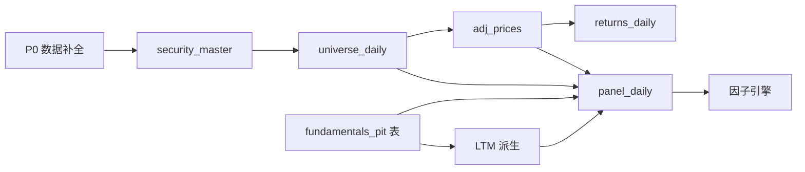
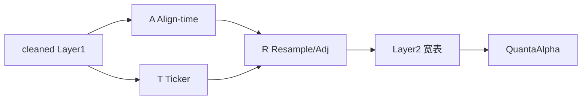
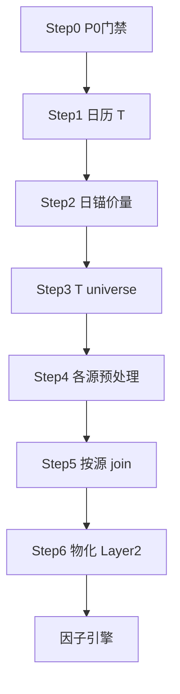

# 美股原始数据预处理标准方案（因子入模前）

> **版本**：v2.6（2026-06-03）— **正式交付以 HTML v3.6 为准**（本 MD 实质内容已并入 [`Massive数据治理与改进行动清单.html`](./Massive数据治理与改进行动清单.html)）  
> **适用范围**：Massive 本地 Parquet（`massive_parquet`）→ Layer 2 特征面板 → **因子表达式 / 因子引擎输入之前**  
> **姊妹文档**：[Massive原始数据报告.md](./Massive原始数据报告.md)（数据现状、head 样例、缺陷扫描）；治理与入模规范请只维护 HTML  
> **参考来源**：团队 Deep Research 综述 + Massive 本地数据实证（§4.0–4.0.3）

---

## 0. 文档边界与概念区分

### 0.1 清洗（Cleaning）vs 预处理（Preprocessing）

| 维度 | 数据清洗（Layer 1，已完成大部分） | 数据预处理（Layer 2，本文档） |
|---|---|---|
| **目标** | 纠正脏行、统一键名 | 构造可回测、可横截面的**特征输入** |
| **典型操作** | 去空 ticker、解析 UTC、explode 数组、主键去重 | Universe、复权、PiT asof、Panel、收益率 |
| **Massive 实现** | `massive_cleaning_framework.py` + YAML | **待建设**（PREPROC / FEAT 任务） |
| **是否改 OHLCV 数值** | ❌ 不改 | ✅ 输出复权 OHLCV、收益列 |
| **是否做截面去极值** | ❌ | ❌（属因子层） |

### 0.2 本文档包含的阶段（因子入模前）

| 阶段 | 内容 | 任务 ID |
|:---:|---|:---:|
| 0 | 数据完整性门禁（P0 截断） | TASK-DATA-* |
| 1 | 证券池同质性（资产类别、交易所） | PREPROC-001 |
| 2 | 幸存者偏差、动态 Universe、退市收益 | PREPROC-002 |
| 3 | 公司行为：拆股、分红、spin-off 复权（**日 + 分钟** 物化） | PREPROC-003 |
| 4 | 收益率（价格 / 总收益）、再投资假设 | PREPROC-004 |
| 5 | 基本面 PiT、重述、CIK 去重 | PREPROC-005 |
| 6 | LTM / 估值比 / 比率派生（数据层） | PREPROC-006 |
| 7 | 锚点 Panel、交易日历、防泄露 shift | PREPROC-007 |
| 8 | 分钟 / tick 过滤与聚合 | PREPROC-008 |
| 9 | 新闻 / SEC / 风险文本时间映射 | PREPROC-009 |
| 10 | 物化、元数据、质量监控 | PREPROC-010 |

### 0.3 明确不包含（因子入模后）

- 因子截面 **MAD / Winsorize**、**Z-Score**、**3-sigma**（金融截面不用 3-sigma）
- **Barra / OLS / Ridge** 行业市值中性化、**IC / IR / Rank IC / ICIR**
- LLM 挖因子、Multi-Agent、AWS/GPU 运维架构
- 组合优化、CVaR 约束求解

> **区分原则**：操作对象是价量 / 财报 / 公司行动 → 本文档；对象是**因子暴露序列** → [企业级因子工厂](./企业级量化因子评估与自动化入库系统需求文档_fixed.md) 文档。

### 0.4 三层架构与代码落点

```
Layer 0  raw_massive_data/
Layer 1  cleaned_massive_data/     ← massive_cleaning_framework.py
Layer 2  feature_store/ 或 panel/   ← 本文档（新建 pipeline）
         ↓
factor_engine / factor_evaluation / CompositeDataSource
```

| 组件 | 路径 | Layer 2 相关能力 |
|---|---|---|
| 清洗 | `raw_data_layer/raw_data_cleaning/massive_cleaning_framework.py` | 输入 |
| 数据登记 | `data_access/config/datasets.yaml` | 读 cleaned（登记不全，见 §11） |
| 多源 join | `factor_layer/factor_engine/storage/composite_source.py` | `merge_asof` backward |
| 评估库 | `factor_evaluation` → `Database` | 价量 exact join；基本面 `join_asof` + ffill |
| 因子算子 | `factor_engine` 基本面 PiT 算子 | 多仍为 **stub**，勿假设已实现 |

### 0.5 ATR 方法论（本平台定义，≠ 技术指标 ATR）

在 **11 TB 级 Massive Parquet** 基建中，**ATR** 指因子入模前的三大工程支柱（与 QuantaAlpha / 因子工厂 Layer 2 对齐）：

| 字母 | 含义 | 对应阶段 | 任务 |
|:---:|:---|:---|:---:|
| **A** | **Align-time** — 时间轴规范、PiT、防穿越 | Stage 0–5、7、9 | PREPROC-005/007/009 |
| **T** | **Ticker** — 代码净化、explode、Universe | Stage 1–2 | PREPROC-001/002 |
| **R** | **Resampling / Reindexing / Adjustment** — 稀疏对齐、混频、复权 | Stage 3–4、8 | PREPROC-003/004/008 |

**落地层级**：**Layer 1.5 ~ Layer 2**（`materialized_panel/` / `layer2_factor_ready_panel`）。  
`cleaned_massive_data/` **不是**因子引擎可读终态，仅单源结构化。

**执行载体（推荐顺序）**：① Parquet 物化管道（与现 11 TB 一致）→ ② ClickHouse 从物化表导入，用 **ASOF JOIN** 加速查询 → ③ QuantaAlpha 只读 Layer 2 宽表。

> 完整施工指引见 **§2 ATR 工程规范**；与 Stage 0–10 细节章节交叉引用。

---

## 1. 流水线总览

### 1.1 依赖关系（必须先后的硬门禁）



1. **P0**：2024 财报、dividends、short_*、`all_tickers` 等截断源补全前，**禁止**生产 Panel。  
2. **Universe** 在复权前或后均可，但 Panel 必须带 `in_universe` 掩码。  
3. **PiT 表** 应独立物化，再 join 到 Panel（避免在 join 时误用 `keep_latest` 全样本 filing）。

### 1.2 推荐实施顺序

| 顺序 | 内容 | 工期参考 |
|:---:|---|:---:|
| 1 | P0 补数 + 截断扫描 PASS | 1–2 周 |
| 2 | PREPROC-002 Universe + PREPROC-001 CS 过滤 | 1 周 |
| 3 | PREPROC-003 复权 + PREPROC-004 收益 | 1–2 周 |
| 4 | PREPROC-005 PiT + PREPROC-006 LTM | 2 周 |
| 5 | PREPROC-007 Panel 物化 + PREPROC-010 监控 | 2 周 |
| 6 | PREPROC-008~009 按策略 | 按需 |

### 1.3 常见致命错误（反模式）

| 反模式 | 后果 | 正确做法 |
|---|---|---|
| 用 `period_end` 贴财报到交易日 | 前视偏差 | `filing_date` + asof backward |
| SIP 与 REST 日线混用 | 假动量、假估值 | 二选一，元数据记录 `price_source` |
| 用 2026 存活 ticker 列表回灌 2008 | 幸存者偏差 | `universe_daily(D)` 动态生成 |
| 未复权 SIP 跑多年动量 | 拆股日假信号 | 复权或换 REST 日线 |
| `sum(minute.volume)==day.volume` 对账 | 误判数据损坏 | 接受口径差，分源使用 |
| cleaned 基本面 `keep_latest` 做历史回测 | 重述前视 | PiT 版本选择（§6） |
| 无 bar 填 0 | 假低价、假零盈利 | left join 保持 NaN |
| 截断文件直接入 Panel | 2024 因子全错 | 附录 H 门禁 |
| 用 `all_tickers` 建 **稠密** \(\mathcal{T}\times\mathcal{N}\) 空骨架 | 内存爆炸 + 当前仅 2k 快照 | **稀疏锚点**：从每日 `day_aggs` 出发行 |
| 把 MA(20) 流动性、\$1 仙股 filter 当「数据层必须」 | 过度剔除、与幸存者混淆 | 放进 **策略级** `universe_mask` 可选层 |
| 仅「行数≠2000/10000」即放行 | 漏检「略少但未封顶」的坏年 | 跨年行数 + settlement 覆盖审计 |

---

## 1.4 与外部建议（Gemini）的七模块对照

> Gemini 仅阅读了 [Massive原始数据报告.md](./Massive原始数据报告.md)，**未验证磁盘数据**。下表为采纳结论；详细勘误见 **附录 A**。

| Gemini 模块 | 核心主张 | 采纳？ | 落点 |
|---|---|:---:|---|
| 1 P0 熔断补全 | 删 `.ok`、`max_pages=None`、重下、停 cron | ✅ | §2、行动清单 |
| 2 稠密时空网格 | \(\mathcal{T}\times\mathcal{N}\) 空 DataFrame 骨架 | ⚠️ **修正** | §9.1 用**稀疏锚点**，非全笛卡尔积 |
| 3 复权 | 拆股乘积 + 分红总收益；REST 仅拆股 | ✅ | §5–6 |
| 4 PiT | filing_date asof；禁 keep_latest；可选 shift(1) | ✅ | §7；shift **可选** |
| 5 稀疏/结构性 null | 无 bar≠填0；volume=0 分流；禁 minute=day | ✅ | §9.5、§10 |
| 6 Universe | CS 过滤 + 日 bar 动态掩码 | ✅；MA20/\$1 **可选** | §3–4 |
| 7 Feature Store | `materialized_panel/`、宽表 schema | ✅；Iceberg **暂缓** | §12 |

---

## 2. ATR 工程规范（Align-time · Ticker · Resampling）

> 本节整合平台 ATR 施工指引，并已按 [Massive 原始数据报告](./Massive原始数据报告.md) 实证**勘误**（稀疏锚点、分红截断、2024 隔离等）。  
> **不看代码**时，可按本节分工；实现时对照 §3–§12 各 Stage。

### 2.0 顶层定位

| 项 | 规范 |
|---|---|
| **在何处做** | **Layer 1.5 ~ Layer 2**（特征商店 / 面板物化），不在 Layer 1 cleaned 内改 OHLCV |
| **输入** | `cleaned_massive_data/` + `raw` 公司行动（复权） |
| **输出** | `materialized_panel/layer2_factor_ready_panel/`（Parquet hive 或 CH 表） |
| **下游** | QuantaAlpha、factor_engine、factor_evaluation |
| **禁止** | 让挖掘引擎每次全库 `merge_asof` 扫 11 TB 异构目录 |



### 2.1 模块 A — Align-time（时间轴与 PiT）

#### A.1 交易日历母轴

| 在何处做 | Layer 2 管道初始化 |
|---|---|
| **做法** | 遍历 `cleaned .../us_stocks_sip/day_aggs_v1/` **5657** 个日文件名 → 并集得 \(\mathcal{T}\) |
| **注意** | `market_holidays` **仅 2026–2027**，**不能**用于历史校验 |
| **输出** | `calendar_trade_dates` 表 |

#### A.2 价量日界：04:00 UTC

| 在何处做 | 日 K 锚点、`align_time` 列 |
|---|---|
| **规范** | SIP 日 K 的 `window_start` → 当日 **`04:00 UTC`**（美东会话日界） |
| **注意** | **不是** 09:30 开盘；分钟 bar 为真实 UTC 时刻，与日 K 混比需先归一到 `trade_date` |

#### A.3 基本面 PiT 挂载

| 在何处做 | 跨源 asof / CH `ASOF JOIN` |
|---|---|
| **对齐键** | **`filing_date` → `align_time`（日级 00:00 UTC）** |
| **红线** | **禁止** `period_end` 作 Join 键（前视） |
| **修订** | 按 `(ticker, period_end, timeframe)` 分组，取 `filing_date ≤ t` 的 **最新可见版** |
| **红线** | **禁止** 全样本 `keep_latest` 修订版回灌历史 |

**财报不是日频原始表**，是披露事件流；贴到 \(\mathcal{T}\) 后才成日频面板。Massive **无** SEC `acceptance_datetime` 分钟字段。

#### A.4 新闻、财报与申报的时间字段（摘要）

> **字段级完整说明**见 **附录 C**（raw/cleaned 列形态、样例 JSON、Layer 2 映射列）。

| 源类型 | 原始频率 | 对齐用时间列 | `align_time` 精度 | 是否「市场首次可知」 |
|---|---|---|---|:---:|
| 三大报表 | 事件（季报/年报） | `filing_date` | **日** `00:00 UTC` | ⚠️ 日级近似，无申报时分秒 |
| `financials_ratios` | **日**截面 | `date` | 日 | 供应商快照日，非 PiT 财报 |
| `short_interest` | ~半月 | `settlement_date` | 日 | 结算日 proxy |
| `short_volume` | 日 | `date` | 日 | 当日截面 |
| `news` | 事件 | `published_utc` | **秒** | 媒体发布时间，非 EDGAR |
| `risk_factors` | 事件 | `filing_date` | 日 | 同 filing 日级 |
| `sec_edgar_index` | 事件 | `filing_date`（可 null） | 日 | 索引，部分缺日期 |

**处理**：新闻盘后 → `signal_trade_date`；财报可选 `shift(1)`（`PREPROC-009`）。

#### A.5 防泄露（可选加强）

| 策略 | 何时用 |
|---|---|
| `filing_date < trade_date` | 保守 PiT（不含披露日） |
| 基本面 `shift(1)` 或映射下一交易日 | 防盘后 10-Q/10-K |
| 分钟消费日频特征 | **仅允许 \(T-1\) 日**已知日频值 |

**跨源 join**：逻辑键优先 **`trade_date`（date）**，避免混用「财报 00:00」与「日 K 04:00」的 `align_time` 直接比大小。

#### A.6 2024 基本面物理隔离（P0 门禁）

| 在何处做 | Layer 2 输入过滤器 + QuantaAlpha `train_period` |
|---|---|
| **事实** | 2024 三大报表 / short_* **10,000 行截断**；dividends 2003+ **每年 2000 行** |
| **红线（补数前）** | 含基本面/做空/分红复权的训练与挖掘 **`end_date ≤ 2023-12-31`** |
| **红线** | 2024+ 基本面列 **强制 NaN** 或分区不物化，禁止拟合脏数据 |
| **解除条件** | TASK-DATA-002/003 完成 + L1–L3 审计 PASS |

---

### 2.2 模块 T — Ticker（代码与 Universe）

#### T.1 Layer 1 已完成 vs Layer 2 仍要做

| 已完成（Layer 1） | Layer 2 仍要做 |
|---|---|
| `ticker` 大写去空格 | 过滤 `'NA'` 字符串（REST 日 K 有） |
| `tickers[]` **explode** 单行 | `dropna(ticker)` 再 join |
| 空 ticker 丢弃 | CIK 级去重策略（多 ticker） |

#### T.2 主数据过滤（CS 池）

| 条件 | 说明 |
|---|---|
| `market == 'stocks'` | |
| `locale == 'us'` | |
| `type == 'CS'` | 主过滤；**勿**只靠后缀猜 PFD/WS |
| **注意** | `all_tickers` 当前 **2000 行快照** → P0 全量前勿当全历史 \(\mathcal{N}\) |

REIT/ADR 可能仍为 `CS`，需行业/名称二次规则（`PREPROC-001`）。

#### T.3 动态 Universe（防幸存者）

| 在何处做 | `universe_daily` + 宽表 `in_universe_base` |
|---|---|
| **做法** | **稀疏**：当日 `day_aggs` 有 bar 的 ticker ∩ CS 主数据 |
| **勘误** | **不要**用全量 `all_tickers` 预建 \(\mathcal{T}\times\mathcal{N}\) **稠密空骨架** |
| **可选** | MA(20)、价格>\$1 等 → `universe_mask` **策略列**，非数据层默认 |

---

### 2.3 模块 R — Resampling / Reindexing / Adjustment

#### R.1 稀疏面板与「稠密化」勘误

Massive 价量是 **Sparse Panel**（无成交常**无行**，非 NaN 行）。

| Gemini 主张 | 本方案（修正） |
|---|---|
| \(\mathcal{T}\times\mathcal{N}\) 空骨架 + 全量 ffill | **主路径：稀疏锚点**（有 bar 才成行）；仅在对**单 ticker 连续序列**做滚动/技术指标时，对该序列 **ffill 价格** |
| 无 bar 一律 ffill 昨收 | **禁止**跨停牌/退市区间 ffill（会造假连续上市） |
| 成交量无 bar | **不生成行**；有 bar 且 `volume==0` → 流动性特征 **0**，close 仍可用于收益 |

| 列族 | 无 bar（行不存在） | 有 bar, volume=0 |
|---|---|---|
| OHLC / 收益 | 无行或 NaN（left join） | close 有效 |
| volume / turnover | 无行 | **0** |
| 基本面科目 | NaN | 不适用 |
| inventories 等结构性 null | — | **保持 NaN，禁止填 0** |

#### R.2 复权（Adjustment）

| 价源 | 处理 |
|---|---|
| REST `daily_market_summary` | 已**拆股**复权；**不含**分红 |
| SIP `day_aggs` / minute | **不复权** → 用 `splits.historical_adjustment_factor` |

**拆股（SIP）**：

- 价格（后复权到 as_of）：\(P_{adj} = P_{raw} \times \prod_{\tau>t} f_\tau\)  
- 成交量：\(V_{adj} = V_{raw} / \prod_{\tau>t} f_\tau\)  

**分红（P0 红线）**：

| 阶段 | 规则 |
|---|---|
| **补数前** | R 模块 **仅拆股复权**；**禁止**叠加分红总收益复权 |
| **原因** | `dividends` 2003–2026 每年 **2000 行**截断 |
| **补数后** | 再开启 `ret_total` / 分红前复权（§6） |

#### R.3 混频（Resampling）

| 方向 | 规范 |
|---|---|
| **Minute → Daily** | 日频因子用 **day_aggs**；若从分钟聚合：先 **RTH 过滤**，价类可用 **VWAP** 坍缩；**禁止** `sum(minute.volume)==day.volume` 校验（仅 ~1.9% 一致） |
| **Daily → Minute** | 日频门控特征 **仅 \(T-1\)** 日已知值 asof 到分钟 |
| **基本面 → Daily** | asof backward on `filing_date` / `trade_date`；披露间隔可 **PiT ffill**，**禁 bfill** |

---

### 2.4 ATR × 存储：ClickHouse 与排序键（Track A / B）

**11 TB 不必整体搬进 CH**；推荐 **Parquet 物化 Layer 2 → CH 热数据**。

| 跑道 | 查询模式 | `ORDER BY` 建议（CH） |
|---|---|---|
| **Track A 横截面** | 某日全市场因子暴露 | `(trade_date, ticker)` 或 `(factor_id, trade_date, ticker)` |
| **Track B 时序** | 单票多日/分钟特征 | `(ticker, align_time)` 或 `(factor_id, ticker, align_time)` |

物化宽表分区：`PARTITION BY toYYYYMM(trade_date)`；在 CH 内对 Layer 2 做 **ASOF JOIN** 优于每次 Python 扫 11 TB 异构树。

Python `merge_asof` 与 CH `ASOF JOIN` **二选一**为主路径，避免双份逻辑漂移。

---

### 2.5 平台终审三条硬指令（补数前生效）

| 角色 | 指令 |
|---|---|
| **数据组** | 按行动清单删 `.ok`、P0 重下（2024 财报、dividends、short_*、`all_tickers`）；**关停**错误日更 cron（勿写 workspace） |
| **算法/QuantaAlpha** | 含基本面/做空/分红复权：`train_period` **结束 ≤ 2023-12-31**；2024+ 基本面列视为不可用 |
| **平台工程** | 落地 **ATR → Layer 2 物化**；CH 作查询加速；禁止未过 P0 门禁的 Panel 进挖掘 |

---

### 2.6 ATR 与 PREPROC 任务映射

| ATR 模块 | PREPROC / TASK |
|---|---|
| A 日历 + PiT + 2024 门禁 | PREPROC-005/007/009，TASK-DATA-* |
| T CS + Universe + NA 过滤 | PREPROC-001/002 |
| R 复权 + 收益 + 混频 | PREPROC-003/004/008 |
| 物化 + 监控 + CH | PREPROC-007/010 |

---

### 2.7 ATR 反模式（补充 §1.3）

| 反模式 | 正确 |
|---|---|
| 把 ATR 当成技术指标 Average True Range | 本文 **Align-time / Ticker / Resample** |
| Layer 1 cleaned 直接进 QuantaAlpha | 必须先 **ATR → Layer 2** |
| 全市场稠密网格 + 无差别 ffill | **稀疏锚点** + 有选择的 ffill |
| 2024 基本面进训练 | **隔离至 P0 完成** |
| 分红复权与截断 dividends 并用 | **仅拆股**直至重下完成 |
| 因子层 MAD/中性化写进 ATR-R | 属因子评估，**非 R** |

---

## 3. Stage 0：数据完整性门禁

任何预处理流水线启动前执行（详见 [行动清单 §10](./Massive数据治理与改进行动清单.html)）。

### 2.1 截断指纹

| 行数 | 含义 | 动作 |
|---:|---|---|
| **10000** | REST `max_pages` 典型封顶 | 删 `.ok` 重下 |
| **2000** | `limit=2000` 按年封顶 | 同上 |

### 2.2 生产阻断列表（摘要）

| 数据集 | 状态 |
|---|---|
| `*_2024` 三大报表 / cash_flow / short_* | ❌ 不可用 |
| `dividends_{2003..2026}` 每年 2000 行 | ❌ 不可用 |
| `all_tickers_all` 2000 行 | ❌ 不能作全市场主数据 |
| `news_all` / `risk_factors` 封顶 | ❌ 仅样本 |

完整列表 → [Massive 报告 附录 H](./Massive原始数据报告.md#附录-hrest-分页截断清单需重下)。

### 2.3 一键扫描

```python
import pyarrow.parquet as pq
from pathlib import Path

raw = Path("/home/yluel/share/projects/massive_parquet/raw_massive_data")
bad = []
for f in sorted(raw.rglob("*.parquet")):
    n = pq.read_metadata(f).num_rows
    if n in (2000, 10000):
        bad.append((n, str(f.relative_to(raw))))
assert not bad, f"截断可疑文件 {len(bad)} 个"
```

### 2.4 SRE 补全守卫（在 Gemini 伪代码基础上的修正）

Gemini `SreDataGuard` 思路可用，但**不能**只靠 `num_rows ∉ {2000,10000}` 判定健康（会漏掉「略低于正常但未触顶」的坏分区）。

**推荐三层门禁**：

| 层级 | 规则 | 示例 |
|:---:|---|---|
| L1 指纹 | 行数 ∈ {2000, 10000} | 立刻删 `.ok` + 重下 |
| L2 同比 | 同年份行数 < 上年同源的 **50%** | `balance_sheet_2024` vs 2023 |
| L3 业务 | 域内日期/集合覆盖 | `short_interest_2024` 仅 1 个 settlement_date |

```python
# 概念：截断 + 同比（伪代码）
def is_partition_suspect(path, peer_paths_by_year):
    n = pq.read_metadata(path).num_rows
    if n in (2000, 10000):
        return True, "fingerprint"
    year = parse_year_from_filename(path)
    if year in peer_paths_by_year:
        n_prev = pq.read_metadata(peer_paths_by_year[year - 1]).num_rows
        if n < 0.5 * n_prev:
            return True, "yoy_drop"
    return False, "ok"
```

**下载参数（与报告 §10.9 一致）**：

- `max_pages=None`（勿用 `999999` 代替，语义不清）
- `skip_existing=False` 重下坏分区
- 写 `.ok` 前跑 L1–L3，可疑则**不写** `.ok`

**Cron**：立即暂停 `daily_update_scheduler.sh`；输出必须指向 `.../massive_parquet/raw_massive_data/`（非 workspace）。

---

## 4. Stage 1：截面同质性 — 资产类别与主数据

### 3.1 目标

保证横截面比较的是**同质普通股**；剔除结构性异质资产，避免估值、盈利、动量因子被 REIT/ETF/权证等扭曲。

### 3.2 资产类别处理矩阵（标准）

| 类别 | `type` 示例 | 处理 | 不兼容原因 |
|---|---|:---:|---|
| 普通股 | `CS` | **保留** | 因子主池 |
| REIT | 常仍为 `CS` 但行业为 REIT | **剔除** | FFO 口径；PE/股息率极端 |
| ADR | 多为 `CS` + 非美主体 | **剔除** | 汇率、会计准则、披露滞后 |
| 优先股 | `PFD` | **剔除** | 利率敏感，非盈利驱动 |
| 权证 | `WARRANT` | **剔除** | 期权时间价值 |
| ETF / ETN | `ETF` | **剔除** | 非单票股权 |
| SPAC 单元 | `SP` 等 | **剔除** | 复合证券 |
| 债券/指数/加密 | 非 stocks | **剔除** | 不同资产类 |

> REIT/ADR 在 Massive 中**不会**总是单独 `type`，需结合 `sic`/`description`/`name` 或外部行业表二次过滤（`PREPROC-001` 增强项）。

### 3.3 Massive `ticker_types` 字典（节选）

| code | description |
|---|---|
| `CS` | Common Stock |
| `PFD` | Preferred Stock |
| `WARRANT` | Warrant |
| `ETF` | Exchange Traded Fund |
| `SP` | （样例：SPAC，见 ipos） |

路径：`tickers/ticker_types/`（静态字典）。

### 3.4 `all_tickers` 过滤规则（推荐）

```python
# 概念过滤 — 全量 all_tickers 补全后执行
def is_equity_common_us(row) -> bool:
    if row["market"] != "stocks" or row["locale"] != "us":
        return False
    if row["type"] != "CS":
        return False
    if not row.get("active", True) and row.get("delisted_utc") is None:
        pass  # 历史退市股：active=False 仍可能需保留在历史 universe
    if row["ticker"] in ("NA", "", None):
        return False
    # 可选：primary_exchange in NYSE/NASDAQ 白名单
    return True
```

| 字段 | 用途 |
|---|---|
| `ticker` | 主键 |
| `type` | CS 过滤 |
| `market` / `locale` | 限定美股 |
| `primary_exchange` | XNYS/XNAS/ARCX 等 |
| `cik` | 与财报 join；**多 ticker 同一 CIK** 去重策略见 §6.5 |
| `active` | 当前是否活跃 |
| `list_date` / `delisted_utc` | Universe 边界（若 API 提供） |
| `last_updated_utc` | 主数据刷新时间 |

**现状**：`all_tickers_all.parquet` 仅 **2000 行** → **不能**支撑全历史 CS 过滤，属 **P0 重下**。

### 3.5 输出：`security_master`

| 列 | 类型 | 说明 |
|---|---|---|
| `ticker` | string | 大写 |
| `cik` | string | |
| `type` | string | 原始 type |
| `is_cs_universe` | bool | 是否进入股权因子池 |
| `primary_exchange` | string | |
| `list_date` | date | 可空 |
| `delisted_utc` | timestamp | 可空 |
| `effective_from` | date | 慢变维可选 |

**任务**：`PREPROC-001`（P1，依赖 `all_tickers` 全量）。

### 3.6 验收

- [ ] 知名 ETF（如 `AAA`）`is_cs_universe=false`  
- [ ] `PFD`/`WARRANT` 不进入主池  
- [ ] `all_tickers` 行数 >> 2000  

---

## 5. Stage 2：幸存者偏差与动态 Universe

### 4.1 目标与业界证据

**幸存者偏差**：回测只含「活到今天」的标的，会系统性高估阿尔法。

| 研究场景 | 偏差量级（摘要） |
|---|---|
| 美国股票基金 1991–2020 中位数 Alpha | 存活样本 **-0.84%** vs 全样本 **-1.44%**/年，约 **50% 高估** |
| 危机年份退市强度 | 常规年约 **5%**/年消失；**2009 约 11.5%** |

**禁止**：恒定「退市折损率」打补丁——退市率随宏观剧烈变化，尾部年份会严重误判。

### 4.2 标准方案

在任意截面日 \(T\)：

\[
\mathcal{U}(T) = \{ i \mid \text{股票 } i \text{ 在 } T \text{ 对投资者可观测且符合 CS 规则} \}
\]

必须包含后来退市/破产的 \(i\) 在 \(T\) 之前的历史。

### 4.3 Massive 落地：双轨证据

| 证据源 | 用法 | 局限 |
|---|---|---|
| **日 K 文件存在性** | 当日 bar 出现 → 当日可交易 proxy | 无成交日可能无行 |
| **`all_tickers` list/delist** | 上市前剔除、退市后剔除 | 需全量；字段完整性待验证 |
| **无 CRSP condition code** | 无法区分 halt、bankruptcy code | 需人工 spot check |

### 4.4 `universe_daily` 推荐算法（稀疏，非稠密网格）

> **勘误（Gemini 模块 2/6）**：不要用「全历史 `all_tickers` × 全部交易日」预分配空 DataFrame。当前 `all_tickers` 仅 **2000 行**，且稠密网格规模约 \(5657 \times 10^4\) 行/特征，内存与存储都不必要。正确做法是 **每日从实际 bar 出发** 的稀疏表。

```text
输入: trade_dates[] 来自 day_aggs 文件名并集（= 日历真值 T）
     security_master（P0 补全后）
     optional: all_tickers list_date, delisted_utc

对每个 trade_date D:
  bars_D = read cleaned day_aggs(D)
  candidates = { row.ticker | row.ticker valid }

  for t in candidates:
    if security_master[t].is_cs_universe == False: drop
    if list_date(t) > D: drop
    if delisted_utc(t) <= D_start_of_day: drop
    emit (D, t, has_bar=1, in_universe_base=1)

  # 无 bar 的 (D,t) 默认不写入 panel 锚点（稀疏）
```

### 4.4.1 策略级掩码（可选，非数据层默认）

Gemini 提出的 **MA(Volume,20)>0**、**收盘价 > \$1**、连续 N 日无成交等，属于 **QuantaAlpha / 因子工厂的策略过滤**，应作为 `universe_mask_strategy` 与 `in_universe_base` 分离：

| 掩码层 | 含义 | 默认 |
|---|---|:---:|
| `in_universe_base` | CS + 上市区间 + 当日有 bar（防幸存者底线） | **必须** |
| `universe_mask_liquid` | MA20 成交量、价格下限等 | 策略可选 |
| `universe_mask_tradeable` | 停牌连续 N 日 =0 等 | 策略可选，N 需校准 |

**注意**：`volume==0` 可能是极低流动性而非退市，不宜单独用「连续 0 成交」判定摘牌。

### 4.5 退市 / 破产收益处理（入模前需定义）

| 事件 | 预处理层定义 | 因子层使用 |
|---|---|---|
| 正常退市 | 最后交易日 close；之后无 bar | 收益序列结束或 -100% 模拟 |
| 并购出局 | 可能有最后 jump | 按公告日映射 |
| 破产归零 | 极低收盘价 → 0 | 回测需允许大幅负收益 |

Massive **不**提供 CRSP 退市收益调整表；须在 `returns_daily` 元数据中记录 `delisting_policy`。

### 4.6 输出 schema：`universe_daily`

| 列 | 说明 |
|---|---|
| `trade_date` | date |
| `ticker` | string |
| `in_universe` | uint8 |
| `has_bar` | uint8（当日是否有 day_aggs 行） |
| `primary_exchange` | string 可选 |

**任务**：`PREPROC-002`（P0），与 `FEAT-004` 合并实现。

### 4.7 验收

- [ ] 2008 某截面 \|U(D)\| **>** 仅用 2026 存活列表回灌的集合  
- [ ] 退市标的在退市日前 `in_universe=1`  
- [ ] 新上市前 `in_universe=0`  

---

## 6. Stage 3：公司行为与复权

### 5.1 目标

消除拆股、合股、现金分红导致的价格**非经济跳跃**，使 \(P_t\) 与 \(V_t\) 在时间上可比。

### 5.2 拆股 / 合股（CRSP 风格）

**价格**（截至 \(t\) 的累计因子 \(C_t\)）：

\[
A_{price}(t) = P(t) / C_t
\]

**成交量 / 股本类**：

\[
A_{vol}(t) = V(t) \times C_t
\]

#### Massive `splits` 字段

| 字段 | 说明 |
|---|---|
| `execution_date` | 除权执行日 |
| `split_from` / `split_to` | 如 1→2 |
| `adjustment_type` | `forward_split` 等 |
| `historical_adjustment_factor` | API 文档：对日 \(D\) 未复权价，找 **execution_date > D** 的最近拆股，**乘以**该因子 |

#### 本地实证（摘要，详见 [§4.0](./Massive原始数据报告.md#40-量价数据的复权说明重要)）

| 案例 | 结论 |
|---|---|
| NVDA 2024-06-10 十拆一 | SIP 1208→121；REST 连续 ~121 |
| TSLA 多次拆股 | REST 为**累积到当前股本**的前复权；历史 REST 价随新拆股变 |
| KO/AAPL 除息 | SIP 与 REST **diff=0** → REST **不含分红复权** |

#### 后复权 vs 前复权（与 Gemini 模块 3 对齐）

Massive `historical_adjustment_factor` 文档语义：对日 \(t\) 的**未复权价**，乘以所有 **execution_date > t** 的拆股因子之积（把历史价还原到**当前股本口径**）——即**后复权（backward to today）**：

\[
P_{adj\_split}(t) = P_{raw}(t) \times \prod_{m:\,\tau_m > t} f_m
\qquad
V_{adj\_split}(t) = V_{raw}(t) \div \prod_{m:\,\tau_m > t} f_m
\]

| 方案 | 与 REST `daily_market_summary` 关系 | 因子回测 |
|---|---|---|
| 后复权到「当前」 | 与 REST 思路接近（REST 会随新拆股改历史） | 可用；注意回测终点滚动 |
| **前复权**（§5.3 分红节） | 需自维护，历史不变 | 增量回测、与 TSR 审计更一致 |

**生产建议**：短中期动量可直接用 **REST 日线**（已拆股）；SIP 自算时选定一种并写入 `adj_method` 元数据，**禁止**混用后复权 SIP + 前复权分红。

#### SIP 拆股复权伪代码

```python
def split_adjust_sip_backward(bars: pd.DataFrame, splits: pd.DataFrame) -> pd.DataFrame:
    """后复权到 as_of_date（默认最新交易日）"""
    # 对每个 (ticker, t): cum_factor(t) = prod(haf for execution_date > t)
    for col in ("open", "high", "low", "close"):
        bars[f"{col}_adj"] = bars[col] * cum_factor
    bars["volume_adj"] = bars["volume"] / cum_factor
    return bars
```

**任务**：`PREPROC-003` 必须含 NVDA/TSLA/KO 回归测试。

### 5.3 现金分红：前复权 vs 后复权

| 维度 | 前复权 (Forward) | 后复权 (Backward) |
|---|---|---|
| 锚点 | 历史起点固定 | 最新价固定 |
| 除息后 | 调整**未来**价格 | 调整**过去**价格 |
| 回测增量 | 历史收益不因**新分红**改变 | 全历史重算 |
| **推荐** | ✅ 因子回测、TSR 审计 | 图表展示 |

**比例因子**（除息日 \(t\)，前一日收盘 \(P_{t-1}\)，每股分红 \(D\)）：

\[
f_{div} = \frac{P_{t-1} - D}{P_{t-1}}
\]

\(f_{div}\) 乘到所有 **早于除息日** 的价格（等比例）。**禁止**对低价股用固定金额减价（收益率失真）。

Massive：`dividends.cash_amount`、`ex_dividend_date`；`historical_adjustment_factor` **约 19.8% null**（2024 样本）→ 需自算 \(f_{div}\)。

### 5.4 价源策略（二选一）

| 策略 | 路径 | 拆股 | 分红 | 适用 |
|---|---|:---:|:---:|---|
| **A** | REST `daily_market_summary` | ✅ API | ❌ | 长周期价量因子、快速上线 |
| **B** | SIP `day_aggs_v1` + splits + dividends | 自算 | 可选自算 | 与 tick/minute 同源 |

**禁止**同一 Panel 混 A/B。`panel_daily.meta.price_source ∈ {sip_adj, rest_split_only}`。

### 5.5 Spin-off / 特殊行为

- `splits.adjustment_type` 非 forward_split 时，按除权日折算价重算 \(C_t\)。  
- Spin-off：母公司价格减去剥离业务折算价 → 非标准十进制因子（Deep Research / CRSP 手册）。  
- **须**对少数已知事件做单测，不能盲信 `historical_adjustment_factor` 100%。

### 5.6 输出：`bars_adjusted_daily`

| 列 | 说明 |
|---|---|
| `trade_date`, `ticker` | |
| `open_adj`, `high_adj`, `low_adj`, `close_adj` | |
| `volume_adj` | |
| `adj_method` | split_only / split_and_div / rest_api |
| `cum_adj_factor` | 调试用 |

---

## 7. Stage 4：收益率序列

### 6.1 价格收益 vs 总收益

| 类型 | 定义 | 用途 |
|---|---|---|
| **价格收益** | 复权价 close-to-close；**不含**常规现金分红 | 动量、技术、微观 |
| **总收益** | 含分红再投资 | 长期复利、红利因子 |

### 6.2 价格收益（日）

\[
r^{price}_{t} = \frac{P^{adj}_{t}}{P^{adj}_{t-1}} - 1
\]

**特殊现金分红**（extraordinary）：部分学术库从价格收益剔除；Massive `distribution_type` 需核对是否标记。

### 6.3 总收益（CRSP 概念，Layer 2 自维护因子）

\[
R^{total}_{t} = \frac{P^{adj}_{t} + D_t / (C^{pr}_t \cdot f^{pr}_t)}{P^{adj}_{t-1}} - 1
\]

Massive 无 `cumfacpr`/`facpr` 列 → 由 `splits` + `dividends` 在 Layer 2 维护累计表，或简化为：

\[
R^{total}_{t} \approx r^{price}_{t} + \frac{D_t}{P^{adj}_{t-1}}
\]

（小分红近似；严格生产用累计因子表。）

### 6.4 再投资假设（元数据强制）

| 假设 | 说明 |
|---|---|
| `div_reinvest_exdate` | 除息日再投资（FF 新版 CIZ 思路） |
| `div_reinvest_month_end` | 月末再投资（旧 FIZ） |

**固定一种**写入 `returns_daily` 表元数据；混用会导致与 Fama-French 因子无法对比。

### 6.5 防泄露：收益与信号对齐

| 信号所用数据 | 收益区间 | 常见做法 |
|---|---|---|
| \(T\) 收盘后算出的因子 | \(T+1\) open→close 或 \(T+1\) close-to-close | `shift(1)` 或 next-day 映射 |
| \(T\) 开盘前已知的基本面 | \(T\) close-to-close | filing_date < T 09:30 ET |

详见 §9.3。

### 6.6 输出：`returns_daily`

| 列 | 说明 |
|---|---|
| `ret_price` | float |
| `ret_total` | float 可空 |
| `div_reinvest_policy` | string |

**任务**：`PREPROC-004`（P1）。

---

## 8. Stage 5：基本面 Point-in-Time（PiT）

> **各源字段形态、JSON 样例、Layer 2 列命名**见 **附录 C**。

### 8.1 目标

在决策时刻 \(T\)，仅允许使用**市场已可见**的财报版本；杜绝重述回填导致的前视。

### 7.2 三维时间戳

| 维度 | 字段 | 错误用法 | 正确用法 |
|---|---|---|---|
| 会计期末 | `period_end` | 贴到 \(T\) | 仅标识财报季度 |
| **披露时刻** | **`filing_date`** | — | **asof 键** |
| 修正版本 | 同 period 多 `filing_date` | 全样本 max(filing) | \(T\) 上可见的最新版 |

cleaned 层 `align_time` = `filing_date`（UTC 午夜），**不等于** 收盘后可交易时刻；保守做法：`filing_date < trade_date` 或 `filing_datetime < T_open`。

### 7.3 PiT 选股算法（修正 Gemini 简化公式）

Gemini 写法 \(\max\{\text{filing\_date} \le t\}\) **不完整**：须按 **报告期** 分组，否则会混用不同季度的「最新 filing」。

\[
\text{Visible}_{i,t}(q) = \arg\max_{\tau \le t} \;\text{filing\_date}
\quad\text{s.t. } (i, q, \text{timeframe}) \text{ 固定}
\]

```python
def pit_fundamentals_at(T, fund_stream, ticker):
    """fund_stream: 单 ticker 按 filing_date 排序"""
    visible = fund_stream[fund_stream["filing_date"] < T]  # 保守：不含 T 当日盘后披露
    if visible.empty:
        return None
    return visible.sort_values("filing_date").groupby(
        ["period_end", "timeframe"], as_index=False
    ).tail(1)
```

**禁止**使用 cleaned 默认 `keep_latest_by_align_time` 的**全历史**结果做回测（会纳入未来重述）。

**修订版 A/B（Gemini 模块 4）**：同一 `period_end` 在 \(t\) 之前可见 **修订 A**，在更晚 `filing_date` 才出现 **修订 B** → 在 \(t\) 只能用 A；B 仅在时间轴走过 B 的 `filing_date` 后才可进入 PiT 切片。

### 7.4 重述与「小 R」修正

- 非 PiT 商业库用最新重述值覆盖初版 → 回测「预知」修正后恶化。  
- **Enron 压力测试**：1999 回测若读到 2001 重述后数据 → 虚假预测破产。  
- Massive：**无** `revision_date`；同 `(ticker, period_end, timeframe)` 多条 `filing_date`（报告：约 **76** 条/年仅 balance_sheet 2023）→ 必须按 \(T\) 过滤。

### 7.5 多 ticker / 同一 CIK

- raw `tickers[]` 多元素 → cleaned explode 多行。  
- 因子池按 **ticker** 还是 **CIK** 需统一：  
  - **ticker 级**：保留 explode；  
  - **公司级**：先按 CIK 选 canonical ticker（如市值最大），防重复计权。

### 7.6 其他基本面源

| 源 | 频率 | Join | 注意 |
|---|---|---|---|
| `financials_ratios` | 日截面 | asof backward | `price_to_earnings` **56% null**（亏损） |
| `short_interest` | 半月 | asof backward | `settlement_date` ≠ 公布日；2024 截断 |
| `short_volume` | 日 | backward | 2024 截断 |
| `stocks_floats` | 事件 | asof | `effective_date` |

### 7.7 输出：`fundamentals_pit_long` 或宽表

| 列 | 说明 |
|---|---|
| `trade_date`, `ticker` | |
| `knowledge_ts` | = 选用版本的 filing_date |
| `period_end`, `timeframe` | |
| `field`, `value` | 长表；或透视宽表 |

**任务**：`PREPROC-005`（P0）。

---

## 9. Stage 6：LTM 与数据层派生列

> 在 **PiT 对齐后** 的序列上计算；仍是特征工程，**不是**因子截面 MAD。

### 8.1 Trailing Twelve Months (LTM)

对每个 `(ticker, trade_date T)`：

1. 取 PiT 可见的最近 4 个 **quarterly** `period_end` 不重叠季度；  
2. 对 `revenue`, `net_income`, ... 做 sum → `ltm_revenue`, `ltm_net_income`；  
3. 若不足 4 季，LTM 标 NaN 或降级为 YTD（需在元数据声明）。

### 8.2 估值与质量比率

| 指标 | 分子 | 分母 | 约束 |
|---|---|---|---|
| **PE** | 市值 = `close_adj * shares_out` | `ltm_eps` 或 diluted EPS | 分母 ≤0 → PE=NaN |
| **PB** | 市值 | `total_equity`（最近 PiT 季） | |
| **ROA** | `ltm_net_income` | `total_assets`（同期） | |
| **股息支付率** | `DPS` 或 `cash_div` | **匹配财年**的 LTM 净利润 | 禁止错季 EPS |

`shares_out`：优先 `stocks_floats` asof；否则日 K 隐含或财报股数。

### 8.3 `financials_ratios` vs 自算

| 方式 | 优点 | 缺点 |
|---|---|---|
| 直接用 Massive ratios | 快 | 非 PiT；PE null 多 |
| 自算 LTM + 市值 | PiT 一致 | 工程量大 |

**推荐**：生产因子用 **自算**；ratios 作校验。

### 8.4 任务与验收

- `PREPROC-006`（P1）  
- [ ] PE 亏损股为 NaN 而非极大值  
- [ ] 支付率分母季度与分红公告匹配  

---

## 10. Stage 7：锚点 Panel、日历与跨源 Join

> **端到端「怎么把所有源对齐」**见 **附录 D**（推荐先读 D 再实现 §10）。

### 10.1 锚点定义：稀疏网格 vs 稠密网格（重要勘误）

| 概念 | Gemini 建议 | **本方案（正确）** |
|---|---|---|
| 网格类型 | \(\mathcal{T}\times\mathcal{N}\) 预分配空骨架 | **稀疏**：仅 `(D,ticker)` 在 `day_aggs` 有 bar |
| \(\mathcal{N}\) 来源 | 全量 `all_tickers` | **当日 bar 出现集** ∩ CS 主数据（P0 后） |
| 键 | `(ticker, align_time)` | 工程上推荐 **`trade_date` + `ticker`**；价量列 `align_time`=当日 **04:00 UTC** |

```text
锚点源     = bars_adjusted_daily 或 REST 等价表
键         = (trade_date, ticker)   # 逻辑键
时间列     = align_time = trade_date 映射到 04:00 UTC（SIP 日 K）
粒度       = 稀疏：每个交易日 × 当日有 bar 的 ticker
```

**跨源 join 时间轴注意**：

- SIP 日 K：`align_time` = 该日 **04:00 UTC**（会话日界，非 09:30 开盘）。  
- 基本面：`align_time` = `filing_date` 通常 **00:00 UTC**。  
- `merge_asof` 前建议统一为 **`trade_date`（date）或 `knowledge_date`**，避免用不同时刻的 `align_time` 直接比大小导致 off-by-one。

### 10.2 交易日历构建

| 方法 | 说明 |
|---|---|
| **文件并集** | 从 `day_aggs` 文件名提取 date；**推荐** |
| `market_holidays` | 仅 **2026–2027**；不能校验 2003–2025 |
| weekday 减 holidays | 需完整 holidays 表（待采购或自建） |

已知缺口：2025-01-09 全国哀悼休市 → 无 day 文件（与 NYSE 一致）。

### 10.3 完整 Join 规则表

| 源 | 类型 | 键 | 方向 | 备注 |
|---|---|---|---|---|
| `bars_adjusted` | anchor | trade_date, ticker | — | |
| `universe_daily` | left | 同上 | — | 过滤 `in_universe` |
| `returns_daily` | left | 同上 | — | |
| fundamentals PiT | **asof** | ticker | backward on filing | |
| `financials_ratios` | asof | ticker | backward | |
| `short_interest` | asof | ticker | backward | 滞后 |
| `short_volume` | asof/exact | ticker | backward | |
| `dividends`/`splits` | 事件 | ticker, date | — | 复权用，不直接特征 |
| `news` | asof + map | ticker | backward → next_td | §11 |
| `daily_market_summary` | — | — | **禁止混 join** | |

### 10.4 Panel 构建伪代码

```python
calendar = load_trade_dates_from_day_aggs()
anchor = []
for D in calendar:
    u = universe_daily[D]
    bars = bars_adjusted[D].join(u, on="ticker", how="inner")
    anchor.append(bars)

panel = concat(anchor)
panel = panel.merge_asof(
    panel.sort_values(["ticker", "trade_date"]),
    fundamentals_pit.sort_values(["ticker", "knowledge_ts"]),
    left_on="trade_date", right_on="knowledge_ts",
    by="ticker", direction="backward",
)
# 可选: 披露间隔 ffill — 仅限 knowledge_ts <= trade_date 的列
```

### 10.5 缺失语义与 `volume==0` 分流（采纳 Gemini 模块 5）

| 类型 | 表现 | 处理 |
|---|---|---|
| 行不存在 | 无 bar | left join → NaN；**禁止填 0** |
| 字段 null（结构性） | 科目不适用 | 保持 NaN（如 `inventories` ~52%）；**禁止**均值插补 |
| `volume==0` 但有 close | ~0.8% 日 | **收盘价有效** → 可算收益；**流动性类特征**（换手率、成交额）置 **0** 而非 NaN |
| 披露间隔 | 基本面 NaN | PiT 下 `ffill` 可选，禁 bfill |

> **不矛盾**：「无 bar」≠「有 bar 但 volume=0」。前者缺失价量；后者价有效、量特征为 0。

| 特征族 | volume=0 当日 |
|---|---|
| `ret_price`、`volatility`（基于 close） | 可计算 |
| `turnover`、`dollar_volume`、`amihud` | 置 **0** 或剔除该日截面（策略定） |

### 10.6 信息泄露防护

| 数据 | 风险 | 缓解 |
|---|---|---|
| 当日收盘 OHLCV 预测当日收益 | 收盘价泄露 | 收益用 \(T+1\)；信号 `shift(1)` |
| 当日盘后 filing | `filing_date` 无 intraday 时钟 | **可选** `shift(1)` 或映射下一交易日（Gemini 建议；**非强制**，取决于因子是否在收盘后计算） |
| 新闻 `published_utc` 盘后 | 当晚新闻 | 映射 **next trade_date** |
| 分钟收盘聚合到日 | 若用当日分钟算日频 | 仅用于日内；日频用 day_aggs |

`factor_evaluation.Database` 对离散特征有 `join_asof` + forward fill — **调用方**须确认 ffill 不穿越未来。

### 10.7 物化：`panel_daily`

**路径建议**：

```text
feature_store/panel_daily/year=YYYY/month=MM/part.parquet
# 或 ClickHouse: panel_daily PARTITION BY toYYYYMM(trade_date)
```

**推荐列分组**：

| 组 | 示例列 |
|---|---|
| 键 | `trade_date`, `ticker`, `in_universe` |
| 价量 | `open_adj`, `high_adj`, `low_adj`, `close_adj`, `volume_adj` |
| 收益 | `ret_price`, `ret_total` |
| 基本面 | `ltm_*`, `total_equity`, ... |
| 元数据 | `price_source`, `pit_knowledge_ts`, `schema_version` |

**任务**：`PREPROC-007` / `FEAT-001`（P0）。

---

## 11. Stage 8：分钟线与 tick（可选）

### 10.1 分钟线：与日 K 关系

| 实证（2024-06-03） | 数值 |
|---|---:|
| `sum(minute.volume)==day.volume` | **1.9%** ticker |
| 误差 &lt;1% | **11.7%** |
| median ratio sum(day)/day | **0.913** |

**原因**：扩展时段、条件码、TRF 归属与日聚合不一致（[§4.0.3](./Massive原始数据报告.md#403-价量跨粒度一致性与时间语义)）。

**规则**：

- 日频因子 → **`fact_bars_adjusted_daily`**（或 REST 日线二选一）；  
- 日内因子 / **`ts_*` 算子读分钟 OHLC** → **`fact_bars_adjusted_minute`**（与日线同 `PREPROC-003` / `adj_method`）；**禁止** cleaned 未复权分钟直接进因子引擎；  
- **禁止**用 minute 加总校验 day。

> 治理清单 **§3.2**（`sec-operator-adj`）：因算子窗口可为数百～上千 bar，分钟频入模**必须拆股复权**；tick 微观可用 raw，聚合后再复权。

### 10.2 交易时段过滤（US/Eastern）

| 会话 | 本地时间 | UTC（标准时间示例） |
|---|---|---|
| RTH | 09:30–16:00 ET | 14:30–21:00 UTC |
| 扩展 | 04:00–20:00 ET | 等 |

AAPL 样例：分钟覆盖 UTC **08:00–23:59** → 做 RTH 因子必须先 filter。

`window_start`：日 K 统一 **04:00 UTC** 日界，**不是** 09:30 开盘。

### 10.3 分钟聚合配方（若 rollup 到日）

| 指标 | 聚合 | 注意 |
|---|---|---|
| close | last(minute.close) in session | 与 day close 可能仍不等 |
| volume | sum | 与 day 偏差大 |
| VWAP | sum(pc*vol)/sum(vol) | 自定义 |

### 10.4 tick 预处理

| 项 | 说明 |
|---|---|
| 数据量 | quotes+trades **~10 TB**；cleaned 默认跳过 |
| `conditions` null | ~24% — 不等于坏数据 |
| 过滤 | 剔除非 regular trade（查 `market_operations/condition_codes`） |
| 报价为 0 | head 样例有；LOB 需过滤 |

**任务**：`PREPROC-008`（P3）：文档化条件码位图 + 样例 pipeline。

---

## 12. Stage 9：新闻、SEC 与文本特征入模前处理

> 新闻嵌套字段、`published_utc` 秒级格式见 **附录 C.4–C.5**。

### 12.1 新闻 `news`

| 步骤 | 规则 |
|---|---|
| 原始时间 | `published_utc` |
| 交易映射 | 若 `published_utc` > 当日 RTH 收盘 → `signal_date = next_trade_date` |
| 去重 | `(ticker, title, published_utc)` |
| 现状 | `news_all` **2000 行** → P0 重下 |

### 11.2 `risk_factors` / 10-K / 8-K

| 源 | 入模前处理 | 状态 |
|---|---|---|
| `risk_factors` | 按 filing 日期 PiT；文本分词前清洗 HTML | 2015+ 每年 2000 行截断 |
| `10k_sections` / `8k_text` | 按 accession 关联 ticker；事件日映射 | **0 文件** |
| `sec_edgar_index` | `filing_date` dropna；ticker 空行 cleaned 已丢 ~48% | 10000 行快照 |

**LLM 文本因子**：须用 **PIT 对齐语料**；通用 LLM 预训练含未来知识（Look-Ahead-Bench 类问题）——属**建模选型**，本文档仅要求：**输入文本时间戳 ≤ T**。

### 11.3 任务

- `PREPROC-009`（P2）：`news_signal_date` 映射表。

---

## 13. Stage 10：物化、存储与质量监控

### 12.1 目录命名（Layer 2 = Layer 1.5 物化层）

Gemini 称「Layer 1.5」≈ 本方案的 **Layer 2**。推荐与 `raw_` / `cleaned_` 并列：

```text
/home/yluel/share/projects/massive_parquet/
├── raw_massive_data/
├── cleaned_massive_data/
└── materialized_panel/          # 或 feature_store/，二选一命名，全团队统一
    └── layer2_factor_ready_panel/
        └── year=YYYY/month=MM/part-*.parquet
```

**目的**：QuantaAlpha / 因子引擎**秒级读宽表**，避免每次运行时对全库做 `merge_asof`。

### 12.2 存储选型（勘误：Iceberg/Hudi 非首期必选）

| 介质 | 阶段 | 说明 |
|---|---|---|
| **Parquet + Hive 分区** | **V1 首选** | 与现有栈一致；物化后增量按月追加 |
| **ClickHouse** | V1.5 | 服务化筛选、指标查询；从 Parquet 批量导入 |
| **Iceberg / Hudi** | V2+ | 多版本 PIT **覆盖写**、ACID；团队有湖仓经验后再上 |
| **DuckDB** | ad-hoc | 直读 Parquet |

> Gemini 模块 7 直接推荐 Iceberg/Hudi —— 对当前「先打通 P0 + 日频 Panel」**过重**；PIT 多版本可先用 **(trade_date, ticker, knowledge_ts)** 长表保留，不必首日上台湖仓。

### 12.3 ClickHouse 表草案（日频）

```sql
-- 概念 DDL，生产时按集群调引擎/分区
CREATE TABLE panel_daily (
  trade_date Date,
  ticker String,
  in_universe UInt8,
  close_adj Float64,
  volume_adj Float64,
  ret_price Float64,
  ret_total Nullable(Float64),
  ltm_net_income Nullable(Float64),
  knowledge_ts Nullable(DateTime64(3)),
  price_source LowCardinality(String)
) ENGINE = MergeTree()
PARTITION BY toYYYYMM(trade_date)
ORDER BY (trade_date, ticker);
```

### 12.4 Layer 2 宽表 Schema 契约（采纳 Gemini 并修正）

与 QuantaAlpha 对齐的**最小宽表**（字段可渐进增加）：

| 列组 | 字段 | 类型 | 说明 |
|---|---|---|---|
| **坐标** | `trade_date` | Date | 逻辑主键之一 |
| | `ticker` | String | 大写标准化 |
| | `align_time` | DateTime64(3, UTC) | 日 K 建议 04:00 UTC |
| **审计** | `batch_id` | String | 物化跑批批次，如 `20260603_01` |
| | `price_source` | Enum | `sip_adj` / `rest_split_only` |
| | `adj_method` | String | `backward_split` / `forward_div` 等 |
| | `in_universe_base` | UInt8 | §4 底线掩码 |
| | `universe_mask` | UInt8 | 策略掩码（流动性等，可选） |
| **价量** | `adj_open/high/low/close`, `adj_volume` | Float64 | §5 |
| **收益** | `ret_price`, `ret_total` | Float64 | §6 |
| **PiT 基本面** | `pit_*`, `knowledge_ts` | various | 科目 null 保持 null |
| **PiT 另类** | `pit_short_interest`, `pit_short_volume_ratio` | | 2024 需 P0 后才有 |
| **事件** | `signal_date`（新闻） | Date | 映射后交易日 |

```sql
-- 概念 DDL（Parquet/CH 通用）；pit_* 可先上核心 10 列再扩展
CREATE TABLE layer2_factor_ready_panel (
    trade_date Date,
    ticker String,
    align_time DateTime64(3, 'UTC'),
    batch_id String,
    price_source LowCardinality(String),
    adj_method LowCardinality(String),
    in_universe_base UInt8,
    universe_mask UInt8,
    adj_open Float64, adj_high Float64, adj_low Float64, adj_close Float64,
    adj_volume Float64,
    ret_price Float64,
    ret_total Nullable(Float64),
    knowledge_ts Nullable(DateTime64(3, 'UTC')),
    pit_total_assets Nullable(Float64),
    pit_total_equity Nullable(Float64),
    pit_net_income Nullable(Float64),
    pit_operating_revenue Nullable(Float64),
    pit_short_interest Nullable(Int64),
    pit_short_volume_ratio Nullable(Float64)
) ENGINE = MergeTree()
PARTITION BY toYYYYMM(trade_date)
ORDER BY (trade_date, ticker);
```

**勿**在 Layer 2 预置 `latest_news_sentiment` 直至 `news` 全量重下；勿对 `pit_*` 做截面 Winsorize。

### 12.5 质量监控（每日）

| 检查 | 阈值动作 |
|---|---|
| 分区行数 vs 7 日均值 | ±30% 报警 |
| 行数 ∈ {2000,10000} | 🔴 阻断 |
| 拆股日前后收益率 | \|r\|>50% 抽样 |
| 主键重复 | >0 报警 |
| `close_adj` null 率 | 突增报警 |

**任务**：`PREPROC-010`（P1），对接 `FEAT-005`。

---

## 14. Massive 数据源映射（扩展）

| 阶段 | cleaned 路径 | 关键字段 | 状态 |
|---|---|---|---|
| 主数据 | `tickers/all_tickers` | type, cik, active, exchange | ⚠️ 2k |
| 类型字典 | `tickers/ticker_types` | code, description | ✅ |
| 日 K | `us_stocks_sip/day_aggs_v1` | window_start, ohlcv | ✅ 不复权 |
| 分钟 | `.../minute_aggs_v1` | window_start, ohlcv | ✅ |
| tick | `quotes_v1`, `trades_v1` | conditions, price | raw ~10TB |
| REST 日 | `aggregate_bars/daily_market_summary` | T,o,h,l,v | ✅ 拆股复权 |
| 拆股 | `corporate_actions/splits` | execution_date, haf | ✅ |
| 分红 | `corporate_actions/dividends` | ex_date, cash_amount | ❌ 截断 |
| 资产负债表 | `fundamentals/balance_sheet` | filing_date, period_end | ❌ 2024 |
| 利润表 | `fundamentals/income_statement` | revenue, eps | ❌ 2024 |
| 现金流 | `fundamentals/cash_flow_statement` | | ❌ 2024 |
| 比率 | `fundamentals/financials_ratios` | pe, roe | 快照/日频 |
| 做空 | `short_interest`, `short_volume` | | ❌ 2024 |
| 流通股 | `fundamentals/stocks_floats` | effective_date | ✅ |
| 节假日 | `market_operations/market_holidays` | date, exchange | ⚠️ 仅 2026–27 |
| 条件码 | `market_operations/condition_codes` | id, type | ✅ |
| IPO | `corporate_actions/ipos` | listing_date, security_type | ⚠️ |
| 新闻 | `news/news_all` | published_utc | ❌ 2k |
| 10-K/8-K | `filing/10k_sections`, `8k_text` | | ❌ 未下 |

---

## 15. 按策略场景的最小处理集

| 场景 | 必须经过的阶段 | 可跳过 |
|---|---|---|
| 日频技术（仅 OHLCV） | 0→2→3→4→7；可选 1 | 5,6,8,9 |
| 日频 + 基本面 | 0→1→2→3→4→5→6→7 | 8,9 |
| 红利 / 总收益 | 0→3（含分红复权）→4 total return | — |
| REST 快速动量 | 0→2→7（价源 REST，不跑 SIP 复权） | SIP 复权 |
| 分钟日内 | 0→2→8→7（分钟锚点或聚合） | 5,6 |
| tick 微观 | 0→8 raw 过滤 | Panel 日频 |
| 新闻情绪 | 0→9→7 | 6 |
| 多因子评估入库 | **完成 7 的 panel** | 因子层再做标准化 |

---

## 16. 实施任务与验收标准

| ID | 交付物 | 优先级 | 验收（摘要） |
|---|---|:---:|---|
| PREPROC-001 | `security_master` | P1 | CS-only；ETF 剔除 |
| PREPROC-002 | `universe_daily` | P0 | 2008 池 > 存活回灌 |
| PREPROC-003 | `bars_adjusted_daily` | P0 | NVDA/TSLA/KO 测试通过 |
| PREPROC-004 | `returns_daily` | P1 | 元数据含再投资政策 |
| PREPROC-005 | `fundamentals_pit` | P0 | 无 period_end 直贴；重述 case |
| PREPROC-006 | LTM/估值列 | P1 | PE 亏损为 NaN |
| PREPROC-007 | `panel_daily` | P0 | 端到端因子引擎可读 |
| PREPROC-008 | tick 规范 | P3 | 文档+样例 1 日 |
| PREPROC-009 | `news_signal_date` | P2 | 盘后→次日 |
| PREPROC-010 | 质量监控 job | P1 | 截断/行数/拆股报警 |

---

## 17. 上线因子引擎前检查清单

### 16.1 数据完整性

- [ ] P0 REST 截断已修复  
- [ ] 截断扫描 PASS  
- [ ] `dividends`、`all_tickers` 非 2000 封顶  

### 16.2 证券池与 Universe

- [ ] `security_master.is_cs_universe` 生效  
- [ ] `universe_daily` 按日动态生成  
- [ ] 退市政策写入 `returns_daily` 元数据  

### 16.3 价量

- [ ] `price_source` 单一且文档化  
- [ ] SIP 路径已复权或改用 REST  
- [ ] 未混 join 两套日线  
- [ ] 分钟未用于校验日 volume  

### 16.4 基本面

- [ ] 全部 asof on `filing_date` / `knowledge_ts`  
- [ ] PiT 非 `keep_latest` 全历史  
- [ ] CIK/ticker 去重策略已定义  
- [ ] LTM/PE 口径文档化  

### 16.5 Panel 与泄露

- [ ] `panel_daily` 物化分区可增量  
- [ ] 缺失 ≠ 0  
- [ ] 信号/收益时间对齐（shift/next_td）已定义  
- [ ] 新闻/事件已映射（若使用）  

### 16.6 明确不在 Layer 2

- [ ] MAD/Z-Score/Barra/IC 仅在 factor_evaluation  

---

## 18. 参考代码片段

### 17.1 基本面 asof 贴到日 K（pandas）

```python
import pandas as pd

bars = pd.read_parquet(
    ".../cleaned_massive_data/us_stocks_sip/day_aggs_v1/2024/06/2024-06-03.parquet"
)
fund = pd.read_parquet(
    ".../cleaned_massive_data/fundamentals/balance_sheet/balance_sheet_2024.parquet"
)

bars = bars.sort_values(["ticker", "align_time"])
fund = fund.sort_values(["ticker", "align_time"])

# filing_date 已映射为 align_time
panel = pd.merge_asof(
    bars,
    fund[["ticker", "align_time", "total_assets", "total_equity", "filing_date", "period_end"]],
    on="align_time",
    by="ticker",
    direction="backward",
)
```

### 17.2 下一交易日映射（新闻）

```python
def map_to_signal_date(published_utc, calendar):
    d = published_utc.tz_convert("America/New_York").date()
    # 若晚于当日 16:00 ET 或当日非交易日 → calendar.next(d)
    return next_trading_day(d, calendar)
```

---

## 附录 C：基本面·新闻·申报 — 字段形式与 ATR 时间语义

> 路径根目录：`/home/yluel/share/projects/massive_parquet/`  
> 详细节样例见 [Massive原始数据报告.md §4.2–4.5](./Massive原始数据报告.md#42-基本面类重点)、[附录 F](./Massive原始数据报告.md#附录-f完整字段列表三大报表等)。

### C.0 总览：频率 ≠ 字段里的「时间精度」

| 数据源 | 存储粒度（一行是什么） | 原始时间字段 | cleaned `align_time` | 能否分钟级 PiT |
|---|---|---|---|:---:|
| `balance_sheet` | 1 份资产负债表 / 报告期 | `filing_date`, `period_end` | `filing_date`→00:00 UTC | ❌ |
| `income_statement` | 1 份利润表 / 报告期 | 同上 | 同上 | ❌ |
| `cash_flow_statement` | 1 份现金流 / 报告期 | 同上 | 同上 | ❌ |
| `financials_ratios` | **1 ticker × 1 自然日** | `date` | `date`→00:00 UTC | ❌（已是日频） |
| `short_interest` | 1 ticker × 1 settlement | `settlement_date` | 同上 | ❌ |
| `short_volume` | 1 ticker × 1 日 | `date` | 同上 | ❌ |
| `stocks_floats` | 1 ticker × 1 生效日 | `effective_date` | 同上 | ❌ |
| `news` | **1 条新闻** | `published_utc` | **保留到秒** | ✅（发布时刻） |
| `risk_factors` | 1 条风险因子文本 | `filing_date` | 日 | ❌ |
| `sec_edgar_index` | 1 条申报索引 | `filing_date`? | 日（可 null） | ❌ |
| `10k_sections` / `8k_text` | — | — | **未下载** | — |

**共性（cleaned 层）**：在 raw 字段之外，统一追加 11 列（`source`, `dataset_type`, `frequency`, `ticker`, `align_time`, `primary_key`, …），见 [报告 §5](./Massive原始数据报告.md#5-raw-与-cleaned-有什么区别)。

---

### C.1 三大报表（balance_sheet / income_statement / cash_flow_statement）

#### C.1.1 行语义与文件形态

| 项 | 格式 |
|---|---|
| **路径** | `cleaned_massive_data/fundamentals/{balance_sheet\|income_statement\|cash_flow_statement}/` |
| **文件** | `{name}_{YYYY}.parquet`（按**申报年**分区，非 period_end 年） |
| **一行** | 某公司（CIK）某一报告期的一份报表快照 |
| **频率标签** | `frequency` = `quarterly_annual` 或 `quarterly_annual_ttm`（现金流/利润表） |

#### C.1.2 标识与时间字段（raw → cleaned）

| 字段 | 类型（逻辑） | raw | cleaned | ATR-A 用法 |
|---|---|---|---|---|
| `tickers` | `string[]` | ✅ 多代码 | **explode** → `ticker` `string` | Join 键 |
| `cik` | `string` | ✅ | ✅ 保留 | 公司级去重 |
| `filing_date` | `string` / date | `YYYY-MM-DD` | → `align_time` **UTC 00:00** | **唯一 PiT 轴** |
| `period_end` | `string` / date | `YYYY-MM-DD` | 保留 | **仅**标识季度，**禁止**作 asof 键 |
| `fiscal_year` | `number` | ✅ | ✅ | 辅助 |
| `fiscal_quarter` | `number` | 1–4 | ✅ | 辅助 |
| `timeframe` | `string` | `quarterly` / `annual` | ✅ | 与 `period_end` 组成 PiT 分组 |
| 金额科目 | `float64` | 38/34/32 列各异 | 原样，null 保留 | `pit_*` 前缀进 Layer 2 |

**主键（cleaned 去重）**：`(cik, period_end, timeframe, filing_date)` → 策略 `keep_latest_by_align_time`（**回测 PiT 勿直接用去重后的全历史表**）。

#### C.1.3 样例（raw JSON 形态）

```json
{
  "cik": "0000104169",
  "tickers": ["WMT"],
  "filing_date": "2010-06-04",
  "period_end": "2009-04-30",
  "fiscal_year": 2010,
  "fiscal_quarter": 1,
  "timeframe": "quarterly",
  "revenue": 94242000000.0,
  "net_income_loss_attributable_common_shareholders": 3022000000.0,
  "basic_earnings_per_share": 0.26
}
```

#### C.1.4 cleaned 单行追加字段（示意）

```json
{
  "source": "fundamentals/income_statement",
  "dataset_type": "financial_statement",
  "frequency": "quarterly_annual_ttm",
  "ticker": "WMT",
  "align_time": "2010-06-04T00:00:00.000Z",
  "align_time_source_column": "filing_date",
  "filing_date": "2010-06-04",
  "period_end": "2009-04-30",
  "timeframe": "quarterly",
  "revenue": 94242000000.0
}
```

#### C.1.5 Layer 2 映射（ATR-A + PiT）

| Layer 2 列 | 来源 | 说明 |
|---|---|---|
| `trade_date` | 锚点日 K | asof 左键 |
| `knowledge_date` | `filing_date` | PiT 可见截止日（逻辑 date） |
| `knowledge_ts` | `align_time` | 与 filing 日 00:00 UTC 一致 |
| `pit_revenue`, `pit_total_assets`, … | 报表科目 | asof backward 后写入 |
| `pit_period_end`, `pit_timeframe` | 元数据 | 调试 / LTM 分组 |

**PiT 规则**：对每个 `(ticker, trade_date)`，取满足 `filing_date ≤ knowledge_cutoff` 的各 `(period_end, timeframe)` 最新一行。

**数据状态**：`_*_2024.parquet` 仅 **10,000 行** → 补数前 **不可用**（§2.1 A.6）。

---

### C.2 `financials_ratios`（日频截面，≠ 季报事件）

| 项 | 格式 |
|---|---|
| **路径** | `fundamentals/financials_ratios/financials_ratios_all.parquet` |
| **一行** | **每个 ticker 每个自然日** 一行（当前库为**单文件快照** ~5199 行，非全历史 panel） |
| **ticker** | raw 已是 `ticker` `string`（**无** explode） |
| **时间** | `date` `YYYY-MM-DD` → `align_time` 00:00 UTC |

**主要数值字段（23 列，均为 float / string）**

| 类别 | 字段名 |
|---|---|
| 价/市值 | `price`, `market_cap`, `enterprise_value` |
| 估值比 | `price_to_earnings`, `price_to_book`, `price_to_sales`, `price_to_cash_flow`, `price_to_free_cash_flow`, `ev_to_ebitda`, `ev_to_sales` |
| 杠杆/盈利 | `debt_to_equity`, `return_on_equity`, `return_on_assets`, `earnings_per_share`, `free_cash_flow` |
| 其他 | `dividend_yield`, `average_volume`, `cash`, `current`, `quick`, `cik` |

```json
{
  "ticker": "A",
  "date": "2026-03-09",
  "price": 116.64,
  "market_cap": 32962734255.0,
  "price_to_earnings": 25.55,
  "price_to_book": 4.77,
  "return_on_equity": 0.1867
}
```

**注意**：这是供应商算的**日截面比率**，**不是** PiT 报表；`price_to_earnings` 约 **56% null**（亏损无 PE）。生产因子优先 **自算 LTM + 市值**（§9），ratios 作校验。

---

### C.3 做空与流通股（低频基本面）

#### `short_interest`

| 字段 | 类型 | 说明 |
|---|---|---|
| `ticker` | string | |
| `settlement_date` | date | **align_time**；半月频，≠ 媒体公布 instant |
| `short_interest` | int/float | 做空股数 |
| `avg_daily_volume` | float | |
| `days_to_cover` | float | |

#### `short_volume`

| 字段 | 类型 | 说明 |
|---|---|---|
| `ticker` | string | |
| `date` | date | **align_time**，日频 |
| （其余列见报告 §4.2.6） | | 2024 文件 **10k 截断** |

#### `stocks_floats`

| 字段 | 类型 | 说明 |
|---|---|---|
| `ticker` | string | |
| `effective_date` | date | **align_time**，事件低频 |

---

### C.4 新闻（`news/news`）— **唯一常规基本面/另类源中的秒级时间**

#### C.4.1 行语义

| 项 | 格式 |
|---|---|
| **路径** | `cleaned_massive_data/news/news/news_all.parquet` |
| **一行（raw）** | 1 条新闻稿（可对多 ticker） |
| **一行（cleaned）** | explode `tickers[]` 后：**1 新闻 × 1 ticker** |
| **主键** | `id`（新闻 UUID） |

#### C.4.2 字段结构（raw）

| 字段 | 类型 | 说明 |
|---|---|---|
| `id` | string | 新闻唯一 ID |
| `title` | string | 标题 |
| `description` | string | 摘要正文 |
| `published_utc` | string | **`YYYY-MM-DDTHH:MM:SSZ`** → **align_time** |
| `tickers` | `string[]` | 关联标的，cleaned explode |
| `publisher` | **object** | `{ name, homepage_url, ... }` 嵌套 |
| `insights` | **array[object]** | 每项含 `ticker`, `sentiment`, `sentiment_reasoning` |
| `article_url`, `amp_url`, `image_url` 等 | string | 可选 URL；`amp_url` 大量 null |

```json
{
  "id": "3187435f-...",
  "title": "FTC Solar Lands 1-Gigawatt Deal Expansion...",
  "published_utc": "2026-03-10T13:40:26Z",
  "tickers": ["FTCI"],
  "publisher": { "name": "Benzinga", "homepage_url": "https://www.benzinga.com" },
  "insights": [
    {
      "ticker": "FTCI",
      "sentiment": "positive",
      "sentiment_reasoning": "The company secured a significant contract..."
    }
  ]
}
```

#### C.4.3 cleaned 标准列 + Layer 2

| cleaned 追加 | 值示例 |
|---|---|
| `frequency` | `event` |
| `align_time` | `2026-03-10T13:40:26.000Z`（**保留秒**） |
| `ticker` | `FTCI` |

| Layer 2 建议列 | 规则 |
|---|---|
| `published_utc` | 原样保留 |
| `signal_trade_date` | 若 `published_utc` 晚于当日 RTH 收盘（ET）→ **下一交易日** |
| `news_sentiment` | 来自 `insights[].sentiment`（需解析嵌套） |

**数据状态**：`news_all` 仅 **2000 行** → P0 重下前仅作 schema 参考。

---

### C.5 SEC 申报文本与索引

#### `filing/risk_factors`

| 字段 | 类型 | 说明 |
|---|---|---|
| `cik`, `ticker` | string | |
| `filing_date` | date | **align_time**（日） |
| `primary_category`, `secondary_category`, `tertiary_category` | string | 分类 |
| `supporting_text` | string | 风险描述正文 |

按年文件 `risk_factors_{YYYY}.parquet`；2015+ 每年 **2000 行** 截断嫌疑。

#### `filing/sec_edgar_index`

| 字段 | 类型 | 说明 |
|---|---|---|
| `accession_number` | string | **主键**，稳定 |
| `cik`, `issuer_name` | string | |
| `ticker` | string | **~48% 空**（cleaned 丢弃） |
| `form_type` | string | 如 `10-K`, `8-K`, `S-4` |
| `filing_date` | date | 可 **null**（历史行） |
| `filing_url` | string | SEC 原文链接 |

#### `10k_sections` / `8k_text`

目录存在，**0 个 parquet**；无字段可用直至纳入下载。

---

### C.6 「市场首次公开可知时间」— 本库能做到什么

| 层级 | 字段 | 语义 | 推荐用途 |
|---|---|---|---|
| **理想** | EDGAR `acceptance-datetime` | SEC 接收时刻（分钟级） | ❌ 本库**未提供** |
| **Massive 财报** | `filing_date` | 提交日（**日**） | PiT asof + 可选 T+1 / shift(1) |
| **Massive 新闻** | `published_utc` | 通讯社发表（**秒**） | 事件研究 + `signal_trade_date` |
| **错误** | `period_end` | 会计期末 | ❌ 仅报表维度 |
| **供应商日比率** | `financials_ratios.date` | 截面计算日 | 与日 K join，非财报 PiT |

```text
时间轴示意（同一公司）:

period_end ───────────●  2023-12-31  （财报季末，市场还不知道数字）
                        │
filing_date ────────────────●  2024-02-15 00:00Z  （本库 align_time，日级）
                        │      可选 +1 交易日 → signal_trade_date
published_utc ──●  2024-02-14T21:30:00Z  （新闻，另一事件源，秒级）

日 K align_time ─────●  每个 trade_date 04:00 UTC  （价量锚点）
```

---

### C.7 ATR 模块与字段处理对照

| ATR | 对本附录数据源的要求 |
|---|---|
| **A** | 财报/风险/EDGAR 用 `filing_date`；ratios/short_volume 用 `date`；news 用 `published_utc`→`signal_trade_date` |
| **T** | 新闻/报表 explode 后 `ticker`；过滤 `NA` |
| **R** | 财报 asof 到 `trade_date`；结构性 null 不填 0；2024 报表分区隔离 |

---

## 附录 D：异构多源对齐实操指南（不同频率 → 一张日频 Panel）

> 目标：把 **日 K、季报、日比率、半月做空、秒级新闻** 等异构源，对齐到同一张 **`(trade_date, ticker)`** 宽表，供 QuantaAlpha / 因子引擎读取。  
> 字段形态见 **附录 C**；ATR 规则见 **§2**。

### D.1 核心原则（先记住五条）

| # | 原则 |
|:---:|---|
| 1 | **只选一个价量锚**：SIP `day_aggs`（复权后）或 REST 日线，**禁止混用** |
| 2 | **逻辑键用 `(trade_date, ticker)`**，不要混比「04:00 UTC」与「00:00 UTC」的 `align_time` |
| 3 | **稀疏锚点**：从「当日有 bar 的票」出发，**不要**全 ticker×全日期稠密空表 |
| 4 | **低频贴高频用 asof backward**；价量与日 K **exact join** |
| 5 | **无 bar = 无行或 NaN**，结构性 null **不填 0**；披露间隔 **可 PiT ffill，禁 bfill** |

### D.2 对齐流水线（推荐六步）



| 步骤 | 做什么 | 输出 |
|:---:|---|---|
| **0** | 截断扫描；2024 财报/做空/dividends 隔离 | 可用源清单 |
| **1** | 从 `day_aggs` 文件名 union → `calendar_trade_dates` | \(\mathcal{T}\) |
| **2** | 读日 K → 复权（仅拆股至分红修好）→ `bars_adjusted` + `returns` | 价量列 |
| **3** | CS 过滤 + 每日 bar → `universe_daily` | `in_universe_base` |
| **4** | **分源**做成「可 join 的长表」（见 D.3） | 见下表 |
| **5** | 按日或分批 merge 到锚点 | `panel_daily` |
| **6** | 写 `materialized_panel/year=…/month=…` 或导入 CH | 因子就绪 |

### D.3 Step 4：分源预处理（在对齐之前各算各的）

每一类源先变成 **「带统一列」的事件表或日表**，再贴锚点。

| 源 | 频率 | 预处理产物 | 统一时间列 | 统一标的列 |
|---|---|---|---|---|
| 日 K（锚） | 日 | `bars_adjusted` | `trade_date` | `ticker` |
| 三大报表 | 事件 | `fundamentals_events` | `knowledge_date` = `filing_date` | `ticker` |
| → PiT 表 | 日（衍生） | `fundamentals_pit` | 按 D.4 从 events 生成 | `ticker` |
| `financials_ratios` | 日 | 原表 + `trade_date`=date | `trade_date` | `ticker` |
| `short_interest` | ~半月 | 原表 | `trade_date` = `settlement_date` | `ticker` |
| `short_volume` | 日 | 原表 | `trade_date` = `date` | `ticker` |
| `news` | 秒级事件 | `news_events` | `signal_trade_date`（见 D.5） | `ticker` |
| `splits`/`dividends` | 事件 | 事件表 | `execution_date` / `ex_date` | `ticker` |

**三大报表 PiT 预处理（必须先于 asof）**：

```python
# 概念：从 events 生成「每个 trade_date 可见的财报版本」
# 输入: fundamentals_events (ticker, filing_date, period_end, timeframe, 科目...)
# 对每个 (ticker, trade_date D):
#   visible = events[filing_date < D]   # 或 <= D-1 更保守
#   pit_row = visible.groupby([period_end, timeframe]).tail(1)  # 每组最新 filing
# 输出: fundamentals_pit 或宽表 pivot 后的 pit_* 列
```

### D.4 Step 5：三种 Join 方式（按源选）

#### 类型 1 — Exact Join（同频、同日）

**用于**：锚点价量、`returns_daily`、`short_volume`（与日同频）、已按日落地的 `financials_ratios`。

```python
panel = bars_adjusted.merge(
    returns_daily, on=["trade_date", "ticker"], how="left"
)
panel = panel.merge(
    short_volume_daily, on=["trade_date", "ticker"], how="left"
)
```

#### 类型 2 — As-of Backward（低频 → 日频）

**用于**：财报 PiT、半月 `short_interest`、未按日展开的任意事件流。

```python
panel = panel.sort_values(["ticker", "trade_date"])
pit = fundamentals_pit.sort_values(["ticker", "knowledge_date"])

panel = pd.merge_asof(
    panel,
    pit,
    left_on="trade_date",
    right_on="knowledge_date",
    by="ticker",
    direction="backward",
)
```

**语义**：每个交易日 \(D\) 只能看到 **`knowledge_date ≤ D`** 的最新披露；绝不用 `period_end`。

**披露间隔**：两季报之间 `pit_revenue` 等为 NaN → 可选 **按 ticker PiT ffill**（仅用过去值，禁止 bfill）。

ClickHouse 等价：

```sql
SELECT ...
FROM panel_daily AS p
ASOF LEFT JOIN fundamentals_pit AS f
  ON p.ticker = f.ticker AND p.trade_date >= f.knowledge_date
```

#### 类型 3 — 事件映射后再 Join（新闻）

**用于**：`published_utc` 秒级新闻。

```text
1. published_utc → 转 US/Eastern
2. 若在校后 / 非交易日 → signal_trade_date = next_trading_day(published_utc)
   否则 signal_trade_date = published_date
3. 同一 (ticker, signal_trade_date) 多条新闻 → 聚合（count / last sentiment）
4. left join 到 panel on (trade_date = signal_trade_date, ticker)
```

### D.5 频率「上采样 / 下采样」规则

| 方向 | 规则 | 禁止 |
|---|---|---|
| **季/年 → 日** | asof backward + 可选 ffill | 用 `period_end` 贴日 |
| **半月 → 日** | asof backward（short_interest） | 当作 exact 同日 |
| **秒/分 → 日** | 先聚合/映射到 `signal_trade_date` 或 RTH 分钟表 | 用 minute 加总校验 day volume |
| **日 → 分钟** | 分钟因子只用 **T-1 日** 日频特征 asof | 当日未披露财报进分钟 |
| **日 → 日** | exact on `trade_date` | 混 SIP+REST 两套 OHLC |

**分钟 → 日（若要做日内特征进日频 Panel）**：

1. 过滤 RTH（09:30–16:00 ET）；  
2. 价类用 VWAP 或 last；量类 sum（接受与官方 day 不一致）；  
3. 得到 `(trade_date, ticker, intraday_*)` 再 left join 锚点。

### D.6 一条交易日上的对齐顺序（实现时按此顺序 merge）

```text
1. bars_adjusted          (anchor)
2. universe_daily         (mask)
3. returns_daily          (exact)
4. fundamentals_pit       (asof backward)  ← 2024 分区跳过或 NaN
5. financials_ratios      (asof backward 或 exact 若已按日)
6. short_interest         (asof backward)
7. short_volume           (exact)
8. news_agg               (left on signal_trade_date)
9. 策略列 universe_mask   (可选)
```

后写列不覆盖先写列的主键；PiT 列统一 `pit_` 前缀。

### D.7 对齐结果长什么样（Layer 2 一行）

每个 **`trade_date` + `ticker`**（当日有 bar 且在 universe 内）一行，例如：

| 列组 | 示例列 |
|---|---|
| 键 | `trade_date=2024-06-03`, `ticker=AAPL` |
| 价量 | `adj_open`, `adj_close`, `adj_volume`, `ret_price` |
| 掩码 | `in_universe_base=1` |
| PiT 财报 | `pit_revenue`, `pit_total_assets`, `knowledge_date=2024-05-02` |
| 日比率 | `ratio_pe`, `ratio_roe`（若 join ratios） |
| 做空 | `pit_short_interest`, `short_volume_ratio` |
| 新闻 | `news_count_1d`, `news_sentiment_last` |

### D.8 常见失败模式

| 现象 | 原因 | 修复 |
|---|---|---|
| 动量因子在拆股日爆炸 | 未复权 SIP | Step 2 复权或换 REST |
| 基本面因子好得离谱 | `period_end` 或全样本 latest | 改 PiT + filing_date |
| 2024 因子异常 | 10k 截断 | P0 重下或 train≤2023 |
| 新闻因子盘后泄露 | 直接用 `published_utc` 当日 | `signal_trade_date` |
| join 后行数暴增 | 财报未按 period 分组 PiT | D.3 预处理 |
| 全市场 PE 极端 | ratios 非 PiT + 亏损未处理 | 自算 LTM PE |

### D.9 落地选型：Python 批处理 vs ClickHouse

| 场景 | 建议 |
|---|---|
| 首次打通、调试 PiT | **Pandas/Polars** 按年批处理，写 Parquet |
| 生产日更、截面查询 | 物化 Parquet → **CH** `ASOF JOIN` |
| 分钟/tick 因子 | **单独**分钟 Panel，不要与日 K 强对账 |

### D.10 最小可行实现顺序（2–3 周）

1. **仅价量**：Step 1–3 + exact join → 能跑技术因子  
2. **+ PiT 财报**：Step 4 财报 events → PiT → asof（train 截止 2023）  
3. **+ ratios / short**  
4. **+ 新闻**（P0 全量后）  
5. **物化 + CH**（可选）

---

## 附录 A：Gemini 建议逐项勘误（仅基于 MD 的二次解读）

> 以下评估假设：**Gemini 未读磁盘**，部分叙述来自报告推断，需以本方案 + 行动清单为准。

### A.1 完全采纳

| 建议 | 理由 |
|---|---|
| P0：删 `.ok`、`max_pages=None`、重下、停错误 cron | 与 §10.9–10.10、`.ok` 实证一致 |
| 锚点用 `day_aggs`、键含 ticker、04:00 UTC 语义 | 与 §4.0.3 一致 |
| PiT：禁 `period_end`、asof `filing_date`、禁全样本 `keep_latest` | 与 §4.0.1 修订行一致 |
| REST 仅拆股、分红需另算总收益 | KO/AAPL 除息实证 |
| CS 过滤、动态 universe 来自日 bar | 无现成 universe 表 |
| 结构性 null 不填 0；禁止 minute=day 对账 | §4.0.1/4.0.3 实证 |
| `materialized_panel/` 物化宽表 | 减轻运行时 merge_asof |

### A.2 采纳但需修正

| Gemini 表述 | 问题 | 正确做法 |
|---|---|---|
| \(\mathcal{T}\times\mathcal{N}\) **稠密**空 DataFrame | `all_tickers` 仅 2k；全笛卡尔积浪费 | **稀疏锚点** = 每日 bar 行（§9.1） |
| \(\mathcal{N}\) 来自全量 `all_tickers` | 快照不全、含未上市代码 | 以 **当日 bar ∩ CS 主数据** 为准 |
| `max_pages=999999` | 非标准 | 用 **`None`** 表示无上限 |
| 审计仅 `rows not in (2000,10000)` | 漏检同比异常 | L1 指纹 + L2 同比 + L3 域覆盖（§2.4） |
| PiT = \(\max\) filing_date ≤ t（无分组） | 混淆不同季度 | 按 **`(period_end, timeframe)` 分组** 取 latest visible（§7.3） |
| `shift(1)` **必须** | 过保守；intraday 因子不同 | **可选**策略；文档化即可（§9.6） |
| MA(20)>0、价格>\$1 写入「数据层必须」 | 属于策略 Alpha 定义 | `universe_mask` **策略层**，默认仅 `in_universe_base` |
| 后复权公式作为唯一口径 | 与前复权分红章节并存 | 元数据 `adj_method` 二选一并单测 |
| 首期 **Iceberg/Hudi** | 工程过重 | **Parquet hive V1**；湖仓 V2+ |

### A.3 不建议采纳或暂缓

| 建议 | 原因 |
|---|---|
| 未提 P0 前启动 QuantaAlpha 大规模挖掘 | 2024 基本面必错 |
| `latest_news_sentiment` 进默认宽表 | `news` 仍 2k 快照 |
| 把 Barra 中性化写进 Layer 2（若出现在其他 Gemini 稿） | 属因子层 |
| 用 `all_tickers` 单独构建历史 dead ticker 网格 | 必须先 P0 全量 + 仍以 bar 为准 |

### A.4 下游行动清单（与 Gemini 对齐后的最终版）

| 角色 | 行动 |
|---|---|
| **数据工程** | §2.4 SRE 守卫 + TASK-DATA-001~003；暂停 cron；`max_pages=None` |
| **量化研究** | 提交 QuantaAlpha 前确认 `price_source` 单一；基本面算子绑定 PiT |
| **平台 SRE** | 增量输出重定向主库；`.ok` 写入前 L1–L3 门禁 |
| **全员** | 不以 Gemini 稠密网格为准；以 **v2.1 稀疏 Panel** 为准 |

---

## 19. 修订记录

| 版本 | 日期 | 说明 |
|---|---|---|
| v1.0 | 2026-06-03 | 初版：9 阶段 + PREPROC 任务 |
| v2.0 | 2026-06-03 | 扩充：清洗 vs 预处理、实证、伪代码、schema |
| v2.1 | 2026-06-03 | 对照 Gemini 七模块勘误；稀疏锚点、SRE 三层门禁、volume=0 分流、Layer2 schema、Iceberg 暂缓 |
| v2.2 | 2026-06-03 | 新增 **§2 ATR 工程规范**（A/T/R 三模块、CH Track A/B、2024 隔离、分红复权红线、勘误稠密网格） |
| v2.3 | 2026-06-03 | 新增 **附录 C**：基本面/新闻/申报字段形式、raw/cleaned 样例、Layer2 映射、时间精度对照 |
| v2.4 | 2026-06-03 | 新增 **附录 D**：异构多源对齐六步流水线、三种 Join、频率升降采样规则 |
| v2.5 | 2026-06-03 | **§18** 工业级五补盲点；PREPROC-011~013、CH-006、TASK-DC-005 |
| v2.6 | 2026-06-03 | **§19** 工程落地索引；可执行代码在 HTML §10c.11 折叠块 |
