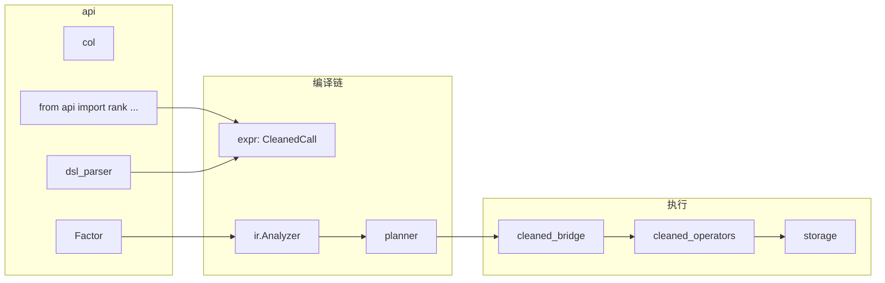

# `api` — 用户接口层

本目录是 **研究员、挖掘框架与 factor_engine 交互的唯一 Python 入口**：提供列引用、因子对象、DSL 解析，以及 **全部算子的工厂函数**（构造 `Expr`，不在此目录做数值计算）。

> **第 31 版（cleaned 全量接入）**：原 **`api/operators/`** 子包已删除。算子工厂统一由 **`cleaned_ops.make_cleaned_call_factory`** + **`operator_registry.build_dsl_allowlist()`** 驱动，runtime 实现在 **`cleaned_operators/`**。  
> **挖掘侧主教程**：[`docs/算子与导入教程.md`](../docs/算子与导入教程.md)

### 协作者速览（约 5 分钟）

1. **你能得到什么**：`col()`、`Factor`、`parse_expr` / `parse_factor`、**`from api import rank, ts_mean, …`**（500+ 算子名）。  
2. **本目录不负责**：pandas 求值（`backend/`）、读 parquet（`storage/`）、一键运行（`runtime/FactorEngine`）。  
3. **算子能否投递**：[`docs/dsl_operators_reference.md`](../docs/dsl_operators_reference.md)；参数语义 [`docs/operators_semantics.md`](../docs/operators_semantics.md)；catalog 审计 [`cleaned_operators/docs/operators_catalog.md`](../cleaned_operators/docs/operators_catalog.md)。

---

## 1. 在全局架构中的位置



- **`api`**：公式「长什么样」——合法的 `Expr` 树与 DSL 字符串。  
- **`cleaned_operators`**：公式「怎么算」——`OperatorRegistry.calculate()` on wide panel。  
- 二者 **不重复**：`api` 是薄包装，不含 rolling/rank 等实现代码。

---

## 2. 文件说明

| 文件 | 职责 |
|------|------|
| [`columns.py`](columns.py) | `col(name)` → `ColumnRef` |
| [`factor.py`](factor.py) | `Factor` 数据类：`name`, `expr`, `freq`, `universe`, `description` |
| [`dsl_parser.py`](dsl_parser.py) | `parse_expr` / `parse_factor`；白名单来自 `build_dsl_allowlist()` |
| [`cleaned_ops.py`](cleaned_ops.py) | `make_cleaned_call_factory(op_name)` → `CleanedCall` 节点 |
| [`operator_registry.py`](operator_registry.py) | `build_dsl_allowlist()` = `col` + 全部已实现 cleaned 算子（含别名） |
| [`__init__.py`](__init__.py) | 常用算子显式导出 + `__getattr__` 动态解析其余算子名 |

---

## 3. 怎么 import 算子

### 推荐

```python
from api.columns import col
from api.factor import Factor
from api import rank, ts_mean, delay, zscore
from api import SMA, MACD, group_rank, winsorize   # 动态白名单内任意名
from api.dsl_parser import parse_expr, parse_factor
```

### 查白名单

```python
from api.operator_registry import build_dsl_allowlist
sorted(build_dsl_allowlist().keys())
```

### 已废弃

```python
from api.operators import rank   # ❌ 目录不存在
import api.operators              # ❌
```

---

## 4. DSL 规则摘要

- 基于 `ast.parse(..., mode="eval")`。  
- 逻辑：**`and_` / `or_` / `not_`**（不能写 `and` / `or` / `not`）。  
- **字段**：字符串/manifest 用裸名 `close`；Python 拼 Expr 用 `col("close")` 或 `parse_factor("...")`。
- 比较：`close > open` 或 `col("a") < col("b")`；**不支持链式比较**。  
- 四则：`+ - * /` 或 `add` / `subtract` / `multiply` / `divide`。  
- 仅 **已实现 pandas runtime** 的算子名可解析；见 `build_dsl_allowlist()`。

---

## 5. 典型用法

**手写 Expr：**

```python
from api import rank, ts_mean
from api.columns import col
from api.factor import Factor

factor = Factor(name="m", expr=rank(ts_mean(col("close"), 5)))
```

**字符串（YAML / manifest）：**

```yaml
factor:
  expr: rank(ts_mean(col("close"), 5))
```

```python
from api.dsl_parser import parse_factor
factor = parse_factor('rank(ts_mean(col("close"), 5))', name="m")
```

**禁止**：在 `api` 层直接读 parquet；须 **`FactorEngine` + `DataSource`**（推荐 **`type: data_access`**，见 [`mining_integration.py`](mining_integration.py)）。

---

## 5.1 挖掘默认数据源（`mining_integration`）

Campaign / 回测配置中的 **`data_source`** 应优先使用 preset，避免手写路径：

```python
from api.mining_integration import (
    default_mining_data_source_presets,
    default_us_sip_day_ratios_composite_config,
    default_us_stocks_sip_day_aggs_data_source_config,
)

# 单表 SIP 日 K
cfg = default_us_stocks_sip_day_aggs_data_source_config(
    start_date="2024-01-01",
    end_date="2024-12-31",
)

# 价量 + 财务比率 asof（PiT 安全）
composite = default_us_sip_day_ratios_composite_config()

# 全部 preset（契约 CI / 文档）
all_presets = default_mining_data_source_presets()
```

- 机器可读快照：[`docs/mining_data_source_presets.json`](../docs/mining_data_source_presets.json)  
- Registry 契约：[`scripts/validate_datasets_mining_alignment.py`](../scripts/validate_datasets_mining_alignment.py)  
- 数据集 schema：[`data_access/config/datasets.yaml`](../../data_access/config/datasets.yaml)

---

## 6. 扩展新算子（维护者）

1. 在 **`cleaned_operators/`** 实现并 `OperatorRegistry.register(...)`。  
2. 可选：在 **`cleaned_operators/_aliases.py`** 增加 DSL 别名。  
3. **`build_dsl_allowlist()` 自动收录**（无需改 `api/operators`）。  
4. 重启或新建 **`PandasBackend()`** 以注册新 kernel。  
5. 补测试：[`tests/test_cleaned_operators_comprehensive.py`](../tests/test_cleaned_operators_comprehensive.py) 中 `TestFutureOperatorExtension` 模式。

---

## 7. 测试

| 测试文件 | 覆盖 |
|----------|------|
| `tests/test_dsl_parser.py` | DSL 解析 |
| `tests/test_expr.py` | Expr 构造 |
| `tests/test_cleaned_operators_comprehensive.py` | API + 全链路 |
| `tests/test_cleaned_integration.py` | 冒烟 |

---

## 8. 延伸阅读

| 文档 | 内容 |
|------|------|
| [`docs/算子与导入教程.md`](../docs/算子与导入教程.md) | **挖掘侧主教程** |
| [`docs/mining_data_source_presets.json`](../docs/mining_data_source_presets.json) | mining preset 快照 |
| [`mining_integration.py`](mining_integration.py) | 默认 data_source / composite |
| [`cleaned_operators/README.md`](../cleaned_operators/README.md) | 算子实现库 |
| [`expr/README.md`](../expr/README.md) | `CleanedCall` AST |
| [`runtime/README.md`](../runtime/README.md) | `FactorEngine` |
