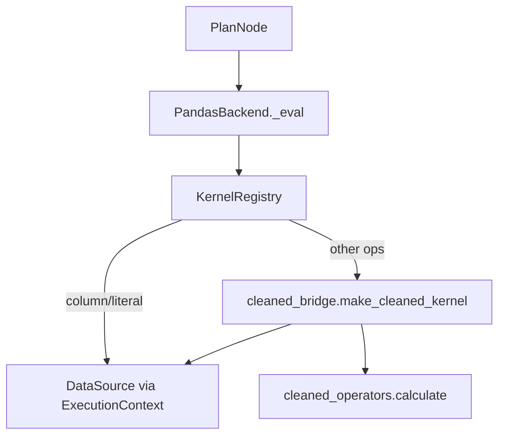

# `backend` — 执行后端

本目录将 **`PlanNode`** 求值为 **`(timestamp, instrument)` MultiIndex Series**。

> **第 31 版**：`PandasBackend` 已 **完全委托** `cleaned_operators`（[`cleaned_bridge.py`](cleaned_bridge.py)）。原 2700+ 行原生 kernel 已移除；`numba_kernels.py` 等遗留文件不再被主路径引用。

### 协作者速览

1. **主路径**：`PandasBackend` + `KernelRegistry`（`column` / `literal` + 全部 cleaned 算子）。  
2. **PolarsBackend**：当前 **委托** `PandasBackend`（同一 cleaned 路径）。  
3. **不负责**：DSL（`api`）、Expr（`expr`）、计划优化（`planner`）。

---

## 1. 执行路径

- **`ExecutionContext`**（[`context.py`](context.py)）：`data_source`、可选 `cache`、`shared_result_cache`（`run_many` CSE）、`perf`。  
- **Series 形态**：MultiIndex `(timestamp, instrument)`；cleaned 内部转为 **宽表 panel**。

---

## 2. 核心文件

| 文件 | 说明 |
|------|------|
| [`base.py`](base.py) | `Backend` 抽象接口 |
| [`pandas_backend.py`](pandas_backend.py) | 注册 `column`、`literal` + `list_cleaned_ops_for_backend()` 全部算子 |
| [`cleaned_bridge.py`](cleaned_bridge.py) | panel 转换、`make_cleaned_kernel`、`build_cleaned_dsl_allowlist` |
| [`polars_backend.py`](polars_backend.py) | 委托 `PandasBackend` |
| [`sql_backend.py`](sql_backend.py) | SqlBackend：DuckDB / ClickHouse 子树下推 + Python fallback |
| [`duckdb_pushdown_backend.py`](duckdb_pushdown_backend.py) | `build_backend("duckdb_sql"|"clickhouse_sql")` 入口 |
| [`hybrid_backend.py`](hybrid_backend.py) | `build_backend("auto")`：SQL + Polars |
| [`factory.py`](factory.py) | `build_backend("pandas"|"polars"|"duckdb_sql"|"clickhouse_sql"|...)` |
| [`kernels.py`](kernels.py) | `KernelRegistry`（op → callable） |
| [`debug_backend.py`](debug_backend.py) | 打印计划，不算数 |
| [`pandas_compat.py`](pandas_compat.py) | 可选 Modin |
| [`numba_kernels.py`](numba_kernels.py) | **遗留**；cleaned 主路径未使用 |

---

## 3. 新增算子（维护者）

1. 在 **`cleaned_operators/`** 注册实现。  
2. **重启** / 新建 `PandasBackend()` — 初始化时 `list_cleaned_ops_for_backend()` 自动注册。  
3. **无需** 再改 `pandas_backend.py` 手写 `_op_*`。

---

## 4. 环境变量

见 [`runtime/perf_config.py`](../runtime/perf_config.py)：`FACTOR_ENGINE_USE_MODIN`、`FACTOR_ENGINE_DISABLE_CSE` 等。

---

## 5. 测试

- `tests/test_pandas_backend.py`  
- `tests/test_cleaned_operators_comprehensive.py`  
- `tests/test_polars_backend.py`

---

## 6. 延伸阅读

- [`cleaned_operators/README.md`](../cleaned_operators/README.md)  
- [`docs/operators_semantics.md`](../docs/operators_semantics.md)
