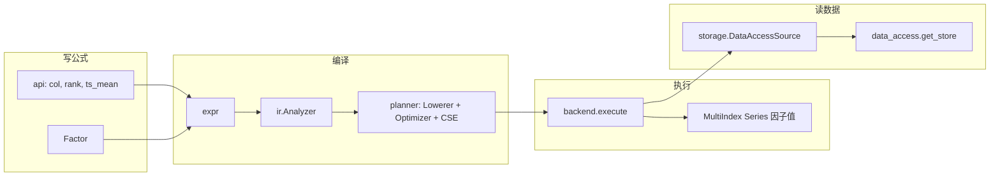

# Factor Engine 完全指南

> **给完全不了解 factor_engine 的读者**：本文是本模块 **推荐入口**。读完后应能回答：它是什么、怎么装、数据怎么流、怎么跑第一个因子、怎么起 HTTP 服务、代码从哪读起。
>
> **仓库**：https://github.com/HKUST-QUANT-SOCIETY/factor_engine  
> **读数层**：https://github.com/HKUST-QUANT-SOCIETY/data_access  
> **预计阅读时间**：通读约 30 分钟；只看 §1–§6 约 10 分钟可动手跑示例。

**文档关系**：本文 = 本模块总览 · 细节见 [`README.md`](../README.md) · **HTTP 完整说明**见 [`service/README.md`](../service/README.md) · 源码注释见 [`源码注释导读.md`](源码注释导读.md) · 写公式见 [`算子与导入教程.md`](算子与导入教程.md)

---

## 1. 它是什么（一句话）

**Factor Engine** 是量化 monorepo（`quant_projects`）里的 **因子计算引擎**：你把公式写成 DSL（如 `rank(ts_mean(close, 20))`），引擎从 **`data_access`**（磁盘目录 `dataaccess/`）读行情，在 **时间 × 标的** 网格上算出因子值（`pandas.Series`，MultiIndex），可选 **落盘到因子湖**（`factor_lake`）。

**它不负责**：数据清洗（`raw_data_layer`）、因子评估/回测业务（`backtest_layer`）、模型训练——只负责 **算因子** 和 **写因子湖**。

---

## 2. 在 monorepo 里的位置

```text
quant_projects/
├── dataaccess/           ← 统一读 parquet（包名 data_access）
├── factor_engine/        ← 【本模块】算因子
├── ashare_lqtp_kit/      ← A 股 LQTP 因子评估 / 报告示例
├── scripts/              ← 落盘、校验等运维脚本
└── data/
    └── factors/lake/     ← 因子湖落盘目录（hive: factors/{factor_id}/year=*/data.parquet）
```

**典型生产链路**：

```text
COS 清洗数据 → data_access 读 ashare_stock_daily
            → factor_engine 算因子
            → factor_lake_staging（暂存）
            → publish → factor_lake（全员只读）
            → 模型/研究用 data_access 读 factor_lake
```

---

## 3. 五个核心概念（必记）

| 概念 | 是什么 | 代码里在哪 |
|------|--------|------------|
| **Factor（因子）** | 名字 + 一条公式（Expr 树） | `api/factor.py` → `Factor(name=..., expr=...)` |
| **Expr（表达式）** | 公式的 AST，不算数 | `expr/`：`ColumnRef`、`Literal`、`CleanedCall` |
| **Plan（计划）** | 编译后的算子树，给后端执行 | `planner/logical_plan.py` → `PlanNode` |
| **Backend（后端）** | 真正做数值计算（Pandas/Polars/SQL） | `backend/`，入口 `build_backend("auto")` |
| **DataSource（数据源）** | 按列名读行情/因子 | `storage/`，默认 `DataAccessSource` |

**算子只在一个地方实现**：`cleaned_operators/`。`api` 里的 `rank`、`ts_mean` 只是 **造表达式** 的工厂，不算数。

---

## 4. 架构与数据流

### 4.1 编译 + 执行（主路径）



### 4.2 编排入口

所有「跑因子」的高级 API 都在 **`runtime/engine.py`** 的 **`FactorEngine`**：

| 方法 | 用途 |
|------|------|
| `engine.run(factor)` | 单因子：编译 + 执行 |
| `engine.run_many(factors)` | 多因子 + 公共子表达式缓存（CSE） |
| `FactorEngine.run_from_config(yaml)` | YAML 一键跑（推荐运维/研究员） |
| `engine.materialize(factor)` | 算完并落盘到因子湖 |

### 4.3 后端选型（生产默认 `auto`）

| backend | 说明 |
|---------|------|
| `pandas` | 最稳：宽表 panel + `cleaned_operators` |
| `polars` / `polars_long` | 更快：长表 LazyFrame 或 Polars expr |
| `duckdb_sql` / `clickhouse_sql` | 子树 SQL 下推到 DuckDB/CH |
| **`auto`** | 自动：能 SQL 下推的走 SQL，否则 Polars，再 fallback Pandas |

详见 [`backend/README.md`](../backend/README.md)、[`docs/sql_pushdown_coverage.md`](sql_pushdown_coverage.md)。

---

## 5. 目录地图（读代码用）

| 目录 | 干什么 | 新人优先读 |
|------|--------|------------|
| [`api/`](../api/README.md) | DSL 入口、`parse_expr`、`Factor` | `__init__.py`、`factor.py`、`dsl_parser.py` |
| [`expr/`](../expr/README.md) | 表达式 AST | `base.py`、`cleaned_call.py` |
| [`ir/`](../ir/README.md) | Expr → IR，推导 lookback | `analyzer.py` |
| [`planner/`](../planner/README.md) | IR → Plan，CSE 优化 | `lowerer.py`、`cse.py`、`optimizer.py` |
| [`backend/`](../backend/README.md) | 执行后端 | `factory.py`、`pandas_backend.py`、`hybrid_backend.py` |
| [`cleaned_operators/`](../cleaned_operators/README.md) | **算子实现** | `registry.py`、`base.py`、`common/time_series.py` |
| [`runtime/`](../runtime/README.md) | **FactorEngine 编排** | `engine.py`、`config.py`、`perf_config.py` |
| [`storage/`](../storage/README.md) | 读/写/落盘 | `factory.py`、`data_access_source.py`、`materializer.py` |
| [`cache/`](../cache/README.md) | L0–L3 执行期缓存 | `session.py` |
| [`scripts/`](../scripts/README.md) | manifest 导出、覆盖率报告 | 按需 |
| [`examples/`](../examples/README.md) | 可运行示例 | `simple_factor.py` |
| [`tests/`](../tests/README.md) | 测试布局 | parity / golden 目录 |

---

## 6. 十分钟上手：三种跑法

### 6.1 环境

```bash
git clone https://github.com/HKUST-QUANT-SOCIETY/factor_engine.git
cd factor_engine
pip install -e .
export PYTHONPATH=.:${PYTHONPATH}
# 读数推荐同时安装：
# pip install "data-access @ git+https://<TOKEN>@github.com/HKUST-QUANT-SOCIETY/data_access.git"
```

### 6.2 方式 A：Python 最小示例

```python
from api import col, rank, ts_mean
from api.factor import Factor
from backend.factory import build_backend
from runtime.engine import FactorEngine
from storage.factory import build_data_source

source = build_data_source({
    "type": "data_access",
    "dataset": "ashare_stock_daily",
    "fields": {"close": "Close", "open": "Open"},
    "start_date": "2024-01-01",
    "end_date": "2024-03-31",
})
engine = FactorEngine(backend=build_backend("auto"), data_source=source)

factor = Factor(name="mom20_rank", expr=rank(ts_mean(col("close"), 20)))
out = engine.run(factor)
print(out["result"].head())   # MultiIndex Series: (TradeDate, Symbol) → value
```

完整脚本：[`examples/simple_factor.py`](../examples/simple_factor.py)

### 6.3 方式 B：YAML 配置（不写 Python）

```yaml
# examples/config_driven_factor.yaml 结构示意
factor:
  name: my_factor
  expr: "rank(ts_mean(close, 20))"
data_source:
  type: data_access
  dataset: ashare_stock_daily
  fields:
    close: Close
  start_date: "2024-01-01"
  end_date: "2024-03-31"
backend:
  type: auto
engine:
  enable_cache: true
```

```python
from runtime.engine import FactorEngine
FactorEngine.run_from_config("examples/config_driven_factor.yaml")
```

### 6.4 方式 C：CLI 批量 pipeline

```bash
python run_pipeline.py run examples/configs/your_factor.yaml
python run_pipeline.py run-dir examples/configs/   # 目录批量
```

详见 [`runtime/README.md`](../runtime/README.md) §8、[`run_pipeline.py`](../run_pipeline.py) `--help`。

---

### 6.5 方式 D：HTTP 服务

仓库路径：https://github.com/HKUST-QUANT-SOCIETY/factor_engine  
完整接口契约（请求体 / 轮询 / 环境变量）：[`service/README.md`](../service/README.md)

```bash
git clone https://github.com/HKUST-QUANT-SOCIETY/factor_engine.git
cd factor_engine
pip install -e ".[service]"
PYTHONPATH=. factor-engine-serve --host 0.0.0.0 --port 8088
```

| 方法 | 路径 | 用途 |
|------|------|------|
| GET | `/health` | 存活 |
| GET | `/factor-engine/operators` | DSL 白名单 |
| POST | `/factor-engine/validate-spec` | 校验公式（不跑数） |
| POST | `/factor-engine/jobs/compute` | 提交计算 |
| POST | `/factor-engine/jobs/materialize` | 提交物化 |
| GET | `/factor-engine/jobs/{run_id}` | 查状态 |
| GET | `/factor-engine/jobs/{run_id}/artifacts` | 查产物 |

```bash
curl -s localhost:8088/health
curl -s -X POST localhost:8088/factor-engine/validate-spec \
  -H 'content-type: application/json' \
  -d '{"formula":"rank(ts_mean(close, 5))"}'
```

读数数据集仍由 **data_access** 提供：https://github.com/HKUST-QUANT-SOCIETY/data_access （其 HTTP 读数服务见该仓 `docs/用户使用手册.md` §10）。

---

## 7. 公式怎么写（DSL 规则摘要）

1. **列名**：`close`、`volume`（小写逻辑名；YAML 里用 `fields` 映射到 parquet 列如 `Close`）
2. **算子**：`ts_mean(x, 20)`、`rank(x)`、`delay(x, 1)` — 见 [`dsl_operators_reference.md`](dsl_operators_reference.md)
3. **四则**：`close / open`、`2 * close`（自动包成 `add`/`multiply` 等算子）
4. **白名单**：只有 `build_dsl_allowlist()` 里的名字能 `parse_expr`；华泰/WQ 旧写法必须改

**详细教程**：[`算子与导入教程.md`](算子与导入教程.md) · **参数语义**：[`operators_semantics.md`](operators_semantics.md)

---

## 8. 数据从哪来、因子写去哪

### 8.1 读数据（经 data_access）

- 仓库：https://github.com/HKUST-QUANT-SOCIETY/data_access
- 登记在该仓 `config/datasets.yaml`
- A 股日线：`ashare_stock_daily`（`TradeDate` + `Symbol`）
- 已发布因子：`factor_lake`，参数 `factor_id=gtja191_alpha_001`

**禁止**业务代码直接 `pd.read_parquet`；统一 `get_store().read_frame(...)`。详见 data_access 仓 README / `docs/用户使用手册.md`。

### 8.2 写因子（落盘）

```text
engine.materialize(factor)
  → storage/materializer.py
  → 本地 lake 或 factor_lake_staging（upsert）
  → lake_publish.publish_factor_lake() → factor_lake
```

生产 profile：[`examples/profiles/prod.yaml`](../examples/profiles/prod.yaml)

---

## 9. 我是谁、该读什么（角色表）

| 角色 | 目标 | 必读文档 |
|------|------|----------|
| **完全新人** | 建立全局认识 | **本文** → [`examples/simple_factor.py`](../examples/simple_factor.py) |
| **研究员** | 写 YAML 跑因子 | 本文 §6–§7 → [`算子与导入教程.md`](算子与导入教程.md) |
| **挖掘/投递** | 产 manifest JSON | [`miner_delivery_spec.md`](miner_delivery_spec.md) → [`dsl_operators_reference.md`](dsl_operators_reference.md) |
| **算子开发** | 新增/改算子 | [`cleaned_operators/README.md`](../cleaned_operators/README.md) → [`operators_semantics.md`](operators_semantics.md) |
| **平台/运维** | 批量落盘、对账、HTTP | [`service/README.md`](../service/README.md) · [`runtime/README.md`](../runtime/README.md) · [`examples/profiles/prod.yaml`](../examples/profiles/prod.yaml) |
| **读源码** | 理解实现 | [`源码注释导读.md`](源码注释导读.md) → 各包 README |

---

## 10. 读源码推荐顺序

1. [`examples/simple_factor.py`](../examples/simple_factor.py) — 看调用链
2. [`runtime/engine.py`](../runtime/engine.py) — `run()` / `compile()`
3. [`ir/analyzer.py`](../ir/analyzer.py) — Expr 怎么变 IR
4. [`planner/lowerer.py`](../planner/lowerer.py) + [`planner/cse.py`](../planner/cse.py)
5. [`backend/pandas_backend.py`](../backend/pandas_backend.py) + [`backend/cleaned_bridge.py`](../backend/cleaned_bridge.py)
6. [`cleaned_operators/registry.py`](../cleaned_operators/registry.py) — 算子注册
7. [`storage/data_access_source.py`](../storage/data_access_source.py) — 怎么读列

---

## 11. 常见问题

**Q：import 到了错误的 api？**  
A：确认 `PYTHONPATH` 含 `factor_engine` 根目录，且 `python -c "import api; print(api.__file__)"` 指向本仓库。

**Q：parse_expr 报 unknown operator？**  
A：算子未注册或不在白名单；查 [`dsl_operators_reference.md`](dsl_operators_reference.md)，或改 `cleaned_operators` 注册。

**Q：因子全是 NaN？**  
A：检查 `fields` 映射、日期范围、lookback 是否够长；A 股列名常为 `Close`/`Symbol` 而非 `close`/`ticker`。

**Q：生产用什么 backend？**  
A：YAML 里 `backend.type: auto`；环境变量见 [`runtime/perf_config.py`](../runtime/perf_config.py)。

**Q：和 gtja191 / GTJA185 什么关系？**  
A：`gtja191/` 是 **因子公式库**（投递 **185** 条，AutoFactor pack 名 `gtja185`）。须用 **`dsl_surface=compat`** 解析；campaign 的 `data_source` 为 `{local,cos}`，执行读数走 `data_access`。落盘：`scripts/materialize_gtja191_factors.py` 或包内 `run_materialize.py`。

**Q：pytest 失败 FACTOR_LAKE_ROOT？**  
A：测试前 `unset FACTOR_LAKE_ROOT`，避免污染 `data_access` 路径。

---

## 12. 文档索引（全书目）

### 入门与规范

| 文档 | 用途 |
|------|------|
| **本文** | 零基础总览 |
| [`源码注释导读.md`](源码注释导读.md) | 源码注释约定、覆盖进度 |
| [`算子与导入教程.md`](算子与导入教程.md) | DSL 写法、import、角色分流 |
| [`miner_delivery_spec.md`](miner_delivery_spec.md) | 挖掘投递 JSON 契约 |

### 算子与语义

| 文档 | 用途 |
|------|------|
| [`dsl_operators_reference.md`](dsl_operators_reference.md) | 白名单与替代写法 |
| [`operators_semantics.md`](operators_semantics.md) | 参数、窗口、限制 |
| [`cleaned_operators/docs/operators_catalog.md`](../cleaned_operators/docs/operators_catalog.md) | 全量算子 catalog |

### 架构与运维

| 文档 | 用途 |
|------|------|
| [`sql_pushdown_coverage.md`](sql_pushdown_coverage.md) | SQL 下推算子清单 |
| [`backend_coverage.md`](backend_coverage.md) | Polars/SQL/Pandas 覆盖（自动生成） |
| [`canonical_data_fields.md`](canonical_data_fields.md) | manifest 字段 ↔ parquet 列 |
| [`changelog_shw.md`](changelog_shw.md) | 分版变更记录 |

### HTTP / 对接

| 文档 | 用途 |
|------|------|
| [`service/README.md`](../service/README.md) | **HTTP 服务完整使用**（HKUST 仓路径、接口、curl） |
| [`IT_HANDOFF.md`](archive/IT_HANDOFF.md) | IT 对接与服务化边界 |
| [`INTERFACE.md`](archive/INTERFACE.md) | 模块级接口清单 |
| https://github.com/HKUST-QUANT-SOCIETY/data_access | 读数层与其 HTTP `/v1/read` |

### 包内 README

根 [`README.md`](../README.md) · [`service/`](../service/README.md) · [`api/`](../api/README.md) · [`backend/`](../backend/README.md) · [`runtime/`](../runtime/README.md) · [`storage/`](../storage/README.md) · [`planner/`](../planner/README.md) · [`cleaned_operators/`](../cleaned_operators/README.md) · [`docs/README.md`](README.md)

---

## 13. 下一步

- **跑通示例**：`python examples/simple_factor.py`
- **改一个公式**：复制 `examples/` 下 YAML，改 `factor.expr`
- **查算子**：`grep` [`dsl_allowlist.json`](dsl_allowlist.json) 或读 catalog
- **深入模块**：打开对应目录 `README.md` + 源码 docstring（已批量补中文注释）

如有疑问，Slack `#quant-platform` 或查 [`docs/changelog_shw.md`](changelog_shw.md) 看近期改动。
