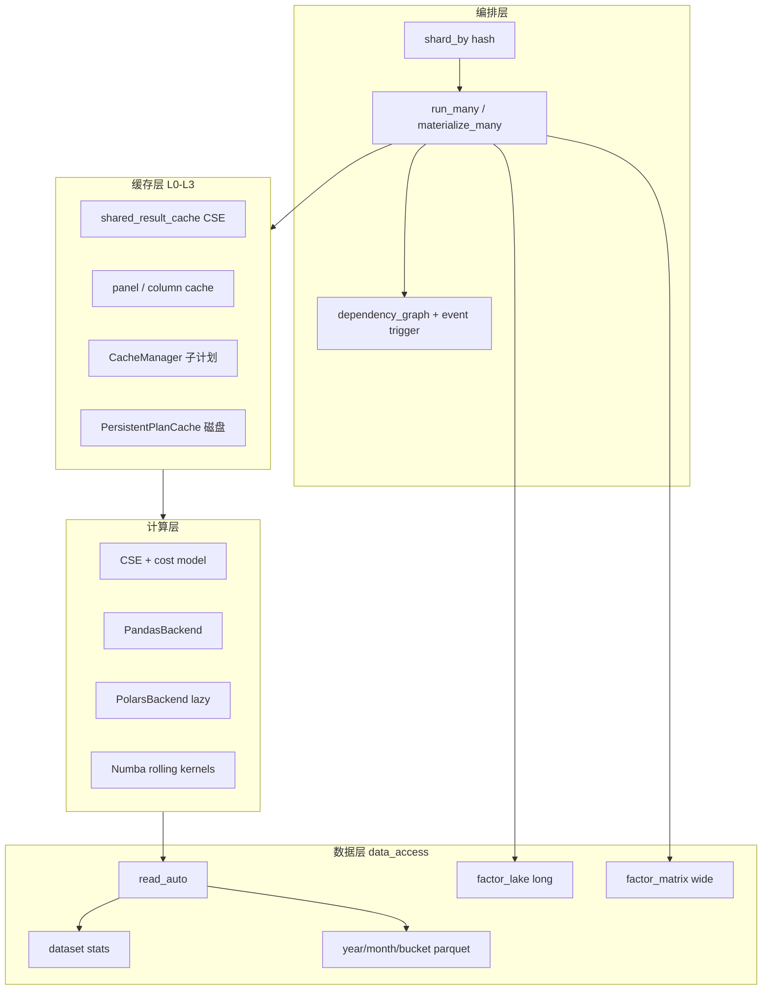

# 因子平台「更快更好」完整规划

> 目标：从「单次 DuckDB 查询优化」转向「批量因子生产优化」。  
> 核心判断：**DuckDB 只是读引擎**；整体速度取决于 **少读、少算、复用、分片、增量、正确布局**。  
> 对照基线：2026-07 代码库（Phase 19–20 部分已落地，见下表）。

---

## 现状对照（15 点）

| # | 能力 | 现状 | 评级 | 主要 Gap |
|---|------|------|------|----------|
| 1 | run_many 批处理 / CSE | prod 默认 `batched_engine` + rolling CSE | 🟢 | 极个别 pandas-only 算子仍无 CSE |
| 2 | 分层 Column/Panel Cache | `cache/panel_cache` + `expression_cache` + ReadSession | 🟢 | snapshot key 可再细化 |
| 3 | Parquet 物理分区 | bucket ETL 脚本 + `bucket_values` 剪枝 | 🟡 | 生产数据集未全量切 bucket layout |
| 4 | Factor Lake 双格式 | long + `materialize_matrix` + `ResultStore.load_matrix` | 🟢 | 训练路径 adoption |
| 5 | 依赖图 + 增量 by event | `DependencyCatalog` + event queue + incremental | 🟢 | 长期 worker 运维 playbook |
| 6 | Rolling 算子分级 | `OperatorCost` + Numba ts_mean/std/rank/corr | 🟡 | 更多 ts_* numba 覆盖 |
| 7 | 真 PolarsBackend | lazy scan 读路径 + Polars ts_* | 🟡 | 算子层 LazyFrame 端到端 |
| 8 | input_dq/prefetch 去重 | ReadSession + stats 动态阈值 | 🟢 | — |
| 9 | Dataset Statistics | sidecar + `column_null_ratio` | 🟢 | instruments 精确计数可选 |
| 10 | read_auto 路由 | read_auto + query budget production gate | 🟢 | join 路由 |
| 11 | Research vs Production 硬策略 | `production_policy` + SELECT * 禁 | 🟢 | large job pandas fallback 告警 |
| 12 | Operator cost model | `OperatorCost` + routing + plan_costs | 🟡 | Optimizer 读 cost 调度 |
| 13 | 分片物化 | `materialize_sharded` factor_id/asset_bucket/time_month | 🟢 | CLI 批量 shard 编排 |
| 14 | Perf regression | thresholds.yaml + nightly smoke/slow | 🟡 | 真实 parquet 1M/10M fixture |
| 15 | 四阶段路线 | Phase A–D 大部分落地 | 🟢 | 文档与生产 adoption |

图例：🟢 可用 · 🟡 有骨架需深化 · 🔴 未开始

---

## 目标架构（逻辑分层）



---

## 四阶段路线图

### Phase A — 减少无效重复（4–6 周，最高 ROI）

**目标**：1000 因子批跑时，列 IO 与重复子表达式趋近 1 次。

| 任务 | 做什么 | 改哪些 | 验收 |
|------|--------|--------|------|
| A1 run_many 生产主路径 | prod profile 默认 `run_many_from_config(batch)`；文档/CLI 弃用逐因子 loop | `examples/profiles/prod.yaml`, `pipeline.py`, `config_runtime.py` | 同 scope 100 因子：1 次 `load_columns` 批次（测试计数） |
| A2 统一 ReadSession | `DataSourceReadSession.load_columns_once`；cache key = dataset+cols+time_range+filter+snapshot | `storage/read_session.py`, `data_access_source.py`, `engine._prepare_batch_data` | input_dq + prefetch + execute 合计 1 次 IO |
| A3 CSE 深化 | 相同 `(op, attrs, inputs)` + 相同 rolling window 跨因子共享；`plan_ref` 覆盖 ts_mean 等 | `planner/cse.py`, `planner/rolling_cache.py`（新） | alpha1/2/3 共享 `ts_mean(close,20)` 只算 1 次 |
| A4 cache 模块化 | 拆 `factor_engine/cache/{column,panel,expression,rolling,cache_policy}.py` | 从 `storage/cache.py` 迁移 | L2 命中可观测；key 含 snapshot |
| A5 production 硬开关 | production 强制：query_budget、input_dq、auto_warmup、禁 SELECT * | `runtime/production_policy.py`（新）, `store.py`, `engine.run` | research 可 `*`；production raise |

**依赖**：无；可与 Phase B 并行 B7/B8。

---

### Phase B — 数据布局加速（6–8 周）

**目标**：分钟级读一批标的 + 一月数据，文件数与扫描量下降一个数量级。

| 任务 | 做什么 | 改哪些 | 验收 |
|------|--------|--------|------|
| B1 分区策略 YAML | `layout_policy: {partition: [year,month,bucket], bucket_size: 64}` | `datasets.yaml`, `registry.py`, `data_access/layout_policy.py`（新） | 新写入按 bucket 落盘 |
| B2 分钟数据集迁移 | `ashare_stock_minute` 等：`year/month/bucket=*` | `datasets.yaml`, ETL/清洗 job | read_auto 估行下降；pruning 测试 |
| B3 read 路径 bucket 剪枝 | `_build_select_sql` + `instrument_filter` → bucket 推导 | `store.py`, `predicate.py` | filter 100 标的只读 ~2 个 bucket |
| B4 factor_lake wide matrix | `factor_matrix_materializer.py`；universe×freq×year/month | `storage/`, `datasets.yaml` `factor_matrix` | 300 因子 wide 一次 read，无 pivot |
| B5 单因子 wide（已有） | `storage_format=wide` 生产默认可选 | 已完成 Phase 19 | round-trip 测试 |
| B6 stats 持久化 | stats sidecar JSON/SQLite；cron 刷新 footer | `data_access/stats.py`, `scripts/refresh_dataset_stats.py` | stats 含 num_rows/files/min/max |
| B7 read_auto v2 | 接 stats + query_budget；大表 stream，lazy 走 polars | `store.read_auto` | 10M 行自动 stream |
| B8 DQ 动态阈值 | input_dq 读 stats.null_ratio 设阈值 | `runtime/input_dq.py` | 脏数据集 strict 失败 |

**依赖**：B3 依赖 B1；B4 可与 B1 并行。

---

### Phase C — 计算后端升级（8–10 周）

**目标**：rolling 热点算子 Tier 0–2；Polars 覆盖 20% 算子且端到端 lazy。

| 任务 | 做什么 | 改哪些 | 验收 |
|------|--------|--------|------|
| C1 算子 Tier 路由 | `OperatorCost` + `select_backend(op, N, W)` | `operator_policy.py`, `backend/routing.py`（新） | ts_mean→bottleneck/numba；ts_rank→numba |
| C2 Numba rolling | ts_rank, ts_std, ts_corr 核心路径 | `cleaned_operators/common/numba_kernels.py` | 与 pandas 对齐测试 |
| C3 Polars Phase 1 | 已有 ts 算子；补 sub/mul/div lazy | `polars_backend.py`, `polars_ops.py` | 与 pandas rtol 1e-10 |
| C4 Polars Phase 2 | ts_corr, group_rank, neutralize | cleaned_operators | enterprise gate ≥95 |
| C5 Polars Phase 3 lazy | `scan_polars` → LazyFrame 计划 → collect | `backend/polars_lazy.py`（新）, `data_access_source` | 无 pandas 中间态 |
| C6 Optimizer + cost | 贵算子拆 batch；中间结果写 L2 | `planner/optimizer.py` | neutralize 大 K 自动分块 |

**依赖**：C5 依赖 B7；C1 可先做。

---

### Phase D — 生产调度（6–8 周）

**目标**：数据更新 → 最小重算；分片物化；性能不退化。

| 任务 | 做什么 | 改哪些 | 验收 |
|------|--------|--------|------|
| D1 依赖 catalog | 物化/run 时写入 `factor_dependency` 表 | `storage/catalog.py`, `runtime/dependency_catalog.py`（新） | close 更新 → 查询 300 依赖因子 |
| D2 增量 by event | `DataEvent(column, date)` → 计算 lookback 窗口 → materialize_incremental_many | `runtime/incremental_scheduler.py`（新） | 模拟 close 更新只重算 tail |
| D3 materialize_sharded | `engine.materialize_sharded(factors, shard_by, num_shards)` | `runtime/shard_materialize.py`, `engine.py` | 64 shard 可并行 CLI |
| D4 pipeline 接 shard | `run_pipeline --shard-index` 已有；物化同样 | `pipeline.py`, `run_pipeline.py` | 多分片无重复 factor_id |
| D5 perf 基准套件 | `tests/performance/{1m,10m}_rows/` + 指标 JSON | `tests/performance/`, CI nightly workflow | PR smoke + nightly 阈值 |
| D6 batch_graph 驱动调度 | `parallel_layers` → job 拆分 | `planner/dependency_graph.py`, pipeline | 列冲突因子串行、无冲突并行 |

**依赖**：D2 依赖 D1；D3 可先做（已有 `shard_factor_ids`）。

---

## 15 点逐项实施指南

### 1. 因子计算批处理（run_many 生产化）

**已完成**：CSE、`run_many` batch input_dq、`_prepare_batch_data`、`run_many_from_config` 分组。

**待做**：
1. `prod.yaml`：`pipeline.batched_engine: true` 为默认
2. `planner/rolling_cache.py`：对 `(column, window, op)` 注册共享子计划
3. `materialize_many_from_config(batch_run=True)` 文档标为唯一推荐路径
4. 测试：`test_run_many_production.py` 扩展 100 因子 mock 计数

---

### 2. Column / Panel Cache 生命周期

**已完成**：`ExecutionCacheSession`、L0–L3 枚举、`DataAccessSource._column_cache`。

**待做**：
```
factor_engine/cache/
├── column_cache.py      # key: dataset+field+time_range+filter+snapshot
├── panel_cache.py       # Series id → panel
├── expression_cache.py  # plan_cache_key → Series
├── rolling_cache.py     # (col, window, op) → panel
└── cache_policy.py      # L1 仅 run_many；L3 跨进程 TTL
```
- `compute_data_scope()` 扩展含 `data_snapshot_id`
- production 默认 L3 路径：`PersistentPlanCache`

---

### 3. Parquet 物理布局

**已完成**：物化 `partition_policy` year/month；registry `partition_columns`。

**待做**：
1. `data_access/layout_policy.py`：`bucket_column=instrument`, `bucket_count=64`
2. 写入路径：`write_arrow(..., partition_by=[year,month,bucket])`
3. 读路径：`instrument_filter` → `bucket IN (...)` 谓词下推
4. 迁移 playbook：双写 → 校验 → 切读 → 删旧

**datasets.yaml 示例**：
```yaml
ashare_stock_minute:
  partition_columns: [year, month, bucket]
  layout_policy:
    bucket:
      column: instrument
      count: 64
```

---

### 4. Factor Lake 双格式

**已完成**：long canonical；单因子 `panel.parquet` wide。

**待做**：
1. 新增 `factor_matrix_materializer.py`
2. 数据集 `factor_matrix`：`datetime + asset + factor_*` 宽表
3. 接口：`engine.materialize_matrix(factor_ids, universe, freq)`
4. `ResultStore.load_matrix(universe, factor_ids)` 零 pivot

---

### 5. 依赖图 + 增量 by event

**已完成**：`planner/dependency_graph.py`、`analyze_batch`、`batch_graph`。

**待做**：
1. 物化时 `catalog.record_factor_dependency(factor_id, columns, lookback, dataset)`
2. `runtime/incremental_scheduler.py`：
   ```python
   def plan_updates(event: DataEvent) -> list[FactorUpdatePlan]:
       # max(lookback) per affected factor
   ```
3. 对接 watermark / staging publish 钩子

---

### 6. Rolling 算子分级

**已完成**：`OperatorCost` + `routing.py` + Numba ts_mean/std/rank/corr；production pandas fallback 告警。

---

### 7. PolarsBackend 三阶段

| 阶段 | 算子 | 状态 |
|------|------|------|
| 1 | col, 四则, rank, zscore, ts_mean/std/sum/delta | 🟢 |
| 2 | ts_corr, ts_rank | 🟡 group_rank/neutralize 仍 pandas |
| 3 | scan_polars 读 + execute_lazy | 🟡 算子层边界 collect |

---

### 8. input_dq / prefetch / execute 去重

**已完成**：ReadSession + batch input_dq + stats 动态阈值。

---

### 9. Dataset Statistics

**已完成**：`.data_access_stats.json` + `column_null_ratio` + `refresh_dataset_stats.py --with-null-ratio`。

---

### 10. read_auto

**已完成**：arrow/stream/polars + sidecar + query_budget production gate。

**待做**：多 dataset join → `sql_stream`。

---

### 11. Research vs Production 硬策略

**已完成** `runtime/production_policy.py`（SELECT * 禁、input_dq/auto_warmup/pit、stub 禁、pandas fallback 告警；`FACTOR_ENGINE_PRODUCTION_STRICT_POLARS=1` 可升级 fail）。

---

### 12. Operator cost model

**已完成**：`OperatorCost` + `plan_costs` + `planner/cost_summary.py` tier 直方图。

**待做**：Optimizer 读 cost 自动 cache/spill/shard。

---

### 13. 分片物化

**已完成**：`materialize_sharded`（factor_id / asset_bucket / time_month）+ CLI worker 分片。

**待做**：K8s CronJob 批量 shard 编排模板（见 `examples/ops/`）。

---

### 14. Performance Regression

**已完成**：`tests/perf/test_regression_gate.py` smoke.

**待做**：
```
tests/performance/
├── fixtures/           # 合成 1M/10M parquet
├── bench_read.py
├── bench_run_many.py
├── bench_materialize.py
└── thresholds.yaml     # nightly 阈值
```
- CI：PR 跑 smoke（现有）；nightly 跑完整 + 上传指标

---

### 15. 推荐执行顺序（与「马上 6 点」对齐）

| 优先级 | 项 | 阶段 | 预估 |
|--------|-----|------|------|
| P0 | run_many 生产化 + CSE 深化 | A | 2 周 |
| P0 | 统一 column cache（ReadSession key） | A | 1 周 |
| P1 | factor_matrix wide | B | 3 周 |
| P1 | year/month/bucket 分区 | B | 4 周 |
| P1 | Polars Phase 1–2 | C | 4 周 |
| P1 | stats + read_auto v2 | B | 2 周 |
| P2 | dependency catalog + incremental event | D | 3 周 |
| P2 | materialize_sharded | D | 2 周 |
| P2 | perf nightly | D | 2 周 |
| P3 | Polars lazy 端到端 | C | 4 周 |
| P3 | cost model + optimizer | C | 3 周 |

---

## 团队分工建议

| 小组 | 负责 Phase | 核心产出 |
|------|------------|----------|
| 因子引擎 | A, C, D1–D3 | run_many、cache、Polars、依赖 catalog |
| 数据平台 | B, 9–10 | layout、stats、read_auto、ETL 迁移 |
| 平台/QA | D5, 11 | perf CI、production policy 门禁 |

---

## 风险与原则

1. **先批后单**：新功能默认在 `run_many` 路径验收，再考虑 `run()`。
2. **布局迁移可回滚**：双写 + 对比 hash，禁止 in-place 改 published 数据。
3. **数值对齐**：Polars/Numba 路径必须有 pandas golden 测试。
4. **production 只加约束**：research 行为不破坏；用 `RunConfig.mode` 切换。
5. **不在 DuckDB 里做因子计算**：计算在 factor_engine；data_access 只读/写/路由。

---

## 文档维护

- 总路线图：`docs/enterprise_factor_engine_roadmap.md`（Phase 编号）
- 本文档：`docs/performance_platform_plan.md`（性能与生产专项）
- 完成一项：更新上表「现状对照」评级 + roadmap checkbox
